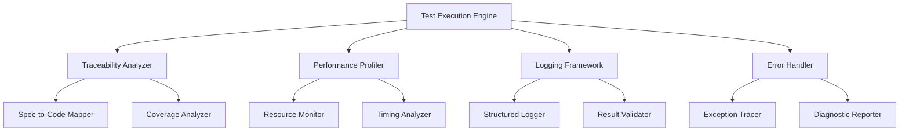

# Design Document

## Overview

This design implements a systematic test execution framework that ensures sub-30-second test performance while maintaining comprehensive logging, profiling, and full traceability. The system eliminates subprocess dependencies, provides complete artifact traceability, and enforces mandatory logging and profiling for all test operations.

## Architecture

### Core Components



### System Flow

1. **Test Discovery Phase**: Scoped discovery with traceability mapping
2. **Pre-execution Phase**: Setup logging, profiling, and traceability
3. **Execution Phase**: Run tests with comprehensive monitoring
4. **Post-execution Phase**: Validate results, generate reports
5. **Cleanup Phase**: Ensure complete cleanup and resource disposal

## Components and Interfaces

### 1. Test Execution Engine

**Purpose**: Orchestrates test execution with systematic monitoring and validation

**Interface**:
```python
class SystematicTestExecutor:
    def execute_test_suite(self, scope: TestScope) -> TestExecutionReport
    def validate_test_completeness(self, results: TestResults) -> ValidationReport
    def enforce_performance_limits(self, metrics: PerformanceMetrics) -> bool
```

**Key Responsibilities**:
- Enforce 30-second execution limits
- Coordinate logging, profiling, and traceability
- Validate test completeness and validity
- Generate comprehensive execution reports

### 2. Traceability Analyzer

**Purpose**: Maps all code artifacts to specifications and requirements

**Interface**:
```python
class TraceabilityAnalyzer:
    def map_code_to_specs(self, code_path: Path) -> TraceabilityMap
    def identify_orphaned_artifacts(self) -> List[OrphanedArtifact]
    def validate_implementation_coverage(self) -> CoverageReport
    def trace_requirement_to_tests(self, requirement_id: str) -> List[TestCase]
```

**Key Responsibilities**:
- Maintain complete artifact-to-specification mapping
- Identify untested or unspecified code
- Provide requirement-to-test traceability
- Generate coverage reports with traceability context

### 3. Performance Profiler

**Purpose**: Collects comprehensive performance metrics for all test operations

**Interface**:
```python
class SystematicProfiler:
    def start_profiling(self, test_id: str) -> ProfilingSession
    def record_method_call(self, method: str, args: Any, result: Any, duration: float)
    def capture_resource_usage(self) -> ResourceMetrics
    def generate_performance_report(self) -> PerformanceReport
```

**Key Responsibilities**:
- Profile CPU, memory, and I/O usage
- Track method call performance
- Enforce performance thresholds
- Generate detailed performance reports

### 4. Comprehensive Logging Framework

**Purpose**: Provides mandatory structured logging for all test operations

**Interface**:
```python
class SystematicLogger:
    def log_test_start(self, test_id: str, context: TestContext)
    def log_method_call(self, method: str, params: Dict, result: Any)
    def log_assertion(self, expected: Any, actual: Any, result: bool)
    def log_error(self, error: Exception, context: ErrorContext, trace: str)
    def validate_log_completeness(self, test_id: str) -> bool
```

**Key Responsibilities**:
- Log all test operations with timestamps
- Capture method calls, parameters, and return values
- Record assertion details and results
- Validate log completeness for test validity

### 5. Error Handler and Tracer

**Purpose**: Captures and traces all runtime errors with complete diagnostic information

**Interface**:
```python
class SystematicErrorHandler:
    def capture_exception(self, error: Exception, context: ExecutionContext) -> ErrorReport
    def trace_error_to_requirement(self, error: Exception) -> TraceabilityPath
    def generate_diagnostic_report(self, error: Exception) -> DiagnosticReport
    def categorize_error(self, error: Exception) -> ErrorCategory
```

**Key Responsibilities**:
- Capture complete stack traces and context
- Trace errors back to requirements
- Generate comprehensive diagnostic reports
- Categorize errors with remediation suggestions

## Data Models

### Test Execution Report
```python
@dataclass
class TestExecutionReport:
    execution_id: str
    start_time: datetime
    end_time: datetime
    total_duration: float
    tests_executed: int
    tests_passed: int
    tests_failed: int
    performance_metrics: PerformanceMetrics
    traceability_report: TraceabilityReport
    logging_validation: LoggingValidation
    error_summary: ErrorSummary
    compliance_status: ComplianceStatus
```

### Traceability Map
```python
@dataclass
class TraceabilityMap:
    code_to_spec: Dict[str, List[str]]
    spec_to_tests: Dict[str, List[str]]
    orphaned_code: List[str]
    untested_specs: List[str]
    coverage_percentage: float
    traceability_gaps: List[TraceabilityGap]
```

### Performance Metrics
```python
@dataclass
class PerformanceMetrics:
    cpu_usage_percent: float
    memory_usage_mb: float
    execution_time_ms: float
    method_call_times: Dict[str, float]
    io_operations: List[IOMetric]
    performance_violations: List[PerformanceViolation]
```

### Logging Validation
```python
@dataclass
class LoggingValidation:
    logs_generated: int
    required_logs: int
    completeness_percentage: float
    missing_logs: List[str]
    invalid_tests: List[str]
    validation_errors: List[ValidationError]
```

## Error Handling

### Systematic Error Categories
1. **Performance Violations**: Tests exceeding time/resource limits
2. **Traceability Failures**: Code without specification mapping
3. **Logging Deficiencies**: Tests with incomplete logging
4. **Profiling Failures**: Tests without complete performance data
5. **Runtime Exceptions**: All captured and traced exceptions

### Error Response Strategy
- **Immediate Failure**: Tests with missing logs or profiling
- **Performance Alerts**: Tests approaching resource limits
- **Traceability Warnings**: Code without clear specification mapping
- **Diagnostic Reports**: Complete error context and remediation steps

## Testing Strategy

### Test Categories with Systematic Requirements

#### Unit Tests (< 10 seconds total)
- Complete logging of all method calls and assertions
- Full profiling of resource usage
- Traceability to specific requirements
- No subprocess or external dependencies
- Comprehensive error handling and reporting

#### Integration Tests (Optional, < 30 seconds each)
- End-to-end logging of system interactions
- Performance profiling of integrated components
- Traceability across multiple system boundaries
- Controlled external dependency mocking
- Complete diagnostic reporting

#### Performance Tests (Isolated)
- Detailed performance profiling and benchmarking
- Resource usage monitoring and limits enforcement
- Performance regression detection
- Systematic performance requirement validation

### Test Validation Requirements

Every test MUST include:
1. **Logging**: Start/end times, method calls, parameters, results
2. **Profiling**: CPU, memory, execution time metrics
3. **Traceability**: Clear mapping to requirements/specifications
4. **Error Handling**: Complete exception capture and reporting
5. **Result Validation**: Verification of log and profiling completeness

### Implementation Phases

#### Phase 1: Core Framework
- Implement SystematicTestExecutor
- Create basic logging and profiling infrastructure
- Establish performance monitoring and limits

#### Phase 2: Traceability System
- Implement TraceabilityAnalyzer
- Create spec-to-code mapping system
- Build coverage analysis with traceability

#### Phase 3: Comprehensive Monitoring
- Complete logging framework implementation
- Full profiling system deployment
- Error handling and diagnostic reporting

#### Phase 4: Validation and Enforcement
- Implement test validity checking
- Create comprehensive reporting system
- Deploy systematic compliance enforcement

## Success Criteria

1. **Performance**: All tests complete within 30 seconds with full monitoring
2. **Traceability**: 100% code-to-specification mapping
3. **Logging**: Every test includes complete operational logs
4. **Profiling**: All tests generate comprehensive performance data
5. **Error Handling**: Complete capture and traceability of all exceptions
6. **Compliance**: No test passes without meeting all systematic requirements