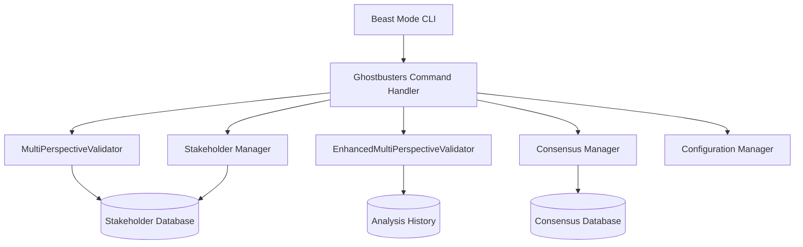

# Design Document

## Overview

The Ghostbusters CLI integration extends the existing Beast Mode CLI framework to provide command-line access to multi-perspective analysis, stakeholder validation, and consensus building capabilities. This design leverages the existing `BeastModeCLI` class structure and integrates with the current `MultiPerspectiveValidator` and `EnhancedMultiPerspectiveValidator` components.

## Architecture

### High-Level Architecture



### Integration Points

The Ghostbusters CLI integration will extend the existing `BeastModeCLI` class by:

1. **Adding new CLI commands** to the `CLICommand` enum
2. **Implementing command handlers** following the existing `_execute_*_command` pattern
3. **Leveraging existing Ghostbusters components** (`MultiPerspectiveValidator`, `EnhancedMultiPerspectiveValidator`)
4. **Maintaining consistency** with existing CLI patterns and error handling

## Components and Interfaces

### 1. CLI Command Extensions

```python
class CLICommand(Enum):
    # Existing commands...
    GHOSTBUSTERS = "ghostbusters"

class GhostbustersSubCommand(Enum):
    ANALYZE = "analyze"
    STAKEHOLDERS = "stakeholders"
    CONSENSUS = "consensus"
    STATUS = "status"
    CONFIG = "config"
    VALIDATE = "validate"
    EXPORT = "export"
```

### 2. Ghostbusters CLI Handler

The main handler will be implemented as `GhostbustersCLIHandler` class that manages:

- **Command routing** to appropriate sub-handlers
- **Integration** with existing Ghostbusters validators
- **State management** for ongoing analyses and consensus processes
- **Configuration management** for Ghostbusters-specific settings

### 3. Stakeholder Management Interface

```python
class StakeholderManager:
    def list_stakeholders() -> List[StakeholderInfo]
    def add_stakeholder(name: str, role: str, expertise: str) -> bool
    def remove_stakeholder(name: str) -> bool
    def update_stakeholder(name: str, **kwargs) -> bool
    def get_stakeholder_by_name(name: str) -> Optional[StakeholderInfo]
```

### 4. Consensus Management Interface

```python
class ConsensusManager:
    def initiate_consensus(decision_id: str, context: str) -> str
    def get_consensus_status(consensus_id: str) -> ConsensusStatus
    def collect_stakeholder_input(consensus_id: str, stakeholder: str, input: Dict) -> bool
    def calculate_consensus_metrics(consensus_id: str) -> ConsensusMetrics
```

### 5. Analysis Export Interface

```python
class AnalysisExporter:
    def export_analysis(analysis_id: str, format: str) -> str
    def list_available_analyses() -> List[AnalysisInfo]
    def get_analysis_summary(analysis_id: str) -> AnalysisSummary
```

## Data Models

### 1. Stakeholder Information

```python
@dataclass
class StakeholderInfo:
    name: str
    role: str
    expertise_areas: List[str]
    stakeholder_type: StakeholderType
    contact_info: Optional[str]
    active: bool
    created_at: datetime
    last_updated: datetime
```

### 2. Consensus Process

```python
@dataclass
class ConsensusProcess:
    consensus_id: str
    decision_id: str
    decision_context: str
    stakeholders_involved: List[str]
    status: ConsensusStatus
    created_at: datetime
    deadline: Optional[datetime]
    inputs_collected: Dict[str, Any]
    consensus_metrics: Optional[ConsensusMetrics]
```

### 3. CLI Analysis Request

```python
@dataclass
class CLIAnalysisRequest:
    decision_context: str
    confidence_level: float
    analysis_type: str  # "basic", "enhanced", "full"
    stakeholders: Optional[List[str]]
    timeout_seconds: int
    export_format: Optional[str]
```

## Error Handling

### 1. Command Validation

- **Invalid confidence levels**: Validate 0.0-1.0 range
- **Missing decision context**: Provide clear error messages with examples
- **Unknown stakeholders**: Suggest available stakeholders
- **Invalid export formats**: List supported formats

### 2. Analysis Failures

- **Timeout handling**: Graceful degradation with partial results
- **Stakeholder unavailability**: Continue with available stakeholders
- **Validation errors**: Clear error messages with remediation steps

### 3. Consensus Process Errors

- **Stakeholder conflicts**: Provide conflict resolution guidance
- **Incomplete input**: Track and report missing inputs
- **Process timeouts**: Handle deadline management

## Testing Strategy

### 1. Unit Tests

- **Command parsing and validation**
- **Integration with existing Ghostbusters components**
- **Error handling scenarios**
- **Configuration management**

### 2. Integration Tests

- **End-to-end CLI workflows**
- **Multi-stakeholder analysis scenarios**
- **Consensus building processes**
- **Export functionality**

### 3. Performance Tests

- **Analysis response times**
- **Concurrent analysis handling**
- **Large stakeholder group management**
- **Export performance for large datasets**

### 4. User Experience Tests

- **Command discoverability**
- **Help text clarity**
- **Error message usefulness**
- **Output formatting consistency**

## Implementation Details

### 1. CLI Command Structure

```bash
# Analysis commands
beast-mode ghostbusters analyze "decision context" --confidence 0.3
beast-mode ghostbusters analyze "decision context" --confidence 0.3 --stakeholders "alice,bob"
beast-mode ghostbusters analyze "decision context" --confidence 0.3 --export json

# Stakeholder management
beast-mode ghostbusters stakeholders --list
beast-mode ghostbusters stakeholders --add "Alice" --role "DevOps" --expertise "reliability,monitoring"
beast-mode ghostbusters stakeholders --remove "Alice"

# Consensus building
beast-mode ghostbusters consensus "decision_123"
beast-mode ghostbusters consensus "decision_123" --status
beast-mode ghostbusters consensus "decision_123" --deadline "2025-01-15T10:00:00"

# System management
beast-mode ghostbusters status
beast-mode ghostbusters config --list
beast-mode ghostbusters config --set "timeout=300"
beast-mode ghostbusters validate "decision_123"

# Export functionality
beast-mode ghostbusters export "analysis_456" --format json
beast-mode ghostbusters export "analysis_456" --format json --output results.json
```

### 2. Configuration Management

Ghostbusters CLI will support configuration through:

- **Environment variables**: `GHOSTBUSTERS_TIMEOUT`, `GHOSTBUSTERS_DEFAULT_STAKEHOLDERS`
- **Configuration files**: `.ghostbusters/config.json` in project root
- **CLI parameters**: Override defaults for specific commands

### 3. Output Formatting

All commands will provide:

- **Structured output**: JSON format for programmatic consumption
- **Human-readable output**: Formatted tables and summaries
- **Progress indicators**: For long-running analyses
- **Color coding**: Success/warning/error states

### 4. Integration with Existing Components

The CLI will integrate with existing components by:

- **Reusing validation logic** from `MultiPerspectiveValidator`
- **Leveraging analysis capabilities** from `EnhancedMultiPerspectiveValidator`
- **Following CLI patterns** from existing `BeastModeCLI` implementation
- **Maintaining health monitoring** through existing `ReflectiveModule` patterns

### 5. Extensibility

The design supports future extensions through:

- **Plugin architecture** for custom stakeholder types
- **Configurable analysis workflows**
- **Custom export formats**
- **Integration hooks** for external systems

## Security Considerations

### 1. Input Validation

- **Sanitize decision contexts** to prevent injection attacks
- **Validate stakeholder information** before storage
- **Limit analysis complexity** to prevent resource exhaustion

### 2. Access Control

- **Stakeholder authentication** for consensus processes
- **Role-based permissions** for configuration changes
- **Audit logging** for all CLI operations

### 3. Data Protection

- **Secure storage** of stakeholder information
- **Encrypted communication** for remote stakeholder input
- **Data retention policies** for analysis history

## Performance Optimization

### 1. Analysis Caching

- **Cache stakeholder perspectives** for similar decisions
- **Reuse consensus results** for related decisions
- **Optimize database queries** for stakeholder lookups

### 2. Concurrent Processing

- **Parallel stakeholder analysis** for faster results
- **Asynchronous consensus collection**
- **Background export processing**

### 3. Resource Management

- **Memory-efficient analysis storage**
- **Configurable timeout handling**
- **Graceful degradation** under load