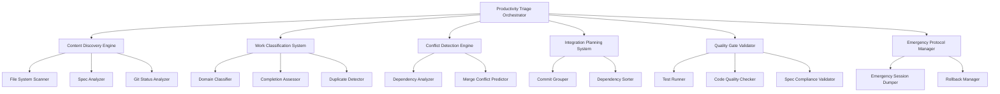

# Design Document

## Overview

The Ghostbusters Productivity Triage system extends the existing Ghostbusters framework to handle "supernatural productivity explosions" - situations where Beast Mode has generated so much valuable work that coordination becomes the bottleneck. This system will systematically analyze, organize, and integrate distributed work across multiple domains while maintaining quality and preventing regressions.

## Architecture

### Core Components



### Integration with Existing Systems

The system leverages existing Beast Mode components:

- **Ghostbusters Framework**: Core investigation and consultation capabilities
- **Domain Index**: Content classification and registry management
- **Task Queue**: Coordination and state management
- **Quality Gates**: Test execution and validation
- **Emergency Protocols**: Failure recovery and data preservation

## Components and Interfaces

### 1. Productivity Triage Orchestrator

**Purpose**: Main coordination component that manages the entire triage process

**Interface**:
```python
class ProductivityTriageOrchestrator(ReflectiveModule):
    def run_triage(self, triage_config: TriageConfig) -> TriageReport
    def assess_productivity_explosion(self) -> ExplosionAssessment
    def create_integration_plan(self, assessment: ExplosionAssessment) -> IntegrationPlan
    def execute_integration(self, plan: IntegrationPlan) -> IntegrationResult
```

**Key Methods**:
- `run_triage()`: Main entry point for the triage process
- `assess_productivity_explosion()`: Analyzes current state of distributed work
- `create_integration_plan()`: Generates systematic integration strategy
- `execute_integration()`: Orchestrates the actual integration process

### 2. Content Discovery Engine

**Purpose**: Systematically discovers and catalogs all work-in-progress artifacts

**Interface**:
```python
class ContentDiscoveryEngine(ReflectiveModule):
    def scan_workspace(self) -> List[WorkArtifact]
    def analyze_open_files(self) -> List[FileAnalysis]
    def scan_specs(self) -> List[SpecAnalysis]
    def analyze_git_status(self) -> GitStatusAnalysis
```

**Discovery Strategy**:
- Scan all open editor files for active work
- Analyze `.kiro/specs/` directory for specification status
- Check git status for modified, staged, and untracked files
- Identify test files and their corresponding implementations
- Scan for documentation updates and new features

### 3. Work Classification System

**Purpose**: Categorizes discovered work by domain, completion status, and integration readiness

**Interface**:
```python
class WorkClassificationSystem(ReflectiveModule):
    def classify_by_domain(self, artifacts: List[WorkArtifact]) -> DomainClassification
    def assess_completion_status(self, artifacts: List[WorkArtifact]) -> CompletionAssessment
    def detect_duplicates(self, artifacts: List[WorkArtifact]) -> DuplicateAnalysis
```

**Classification Dimensions**:
- **Domain**: task_queue, mcp_integrations, release_automation, ghostbusters, etc.
- **Completion Status**: complete, partial, experimental, broken
- **Integration Readiness**: ready, needs_tests, needs_docs, has_conflicts
- **Quality Level**: production_ready, needs_review, prototype, throwaway

### 4. Conflict Detection Engine

**Purpose**: Identifies potential conflicts between different workstreams before integration

**Interface**:
```python
class ConflictDetectionEngine(ReflectiveModule):
    def detect_file_conflicts(self, artifacts: List[WorkArtifact]) -> List[FileConflict]
    def analyze_dependencies(self, artifacts: List[WorkArtifact]) -> DependencyAnalysis
    def predict_merge_conflicts(self, plan: IntegrationPlan) -> List[MergeConflict]
```

**Conflict Types**:
- **File Conflicts**: Multiple workstreams modifying the same files
- **Dependency Conflicts**: Circular dependencies or incompatible requirements
- **API Conflicts**: Breaking changes to shared interfaces
- **Test Conflicts**: Tests that would fail when workstreams are combined

### 5. Integration Planning System

**Purpose**: Creates a systematic plan for integrating all valuable work

**Interface**:
```python
class IntegrationPlanningSystem(ReflectiveModule):
    def create_commit_groups(self, classified_work: ClassifiedWork) -> List[CommitGroup]
    def sort_by_dependencies(self, groups: List[CommitGroup]) -> List[CommitGroup]
    def generate_integration_plan(self, sorted_groups: List[CommitGroup]) -> IntegrationPlan
```

**Planning Strategy**:
- Group related changes into atomic, testable commits
- Order commits to respect dependencies (foundational changes first)
- Identify integration points where testing is critical
- Plan rollback strategies for each integration step

### 6. Quality Gate Validator

**Purpose**: Ensures no regressions are introduced during integration

**Interface**:
```python
class QualityGateValidator(ReflectiveModule):
    def run_test_suite(self) -> TestResults
    def validate_code_quality(self, files: List[str]) -> QualityResults
    def check_spec_compliance(self, artifacts: List[WorkArtifact]) -> ComplianceResults
```

**Validation Gates**:
- **Test Gate**: All existing tests must pass
- **Quality Gate**: New code follows Beast Mode patterns
- **Spec Gate**: Implementations match their specifications
- **Documentation Gate**: New features have appropriate documentation

## Data Models

### Core Data Structures

```python
@dataclass
class WorkArtifact:
    path: str
    artifact_type: ArtifactType  # code, test, spec, doc
    domain: DomainType
    completion_status: CompletionStatus
    integration_readiness: ReadinessStatus
    dependencies: List[str]
    conflicts: List[str]
    metadata: Dict[str, Any]

@dataclass
class TriageConfig:
    scan_paths: List[str]
    exclude_patterns: List[str]
    quality_gates: List[QualityGate]
    emergency_thresholds: EmergencyThresholds
    integration_strategy: IntegrationStrategy

@dataclass
class ExplosionAssessment:
    total_artifacts: int
    domains_affected: List[DomainType]
    completion_distribution: Dict[CompletionStatus, int]
    conflict_count: int
    integration_complexity: ComplexityLevel
    recommended_strategy: TriageStrategy

@dataclass
class IntegrationPlan:
    commit_groups: List[CommitGroup]
    execution_order: List[int]
    quality_checkpoints: List[QualityCheckpoint]
    rollback_points: List[RollbackPoint]
    estimated_duration: timedelta

@dataclass
class TriageReport:
    assessment: ExplosionAssessment
    integration_plan: IntegrationPlan
    execution_results: List[IntegrationResult]
    quality_results: QualityResults
    artifacts_integrated: int
    artifacts_deferred: int
    conflicts_resolved: int
    recommendations: List[str]
```

## Error Handling

### Systematic Error Recovery

The system implements comprehensive error handling at multiple levels:

1. **Module-Level Errors**: Each component handles its own failures gracefully
2. **Integration Errors**: Failed integrations trigger automatic rollback
3. **Quality Gate Failures**: Failed gates halt integration with clear remediation steps
4. **Critical Failures**: Activate emergency protocols to preserve all work

### Emergency Protocol Integration

When critical failures occur:
- Activate existing Ghostbusters emergency protocols
- Create comprehensive session dumps of all work-in-progress
- Preserve git state with emergency branches
- Generate detailed failure reports for manual recovery

## Testing Strategy

### Multi-Level Testing Approach

1. **Unit Tests**: Test each component in isolation
   - Mock file system interactions
   - Test classification algorithms
   - Validate conflict detection logic

2. **Integration Tests**: Test component interactions
   - End-to-end triage scenarios
   - Quality gate validation
   - Emergency protocol activation

3. **Scenario Tests**: Test real-world productivity explosions
   - Simulated multi-domain work scenarios
   - Conflict resolution testing
   - Performance under load

### Test Data Strategy

- **Synthetic Workspaces**: Create controlled test environments
- **Real Scenario Replicas**: Capture and replay actual productivity explosions
- **Edge Case Scenarios**: Test boundary conditions and failure modes

## Implementation Phases

### Phase 1: Core Discovery and Classification
- Implement Content Discovery Engine
- Build Work Classification System
- Create basic conflict detection

### Phase 2: Planning and Integration
- Develop Integration Planning System
- Implement Quality Gate Validator
- Add basic emergency protocols

### Phase 3: Advanced Features and Optimization
- Enhanced conflict resolution
- Performance optimization
- Advanced reporting and analytics

### Phase 4: Ghostbusters Integration
- Full integration with existing Ghostbusters framework
- Emergency protocol enhancement
- Autonomous triage capabilities

## Integration with Existing Ghostbusters Framework

### Leveraging Investigation Modules

The system extends existing Ghostbusters investigation modules:

- **PageStructureAnalyzer** → **WorkspaceStructureAnalyzer**: Analyze workspace organization
- **NavigationAnalyzer** → **DependencyAnalyzer**: Analyze code dependencies
- **ContentAnalyzer** → **ArtifactAnalyzer**: Analyze work artifact content
- **DiagnosticTester** → **QualityTester**: Run quality diagnostics

### Consultation Integration

The productivity triage system integrates with the Ghostbusters consultation framework:

```python
class ProductivityTriageConsultation(GhostbustersConsultationRefactored):
    def run_productivity_investigation(self, workspace_state: WorkspaceState) -> TriageReport
    def generate_triage_recommendations(self, assessment: ExplosionAssessment) -> List[str]
    def assess_coordination_risk(self, integration_plan: IntegrationPlan) -> RiskAssessment
```

This allows the system to leverage existing Ghostbusters capabilities for autonomous investigation and recommendation generation while extending them for productivity coordination scenarios.