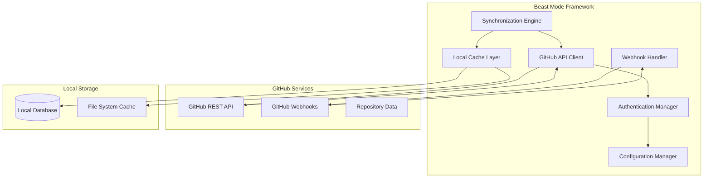

# GitHub Synchronization Design Document

## Overview

The GitHub Synchronization system provides comprehensive integration between the Beast Mode AI Development Framework and GitHub repositories. This system enables bidirectional synchronization of repository data, issues, pull requests, and collaborative features while maintaining security best practices and providing real-time updates through webhook integration.

The design follows a modular architecture with clear separation of concerns, secure credential management, and robust error handling to ensure reliable operation in production environments.

## Architecture

### High-Level Architecture



### Core Components

1. **GitHub API Client**: Handles all interactions with GitHub's REST API
2. **Synchronization Engine**: Orchestrates data synchronization workflows
3. **Webhook Handler**: Processes real-time GitHub events
4. **Authentication Manager**: Manages secure credential handling
5. **Local Cache Layer**: Provides offline access and performance optimization
6. **Configuration Manager**: Handles user preferences and system settings

## Components and Interfaces

### GitHub API Client

**Purpose**: Provides a unified interface for all GitHub API interactions with built-in rate limiting, error handling, and authentication.

**Key Interfaces**:
```python
class GitHubAPIClient:
    def authenticate(self) -> bool
    def get_repository(self, owner: str, repo: str) -> Repository
    def list_issues(self, owner: str, repo: str, state: str = "all") -> List[Issue]
    def list_pull_requests(self, owner: str, repo: str, state: str = "all") -> List[PullRequest]
    def get_commits(self, owner: str, repo: str, branch: str = "main") -> List[Commit]
    def create_webhook(self, owner: str, repo: str, config: WebhookConfig) -> Webhook
```

**Design Decisions**:
- Uses environment variables exclusively for credential management (following security governance)
- Implements exponential backoff for rate limiting compliance
- Provides async/await support for concurrent operations
- Includes comprehensive error handling with specific exception types

### Synchronization Engine

**Purpose**: Orchestrates the synchronization process between GitHub and local storage, managing data consistency and conflict resolution.

**Key Interfaces**:
```python
class SynchronizationEngine:
    def sync_repository(self, repo_config: RepositoryConfig) -> SyncResult
    def sync_issues(self, repo_config: RepositoryConfig) -> SyncResult
    def sync_pull_requests(self, repo_config: RepositoryConfig) -> SyncResult
    def sync_branches(self, repo_config: RepositoryConfig) -> SyncResult
    def resolve_conflicts(self, conflicts: List[DataConflict]) -> ConflictResolution
```

**Design Decisions**:
- Implements incremental synchronization to minimize API calls
- Uses checksums and timestamps for change detection
- Provides configurable sync strategies (full, incremental, selective)
- Maintains synchronization state for recovery and resumption

### Webhook Handler

**Purpose**: Processes real-time GitHub webhook events to maintain up-to-date local data without polling.

**Key Interfaces**:
```python
class WebhookHandler:
    def setup_webhooks(self, repo_configs: List[RepositoryConfig]) -> List[Webhook]
    def handle_push_event(self, event: PushEvent) -> None
    def handle_issue_event(self, event: IssueEvent) -> None
    def handle_pull_request_event(self, event: PullRequestEvent) -> None
    def validate_webhook_signature(self, payload: str, signature: str) -> bool
```

**Design Decisions**:
- Implements webhook signature validation for security
- Uses event queuing for reliable processing
- Provides retry mechanisms for failed webhook processing
- Supports webhook endpoint configuration and management

### Authentication Manager

**Purpose**: Handles secure authentication with GitHub using environment variables and token management.

**Key Interfaces**:
```python
class AuthenticationManager:
    def load_credentials(self) -> GitHubCredentials
    def validate_token(self, token: str) -> bool
    def refresh_token(self) -> str
    def get_authenticated_client(self) -> GitHubAPIClient
```

**Design Decisions**:
- **CRITICAL**: Uses only environment variables for credential storage (GITHUB_TOKEN, GITHUB_APP_ID, etc.)
- Implements token validation and refresh mechanisms
- Supports both personal access tokens and GitHub App authentication
- Provides clear error messages for missing or invalid credentials
- Never stores credentials in code or configuration files

### Local Cache Layer

**Purpose**: Provides efficient local storage and offline access to GitHub data with intelligent caching strategies.

**Key Interfaces**:
```python
class CacheManager:
    def cache_repository_data(self, repo: Repository) -> None
    def get_cached_issues(self, repo_id: str) -> List[Issue]
    def invalidate_cache(self, repo_id: str, data_type: str) -> None
    def optimize_cache_storage(self) -> CacheOptimizationResult
```

**Design Decisions**:
- Uses SQLite for structured data storage
- Implements LRU eviction for cache size management
- Provides cache versioning for data migration
- Supports partial cache invalidation for efficient updates

## Data Models

### Core Data Structures

```python
@dataclass
class Repository:
    id: int
    name: str
    full_name: str
    owner: str
    description: Optional[str]
    default_branch: str
    created_at: datetime
    updated_at: datetime
    last_sync: Optional[datetime]

@dataclass
class Issue:
    id: int
    number: int
    title: str
    body: Optional[str]
    state: str
    assignees: List[str]
    labels: List[str]
    created_at: datetime
    updated_at: datetime
    repository_id: int

@dataclass
class PullRequest:
    id: int
    number: int
    title: str
    body: Optional[str]
    state: str
    head_branch: str
    base_branch: str
    mergeable: Optional[bool]
    created_at: datetime
    updated_at: datetime
    repository_id: int

@dataclass
class Commit:
    sha: str
    message: str
    author: str
    author_email: str
    committed_at: datetime
    repository_id: int
    branch: str
```

### Configuration Models

```python
@dataclass
class RepositoryConfig:
    owner: str
    name: str
    sync_issues: bool = True
    sync_pull_requests: bool = True
    sync_branches: List[str] = field(default_factory=lambda: ["main"])
    webhook_events: List[str] = field(default_factory=lambda: ["push", "issues", "pull_request"])

@dataclass
class SyncConfig:
    repositories: List[RepositoryConfig]
    sync_interval: int = 300  # seconds
    max_concurrent_syncs: int = 5
    enable_webhooks: bool = True
    cache_retention_days: int = 30
```

## Error Handling

### Error Categories and Strategies

1. **Authentication Errors**
   - Invalid or expired tokens
   - Insufficient permissions
   - Strategy: Clear error messages, token refresh attempts, fallback to manual re-authentication

2. **Rate Limiting**
   - GitHub API rate limits exceeded
   - Strategy: Exponential backoff, request queuing, priority-based processing

3. **Network Errors**
   - Connection timeouts, DNS failures
   - Strategy: Retry with exponential backoff, circuit breaker pattern

4. **Data Conflicts**
   - Concurrent modifications to same data
   - Strategy: Last-write-wins with conflict logging, manual resolution options

5. **Webhook Failures**
   - Webhook delivery failures, signature validation errors
   - Strategy: Event queuing, retry mechanisms, fallback to polling

### Error Recovery Mechanisms

```python
class ErrorRecoveryManager:
    def handle_authentication_error(self, error: AuthError) -> RecoveryAction
    def handle_rate_limit_error(self, error: RateLimitError) -> RecoveryAction
    def handle_network_error(self, error: NetworkError) -> RecoveryAction
    def handle_data_conflict(self, conflict: DataConflict) -> ConflictResolution
```

## Testing Strategy

### Unit Testing
- **API Client**: Mock GitHub API responses, test error handling
- **Synchronization Engine**: Test sync logic with various data states
- **Webhook Handler**: Test event processing and signature validation
- **Authentication Manager**: Test credential loading and validation (using test environment variables)

### Integration Testing
- **GitHub API Integration**: Test against GitHub's API with test repositories
- **Webhook Integration**: Test webhook setup and event processing
- **Database Integration**: Test data persistence and cache operations

### End-to-End Testing
- **Full Synchronization Flow**: Test complete sync process from GitHub to local storage
- **Real-time Updates**: Test webhook-driven updates
- **Error Recovery**: Test system behavior under various failure conditions

### Security Testing
- **Credential Security**: Verify no hardcoded credentials in any code
- **Webhook Security**: Test signature validation and payload verification
- **Token Management**: Test secure token storage and refresh mechanisms

## Security Considerations

### Credential Management
- **MANDATORY**: All GitHub credentials stored in environment variables only
- **Environment Variables**: GITHUB_TOKEN, GITHUB_APP_ID, GITHUB_APP_PRIVATE_KEY
- **No Hardcoding**: Zero tolerance for hardcoded credentials in any form
- **Secure Storage**: Use system keychain or secure environment variable management

### API Security
- **Token Validation**: Verify token permissions and scope before use
- **Rate Limiting**: Respect GitHub's rate limits to avoid service disruption
- **Webhook Security**: Validate all webhook signatures using HMAC-SHA256

### Data Protection
- **Local Encryption**: Encrypt sensitive cached data at rest
- **Secure Transmission**: Use HTTPS for all GitHub API communications
- **Access Control**: Implement role-based access to synchronized data

## Performance Optimization

### Caching Strategy
- **Intelligent Caching**: Cache frequently accessed data with appropriate TTL
- **Incremental Updates**: Sync only changed data using GitHub's conditional requests
- **Parallel Processing**: Concurrent synchronization of multiple repositories

### API Efficiency
- **Batch Operations**: Group related API calls to minimize requests
- **Conditional Requests**: Use ETags and If-Modified-Since headers
- **GraphQL Integration**: Consider GraphQL API for complex queries

### Resource Management
- **Connection Pooling**: Reuse HTTP connections for API calls
- **Memory Management**: Efficient handling of large datasets
- **Background Processing**: Async processing for non-blocking operations

## Monitoring and Observability

### Metrics Collection
- **Sync Performance**: Track sync duration, success rates, error rates
- **API Usage**: Monitor rate limit consumption, response times
- **Cache Efficiency**: Track cache hit rates, storage usage

### Logging Strategy
- **Structured Logging**: JSON-formatted logs with correlation IDs
- **Security Logging**: Log authentication events and security violations
- **Error Logging**: Detailed error context for troubleshooting

### Health Monitoring
- **System Health**: Monitor sync service availability and performance
- **GitHub Connectivity**: Track API availability and response times
- **Webhook Health**: Monitor webhook delivery success rates

## Deployment Considerations

### Environment Configuration
- **Development**: Local GitHub test repositories, mock webhooks
- **Staging**: Limited production data, webhook testing
- **Production**: Full synchronization, monitoring, alerting

### Scalability
- **Horizontal Scaling**: Support multiple sync workers for large repositories
- **Database Scaling**: Efficient database design for large datasets
- **Cache Scaling**: Distributed caching for multi-instance deployments

### Maintenance
- **Data Migration**: Support for schema changes and data migrations
- **Backup Strategy**: Regular backups of synchronized data
- **Update Procedures**: Safe deployment of synchronization updates

This design provides a comprehensive foundation for implementing GitHub synchronization while maintaining security best practices, performance optimization, and robust error handling. The modular architecture ensures maintainability and extensibility for future enhancements.