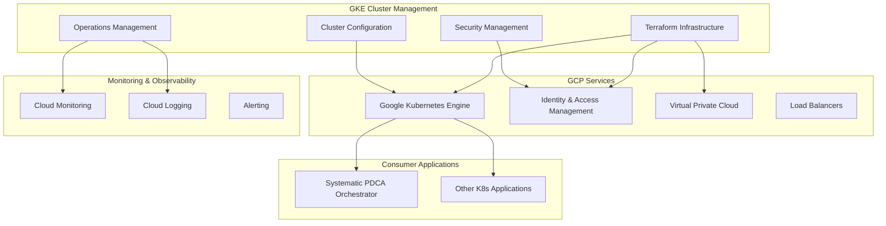

# GKE Cluster Management Design

## Overview

The GKE Cluster Management system provides systematic Kubernetes cluster provisioning and lifecycle management on Google Cloud Platform. It implements Infrastructure as Code principles with Terraform, systematic security configurations, and operational excellence patterns for enterprise-grade container orchestration.

**Architecture Philosophy**: Systematic infrastructure management - predictable, secure, and cost-effective cluster operations through code-driven automation.

## Architecture

### Core Components



### Component Interfaces

#### TerraformClusterManager (Main Interface)
```hcl
# Terraform module interface
module "gke_cluster" {
  source = "./modules/gke-cluster"
  
  project_id     = var.project_id
  cluster_name   = var.cluster_name
  region         = var.region
  environment    = var.environment
  
  # Node configuration
  machine_type   = var.machine_type
  min_nodes      = var.min_nodes
  max_nodes      = var.max_nodes
  
  # Security configuration
  enable_workload_identity = true
  enable_network_policy    = true
  enable_private_nodes     = true
  
  # Operational configuration
  enable_autoscaling  = true
  enable_autorepair   = true
  enable_autoupgrade  = true
}
```

#### ClusterSecurityManager (Security Interface)
```yaml
# Security configuration
apiVersion: v1
kind: SecurityPolicy
spec:
  workloadIdentity:
    enabled: true
    serviceAccounts: []
  networkPolicies:
    enabled: true
    defaultDeny: true
  rbac:
    enabled: true
    clusterRoles: []
```

#### ClusterOperationsManager (Operations Interface)
```yaml
# Operations configuration
apiVersion: v1
kind: OperationsConfig
spec:
  monitoring:
    enabled: true
    retention: "30d"
  logging:
    enabled: true
    level: "INFO"
  alerting:
    enabled: true
    channels: []
```

## Components and Interfaces

### 1. Terraform Infrastructure Manager
**Responsibility**: Systematic cluster provisioning with Infrastructure as Code

**Key Resources**:
- `google_container_cluster` - GKE cluster configuration
- `google_container_node_pool` - Node pool management
- `google_compute_network` - VPC networking
- `google_compute_subnetwork` - Subnet configuration
- `google_compute_address` - Static IP allocation

**Systematic Configuration**:
- Regional clusters for high availability
- Auto-scaling node pools with cost optimization
- Network policies for security isolation
- Workload Identity for secure GCP integration

### 2. Cluster Configuration Manager
**Responsibility**: Systematic Kubernetes cluster settings

**Key Configurations**:
- `cluster_config` - Core cluster settings
- `node_config` - Node pool specifications
- `network_config` - Networking and security
- `addon_config` - Cluster add-ons and features

**Systematic Approach**:
- Standardized machine types and sizing
- Consistent security and operational settings
- Environment-specific parameter management
- Systematic upgrade and maintenance windows

### 3. Security Management
**Responsibility**: Systematic security controls and compliance

**Key Security Features**:
- `workload_identity` - Secure service account binding
- `network_policy` - Pod-to-pod traffic control
- `rbac_config` - Role-based access control
- `audit_config` - API server audit logging

**Security Standards**:
- Least-privilege access principles
- Network segmentation and isolation
- Systematic security scanning and compliance
- Automated security policy enforcement

### 4. Operations Management
**Responsibility**: Systematic monitoring, logging, and maintenance

**Key Operations**:
- `monitoring_config` - Cluster and application metrics
- `logging_config` - Centralized log aggregation
- `alerting_config` - Systematic alert management
- `maintenance_config` - Automated maintenance windows

**Operational Excellence**:
- Proactive monitoring and alerting
- Systematic log analysis and retention
- Automated maintenance and updates
- Cost optimization and resource management

## Data Models

### ClusterConfiguration
```hcl
variable "cluster_config" {
  description = "GKE cluster configuration"
  type = object({
    name               = string
    region             = string
    kubernetes_version = string
    
    node_pools = list(object({
      name         = string
      machine_type = string
      min_nodes    = number
      max_nodes    = number
      disk_size_gb = number
    }))
    
    network_config = object({
      network    = string
      subnetwork = string
      pod_range  = string
      svc_range  = string
    })
    
    security_config = object({
      enable_workload_identity = bool
      enable_network_policy    = bool
      enable_private_nodes     = bool
    })
  })
}
```

### SecurityPolicy
```yaml
apiVersion: security.gke.io/v1
kind: SecurityPolicy
metadata:
  name: systematic-security-policy
spec:
  workloadIdentity:
    enabled: true
    bindings:
      - serviceAccount: "app-sa@project.iam.gserviceaccount.com"
        kubernetesServiceAccount: "app-sa"
        namespace: "default"
  
  networkPolicies:
    - name: "default-deny-all"
      spec:
        podSelector: {}
        policyTypes: ["Ingress", "Egress"]
    
    - name: "allow-systematic-apps"
      spec:
        podSelector:
          matchLabels:
            app: "systematic-pdca"
        ingress:
          - from:
            - namespaceSelector:
                matchLabels:
                  name: "systematic-pdca"
```

## Error Handling

### Systematic Error Recovery
- **Provisioning Failures**: Automatic retry with exponential backoff
- **Node Failures**: Auto-repair with systematic node replacement
- **Network Issues**: Automatic failover to healthy zones
- **Security Violations**: Automatic policy enforcement and alerting

### Graceful Degradation
- **API Server Unavailable**: Local kubectl cache and offline operations
- **Node Pool Exhaustion**: Automatic scaling within configured limits
- **Network Partitions**: Cross-zone redundancy and failover
- **Monitoring Failures**: Local logging and manual intervention procedures

## Testing Strategy

### Infrastructure Testing
- Terraform plan validation and drift detection
- Cluster provisioning and destruction testing
- Network connectivity and security policy validation
- Auto-scaling and auto-repair functionality testing

### Security Testing
- Workload Identity integration testing
- Network policy enforcement validation
- RBAC permission boundary testing
- Security scanning and compliance validation

### Operations Testing
- Monitoring and alerting functionality
- Log aggregation and retention testing
- Backup and disaster recovery procedures
- Performance and load testing

### Integration Testing
- Application deployment and service discovery
- Cross-cluster communication testing
- CI/CD pipeline integration validation
- Multi-environment promotion testing

## Implementation Notes

### Infrastructure as Code Benefits
- **Reproducible Infrastructure**: Consistent cluster provisioning across environments
- **Version Control**: All infrastructure changes tracked and reviewable
- **Systematic Updates**: Controlled infrastructure evolution with rollback capability
- **Cost Management**: Predictable infrastructure costs through code-defined resources

### Operational Excellence
- **Systematic Monitoring**: Comprehensive observability across cluster and applications
- **Automated Maintenance**: Systematic updates and security patching
- **Cost Optimization**: Right-sizing and auto-scaling for efficient resource utilization
- **Security Compliance**: Systematic security controls and audit capabilities

This design provides the foundational GKE cluster management that enables systematic deployment of containerized applications with enterprise-grade reliability, security, and operational excellence.