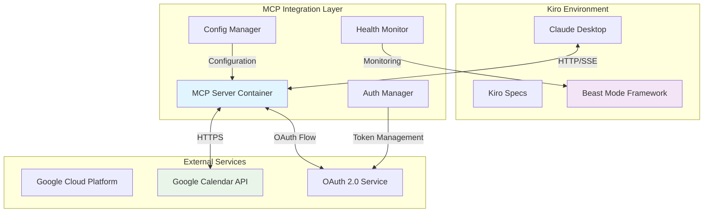
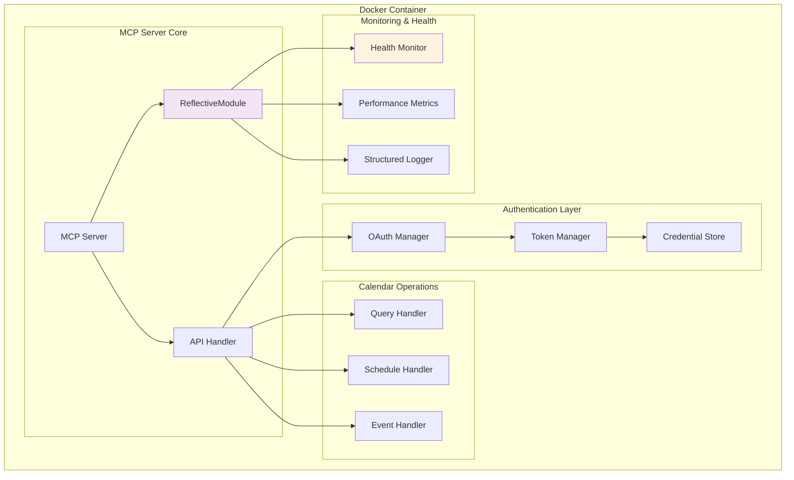

# Design Document

## Overview

The Google Calendar MCP Integration provides seamless calendar functionality within the Kiro AI development environment through a containerized Model Context Protocol (MCP) server. This design leverages Docker for reliable deployment, OAuth 2.0 for secure authentication, and the Beast Mode framework's ReflectiveModule pattern for systematic monitoring and health management.

**ARCHITECTURAL CONSTRAINT**: This is a **Beast Mode MCP** implementation that MUST comply with systematic framework requirements:

- **ReflectiveModule Inheritance**: All components inherit from unified ReflectiveModule
- **Prometheus Metrics**: MANDATORY port 8080 metrics endpoint (not optional)
- **Grafana Integration**: MANDATORY observability dashboards (not optional)  
- **Directus Registration**: MUST use ReflectiveModule.register_module() for interface registration
- **Systematic Patterns**: MUST follow PDCA methodology and Beast Mode error handling

The integration follows a microservices architecture where the MCP server acts as a bridge between Claude Desktop and Google Calendar API, providing natural language calendar operations while maintaining Beast Mode systematic standards.

## Architecture

### High-Level Architecture



### Component Architecture



## Beast Mode Framework Compliance

### ReflectiveModule Integration

All components MUST inherit from the unified ReflectiveModule base class:

```python
class GoogleCalendarMCPServer(ReflectiveModule):
    """Beast Mode compliant MCP server."""
    
    def __init__(self, config: Dict[str, Any]):
        super().__init__()
        # Beast Mode systematic initialization
        
    def register_module(self, registry):
        """Register with Directus CMS for systematic management."""
        metadata = self.get_interface_metadata()
        if hasattr(registry, "register"):
            registry.register(metadata)
```

### Mandatory Infrastructure Dependencies

The Beast Mode MCP requires these infrastructure components (NOT optional):

1. **Prometheus** (port 8080): Metrics collection and alerting
2. **Grafana** (port 3001): Observability dashboards and visualization  
3. **Directus CMS**: Interface registration and systematic management
4. **Docker Network**: Integration with Beast Mode network topology

### Systematic Patterns

- **PDCA Methodology**: Plan-Do-Check-Act cycles for all operations
- **Correlation IDs**: All logging MUST include systematic correlation tracking
- **Health Status**: ReflectiveModule health reporting (not HTTP endpoints)
- **Error Handling**: Beast Mode systematic error patterns with recovery

## Components and Interfaces

### 1. MCP Server Container

**Purpose**: Containerized MCP server providing Google Calendar integration

**Key Responsibilities**:
- Serve MCP protocol endpoints
- Handle HTTP/SSE transport
- Manage container lifecycle
- Provide health check endpoints

**Interface**:
```python
class GoogleCalendarMCPServer(ReflectiveModule):
    def __init__(self, config: Dict[str, Any])
    def start_server(self) -> bool
    def stop_server(self) -> bool
    def get_health_status(self) -> ModuleHealth
    def handle_mcp_request(self, request: MCPRequest) -> MCPResponse
```

**Docker Configuration**:
- Base image: `node:18-alpine` or `python:3.9-slim`
- Exposed ports: 3000 (configurable)
- Health check: `/health` endpoint
- Volume mounts: credentials, logs, cache

### 2. Authentication Manager

**Purpose**: Secure OAuth 2.0 authentication with Google Calendar API

**Key Responsibilities**:
- Manage OAuth 2.0 flow
- Store and refresh tokens securely
- Handle authentication errors
- Provide credential validation

**Interface**:
```python
class GoogleAuthManager(ReflectiveModule):
    def __init__(self, credentials_path: str)
    def authenticate(self) -> AuthResult
    def refresh_token(self) -> bool
    def is_authenticated(self) -> bool
    def get_access_token(self) -> Optional[str]
    def revoke_authentication(self) -> bool
```

**Security Features**:
- Encrypted token storage
- Automatic token refresh
- Secure credential file handling (600 permissions)
- OAuth scope validation

### 3. Calendar Operations Handler

**Purpose**: Core calendar functionality implementation

**Key Responsibilities**:
- Query calendar events
- Create/update/delete events
- Check availability
- Handle recurring events
- Manage attendees and notifications

**Interface**:
```python
class CalendarOperationsHandler(ReflectiveModule):
    def __init__(self, auth_manager: GoogleAuthManager)
    def get_events(self, start_time: datetime, end_time: datetime) -> List[CalendarEvent]
    def create_event(self, event_data: EventData) -> CalendarEvent
    def update_event(self, event_id: str, updates: Dict[str, Any]) -> CalendarEvent
    def delete_event(self, event_id: str) -> bool
    def check_availability(self, start_time: datetime, end_time: datetime) -> AvailabilityResult
```

### 4. Claude Desktop Integration

**Purpose**: MCP client configuration for Claude Desktop

**Configuration Structure**:
```json
{
  "mcpServers": {
    "google-calendar": {
      "command": "npx",
      "args": ["@modelcontextprotocol/cli", "connect", "http://localhost:3000/sse"],
      "env": {
        "GOOGLE_CALENDAR_PORT": "3000",
        "GOOGLE_CALENDAR_LOG_LEVEL": "info"
      }
    }
  }
}
```

**Transport Options**:
- Primary: HTTP/SSE for real-time communication
- Fallback: Direct Docker exec for local development
- Health monitoring: Automatic reconnection on failure

### 5. Configuration Management

**Purpose**: Environment-specific configuration handling

**Configuration Sources**:
- Environment variables
- Docker secrets (production)
- Configuration files
- Runtime parameters

**Configuration Schema**:
```yaml
server:
  port: 3000
  host: "0.0.0.0"
  log_level: "info"

google:
  credentials_file: "/app/credentials/gcp-oauth.keys.json"
  scopes:
    - "https://www.googleapis.com/auth/calendar"
    - "https://www.googleapis.com/auth/calendar.events"

security:
  token_encryption: true
  credential_permissions: "600"
  https_only: true

monitoring:
  health_check_interval: 30
  metrics_enabled: true
  prometheus_port: 8080
```

## Data Models

### Calendar Event Model

```python
@dataclass
class CalendarEvent:
    id: str
    summary: str
    description: Optional[str]
    start_time: datetime
    end_time: datetime
    location: Optional[str]
    attendees: List[Attendee]
    recurrence: Optional[RecurrenceRule]
    status: EventStatus
    created_at: datetime
    updated_at: datetime
```

### Authentication Models

```python
@dataclass
class AuthResult:
    success: bool
    access_token: Optional[str]
    refresh_token: Optional[str]
    expires_at: Optional[datetime]
    error_message: Optional[str]

@dataclass
class TokenInfo:
    access_token: str
    refresh_token: str
    expires_at: datetime
    scopes: List[str]
```

### MCP Protocol Models

```python
@dataclass
class MCPRequest:
    method: str
    params: Dict[str, Any]
    id: Optional[str]
    jsonrpc: str = "2.0"

@dataclass
class MCPResponse:
    result: Optional[Any]
    error: Optional[MCPError]
    id: Optional[str]
    jsonrpc: str = "2.0"
```

## Error Handling

### Error Categories

1. **Authentication Errors**
   - Invalid credentials
   - Expired tokens
   - Insufficient permissions
   - OAuth flow failures

2. **API Errors**
   - Rate limiting
   - Network connectivity
   - Google API service errors
   - Malformed requests

3. **Container Errors**
   - Docker startup failures
   - Port conflicts
   - Volume mount issues
   - Health check failures

4. **MCP Protocol Errors**
   - Invalid requests
   - Transport failures
   - Claude Desktop disconnection
   - Protocol version mismatches

### Error Handling Strategy

```python
class ErrorHandler(ReflectiveModule):
    def handle_auth_error(self, error: AuthError) -> ErrorResponse:
        """Handle authentication-related errors with automatic retry"""
        
    def handle_api_error(self, error: APIError) -> ErrorResponse:
        """Handle Google API errors with exponential backoff"""
        
    def handle_container_error(self, error: ContainerError) -> ErrorResponse:
        """Handle Docker container errors with restart logic"""
        
    def handle_mcp_error(self, error: MCPError) -> ErrorResponse:
        """Handle MCP protocol errors with graceful degradation"""
```

### Recovery Mechanisms

- **Exponential Backoff**: For rate limiting and temporary failures
- **Circuit Breaker**: For persistent service failures
- **Graceful Degradation**: Fallback to cached data when possible
- **Automatic Retry**: With jitter for transient errors
- **Health Check Recovery**: Automatic container restart on failure

## Testing Strategy

### Unit Testing

**Coverage Requirements**: >90% code coverage for all components

**Test Categories**:
- Authentication flow testing
- Calendar operations testing
- Error handling testing
- Configuration validation testing
- MCP protocol testing

**Mock Strategy**:
```python
class TestGoogleCalendarMCP(unittest.TestCase):
    def setUp(self):
        self.mock_auth = Mock(spec=GoogleAuthManager)
        self.mock_calendar_api = Mock()
        self.server = GoogleCalendarMCPServer(test_config)
    
    def test_authentication_flow(self):
        """Test OAuth 2.0 authentication flow"""
        
    def test_event_creation(self):
        """Test calendar event creation"""
        
    def test_error_handling(self):
        """Test error handling and recovery"""
```

### Integration Testing

**Docker Infrastructure Testing**:
- Container startup and health checks
- Network connectivity between services
- Volume persistence and security
- Environment variable configuration

**API Integration Testing**:
- Google Calendar API connectivity
- OAuth flow end-to-end testing
- Rate limiting behavior
- Error response handling

**Claude Desktop Integration Testing**:
- MCP protocol communication
- Transport layer reliability
- Reconnection behavior
- Command execution testing

### End-to-End Testing

**User Workflow Testing**:
- Complete authentication flow
- Calendar query operations
- Event creation and modification
- Error scenarios and recovery
- Performance under load

**Security Testing**:
- Credential protection
- Token encryption
- Network security
- Container isolation

### Performance Testing

**Load Testing**:
- Concurrent request handling
- Memory usage under load
- Response time benchmarks
- Resource utilization monitoring

**Scalability Testing**:
- Multiple calendar account support
- High-frequency operations
- Long-running container stability
- Memory leak detection

## Deployment Architecture

### Docker Compose Configuration

```yaml
version: '3.8'

services:
  google-calendar-mcp:
    build:
      context: .
      dockerfile: Dockerfile
    container_name: google_calendar_mcp
    ports:
      - "${GOOGLE_CALENDAR_PORT:-3000}:3000"
    environment:
      - NODE_ENV=${NODE_ENV:-production}
      - GOOGLE_OAUTH_CREDENTIALS=/app/credentials/gcp-oauth.keys.json
      - LOG_LEVEL=${LOG_LEVEL:-info}
    volumes:
      - ./credentials:/app/credentials:ro
      - google_calendar_logs:/app/logs
      - google_calendar_cache:/app/cache
    healthcheck:
      test: ["CMD", "curl", "-f", "http://localhost:3000/health"]
      interval: 30s
      timeout: 10s
      retries: 3
      start_period: 10s
    restart: unless-stopped
    networks:
      - mcp_network

  # Optional: Prometheus monitoring
  prometheus:
    image: prom/prometheus:latest
    ports:
      - "9090:9090"
    volumes:
      - ./monitoring/prometheus.yml:/etc/prometheus/prometheus.yml:ro
      - prometheus_data:/prometheus
    profiles:
      - monitoring

volumes:
  google_calendar_logs:
  google_calendar_cache:
  prometheus_data:

networks:
  mcp_network:
    driver: bridge
```

### Security Configuration

**Container Security**:
- Non-root user execution
- Read-only filesystem where possible
- Minimal base image (Alpine Linux)
- Security scanning in CI/CD

**Credential Management**:
- Docker secrets for production
- Encrypted volume storage
- Restricted file permissions
- Automatic credential rotation

**Network Security**:
- HTTPS-only communication
- Certificate validation
- Network isolation
- Firewall rules

### Monitoring and Observability

**Health Monitoring**:
- Container health checks
- Application health endpoints
- Dependency health validation
- Automated alerting

**Metrics Collection**:
- Prometheus metrics export
- Performance monitoring
- Resource utilization tracking
- Error rate monitoring

**Logging Strategy**:
- Structured JSON logging
- Correlation ID tracking
- Log aggregation
- Security event logging

**Alerting Rules**:
- Authentication failures
- API rate limit exceeded
- Container restart events
- Performance degradation

This design provides a robust, secure, and scalable Google Calendar MCP integration that follows Beast Mode framework principles while maintaining compatibility with existing Kiro infrastructure patterns.