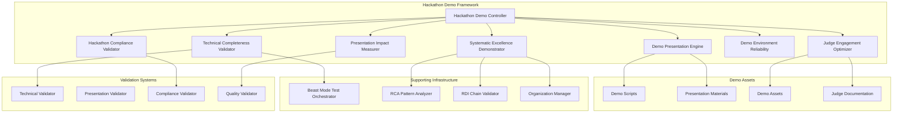
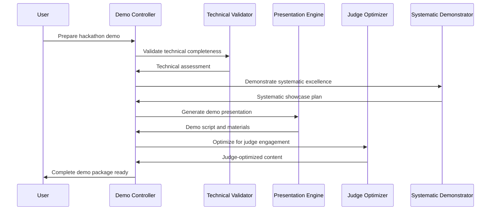
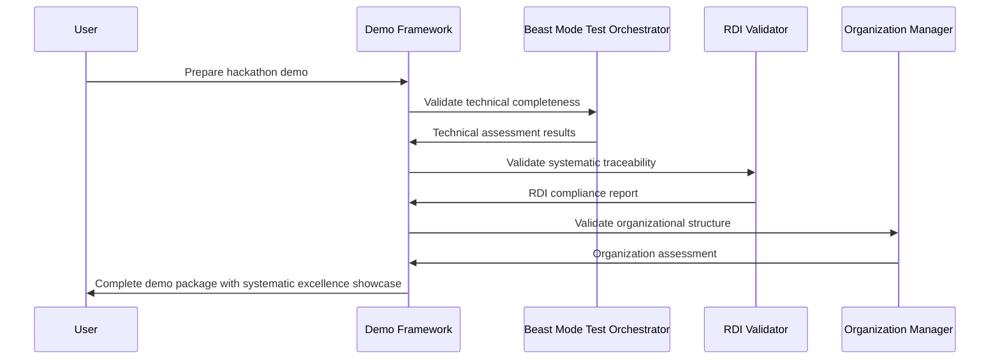

# Hackathon Demo Framework - Design Document

## Overview

The Hackathon Demo Framework implements a systematic approach to hackathon submission readiness and demo presentation excellence. The design emphasizes systematic validation, judge engagement optimization, and reusable components that demonstrate development maturity while maximizing hackathon success probability.

**Core Design Philosophy**: "The Requirements ARE the Solution" - Every requirement becomes a validation gate, every user story becomes a success metric, and every specification becomes an implementation blueprint for hackathon excellence.

## Architecture

### System Architecture Diagram



### Demo Preparation Workflow



## Components and Interfaces

### 1. Hackathon Demo Controller (Core Orchestrator)

**Responsibility**: Central coordination of all hackathon demo preparation activities

**Key Interfaces**:
- `prepare_hackathon_demo(hackathon_config)` - Orchestrates complete demo preparation
- `validate_submission_readiness()` - Comprehensive submission validation
- `generate_judge_package()` - Creates judge-ready presentation materials
- `execute_demo_rehearsal()` - Runs complete demo rehearsal with timing

**Integration Points**:
- Beast Mode Test Orchestrator for technical validation
- Systematic Excellence components for development maturity showcase
- Presentation engines for demo content generation

### 2. Technical Completeness Validator

**Responsibility**: Systematic validation of technical implementation quality

**Key Methods**:
- `validate_core_functionality()` - Verify all core features work as specified
- `assess_code_quality()` - Evaluate code quality, testing, and documentation
- `check_installation_process()` - Validate setup instructions and dependency management
- `verify_demo_reliability()` - Ensure demo environment runs consistently

**Technical Validation Framework**:
```python
@dataclass
class TechnicalAssessment:
    functionality_score: float
    code_quality_score: float
    documentation_score: float
    test_coverage_percentage: float
    installation_reliability: float
    demo_stability_score: float
    overall_technical_score: float
    critical_issues: List[str]
    improvement_recommendations: List[str]
```

### 3. Demo Presentation Engine

**Responsibility**: Generate compelling demo presentations optimized for hackathon judging

**Key Capabilities**:
- Demo script generation with timing optimization
- Presentation slide creation with systematic templates
- Story arc development for maximum impact
- Technical depth balancing for mixed judge audiences

**Demo Structure Framework**:
```python
@dataclass
class DemoScript:
    opening_hook: str  # 30 seconds - grab attention
    problem_statement: str  # 60 seconds - establish need
    solution_overview: str  # 90 seconds - present approach
    technical_demonstration: str  # 180 seconds - show it working
    systematic_excellence: str  # 60 seconds - highlight development maturity
    business_impact: str  # 60 seconds - show value proposition
    closing_call_to_action: str  # 30 seconds - memorable finish
    total_duration: int  # Target: 8-10 minutes with Q&A buffer
    backup_plans: List[str]  # Contingency for demo failures
```

### 4. Judge Engagement Optimizer

**Responsibility**: Optimize presentation content and delivery for maximum judge engagement

**Optimization Strategies**:
- Judge persona analysis and content customization
- Engagement technique integration (storytelling, interaction, demonstration)
- Technical depth calibration for mixed audiences
- Memorable element integration for post-demo recall

**Judge Engagement Framework**:
```python
@dataclass
class JudgeEngagementPlan:
    judge_personas: List[JudgePersona]  # Technical, Business, Design, etc.
    engagement_techniques: List[EngagementTechnique]
    technical_depth_calibration: TechnicalDepthStrategy
    memorable_elements: List[MemorableElement]
    interaction_opportunities: List[InteractionPoint]
    differentiation_highlights: List[DifferentiationPoint]
```

### 5. Systematic Excellence Demonstrator

**Responsibility**: Showcase systematic development approach and Beast Mode principles

**Demonstration Elements**:
- Spec-driven development process showcase
- Beast Mode framework implementation highlights
- Systematic testing and quality assurance demonstration
- RDI traceability and development maturity evidence

**Systematic Showcase Framework**:
```python
@dataclass
class SystematicShowcase:
    spec_driven_evidence: List[str]  # Show requirements → design → implementation
    beast_mode_highlights: List[str]  # Demonstrate systematic principles
    quality_metrics: QualityMetrics  # Test coverage, documentation, etc.
    development_maturity: MaturityIndicators  # RCA, PDCA, systematic approach
    competitive_advantages: List[str]  # Why systematic beats ad-hoc
```

### 6. Hackathon Compliance Validator

**Responsibility**: Ensure submission meets all hackathon-specific requirements

**Compliance Categories**:
- Mandatory submission requirements (.kiro directory, README, etc.)
- Hackathon-specific criteria (theme alignment, technology requirements)
- Submission format and deadline compliance
- Team and eligibility requirements

**Compliance Validation Engine**:
```python
@dataclass
class ComplianceAssessment:
    mandatory_requirements: Dict[str, bool]
    hackathon_specific_criteria: Dict[str, float]
    submission_format_compliance: bool
    deadline_compliance: bool
    team_eligibility: bool
    overall_compliance_score: float
    blocking_issues: List[str]
    warning_issues: List[str]
```

### 7. Demo Environment Reliability Manager

**Responsibility**: Ensure demo environment is bulletproof and failure-resistant

**Reliability Strategies**:
- Isolated demo environment with all dependencies
- Multiple backup plans for common failure scenarios
- Pre-demo validation and smoke testing
- Real-time monitoring during presentation

**Reliability Framework**:
```python
@dataclass
class DemoEnvironment:
    environment_id: str
    isolation_level: IsolationLevel
    dependency_validation: DependencyStatus
    backup_strategies: List[BackupStrategy]
    failure_scenarios: List[FailureScenario]
    monitoring_config: MonitoringConfig
    reliability_score: float
```

### 8. Presentation Impact Measurer

**Responsibility**: Measure and optimize presentation effectiveness

**Impact Metrics**:
- Demo timing and pacing analysis
- Content coverage and completeness
- Judge engagement indicators
- Technical demonstration effectiveness

**Impact Measurement Framework**:
```python
@dataclass
class PresentationMetrics:
    timing_analysis: TimingAnalysis
    content_coverage: ContentCoverage
    engagement_indicators: EngagementMetrics
    technical_demonstration_effectiveness: float
    systematic_excellence_showcase: float
    overall_impact_score: float
    improvement_opportunities: List[str]
```

## Data Models

### Core Demo Framework Models

```python
@dataclass
class HackathonConfig:
    hackathon_name: str
    hackathon_id: str
    submission_deadline: datetime
    demo_time_limit: int  # minutes
    judging_criteria: List[JudgingCriterion]
    required_elements: List[str]
    theme_requirements: List[str]
    technical_requirements: List[str]

@dataclass
class JudgingCriterion:
    criterion_name: str
    weight_percentage: float
    description: str
    optimization_strategies: List[str]

@dataclass
class DemoPackage:
    demo_script: DemoScript
    presentation_slides: PresentationSlides
    demo_environment: DemoEnvironment
    judge_materials: JudgeMaterials
    backup_plans: List[BackupPlan]
    systematic_showcase: SystematicShowcase
    compliance_verification: ComplianceAssessment

@dataclass
class JudgeMaterials:
    executive_summary: str
    technical_overview: str
    systematic_development_evidence: str
    competitive_analysis: str
    business_impact_summary: str
    demo_instructions: str
```

## Error Handling

### Demo Failure Scenarios and Mitigation

1. **Technical Demo Failures**
   - Network connectivity issues during live demo
   - Dependency conflicts in demo environment
   - Performance issues under presentation pressure
   - Integration failures with external services

2. **Presentation Failures**
   - Timing overruns or underruns
   - Technical depth misalignment with judge expertise
   - Engagement loss during technical sections
   - Q&A preparation gaps

3. **Compliance Failures**
   - Missing mandatory submission elements
   - Deadline violations
   - Format non-compliance
   - Eligibility issues

### Systematic Error Prevention

```python
class DemoFailurePrevention:
    def create_backup_plans(self, demo_config: DemoConfig) -> List[BackupPlan]:
        """Create comprehensive backup plans for demo scenarios"""
        
    def validate_demo_reliability(self, demo_env: DemoEnvironment) -> ReliabilityReport:
        """Validate demo environment reliability before presentation"""
        
    def prepare_failure_recovery(self, failure_scenarios: List[FailureScenario]) -> RecoveryPlan:
        """Prepare systematic recovery procedures for demo failures"""
```

## Testing Strategy

### Demo Framework Testing Approach

1. **Technical Validation Testing**
   - Automated technical completeness verification
   - Code quality and coverage validation
   - Documentation completeness checking
   - Installation process verification

2. **Demo Presentation Testing**
   - Demo script timing validation
   - Presentation flow testing
   - Content coverage verification
   - Engagement optimization testing

3. **Judge Engagement Testing**
   - Judge persona simulation
   - Content effectiveness measurement
   - Technical depth calibration testing
   - Memorability factor assessment

4. **Compliance Testing**
   - Hackathon requirement verification
   - Submission format validation
   - Deadline compliance checking
   - Eligibility verification

5. **Reliability Testing**
   - Demo environment stability testing
   - Failure scenario simulation
   - Backup plan validation
   - Recovery procedure testing

### Test Execution Framework

```python
class HackathonDemoTester:
    def test_technical_completeness(self, project_path: Path) -> TechnicalAssessment:
        """Comprehensive technical validation"""
        
    def test_demo_presentation(self, demo_script: DemoScript) -> PresentationAssessment:
        """Demo presentation effectiveness testing"""
        
    def test_judge_engagement(self, demo_package: DemoPackage) -> EngagementAssessment:
        """Judge engagement optimization testing"""
        
    def test_systematic_showcase(self, systematic_evidence: SystematicEvidence) -> ShowcaseAssessment:
        """Systematic excellence demonstration testing"""
```

## Performance Considerations

### Demo Performance Requirements

- **Technical Validation**: < 60 seconds for complete technical assessment
- **Demo Generation**: < 30 seconds for demo script and materials generation
- **Compliance Checking**: < 15 seconds for full compliance verification
- **Environment Setup**: < 120 seconds for complete demo environment preparation
- **Presentation Optimization**: < 45 seconds for judge engagement optimization

### Scalability Design

- **Multi-Hackathon Support**: Framework scales to support unlimited hackathon configurations
- **Team Collaboration**: Supports teams of 1-10 members with role-based coordination
- **Reusability**: Templates and components reusable across multiple hackathons
- **Performance Optimization**: Caching and incremental updates for efficiency

## Security Considerations

### Demo Security Framework

1. **Sensitive Data Protection**: Ensure no sensitive data exposed in demo materials
2. **Environment Isolation**: Demo environment isolated from production systems
3. **Access Control**: Appropriate access controls for team collaboration
4. **Data Privacy**: Compliance with hackathon data privacy requirements

## Integration Architecture

### Beast Mode Framework Integration

The Hackathon Demo Framework integrates seamlessly with existing Beast Mode components:

1. **Beast Mode Test Orchestrator**: Technical validation and systematic testing
2. **RCA Pattern Analyzer**: Systematic problem identification and resolution
3. **RDI Chain Validator**: Requirements-design-implementation traceability
4. **Systematic Organization**: Proper project structure and documentation

### Integration Flow



## Monitoring and Observability

### Demo Framework Metrics

- **Technical Readiness Score**: Comprehensive technical implementation assessment
- **Presentation Effectiveness Score**: Demo presentation quality and engagement
- **Judge Engagement Score**: Optimization for judge criteria and preferences
- **Systematic Excellence Score**: Development maturity and Beast Mode demonstration
- **Compliance Score**: Hackathon requirement adherence
- **Overall Demo Readiness Score**: Composite score for submission confidence

### Real-Time Monitoring

- **Demo Environment Health**: Continuous monitoring of demo environment stability
- **Presentation Timing**: Real-time timing analysis during rehearsals
- **Content Coverage**: Tracking of required content element inclusion
- **Systematic Showcase**: Monitoring of systematic development evidence presentation

## Design Decisions and Rationale

### Systematic Validation First Decision

**Decision**: Always perform technical and systematic validation before demo content generation

**Rationale**: Following Beast Mode principles, we must ensure the foundation (technical implementation and systematic approach) is solid before focusing on presentation. This prevents demos that look good but lack substance.

### Judge-Centric Optimization Decision

**Decision**: Optimize all content and presentation elements specifically for hackathon judge engagement

**Rationale**: Hackathon success depends on judge evaluation. By systematically analyzing judge criteria and optimizing for engagement, we maximize success probability while maintaining technical excellence.

### Reusable Framework Decision

**Decision**: Design framework components for reuse across multiple hackathons

**Rationale**: Frequent hackathon participants benefit from systematic reusability. Templates, validation frameworks, and presentation strategies can be adapted for different hackathons while maintaining systematic excellence.

### Systematic Excellence Integration Decision

**Decision**: Integrate systematic development showcase as core demo element

**Rationale**: Systematic development approach is a competitive advantage that demonstrates maturity and professionalism. Judges value evidence of good development practices, making systematic excellence a key differentiator.

### Multi-Modal Backup Strategy Decision

**Decision**: Implement multiple backup strategies for different failure scenarios

**Rationale**: Demo failures can eliminate hackathon success regardless of technical quality. Systematic backup planning ensures presentation success even when technical issues occur.

## Implementation Architecture

### Core Implementation Strategy

1. **Modular Design**: Each component can be used independently or as part of complete framework
2. **Template-Based**: Reusable templates for different hackathon types and judging criteria
3. **Validation-Driven**: Every component includes systematic validation and quality gates
4. **Beast Mode Integration**: Seamless integration with existing systematic development tools

### Component Implementation Priority

1. **Phase 1**: Technical Completeness Validator and Hackathon Compliance Validator
2. **Phase 2**: Demo Presentation Engine and Judge Engagement Optimizer
3. **Phase 3**: Systematic Excellence Demonstrator and Demo Environment Reliability
4. **Phase 4**: Presentation Impact Measurer and Multi-Hackathon Reusability

### Quality Assurance Strategy

- **Systematic Testing**: All components tested using Beast Mode Test Orchestrator
- **Demo Rehearsal**: Complete demo rehearsal as part of validation process
- **Judge Simulation**: Simulated judge evaluation for presentation optimization
- **Failure Scenario Testing**: Comprehensive testing of backup plans and recovery procedures