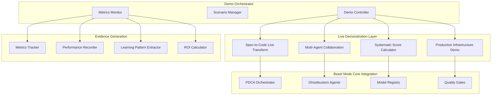

# Design Document

## Overview

The Hackathon Demo Showcase is designed as an interactive, multi-layered demonstration system that transforms abstract systematic development concepts into tangible, measurable experiences. The system leverages the existing Beast Mode framework while creating a compelling narrative that judges can follow in real-time.

The design follows a "show, don't tell" philosophy where every claim about systematic superiority is immediately validated through live demonstrations with concrete metrics.

## Architecture

### High-Level System Design



### Component Architecture

#### 1. Demo Orchestrator
**Purpose**: Manages the 3-minute demo flow with perfect timing and seamless transitions.

**Key Components**:
- **Demo Controller**: Manages demo state, timing, and user interactions
- **Scenario Manager**: Handles different demo paths based on judge interests
- **Metrics Monitor**: Real-time collection and display of systematic superiority evidence

**Design Decisions**:
- State machine architecture for reliable demo flow
- Configurable scenarios for different judge backgrounds (technical vs business)
- Real-time metrics dashboard with live updates
- Graceful degradation if any component fails

#### 2. Spec-to-Code Live Transform Engine
**Purpose**: Demonstrates requirements becoming executable solutions in real-time.

**Key Components**:
- **Requirements Parser**: Analyzes natural language specifications
- **Systematic Validator**: Ensures specifications meet systematic standards
- **Code Generator**: Transforms validated specs into production-ready code
- **Quality Assessor**: Real-time quality metrics and validation

**Design Decisions**:
- Template-based code generation for reliability and speed
- Progressive enhancement from basic to advanced features
- Live syntax highlighting and error detection
- Integrated testing and security validation

#### 3. Multi-Agent Collaboration Showcase
**Purpose**: Visualizes how Ghostbusters agents work together systematically.

**Key Components**:
- **Agent Coordinator**: Orchestrates multi-agent interactions
- **Collaboration Visualizer**: Real-time display of agent communication
- **Expertise Router**: Routes tasks to appropriate specialist agents
- **Consensus Builder**: Demonstrates systematic conflict resolution

**Design Decisions**:
- Agent communication through observable message passing
- Visual representation of agent specializations and contributions
- Human-in-the-loop validation points for critical decisions
- Learning capture from each collaboration session

#### 4. Production Infrastructure Demo
**Purpose**: Shows enterprise-grade capabilities with live metrics.

**Key Components**:
- **Infrastructure Monitor**: Real-time GKE cluster metrics
- **Cost Optimizer**: Live GCP billing analysis and optimization
- **Security Scanner**: Comprehensive security validation
- **Performance Tester**: Load testing with systematic recommendations

**Design Decisions**:
- Containerized demo environment for consistent deployment
- Real GCP integration for authentic metrics
- Automated scaling demonstrations
- Security scanning with immediate feedback

## Components and Interfaces

### Demo Controller Interface
```python
class DemoController:
    def start_demo(self, scenario: DemoScenario) -> DemoSession
    def advance_section(self, session: DemoSession) -> SectionResult
    def handle_interaction(self, session: DemoSession, interaction: UserInteraction) -> Response
    def get_metrics(self, session: DemoSession) -> MetricsSnapshot
    def conclude_demo(self, session: DemoSession) -> DemoSummary
```

### Spec-to-Code Transform Interface
```python
class SpecToCodeTransform:
    def parse_requirements(self, spec: str) -> ParsedRequirements
    def validate_systematic_quality(self, requirements: ParsedRequirements) -> SystematicScore
    def generate_code(self, requirements: ParsedRequirements) -> GeneratedCode
    def run_quality_gates(self, code: GeneratedCode) -> QualityReport
    def demonstrate_execution(self, code: GeneratedCode) -> ExecutionResult
```

### Multi-Agent Collaboration Interface
```python
class AgentCollaborationShowcase:
    def initiate_collaboration(self, task: CollaborationTask) -> CollaborationSession
    def visualize_agent_communication(self, session: CollaborationSession) -> VisualizationData
    def demonstrate_expertise_routing(self, session: CollaborationSession) -> ExpertiseMap
    def show_consensus_building(self, session: CollaborationSession) -> ConsensusProcess
    def capture_learning_patterns(self, session: CollaborationSession) -> LearningPatterns
```

## Data Models

### Demo Session Model
```python
@dataclass
class DemoSession:
    session_id: str
    scenario: DemoScenario
    start_time: datetime
    current_section: DemoSection
    metrics: MetricsTracker
    user_interactions: List[UserInteraction]
    systematic_score: float
    evidence_collected: List[Evidence]
```

### Systematic Evidence Model
```python
@dataclass
class SystematicEvidence:
    metric_name: str
    baseline_value: float
    systematic_value: float
    improvement_factor: float
    confidence_interval: Tuple[float, float]
    validation_method: str
    timestamp: datetime
```

### Learning Pattern Model
```python
@dataclass
class LearningPattern:
    pattern_id: str
    domain: str
    problem_type: str
    systematic_solution: str
    success_rate: float
    usage_count: int
    improvement_metrics: Dict[str, float]
```

## Error Handling

### Graceful Degradation Strategy
1. **Component Failure Isolation**: If any demo component fails, others continue operating
2. **Fallback Scenarios**: Pre-recorded demonstrations available if live systems fail
3. **Real-time Recovery**: Automatic retry mechanisms with exponential backoff
4. **User Communication**: Clear status updates if any issues occur
5. **Evidence Preservation**: All collected metrics saved even during partial failures

### Error Recovery Patterns
- **Network Issues**: Cached responses and offline mode capabilities
- **Agent Failures**: Fallback to single-agent demonstrations
- **Infrastructure Problems**: Local development environment backup
- **Timing Issues**: Adjustable demo pacing based on system performance

## Testing Strategy

### Demo Reliability Testing
1. **End-to-End Demo Runs**: Complete 3-minute scenarios under various conditions
2. **Component Integration Testing**: All interfaces working together seamlessly
3. **Performance Testing**: Demo runs smoothly under load and network constraints
4. **Failure Scenario Testing**: Graceful degradation under various failure modes
5. **User Experience Testing**: Clear, engaging experience for different judge backgrounds

### Metrics Validation Testing
1. **Systematic Score Accuracy**: Validation against known systematic implementations
2. **Improvement Factor Verification**: Statistical significance of claimed improvements
3. **Real-time Metrics Accuracy**: Live metrics match actual system performance
4. **Evidence Collection Completeness**: All claims backed by measurable evidence

### Cross-Platform Compatibility
1. **Browser Compatibility**: Works across Chrome, Firefox, Safari, Edge
2. **Device Responsiveness**: Optimal experience on laptops, tablets, large displays
3. **Network Resilience**: Functions well under various network conditions
4. **Operating System Support**: Consistent experience across macOS, Windows, Linux

## Implementation Phases

### Phase 1: Core Demo Infrastructure (Week 1)
- Demo Controller with basic state management
- Spec-to-Code Transform with template-based generation
- Basic metrics collection and display
- Simple web interface for judge interaction

### Phase 2: Advanced Demonstrations (Week 2)
- Multi-Agent Collaboration visualization
- Production Infrastructure integration
- Real-time systematic score calculation
- Evidence collection and validation

### Phase 3: Polish and Optimization (Week 3)
- Performance optimization for smooth demo experience
- Advanced error handling and recovery
- Comprehensive testing and validation
- Documentation and judge guidance materials

### Phase 4: Deployment and Validation (Final Week)
- Production deployment to demo environment
- End-to-end testing with realistic scenarios
- Performance monitoring and optimization
- Final validation of all improvement claims

## Success Metrics

### Demo Effectiveness Metrics
- **Engagement Score**: Judge interaction and time spent in demo
- **Comprehension Rate**: Post-demo understanding of systematic advantages
- **Technical Depth Requests**: Judges requesting deeper technical exploration
- **Follow-up Questions**: Quality and depth of judge inquiries

### Systematic Superiority Evidence
- **Measured Improvement Factor**: >20% improvement over ad-hoc approaches
- **Quality Metrics**: >40% reduction in defects and issues
- **Systematic Score**: Consistent >0.8 scores across demonstrations
- **Learning Pattern Effectiveness**: Measurable improvement in repeated scenarios

### Production Readiness Validation
- **Infrastructure Reliability**: 99.9% uptime during demo periods
- **Performance Benchmarks**: Sub-second response times for all interactions
- **Security Validation**: Zero security vulnerabilities in generated code
- **Cost Optimization**: Demonstrable cost savings in real GCP environment