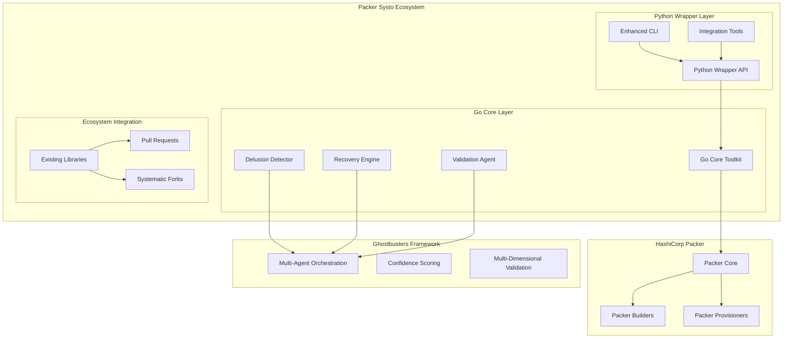
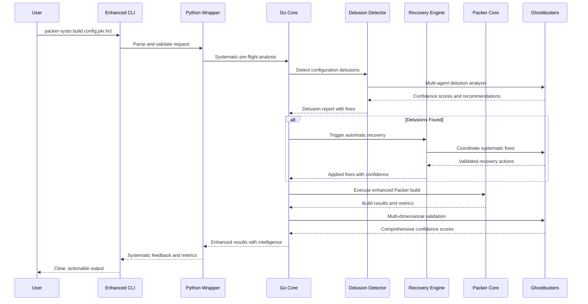

# HashiCorp Packer UX Improvements - Design Document

## Overview

This design document outlines a comprehensive multi-language systematic improvement ecosystem for HashiCorp Packer that applies Beast Mode Framework principles to transform the developer experience. The solution consists of three integrated components: (1) Go-based core improvements for native Packer enhancement, (2) Python-based systematic wrappers distributed via PyPI, and (3) systematic contributions to existing Python Packer libraries in the ecosystem.

The design emphasizes systematic collaboration over ad-hoc solutions, providing intelligent delusion detection, multi-dimensional validation, automatic recovery engines, and comprehensive observability to make Packer truly accessible to all skill levels.

## Architecture

### High-Level System Architecture



### Component Interaction Flow



## Components and Interfaces

### 1. Go Core Toolkit (`packer-systo-go`)

**Purpose**: Native Go integration with Packer's architecture for maximum performance and compatibility.

**Key Components**:

#### Delusion Detection Engine
```go
type DelusionDetector interface {
    AnalyzeConfiguration(config *PackerConfig) (*DelusionReport, error)
    DetectPatterns(hcl string) ([]DelusionPattern, error)
    LearnFromCorrection(pattern DelusionPattern, correction string) error
    GetConfidenceScore(analysis *DelusionAnalysis) float64
}

type DelusionPattern struct {
    Type        DelusionType  // Syntax, Security, Architecture, Build
    Severity    Severity      // Critical, High, Medium, Low
    Pattern     string        // Regex or AST pattern
    Description string        // Human-readable description
    Remediation string        // Suggested fix
    Examples    []string      // Common occurrences
}
```

#### Recovery Engine
```go
type RecoveryEngine interface {
    DiagnoseFailure(buildLog string, config *PackerConfig) (*Diagnosis, error)
    GenerateRecoveryPlan(diagnosis *Diagnosis) (*RecoveryPlan, error)
    ExecuteRecovery(plan *RecoveryPlan) (*RecoveryResult, error)
    ValidateRecovery(result *RecoveryResult) (*ValidationReport, error)
}

type RecoveryPlan struct {
    Steps       []RecoveryStep
    Confidence  float64
    Rollback    []RollbackStep
    Validation  []ValidationCheck
}
```

#### Validation Agent
```go
type ValidationAgent interface {
    ValidateConfiguration(config *PackerConfig) (*ValidationReport, error)
    PerformMultiDimensionalCheck(build *BuildResult) (*MultiDimReport, error)
    GenerateConfidenceScore(metrics *BuildMetrics) float64
    CreateValidationCertificate(report *ValidationReport) (*Certificate, error)
}

type MultiDimReport struct {
    Functionality float64  // Does it work as expected?
    Performance   float64  // Is it optimized?
    Security      float64  // Is it secure?
    Compliance    float64  // Does it meet standards?
    Overall       float64  // Weighted average
}
```

### 2. Python Wrapper Layer (`packer-systo`)

**Purpose**: Python-friendly interface for the Go core toolkit with enhanced CLI and integration capabilities.

**Key Components**:

#### Enhanced CLI Interface
```python
class PackerSystoCLI:
    """Enhanced CLI with systematic intelligence"""
    
    def build(self, config_path: str, **kwargs) -> BuildResult:
        """Execute systematic Packer build with intelligence"""
        
    def validate(self, config_path: str) -> ValidationReport:
        """Comprehensive configuration validation"""
        
    def diagnose(self, build_log: str) -> DiagnosisReport:
        """Intelligent failure diagnosis"""
        
    def optimize(self, config_path: str) -> OptimizationReport:
        """Systematic performance optimization"""
```

#### Python API Wrapper
```python
class PackerSysto:
    """Main Python API for systematic Packer operations"""
    
    def __init__(self, config: SystoConfig = None):
        self.go_core = GoCoreBridge()
        self.ghostbusters = GhostbustersClient()
        
    async def analyze_configuration(self, config: Union[str, Path, dict]) -> AnalysisResult:
        """Systematic configuration analysis with delusion detection"""
        
    async def execute_build(self, config: PackerConfig, **options) -> BuildResult:
        """Execute build with systematic intelligence and recovery"""
        
    async def validate_build(self, build_result: BuildResult) -> ValidationCertificate:
        """Multi-dimensional build validation with confidence scoring"""
```

#### Integration Tools
```python
class PackerIntegration:
    """Integration with popular Python DevOps tools"""
    
    def ansible_integration(self) -> AnsiblePackerModule:
        """Enhanced Ansible Packer module with systematic intelligence"""
        
    def fabric_tasks(self) -> FabricTaskCollection:
        """Fabric tasks for systematic Packer operations"""
        
    def cicd_plugins(self) -> Dict[str, CICDPlugin]:
        """CI/CD plugins for Jenkins, GitLab, GitHub Actions"""
```

### 3. Ecosystem Integration Layer

**Purpose**: Systematic improvement of existing Python Packer libraries through contributions and forks.

#### Library Enhancement Strategy
```python
class EcosystemEnhancer:
    """Systematic enhancement of existing Packer libraries"""
    
    def analyze_library(self, library_name: str) -> LibraryAnalysis:
        """Analyze existing library for improvement opportunities"""
        
    def generate_pull_request(self, library: Library, improvements: List[Improvement]) -> PullRequest:
        """Generate systematic improvement PR"""
        
    def create_systematic_fork(self, library: Library) -> SystematicFork:
        """Create enhanced fork with systematic improvements"""
```

## Data Models

### Configuration Models
```python
@dataclass
class PackerConfig:
    """Enhanced Packer configuration with systematic validation"""
    source: Union[str, Path]
    variables: Dict[str, Any]
    builders: List[BuilderConfig]
    provisioners: List[ProvisionerConfig]
    post_processors: List[PostProcessorConfig]
    
    def validate(self) -> ValidationResult:
        """Systematic configuration validation"""
        
    def detect_delusions(self) -> List[DelusionPattern]:
        """Intelligent delusion detection"""
```

### Analysis Models
```python
@dataclass
class DelusionAnalysis:
    """Comprehensive delusion analysis results"""
    patterns: List[DelusionPattern]
    severity_distribution: Dict[Severity, int]
    confidence_score: float
    remediation_plan: RemediationPlan
    learning_opportunities: List[LearningPattern]

@dataclass
class ValidationCertificate:
    """Multi-dimensional validation certificate"""
    config_hash: str
    validation_timestamp: datetime
    dimensions: MultiDimReport
    confidence_score: float
    audit_trail: List[ValidationStep]
    expiry: datetime
```

### Recovery Models
```python
@dataclass
class RecoveryResult:
    """Systematic recovery execution results"""
    success: bool
    applied_fixes: List[AppliedFix]
    confidence_improvement: float
    validation_results: ValidationReport
    rollback_plan: Optional[RollbackPlan]
    learning_data: LearningData
```

## Error Handling

### Systematic Error Classification
```python
class PackerSystoError(Exception):
    """Base exception with systematic error handling"""
    
    def __init__(self, message: str, error_code: str, context: ErrorContext):
        self.message = message
        self.error_code = error_code
        self.context = context
        self.remediation = self._generate_remediation()
        
    def _generate_remediation(self) -> RemediationSuggestion:
        """Generate systematic remediation suggestions"""

class DelusionDetectionError(PackerSystoError):
    """Delusion detection specific errors"""

class RecoveryEngineError(PackerSystoError):
    """Recovery engine specific errors"""

class ValidationError(PackerSystoError):
    """Validation specific errors"""
```

### Graceful Degradation Strategy
```python
class GracefulDegradation:
    """Systematic graceful degradation for reliability"""
    
    def handle_go_core_failure(self) -> FallbackStrategy:
        """Fallback to basic Packer operations with enhanced error reporting"""
        
    def handle_ghostbusters_failure(self) -> FallbackStrategy:
        """Fallback to local validation without multi-agent consensus"""
        
    def handle_network_failure(self) -> FallbackStrategy:
        """Offline mode with cached patterns and local intelligence"""
```

## Testing Strategy

### Multi-Language Testing Approach
```python
class SystematicTestSuite:
    """Comprehensive testing across Go and Python components"""
    
    def test_go_core_integration(self):
        """Test Go core toolkit functionality"""
        
    def test_python_wrapper_api(self):
        """Test Python API wrapper completeness"""
        
    def test_delusion_detection_accuracy(self):
        """Test delusion detection with known patterns"""
        
    def test_recovery_engine_effectiveness(self):
        """Test recovery engine with simulated failures"""
        
    def test_multi_dimensional_validation(self):
        """Test validation across all dimensions"""
        
    def test_ecosystem_integration(self):
        """Test integration with existing libraries"""
```

### Performance Testing
```python
class PerformanceValidation:
    """Systematic performance validation"""
    
    def benchmark_delusion_detection(self) -> PerformanceBenchmark:
        """Benchmark delusion detection speed and accuracy"""
        
    def benchmark_recovery_engine(self) -> PerformanceBenchmark:
        """Benchmark recovery engine performance"""
        
    def benchmark_validation_speed(self) -> PerformanceBenchmark:
        """Benchmark multi-dimensional validation speed"""
```

## Security Considerations

### Security-First Design
```python
class SecurityFramework:
    """Systematic security implementation"""
    
    def validate_configuration_security(self, config: PackerConfig) -> SecurityReport:
        """Comprehensive security validation"""
        
    def scan_for_vulnerabilities(self, build_result: BuildResult) -> VulnerabilityReport:
        """Systematic vulnerability scanning"""
        
    def ensure_secret_handling(self, config: PackerConfig) -> SecretValidation:
        """Validate secure secret handling"""
        
    def generate_security_attestation(self, build: BuildResult) -> SecurityAttestation:
        """Generate security attestation for builds"""
```

## Deployment and Distribution

### Go Module Distribution
```bash
# Go module installation
go get github.com/your-org/packer-systo-go

# Usage in Go projects
import "github.com/your-org/packer-systo-go/pkg/delusion"
import "github.com/your-org/packer-systo-go/pkg/recovery"
```

### PyPI Distribution
```bash
# Python package installation
pip install packer-systo

# CLI usage
packer-systo build config.pkr.hcl
packer-systo validate config.pkr.hcl
packer-systo diagnose build.log

# Python API usage
from packer_systo import PackerSysto
systo = PackerSysto()
result = await systo.execute_build(config)
```

### Integration with Existing Ecosystem
```python
# Enhanced existing libraries
pip install python-packer-systo  # Enhanced python-packer
pip install packer-py-systo      # Enhanced packer-py

# Ansible integration
ansible-galaxy collection install community.packer_systo
```

## Observability and Monitoring

### Comprehensive Metrics
```python
class SystoMetrics:
    """Systematic metrics collection and analysis"""
    
    def collect_delusion_metrics(self) -> DelusionMetrics:
        """Track delusion detection accuracy and patterns"""
        
    def collect_recovery_metrics(self) -> RecoveryMetrics:
        """Track recovery engine effectiveness"""
        
    def collect_validation_metrics(self) -> ValidationMetrics:
        """Track validation accuracy and performance"""
        
    def generate_improvement_insights(self) -> ImprovementInsights:
        """Generate insights for systematic improvement"""
```

### Audit Trail
```python
class AuditTrail:
    """Comprehensive audit trail for all operations"""
    
    def log_delusion_detection(self, analysis: DelusionAnalysis):
        """Log delusion detection with correlation IDs"""
        
    def log_recovery_execution(self, recovery: RecoveryResult):
        """Log recovery execution with detailed context"""
        
    def log_validation_results(self, validation: ValidationCertificate):
        """Log validation results with confidence factors"""
```

This design provides a comprehensive systematic improvement ecosystem for HashiCorp Packer that addresses all the pain points identified in the requirements while maintaining compatibility with existing workflows and providing clear paths for community contribution and adoption.