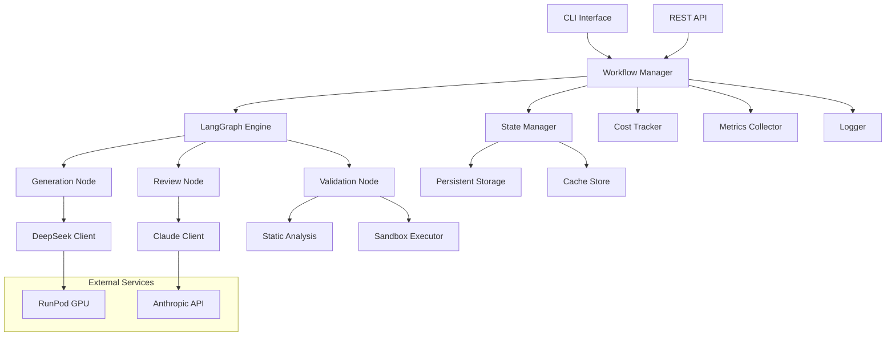

# Design Document

## Overview

The Hybrid Code Generator is a production-ready system that combines DeepSeek Coder 6.7B for fast, cost-effective code generation with Claude Sonnet 4.5 for rigorous quality review. Built on the proven prototype architecture, this design addresses scalability, reliability, security, and integration requirements for enterprise deployment.

The system uses LangGraph for workflow orchestration, implementing a state machine that manages the generation → review → refine cycle with comprehensive error handling, state persistence, and observability. It integrates seamlessly with Kiro's spec-driven development workflow while providing extensive cost tracking, security validation, and development tool integration.

## Architecture

### High-Level Architecture



### Core Components

#### 1. Workflow Manager
- **Purpose**: Orchestrates the entire code generation process
- **Responsibilities**: 
  - Initialize and manage LangGraph workflows
  - Handle concurrent task execution
  - Coordinate state persistence and recovery
  - Manage cost tracking and budget enforcement
  - Integrate with Unified Reflective Module for tracing and monitoring
- **Key Classes**: `WorkflowManager`, `TaskOrchestrator`, `ConcurrencyController`
- **RDI Compliance**: Extends `ReflectiveModule` for full observability

#### 2. State Manager
- **Purpose**: Manages workflow state persistence and recovery
- **Responsibilities**:
  - Serialize/deserialize workflow state
  - Implement checkpoint strategy
  - Handle state recovery after interruptions
  - Manage state caching for performance
  - Provide operation tracing for state transitions
- **Storage Strategy**: File-based JSON with optional Redis caching
- **Key Classes**: `StateManager`, `CheckpointManager`, `StateSerializer`
- **RDI Compliance**: Extends `ReflectiveModule` with full traceability

#### 3. Model Clients
- **DeepSeek Client**: Manages connection to RunPod GPU instance
- **Claude Client**: Handles Anthropic API interactions
- **Responsibilities**:
  - Connection management and retry logic
  - Token usage tracking with detailed metrics
  - Fallback model support
  - Rate limiting and circuit breaker patterns
  - Complete operation tracing for all API calls
- **Key Classes**: `DeepSeekClient`, `ClaudeClient`, `ModelClientBase`
- **RDI Compliance**: Each client extends `ReflectiveModule` for comprehensive monitoring

#### 4. Validation Engine
- **Purpose**: Comprehensive code validation and security scanning
- **Components**:
  - **Static Analysis**: Integration with mypy, pylint, bandit
  - **Sandbox Executor**: Safe code execution environment
  - **Security Scanner**: Credential detection, vulnerability scanning
- **Key Classes**: `ValidationEngine`, `StaticAnalyzer`, `SecurityScanner`, `SandboxExecutor`

#### 5. Context Manager
- **Purpose**: Intelligent context awareness and code pattern learning
- **Responsibilities**:
  - Analyze existing project structure
  - Maintain knowledge base of successful patterns using semantic similarity
  - Provide context-aware code generation with pattern reuse suggestions
  - Support incremental code updates with consistency checking
  - Leverage semantic caching for pattern discovery and reuse
- **Key Classes**: `ContextManager`, `PatternAnalyzer`, `KnowledgeBase`, `PatternReuseManager`
- **RDI Compliance**: Extends `ReflectiveModule` with pattern learning traceability

## Unified Reflective Module Integration

### RDI Compliance and Observability

The Hybrid Code Generator integrates deeply with the existing Unified Reflective Module (`src.rm_ddd.core.unified_reflective_module`) to provide comprehensive observability, tracing, and monitoring capabilities.

#### Core Integration Points

```python
from src.rm_ddd.core.unified_reflective_module import (
    ReflectiveModule,
    ModuleHealth,
    ModuleStatus,
    ModuleCapability,
    OperationTrace
)

class HybridCodeGeneratorWorkflow(ReflectiveModule):
    """Main workflow manager with full RDI compliance"""
    
    def __init__(self, config: HybridCodeGenConfig):
        super().__init__()
        self.config = config
        self.module_id = "hybrid-code-generator"
    
    def get_module_info(self) -> Dict[str, Any]:
        return {
            "module_id": self.module_id,
            "name": "Hybrid Code Generator",
            "version": "1.0.0",
            "description": "Cost-effective code generation using DeepSeek + Claude",
            "capabilities": [cap.value for cap in self.get_capabilities()]
        }
    
    def get_capabilities(self) -> List[ModuleCapability]:
        return [
            ModuleCapability.CORE_FUNCTIONALITY,
            ModuleCapability.DATA_PROCESSING,
            ModuleCapability.API_INTEGRATION,
            ModuleCapability.VALIDATION,
            ModuleCapability.MONITORING
        ]
    
    async def generate_code_with_tracing(self, task_description: str) -> str:
        """Generate code with full operation tracing"""
        with self.trace_operation("code_generation", 
                                task_description=task_description,
                                model="deepseek-coder") as trace:
            
            # Perform code generation
            result = await self._generate_code_internal(task_description)
            
            # Store result in trace
            trace.output_result = {
                "code_length": len(result),
                "generation_successful": True
            }
            
            return result
```

#### Tracing and Monitoring Features

1. **Operation Tracing**: Every code generation, review, and validation operation is traced with:
   - Unique trace IDs and correlation IDs
   - Start/end timestamps and duration
   - Input parameters and output results
   - Memory usage and performance metrics
   - Error information when operations fail

2. **Health Monitoring**: Continuous health assessment including:
   - Model availability and response times
   - Error rates and success metrics
   - Resource utilization (memory, CPU)
   - Cost tracking and budget status

3. **Performance Metrics**: Comprehensive metrics collection:
   - Average operation times per model
   - Token usage and cost per operation
   - Success/failure rates by operation type
   - Resource consumption patterns

4. **Prometheus Integration**: Automatic metrics export when enabled:
   - Custom metrics for code generation workflows
   - Model performance and availability metrics
   - Cost and usage tracking metrics
   - Error rate and health status metrics

#### Redis Auto-Registration

The system automatically registers with the Runtime State Registry when Redis is available:

```python
# Automatic registration provides:
{
    "module_id": "hybrid-code-generator",
    "status": "healthy",
    "capabilities": ["code_generation", "code_review", "validation"],
    "performance_metrics": {
        "avg_generation_time_ms": 3500,
        "success_rate": 0.85,
        "cost_per_task": 0.45
    },
    "last_activity": "2025-01-07T10:30:00Z"
}
```

## Components and Interfaces

### State Schema

```python
from typing import TypedDict, List, Optional, Dict, Any
from enum import Enum

class TaskStatus(Enum):
    PENDING = "pending"
    GENERATING = "generating"
    REVIEWING = "reviewing"
    VALIDATING = "validating"
    APPROVED = "approved"
    NEEDS_REVISION = "needs_revision"
    FAILED = "failed"
    COMPLETED = "completed"

class CodeGenState(TypedDict):
    # Core workflow state
    task_id: str
    task_description: str
    spec_requirements: str
    generated_code: str
    review_feedback: str
    validation_results: Dict[str, Any]
    approval_status: TaskStatus
    iteration_count: int
    final_code: str
    
    # Context and metadata
    project_context: Dict[str, Any]
    kiro_spec_path: Optional[str]
    task_index: Optional[int]
    dependencies: List[str]
    
    # Cost and performance tracking
    cost_tracking: Dict[str, float]
    token_usage: Dict[str, int]
    execution_metrics: Dict[str, Any]
    
    # Error handling and recovery
    error_history: List[Dict[str, Any]]
    checkpoint_data: Dict[str, Any]
    retry_count: int
    
    # Output configuration
    output_path: Optional[str]
    file_format: str
    include_metadata: bool
```

### Configuration Management

```python
@dataclass
class HybridCodeGenConfig:
    # Model configuration
    deepseek_base_url: str = "http://localhost:11435"
    deepseek_model: str = "deepseek-coder:6.7b"
    deepseek_temperature: float = 0.1
    
    claude_model: str = "claude-sonnet-4-20250514"
    claude_temperature: float = 0.0
    anthropic_api_key: str = field(default_factory=lambda: os.getenv("ANTHROPIC_API_KEY", ""))
    
    # Workflow parameters
    max_iterations: int = 5
    timeout_per_node: int = 60
    enable_human_review: bool = False
    
    # Cost controls
    max_cost_per_task: float = 1.0
    max_cost_per_batch: float = 50.0
    cost_alert_threshold: float = 0.8
    
    # Performance settings
    max_concurrent_tasks: int = 3
    enable_caching: bool = True
    cache_ttl: int = 3600
    
    # Validation settings
    enable_static_analysis: bool = True
    enable_security_scan: bool = True
    enable_sandbox_execution: bool = True
    sandbox_timeout: int = 30
    
    # Storage configuration
    state_storage_path: str = ".kiro/hybrid-gen/state"
    cache_storage_path: str = ".kiro/hybrid-gen/cache"
    enable_redis_cache: bool = False
    redis_url: str = "redis://localhost:6379"
    
    # Logging and monitoring
    log_level: str = "INFO"
    enable_metrics: bool = True
    metrics_endpoint: Optional[str] = None
```

### Core Interfaces

```python
from abc import ABC, abstractmethod
from src.rm_ddd.core.unified_reflective_module import ReflectiveModule, ModuleCapability

class ModelClient(ReflectiveModule, ABC):
    """Base model client with RDI compliance and full tracing"""
    
    def __init__(self, model_name: str):
        super().__init__()
        self.model_name = model_name
        self.module_id = f"model-client-{model_name}"
    
    @abstractmethod
    async def generate(self, prompt: str, context: Dict[str, Any]) -> str:
        """Generate code with automatic tracing"""
        pass
    
    @abstractmethod
    def get_token_usage(self) -> Dict[str, int]:
        pass
    
    @abstractmethod
    def get_cost_estimate(self, tokens: int) -> float:
        pass
    
    def get_capabilities(self) -> List[ModuleCapability]:
        return [
            ModuleCapability.CORE_FUNCTIONALITY,
            ModuleCapability.API_INTEGRATION
        ]

class DeepSeekClient(ModelClient):
    """DeepSeek client with comprehensive tracing and monitoring"""
    
    async def generate(self, prompt: str, context: Dict[str, Any]) -> str:
        with self.trace_operation("deepseek_generation", 
                                prompt_length=len(prompt),
                                context_keys=list(context.keys())) as trace:
            
            # Perform generation with error handling
            try:
                result = await self._call_deepseek_api(prompt, context)
                
                # Update trace with success metrics
                trace.output_result = {
                    "code_length": len(result),
                    "tokens_used": self._last_token_count,
                    "cost": self.get_cost_estimate(self._last_token_count)
                }
                
                return result
                
            except Exception as e:
                # Error is automatically captured by trace_operation
                self._logger.error(f"DeepSeek generation failed: {e}")
                raise

class Validator(ABC):
    @abstractmethod
    async def validate(self, code: str, context: Dict[str, Any]) -> Dict[str, Any]:
        pass

class StateStore(ABC):
    @abstractmethod
    async def save_state(self, task_id: str, state: CodeGenState) -> None:
        pass
    
    @abstractmethod
    async def load_state(self, task_id: str) -> Optional[CodeGenState]:
        pass
    
    @abstractmethod
    async def delete_state(self, task_id: str) -> None:
        pass
```

## Data Models

### Task Specification Model

```python
@dataclass
class KiroTask:
    id: str
    description: str
    requirements: List[str]
    dependencies: List[str]
    optional: bool
    metadata: Dict[str, Any]
    
    @classmethod
    def from_markdown(cls, markdown_text: str, task_index: int) -> 'KiroTask':
        """Parse Kiro task from markdown format"""
        pass

@dataclass
class KiroSpec:
    spec_path: str
    requirements: str
    design: str
    tasks: List[KiroTask]
    
    @classmethod
    def load_from_path(cls, spec_path: str) -> 'KiroSpec':
        """Load complete Kiro spec from directory"""
        pass
```

### Cost Tracking Model

```python
@dataclass
class CostMetrics:
    deepseek_tokens: int = 0
    claude_tokens: int = 0
    deepseek_cost: float = 0.0
    claude_cost: float = 0.0
    total_cost: float = 0.0
    execution_time: float = 0.0
    
    def add_generation_cost(self, tokens: int, cost: float):
        self.deepseek_tokens += tokens
        self.deepseek_cost += cost
        self.total_cost += cost
    
    def add_review_cost(self, tokens: int, cost: float):
        self.claude_tokens += tokens
        self.claude_cost += cost
        self.total_cost += cost
```

### Validation Results Model

```python
@dataclass
class ValidationResult:
    passed: bool
    errors: List[str]
    warnings: List[str]
    metrics: Dict[str, Any]
    
@dataclass
class ComprehensiveValidation:
    syntax_check: ValidationResult
    static_analysis: ValidationResult
    security_scan: ValidationResult
    sandbox_execution: ValidationResult
    overall_passed: bool
    
    def __post_init__(self):
        self.overall_passed = all([
            self.syntax_check.passed,
            self.static_analysis.passed,
            self.security_scan.passed,
            self.sandbox_execution.passed
        ])
```

## Error Handling

### Error Classification

```python
class ErrorCategory(Enum):
    NETWORK_ERROR = "network"
    API_ERROR = "api"
    VALIDATION_ERROR = "validation"
    CONFIGURATION_ERROR = "configuration"
    WORKFLOW_ERROR = "workflow"
    SECURITY_ERROR = "security"

@dataclass
class HybridGenError:
    category: ErrorCategory
    message: str
    context: Dict[str, Any]
    timestamp: datetime
    recoverable: bool
    retry_count: int = 0
```

### Recovery Strategies

#### 1. Network and API Failures
- **Exponential backoff**: 1s, 2s, 4s delays
- **Circuit breaker**: Open circuit after 5 consecutive failures
- **Fallback models**: Switch to alternative endpoints
- **Graceful degradation**: Continue with last known good state

#### 2. Validation Failures
- **Incremental fixes**: Apply specific fixes for common issues
- **Alternative approaches**: Try different generation strategies
- **Human escalation**: Flag for manual review when automated fixes fail

#### 3. State Recovery
- **Checkpoint strategy**: Save state before each node execution
- **Recovery workflow**: Resume from last successful checkpoint
- **State validation**: Verify state integrity on recovery
- **Cleanup procedures**: Handle partial state corruption

### Checkpoint Strategy

```python
class CheckpointManager:
    def __init__(self, storage_path: str):
        self.storage_path = Path(storage_path)
        self.storage_path.mkdir(parents=True, exist_ok=True)
    
    async def create_checkpoint(self, task_id: str, state: CodeGenState) -> str:
        """Create a checkpoint and return checkpoint ID"""
        checkpoint_id = f"{task_id}_{datetime.now().isoformat()}"
        checkpoint_path = self.storage_path / f"{checkpoint_id}.json"
        
        checkpoint_data = {
            "checkpoint_id": checkpoint_id,
            "task_id": task_id,
            "timestamp": datetime.now().isoformat(),
            "state": state,
            "metadata": {
                "iteration": state["iteration_count"],
                "status": state["approval_status"],
                "cost": state["cost_tracking"]
            }
        }
        
        with open(checkpoint_path, 'w') as f:
            json.dump(checkpoint_data, f, indent=2)
        
        return checkpoint_id
    
    async def restore_from_checkpoint(self, checkpoint_id: str) -> CodeGenState:
        """Restore state from checkpoint"""
        checkpoint_path = self.storage_path / f"{checkpoint_id}.json"
        
        if not checkpoint_path.exists():
            raise FileNotFoundError(f"Checkpoint {checkpoint_id} not found")
        
        with open(checkpoint_path, 'r') as f:
            checkpoint_data = json.load(f)
        
        return checkpoint_data["state"]
```

## Testing Strategy

### Unit Testing
- **Model Clients**: Mock API responses, test retry logic
- **Validation Engine**: Test with known good/bad code samples
- **State Manager**: Test serialization/deserialization
- **Cost Tracker**: Verify cost calculations and budget enforcement

### Integration Testing
- **End-to-end workflows**: Complete generation cycles
- **Error scenarios**: Network failures, API errors, validation failures
- **State recovery**: Checkpoint creation and restoration
- **Concurrent execution**: Multiple tasks running simultaneously

### Performance Testing
- **Load testing**: Multiple concurrent tasks
- **Stress testing**: High-volume batch processing
- **Cost validation**: Verify cost targets are met
- **Memory usage**: Monitor for memory leaks in long-running processes

### Security Testing
- **Sandbox isolation**: Verify code execution safety
- **Credential scanning**: Test detection of hardcoded secrets
- **Input validation**: Test with malicious inputs
- **Access controls**: Verify file system restrictions

## Security Considerations

### Sandbox Environment

```python
class DockerSandbox:
    """Docker-based code execution sandbox"""
    
    def __init__(self, image: str = "python:3.11-slim"):
        self.image = image
        self.timeout = 30
        self.memory_limit = "128m"
        self.network_mode = "none"
    
    async def execute_code(self, code: str, test_inputs: List[str] = None) -> Dict[str, Any]:
        """Execute code in isolated Docker container"""
        container_config = {
            "image": self.image,
            "command": ["python", "-c", code],
            "mem_limit": self.memory_limit,
            "network_mode": self.network_mode,
            "read_only": True,
            "user": "nobody",
            "cap_drop": ["ALL"],
            "security_opt": ["no-new-privileges:true"]
        }
        
        # Implementation details for Docker execution
        pass

class RestrictedPythonSandbox:
    """Alternative lightweight sandbox using RestrictedPython"""
    
    def __init__(self):
        self.restricted_globals = {
            '__builtins__': safe_builtins,
            '__name__': '__main__',
        }
        self.allowed_modules = {'math', 'datetime', 'json', 're'}
    
    async def execute_code(self, code: str) -> Dict[str, Any]:
        """Execute code with restricted Python environment"""
        pass
```

### Security Scanning

```python
class SecurityScanner:
    def __init__(self):
        self.credential_patterns = [
            r'api[_-]?key\s*=\s*["\'][^"\']+["\']',
            r'password\s*=\s*["\'][^"\']+["\']',
            r'secret\s*=\s*["\'][^"\']+["\']',
            r'token\s*=\s*["\'][^"\']+["\']',
        ]
        self.dangerous_imports = [
            'subprocess', 'os.system', 'eval', 'exec',
            'importlib', '__import__', 'compile'
        ]
    
    async def scan_code(self, code: str) -> Dict[str, Any]:
        """Comprehensive security scan of generated code"""
        results = {
            "credentials_found": [],
            "dangerous_imports": [],
            "file_operations": [],
            "network_operations": [],
            "security_score": 100
        }
        
        # Implement scanning logic
        return results
```

## Performance Optimization

### Intelligent Caching Strategy

```python
class SemanticCacheManager:
    def __init__(self, config: HybridCodeGenConfig):
        self.config = config
        self.local_cache = {}
        self.redis_client = None
        self.embedding_model = None
        self.similarity_threshold = 0.85
        
        if config.enable_redis_cache:
            self.redis_client = redis.from_url(config.redis_url)
        
        # Initialize embedding model for semantic similarity
        self._initialize_embedding_model()
    
    def _initialize_embedding_model(self):
        """Initialize lightweight embedding model for semantic similarity"""
        try:
            from sentence_transformers import SentenceTransformer
            # Use a fast, lightweight model for task similarity
            self.embedding_model = SentenceTransformer('all-MiniLM-L6-v2')
        except ImportError:
            self._logger.warning("sentence-transformers not available. Falling back to exact matching.")
    
    async def get_cached_result(self, task_description: str, requirements: str) -> Optional[Dict[str, Any]]:
        """Get cached result with semantic similarity matching"""
        # Try exact match first (fastest)
        exact_key = self._generate_exact_cache_key(task_description, requirements)
        exact_result = await self._get_exact_cached_result(exact_key)
        if exact_result:
            return {
                "code": exact_result,
                "match_type": "exact",
                "similarity_score": 1.0
            }
        
        # Try semantic similarity matching
        if self.embedding_model:
            similar_result = await self._find_similar_cached_result(task_description, requirements)
            if similar_result:
                return similar_result
        
        return None
    
    async def _find_similar_cached_result(self, task_description: str, requirements: str) -> Optional[Dict[str, Any]]:
        """Find semantically similar cached results"""
        query_text = f"{task_description} {requirements}"
        query_embedding = self.embedding_model.encode([query_text])[0]
        
        # Get all cached task embeddings and compare
        cached_tasks = await self._get_cached_task_embeddings()
        
        best_match = None
        best_similarity = 0.0
        
        for cache_entry in cached_tasks:
            similarity = self._cosine_similarity(query_embedding, cache_entry["embedding"])
            
            if similarity > self.similarity_threshold and similarity > best_similarity:
                best_similarity = similarity
                best_match = cache_entry
        
        if best_match:
            # Retrieve the actual cached code
            cached_code = await self._get_exact_cached_result(best_match["cache_key"])
            if cached_code:
                return {
                    "code": cached_code,
                    "match_type": "semantic",
                    "similarity_score": best_similarity,
                    "original_task": best_match["task_description"]
                }
        
        return None
    
    async def cache_result(self, task_description: str, requirements: str, result: str, metadata: Dict[str, Any] = None):
        """Cache result with semantic indexing"""
        exact_key = self._generate_exact_cache_key(task_description, requirements)
        
        # Cache the actual result
        await self._cache_exact_result(exact_key, result)
        
        # Cache semantic information for similarity matching
        if self.embedding_model:
            await self._cache_semantic_info(exact_key, task_description, requirements, metadata or {})
    
    async def _cache_semantic_info(self, cache_key: str, task_description: str, requirements: str, metadata: Dict[str, Any]):
        """Cache semantic information for similarity matching"""
        query_text = f"{task_description} {requirements}"
        embedding = self.embedding_model.encode([query_text])[0]
        
        semantic_entry = {
            "cache_key": cache_key,
            "task_description": task_description,
            "requirements": requirements,
            "embedding": embedding.tolist(),  # Convert numpy array to list for JSON serialization
            "metadata": metadata,
            "timestamp": datetime.now().isoformat()
        }
        
        # Store in Redis with semantic index
        if self.redis_client:
            semantic_key = f"semantic:{cache_key}"
            await self.redis_client.setex(
                semantic_key,
                self.config.cache_ttl,
                json.dumps(semantic_entry)
            )
            
            # Add to semantic index
            await self.redis_client.sadd("semantic_index", semantic_key)
    
    async def _get_cached_task_embeddings(self) -> List[Dict[str, Any]]:
        """Get all cached task embeddings for similarity comparison"""
        if not self.redis_client:
            return []
        
        semantic_keys = await self.redis_client.smembers("semantic_index")
        cached_tasks = []
        
        for key in semantic_keys:
            cached_data = await self.redis_client.get(key)
            if cached_data:
                try:
                    entry = json.loads(cached_data)
                    entry["embedding"] = np.array(entry["embedding"])  # Convert back to numpy array
                    cached_tasks.append(entry)
                except (json.JSONDecodeError, KeyError):
                    # Remove invalid entries
                    await self.redis_client.srem("semantic_index", key)
        
        return cached_tasks
    
    def _cosine_similarity(self, a: np.ndarray, b: np.ndarray) -> float:
        """Calculate cosine similarity between two embeddings"""
        return np.dot(a, b) / (np.linalg.norm(a) * np.linalg.norm(b))
    
    def _generate_exact_cache_key(self, task_description: str, requirements: str) -> str:
        """Generate exact cache key from task inputs"""
        content = f"{task_description}|{requirements}"
        return hashlib.sha256(content.encode()).hexdigest()
    
    async def get_cache_statistics(self) -> Dict[str, Any]:
        """Get cache performance statistics"""
        if not self.redis_client:
            return {"cache_enabled": False}
        
        semantic_keys = await self.redis_client.smembers("semantic_index")
        
        return {
            "cache_enabled": True,
            "total_cached_tasks": len(semantic_keys),
            "semantic_matching_enabled": self.embedding_model is not None,
            "similarity_threshold": self.similarity_threshold,
            "local_cache_size": len(self.local_cache)
        }

class PatternReuseManager:
    """Manages reusable code patterns and templates"""
    
    def __init__(self, cache_manager: SemanticCacheManager):
        self.cache_manager = cache_manager
        self.pattern_templates = {}
        self.pattern_usage_stats = {}
    
    async def extract_reusable_patterns(self, generated_code: str, task_description: str) -> List[Dict[str, Any]]:
        """Extract reusable patterns from successfully generated code"""
        patterns = []
        
        # Extract common patterns (classes, functions, imports)
        try:
            import ast
            tree = ast.parse(generated_code)
            
            for node in ast.walk(tree):
                if isinstance(node, ast.ClassDef):
                    patterns.append({
                        "type": "class",
                        "name": node.name,
                        "pattern": ast.get_source_segment(generated_code, node),
                        "task_context": task_description
                    })
                elif isinstance(node, ast.FunctionDef):
                    patterns.append({
                        "type": "function",
                        "name": node.name,
                        "pattern": ast.get_source_segment(generated_code, node),
                        "task_context": task_description
                    })
        except SyntaxError:
            # Skip pattern extraction for invalid code
            pass
        
        return patterns
    
    async def suggest_pattern_reuse(self, task_description: str) -> List[Dict[str, Any]]:
        """Suggest reusable patterns for a new task"""
        if not self.cache_manager.embedding_model:
            return []
        
        # Find similar tasks and their patterns
        similar_results = await self.cache_manager._find_similar_cached_result(task_description, "")
        
        suggestions = []
        if similar_results and similar_results["similarity_score"] > 0.7:
            # Extract patterns from similar successful implementations
            cached_code = similar_results["code"]
            patterns = await self.extract_reusable_patterns(cached_code, similar_results["original_task"])
            
            for pattern in patterns:
                suggestions.append({
                    "pattern": pattern,
                    "similarity_score": similar_results["similarity_score"],
                    "source_task": similar_results["original_task"]
                })
        
        return suggestions
```

### Semantic Caching Workflow Integration

```python
class EnhancedWorkflowManager(ReflectiveModule):
    def __init__(self, config: HybridCodeGenConfig):
        super().__init__()
        self.cache_manager = SemanticCacheManager(config)
        self.pattern_reuse_manager = PatternReuseManager(self.cache_manager)
    
    async def generate_code_with_semantic_caching(self, task_description: str, requirements: str) -> Dict[str, Any]:
        """Enhanced code generation with semantic caching and pattern reuse"""
        
        with self.trace_operation("semantic_code_generation", 
                                task_description=task_description) as trace:
            
            # Step 1: Check for cached results (exact + semantic)
            cached_result = await self.cache_manager.get_cached_result(task_description, requirements)
            
            if cached_result:
                trace.output_result = {
                    "cache_hit": True,
                    "match_type": cached_result["match_type"],
                    "similarity_score": cached_result["similarity_score"]
                }
                
                if cached_result["match_type"] == "exact":
                    return {
                        "code": cached_result["code"],
                        "source": "exact_cache",
                        "cost": 0.0,
                        "iterations": 0
                    }
                elif cached_result["similarity_score"] > 0.9:
                    # High similarity - use with minor adaptation
                    return await self._adapt_cached_code(cached_result, task_description, requirements)
            
            # Step 2: Get pattern reuse suggestions
            pattern_suggestions = await self.pattern_reuse_manager.suggest_pattern_reuse(task_description)
            
            # Step 3: Generate new code with pattern context
            generation_context = {
                "requirements": requirements,
                "similar_patterns": pattern_suggestions,
                "project_context": await self._get_project_context()
            }
            
            result = await self._generate_new_code(task_description, generation_context)
            
            # Step 4: Cache the successful result
            if result["approval_status"] == "approved":
                await self.cache_manager.cache_result(
                    task_description, 
                    requirements, 
                    result["final_code"],
                    metadata={
                        "iterations": result["iterations"],
                        "cost": result["total_cost"],
                        "approval_score": result.get("approval_score", 0.0)
                    }
                )
                
                # Extract and store reusable patterns
                patterns = await self.pattern_reuse_manager.extract_reusable_patterns(
                    result["final_code"], 
                    task_description
                )
                
                trace.output_result = {
                    "cache_hit": False,
                    "new_patterns_extracted": len(patterns),
                    "total_cost": result["total_cost"]
                }
            
            return result

### Concurrency Management

```python
class ConcurrencyController:
    def __init__(self, max_concurrent: int = 3):
        self.max_concurrent = max_concurrent
        self.semaphore = asyncio.Semaphore(max_concurrent)
        self.active_tasks = {}
    
    async def execute_task(self, task_id: str, workflow_func, *args, **kwargs):
        """Execute task with concurrency control"""
        async with self.semaphore:
            self.active_tasks[task_id] = {
                "start_time": datetime.now(),
                "status": "running"
            }
            
            try:
                result = await workflow_func(*args, **kwargs)
                self.active_tasks[task_id]["status"] = "completed"
                return result
            except Exception as e:
                self.active_tasks[task_id]["status"] = "failed"
                self.active_tasks[task_id]["error"] = str(e)
                raise
            finally:
                self.active_tasks[task_id]["end_time"] = datetime.now()
```

## Integration Points

### Kiro Spec Integration

```python
class KiroSpecParser:
    def __init__(self):
        self.task_pattern = re.compile(r'^- \[([ x])\](\*?)\s*(\d+(?:\.\d+)?)\s+(.+)$')
    
    def parse_tasks_file(self, tasks_path: str) -> List[KiroTask]:
        """Parse Kiro tasks.md file"""
        with open(tasks_path, 'r') as f:
            content = f.read()
        
        tasks = []
        current_task = None
        
        for line in content.split('\n'):
            line = line.strip()
            
            # Match task line
            match = self.task_pattern.match(line)
            if match:
                completed, optional, task_id, description = match.groups()
                
                if current_task:
                    tasks.append(current_task)
                
                current_task = KiroTask(
                    id=task_id,
                    description=description,
                    requirements=[],
                    dependencies=[],
                    optional=bool(optional),
                    metadata={
                        "completed": completed == 'x',
                        "line": line
                    }
                )
            elif current_task and line.startswith('- '):
                # Sub-task or requirement
                current_task.requirements.append(line[2:])
            elif current_task and line.startswith('_Requirements:'):
                # Extract requirement references
                req_refs = line.replace('_Requirements:', '').strip().split(',')
                current_task.metadata['requirement_refs'] = [r.strip() for r in req_refs]
        
        if current_task:
            tasks.append(current_task)
        
        return tasks
    
    def load_context_files(self, spec_dir: str) -> Dict[str, str]:
        """Load requirements.md and design.md for context"""
        context = {}
        
        req_path = Path(spec_dir) / "requirements.md"
        if req_path.exists():
            context["requirements"] = req_path.read_text()
        
        design_path = Path(spec_dir) / "design.md"
        if design_path.exists():
            context["design"] = design_path.read_text()
        
        return context
```

### Development Tool Integration

```python
class GitIntegration:
    def __init__(self, repo_path: str):
        self.repo_path = Path(repo_path)
        self.repo = git.Repo(repo_path)
    
    async def create_feature_branch(self, task_id: str) -> str:
        """Create feature branch for generated code"""
        branch_name = f"hybrid-gen/{task_id}"
        
        # Create and checkout branch
        new_branch = self.repo.create_head(branch_name)
        new_branch.checkout()
        
        return branch_name
    
    async def commit_generated_code(self, files: List[str], task_description: str):
        """Commit generated code with appropriate message"""
        # Add files to staging
        for file_path in files:
            self.repo.index.add([file_path])
        
        # Create commit
        commit_message = f"feat: {task_description[:50]}...\n\nGenerated by Hybrid Code Generator"
        self.repo.index.commit(commit_message)

class TaskStatusIntegration:
    def __init__(self, spec_path: str):
        self.spec_path = Path(spec_path)
        self.tasks_file = self.spec_path / "tasks.md"
    
    async def update_task_status(self, task_id: str, status: str):
        """Update task status in tasks.md file"""
        if not self.tasks_file.exists():
            return
        
        content = self.tasks_file.read_text()
        
        # Update task status (simplified implementation)
        pattern = rf'^(- \[)[ x](\].*{re.escape(task_id)}.*)$'
        status_char = 'x' if status == 'completed' else ' '
        replacement = rf'\1{status_char}\2'
        
        updated_content = re.sub(pattern, replacement, content, flags=re.MULTILINE)
        
        self.tasks_file.write_text(updated_content)
```

## Monitoring and Observability

### Unified Reflective Module Benefits

By integrating with the Unified Reflective Module, the Hybrid Code Generator gains:

#### 1. Comprehensive Operation Tracing
- **Correlation IDs**: Track operations across distributed components
- **Performance Metrics**: Automatic collection of timing and resource usage
- **Error Tracking**: Detailed error information with context
- **Audit Trail**: Complete history of all operations for debugging

#### 2. Health Monitoring
- **Real-time Status**: Continuous health assessment of all components
- **Degradation Detection**: Early warning of performance issues
- **Capacity Planning**: Resource usage trends and predictions
- **SLA Monitoring**: Track against performance targets

#### 3. Cost and Usage Analytics
- **Token Tracking**: Detailed usage metrics per model and operation
- **Cost Attribution**: Real-time cost tracking with budget alerts
- **Efficiency Metrics**: Success rates and optimization opportunities
- **Trend Analysis**: Usage patterns and cost optimization insights

#### 4. Integration with Existing Infrastructure
- **Prometheus Metrics**: Automatic export to existing monitoring systems
- **Redis Registration**: Integration with Runtime State Registry
- **Distributed Tracing**: Correlation with other system components
- **Centralized Logging**: Structured logs with correlation IDs

### Monitoring Dashboard Capabilities

The system provides rich monitoring data for operational dashboards:

```python
# Example metrics available through ReflectiveModule
{
    "hybrid_code_generator": {
        "health_status": "healthy",
        "performance_metrics": {
            "total_operations": 1250,
            "avg_generation_time_ms": 3200,
            "avg_review_time_ms": 1800,
            "success_rate": 0.87,
            "cost_per_1000_tasks": 2.15
        },
        "model_metrics": {
            "deepseek": {
                "availability": 0.99,
                "avg_response_time_ms": 3100,
                "token_usage_24h": 125000,
                "cost_24h": 0.85
            },
            "claude": {
                "availability": 0.995,
                "avg_response_time_ms": 1750,
                "token_usage_24h": 45000,
                "cost_24h": 1.30
            }
        },
        "recent_operations": [
            {
                "trace_id": "abc123",
                "operation": "code_generation",
                "duration_ms": 2800,
                "success": true,
                "cost": 0.002
            }
        ]
    }
}
```

This design provides a comprehensive foundation for production deployment while maintaining the simplicity and effectiveness of the working prototype. The deep integration with the Unified Reflective Module ensures full RDI compliance, comprehensive observability, and seamless integration with existing infrastructure. The modular architecture supports testing, extensibility, and operational requirements while addressing all 13 requirements from the specification.