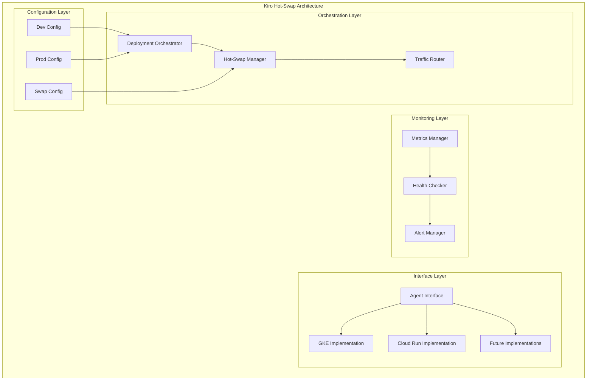

# Design Document

## Overview

The Kiro Hot-Swap Architecture implements a platform-agnostic agent system that enables seamless switching between GKE and Cloud Run deployments without downtime. The architecture uses interface abstraction, stateless design principles, and automated orchestration to provide cost optimization and risk mitigation capabilities.

The system consists of three main layers:
1. **Interface Layer**: Unified agent interface with platform-specific implementations
2. **Orchestration Layer**: Deployment and hot-swap management
3. **Monitoring Layer**: Unified metrics and health checking across platforms

## Architecture

### High-Level Architecture



### Platform Abstraction Design

The core design principle is interface abstraction where all platform implementations conform to a single contract:

```python
class KiroAgentInterface:
    def process_request(self, request: KiroRequest) -> KiroResponse
    def health_check(self) -> Dict[str, Any]
    def get_metrics(self) -> KiroMetrics
    def get_platform_info(self) -> Dict[str, Any]
```

This ensures that switching between platforms maintains identical behavior from the client perspective.

## Components and Interfaces

### 1. Core Interface Components

#### KiroAgentInterface
- **Purpose**: Abstract base class defining the contract for all platform implementations
- **Key Methods**: 
  - `process_request()`: Main request processing logic
  - `health_check()`: Platform health validation
  - `get_metrics()`: Performance and usage metrics
  - `get_platform_info()`: Platform-specific metadata

#### Platform Implementations
- **GKEKiroAgent**: Kubernetes-based implementation with stateless constraints
- **CloudRunKiroAgent**: Serverless implementation with auto-scaling
- **Future Implementations**: Extensible for additional platforms

### 2. Orchestration Components

#### Deployment Orchestrator
- **Purpose**: Manages platform-specific deployments and configurations
- **Responsibilities**:
  - Environment-based platform selection
  - Deployment validation and execution
  - Configuration management
  - Resource provisioning

#### Hot-Swap Manager
- **Purpose**: Coordinates zero-downtime platform transitions
- **Key Operations**:
  - New platform deployment
  - Health validation
  - Traffic routing coordination
  - Old platform decommissioning
  - Rollback on failure

#### Traffic Router
- **Purpose**: Manages request routing during platform transitions
- **Features**:
  - Load balancer configuration
  - Gradual traffic shifting
  - Health-based routing decisions
  - Failover capabilities

### 3. Monitoring Components

#### Metrics Manager
- **Purpose**: Collects and aggregates metrics across all platforms
- **Metrics Types**:
  - Platform-agnostic metrics (requests, errors, latency)
  - Platform-specific metrics (resource usage, scaling events)
  - Hot-swap metrics (transition time, success rate)

#### Health Checker
- **Purpose**: Validates platform readiness and ongoing health
- **Check Types**:
  - Endpoint availability
  - Response time validation
  - Resource utilization checks
  - Platform-specific health indicators

## Data Models

### Core Data Models

```python
@dataclass
class KiroRequest:
    data: Dict[str, Any]
    headers: Dict[str, str]
    method: str
    path: str
    query_params: Dict[str, str]
    timestamp: str
    request_id: str

@dataclass
class KiroResponse:
    status_code: int
    data: Dict[str, Any]
    headers: Dict[str, str]
    timestamp: str
    request_id: str
    platform: str

@dataclass
class KiroMetrics:
    platform: str
    instance_id: str
    timestamp: str
    request_count: int
    error_count: int
    avg_response_time: float
    memory_usage: float
    cpu_usage: float
    platform_specific: Dict[str, Any]
```

### Configuration Models

```python
@dataclass
class PlatformConfig:
    platform: str
    environment: str
    cost_threshold: float
    performance_threshold: float
    auto_scale_config: Dict[str, Any]
    resource_limits: Dict[str, Any]

@dataclass
class HotSwapConfig:
    enabled: bool
    health_check_timeout: int
    traffic_shift_duration: int
    rollback_threshold: float
    monitoring_interval: int
```

### Validation Models

```python
@dataclass
class StatelessValidation:
    platform: str
    forbidden_resources: List[str]
    validation_rules: List[str]
    compliance_status: bool
    violations: List[str]
```

## Error Handling

### Error Categories

1. **Platform Deployment Errors**
   - Resource provisioning failures
   - Configuration validation errors
   - Network connectivity issues

2. **Hot-Swap Errors**
   - Health check failures
   - Traffic routing failures
   - Rollback scenarios

3. **Interface Compliance Errors**
   - Method implementation missing
   - Response format violations
   - Stateless constraint violations

### Error Handling Strategy

```python
class HotSwapError(Exception):
    def __init__(self, message: str, platform: str, rollback_required: bool = True):
        self.message = message
        self.platform = platform
        self.rollback_required = rollback_required
        super().__init__(self.message)

class StatelessViolationError(Exception):
    def __init__(self, violations: List[str], platform: str):
        self.violations = violations
        self.platform = platform
        super().__init__(f"Stateless violations detected: {violations}")

def handle_hot_swap_error(error: HotSwapError, current_platform: str):
    if error.rollback_required:
        rollback_to_platform(current_platform)
    log_error(error)
    alert_operations_team(error)
```

### Retry and Fallback Logic

- **Health Check Retries**: 3 attempts with exponential backoff
- **Traffic Routing Retries**: 2 attempts with immediate fallback
- **Platform Deployment Retries**: 1 attempt with manual intervention required
- **Automatic Rollback**: Triggered on critical failures during hot-swap

## Testing Strategy

### Unit Testing

1. **Interface Contract Testing**
   - Verify all implementations conform to KiroAgentInterface
   - Test request/response consistency across platforms
   - Validate error handling behavior

2. **Platform-Specific Testing**
   - GKE stateless constraint validation
   - Cloud Run serverless behavior verification
   - Resource limit and scaling tests

3. **Hot-Swap Logic Testing**
   - Mock platform deployments and transitions
   - Error scenario simulation
   - Rollback mechanism validation

### Integration Testing

1. **End-to-End Hot-Swap Testing**
   - Full platform transition scenarios
   - Zero-downtime verification
   - Performance impact measurement

2. **Multi-Platform Testing**
   - Concurrent platform operations
   - Cross-platform metric consistency
   - Load balancer behavior validation

3. **Failure Scenario Testing**
   - Platform deployment failures
   - Network partition scenarios
   - Resource exhaustion conditions

### Performance Testing

1. **Hot-Swap Performance**
   - Transition time measurement
   - Resource utilization during swaps
   - Traffic routing latency impact

2. **Platform Comparison**
   - Response time benchmarks
   - Throughput comparisons
   - Cost-per-request analysis

3. **Scalability Testing**
   - Auto-scaling behavior validation
   - Resource limit testing
   - Concurrent request handling

### Monitoring and Observability Testing

1. **Metrics Collection Testing**
   - Metric accuracy validation
   - Cross-platform metric consistency
   - Alert threshold testing

2. **Health Check Testing**
   - Health check reliability
   - False positive/negative rates
   - Recovery time measurement

## Implementation Considerations

### Stateless Design Enforcement

For GKE implementations, strict validation ensures no stateful resources:
- Automated scanning for forbidden Kubernetes resources
- Pre-deployment validation hooks
- Runtime compliance monitoring

### Cost Optimization Logic

Environment-based platform selection with automatic switching:
- Development: Cloud Run (cost-optimized)
- Production: GKE (control-optimized)
- Budget-triggered automatic switching

### Security Considerations

- Platform-specific security configurations
- Secure credential management across platforms
- Network security policy enforcement
- Audit logging for all platform operations

### Scalability Design

- Horizontal scaling support on both platforms
- Auto-scaling configuration management
- Resource limit enforcement
- Performance monitoring and alerting