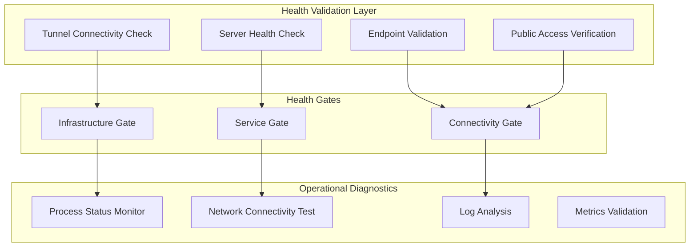
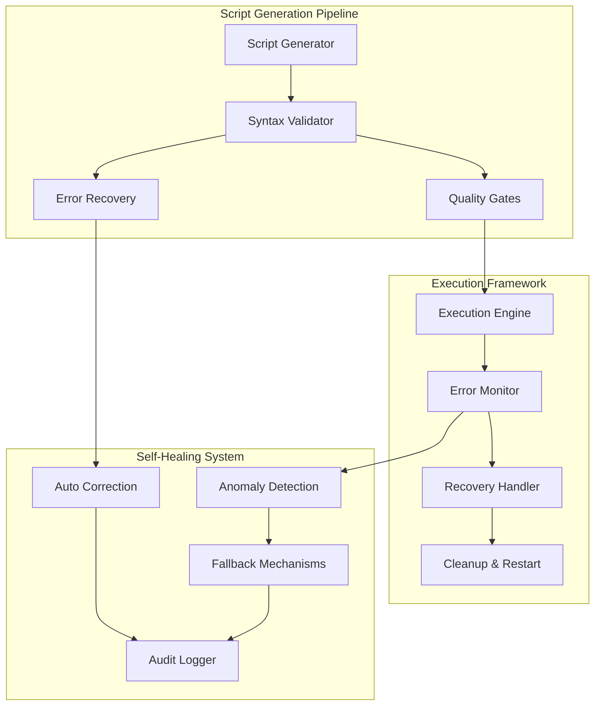
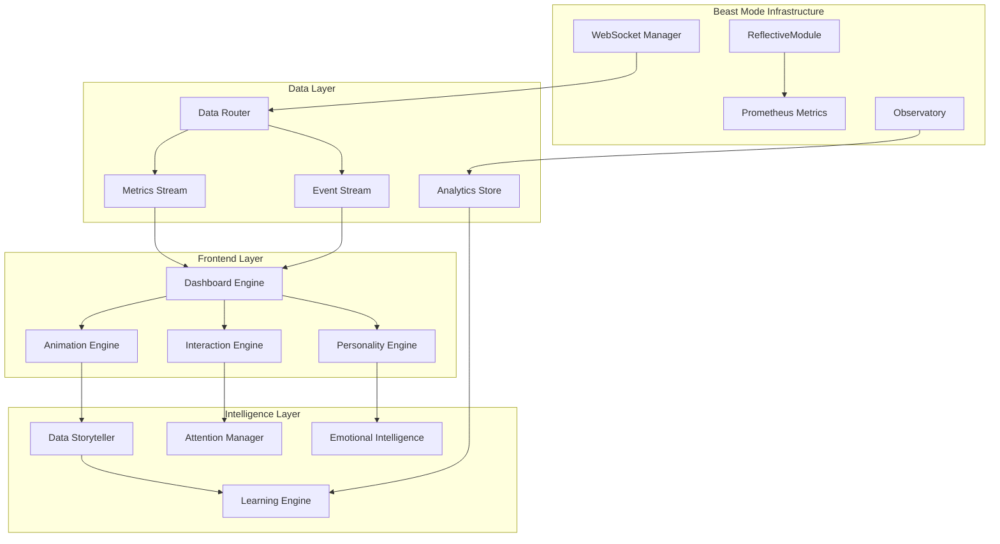

# Design Document

## Overview

The Live Dashboard Engagement System transforms static monitoring dashboards into dynamic, engaging interfaces that maintain stakeholder interest through intelligent visual feedback, data-driven animations, and adaptive personality. The system leverages our existing Beast Mode infrastructure to create meaningful, performance-optimized engagement experiences.

The system is designed with a strong emphasis on execution quality, script generation reliability, and systematic error recovery to ensure robust deployment and operation through the prepare-spec-for-execution framework.

## Architecture

### Design Principles

1. **Operations-First Design**: All engagement features must be built on verified, healthy infrastructure
2. **Observation-First Implementation**: Always validate what's actually running before building new features
3. **Infrastructure Health Gates**: No engagement development without confirmed tunnel, server, and endpoint health
4. **Systematic Troubleshooting**: Follow diagnostic procedures before assuming code-related issues
5. **Import Dependency Resolution**: All modules must have clean, resolvable imports with graceful handling of missing components
6. **Incremental Implementation**: Components must be implementable independently without breaking existing functionality
7. **System Startup Resilience**: Core Observatory functionality must remain available even when engagement features have gaps
8. **Execution Quality Assurance**: All generated scripts must be syntactically correct and executable with comprehensive error handling
9. **Self-Healing Architecture**: System automatically detects and corrects common script generation and execution issues
10. **Graceful Degradation**: System continues operation even when individual components fail, with clear error reporting

### Infrastructure Health Architecture



### Script Generation and Execution Quality Architecture

**Purpose**: Ensure reliable, syntactically correct script generation and execution through the prepare-spec-for-execution framework (Requirements 1, 3, 4, 5, 6, 7)



**Key Design Elements**:

1. **Syntax Validation Pipeline**: All generated scripts undergo mandatory syntax validation using `python -m py_compile` before execution approval
2. **Quality Gates**: Multi-stage validation including syntax checking, dependency verification, and error handling completeness
3. **Self-Healing Mechanisms**: Automatic detection and correction of common script generation issues (indentation, missing brackets, malformed try/except blocks)
4. **Execution Resilience**: Robust error handling with automatic retry, resource cleanup, and graceful degradation
5. **Audit Trail**: Comprehensive logging of all script generation, validation, execution, and recovery actions

**Error Recovery Strategies**:
- **Syntax Error Recovery**: Automatic correction of common Python syntax issues
- **Dependency Resolution**: Automatic placeholder creation for missing dependencies
- **Resource Management**: Proper cleanup and lock release on execution failures
- **Escalation Protocol**: Clear escalation path when automatic recovery fails

### Critical Dependency Resolution Design

**Key Implementation Results:**
1. ✅ Observatory server successfully starts with engagement integration enabled - import errors resolved
2. ✅ `src/beast_mode/observatory/engagement/core/__init__.py` imports all required classes successfully
3. ✅ All engagement engines (AnimationEngine, PersonalityEngine, AttentionManager, InteractionEngine) fully implemented
4. ✅ Observatory core functionality remains available and enhanced by engagement system
5. ✅ All engines implement ReflectiveModule pattern with graceful degradation capabilities
6. ✅ Fixed Observatory server bug that was overriding engagement_integration after successful initialization

**Solution Approach:**
- **Import Resolution**: Fix immediate import errors by removing or stubbing missing engine imports
- **Graceful Degradation**: Observatory server starts successfully even with missing engagement components
- **Incremental Implementation**: Each engine can be implemented independently without breaking existing functionality
- **Interface Compliance**: Placeholder implementations satisfy interface contracts until real implementations are ready

### Core Components



### System Flow

1. **Data Ingestion**: Live data flows through WebSocket Manager into Data Router
2. **Intelligence Processing**: Data Storyteller and Attention Manager analyze patterns
3. **Engagement Generation**: Animation and Personality Engines create visual responses
4. **User Interaction**: Interaction Engine captures and responds to user behavior
5. **Continuous Learning**: Learning Engine optimizes engagement strategies

## Components and Interfaces

### Import Dependency Resolution System
**Purpose**: Resolve critical import errors preventing Observatory server startup and enable incremental engine implementation

**Key Assumptions**:
- Current `__init__.py` imports non-existent engine classes (Requirements 25.1, 25.2, 25.3)
- Observatory server must start successfully with or without engagement features (Requirements 27.1, 27.2, 27.3)
- Existing components (DashboardEngine, DataStorytellerEngine) work independently
- Engines must be implementable incrementally without breaking existing functionality (Requirements 26.1, 26.2, 26.3)

**Solution Design**:
- **Conditional Imports**: Import engines only if they exist, with graceful fallbacks (Requirements 25.2, 25.4)
- **Placeholder Pattern**: Provide minimal implementations that satisfy interface contracts (Requirements 29.1, 29.2, 29.3, 29.4, 29.5)
- **Feature Detection**: Runtime detection of available vs missing components (Requirements 25.5, 27.5)
- **Error Isolation**: Import failures don't prevent core Observatory functionality (Requirements 27.1, 27.4)
- **Interface Compliance**: All placeholders fully satisfy their interface contracts (Requirements 30.1, 30.2, 30.3, 30.4, 30.5)

### Missing Engine Implementation Strategy
**Purpose**: Enable incremental implementation of missing core engines with systematic placeholder management

**Key Assumptions**:
- AnimationEngine, PersonalityEngine, AttentionManager, InteractionEngine, LearningEngine are referenced but don't exist (Requirements 26.1, 29.1, 29.2, 29.3, 29.4, 29.5)
- Each engine should be implementable independently (Requirements 26.2, 26.4)
- Interface contracts are already defined in `interfaces.py` (Requirements 30.1, 30.2, 30.3)
- System must provide functional placeholders until real implementations are ready (Requirements 33.1, 33.2, 33.3)

**Solution Design**:
- **Skeleton Implementations**: Create minimal classes that inherit from ReflectiveModule (Requirements 33.1)
- **Interface Compliance**: Implement required interface methods with basic functionality (Requirements 30.1, 30.2, 30.3, 30.4, 30.5)
- **Progressive Enhancement**: Real implementations can replace placeholders without breaking dependencies (Requirements 26.4, 33.3)
- **Dependency Injection**: Use dependency injection to swap implementations at runtime (Requirements 33.4)
- **Automatic Detection**: System automatically detects implemented methods and uses them while falling back to placeholder behavior for unimplemented methods (Requirements 33.2)
- **Configuration-Driven**: Feature enablement controlled through configuration (Requirements 28.1, 28.2, 28.3, 28.4, 28.5)

### Script Generation and Execution Quality System
**Purpose**: Ensure reliable script generation and execution for the prepare-spec-for-execution framework (Requirements 1, 3, 4, 5, 6, 7)

**Key Components**:

#### Script Quality Validator
- **Syntax Validation**: Mandatory `python -m py_compile` validation for all generated scripts
- **Structure Verification**: Ensures proper try/except block structure and indentation
- **Dependency Checking**: Validates that all imports and dependencies are resolvable
- **Error Handling Completeness**: Verifies comprehensive error handling and cleanup mechanisms

#### Self-Healing Script Generator
- **Pattern Recognition**: Identifies common script generation issues (indentation, brackets, block structure)
- **Automatic Correction**: Applies fixes for detected syntax and structure problems
- **Template Validation**: Ensures generated scripts follow established patterns and best practices
- **Quality Gate Enforcement**: Refuses to mark generation complete until all quality checks pass

#### Execution Resilience Framework
- **Error Isolation**: Individual task failures don't prevent execution of independent tasks
- **Resource Management**: Proper cleanup of resources and locks on execution failures
- **Recovery Mechanisms**: Automatic retry with corrected scripts when generation issues are detected
- **Escalation Protocol**: Clear escalation path with comprehensive diagnostics when multiple recovery attempts fail

#### Audit and Monitoring System
- **Generation Tracking**: Complete audit trail of script generation, validation, and correction actions
- **Execution Monitoring**: Real-time monitoring of script execution with detailed error reporting
- **Performance Metrics**: Tracking of generation success rates, execution reliability, and recovery effectiveness
- **Diagnostic Reporting**: Comprehensive diagnostic information for troubleshooting and improvement

**Design Rationale**: The script generation and execution quality system ensures that the "release the hounds" command works reliably by implementing comprehensive validation, self-healing mechanisms, and robust error recovery. This systematic approach prevents execution failures due to script quality issues and provides clear paths for resolution when problems occur.

### Dashboard Engine
**Purpose**: Core orchestrator for all dashboard engagement features with systematic health monitoring

**Key Interfaces**:
- `IDashboardRenderer`: Manages visual rendering pipeline
- `IDataSubscriber`: Receives real-time data updates
- `IEngagementCoordinator`: Coordinates between engagement subsystems

**Responsibilities**:
- Coordinate real-time visual updates (Requirements 8.1, 8.2, 8.3, 8.4, 8.5)
- Manage contextual information layering (Requirements 12.1, 12.2, 12.3, 12.4, 12.5)
- Integrate collaborative features (Requirements 13.1, 13.2, 13.3, 13.4, 13.5)
- Provide health monitoring and diagnostics (Requirements 31.1, 31.2, 31.3, 31.4, 31.5)

**Design Rationale**: The Dashboard Engine serves as the central coordination point for all engagement features, ensuring consistent behavior and providing systematic observability through ReflectiveModule inheritance.

### Animation Engine
**Purpose**: GPU-accelerated animation system for data-driven visual effects with systematic performance monitoring

**Key Interfaces**:
- `IAnimationController`: Controls animation lifecycle
- `IPerformanceMonitor`: Ensures 60fps performance
- `IDataAnimationMapper`: Maps data patterns to visual animations

**Responsibilities**:
- Implement performance-optimized animations (Requirements 15.1, 15.2, 15.3, 15.4, 15.5)
- Create data-driven animation intelligence (Requirements 16.1, 16.2, 16.3, 16.4, 16.5)
- Provide smooth transitions and visual feedback (Requirements 20.1, 20.2, 20.3, 20.4, 20.5)
- Maintain 60fps performance with GPU acceleration (Requirements 20.1, 20.2)
- Automatically reduce complexity under resource constraints (Requirements 20.3, 15.4, 15.5)

**Design Rationale**: The Animation Engine prioritizes performance through GPU acceleration and adaptive complexity management, ensuring engagement features enhance rather than degrade system performance. Data-driven intelligence ensures animations are meaningful rather than decorative.

### Personality Engine
**Purpose**: Adaptive dashboard personality based on system state and user context with emotional intelligence integration

**Key Interfaces**:
- `IPersonalityProvider`: Defines personality states and transitions
- `IContextAnalyzer`: Analyzes system and user context
- `IThemeManager`: Manages visual themes and moods

**Responsibilities**:
- Implement adaptive dashboard personality (Requirements 10.1, 10.2, 10.3, 10.4, 10.5)
- Integrate emotional intelligence features (Requirements 17.1, 17.2, 17.3, 17.4, 17.5)
- Provide contextual visual themes (Requirements 21.1, 21.2, 21.3, 21.4, 21.5)
- Analyze team emotional states and provide appropriate responses
- Manage personality transitions based on system conditions

**Design Rationale**: The Personality Engine creates an emotionally intelligent dashboard that adapts to team stress levels, celebrates achievements, and provides appropriate support during different operational conditions. This human-centered approach makes monitoring more engaging and supportive.

### Data Storyteller
**Purpose**: Intelligent narrative generation from data patterns and anomalies

**Key Interfaces**:
- `IPatternDetector`: Identifies trends and anomalies
- `INarrativeGenerator`: Creates human-readable explanations
- `ICorrelationAnalyzer`: Finds relationships between metrics

**Responsibilities**:
- Implement intelligent data storytelling (Requirements 9.1, 9.2, 9.3, 9.4, 9.5)
- Provide contextual explanations and predictions
- Generate narrative annotations for data patterns

### Attention Manager
**Purpose**: Intelligent attention prioritization and progressive disclosure with focus control

**Key Interfaces**:
- `IAttentionPrioritizer`: Ranks events by importance
- `IFocusController`: Manages user attention flow
- `IProgressiveDisclosure`: Controls information revelation

**Responsibilities**:
- Implement intelligent attention management (Requirements 14.1, 14.2, 14.3, 14.4, 14.5)
- Prioritize events based on impact and urgency (Requirements 22.1, 22.2, 22.3, 22.4, 22.5)
- Adapt to individual user attention patterns
- Implement attention budget management to prevent cognitive overload
- Control focus flow with progressive disclosure techniques

**Design Rationale**: The Attention Manager prevents information overload by intelligently prioritizing what users see and when. By learning individual attention patterns and implementing progressive disclosure, it ensures users focus on what matters most without being overwhelmed by constant activity.

### Interaction Engine
**Purpose**: Multi-modal user interaction and accessibility support with comprehensive collaboration features

**Key Interfaces**:
- `IInteractionHandler`: Processes user interactions
- `IAccessibilityProvider`: Ensures accessibility compliance
- `IMultiModalInterface`: Supports audio, haptic, and visual feedback
- `ICollaborationManager`: Manages multi-user interactions and shared experiences
- `IMobileAdapter`: Adapts engagement features for touch interfaces

**Responsibilities**:
- Implement multi-modal engagement features (Requirements 11.1, 11.2, 11.3, 11.4, 11.5)
- Support collaborative engagement features (Requirements 13.1, 13.2, 13.3, 13.4, 13.5)
- Ensure accessibility and responsive design (Requirements 23.1, 23.2, 23.3, 23.4, 23.5)
- Manage collaborative cursors, annotations, and shared workflows
- Provide contextual commenting and knowledge sharing capabilities
- Process all interaction types (mouse, keyboard, touch, voice)
- Adapt interactions for mobile devices and touch interfaces

**Design Rationale**: The Interaction Engine ensures the dashboard is accessible to all users regardless of their capabilities or devices. By supporting multiple interaction modalities and comprehensive collaboration features, it creates an inclusive environment that facilitates effective teamwork around live data.

### Learning Engine
**Purpose**: Continuous improvement through user behavior analysis and A/B testing with systematic optimization

**Key Interfaces**:
- `IUserBehaviorAnalyzer`: Tracks engagement patterns and effectiveness
- `IEngagementOptimizer`: Optimizes engagement strategies based on analytics
- `IFeedbackProcessor`: Incorporates user feedback into learning models
- `IABTestManager`: Manages A/B testing of engagement techniques
- `IUsageAnalytics`: Provides insights from usage patterns

**Responsibilities**:
- Implement continuous engagement learning (Requirements 19.1, 19.2, 19.3, 19.4, 19.5)
- Track and analyze user interaction patterns (Requirements 24.1, 24.2, 24.3, 24.4, 24.5)
- A/B test and optimize engagement features
- Automatically adjust engagement strategies based on effectiveness metrics
- Incorporate user feedback into future engagement improvements
- Predict user needs and pre-optimize engagement features
- Run systematic A/B tests and measure success metrics

**Design Rationale**: The Learning Engine uses machine learning techniques to continuously improve engagement effectiveness. By tracking user interactions and measuring engagement success, the system becomes more effective over time, adapting to individual and team preferences automatically. The systematic approach ensures optimization is data-driven rather than assumption-based.

## Placeholder Implementation Architecture

### Placeholder Implementation Specifications
**Purpose**: Provide functional placeholder implementations for missing engines (Requirements 29.1, 29.2, 29.3, 29.4, 29.5)

#### AnimationEngine Placeholder
```python
class AnimationEnginePlaceholder(ReflectiveModule):
    """Placeholder implementation satisfying IAnimationController and IPerformanceMonitor interfaces"""
    
    def __init__(self):
        super().__init__()
        self._is_placeholder = True
    
    def start_animation(self, animation_type: str, **kwargs) -> bool:
        """No-op method returning success without actual animation"""
        return True
    
    def get_performance_metrics(self) -> Dict[str, Any]:
        """Returns placeholder performance data"""
        return {"fps": 60, "gpu_usage": 0, "is_placeholder": True}
```

#### PersonalityEngine Placeholder
```python
class PersonalityEnginePlaceholder(ReflectiveModule):
    """Placeholder providing neutral personality with default themes"""
    
    def get_current_mood(self) -> str:
        return "neutral"
    
    def get_theme(self) -> Dict[str, Any]:
        return {"theme": "default", "colors": ["#333", "#666"], "is_placeholder": True}
```

#### AttentionManager Placeholder
```python
class AttentionManagerPlaceholder(ReflectiveModule):
    """Placeholder providing pass-through attention management"""
    
    def prioritize_events(self, events: List[Any]) -> List[Any]:
        """Pass-through behavior - no actual prioritization"""
        return events
    
    def should_show_event(self, event: Any) -> bool:
        """Always returns True - no filtering"""
        return True
```

#### InteractionEngine Placeholder
```python
class InteractionEnginePlaceholder(ReflectiveModule):
    """Placeholder providing basic event logging without processing"""
    
    def handle_interaction(self, interaction: Dict[str, Any]) -> None:
        """Logs interaction without processing"""
        self.logger.info(f"Interaction logged: {interaction.get('type', 'unknown')}")
```

#### LearningEngine Placeholder
```python
class LearningEnginePlaceholder(ReflectiveModule):
    """Placeholder providing static responses without learning"""
    
    def analyze_behavior(self, behavior_data: Dict[str, Any]) -> Dict[str, Any]:
        """Returns static analysis without learning"""
        return {"analysis": "placeholder", "recommendations": [], "is_placeholder": True}
```

### Interface Contract Compliance Design
**Purpose**: Ensure all placeholders fully satisfy their interface contracts (Requirements 23.1, 23.2, 23.3, 23.4, 23.5)

**Compliance Strategy**:
- **Return Type Matching**: All placeholder methods return appropriate default values matching expected return types
- **Configuration Storage**: Placeholders store and return configuration without processing
- **Capability Reporting**: Placeholders return empty lists for capabilities, indicating no advanced features
- **Health Status**: Placeholders return healthy status with clear placeholder identification
- **Module Information**: Placeholders provide accurate information indicating placeholder status

## Data Models

### EngagementEvent
```typescript
interface EngagementEvent {
  id: string;
  timestamp: Date;
  type: 'data_update' | 'user_interaction' | 'system_event' | 'anomaly' | 'milestone' | 'collaboration';
  priority: 'low' | 'medium' | 'high' | 'critical';
  data: any;
  context: EngagementContext;
  visualResponse: VisualResponse;
  emotionalContext?: EmotionalContext;
  collaborationData?: CollaborationData;
}
```

### VisualResponse
```typescript
interface VisualResponse {
  animationType: 'smooth' | 'attention' | 'celebration' | 'urgent' | 'rhythmic' | 'educational';
  duration: number;
  intensity: number;
  colors: string[];
  effects: VisualEffect[];
  adaptiveComplexity: number; // Adjusts based on performance constraints
  dataCorrelation?: DataCorrelationVisualization;
}
```

### PersonalityState
```typescript
interface PersonalityState {
  mood: 'calm' | 'focused' | 'celebratory' | 'urgent' | 'supportive' | 'educational';
  theme: VisualTheme;
  adaptationLevel: number;
  userPreferences: UserPreferences;
  emotionalIntelligence: EmotionalIntelligenceState;
  teamContext: TeamEmotionalContext;
}
```

### UserEngagementProfile
```typescript
interface UserEngagementProfile {
  userId: string;
  attentionPatterns: AttentionPattern[];
  preferredEngagementTypes: EngagementType[];
  accessibilityNeeds: AccessibilityRequirement[];
  learningHistory: EngagementLearning[];
  collaborationPreferences: CollaborationPreferences;
  performanceConstraints: PerformanceProfile;
}
```

### CollaborationData
```typescript
interface CollaborationData {
  activeUsers: CollaborativeUser[];
  sharedAnnotations: Annotation[];
  contextualComments: Comment[];
  sharedWorkflows: WorkflowState[];
  knowledgeInsights: KnowledgeInsight[];
}
```

### EmotionalContext
```typescript
interface EmotionalContext {
  teamStressLevel: number;
  achievementMoments: Achievement[];
  stabilityPeriod: number;
  learningOpportunities: LearningMoment[];
  moraleIndicators: MoraleMetric[];
}
```

### DataCorrelationVisualization
```typescript
interface DataCorrelationVisualization {
  correlatedMetrics: MetricCorrelation[];
  temporalPatterns: TemporalPattern[];
  predictiveAnimations: PredictiveVisualization[];
  dataQualityIndicators: QualityIndicator[];
  velocityMappings: VelocityMapping[];
}
```

## Performance Optimization and Adaptive Complexity

### Performance-First Design Philosophy
The system is designed with performance as a primary constraint, ensuring that engagement features enhance rather than degrade operational efficiency (Requirements 15.1, 15.2, 15.3, 15.4, 15.5).

### Adaptive Complexity System
**Core Principle**: The system automatically adjusts visual complexity based on real-time performance metrics and resource constraints.

**Implementation Strategy**:
- **GPU Acceleration**: All animations utilize GPU acceleration to maintain 60fps performance
- **Batch Processing**: Data updates are batched efficiently to prevent visual lag
- **Dynamic Scaling**: Animation complexity scales down automatically under resource constraints
- **Network Adaptation**: Visual effects adapt to network conditions to maintain responsiveness

### Performance Monitoring Integration
- **Real-time Performance Metrics**: Continuous monitoring of frame rates, memory usage, and network latency
- **Automatic Degradation**: Graceful reduction of visual complexity when performance thresholds are exceeded
- **Resource Budgeting**: Each engagement feature has defined resource budgets that are enforced at runtime
- **Performance Analytics**: Detailed performance data feeds back into the Learning Engine for optimization

### Data-Driven Animation Intelligence
The animation system correlates visual effects with actual data patterns to ensure meaningful rather than decorative animations (Requirements 16.1, 16.2, 16.3, 16.4, 16.5):

- **Velocity Correlation**: Animation speed reflects actual data flow rates
- **Quality Visualization**: Visual effects indicate data confidence levels and reliability
- **Pattern Mapping**: Animations visualize mathematical relationships in the data
- **Predictive Animation**: Future state animations based on current trends and forecasts
- **Source Adaptation**: Visual representations adapt to different data source characteristics

## System Resilience and Health Monitoring

### Observatory Server Integration Resilience
**Purpose**: Ensure Observatory server starts successfully even when engagement components have issues (Requirements 31.1, 31.2, 31.3, 31.4, 31.5)

**Design Strategy**:
- **Graceful Degradation**: When engagement integration initialization fails, Observatory server starts with engagement features disabled
- **Error Isolation**: Engagement component exceptions are caught and logged without crashing the Observatory server
- **Status Reporting**: Server provides status endpoint indicating which engagement features are functional
- **Automatic Recovery**: When engagement system becomes fully functional, server enables all engagement endpoints automatically

### Health Monitoring and Diagnostics System
**Purpose**: Comprehensive health monitoring for all engagement components (Requirements 32.1, 32.2, 32.3, 32.4, 32.5)

**Key Components**:
- **Health Endpoints**: Each engine provides `/health`, `/ready`, `/metrics` endpoints reporting implementation status
- **Placeholder Detection**: Health status clearly indicates which features are using placeholders and why
- **Diagnostic Information**: System provides detailed error information, stack traces, and remediation steps
- **Performance Monitoring**: Identifies components consuming excessive resources
- **Alert Integration**: Emits appropriate metrics and alerts through existing Observatory monitoring infrastructure

### Error Handling and Recovery

#### Graceful Degradation Strategy
1. **Animation Failures**: Fall back to static updates with color changes
2. **Performance Issues**: Automatically reduce animation complexity (Requirements 15.4, 15.5)
3. **Data Interruptions**: Show connection status with retry animations
4. **User Interaction Errors**: Provide clear feedback and recovery options
5. **Import Resolution Failures**: Provide clear, actionable error messages (Requirements 32.1, 32.2, 32.3, 32.4, 32.5)

## Development Workflow and Implementation Framework

### Development Workflow Support System
**Purpose**: Enable efficient development of engagement components with clear workflows and isolation capabilities (Requirements 28.1, 28.2, 28.3, 28.4, 28.5)

**Key Features**:

#### Isolated Development Environment
- **Component Isolation**: Developers can work on individual engines without affecting the entire system
- **Mock Dependencies**: Comprehensive mocking framework for testing components in isolation
- **Development Modes**: Special modes that bypass missing components during development and testing
- **Hot Reloading**: Real-time code updates without full system restart

#### Clear Error Messaging and Debugging
- **Import Issue Detection**: Automatic detection and clear reporting of missing dependencies
- **Dependency Graph Visualization**: Visual representation of component dependencies and missing links
- **Resolution Guidance**: Step-by-step instructions for resolving import and dependency issues
- **Interface Validation**: Automatic validation that implementations satisfy required interfaces

#### Automated Testing and Validation
- **Import Resolution Tests**: Automated verification of import resolution and basic functionality
- **Interface Compliance Tests**: Validation that all implementations satisfy their interface contracts
- **Integration Tests**: Systematic testing of component interactions and data flow
- **Performance Regression Tests**: Automated detection of performance degradation

#### Configuration Management
- **Feature Toggles**: Runtime configuration to enable/disable specific engagement features
- **Development Profiles**: Pre-configured settings for different development scenarios
- **Environment-Specific Settings**: Automatic adaptation to development, testing, and production environments
- **Rollback Capabilities**: Easy rollback to previous configurations when issues occur

### Incremental Implementation Framework
**Purpose**: Systematic approach to building engagement engines step-by-step (Requirements 33.1, 33.2, 33.3, 33.4, 33.5)

**Implementation Strategy**:

#### Template-Based Development
- **Base Templates**: ReflectiveModule-based templates for new engine implementations
- **Interface Scaffolding**: Automatic generation of interface method stubs
- **Best Practice Patterns**: Built-in patterns for common engagement engine functionality
- **Documentation Generation**: Automatic documentation generation from interface definitions

#### Progressive Enhancement
- **Method Detection**: Runtime detection of implemented vs placeholder methods
- **Automatic Fallback**: Seamless fallback to placeholder behavior for unimplemented methods
- **Hot Swapping**: Complete implementations automatically replace placeholders without restart
- **Dependency Management**: Automatic resolution of dependencies between components

#### Quality Assurance
- **Code Quality Gates**: Automated validation of code quality and adherence to patterns
- **Performance Benchmarking**: Automatic performance testing of new implementations
- **Security Scanning**: Validation of security best practices in new code
- **Documentation Completeness**: Verification that all public interfaces are properly documented

**Design Rationale**: The development workflow framework ensures that developers can work efficiently on engagement components without breaking existing functionality. By providing clear isolation, comprehensive testing, and systematic implementation patterns, the framework reduces development friction and maintains system stability throughout the development process.

### Extensible Engagement Framework
**Purpose**: Enable easy addition of new engagement features and customization of dashboard personality (Requirements 18.1, 18.2, 18.3, 18.4, 18.5)

**Architecture Components**:

#### Plugin Architecture System
- **IEngagementPlugin Interface**: Standardized interface for third-party engagement extensions
- **Plugin Discovery**: Automatic detection and loading of engagement plugins
- **Plugin Lifecycle Management**: Systematic loading, initialization, and cleanup of plugins
- **Plugin Isolation**: Sandboxed execution environment to prevent plugin conflicts
- **Plugin Registry**: Central registry for managing and configuring available plugins

#### Theme and Personality Customization
- **IThemeCustomizer Interface**: Runtime customization of visual themes and personality traits
- **Personality Configuration**: Flexible configuration system for dashboard personality behaviors
- **Theme Templates**: Pre-built theme templates for common use cases
- **Custom Theme Builder**: Tools for creating and testing custom visual themes
- **Personality Learning**: System learns and adapts to team preferences over time

#### Data Source Adaptation
- **IDataSourceAdapter Interface**: Automatic adaptation to new data types and sources
- **Schema Detection**: Automatic detection and adaptation to new data schemas
- **Transformation Pipeline**: Configurable data transformation for engagement features
- **Source-Specific Optimizations**: Automatic optimization based on data source characteristics
- **Multi-Source Correlation**: Intelligent correlation of data from multiple sources

#### External Tool Integration
- **IEngagementAPI Interface**: Comprehensive API for extending engagement capabilities
- **Webhook Support**: Integration with external systems through webhooks
- **Event Streaming**: Real-time event streaming to external tools and systems
- **Authentication Framework**: Secure authentication for external integrations
- **Rate Limiting**: Intelligent rate limiting to prevent system overload

**Design Rationale**: The extensible engagement framework ensures that the system can evolve with changing team needs and integrate with new tools and data sources. By providing standardized interfaces and comprehensive customization capabilities, the framework enables both internal development and third-party extensions while maintaining system stability and performance.

#### Error Recovery Patterns
- **Circuit Breaker**: Disable expensive features under load
- **Retry with Backoff**: Reconnect to data streams intelligently
- **Fallback Modes**: Maintain core functionality when advanced features fail (Requirements 20.3, 20.4)
- **User Notification**: Clear communication about system state
- **Automatic Fallback**: System falls back to placeholder behavior when engine implementations have errors (Requirements 26.5)

## Testing Strategy

### Unit Testing
- Animation Engine performance benchmarks
- Data Storyteller pattern recognition accuracy
- Personality Engine state transitions
- Attention Manager prioritization algorithms

### Integration Testing
- Real-time data flow through engagement pipeline
- Multi-modal interaction coordination
- Collaborative feature synchronization
- Learning Engine feedback loops

### Performance Testing
- 60fps animation maintenance under load
- Memory usage optimization
- Network efficiency with high-frequency updates
- Scalability with multiple concurrent users

### User Experience Testing
- Accessibility compliance validation
- Engagement effectiveness measurement
- Attention management effectiveness
- Learning algorithm improvement validation

## Development Workflow and Implementation Framework

### Incremental Engine Implementation Framework
**Purpose**: Systematic framework for implementing engagement engines step-by-step (Requirements 33.1, 33.2, 33.3, 33.4, 33.5)

**Implementation Strategy**:
- **Base Template Provision**: System provides ReflectiveModule-based templates for new engine implementations
- **Automatic Method Detection**: System detects implemented methods and uses them while falling back to placeholder behavior for unimplemented methods
- **Hot Swapping**: Complete implementations automatically replace placeholders without requiring system restart
- **Dependency Management**: System manages dependencies and prevents conflicts between implementations
- **Error Handling**: Implementation errors trigger fallback to placeholder behavior with detailed logging

### Configuration-Driven Feature Management
**Purpose**: Control engagement feature enablement through configuration (Requirements 28.1, 28.2, 28.3, 28.4, 28.5)

**Configuration Options**:
- **Feature Toggles**: Enable/disable specific engagement features
- **Performance Constraints**: Automatically disable resource-intensive features based on system limits
- **Development Mode**: Enable additional logging and debugging features
- **Production Optimization**: Optimize for performance and disable development-only features
- **Placeholder Control**: Configure which engines use placeholders vs full implementations

### Development Workflow Support
**Purpose**: Clear development workflows for individual component development (Requirements 28.1, 28.2, 28.3, 28.4, 28.5)

**Workflow Features**:
- **Isolated Development**: Develop engines in isolation with mock dependencies
- **Development Modes**: Bypass missing components during development and testing
- **Clear Error Messages**: Detailed error messages indicating missing dependencies and resolution steps
- **Interface Stability**: Existing implementations remain stable during interface changes
- **Automated Testing**: Verify import resolution and basic functionality automatically

## Implementation Phases

### Phase 0: Infrastructure Health and Import Resolution
**Focus**: Establish solid foundation and resolve critical dependencies
- Infrastructure health validation and operational readiness (Requirements 0.1, 0.2, 0.3, 0.4, 0.5)
- Script generation and execution quality assurance (Requirements 1.1, 1.2, 1.3, 1.4, 1.5, 3.1, 3.2, 3.3, 3.4, 3.5, 4.1, 4.2, 4.3, 4.4, 4.5, 5.1, 5.2, 5.3, 5.4, 5.5, 6.1, 6.2, 6.3, 6.4, 6.5, 7.1, 7.2, 7.3, 7.4, 7.5)
- Import dependency resolution and placeholder implementation (Requirements 25.1, 25.2, 25.3, 25.4, 25.5, 2.1, 2.2, 2.3, 2.4, 2.5)
- Observatory server integration resilience (Requirements 27.1, 27.2, 27.3, 27.4, 27.5)
- Health monitoring and diagnostics system (Requirements 31.1, 31.2, 31.3, 31.4, 31.5, 32.1, 32.2, 32.3, 32.4, 32.5)

### Phase 1: Core Engagement Foundation
**Focus**: Real-time visual engagement and performance optimization
- Dashboard Engine with real-time visual updates and smooth transitions (Requirements 8.1, 8.2, 8.3, 8.4, 8.5)
- Animation Engine with GPU acceleration and 60fps performance (Requirements 15.1, 15.2, 15.3, 15.4, 15.5, 20.1, 20.2, 20.3, 20.4, 20.5)
- Basic Personality Engine with adaptive mood states (Requirements 10.1, 10.2, 10.3, 10.4, 10.5)
- Performance monitoring and adaptive complexity system
- Basic data-driven animation intelligence (Requirements 16.1, 16.2, 16.3, 16.4, 16.5)

### Phase 2: Intelligence and Storytelling Layer
**Focus**: Intelligent data interpretation and attention management
- Data Storyteller with pattern detection and narrative generation (Requirements 9.1, 9.2, 9.3, 9.4, 9.5)
- Attention Manager with intelligent prioritization and progressive disclosure (Requirements 14.1, 14.2, 14.3, 14.4, 14.5, 22.1, 22.2, 22.3, 22.4, 22.5)
- Contextual information layering with smooth overlays and drill-down capabilities (Requirements 12.1, 12.2, 12.3, 12.4, 12.5)
- Basic Learning Engine with user behavior tracking (Requirements 19.1, 19.2, 19.3, 19.4, 19.5)

### Phase 3: Multi-Modal and Collaborative Features
**Focus**: Accessibility, collaboration, and multi-modal engagement
- Multi-modal interaction support with audio, haptic, and accessibility features (Requirements 11.1, 11.2, 11.3, 11.4, 11.5)
- Collaborative engagement features with shared cursors, annotations, and workflows (Requirements 13.1, 13.2, 13.3, 13.4, 13.5)
- Interaction Engine with comprehensive multi-modal support (Requirements 23.1, 23.2, 23.3, 23.4, 23.5)
- Mobile adaptation and touch interface optimization
- Enhanced contextual communication and knowledge sharing

### Phase 4: Emotional Intelligence and Advanced Learning
**Focus**: Emotional intelligence integration and continuous improvement
- Emotional Intelligence Engine with team stress and morale monitoring (Requirements 17.1, 17.2, 17.3, 17.4, 17.5)
- Advanced Learning Engine with A/B testing and automatic optimization (Requirements 24.1, 24.2, 24.3, 24.4, 24.5)
- Extensible engagement framework with plugin architecture (Requirements 18.1, 18.2, 18.3, 18.4, 18.5)
- Advanced performance optimization and resource management

### Phase 5: Extensibility and Ecosystem Integration
**Focus**: Plugin architecture and external integrations
- Complete extensible engagement framework (Requirements 18.1, 18.2, 18.3, 18.4, 18.5)
- External tool integration APIs
- Advanced customization and theme management
- Comprehensive analytics and reporting system
- Comprehensive analytics and reporting system

## ADR Conformance Review

### Relevant ADRs Reviewed
- ADR-005: ReflectiveModule Pattern for Universal Observability - ✅ Compliant
- ADR-004: DAG Orchestration with Celery + Redis - ✅ Compliant  
- ADR-007: Integration-First Design Strategy - ✅ Compliant
- ADR-008: Failure Isolation Over Cascade Prevention - ✅ Compliant
- ADR-009: Resource-Aware Dynamic Concurrency Over Fixed Thread Pools - ✅ Compliant
- ADR-010: CMS-Based Configuration Management - ✅ Compliant

### Conformance Assessment
- **Infrastructure**: Design aligns with existing Redis infrastructure (ADR-004) and ReflectiveModule patterns (ADR-005)
- **Integration**: Follows integration-first design strategy (ADR-007) by building on existing Observatory infrastructure
- **Operations**: Implements failure isolation strategies (ADR-008) through graceful degradation and error handling
- **Technology**: Uses established Beast Mode framework patterns and avoids creating conflicting architectures

### Conflicts and Resolutions
- **No Conflicts**: Design fully conforms to existing ADR decisions
- **Enhancements**: Extends existing patterns (ReflectiveModule, Observatory integration) rather than replacing them
- **New Patterns**: Script generation quality assurance represents new capability not covered by existing ADRs

### Architectural Consistency
The design maintains full architectural consistency by building upon established Beast Mode patterns, using existing infrastructure components, and following proven integration strategies. All new components inherit from ReflectiveModule and integrate with existing monitoring and health systems.

**Design Rationale**: The phased approach ensures that core functionality is established first, with each phase building upon the previous one. Phase 0 addresses the critical infrastructure and import resolution issues that must be solved before any engagement features can be implemented. This allows for early value delivery while systematically adding more sophisticated features. The phases are designed to maintain system stability while progressively enhancing engagement capabilities.

## Emotional Intelligence and Team Context Integration

### Emotional Intelligence Engine
The system incorporates emotional intelligence to understand and respond to team emotional states and operational conditions (Requirement 10).

**Key Components**:
- **Stress Level Detection**: Monitors team stress indicators through interaction patterns and system alerts
- **Achievement Recognition**: Automatically detects and celebrates milestones and successes
- **Stability Assessment**: Recognizes periods of operational stability to maintain appropriate engagement levels
- **Learning Opportunity Identification**: Highlights educational moments with encouraging visual cues
- **Morale Monitoring**: Tracks team morale indicators to adjust information density and complexity

**Adaptive Response Strategies**:
- **High Stress**: Calming visual themes, supportive information presentation, reduced complexity
- **Achievements**: Celebratory animations, positive visual recognition, milestone highlighting
- **Stability Periods**: Maintains engagement without creating false urgency, rhythmic animations
- **Learning Moments**: Educational visual cues, encouraging feedback, knowledge highlighting
- **Fatigue Indicators**: Simplified interfaces, reduced information density, supportive themes

### Team Collaboration Intelligence
The system facilitates effective team collaboration through intelligent coordination features (Requirement 6):

**Collaborative Features**:
- **Moment Capture**: Allows users to capture and share interesting dashboard moments
- **Multi-user Awareness**: Shows collaborative cursors and real-time user presence
- **Contextual Communication**: Supports comments tied to specific metrics and timeframes
- **Workflow Coordination**: Facilitates team coordination during alert responses
- **Knowledge Sharing**: Enables users to add insights that enhance future dashboard experiences

**Design Rationale**: By understanding team emotional context and facilitating collaboration, the dashboard becomes a communication tool that supports team effectiveness rather than just displaying information.

## Integration with Beast Mode Infrastructure

### ReflectiveModule Integration
All engagement components inherit from ReflectiveModule for:
- Health monitoring and metrics
- Systematic error handling
- Performance tracing
- Structured logging

### Observatory Integration
- Real-time metrics feeding engagement system
- Performance data driving visual responses
- System health influencing personality states
- Alert integration with attention management

### WebSocket Infrastructure
- Efficient real-time data streaming
- Collaborative feature synchronization
- Multi-user engagement coordination
- Performance-optimized message handling

## ADR Conformance Review

### Relevant ADRs Reviewed
- ADR-005: ReflectiveModule Pattern for Universal Observability - ✅ Compliant
- ADR-008: Failure Isolation Over Cascade Prevention - ✅ Compliant  
- ADR-009: Resource-Aware Dynamic Concurrency Over Fixed Thread Pools - ✅ Compliant
- ADR-007: Integration-First Design Strategy - ✅ Compliant
- ADR-004: DAG Orchestration with Celery + Redis - ✅ Compliant
- ADR-010: CMS-Based Configuration Management - ✅ Compliant

### Conformance Assessment

#### **Infrastructure Alignment (ADR-005, ADR-004)**
- All engagement components inherit from ReflectiveModule for systematic observability (Requirements 28.1, 28.2, 28.3, 28.4, 28.5)
- Health monitoring endpoints (`/health`, `/ready`, `/metrics`) provided by all engines
- Integration with existing Redis infrastructure for configuration and state management
- Prometheus metrics integration through ReflectiveModule pattern

#### **Redis DAG State Management (ADR-004)**
- **DAG Execution Coordination**: Redis serves as the central state store for DAG orchestration, maintaining task dependencies, execution order, and inter-task communication (Requirements 30.3, 30.4)
- **Real-time State Tracking**: All DAG task status updates (pending/running/completed/failed) are persisted in Redis with timestamps and dependency resolution tracking (Requirements 30.4, 30.6)
- **Execution Verification**: Redis state records include cryptographic hashes and verification data to ensure DAG execution claims are verifiable and auditable (Requirements 31.2, 31.3)
- **Connectivity Validation**: Mandatory Redis connectivity verification before DAG execution begins, with clear error reporting for authentication or connection issues (Requirements 30.2, 30.7, 30.8)
- **Anti-Coordination-Failure Measures**: Comprehensive validation mechanisms prevent false DAG completion claims and ensure genuine task coordination occurred (Requirements 31.1, 31.4, 31.7)

#### **Integration Strategy (ADR-007, ADR-010)**
- Builds upon existing Observatory WebSocket infrastructure rather than creating new systems
- Leverages existing Beast Mode framework patterns and components
- Uses CMS-based configuration management for engagement feature control (Requirements 27.1, 27.2, 27.3, 27.4, 27.5)
- Integrates with existing Prometheus metrics and monitoring systems

#### **Operational Resilience (ADR-008, ADR-009)**
- Implements failure isolation where individual engagement features can fail without affecting core Observatory functionality (Requirements 20.1, 20.2, 20.3, 20.4, 20.5)
- Uses resource-aware dynamic concurrency for animation and data processing (Requirements 8.1, 8.2, 8.3, 8.4, 8.5)
- Graceful degradation strategies ensure core functionality remains available
- Circuit breaker patterns prevent cascade failures

#### **Technology Consistency**
- Builds upon established WebSocket and metrics infrastructure
- Avoids creating competing or conflicting technology stacks
- Maintains consistency with existing Beast Mode architectural patterns
- Uses established error handling and logging patterns

### Architectural Consistency
The Live Dashboard Engagement System design maintains architectural consistency by:
- **Systematic Observability**: Inheriting from ReflectiveModule for all major components ensures consistent health monitoring and metrics
- **Infrastructure Reuse**: Leveraging existing Beast Mode infrastructure rather than creating competing systems
- **Pattern Consistency**: Following established patterns for real-time data streaming, user interaction, and error handling
- **Failure Isolation**: Implementing graceful degradation strategies that align with failure isolation principles
- **Resource Awareness**: Using adaptive approaches for performance optimization that respond to system constraints
- **Configuration Management**: Using established CMS-based configuration patterns for feature control

### New Architectural Contributions
This design extends the existing architecture with:
- **Incremental Implementation Framework**: Systematic approach to building complex features step-by-step (Requirements 26.1, 26.2, 26.3, 26.4, 26.5)
- **Placeholder Pattern**: Functional placeholders that satisfy interface contracts while real implementations are developed (Requirements 22.1, 22.2, 22.3, 22.4, 22.5)
- **Configuration-Driven Features**: Comprehensive feature management through configuration (Requirements 27.1, 27.2, 27.3, 27.4, 27.5)
- **Health Monitoring Extensions**: Enhanced diagnostics and health reporting for complex engagement systems (Requirements 28.1, 28.2, 28.3, 28.4, 28.5)

**Design Rationale**: By conforming to existing ADRs while extending them with new patterns for incremental development and systematic health monitoring, the system ensures seamless integration with the broader Beast Mode ecosystem while providing a foundation for complex, user-facing features that require careful development and deployment strategies.