# LLM-Powered Engagement Engines Design Document

## Overview

The LLM-Powered Engagement Engines system transforms placeholder engagement engine implementations into intelligent, AI-driven components that provide real value through language model integration. This design replaces static placeholder methods with dynamic LLM-powered functions that can analyze context, generate appropriate responses, and adapt behavior based on prompts and system state.

The system builds upon the existing Observatory engagement framework, enhancing the AttentionManager, AnimationEngine, PersonalityEngine, InteractionEngine, and LearningEngine with sophisticated LLM integration capabilities while maintaining backward compatibility and graceful degradation.

## Architecture

### High-Level Architecture

```mermaid
graph TB
    subgraph "LLM Integration Layer"
        LLMOrchestrator[LLM Orchestrator]
        PromptEngine[Prompt Engineering Framework]
        ResponseValidator[Response Validation & Safety]
        CacheManager[Intelligent Caching System]
        UsageLogger[LLM Usage Logger & Analytics]
        LearningSystem[Learning & Adaptation System]
    end
    
    subgraph "Enhanced Engagement Engines"
        AttentionManager[LLM-Enhanced Attention Manager]
        AnimationEngine[LLM-Enhanced Animation Engine]
        PersonalityEngine[LLM-Enhanced Personality Engine]
        InteractionEngine[LLM-Enhanced Interaction Engine]
        LearningEngine[LLM-Enhanced Learning Engine]
    end
    
    subgraph "LLM Providers"
        OpenAI[OpenAI API]
        Anthropic[Anthropic API]
        LocalModels[Local Models]
    end
    
    subgraph "Beast Mode Framework Integration"
        ReflectiveModule[ReflectiveModule Base]
        PrometheusMetrics[Prometheus Metrics]
        HealthEndpoints[Health Monitoring]
        ErrorHandling[Systematic Error Handling]
    end
    
    subgraph "Observatory Core"
        SystemState[System State Context]
        MetricsCollector[Metrics & Analytics]
        ConfigManager[Configuration Management]
        ObservatoryContext[Observatory-Specific Context]
    end
    
    LLMOrchestrator --> OpenAI
    LLMOrchestrator --> Anthropic
    LLMOrchestrator --> LocalModels
    
    AttentionManager --> LLMOrchestrator
    AnimationEngine --> LLMOrchestrator
    PersonalityEngine --> LLMOrchestrator
    InteractionEngine --> LLMOrchestrator
    LearningEngine --> LLMOrchestrator
    
    LLMOrchestrator --> PromptEngine
    LLMOrchestrator --> ResponseValidator
    LLMOrchestrator --> CacheManager
    LLMOrchestrator --> UsageLogger
    LLMOrchestrator --> LearningSystem
    
    AttentionManager --> ReflectiveModule
    AnimationEngine --> ReflectiveModule
    PersonalityEngine --> ReflectiveModule
    InteractionEngine --> ReflectiveModule
    LearningEngine --> ReflectiveModule
    LLMOrchestrator --> ReflectiveModule
    
    ReflectiveModule --> PrometheusMetrics
    ReflectiveModule --> HealthEndpoints
    ReflectiveModule --> ErrorHandling
    
    SystemState --> PromptEngine
    MetricsCollector --> PromptEngine
    ConfigManager --> LLMOrchestrator
    ObservatoryContext --> PromptEngine
    
    UsageLogger --> PrometheusMetrics
    LearningSystem --> UsageLogger
```



### Core Design Principles

1. **Gradual Migration Strategy**: Individual methods can be converted from placeholder to LLM-powered independently with rollback capability
2. **Graceful Degradation**: System maintains functionality when LLM integration is unavailable through systematic fallback chains
3. **Context-Aware Intelligence**: LLM analysis includes comprehensive Observatory system context, user behavior, and operational state
4. **Performance Optimization**: Intelligent caching, request batching, and cost management prevent resource waste
5. **Safety-First Approach**: Robust validation ensures LLM responses meet interface contracts and safety requirements
6. **Beast Mode Integration**: All components inherit from ReflectiveModule for systematic observability and health monitoring
7. **Learning and Adaptation**: Continuous improvement through usage pattern analysis and feedback integration
8. **Comprehensive Logging**: Detailed usage analytics enable optimization and systematic solution development

## Components and Interfaces

### 1. LLM Integration Architecture

#### LLM Orchestrator
**Purpose**: Central coordinator for all LLM interactions across engagement engines

**Key Responsibilities**:
- Provider abstraction and failover management
- Request routing and load balancing
- Error handling and retry logic
- Cost tracking and budget management

**Interface**:
```python
class LLMOrchestrator(ReflectiveModule):
    async def generate_response(
        self, 
        prompt: PromptTemplate, 
        context: EngagementContext,
        provider_preference: Optional[str] = None
    ) -> LLMResponse
    
    async def batch_generate(
        self, 
        requests: List[LLMRequest]
    ) -> List[LLMResponse]
    
    async def get_provider_status(self) -> Dict[str, ProviderStatus]
    
    async def check_cost_budget(self) -> bool:
        """Verify cost limits before making requests"""
    
    async def get_usage_analytics(self) -> UsageAnalytics:
        """Retrieve comprehensive usage and cost analytics"""
    
    def enable_mock_mode(self, enabled: bool) -> None:
        """Enable/disable mock responses for testing"""
```

**Design Rationale**: The LLM Orchestrator inherits from ReflectiveModule to provide systematic observability, health monitoring, and Prometheus metrics integration as required by Requirement 17. This ensures consistent monitoring patterns across all Beast Mode components.

#### Prompt Engineering Framework
**Purpose**: Systematic approach to crafting effective prompts with consistent formatting

**Design Rationale**: Centralized prompt management ensures consistency, enables A/B testing, and provides version control for prompt optimization.

**Key Features**:
- Template-based prompt construction
- Context injection with system state
- Prompt versioning and A/B testing
- Response format specification

**Interface**:
```python
class PromptTemplate:
    template: str
    context_requirements: List[str]
    expected_response_schema: Dict[str, Any]
    version: str
    
class PromptEngine:
    async def build_prompt(
        self, 
        template_id: str, 
        context: EngagementContext
    ) -> str
    
    async def validate_response_format(
        self, 
        response: str, 
        expected_schema: Dict[str, Any]
    ) -> ValidationResult
```

#### Response Validation and Safety
**Purpose**: Ensure LLM responses meet interface contracts and safety requirements

**Design Rationale**: Critical for system stability - prevents LLM hallucinations from breaking engagement engines or introducing inappropriate behavior.

**Validation Layers**:
1. **Schema Validation**: Response structure matches expected format
2. **Type Validation**: Return values match interface contracts
3. **Content Safety**: Inappropriate content filtering
4. **Business Logic Validation**: Response makes sense in context

#### LLM Usage Logger and Analytics
**Purpose**: Comprehensive logging and analysis of all LLM function usage for optimization and systematic solution development

**Design Rationale**: Addresses Requirement 16 by providing detailed usage analytics that enable identification of patterns, cost optimization, and reverse-engineering of systematic implementations from observed LLM activity.

**Key Features**:
- Detailed function call logging with full context
- Usage pattern analysis and trend identification
- Cost attribution and optimization insights
- Performance correlation with user interactions
- Exportable compliance reporting

**Interface**:
```python
class LLMUsageLogger(ReflectiveModule):
    async def log_llm_call(
        self,
        function_name: str,
        input_parameters: Dict[str, Any],
        context_data: EngagementContext,
        response_content: str,
        execution_time: float,
        cost_metrics: CostMetrics,
        correlation_id: str
    ) -> None:
        """Log detailed LLM function usage"""
    
    async def analyze_usage_patterns(
        self,
        time_range: TimeRange
    ) -> UsagePatternAnalysis:
        """Identify frequently used patterns and optimization opportunities"""
    
    async def generate_cost_report(
        self,
        time_range: TimeRange
    ) -> CostAnalysisReport:
        """Generate detailed cost analysis and attribution"""
    
    async def export_compliance_data(
        self,
        format: str = "json"
    ) -> str:
        """Export usage logs for compliance reporting"""
```

#### Learning and Adaptation System
**Purpose**: Continuous improvement of LLM integration through pattern recognition and feedback integration

**Design Rationale**: Addresses Requirements 14 and 6 by enabling the system to learn from interactions and continuously improve engagement strategies.

**Key Features**:
- User feedback signal capture and analysis
- Response pattern identification and optimization
- Personalization based on user preferences
- Cross-engine learning and insight sharing
- Predictive optimization capabilities

**Interface**:
```python
class LearningSystem(ReflectiveModule):
    async def capture_feedback_signal(
        self,
        interaction_id: str,
        feedback_type: FeedbackType,
        feedback_data: Dict[str, Any]
    ) -> None:
        """Capture user feedback for response quality assessment"""
    
    async def identify_response_patterns(
        self,
        engine_type: str
    ) -> List[ResponsePattern]:
        """Identify patterns in LLM responses for optimization"""
    
    async def adapt_personalization(
        self,
        user_id: str,
        preferences: UserPreferences
    ) -> PersonalizationStrategy:
        """Adapt engagement strategies based on user preferences"""
    
    async def share_learning_insights(
        self,
        insights: List[LearningInsight]
    ) -> None:
        """Share learning insights across all engagement engines"""
```

### 2. Enhanced Engagement Engines

#### LLM-Enhanced Attention Manager
**Purpose**: Intelligent prioritization and focus management using AI analysis

**LLM Integration Points**:
- **Event Prioritization**: Analyze event context, impact, and urgency using LLM reasoning
- **Attention Budgeting**: AI-driven capacity analysis based on user behavior patterns
- **Focus Control**: Intelligent progressive disclosure strategies
- **Pattern Learning**: Adapt prioritization based on user feedback and behavior

**Enhanced Methods**:
```python
async def llm_prioritize_events(
    self, 
    events: List[AttentionEvent], 
    context: SystemContext
) -> List[PrioritizedEvent]:
    """Use LLM analysis to rank events by contextual importance"""
    
async def llm_calculate_attention_budget(
    self, 
    user_state: UserContext, 
    system_load: SystemMetrics
) -> AttentionBudget:
    """AI-driven attention capacity analysis"""
```

#### LLM-Enhanced Animation Engine
**Purpose**: Context-aware animation selection and optimization

**LLM Integration Points**:
- **Animation Selection**: Choose appropriate animations based on data characteristics
- **Performance Optimization**: AI analysis of system metrics for complexity adjustment
- **Data Pattern Recognition**: Adapt visual representations to data velocity and importance
- **Graceful Degradation**: Intelligent prioritization during resource constraints

**Design Rationale**: Animations should enhance understanding, not distract. LLM analysis ensures visual effects are meaningful and contextually appropriate.

#### LLM-Enhanced Personality Engine
**Purpose**: Adaptive dashboard personality based on intelligent system analysis

**LLM Integration Points**:
- **Emotional Intelligence**: Analyze team stress indicators and system events
- **Personality Adaptation**: Context-aware tone and theme adjustments
- **Event Interpretation**: Determine appropriate personality responses to system events
- **Smooth Transitions**: Ensure personality changes are contextually appropriate

#### LLM-Enhanced Interaction Engine
**Purpose**: Intelligent interaction adaptation and personalization

**LLM Integration Points**:
- **Intent Recognition**: Understand user interaction patterns and preferences
- **Accessibility Adaptation**: AI-driven optimization for user requirements
- **Multi-modal Coordination**: Intelligent management across interaction channels
- **Collaborative Intelligence**: Facilitate team coordination through smart interaction management

#### LLM-Enhanced Learning Engine
**Purpose**: Advanced AI analysis for continuous engagement optimization

**LLM Integration Points**:
- **Pattern Recognition**: Identify engagement optimization opportunities
- **A/B Test Analysis**: Comprehensive analysis of strategy effectiveness
- **Feedback Interpretation**: Extract actionable insights from user feedback
- **Predictive Optimization**: Anticipate user needs and optimize proactively

### 3. Context Management System

#### System Context Aggregator
**Purpose**: Provide comprehensive context for LLM analysis with Observatory-specific integration

**Context Components**:
- **Observatory System Metrics**: Dashboard state, alert conditions, performance metrics
- **User Behavior**: Observatory user session data, interaction patterns, attention history
- **Temporal Context**: Historical trends, time-based patterns, operational cycles
- **Collaborative Context**: Team dynamics, multi-user scenarios, Observatory team context
- **Operational State**: Observatory-specific event types, system significance, deployment state

**Design Rationale**: Rich Observatory-specific context enables more intelligent LLM responses tailored to dashboard operations. The aggregator ensures consistent context formatting across all engagement engines while providing Observatory-specific insights as required by Requirement 18.

#### Observatory Context Provider
**Purpose**: Specialized context provider for Observatory-specific information

**Design Rationale**: Addresses Requirement 18 by ensuring LLM integration understands Observatory-specific context including dashboard operations, alert states, and team dynamics.

**Key Features**:
- Observatory dashboard state analysis
- Alert condition interpretation
- User session data integration
- Team collaboration context
- Operational event significance assessment

**Interface**:
```python
class ObservatoryContextProvider(ReflectiveModule):
    async def get_dashboard_context(
        self,
        dashboard_id: str
    ) -> DashboardContext:
        """Retrieve current dashboard state and metrics"""
    
    async def get_alert_context(
        self,
        alert_states: List[AlertState]
    ) -> AlertContext:
        """Analyze alert conditions and operational significance"""
    
    async def get_user_session_context(
        self,
        user_id: str,
        session_id: str
    ) -> UserSessionContext:
        """Retrieve Observatory user interaction history"""
    
    async def get_team_collaboration_context(
        self,
        team_id: str
    ) -> TeamCollaborationContext:
        """Analyze team dynamics and multi-user scenarios"""
    
    async def interpret_system_events(
        self,
        events: List[SystemEvent]
    ) -> EventSignificanceAnalysis:
        """Interpret Observatory-specific event types and significance"""
```

## Data Models

### Core Data Structures

```python
@dataclass
class EngagementContext:
    """Comprehensive context for LLM analysis"""
    system_state: SystemState
    user_context: UserContext
    temporal_context: TemporalContext
    collaborative_context: CollaborativeContext
    metadata: Dict[str, Any]

@dataclass
class LLMRequest:
    """Standardized LLM request structure"""
    prompt_template_id: str
    context: EngagementContext
    response_schema: Dict[str, Any]
    provider_preference: Optional[str]
    cache_key: Optional[str]
    timeout_seconds: int = 30

@dataclass
class LLMResponse:
    """Standardized LLM response structure"""
    content: str
    parsed_response: Dict[str, Any]
    confidence_score: float
    provider_used: str
    response_time_ms: int
    tokens_used: int
    cached: bool
    validation_result: ValidationResult

@dataclass
class PromptTemplate:
    """Versioned prompt template"""
    template_id: str
    template_content: str
    context_requirements: List[str]
    expected_response_schema: Dict[str, Any]
    version: str
    created_at: datetime
    performance_metrics: Dict[str, float]

@dataclass
class UsageLogEntry:
    """Comprehensive LLM usage log entry"""
    function_name: str
    input_parameters: Dict[str, Any]
    context_data: EngagementContext
    response_content: str
    execution_time: float
    cost_metrics: Dict[str, float]
    correlation_id: str
    timestamp: datetime
    provider_used: str
    tokens_used: int
    validation_result: ValidationResult
    fallback_triggered: bool

@dataclass
class UsagePatternAnalysis:
    """Analysis of LLM usage patterns"""
    frequent_patterns: List[Dict[str, Any]]
    optimization_opportunities: List[str]
    cost_trends: Dict[str, float]
    performance_metrics: Dict[str, float]
    recommendation_summary: str

@dataclass
class LearningInsight:
    """Learning insight for cross-engine sharing"""
    insight_type: str
    source_engine: str
    pattern_description: str
    optimization_recommendation: str
    confidence_score: float
    applicable_engines: List[str]

@dataclass
class ObservatoryContext:
    """Observatory-specific context information"""
    dashboard_state: Dict[str, Any]
    alert_conditions: List[Dict[str, Any]]
    user_session_data: Dict[str, Any]
    team_context: Dict[str, Any]
    operational_events: List[Dict[str, Any]]
    system_metrics: Dict[str, float]
```

### Configuration Models

```python
@dataclass
class LLMProviderConfig:
    """LLM provider configuration"""
    provider_name: str
    api_endpoint: str
    model_name: str
    max_tokens: int
    temperature: float
    timeout_seconds: int
    cost_per_token: float
    enabled: bool

@dataclass
class CacheConfig:
    """Intelligent caching configuration"""
    enabled: bool
    ttl_seconds: int
    max_cache_size: int
    cache_key_strategy: str
    invalidation_rules: List[str]
```

## Error Handling

### Error Handling Strategy

1. **Graceful Degradation**: Always fall back to enhanced placeholder behavior
2. **Circuit Breaker Pattern**: Prevent cascade failures from LLM provider issues
3. **Retry Logic**: Exponential backoff with jitter for transient failures
4. **Fallback Chain**: Primary LLM → Secondary LLM → Enhanced Placeholder → Basic Placeholder

### Error Types and Responses

```python
class LLMIntegrationError(Exception):
    """Base class for LLM integration errors"""
    pass

class ProviderUnavailableError(LLMIntegrationError):
    """LLM provider is unavailable"""
    fallback_action = "use_secondary_provider"

class ResponseValidationError(LLMIntegrationError):
    """LLM response failed validation"""
    fallback_action = "use_cached_response_or_placeholder"

class TimeoutError(LLMIntegrationError):
    """LLM request timed out"""
    fallback_action = "use_cached_response"

class CostLimitExceededError(LLMIntegrationError):
    """Cost threshold exceeded"""
    fallback_action = "use_cached_responses_only"
```

### Error Recovery Mechanisms

1. **Provider Failover**: Automatic switching between LLM providers
2. **Response Caching**: Intelligent caching prevents repeated failures
3. **Degraded Mode**: System continues with reduced LLM functionality
4. **Health Monitoring**: Continuous monitoring of LLM integration health

## Testing Strategy

### Testing Approach

1. **Unit Testing**: Individual LLM integration components
2. **Integration Testing**: End-to-end engagement engine functionality
3. **Performance Testing**: Response time, cost, and accuracy metrics
4. **Chaos Testing**: LLM provider failures and network issues
5. **A/B Testing**: Prompt effectiveness and engagement optimization

### Test Categories

#### LLM Integration Tests
- Provider connectivity and failover
- Response validation and safety
- Caching effectiveness
- Cost tracking accuracy

#### Engagement Engine Tests
- LLM-enhanced vs placeholder behavior comparison
- Context-aware response quality
- Performance under load
- Graceful degradation scenarios

#### End-to-End Tests
- Complete user interaction flows
- Multi-engine coordination
- System state integration
- Real-world scenario simulation

### Test Data and Mocking

```python
class MockLLMProvider:
    """Mock LLM provider for testing"""
    async def generate_response(self, prompt: str) -> str:
        # Return predictable responses for testing
        pass
    
    def set_mock_responses(self, responses: Dict[str, str]) -> None:
        """Configure mock responses for specific prompts"""
        pass

class LLMTestHarness:
    """Test harness for LLM integration validation"""
    async def validate_response_quality(
        self, 
        prompt: str, 
        response: str, 
        expected_criteria: List[str]
    ) -> TestResult:
        pass
    
    async def compare_llm_vs_placeholder(
        self,
        engine_method: str,
        test_scenarios: List[TestScenario]
    ) -> ComparisonResult:
        """Compare LLM-enhanced vs placeholder behavior"""
        pass
    
    async def validate_interface_contracts(
        self,
        engine: str,
        method: str,
        test_inputs: List[Any]
    ) -> ContractValidationResult:
        """Validate that LLM responses satisfy interface contracts"""
        pass
    
    async def run_canary_deployment_tests(
        self,
        engine: str,
        user_subset: List[str]
    ) -> CanaryTestResult:
        """Run canary deployment validation tests"""
        pass
```

### Migration Testing Framework

**Purpose**: Comprehensive testing framework for gradual migration from placeholder to LLM-powered implementations

**Design Rationale**: Addresses Requirements 12 and 15 by providing systematic validation of migration steps and ensuring LLM-powered methods maintain interface contracts.

**Key Features**:
- Individual method migration validation
- Comparison testing between LLM and placeholder behavior
- Interface contract verification
- Rollback capability testing
- Canary deployment support

```python
class MigrationTestFramework(ReflectiveModule):
    async def validate_method_migration(
        self,
        engine: str,
        method: str,
        test_scenarios: List[TestScenario]
    ) -> MigrationValidationResult:
        """Validate individual method migration from placeholder to LLM"""
    
    async def test_coexistence_mode(
        self,
        engine: str,
        mixed_methods: Dict[str, bool]  # method -> is_llm_enabled
    ) -> CoexistenceTestResult:
        """Test LLM and placeholder methods coexisting during transition"""
    
    async def validate_rollback_capability(
        self,
        engine: str,
        method: str
    ) -> RollbackTestResult:
        """Validate that methods can be reverted to placeholder behavior"""
    
    async def run_performance_comparison(
        self,
        engine: str,
        method: str,
        load_scenarios: List[LoadScenario]
    ) -> PerformanceComparisonResult:
        """Compare performance between LLM and placeholder implementations"""
```

## Performance Considerations

### Optimization Strategies

1. **Intelligent Caching**: Context-aware cache keys prevent redundant API calls
2. **Request Batching**: Combine similar requests for efficiency
3. **Async Processing**: Non-blocking LLM calls maintain system responsiveness
4. **Cost Monitoring**: Real-time tracking prevents budget overruns
5. **Provider Selection**: Route requests to optimal providers based on cost/performance

### Performance Metrics

- **Response Time**: Target <2 seconds for engagement engine responses
- **Cache Hit Rate**: Target >70% for similar context requests
- **Cost Efficiency**: Track cost per engagement improvement
- **Accuracy**: Measure LLM response quality vs expected outcomes
- **Availability**: Target 99.9% uptime with fallback mechanisms

### Resource Management

```python
class ResourceManager:
    """Manage LLM integration resources"""
    async def check_cost_budget(self) -> bool:
        """Check if cost budget allows LLM requests"""
        
    async def select_optimal_provider(
        self, 
        request: LLMRequest
    ) -> str:
        """Select best provider based on cost/performance"""
        
    async def manage_request_queue(self) -> None:
        """Manage request prioritization and batching"""
```

## Security and Privacy

### Security Measures

1. **API Key Management**: Secure storage and rotation of LLM provider keys
2. **Input Sanitization**: Prevent prompt injection attacks
3. **Output Filtering**: Remove sensitive information from LLM responses
4. **Audit Logging**: Complete audit trail of LLM interactions
5. **Rate Limiting**: Prevent abuse and cost overruns

### Privacy Protection

1. **Data Minimization**: Only send necessary context to LLM providers
2. **Anonymization**: Remove PII from prompts where possible
3. **Local Processing**: Option for local LLM models for sensitive data
4. **Retention Policies**: Automatic cleanup of LLM interaction logs

### Compliance Considerations

- **GDPR Compliance**: User consent and data processing transparency
- **SOC 2**: Security controls for LLM provider interactions
- **Industry Standards**: Compliance with relevant industry regulations

## Deployment and Configuration

### Deployment Strategy

1. **Gradual Rollout**: Enable LLM integration per engagement engine
2. **Feature Flags**: Runtime control of LLM vs placeholder behavior
3. **Canary Deployment**: Test with subset of users before full rollout
4. **Rollback Capability**: Quick reversion to placeholder behavior

### Configuration Management

```yaml
llm_integration:
  enabled: true
  environment: "production"  # development, staging, production
  
  providers:
    openai:
      enabled: true
      model: "gpt-4"
      max_tokens: 1000
      temperature: 0.7
      cost_limit_per_hour: 10.0
      api_key_env: "OPENAI_API_KEY"
    anthropic:
      enabled: true
      model: "claude-3-sonnet"
      max_tokens: 1000
      temperature: 0.7
      cost_limit_per_hour: 10.0
      api_key_env: "ANTHROPIC_API_KEY"
    local:
      enabled: false
      model_path: "/path/to/local/model"
      max_tokens: 1000
      temperature: 0.7
  
  caching:
    enabled: true
    ttl_seconds: 3600
    max_size_mb: 100
    cache_key_strategy: "context_aware"
    invalidation_rules:
      - "user_context_change"
      - "system_state_change"
  
  engagement_engines:
    attention_manager:
      llm_enabled: true
      fallback_mode: "enhanced_placeholder"
      migration_mode: "gradual"  # off, gradual, full
    animation_engine:
      llm_enabled: true
      fallback_mode: "basic_placeholder"
      migration_mode: "gradual"
    personality_engine:
      llm_enabled: true
      fallback_mode: "enhanced_placeholder"
      migration_mode: "gradual"
    interaction_engine:
      llm_enabled: true
      fallback_mode: "enhanced_placeholder"
      migration_mode: "gradual"
    learning_engine:
      llm_enabled: true
      fallback_mode: "enhanced_placeholder"
      migration_mode: "gradual"
  
  monitoring:
    usage_logging: true
    performance_tracking: true
    cost_alerting: true
    prometheus_integration: true
  
  security:
    api_key_rotation_days: 30
    input_sanitization: true
    output_filtering: true
    audit_logging: true
    data_retention_days: 90
```

### Environment-Specific Configuration

**Development Environment**:
```yaml
llm_integration:
  environment: "development"
  providers:
    mock:
      enabled: true
      response_delay_ms: 100
      cost_simulation: true
  cost_limits:
    daily_budget: unlimited
    hourly_budget: unlimited
  testing:
    mock_responses_enabled: true
    comparison_mode: true
```

**Staging Environment**:
```yaml
llm_integration:
  environment: "staging"
  providers:
    openai:
      cost_limit_per_hour: 5.0
    anthropic:
      cost_limit_per_hour: 5.0
  cost_limits:
    daily_budget: 50.0
    hourly_budget: 10.0
  testing:
    canary_deployment: true
    user_subset_percentage: 10
```

**Production Environment**:
```yaml
llm_integration:
  environment: "production"
  providers:
    openai:
      cost_limit_per_hour: 25.0
    anthropic:
      cost_limit_per_hour: 25.0
  cost_limits:
    daily_budget: 500.0
    hourly_budget: 50.0
    alert_threshold: 80  # Alert at 80% of budget
  security:
    api_key_rotation_days: 30
    compliance_logging: true
    data_anonymization: true
```

### Runtime Configuration Updates
**Purpose**: Support configuration changes without system restart

**Design Rationale**: Addresses Requirement 10 by enabling dynamic configuration updates for operational flexibility.

```python
class ConfigurationManager(ReflectiveModule):
    async def update_provider_config(
        self,
        provider: str,
        config: LLMProviderConfig
    ) -> bool:
        """Update provider configuration at runtime"""
    
    async def update_cost_limits(
        self,
        limits: CostLimits
    ) -> bool:
        """Update cost limits without restart"""
    
    async def toggle_engine_llm_mode(
        self,
        engine: str,
        enabled: bool
    ) -> bool:
        """Enable/disable LLM mode for specific engines"""
    
    async def update_caching_config(
        self,
        cache_config: CacheConfig
    ) -> bool:
        """Update caching configuration dynamically"""
```

## Monitoring and Observability

### Metrics and Monitoring

1. **LLM Performance Metrics**: Response time, accuracy, cost per request
2. **Engagement Effectiveness**: User interaction improvements
3. **System Health**: LLM integration status and error rates
4. **Cost Analytics**: Spending patterns and optimization opportunities

### Observability Integration

```python
class LLMMetricsCollector(ReflectiveModule):
    """Collect and expose LLM integration metrics"""
    
    def record_llm_request(
        self, 
        provider: str, 
        response_time: float, 
        tokens_used: int, 
        cost: float
    ) -> None:
        """Record LLM request metrics"""
        
    def record_engagement_improvement(
        self, 
        engine: str, 
        metric: str, 
        improvement: float
    ) -> None:
        """Record engagement effectiveness metrics"""
```

### Dashboard Integration

- **LLM Usage Dashboard**: Real-time cost, performance, and usage metrics
- **Engagement Analytics**: Effectiveness of LLM-enhanced vs placeholder behavior
- **Health Monitoring**: System status and error tracking
- **Cost Management**: Budget tracking and optimization recommendations

## Beast Mode Framework Integration

### ReflectiveModule Integration
**Purpose**: Ensure all LLM-enhanced engagement engines integrate seamlessly with the Beast Mode framework

**Design Rationale**: Addresses Requirement 17 by ensuring consistent observability, health monitoring, and systematic patterns across all components.

**Integration Requirements**:
1. **Inheritance**: All engagement engines and LLM components inherit from ReflectiveModule
2. **Health Endpoints**: Automatic `/health`, `/ready`, and `/metrics` endpoint exposure
3. **Prometheus Metrics**: Automatic registration and exposure of LLM usage metrics
4. **Error Handling**: Systematic error handling patterns with structured logging
5. **Failure Isolation**: Beast Mode failure isolation patterns to prevent cascade failures

### Systematic Observability
```python
class LLMEnhancedEngineBase(ReflectiveModule):
    """Base class for all LLM-enhanced engagement engines"""
    
    def __init__(self, config: Dict[str, Any]):
        super().__init__()
        self.llm_orchestrator = LLMOrchestrator(config.get('llm_config'))
        self.usage_logger = LLMUsageLogger()
        self.learning_system = LearningSystem()
        
        # Register LLM-specific metrics
        self.register_metric('llm_requests_total', 'counter')
        self.register_metric('llm_response_time_seconds', 'histogram')
        self.register_metric('llm_cost_total', 'counter')
        self.register_metric('llm_errors_total', 'counter')
    
    async def health_check(self) -> HealthStatus:
        """Extended health check including LLM integration status"""
        base_health = await super().health_check()
        llm_health = await self.llm_orchestrator.health_check()
        
        return HealthStatus(
            status=min(base_health.status, llm_health.status),
            details={
                **base_health.details,
                'llm_integration': llm_health.details
            }
        )
    
    async def get_metrics(self) -> Dict[str, float]:
        """Extended metrics including LLM usage statistics"""
        base_metrics = await super().get_metrics()
        llm_metrics = await self.llm_orchestrator.get_metrics()
        
        return {**base_metrics, **llm_metrics}
```

### Error Handling Integration
**Purpose**: Systematic error handling that follows Beast Mode patterns

**Key Features**:
- Structured logging with correlation IDs
- Graceful degradation without cascade failures
- Automatic fallback to placeholder behavior
- Error pattern recognition and alerting

```python
class LLMErrorHandler(ReflectiveModule):
    async def handle_llm_error(
        self,
        error: LLMIntegrationError,
        context: EngagementContext,
        correlation_id: str
    ) -> ErrorHandlingResult:
        """Handle LLM errors with systematic Beast Mode patterns"""
        
        # Log structured error with correlation ID
        self.logger.error(
            "LLM integration error",
            extra={
                'correlation_id': correlation_id,
                'error_type': type(error).__name__,
                'context': context.to_dict(),
                'fallback_action': error.fallback_action
            }
        )
        
        # Apply failure isolation
        if isinstance(error, ProviderUnavailableError):
            await self.isolate_provider_failure(error.provider)
        
        # Execute fallback strategy
        return await self.execute_fallback(error.fallback_action, context)
```

## Migration and Rollback

### Migration Strategy

1. **Phase 1**: LLM infrastructure setup and testing
2. **Phase 2**: Single engagement engine migration (AttentionManager)
3. **Phase 3**: Gradual rollout to remaining engines
4. **Phase 4**: Optimization and advanced features

### Rollback Procedures

1. **Immediate Rollback**: Feature flag disable for instant reversion
2. **Partial Rollback**: Disable specific engagement engines
3. **Provider Rollback**: Switch to different LLM provider
4. **Full Degradation**: Revert to enhanced placeholder behavior

### Data Migration

- **Prompt Templates**: Version control and migration scripts
- **Cache Data**: Graceful cache invalidation during updates
- **Configuration**: Backward compatibility for configuration changes
- **Metrics**: Historical data preservation during system updates

## Future Enhancements

### Planned Improvements

1. **Advanced Context Understanding**: Multi-modal context integration
2. **Federated Learning**: Cross-deployment learning and optimization
3. **Real-time Adaptation**: Dynamic prompt optimization based on performance
4. **Advanced Analytics**: Predictive engagement optimization
5. **Custom Model Training**: Fine-tuned models for specific engagement patterns

### Extensibility

The architecture supports future enhancements through:
- **Plugin Architecture**: Easy addition of new LLM providers
- **Template System**: Extensible prompt engineering framework
- **Context Providers**: Pluggable context sources
- **Metric Collectors**: Extensible monitoring and analytics

## ADR Conformance Review

### Relevant ADRs Reviewed
- ADR-005: ReflectiveModule Pattern for Universal Observability - ✅ Compliant
- ADR-008: Failure Isolation Over Cascade Prevention - ✅ Compliant
- ADR-007: Integration-First Design Strategy - ✅ Compliant
- ADR-010: CMS-Based Configuration Management - ✅ Compliant

### Conformance Assessment
- **Infrastructure**: Design fully integrates with existing Beast Mode framework through ReflectiveModule inheritance, ensuring consistent observability patterns
- **Integration**: Follows integration-first strategy by building upon existing Observatory engagement framework rather than replacing it
- **Operations**: Implements failure isolation patterns with systematic fallback chains and graceful degradation
- **Technology**: Leverages established configuration management patterns and extends them for LLM-specific needs

### Conflicts and Resolutions
- **No Conflicts**: Design aligns with all relevant existing ADRs
- **Extensions**: Design extends existing patterns (ReflectiveModule, configuration management) rather than conflicting with them
- **New Patterns**: Introduces LLM-specific patterns (prompt engineering, usage logging) that complement existing architecture

### Architectural Consistency
The design maintains full architectural consistency with the Beast Mode framework by:
- Inheriting from ReflectiveModule for all major components
- Following systematic error handling and logging patterns
- Integrating with existing Prometheus metrics and health monitoring
- Using established configuration management approaches
- Implementing failure isolation to prevent cascade failures

This design provides a comprehensive foundation for transforming placeholder engagement engines into intelligent, LLM-powered components while maintaining system reliability, performance, and cost-effectiveness. The architecture fully complies with existing ADRs and extends the Beast Mode framework in a consistent, systematic manner.