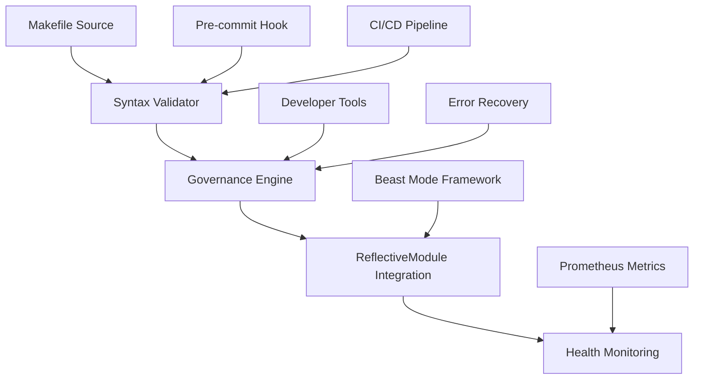

# Makefile Syntax Repair and Governance Design

## Overview

This design addresses the immediate syntax repair needs for the project's main Makefile and establishes a comprehensive governance framework to prevent future makefile syntax issues across the Beast Mode ecosystem. The solution combines immediate tactical fixes with strategic governance patterns that integrate with the existing ReflectiveModule architecture.

## ADR Conformance Review

### Relevant ADRs Reviewed
- ADR-005: ReflectiveModule Pattern for Observability - ✅ Compliant
- ADR-007: Integration-First Design Strategy - ✅ Compliant  
- ADR-008: Failure Isolation Over Cascade Prevention - ✅ Compliant
- ADR-009: Resource-Aware Dynamic Concurrency - ✅ Compliant

### Conformance Assessment
- **Infrastructure**: Aligns with existing Beast Mode framework patterns
- **Integration**: Follows integration-first design by building on existing ReflectiveModule infrastructure
- **Operations**: Implements failure isolation through validation layers and rollback procedures
- **Technology**: Uses established Python/Make toolchain without introducing new dependencies

### Architectural Consistency
The design maintains architectural consistency by leveraging the existing ReflectiveModule pattern for observability and health monitoring, while adding makefile-specific governance capabilities as a specialized layer.

## Architecture

### System Components



### Core Architecture Principles

1. **Layered Validation**: Multiple validation layers from syntax to governance compliance
2. **Integration-First**: Built on existing Beast Mode ReflectiveModule infrastructure
3. **Failure Isolation**: Validation failures don't cascade to break the entire build system
4. **Systematic Observability**: Full integration with Beast Mode monitoring and metrics

## Components and Interfaces

### 1. Makefile Syntax Validator

**Purpose**: Immediate syntax repair and ongoing validation

**Interface**:
```python
class MakefileSyntaxValidator(ReflectiveModule):
    def validate_syntax(self, makefile_path: str) -> ValidationResult
    def repair_syntax_errors(self, makefile_path: str) -> RepairResult
    def generate_syntax_report(self) -> SyntaxReport
```

**Key Features**:
- GNU Make syntax compliance checking
- Embedded Python code validation
- Multi-line recipe escaping repair
- Dependency target validation

### 2. Makefile Governance Engine

**Purpose**: Enforce governance standards and best practices

**Interface**:
```python
class MakefileGovernanceEngine(ReflectiveModule):
    def validate_governance(self, makefile_path: str) -> GovernanceResult
    def check_naming_conventions(self, targets: List[str]) -> ConventionResult
    def validate_phony_declarations(self, makefile_content: str) -> PhonyResult
    def assess_complexity_metrics(self, makefile_path: str) -> ComplexityMetrics
```

**Governance Rules**:
- Target naming conventions (kebab-case)
- .PHONY declarations for side-effect targets
- External script requirements for complex logic (>3 lines)
- Environment variable validation patterns

### 3. Beast Mode Integration Layer

**Purpose**: Integrate with existing ReflectiveModule infrastructure

**Interface**:
```python
class MakefileHealthMonitor(ReflectiveModule):
    def get_health_status(self) -> HealthStatus
    def get_metrics(self) -> PrometheusMetrics
    def handle_validation_failure(self, error: ValidationError) -> RecoveryAction
```

**Integration Points**:
- Prometheus metrics for validation success/failure rates
- Health endpoints for makefile system status
- Structured logging with correlation IDs
- Error recovery and rollback procedures

### 4. Developer Experience Tools

**Purpose**: Provide comprehensive tooling for developers

**Components**:
- Pre-commit hooks for automatic validation
- IDE integration for real-time syntax checking
- Documentation generator for makefile targets
- Interactive repair wizard for complex issues

## Data Models

### ValidationResult
```python
@dataclass
class ValidationResult:
    is_valid: bool
    syntax_errors: List[SyntaxError]
    governance_violations: List[GovernanceViolation]
    warnings: List[Warning]
    repair_suggestions: List[RepairSuggestion]
    correlation_id: str
```

### GovernanceViolation
```python
@dataclass
class GovernanceViolation:
    rule_id: str
    severity: Severity
    line_number: int
    description: str
    suggested_fix: str
    auto_fixable: bool
```

### MakefileMetrics
```python
@dataclass
class MakefileMetrics:
    target_count: int
    phony_target_count: int
    complexity_score: float
    embedded_script_lines: int
    dependency_depth: int
    last_validation_timestamp: datetime
```

## Error Handling

### Validation Error Recovery

1. **Syntax Errors**: Automatic repair with backup creation
2. **Governance Violations**: Graduated response (warning → error → block)
3. **Dependency Cycles**: Detection with suggested decomposition strategies
4. **Environment Issues**: Graceful degradation with clear error messages

### Failure Isolation Strategy

- **Validation failures** don't prevent makefile execution for critical targets
- **Governance violations** can be temporarily bypassed with explicit acknowledgment
- **Recovery procedures** automatically restore previous working state
- **Health monitoring** provides early warning of degrading makefile quality

### Error Propagation

```python
class MakefileError(Exception):
    def __init__(self, message: str, correlation_id: str, recovery_action: str):
        self.correlation_id = correlation_id
        self.recovery_action = recovery_action
        super().__init__(message)
```

## Testing Strategy

### Unit Testing
- **Syntax validator** with comprehensive makefile syntax test cases
- **Governance engine** with rule validation scenarios
- **ReflectiveModule integration** with health endpoint testing
- **Error handling** with failure simulation and recovery validation

### Integration Testing
- **End-to-end makefile validation** workflows
- **Pre-commit hook integration** testing
- **CI/CD pipeline integration** validation
- **Beast Mode framework integration** testing

### Performance Testing
- **Large makefile validation** performance benchmarks
- **Concurrent validation** stress testing
- **Memory usage** profiling for complex makefiles
- **Prometheus metrics** collection performance

### Acceptance Testing
- **Developer workflow** integration testing
- **Error message clarity** usability testing
- **Recovery procedure** effectiveness validation
- **Documentation completeness** verification

## Implementation Phases

### Phase 1: Immediate Syntax Repair
**Objective**: Fix current Makefile syntax errors
- Repair missing separators and malformed recipes
- Fix embedded Python code escaping
- Validate all existing targets
- Create backup and rollback procedures

### Phase 2: Validation Infrastructure
**Objective**: Build systematic validation capabilities
- Implement MakefileSyntaxValidator with ReflectiveModule integration
- Create comprehensive test suite
- Add Prometheus metrics and health endpoints
- Integrate with existing Beast Mode monitoring

### Phase 3: Governance Framework
**Objective**: Establish governance standards and enforcement
- Implement MakefileGovernanceEngine
- Create governance rule definitions
- Add pre-commit hook integration
- Develop developer documentation and guidelines

### Phase 4: Advanced Features
**Objective**: Enhanced developer experience and automation
- Interactive repair wizard
- IDE integration plugins
- Automated governance rule learning
- Advanced metrics and analytics

## Security Considerations

### Input Validation
- **Makefile content sanitization** to prevent injection attacks
- **Embedded script validation** with safe execution boundaries
- **File path validation** to prevent directory traversal
- **Environment variable validation** with secure defaults

### Access Control
- **Validation bypass permissions** restricted to authorized users
- **Governance rule modification** requires elevated privileges
- **Audit logging** for all validation and governance actions
- **Secure backup storage** with encryption at rest

## Performance Considerations

### Optimization Strategies
- **Incremental validation** for large makefiles
- **Caching** of validation results with dependency tracking
- **Parallel processing** for independent validation tasks
- **Resource-aware concurrency** following ADR-009 patterns

### Scalability Design
- **Horizontal scaling** through ReflectiveModule architecture
- **Metrics-driven optimization** using Prometheus data
- **Graceful degradation** under high load conditions
- **Resource monitoring** with automatic throttling

## Monitoring and Observability

### Prometheus Metrics
```python
makefile_validation_total = Counter('makefile_validation_total', ['status', 'type'])
makefile_syntax_errors = Gauge('makefile_syntax_errors', ['file'])
makefile_governance_violations = Gauge('makefile_governance_violations', ['rule'])
makefile_validation_duration = Histogram('makefile_validation_duration_seconds')
```

### Health Endpoints
- `/health` - Overall system health
- `/ready` - Readiness for validation requests
- `/metrics` - Prometheus metrics endpoint
- `/status` - Detailed system status with makefile statistics

### Structured Logging
```python
logger.info(
    "Makefile validation completed",
    extra={
        "correlation_id": correlation_id,
        "makefile_path": path,
        "validation_duration": duration,
        "errors_found": len(errors),
        "governance_violations": len(violations)
    }
)
```

## Integration with Beast Mode Framework

### ReflectiveModule Implementation
All components inherit from the unified ReflectiveModule:
```python
from src.rm_ddd.core.unified_reflective_module import ReflectiveModule

class MakefileSyntaxValidator(ReflectiveModule):
    """Makefile validator with beastly observability powers! 🐺"""
    
    def __init__(self):
        super().__init__()
        # Automatic Prometheus metrics registration
        # Health endpoints provided
        # Structured logging enabled
        # Error handling integrated
```

### PDCA Methodology Integration
- **Plan**: Governance rule definition and validation strategy
- **Do**: Execute validation and repair procedures
- **Check**: Monitor metrics and health status
- **Act**: Adjust governance rules based on observed patterns

### Systematic Tool Repair
Following Beast Mode principles, the system repairs tools systematically rather than with workarounds:
- **Root cause analysis** for recurring syntax issues
- **Systematic fixes** that address underlying patterns
- **Governance evolution** based on observed failure modes
- **Continuous improvement** through metrics-driven optimization

## Future Enhancements

### Machine Learning Integration
- **Pattern recognition** for common syntax error types
- **Predictive governance** based on historical violation patterns
- **Automated rule generation** from successful repair patterns
- **Intelligent complexity assessment** using ML models

### Advanced Governance Features
- **Cross-project governance** consistency checking
- **Dependency analysis** across multiple makefiles
- **Performance impact assessment** for governance rules
- **Automated documentation generation** from makefile analysis

### Developer Experience Improvements
- **Real-time validation** in development environments
- **Interactive tutorials** for makefile best practices
- **Collaborative governance** rule development
- **Integration with popular IDEs** and editors