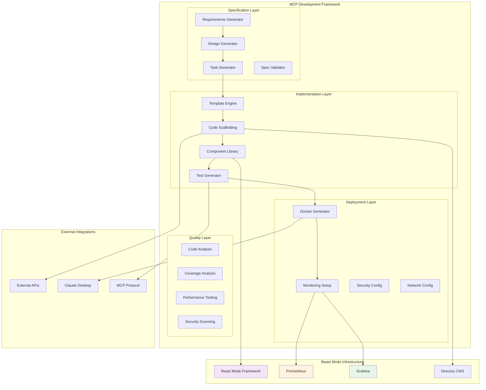
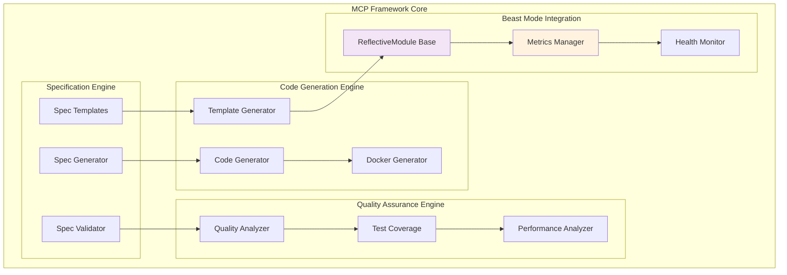
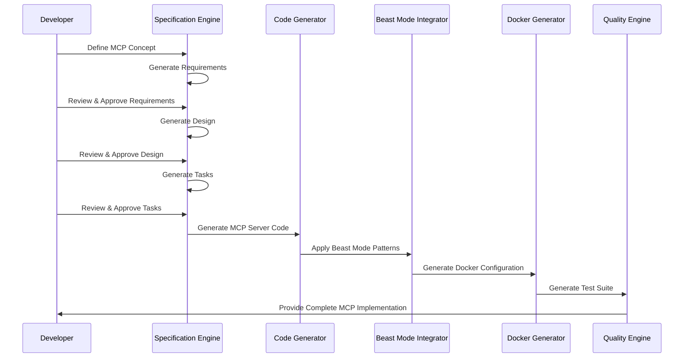
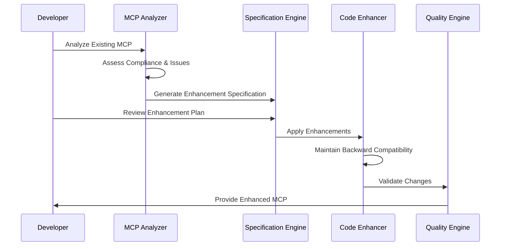

# Design Document

## Overview

The MCP Development Framework provides a systematic, specification-driven approach to creating and modifying Model Context Protocol (MCP) integrations within the Beast Mode ecosystem. This framework transforms the successful patterns from the Google Calendar MCP integration into reusable components, templates, and methodologies that ensure all MCP implementations follow Beast Mode compliance standards.

**ARCHITECTURAL CONSTRAINT**: This framework enforces **Beast Mode compliance** for all MCP implementations:

- **ReflectiveModule Inheritance**: All MCP components inherit from unified ReflectiveModule
- **Prometheus Metrics**: MANDATORY port 8080 metrics endpoint (not optional)
- **Grafana Integration**: MANDATORY observability dashboards (not optional)  
- **Directus Registration**: MUST use ReflectiveModule.register_module() for interface registration
- **Systematic Patterns**: MUST follow PDCA methodology and Beast Mode error handling

The framework supports both greenfield MCP development and systematic enhancement of existing MCP implementations, providing a bridge between human creativity and AI systematic processing.

## Architecture

### High-Level Framework Architecture



### Framework Component Architecture



## Components and Interfaces

### 1. Specification Engine

**Purpose**: Generate and validate MCP specifications using proven patterns

**Key Responsibilities**:
- Generate requirements documents with EARS format
- Create design documents with Beast Mode compliance
- Produce implementation task lists with dependencies
- Validate specifications against framework standards

**Interface**:
```python
class MCPSpecificationEngine(ReflectiveModule):
    def __init__(self, config: Dict[str, Any])
    def generate_requirements(self, mcp_concept: MCPConcept) -> RequirementsDocument
    def generate_design(self, requirements: RequirementsDocument) -> DesignDocument
    def generate_tasks(self, design: DesignDocument) -> TaskList
    def validate_specification(self, spec: MCPSpecification) -> ValidationResult
    def analyze_existing_mcp(self, mcp_path: str) -> MCPAnalysis
```

**Specification Templates**:
- **New MCP Template**: Complete requirements/design/tasks for greenfield development
- **Enhancement Template**: Modification patterns for existing MCPs
- **Bug Fix Template**: Systematic debugging and fix implementation
- **Compliance Template**: Beast Mode compliance upgrade patterns

### 2. Code Generation Engine

**Purpose**: Transform specifications into working MCP implementations

**Key Responsibilities**:
- Generate Beast Mode compliant MCP server code
- Create Docker containerization with monitoring
- Produce comprehensive test suites
- Generate configuration and deployment files

**Interface**:
```python
class MCPCodeGenerator(ReflectiveModule):
    def __init__(self, config: Dict[str, Any])
    def generate_mcp_server(self, spec: MCPSpecification) -> MCPServerCode
    def generate_docker_config(self, spec: MCPSpecification) -> DockerConfiguration
    def generate_test_suite(self, spec: MCPSpecification) -> TestSuite
    def generate_monitoring_config(self, spec: MCPSpecification) -> MonitoringConfiguration
    def enhance_existing_mcp(self, mcp_path: str, enhancements: List[Enhancement]) -> ModificationPlan
```

**Code Templates**:
- **Beast Mode MCP Server**: ReflectiveModule-based server implementation
- **Authentication Managers**: OAuth 2.0, API key, and token-based auth
- **Operations Handlers**: External API integration patterns
- **Error Handlers**: Systematic error handling and recovery
- **Docker Configurations**: Multi-stage builds with security best practices

### 3. Beast Mode Integration Layer

**Purpose**: Ensure all generated MCPs comply with Beast Mode framework standards

**Key Responsibilities**:
- Enforce ReflectiveModule inheritance patterns
- Configure Prometheus metrics endpoints
- Set up Grafana dashboard integration
- Implement Directus CMS registration

**Interface**:
```python
class BeastModeIntegrator(ReflectiveModule):
    def __init__(self, config: Dict[str, Any])
    def apply_beast_mode_patterns(self, mcp_code: MCPServerCode) -> BeastModeCompliantCode
    def configure_monitoring(self, mcp_spec: MCPSpecification) -> MonitoringSetup
    def setup_health_monitoring(self, mcp_server: MCPServer) -> HealthConfiguration
    def register_with_directus(self, mcp_metadata: MCPMetadata) -> RegistrationResult
```

**Beast Mode Patterns**:
- **ReflectiveModule Base Classes**: Unified health monitoring and metrics
- **Structured Logging**: Correlation IDs and systematic error tracking
- **Prometheus Integration**: Automatic metrics collection and alerting
- **Grafana Dashboards**: Pre-configured observability visualizations

### 4. External API Integration Framework

**Purpose**: Standardize integration patterns with external services

**Key Responsibilities**:
- Implement OAuth 2.0 authentication flows
- Handle API rate limiting and error recovery
- Manage credential security and token refresh
- Provide API client configuration templates

**Interface**:
```python
class ExternalAPIIntegrator(ReflectiveModule):
    def __init__(self, config: Dict[str, Any])
    def generate_oauth_handler(self, api_spec: APISpecification) -> OAuthHandler
    def generate_api_client(self, api_spec: APISpecification) -> APIClient
    def generate_rate_limiter(self, api_limits: RateLimits) -> RateLimiter
    def generate_error_handler(self, api_errors: ErrorSpecification) -> APIErrorHandler
```

**Integration Patterns**:
- **OAuth 2.0 Flows**: Complete authentication with token management
- **API Rate Limiting**: Exponential backoff with jitter
- **Error Recovery**: Circuit breakers and graceful degradation
- **Credential Security**: Encrypted storage with proper permissions

### 5. Docker Deployment Framework

**Purpose**: Generate production-ready containerization with monitoring

**Key Responsibilities**:
- Create multi-stage Docker builds
- Configure container security and networking
- Set up monitoring and health checks
- Integrate with Beast Mode infrastructure

**Interface**:
```python
class DockerDeploymentGenerator(ReflectiveModule):
    def __init__(self, config: Dict[str, Any])
    def generate_dockerfile(self, mcp_spec: MCPSpecification) -> Dockerfile
    def generate_compose_config(self, mcp_spec: MCPSpecification) -> DockerCompose
    def generate_monitoring_stack(self, mcp_spec: MCPSpecification) -> MonitoringStack
    def generate_security_config(self, mcp_spec: MCPSpecification) -> SecurityConfiguration
```

**Docker Patterns**:
- **Multi-Stage Builds**: Optimized images with security scanning
- **Non-Root Execution**: Security best practices with minimal base images
- **Health Checks**: Container orchestration integration
- **Monitoring Integration**: Prometheus and Grafana automatic setup

### 6. Quality Assurance Engine

**Purpose**: Ensure comprehensive testing and quality validation

**Key Responsibilities**:
- Generate comprehensive test suites
- Validate >90% code coverage requirement
- Perform security and performance testing
- Provide quality metrics and reporting

**Interface**:
```python
class QualityAssuranceEngine(ReflectiveModule):
    def __init__(self, config: Dict[str, Any])
    def generate_unit_tests(self, mcp_code: MCPServerCode) -> UnitTestSuite
    def generate_integration_tests(self, mcp_spec: MCPSpecification) -> IntegrationTestSuite
    def analyze_code_coverage(self, test_results: TestResults) -> CoverageReport
    def perform_security_scan(self, mcp_deployment: DockerDeployment) -> SecurityReport
    def analyze_performance(self, mcp_server: MCPServer) -> PerformanceReport
```

**Quality Patterns**:
- **Test Pyramid**: Unit, integration, and end-to-end testing
- **Coverage Analysis**: >90% coverage requirement validation
- **Security Scanning**: Container and code vulnerability assessment
- **Performance Testing**: Load testing and bottleneck identification

## Data Models

### MCP Specification Models

```python
@dataclass
class MCPConcept:
    name: str
    description: str
    external_service: str
    authentication_type: AuthenticationType
    primary_operations: List[str]
    beast_mode_compliance: bool = True

@dataclass
class MCPSpecification:
    concept: MCPConcept
    requirements: RequirementsDocument
    design: DesignDocument
    tasks: TaskList
    validation_status: ValidationStatus

@dataclass
class RequirementsDocument:
    introduction: str
    user_stories: List[UserStory]
    acceptance_criteria: List[AcceptanceCriteria]
    beast_mode_constraints: List[BeastModeConstraint]
    external_dependencies: List[ExternalDependency]
```

### Code Generation Models

```python
@dataclass
class MCPServerCode:
    server_class: str
    auth_manager: str
    operations_handler: str
    error_handler: str
    docker_config: DockerConfiguration
    test_suite: TestSuite
    monitoring_config: MonitoringConfiguration

@dataclass
class DockerConfiguration:
    dockerfile: str
    docker_compose: str
    health_checks: List[HealthCheck]
    security_config: SecurityConfiguration
    monitoring_integration: MonitoringIntegration
```

### Beast Mode Integration Models

```python
@dataclass
class BeastModeCompliance:
    reflective_module_inheritance: bool
    prometheus_metrics: bool
    grafana_dashboards: bool
    directus_registration: bool
    structured_logging: bool
    health_monitoring: bool
    systematic_error_handling: bool

@dataclass
class MonitoringConfiguration:
    prometheus_config: PrometheusConfig
    grafana_dashboards: List[GrafanaDashboard]
    alerting_rules: List[AlertingRule]
    health_endpoints: List[HealthEndpoint]
```

## Framework Workflows

### New MCP Development Workflow



### Existing MCP Enhancement Workflow



## Error Handling Strategy

### Framework Error Categories

1. **Specification Errors**
   - Invalid requirements format
   - Missing Beast Mode constraints
   - Incomplete external API specifications
   - Circular dependency detection

2. **Code Generation Errors**
   - Template rendering failures
   - Invalid configuration parameters
   - Missing dependency specifications
   - Compliance validation failures

3. **Integration Errors**
   - Beast Mode pattern application failures
   - Monitoring configuration errors
   - Docker build failures
   - Network configuration issues

4. **Quality Assurance Errors**
   - Test generation failures
   - Coverage requirement violations
   - Security scan failures
   - Performance threshold violations

### Error Recovery Mechanisms

```python
class FrameworkErrorHandler(ReflectiveModule):
    def handle_specification_error(self, error: SpecificationError) -> RecoveryPlan:
        """Provide guidance for fixing specification issues"""
        
    def handle_generation_error(self, error: GenerationError) -> FallbackStrategy:
        """Implement fallback code generation strategies"""
        
    def handle_integration_error(self, error: IntegrationError) -> ComplianceFix:
        """Provide Beast Mode compliance fixes"""
        
    def handle_quality_error(self, error: QualityError) -> QualityImprovement:
        """Suggest quality improvements and fixes"""
```

## Testing Strategy

### Framework Component Testing

**Unit Testing**:
- Specification engine validation
- Code generation template rendering
- Beast Mode pattern application
- Docker configuration generation

**Integration Testing**:
- End-to-end MCP generation workflow
- Beast Mode infrastructure integration
- External API integration patterns
- Docker deployment validation

**Quality Validation**:
- Generated code quality metrics
- Beast Mode compliance verification
- Security configuration validation
- Performance benchmark testing

### Generated MCP Testing

**Automated Test Generation**:
- Unit tests for all ReflectiveModule components
- Integration tests for external API connectivity
- End-to-end tests for Claude Desktop integration
- Performance tests for load and scalability

**Quality Gates**:
- >90% code coverage requirement
- Beast Mode compliance validation
- Security vulnerability scanning
- Performance threshold validation

## Deployment Architecture

### Framework Infrastructure

```yaml
# Framework deployment configuration
version: '3.8'

services:
  mcp-framework:
    build:
      context: ./src/beast_mode/mcp_framework
      dockerfile: Dockerfile
    container_name: mcp_development_framework
    ports:
      - "8080:8080"  # Prometheus metrics
      - "3000:3000"  # Framework API
    environment:
      - BEAST_MODE_COMPLIANCE=true
      - PROMETHEUS_ENABLED=true
      - GRAFANA_ENABLED=true
      - DIRECTUS_ENABLED=true
    volumes:
      - ./templates:/app/templates:ro
      - ./generated:/app/generated
      - framework_data:/app/data
    networks:
      - beast_mode_network

  # Beast Mode Infrastructure (MANDATORY)
  prometheus:
    image: prom/prometheus:latest
    ports:
      - "9090:9090"
    volumes:
      - ./monitoring/prometheus:/etc/prometheus:ro
      - prometheus_data:/prometheus
    networks:
      - beast_mode_network

  grafana:
    image: grafana/grafana:latest
    ports:
      - "3001:3000"
    environment:
      - GF_SECURITY_ADMIN_PASSWORD=admin
    volumes:
      - ./monitoring/grafana:/etc/grafana/provisioning:ro
      - grafana_data:/var/lib/grafana
    networks:
      - beast_mode_network

volumes:
  framework_data:
  prometheus_data:
  grafana_data:

networks:
  beast_mode_network:
    driver: bridge
```

### Generated MCP Deployment

The framework generates deployment configurations that follow the established patterns:

- **Docker Compose**: Multi-service deployment with monitoring
- **Security Configuration**: Non-root execution, encrypted credentials
- **Network Integration**: Beast Mode network topology
- **Monitoring Setup**: Automatic Prometheus and Grafana configuration

## Security Considerations

### Framework Security

1. **Template Security**
   - Code generation templates are validated for security patterns
   - No arbitrary code execution in template rendering
   - Secure credential handling in generated code

2. **Generated Code Security**
   - Automatic security best practices application
   - Credential encryption and proper permissions
   - Container security scanning integration

### MCP Security Patterns

1. **Authentication Security**
   - OAuth 2.0 implementation with secure token storage
   - API key management with encryption
   - Credential rotation and revocation support

2. **Container Security**
   - Non-root user execution
   - Minimal base images with security scanning
   - Network isolation and firewall rules

## Performance Considerations

### Framework Performance

1. **Code Generation Efficiency**
   - Template caching for faster generation
   - Parallel processing for large specifications
   - Incremental generation for modifications

2. **Resource Optimization**
   - Memory-efficient template rendering
   - Disk space optimization for generated artifacts
   - Network bandwidth optimization for deployments

### Generated MCP Performance

1. **Runtime Performance**
   - Profiling decorators for performance monitoring
   - Prometheus metrics for systematic optimization
   - Memory leak detection and prevention

2. **Scalability Patterns**
   - Horizontal scaling support
   - Load balancing configuration
   - Resource utilization monitoring

This design provides a comprehensive framework for systematic MCP development that transforms the successful Google Calendar MCP patterns into reusable, scalable components while maintaining Beast Mode compliance and quality standards.