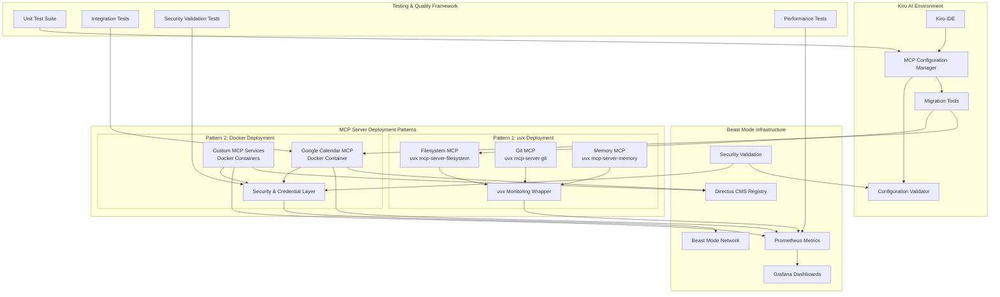

# Design Document

## Overview

The MCP Server Configuration Standardization design establishes a systematic approach to deploying and managing Model Context Protocol (MCP) servers within the Beast Mode framework. The design addresses the current inconsistency where some MCP servers use npx commands while others use uvx, creating management complexity and security concerns.

The solution provides two standardized deployment patterns: uvx for simple Python-based MCP servers and Docker containers for complex services requiring isolation, persistent state, or multi-language dependencies. This design ensures all MCP servers integrate seamlessly with Beast Mode's systematic observability and management infrastructure.

## Architecture

### High-Level Architecture



### Deployment Pattern Decision Matrix

| MCP Server Characteristics | Recommended Pattern | Rationale | Security Considerations |
|---------------------------|-------------------|-----------|------------------------|
| Simple Python package, no state | uvx | Lightweight, automatic dependency management | Minimal attack surface, isolated dependencies |
| Complex dependencies, persistent state | Docker | Isolation, state management, multi-language support | Container isolation, secure volume mounting |
| Requires authentication/credentials | Docker | Secure credential mounting, isolation | Encrypted credential storage, least privilege |
| Multi-language (Node.js, Go, etc.) | Docker | Language-agnostic containerization | Language-specific security hardening |
| Development/prototyping | uvx | Rapid iteration, minimal overhead | Development-only credentials, network isolation |
| Production services | Docker | Systematic observability, health monitoring | Full security validation, audit logging |

### Migration Strategy from npx to Standardized Patterns

The design addresses the critical requirement to migrate existing npx-based MCP servers to standardized patterns:

1. **Automated Detection**: Scan existing mcp.json configurations for npx usage patterns
2. **Pattern Analysis**: Determine appropriate target pattern (uvx vs Docker) based on server characteristics
3. **Safe Migration**: Backup original configurations before applying changes
4. **Validation**: Verify migrated configurations maintain functionality
5. **Rollback Support**: Provide easy restoration of original configurations if needed

## Components and Interfaces

### 1. MCP Configuration Manager

**Purpose**: Centralized management of MCP server configurations with validation and standardization.

**Key Responsibilities**:
- Validate MCP configuration files against standardized schemas
- Provide migration tools for converting npx configurations to standardized patterns
- Support environment-specific configuration overrides
- Integrate with Beast Mode framework for systematic management

**Interface**:
```python
class MCPConfigurationManager(ReflectiveModule):
    def validate_configuration(self, config_path: str) -> ValidationResult
    def migrate_npx_to_docker(self, server_name: str) -> MigrationResult
    def generate_docker_compose(self, server_config: MCPServerConfig) -> str
    def register_with_directus(self, server_info: MCPServerInfo) -> bool
```

### 2. Docker MCP Server Template

**Purpose**: Standardized Docker container template for complex MCP servers.

**Key Features**:
- Beast Mode ReflectiveModule integration
- Prometheus metrics exposure on port 8080
- Secure credential mounting with proper permissions
- Health monitoring and automatic restart capabilities
- Structured logging with correlation IDs

**Container Structure**:
```dockerfile
# Base template for Beast Mode MCP servers
FROM python:3.11-slim

# Install Beast Mode framework dependencies
RUN pip install beast-mode-framework prometheus-client

# Create MCP server structure
WORKDIR /app
COPY mcp_server/ ./
COPY beast_mode_integration.py ./

# Expose MCP service and metrics ports
EXPOSE 3000 8080

# Health check using ReflectiveModule
HEALTHCHECK --interval=30s --timeout=10s --retries=3 \
    CMD python -c "from beast_mode_integration import health_check; health_check()"

CMD ["python", "beast_mode_integration.py"]
```

### 3. uvx MCP Server Wrapper

**Purpose**: Lightweight wrapper for simple Python MCP servers using uvx.

**Key Features**:
- Automatic dependency resolution through uvx
- Consistent configuration interface
- Integration with Beast Mode logging patterns
- Support for development and production environments

**Configuration Schema**:
```json
{
  "server_name": {
    "deployment_pattern": "uvx",
    "command": "uvx",
    "args": ["package-name", "--arg1", "value1"],
    "env": {},
    "disabled": false,
    "autoApprove": ["tool1", "tool2"],
    "disabledTools": []
  }
}
```

### 4. Beast Mode Integration Layer

**Purpose**: Ensures all MCP servers integrate with Beast Mode framework infrastructure with comprehensive observability and management.

**Key Components**:
- **Metrics Collector**: Exposes Prometheus metrics for all MCP operations with performance tracking
- **Health Monitor**: Implements ReflectiveModule health status reporting with systematic diagnostics
- **Logger**: Provides structured logging with correlation IDs and audit trails
- **Registry Client**: Registers MCP servers with Directus CMS for systematic management and discovery
- **Security Monitor**: Validates credential handling and access patterns
- **Performance Profiler**: Tracks MCP operation latency and resource usage

**Integration Interface**:
```python
class BeastModeMCPIntegration(ReflectiveModule):
    def __init__(self, mcp_server_name: str, mcp_port: int):
        super().__init__()
        self.server_name = mcp_server_name
        self.mcp_port = mcp_port
        self.metrics_port = 8080
        self.security_validator = SecurityValidator()
        
    def start_metrics_server(self) -> None
    def register_with_directus(self) -> bool
    def setup_structured_logging(self) -> None
    def monitor_mcp_health(self) -> HealthStatus
    def validate_security_configuration(self) -> SecurityStatus
    def profile_performance(self) -> PerformanceMetrics
    def setup_grafana_dashboards(self) -> bool

### 5. Security and Credential Management System

**Purpose**: Provides secure handling of credentials and sensitive configuration for MCP servers.

**Key Features**:
- **Encrypted Credential Storage**: Secure storage and retrieval of API keys and tokens
- **Least Privilege Access**: Minimal permission sets for each MCP server
- **Audit Logging**: Complete audit trail of credential access and usage
- **Network Isolation**: Secure network segmentation for containerized services
- **Permission Validation**: Automated checking of file and container permissions

**Security Interface**:
```python
class MCPSecurityManager(ReflectiveModule):
    def __init__(self, server_name: str):
        super().__init__()
        self.server_name = server_name
        self.credential_store = EncryptedCredentialStore()
        
    def mount_credentials_securely(self, container_config: Dict) -> Dict
    def validate_file_permissions(self, file_path: str) -> bool
    def audit_credential_access(self, operation: str) -> None
    def check_network_isolation(self) -> SecurityStatus
    def scan_for_security_issues(self) -> List[SecurityIssue]

### 6. Migration and Compatibility Framework

**Purpose**: Provides automated migration from existing npx configurations to standardized patterns.

**Key Features**:
- **Configuration Analysis**: Automatic detection of npx usage patterns
- **Pattern Recommendation**: AI-assisted selection of optimal deployment pattern
- **Safe Migration**: Backup and rollback capabilities for configuration changes
- **Validation Pipeline**: Comprehensive testing of migrated configurations
- **Documentation Generation**: Automatic creation of migration reports

**Migration Interface**:
```python
class MCPMigrationManager(ReflectiveModule):
    def __init__(self):
        super().__init__()
        self.pattern_analyzer = DeploymentPatternAnalyzer()
        self.backup_manager = ConfigurationBackupManager()
        
    def analyze_existing_configuration(self, config_path: str) -> AnalysisResult
    def recommend_deployment_pattern(self, server_config: Dict) -> PatternRecommendation
    def migrate_npx_to_standardized(self, server_name: str) -> MigrationResult
    def validate_migrated_configuration(self, config: MCPConfiguration) -> ValidationResult
    def generate_migration_report(self, results: List[MigrationResult]) -> str
```

## Data Models

### MCP Server Configuration Schema

```python
from pydantic import BaseModel
from typing import Dict, List, Optional, Literal

class MCPServerConfig(BaseModel):
    deployment_pattern: Literal["uvx", "docker"]
    command: str
    args: List[str]
    env: Dict[str, str]
    disabled: bool = False
    autoApprove: List[str] = []
    disabledTools: List[str] = []
    
    # Docker-specific fields
    docker_image: Optional[str] = None
    docker_ports: Optional[Dict[str, int]] = None
    docker_volumes: Optional[List[str]] = None
    docker_networks: Optional[List[str]] = None
    
    # Beast Mode integration
    beast_mode_enabled: bool = True
    metrics_port: int = 8080
    health_check_enabled: bool = True

class MCPConfiguration(BaseModel):
    mcpServers: Dict[str, MCPServerConfig]
    beast_mode_network: str = "beast_mode_network"
    prometheus_enabled: bool = True
    grafana_enabled: bool = True
    directus_registry_enabled: bool = True
```

### Migration Configuration

```python
class MigrationConfig(BaseModel):
    source_config_path: str
    target_config_path: str
    backup_original: bool = True
    validate_after_migration: bool = True
    
class MigrationResult(BaseModel):
    success: bool
    migrated_servers: List[str]
    failed_servers: List[str]
    backup_path: Optional[str]
    validation_errors: List[str]
```

## Error Handling

### Configuration Validation Errors

**Error Categories**:
1. **Schema Validation**: Invalid configuration structure or missing required fields
2. **Deployment Pattern Mismatch**: Incorrect pattern selection for server characteristics
3. **Docker Configuration Errors**: Invalid Docker settings or missing container requirements
4. **Beast Mode Integration Failures**: Missing framework dependencies or configuration

**Error Handling Strategy**:
```python
class MCPConfigurationError(Exception):
    def __init__(self, server_name: str, error_type: str, details: str):
        self.server_name = server_name
        self.error_type = error_type
        self.details = details
        super().__init__(f"MCP Configuration Error for {server_name}: {error_type} - {details}")

class ConfigurationValidator:
    def validate_and_fix(self, config: MCPConfiguration) -> ValidationResult:
        """Validate configuration and provide automatic fixes where possible"""
        errors = []
        fixes = []
        
        for server_name, server_config in config.mcpServers.items():
            try:
                self._validate_server_config(server_name, server_config)
            except MCPConfigurationError as e:
                errors.append(e)
                fix = self._suggest_fix(e)
                if fix:
                    fixes.append(fix)
        
        return ValidationResult(errors=errors, suggested_fixes=fixes)
```

### Runtime Error Handling

**Docker Container Failures**:
- Automatic restart with exponential backoff
- Health check failures trigger container recreation
- Credential mounting errors provide clear diagnostic messages
- Network connectivity issues handled with retry logic

**uvx Deployment Failures**:
- Package installation errors with dependency resolution guidance
- Version conflicts handled through virtual environment isolation
- Missing system dependencies detected and reported

## Testing Strategy

### Unit Testing

**Configuration Management Tests**:
```python
class TestMCPConfigurationManager:
    def test_validate_valid_configuration(self):
        """Test validation of properly structured MCP configuration"""
        
    def test_validate_invalid_configuration_with_errors(self):
        """Test validation failure scenarios with detailed error reporting"""
        
    def test_migrate_npx_to_docker(self):
        """Test migration from npx to Docker configuration"""
        
    def test_migrate_npx_to_uvx(self):
        """Test migration from npx to uvx configuration"""
        
    def test_generate_docker_compose(self):
        """Test Docker Compose generation from MCP configuration"""
        
    def test_beast_mode_integration(self):
        """Test Beast Mode framework integration"""
        
    def test_deployment_pattern_recommendation(self):
        """Test automated deployment pattern selection logic"""

class TestMCPSecurityManager:
    def test_credential_encryption_decryption(self):
        """Test secure credential storage and retrieval"""
        
    def test_file_permission_validation(self):
        """Test file permission checking and enforcement"""
        
    def test_network_isolation_validation(self):
        """Test network security configuration validation"""
        
    def test_security_audit_logging(self):
        """Test comprehensive security audit trail generation"""

class TestMCPMigrationManager:
    def test_npx_configuration_analysis(self):
        """Test detection and analysis of existing npx configurations"""
        
    def test_migration_backup_and_rollback(self):
        """Test safe backup and rollback of configuration changes"""
        
    def test_migration_validation_pipeline(self):
        """Test comprehensive validation of migrated configurations"""
```

**Docker Integration Tests**:
```python
class TestDockerMCPDeployment:
    def test_container_startup_with_beast_mode(self):
        """Test Docker container starts correctly with Beast Mode integration"""
        
    def test_metrics_exposure_and_collection(self):
        """Test Prometheus metrics are properly exposed and collected"""
        
    def test_health_monitoring_and_alerting(self):
        """Test ReflectiveModule health status reporting and alerting"""
        
    def test_credential_security_and_mounting(self):
        """Test secure credential mounting and permissions"""
        
    def test_network_isolation_and_connectivity(self):
        """Test Beast Mode network integration and isolation"""
        
    def test_grafana_dashboard_integration(self):
        """Test Grafana dashboard creation and data visualization"""
```

### Integration Testing

**End-to-End MCP Protocol Tests**:
```python
class TestMCPProtocolIntegration:
    def test_kiro_ide_connection_uvx(self):
        """Test Kiro IDE can connect to uvx-deployed MCP servers"""
        
    def test_kiro_ide_connection_docker(self):
        """Test Kiro IDE can connect to Docker-deployed MCP servers"""
        
    def test_tool_availability_and_functionality(self):
        """Test MCP tools are properly exposed and functional across patterns"""
        
    def test_error_handling_and_recovery(self):
        """Test error scenarios and systematic recovery mechanisms"""
        
    def test_performance_monitoring_integration(self):
        """Test Beast Mode observability integration across all patterns"""
        
    def test_security_validation_end_to_end(self):
        """Test security measures work correctly in real deployment scenarios"""
        
    def test_migration_functionality_preservation(self):
        """Test that migrated configurations maintain full functionality"""

class TestBeastModeFrameworkIntegration:
    def test_directus_registry_integration(self):
        """Test MCP server registration and discovery via Directus CMS"""
        
    def test_prometheus_metrics_collection(self):
        """Test systematic metrics collection and aggregation"""
        
    def test_grafana_dashboard_functionality(self):
        """Test Grafana dashboards display MCP server metrics correctly"""
        
    def test_reflective_module_health_reporting(self):
        """Test ReflectiveModule health status integration"""
```

### Performance Testing

**Load Testing**:
- MCP request/response latency under various loads with systematic measurement
- Container resource usage monitoring with Beast Mode observability
- Prometheus metrics collection overhead analysis
- Concurrent MCP server operation testing with performance profiling
- uvx vs Docker deployment pattern performance comparison

**Scalability Testing**:
- Multiple MCP server deployment scenarios with resource optimization
- Beast Mode network performance with multiple containers
- Resource consumption analysis for different deployment patterns
- Horizontal scaling validation for Docker-based MCP servers
- Performance impact assessment of security and monitoring overhead

### Security Testing

**Security Validation Tests**:
```python
class TestMCPSecurityValidation:
    def test_credential_isolation_docker(self):
        """Test credential isolation in Docker deployments"""
        
    def test_file_permission_enforcement(self):
        """Test file permission validation and enforcement"""
        
    def test_network_segmentation_validation(self):
        """Test Beast Mode network isolation and segmentation"""
        
    def test_audit_trail_completeness(self):
        """Test comprehensive audit logging for all security events"""
        
    def test_vulnerability_scanning(self):
        """Test automated security vulnerability detection"""
```

## Implementation Phases

### Phase 1: Configuration Standardization (Week 1)
- Implement MCPConfigurationManager with validation
- Create standardized configuration schemas
- Develop migration tools for existing npx configurations
- Establish Docker container templates

### Phase 2: Docker Integration (Week 2)
- Implement Beast Mode Docker MCP server template
- Create Google Calendar MCP Docker migration
- Integrate Prometheus metrics and health monitoring
- Establish Beast Mode network connectivity

### Phase 3: uvx Pattern Optimization (Week 3)
- Optimize uvx deployment patterns for simple MCP servers
- Implement consistent logging and monitoring for uvx servers
- Create development environment support
- Establish testing frameworks

### Phase 4: Beast Mode Framework Integration (Week 4)
- Complete ReflectiveModule integration for all MCP servers
- Implement Directus CMS registry integration
- Create Grafana dashboards for MCP monitoring
- Establish systematic observability patterns

### Phase 5: Documentation and Migration Support (Week 5)
- Create comprehensive documentation for both deployment patterns
- Develop migration guides and best practices
- Implement automated migration tools
- Establish troubleshooting and diagnostic procedures