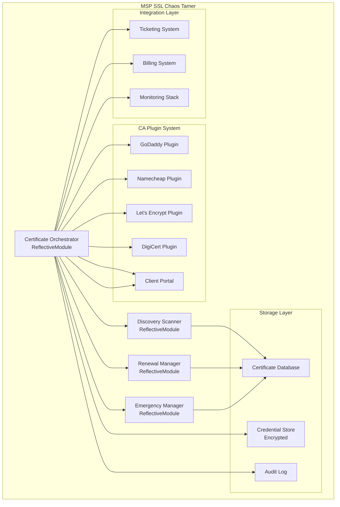

# Design Document

## Overview

The MSP SSL Chaos Tamer is architected as a distributed, plugin-based certificate management system that embraces the chaos of real MSP environments. Unlike enterprise solutions that assume standardization, this system is designed for the reality of mixed CAs, overlapping IP ranges, legacy systems, and emergency scenarios.

The architecture follows the Beast Mode framework principles: systematic observability, physics-informed constraints, and MSP-first design philosophy. Every component inherits from ReflectiveModule for consistent monitoring and health reporting.

## Architecture

### Core Architecture Pattern: Plugin-Based Certificate Orchestrator



### Deployment Architecture: Multi-Modal Flexibility

The system supports four deployment modes to match MSP infrastructure reality:

1. **Docker Container** - Single command deployment
2. **VM Appliance** - Pre-configured virtual machine
3. **Cloud Instance** - AWS/Azure/GCP with IaC templates
4. **Bare Metal** - Direct installation on MSP hardware

Each deployment mode provides identical functionality with environment-specific optimizations.

## Components and Interfaces

### Certificate Orchestrator (Core Engine)

**Purpose:** Central coordination engine that manages all certificate operations

**Key Responsibilities:**
- Coordinate discovery, renewal, and emergency operations
- Manage CA plugin lifecycle and failover
- Enforce MSP-specific policies and workflows
- Provide unified API for all certificate operations

**Interface:**
```python
from src.rm_ddd.core.unified_reflective_module import ReflectiveModule

class CertificateOrchestrator(ReflectiveModule):
    def discover_certificates(self, domain_list: List[str]) -> CertificateInventory
    def schedule_renewal(self, cert_id: str, renewal_policy: RenewalPolicy) -> RenewalTask
    def emergency_provision(self, domain: str, emergency_type: EmergencyType) -> EmergencyCertificate
    def get_client_status(self, client_id: str) -> ClientCertificateStatus
```

### Discovery Scanner

**Purpose:** Systematic certificate discovery across all client domains

**Key Responsibilities:**
- Scan domains for existing certificates
- Identify certificate chains and dependencies
- Detect certificate misconfigurations
- Build comprehensive certificate inventory

**Discovery Methods:**
- DNS-based certificate transparency log scanning
- Direct HTTPS endpoint probing
- Certificate authority API queries
- Network scanning for non-standard ports

### Renewal Manager

**Purpose:** Predictive certificate renewal with CA-specific workflows

**Key Responsibilities:**
- Calculate optimal renewal timing based on CA processing delays
- Execute CA-specific renewal workflows
- Handle renewal failures with escalation strategies
- Coordinate certificate deployment after renewal

**Renewal Strategies:**
- **Conservative:** Renew at 30 days before expiration
- **Aggressive:** Renew at 60 days for critical certificates
- **Emergency:** Immediate renewal for expired certificates
- **Maintenance Window:** Schedule renewals during client maintenance windows

### Emergency Manager

**Purpose:** "Oh shit" button functionality for certificate emergencies

**Key Responsibilities:**
- Detect certificate emergencies (expired, compromised, revoked)
- Execute emergency certificate provisioning workflows
- Bypass normal approval processes for speed
- Coordinate emergency certificate deployment

**Emergency Workflows:**
1. **Expired Certificate:** Immediate Let's Encrypt provisioning
2. **Compromised Certificate:** Revoke and replace within 1 hour
3. **CA Outage:** Failover to alternative CA automatically
4. **Mass Expiration:** Batch emergency provisioning with prioritization

### CA Plugin System

**Purpose:** Unified interface for multiple certificate authorities

**Plugin Architecture:**
Each CA plugin implements a standard interface while handling CA-specific quirks:

```python
class CAPlugin(ReflectiveModule):
    def authenticate(self, credentials: EncryptedCredentials) -> AuthToken
    def request_certificate(self, csr: CertificateRequest) -> Certificate
    def renew_certificate(self, cert_id: str) -> Certificate
    def revoke_certificate(self, cert_id: str) -> RevocationStatus
    def get_certificate_status(self, cert_id: str) -> CertificateStatus
```

**Supported CAs:**
- **Let's Encrypt:** ACME protocol, free certificates, 90-day lifecycle
- **GoDaddy:** REST API, paid certificates, 1-year lifecycle
- **Namecheap:** REST API, paid certificates, flexible lifecycle
- **DigiCert:** REST API, enterprise certificates, extended validation
- **Sectigo:** REST API, business certificates, organization validation
- **Custom CA:** Plugin framework for internal or specialized CAs

### Client Portal System

**Purpose:** MSP-branded certificate status portals for clients

**Key Features:**
- **White-label branding:** MSP logos, colors, and custom domains
- **Real-time status:** Live certificate health and expiration tracking
- **Client self-service:** Certificate requests and basic management
- **Audit trails:** Complete history of certificate operations
- **Mobile responsive:** Works on all devices for emergency access

### Integration Layer

**Purpose:** Connect certificate management with existing MSP workflows

**Ticketing System Integration:**
- ConnectWise Manage API integration
- Autotask API integration
- ServiceNow integration
- Generic webhook support for other systems

**Billing System Integration:**
- Track certificate costs per client
- Generate billing reports for certificate services
- Integration with QuickBooks, Xero, and MSP billing platforms
- Cost allocation for multi-domain certificates

## Data Models

### Certificate Model

```python
@dataclass
class Certificate:
    id: str
    domain: str
    client_id: str
    ca_provider: str
    issue_date: datetime
    expiration_date: datetime
    certificate_chain: List[str]
    private_key_fingerprint: str  # Never store actual private keys
    status: CertificateStatus
    renewal_policy: RenewalPolicy
    emergency_contacts: List[str]
    
    def days_until_expiration(self) -> int
    def is_renewal_due(self) -> bool
    def get_renewal_urgency(self) -> UrgencyLevel
```

### Client Model

```python
@dataclass
class Client:
    id: str
    name: str
    msp_id: str
    domains: List[str]
    preferred_ca: str
    billing_contact: str
    technical_contact: str
    emergency_contact: str
    certificate_policies: List[CertificatePolicy]
    portal_access_enabled: bool
    
    def get_certificate_inventory(self) -> List[Certificate]
    def calculate_monthly_certificate_costs(self) -> Decimal
```

### MSP Model

```python
@dataclass
class MSP:
    id: str
    name: str
    ca_credentials: Dict[str, EncryptedCredentials]
    clients: List[Client]
    default_policies: List[CertificatePolicy]
    integration_settings: IntegrationSettings
    branding_config: BrandingConfig
    
    def get_total_certificate_count(self) -> int
    def get_certificates_expiring_soon(self, days: int) -> List[Certificate]
```

## Error Handling

### Systematic Error Recovery

The system implements comprehensive error handling based on MSP operational reality:

**CA API Failures:**
- Automatic failover to alternative CAs
- Exponential backoff with jitter for API rate limits
- Circuit breaker pattern for consistently failing CAs
- Manual override capabilities for emergency situations

**Network Failures:**
- Local caching of certificate data for offline operation
- Queue-based retry mechanisms for failed operations
- Graceful degradation when external services are unavailable
- Detailed logging for post-incident analysis

**Certificate Validation Failures:**
- Automatic certificate chain validation
- Detection and correction of common certificate issues
- Integration with certificate transparency logs for validation
- Alerting for certificates that fail validation

**Emergency Escalation:**
- Automated escalation to MSP staff for critical failures
- Integration with PagerDuty, OpsGenie, and similar alerting systems
- SMS and email notifications for certificate emergencies
- Escalation matrices based on client criticality

## Testing Strategy

### Multi-Layer Testing Approach

**Unit Testing:**
- >90% code coverage requirement (Beast Mode standard)
- Mock CA APIs for reliable testing
- Test all error conditions and edge cases
- Automated testing of certificate validation logic

**Integration Testing:**
- Test with real CA sandbox environments
- Validate certificate deployment workflows
- Test MSP integration points (ticketing, billing)
- Network failure simulation and recovery testing

**Chaos Engineering:**
- Simulate CA outages and failover scenarios
- Test emergency workflows under stress
- Validate system behavior during network partitions
- Load testing with realistic MSP certificate volumes

**MSP Environment Testing:**
- Test in actual MSP environments with real certificate chaos
- Validate with multiple CA configurations
- Test client portal functionality with real MSP branding
- Performance testing with realistic client loads

### Continuous Validation

**Certificate Health Monitoring:**
- Continuous validation of all managed certificates
- Automated detection of certificate issues
- Proactive alerting before problems impact clients
- Integration with existing MSP monitoring systems

**System Health Monitoring:**
- Beast Mode ReflectiveModule health endpoints
- Prometheus metrics for all system operations
- Grafana dashboards for MSP operational visibility
- Automated system health reporting

## Security Architecture

### Zero-Trust Security Model

**Credential Management:**
- All CA credentials encrypted at rest using AES-256
- Credential rotation policies and automated key management
- Hardware security module (HSM) support for high-security environments
- No credentials ever transmitted to external services

**Certificate Security:**
- Private keys never stored in the system (only fingerprints)
- Certificate signing requests generated on target servers
- Secure certificate deployment using SSH/WinRM
- Audit logging of all certificate operations

**Access Control:**
- Role-based access control (RBAC) for MSP staff
- Multi-factor authentication for administrative access
- Client portal isolation and tenant security
- API authentication using JWT tokens with short expiration

**Network Security:**
- TLS 1.3 for all external communications
- Certificate pinning for CA API connections
- Network segmentation support for MSP environments
- VPN integration for secure remote management

## Performance Considerations

### MSP-Scale Performance

**Certificate Discovery:**
- Parallel scanning of multiple domains
- Intelligent caching to avoid redundant scans
- Rate limiting to respect CA API limits
- Batch operations for efficiency

**Renewal Processing:**
- Asynchronous renewal workflows
- Priority queuing for critical certificates
- Load balancing across multiple CA accounts
- Retry logic with exponential backoff

**Client Portal Performance:**
- CDN integration for global performance
- Caching strategies for certificate status data
- Real-time updates using WebSocket connections
- Mobile optimization for field technician access

**Database Performance:**
- Optimized indexing for certificate queries
- Partitioning strategies for large MSP deployments
- Backup and recovery procedures
- Database migration support for system upgrades

## Deployment Strategy

### Multi-Modal Deployment

**Docker Container Deployment:**
```bash
# Single command deployment
docker run -d \
  --name msp-ssl-manager \
  -p 8080:8080 \
  -p 8443:8443 \
  -v /opt/ssl-manager/data:/app/data \
  -v /opt/ssl-manager/config:/app/config \
  msp-ssl-chaos-tamer:latest
```

**VM Appliance Deployment:**
- Pre-configured Ubuntu 22.04 LTS base
- Automated installation and configuration scripts
- Web-based initial setup wizard
- Backup and restore functionality

**Cloud Deployment:**
- Terraform templates for AWS, Azure, GCP
- Auto-scaling groups for high availability
- Load balancer integration
- Cloud-native backup solutions

**Bare Metal Deployment:**
- Ansible playbooks for automated installation
- Support for RHEL, Ubuntu, and CentOS
- Hardware requirements documentation
- Performance tuning guides

This design provides the systematic foundation for building an MSP-grade certificate management system that thrives in chaos while maintaining the reliability and observability that MSPs demand.