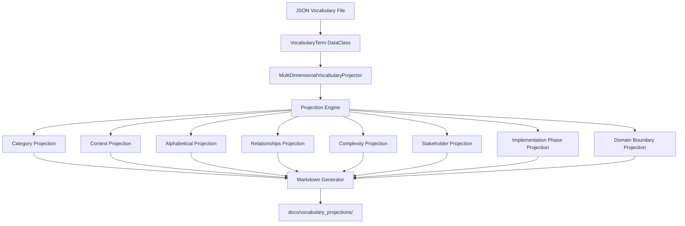

# Design Document

## Overview

The Multi-Dimensional Vocabulary Projector transforms structured vocabulary data into multiple specialized documentation views through a projection-based architecture. The system uses a single JSON vocabulary source to generate eight distinct markdown perspectives, each optimized for different stakeholder needs and use cases.

The design emphasizes separation of concerns between data management, projection algorithms, and output generation, enabling easy extension with new projection dimensions while maintaining consistency across all generated documentation.

## Architecture

### System Architecture Diagram



### Core Components

#### 1. Data Model Layer

**VocabularyTerm DataClass**:
```python
@dataclass
class VocabularyTerm:
    term: str                    # Primary term name
    definition: str              # Comprehensive definition
    category: str               # Functional category
    context: str                # Usage context/domain
    related_terms: List[str]    # Connected concepts
    examples: List[str]         # Usage examples
    synonyms: List[str]         # Alternative terms
    antonyms: List[str]         # Opposite concepts
```

**ProjectionDimension Enum**:
```python
class ProjectionDimension(Enum):
    BY_CATEGORY = "by_category"
    BY_CONTEXT = "by_context"
    BY_ALPHABETICAL = "by_alphabetical"
    BY_RELATIONSHIPS = "by_relationships"
    BY_COMPLEXITY = "by_complexity"
    BY_STAKEHOLDER = "by_stakeholder"
    BY_IMPLEMENTATION_PHASE = "by_implementation_phase"
    BY_DOMAIN_BOUNDARY = "by_domain_boundary"
```

#### 2. Projection Engine

**MultiDimensionalVocabularyProjector Class**:
- **Responsibility**: Orchestrates vocabulary loading, projection generation, and output management
- **Key Methods**:
  - `load_vocabulary()`: JSON parsing and validation
  - `project_by_*()`: Dimension-specific projection algorithms
  - `generate_all_projections()`: Batch processing coordinator
  - `save_projection()`: File output management

#### 3. Projection Algorithms

Each projection dimension implements a specific organizational algorithm:

**Category Projection** (Req 2.2):
```python
def project_by_category(self) -> str:
    categories = {}
    for term in self.vocabulary.values():
        if term.category not in categories:
            categories[term.category] = []
        categories[term.category].append(term)
    
    # Generate markdown with category sections
    # Include term counts and cross-references
```

**Context Projection** (Req 2.3):
- Groups terms by usage context and domain
- Emphasizes examples and practical applications
- Shows domain-specific terminology clusters

**Alphabetical Projection** (Req 2.4):
- Simple alphabetical sorting for reference lookup
- Includes all metadata for comprehensive term view
- Optimized for quick term location

**Relationships Projection** (Req 2.5):
- Highlights term connections and dependencies
- Shows synonym/antonym relationships
- Creates conceptual maps and clusters

**Complexity Projection** (Req 2.6):
```python
def project_by_complexity(self) -> str:
    # Algorithm to arrange terms from simple to complex concepts
    # Complexity scoring based on:
    # - Number of related terms (higher = more complex)
    # - Definition length and technical depth
    # - Prerequisites implied by related terms
    # Groups: Foundational -> Intermediate -> Advanced -> Expert
```

**Stakeholder Projection** (Req 2.7):
```python
def project_by_stakeholder(self) -> str:
    # Organize by primary user groups:
    # - Developers: Technical implementation terms
    # - Architects: System design and pattern terms  
    # - Managers: Process and outcome terms
    # - End Users: Interface and behavior terms
    # Filter and prioritize based on stakeholder relevance
```

**Implementation Phase Projection** (Req 2.8):
```python
def project_by_implementation_phase(self) -> str:
    # Group by development lifecycle stages:
    # - Planning: Requirements and design terms
    # - Design: Architecture and pattern terms
    # - Implementation: Technical and coding terms
    # - Testing: Validation and quality terms
    # - Deployment: Operations and maintenance terms
```

**Domain Boundary Projection**:
```python
def project_by_domain_boundary(self) -> str:
    # Organize by domain boundaries and contexts
    # - Core Domain: Central business concepts
    # - Supporting Domains: Auxiliary business concepts  
    # - Generic Domains: Technical infrastructure terms
    # Shows cross-domain term usage and bounded context analysis
```

## Data Flow

### Input Processing Flow

1. **JSON Loading**: Read vocabulary file with error handling
2. **Data Validation**: Verify required fields and data integrity
3. **Object Creation**: Convert JSON to VocabularyTerm objects
4. **Index Building**: Create lookup structures for efficient projection

### Projection Generation Flow

1. **Dimension Selection**: Choose projection algorithm
2. **Data Grouping**: Organize terms according to dimension logic
3. **Sorting**: Apply appropriate ordering within groups
4. **Markdown Generation**: Convert structured data to formatted markdown
5. **File Output**: Write to appropriate file in projections directory

### Output Management Flow

1. **Directory Creation**: Ensure output directory exists (Req 3.1)
2. **File Generation**: Create individual projection files with consistent naming (Req 4.1)
3. **Content Formatting**: Apply consistent markdown structure with proper headers (Req 3.2, 4.2)
4. **Cross-Reference Generation**: Create internal links with consistent formatting (Req 3.5, 4.6)
5. **Metadata Inclusion**: Add projection dimension information and purpose (Req 3.3, 4.2)
6. **Term Count Display**: Include section-level term counts (Req 4.5)
7. **File Overwriting**: Update existing files with new timestamps (Req 3.6)

### Markdown Generation Standards (Req 3.2, 3.4, 4.3, 4.4)

**File Structure Template**:
```markdown
# Vocabulary Projection: {Dimension Name}

## Purpose
{Clear explanation of projection dimension and intended use}

## Navigation
- Total Terms: {count}
- Sections: {section_count}
- Last Updated: {timestamp}

## {Section Name} ({term_count} terms)

### {Term Name}
**Definition**: {definition}
**Category**: {category}
**Context**: {context}
**Examples**: 
- {example1}
- {example2}
**Related Terms**: [{term1}](#term1), [{term2}](#term2)
**Synonyms**: {synonyms}
**Antonyms**: {antonyms}

---
```

**Consistent Cross-Reference Format** (Req 4.6):
- Internal links: `[Term Name](#term-name-anchor)`
- Cross-projection links: `[Term Name](vocabulary_by_category.md#term-name)`
- Section references: `[Category Name](#category-section)`

## Implementation Details

### File Organization

```
src/multi_dimensional_vocabulary_projector.py
├── VocabularyTerm (dataclass)
├── ProjectionDimension (enum)
├── MultiDimensionalVocabularyProjector (main class)
│   ├── __init__()
│   ├── load_vocabulary()
│   ├── project_by_category()
│   ├── project_by_context()
│   ├── project_by_alphabetical()
│   ├── project_by_relationships()
│   ├── project_by_complexity()
│   ├── project_by_stakeholder()
│   ├── project_by_implementation_phase()
│   ├── project_by_domain_boundary()
│   ├── generate_all_projections()
│   └── save_projection()
├── VocabularyProjectorCLI (CLI interface)
└── main() (CLI entry point)
```

### Code Quality Standards (Req 5.5)

**Type Hints and Documentation**:
```python
from typing import Dict, List, Optional, Union, Any
from pathlib import Path

class MultiDimensionalVocabularyProjector:
    """Multi-dimensional vocabulary projection system.
    
    Transforms structured vocabulary data into multiple specialized 
    documentation views through projection-based architecture.
    
    Attributes:
        vocabulary: Dictionary of loaded vocabulary terms
        output_dir: Path to output directory for generated projections
        
    Example:
        >>> projector = MultiDimensionalVocabularyProjector()
        >>> projector.load_vocabulary('vocabulary.json')
        >>> projector.generate_all_projections()
    """
    
    def load_vocabulary(self, file_path: Union[str, Path]) -> Dict[str, VocabularyTerm]:
        """Load and validate vocabulary from JSON file.
        
        Args:
            file_path: Path to vocabulary JSON file
            
        Returns:
            Dictionary mapping term names to VocabularyTerm objects
            
        Raises:
            FileNotFoundError: If vocabulary file doesn't exist
            ValidationError: If vocabulary data is invalid
            JSONDecodeError: If file contains invalid JSON
        """
        
    def project_by_category(self) -> str:
        """Generate category-based projection of vocabulary terms.
        
        Groups terms by their primary functional category with term counts
        and cross-references as specified in Requirement 2.2.
        
        Returns:
            Formatted markdown string for category projection
            
        Raises:
            ProjectionError: If category data is insufficient for projection
        """
```

**Comprehensive Error Handling** (Req 5.4):
```python
class VocabularyProjectorError(Exception):
    """Base exception for vocabulary projector errors."""
    pass

class ValidationError(VocabularyProjectorError):
    """Raised when vocabulary data fails validation."""
    pass

class ProjectionError(VocabularyProjectorError):
    """Raised when projection generation fails."""
    pass

class OutputError(VocabularyProjectorError):
    """Raised when file output operations fail."""
    pass
```

### Output Structure

```
docs/vocabulary_projections/
├── vocabulary_by_category.md
├── vocabulary_by_context.md
├── vocabulary_by_alphabetical.md
├── vocabulary_by_relationships.md
├── vocabulary_by_complexity.md
├── vocabulary_by_stakeholder.md
├── vocabulary_by_implementation_phase.md
├── vocabulary_by_domain_boundary.md
└── README.md (index of all projections)
```

### Error Handling Strategy

**Input Validation** (Req 1.3, 1.4, 1.5):
- JSON schema validation for vocabulary files with detailed error messages indicating specific missing or malformed data
- Required field checking for all vocabulary terms (term, definition, category, context, related_terms, examples, synonyms, antonyms)
- Data type validation and conversion with clear feedback on validation failures
- Graceful handling of missing vocabulary files with specific guidance for creating the vocabulary file structure
- Comprehensive validation warnings and detailed term count reporting including successful processing statistics

**Processing Errors** (Req 5.4):
- Projection algorithm error isolation to prevent cascade failures
- Partial generation support (continue on individual projection failures)
- Detailed error logging with context information and diagnostic data
- Recovery suggestions for common error conditions
- Structured logging with correlation IDs for troubleshooting

**Output Errors** (Req 3.6, 6.5):
- File system permission handling with clear error messages
- Directory creation error management with fallback strategies
- Atomic file writing to prevent partial updates
- Backup and rollback capabilities for failed generations
- Output validation to verify all expected projection files were generated successfully

## Integration Points

### Vocabulary Data Sources (Req 1.1, 1.2)

**Primary Source**: `docs/ubiquitous_language_vocabulary.json`
- Structured JSON format with complete term definitions including all required fields
- Maintained by domain experts and documentation team
- Version controlled with the main repository
- Schema validation for data integrity (Req 1.3)

**Alternative Sources** (Req 6.4):
- Support for multiple vocabulary files with batch processing
- Merge capabilities for distributed vocabulary management
- Import from external vocabulary management systems
- Change detection for selective regeneration (Req 6.2)

### Output Integration

**Documentation Systems** (Req 3.1, 3.2, 3.5):
- Markdown format compatible with GitBook, Docusaurus, MkDocs
- Proper heading structure for automatic table of contents
- Cross-reference support for documentation linking with consistent formatting
- Hierarchical markdown headers for clear navigation (Req 4.4)

**Build System Integration** (Req 6.1, 6.3):
- Command-line interface for CI/CD integration with appropriate exit codes
- Clear success/failure indicators for automated workflows
- Support for batch processing of multiple vocabulary files efficiently (Req 6.4)
- Incremental generation based on vocabulary file timestamps (Req 6.2)

**Automation Features** (Req 6.2, 6.5):
- Change detection for vocabulary files to trigger selective regeneration
- Output validation to verify all expected projection files were generated
- Integration with version control workflows
- Automated timestamp updates for generated files (Req 3.6)

### Extensibility Points (Req 5.1, 5.2)

**New Projection Dimensions**:
- Plugin architecture for custom projection algorithms
- Consistent interface for projection method implementation
- Automatic integration with batch generation workflows
- Backward compatibility for existing projection formats (Req 5.3)

**Output Format Extensions**:
- Template-based generation for different output formats
- Support for HTML, PDF, or other documentation formats
- Custom formatting rules and styling options

### CLI and Automation Design (Req 6.1, 6.3)

**Command-Line Interface**:
```python
class VocabularyProjectorCLI:
    def __init__(self):
        self.parser = argparse.ArgumentParser()
        self.setup_arguments()
    
    def setup_arguments(self):
        # Input file specification
        self.parser.add_argument('--input', '-i', help='Vocabulary JSON file path')
        self.parser.add_argument('--output-dir', '-o', help='Output directory for projections')
        
        # Processing options
        self.parser.add_argument('--dimensions', nargs='+', help='Specific dimensions to generate')
        self.parser.add_argument('--batch', action='store_true', help='Process multiple files')
        
        # Automation features (Req 6.2, 6.5)
        self.parser.add_argument('--watch', action='store_true', help='Watch for file changes and regenerate')
        self.parser.add_argument('--validate-only', action='store_true', help='Validate without generating')
        self.parser.add_argument('--incremental', action='store_true', help='Only regenerate changed projections')
        self.parser.add_argument('--verify-output', action='store_true', help='Verify all expected files generated')
        
    def execute(self) -> int:
        # Return appropriate exit codes for CI/CD integration
        # 0: Success, 1: Validation errors, 2: Processing errors
```

**Exit Code Strategy** (Req 6.1, 6.3):
- `0`: Successful generation of all projections with clear success indicators
- `1`: Validation errors in input data with detailed error reporting
- `2`: Processing errors during projection generation with diagnostic information
- `3`: Output errors (file system, permissions) with recovery suggestions
- `4`: Output validation failures when expected files are missing or malformed

**Batch Processing Support** (Req 6.4):
- Multiple vocabulary file processing in single invocation with efficient resource management
- Parallel processing of independent vocabulary files to maximize throughput
- Consolidated reporting across all processed files with aggregated statistics
- Error isolation between different vocabulary sources to prevent cascade failures
- Incremental change detection to regenerate only affected projections (Req 6.2)

## Performance Considerations

### Memory Management

- Lazy loading of vocabulary data for large vocabularies
- Streaming processing for projection generation
- Memory-efficient data structures for term relationships

### Processing Optimization

- Parallel projection generation for independent dimensions
- Caching of intermediate results for repeated generations
- Incremental updates based on vocabulary change detection

### Scalability

- Support for vocabularies with thousands of terms
- Efficient algorithms for relationship mapping and cross-referencing
- Configurable batch sizes for large-scale processing

## Validation and Quality Assurance (Req 6.5)

### Output Validation Framework

**File Generation Verification**:
```python
def validate_output_completeness(self) -> bool:
    """Verify all expected projection files were generated successfully."""
    expected_files = [
        'vocabulary_by_category.md',
        'vocabulary_by_context.md', 
        'vocabulary_by_alphabetical.md',
        'vocabulary_by_relationships.md',
        'vocabulary_by_complexity.md',
        'vocabulary_by_stakeholder.md',
        'vocabulary_by_implementation_phase.md',
        'vocabulary_by_domain_boundary.md'
    ]
    # Check file existence, size, and basic structure
    # Validate markdown syntax and cross-references
    # Verify term counts match source vocabulary
```

**Content Quality Validation**:
- Markdown syntax validation for all generated files
- Cross-reference link validation (internal and cross-projection)
- Term count verification against source vocabulary
- Metadata consistency checks across projections
- Timestamp and version information validation

**Automated Testing Integration**:
- Unit tests for each projection algorithm
- Integration tests for end-to-end vocabulary processing
- Regression tests for output format consistency
- Performance benchmarks for large vocabulary processing

## Design Decisions

### Projection-Based Architecture

**Decision**: Use separate projection methods for each dimension rather than a generic projection engine.

**Rationale**: Each dimension has unique organizational logic and formatting requirements. Separate methods provide clarity, maintainability, and optimization opportunities.

**Trade-offs**: More code duplication but better separation of concerns and easier testing.

### Markdown Output Format

**Decision**: Generate markdown files rather than HTML or other formats.

**Rationale**: Markdown provides the best balance of readability, version control compatibility, and integration with existing documentation systems.

**Trade-offs**: Less formatting control but better portability and maintainability.

### JSON Vocabulary Source

**Decision**: Use JSON for vocabulary data storage rather than YAML or database.

**Rationale**: JSON provides structured data with good tooling support, version control compatibility, and easy programmatic access.

**Trade-offs**: Less human-readable than YAML but more universally supported and faster to parse.

### CLI-First Design (Req 6.1, 6.3)

**Decision**: Design with command-line interface as the primary interaction method with comprehensive automation support.

**Rationale**: Enables CI/CD integration, automation workflows, and batch processing. Supports all automation requirements including change detection, incremental updates, and output validation while maintaining simplicity for both manual and automated use.

**Trade-offs**: Less interactive than GUI but better for automation and integration. Provides clear success/failure indicators and appropriate exit codes for build system integration.

This design provides a robust, extensible foundation for multi-dimensional vocabulary projection while maintaining simplicity and clear separation of concerns. All requirements are addressed through systematic design decisions that prioritize maintainability, extensibility, and integration capabilities.