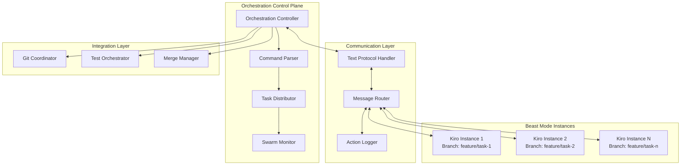

# Multi-Instance Kiro Orchestration System Design

## Overview

The Multi-Instance Kiro Orchestration System implements a distributed Beast Mode runtime that coordinates multiple Kiro IDE instances across different branches, machines, and cloud environments. The system uses text-based communication with human-readable structured actions, enabling instant extensibility and debugging capabilities while maintaining systematic Beast Mode principles.

The system is built using Python 3.9+ technology stack with pyproject.toml configuration, following systematic PDCA methodology and model-driven decision making. All components inherit from ReflectiveModule pattern and maintain >90% test coverage (DR8 compliance) for production readiness.

## Architecture

### High-Level Architecture



### Core Components

#### 1. Orchestration Controller
- **Purpose**: Central coordination hub for distributed Beast Mode operations
- **Responsibilities**: 
  - Launch and manage multiple Kiro instances
  - Coordinate task distribution and execution
  - Monitor swarm health and performance
  - Handle failure recovery and load balancing

#### 2. Text Protocol Handler
- **Purpose**: Process human-readable structured action commands
- **Command Format**: `<verb> <noun> [modifiers] [parameters]`
- **Examples**:
  - `run task abc beast mode`
  - `stop all running threads`
  - `git sync upstream`
  - `status swarm health`
  - `scale instances 5`

#### 3. Task Distributor
- **Purpose**: Intelligent task assignment across Beast Mode instances
- **Algorithm**: Dependency-aware scheduling with load balancing
- **Capabilities**:
  - Parse task dependencies from spec files
  - Optimize parallel execution groups
  - Handle dynamic rebalancing

#### 4. Swarm Monitor
- **Purpose**: Real-time monitoring and observability
- **Metrics**: Instance health, task progress, resource utilization
- **Alerting**: Intelligent failure detection and recovery suggestions

## Components and Interfaces

### Text-Based Communication Protocol

#### Command Structure
```
<verb> <noun> [modifiers] [parameters]

Examples:
- run task user-auth beast-mode
- stop instance kiro-3 graceful
- git sync branch feature/parallel-dev
- status swarm detailed
- scale up instances 3
- merge completed branches conflict-resolve
```

#### Message Format
```python
@dataclass
class StructuredAction:
    verb: str           # run, stop, sync, status, scale, merge
    noun: str           # task, instance, branch, swarm, instances, branches
    modifiers: List[str] # beast-mode, graceful, detailed, conflict-resolve
    parameters: Dict[str, Any]  # Additional context
    timestamp: datetime
    source_instance: str
    correlation_id: str
```

#### Protocol Handler Interface
```python
class TextProtocolHandler(ReflectiveModule):
    def parse_command(self, text: str) -> StructuredAction:
        """Parse human-readable text into structured action"""
        
    def execute_action(self, action: StructuredAction) -> ActionResult:
        """Execute structured action and return result"""
        
    def format_response(self, result: ActionResult) -> str:
        """Format result as human-readable text"""
        
    def validate_command(self, action: StructuredAction) -> ValidationResult:
        """Validate command syntax and permissions"""
```

### Orchestration Controller

#### Core Interface
```python
class OrchestrationController(ReflectiveModule):
    def launch_swarm(self, config: SwarmConfig) -> SwarmInstance:
        """Launch distributed Beast Mode swarm"""
        
    def distribute_tasks(self, tasks: List[Task]) -> DistributionPlan:
        """Create optimal task distribution plan"""
        
    def monitor_swarm(self) -> SwarmStatus:
        """Get real-time swarm health and progress"""
        
    def handle_failure(self, failure: InstanceFailure) -> RecoveryPlan:
        """Generate recovery plan for failed instances"""
        
    def integrate_results(self) -> IntegrationReport:
        """Systematically integrate completed work"""
```

#### Swarm Configuration
```python
@dataclass
class SwarmConfig:
    instance_count: int
    resource_limits: ResourceLimits
    deployment_targets: List[DeploymentTarget]
    task_distribution_strategy: DistributionStrategy
    communication_protocol: ProtocolConfig
    integration_policy: IntegrationPolicy
```

### Beast Mode Instance Management

#### Instance Controller
```python
class InstanceController(ReflectiveModule):
    def create_instance(self, config: InstanceConfig) -> KiroInstance:
        """Create isolated Kiro instance with dedicated workspace and branch"""
        
    def create_worktree(self, target_path: Path, branch: str) -> WorktreeInfo:
        """Create git worktree for efficient workspace isolation without full clone"""
        
    def assign_tasks(self, instance: KiroInstance, tasks: List[Task]) -> None:
        """Assign task set to specific instance in its isolated workspace"""
        
    def monitor_instance(self, instance: KiroInstance) -> InstanceStatus:
        """Monitor instance health and progress in its workspace"""
        
    def terminate_instance(self, instance: KiroInstance, mode: str) -> None:
        """Gracefully terminate instance and optionally cleanup workspace"""
        
    def launch_ide_window(self, instance: KiroInstance) -> IDEWindow:
        """Launch color-coded IDE window with Peacock theme in instance workspace"""
        
    def get_agent_color_mapping(self) -> Dict[str, str]:
        """Get current agent-to-color mapping for visual identification"""
```

#### Workspace Manager
```python
class WorkspaceManager(ReflectiveModule):
    def create_worktree_workspace(self, instance_id: str, branch_name: str) -> Path:
        """Create isolated workspace using git worktree for efficient isolation"""
        
    def add_git_worktree(self, worktree_path: Path, branch: str) -> WorktreeInfo:
        """Add git worktree for branch-specific isolated workspace"""
        
    def setup_workspace_environment(self, workspace_path: Path, config: InstanceConfig) -> None:
        """Configure workspace environment for worktree-based instance isolation"""
        
    def cleanup_worktree(self, workspace_path: Path, preserve_results: bool = True) -> None:
        """Clean up git worktree, optionally preserving results"""
        
    def sync_worktree_changes(self, workspace_path: Path, target_branch: str) -> SyncResult:
        """Sync worktree changes using git operations"""

#### IDE Window Manager
```python
class IDEWindowManager(ReflectiveModule):
    def assign_peacock_color(self, instance_id: str) -> PeacockTheme:
        """Assign unique Peacock color theme to instance"""
        
    def launch_colored_ide(self, workspace_path: Path, theme: PeacockTheme) -> IDEWindow:
        """Launch IDE window with specific color theme in isolated workspace"""
        
    def log_color_mapping(self, instance_id: str, color: str, workspace: str, tasks: List[str]) -> None:
        """Log agent color mapping with workspace information for tracking"""
        
    def get_visual_status(self) -> Dict[str, AgentVisualStatus]:
        """Get visual status of all color-coded agents and their workspaces"""
```

#### Instance Isolation
```python
@dataclass
class InstanceConfig:
    instance_id: str
    branch_name: str
    workspace_path: Path  # Unique workspace directory for this instance
    source_repository: str  # Original repository to clone from
    resource_allocation: ResourceAllocation
    task_assignments: List[Task]
    communication_endpoint: str
    isolation_level: IsolationLevel
    peacock_theme: PeacockTheme
    visual_identifier: str

@dataclass
class PeacockTheme:
    color_name: str
    primary_color: str
    accent_color: str
    theme_id: str

@dataclass
class IDEWindow:
    window_id: str
    instance_id: str
    peacock_theme: PeacockTheme
    workspace_path: Path
    process_id: int
    launch_timestamp: datetime

@dataclass
class WorktreeInfo:
    workspace_path: Path
    branch_name: str
    worktree_id: str
    creation_timestamp: datetime
    shared_git_dir: Path
    is_detached: bool

@dataclass
class AgentVisualStatus:
    instance_id: str
    color_name: str
    workspace_path: Path
    window_status: str  # active, minimized, closed
    current_tasks: List[str]
    last_activity: datetime
    workspace_sync_status: str  # synced, modified, conflict
```

## Data Models

### Core Domain Models

#### Task Representation
```python
@dataclass
class Task:
    id: str
    description: str
    requirements: List[str]  # References to requirement IDs
    dependencies: List[str]  # Task IDs this task depends on
    estimated_duration: timedelta
    complexity_score: float
    required_capabilities: List[str]
    acceptance_criteria: List[str]
```

#### Swarm State
```python
@dataclass
class SwarmState:
    instances: Dict[str, KiroInstance]
    task_assignments: Dict[str, List[Task]]
    execution_status: Dict[str, TaskStatus]
    communication_log: List[StructuredAction]
    performance_metrics: SwarmMetrics
    integration_status: IntegrationStatus
```

#### Communication Models
```python
@dataclass
class ActionResult:
    success: bool
    message: str
    data: Dict[str, Any]
    execution_time: timedelta
    side_effects: List[str]
```

## Error Handling

### Failure Categories

#### Instance Failures
- **Detection**: Health check timeouts, communication failures
- **Recovery**: Automatic restart, task reassignment, graceful degradation
- **Commands**: `restart instance kiro-3`, `reassign tasks from kiro-3`

#### Communication Failures
- **Detection**: Message delivery failures, protocol errors
- **Recovery**: Automatic retry, alternative routing, fallback protocols
- **Commands**: `retry failed messages`, `switch protocol backup`

#### Integration Conflicts
- **Detection**: Merge conflicts, test failures, quality gate violations
- **Recovery**: Intelligent conflict resolution, rollback mechanisms
- **Commands**: `resolve conflicts auto`, `rollback integration batch-5`

### Error Recovery Protocol
```python
class ErrorRecoveryManager(ReflectiveModule):
    def detect_failure(self, instance: KiroInstance) -> FailureType:
        """Classify and categorize failure"""
        
    def generate_recovery_plan(self, failure: FailureType) -> RecoveryPlan:
        """Create systematic recovery strategy"""
        
    def execute_recovery(self, plan: RecoveryPlan) -> RecoveryResult:
        """Execute recovery with monitoring"""
        
    def learn_from_failure(self, failure: FailureType, recovery: RecoveryResult) -> None:
        """Update failure patterns and improve recovery strategies"""
```

## Testing Strategy

### Multi-Level Testing Approach

#### Unit Testing
- **Text Protocol Parser**: Command parsing accuracy and edge cases
- **Task Distributor**: Dependency resolution and load balancing algorithms
- **Instance Controller**: Isolation and resource management
- **Coverage Target**: >90% (DR8 compliance)

#### Integration Testing
- **Swarm Coordination**: Multi-instance communication and synchronization
- **Git Integration**: Branch management and merge conflict resolution
- **Failure Recovery**: Simulated failures and recovery mechanisms

#### End-to-End Testing
- **Distributed Scenarios**: Full swarm deployment across multiple environments
- **Performance Testing**: Scalability and resource utilization under load
- **Chaos Engineering**: Resilience testing with random failures

#### Test Command Protocol
```bash
# Test text protocol parsing
test protocol parse "run task abc beast mode"

# Test swarm coordination
test swarm launch instances=3 tasks=sample-spec

# Test failure recovery
test failure simulate instance-crash recovery-time

# Test integration scenarios
test integration merge-conflicts resolution-strategy
```

### Testing Infrastructure
```python
class SwarmTestFramework(ReflectiveModule):
    def create_test_swarm(self, config: TestSwarmConfig) -> TestSwarm:
        """Create isolated test environment"""
        
    def simulate_failure(self, failure_type: FailureType) -> None:
        """Inject controlled failures for testing"""
        
    def validate_recovery(self, expected: RecoveryExpectation) -> ValidationResult:
        """Validate recovery behavior matches expectations"""
        
    def measure_performance(self, scenario: TestScenario) -> PerformanceMetrics:
        """Measure swarm performance under test conditions"""
```

## Implementation Considerations

### Scalability Design
- **Horizontal Scaling**: Dynamic instance provisioning based on workload
- **Resource Optimization**: Intelligent resource allocation and load balancing
- **Network Efficiency**: Optimized text protocol with compression and batching

### Security Framework
- **Authentication**: Mutual TLS for inter-instance communication
- **Authorization**: Role-based access control for swarm operations
- **Audit Trail**: Comprehensive logging of all structured actions

### Monitoring and Observability
- **Distributed Tracing**: Correlation IDs across all swarm operations
- **Real-time Dashboards**: Swarm health, task progress, resource utilization
- **Intelligent Alerting**: Pattern-based anomaly detection and automated responses

### Configuration Management
- **Centralized Config**: Real-time configuration updates across swarm
- **Feature Flags**: Runtime behavior control without redeployment
- **Environment Adaptation**: Automatic configuration for different deployment targets

### Technology Stack and Quality Standards

#### Core Technology Requirements
- **Language**: Python 3.9+ with full compatibility across 3.9, 3.10, 3.11, 3.12
- **Build System**: Hatchling with pyproject.toml configuration
- **Package Manager**: uv (preferred) with pip fallback
- **Testing Framework**: pytest with asyncio, mock, timeout, and coverage plugins

#### Communication Infrastructure
- **Current**: Spore-based file communication for proof-of-concept and discovery
- **Production**: Scalable pub/sub message bus (Redis/RabbitMQ/Kafka/NATS) based on usage patterns
- **Message Format**: StructuredAction/ActionResult models (compatible across both systems)
- **Fallback**: Automatic degradation from message bus to spores for resilience

#### Quality Assurance Standards
- **Test Coverage**: >90% coverage requirement (DR8 compliance)
- **Code Quality**: Black formatting (88 char line length), Ruff linting, MyPy type checking
- **Architecture Pattern**: All modules inherit from ReflectiveModule with health monitoring
- **Methodology**: Systematic PDCA cycles over ad-hoc approaches
- **Decision Making**: Model-driven decisions using project registry consultation

#### Development Dependencies
```python
# Core framework dependencies
pydantic>=2.0.0      # Data validation and serialization
click>=8.0.0         # Command-line interface framework
jinja2>=3.1.0        # Template engine for code generation
pyyaml>=6.0.0        # YAML configuration parsing

# Communication (production options)
redis>=4.0.0         # Redis pub/sub option
pika>=1.3.0          # RabbitMQ option  
kafka-python>=2.0.0  # Apache Kafka option
nats-py>=2.0.0       # NATS option

# Testing and quality
pytest>=7.0.0        # Testing framework
black>=23.0.0        # Code formatting
ruff>=0.1.0          # Fast Python linter
mypy>=1.0.0          # Static type checking
```

#### Message Bus Selection Criteria
Based on spore-based discovery, the system will evaluate:
- **Message Volume**: Messages per second across all instances
- **Latency Requirements**: P95 latency for command-response cycles
- **Reliability Needs**: Durability and delivery guarantee requirements
- **Scaling Patterns**: Horizontal scaling and multi-region deployment needs
- **Operational Complexity**: Deployment, monitoring, and maintenance overhead

This design provides a comprehensive foundation for implementing the revolutionary Multi-Instance Kiro Orchestration System with text-based communication, enabling distributed Beast Mode swarms to attack complex problems with systematic precision and human-readable coordination protocols.