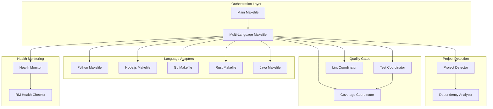

# Multi-Language Build Orchestration Design

## Overview

The Multi-Language Build Orchestration System provides unified build, test, and quality gate coordination across heterogeneous technology stacks. The system uses Make as the orchestration layer with modular makefiles for each language, enabling systematic development workflows while preserving language-specific optimizations.

**Architecture Pattern:** Modular Makefile Architecture with Language-Specific Adapters
**Technology Stack:** GNU Make with language-specific toolchain integration
**Deployment Model:** Development-time orchestration with CI/CD integration support

## Architecture

### High-Level Architecture



### Makefile Architecture

The system follows a hierarchical makefile structure:

1. **Main Makefile**: Entry point with high-level targets
2. **Multi-Language Makefile**: Core orchestration logic
3. **Language-Specific Makefiles**: Specialized build logic per language
4. **Utility Makefiles**: Shared utilities (colors, testing, quality)

## Components and Interfaces

### Core Components

#### Project Detector
```makefile
# Automatic project detection functions
define detect_python_projects
$(shell find . -name "pyproject.toml" -o -name "requirements.txt" | grep -v ".venv" | xargs dirname | sort -u)
endef

define detect_node_projects  
$(shell find . -name "package.json" | grep -v "node_modules" | xargs dirname | sort -u)
endef

define detect_go_projects
$(shell find . -name "go.mod" | xargs dirname | sort -u)
endef
```

#### Language Adapter Interface
```makefile
# Standard interface that each language adapter must implement
.PHONY: build-$(LANG) test-$(LANG) lint-$(LANG) clean-$(LANG) install-$(LANG) health-$(LANG)

# Each language makefile must provide:
build-$(LANG):     # Build all projects for this language
test-$(LANG):      # Run tests with >90% coverage
lint-$(LANG):      # Run linting and formatting
clean-$(LANG):     # Clean build artifacts
install-$(LANG):   # Install dependencies
health-$(LANG):    # Check service health (RM pattern)
```

#### Quality Gate Coordinator
```makefile
# Unified quality gate enforcement
define enforce_coverage_threshold
@echo "Enforcing >90% coverage for $(1)"
@if [ "$(2)" -lt 90 ]; then \
    echo "❌ Coverage $(2)% below 90% threshold for $(1)"; \
    exit 1; \
else \
    echo "✅ Coverage $(2)% meets 90% threshold for $(1)"; \
fi
endef
```

### Language-Specific Implementations

#### Python Adapter (makefiles/python.mk)
```makefile
PYTHON_PROJECTS := $(call detect_python_projects)

build-python:
	@echo "🐍 Building Python projects..."
	@for project in $(PYTHON_PROJECTS); do \
		echo "Building $$project"; \
		cd $$project && uv pip install -e . && cd $(ROOT_DIR); \
	done

test-python:
	@echo "🧪 Testing Python projects (>90% coverage)..."
	@for project in $(PYTHON_PROJECTS); do \
		echo "Testing $$project"; \
		cd $$project && \
		coverage_pct=$$(pytest --cov=src --cov-report=term-missing --cov-fail-under=90 | grep TOTAL | awk '{print $$4}' | sed 's/%//'); \
		$(call enforce_coverage_threshold,$$project,$$coverage_pct) && \
		cd $(ROOT_DIR); \
	done

lint-python:
	@echo "🔍 Linting Python projects..."
	@for project in $(PYTHON_PROJECTS); do \
		cd $$project && \
		ruff check . --fix && \
		black . --line-length 88 && \
		mypy src/ --strict && \
		cd $(ROOT_DIR); \
	done
```

#### Node.js Adapter (makefiles/nodejs.mk)
```makefile
NODE_PROJECTS := $(call detect_node_projects)

build-nodejs:
	@echo "📦 Building Node.js projects..."
	@for project in $(NODE_PROJECTS); do \
		echo "Building $$project"; \
		cd $$project && npm install && npm run build && cd $(ROOT_DIR); \
	done

test-nodejs:
	@echo "🧪 Testing Node.js projects (>90% coverage)..."
	@for project in $(NODE_PROJECTS); do \
		echo "Testing $$project"; \
		cd $$project && \
		npm test -- --coverage --coverageThreshold='{"global":{"branches":90,"functions":90,"lines":90,"statements":90}}' && \
		cd $(ROOT_DIR); \
	done

lint-nodejs:
	@echo "🔍 Linting Node.js projects..."
	@for project in $(NODE_PROJECTS); do \
		cd $$project && \
		eslint . --fix && \
		prettier --write . && \
		tsc --noEmit --strict && \
		cd $(ROOT_DIR); \
	done
```

## Data Models

### Project Configuration
```makefile
# Project metadata structure
define PROJECT_CONFIG
{
  "name": "$(1)",
  "language": "$(2)", 
  "path": "$(3)",
  "build_command": "$(4)",
  "test_command": "$(5)",
  "lint_command": "$(6)",
  "health_endpoint": "$(7)"
}
endef
```

### Build Status Tracking
```makefile
# Build status tracking
BUILD_STATUS_FILE := .build-status.json
TEST_STATUS_FILE := .test-status.json
LINT_STATUS_FILE := .lint-status.json

define update_build_status
@echo '{"project": "$(1)", "status": "$(2)", "timestamp": "'$$(date -Iseconds)'", "duration": "$(3)"}' >> $(BUILD_STATUS_FILE)
endef
```

### Health Check Configuration
```makefile
# Reflective Module health check configuration
HEALTH_ENDPOINTS := \
	python:http://localhost:8000/health \
	nodejs:http://localhost:3000/health \
	go:http://localhost:8080/health \
	rust:http://localhost:8081/health \
	java:http://localhost:8082/health

define check_service_health
@echo "Checking $(1) service health..."
@curl -s -f $(2) > /dev/null && echo "✅ $(1) service healthy" || echo "❌ $(1) service unhealthy"
endef
```

## Error Handling

### Error Categories

#### Build Errors
```makefile
define handle_build_error
@echo "❌ Build failed for $(1)"
@echo "Error: $(2)"
@echo "Troubleshooting:"
@echo "  1. Check dependencies: make install-$(3)"
@echo "  2. Verify configuration in $(1)"
@echo "  3. Check build logs for specific errors"
@$(call update_build_status,$(1),failed,$(4))
endef
```

#### Test Failures
```makefile
define handle_test_failure
@echo "❌ Tests failed for $(1)"
@echo "Coverage: $(2)% (required: 90%)"
@echo "Actions needed:"
@echo "  1. Add tests to increase coverage"
@echo "  2. Fix failing tests"
@echo "  3. Review test configuration"
@exit 1
endef
```

#### Dependency Issues
```makefile
define handle_dependency_error
@echo "❌ Dependency installation failed for $(1)"
@echo "Possible solutions:"
@echo "  1. Check network connectivity"
@echo "  2. Verify package manager installation"
@echo "  3. Clear dependency cache"
@echo "  4. Check for conflicting versions"
endef
```

## Testing Strategy

### Multi-Language Test Coordination

#### Test Execution Flow
```makefile
test-all: validate-test-setup
	@echo "🧪 Running tests across all languages..."
	@$(MAKE) test-python || exit 1
	@$(MAKE) test-nodejs || exit 1  
	@$(MAKE) test-go || exit 1
	@$(MAKE) test-rust || exit 1
	@$(MAKE) test-java || exit 1
	@echo "✅ All tests passed with >90% coverage"

validate-test-setup:
	@echo "🔍 Validating test environment..."
	@command -v pytest >/dev/null || (echo "❌ pytest not found" && exit 1)
	@command -v npm >/dev/null || (echo "❌ npm not found" && exit 1)
	@command -v go >/dev/null || (echo "❌ go not found" && exit 1)
```

#### Coverage Aggregation
```makefile
coverage-report:
	@echo "📊 Generating cross-language coverage report..."
	@echo "Language Coverage Summary:"
	@echo "========================="
	@for lang in python nodejs go rust java; do \
		if [ -f ".coverage-$$lang.json" ]; then \
			coverage=$$(cat .coverage-$$lang.json | jq -r '.total'); \
			echo "$$lang: $$coverage%"; \
		fi; \
	done
```

## Performance Optimizations

### Parallel Execution
```makefile
# Parallel build execution
PARALLEL_JOBS := $(shell nproc)

build-all-parallel:
	@echo "🚀 Building all projects in parallel ($(PARALLEL_JOBS) jobs)..."
	@$(MAKE) -j$(PARALLEL_JOBS) build-python build-nodejs build-go build-rust build-java

# Dependency-aware parallel execution
build-with-dependencies:
	@echo "📊 Analyzing build dependencies..."
	@$(MAKE) build-foundation-services
	@$(MAKE) -j$(PARALLEL_JOBS) build-application-services
	@$(MAKE) build-integration-services
```

### Caching Strategy
```makefile
# Build artifact caching
CACHE_DIR := .build-cache

define cache_build_artifacts
@mkdir -p $(CACHE_DIR)/$(1)
@cp -r $(2)/dist $(CACHE_DIR)/$(1)/ 2>/dev/null || true
@cp -r $(2)/build $(CACHE_DIR)/$(1)/ 2>/dev/null || true
endef

define restore_build_artifacts
@if [ -d "$(CACHE_DIR)/$(1)" ]; then \
	echo "♻️ Restoring cached artifacts for $(1)"; \
	cp -r $(CACHE_DIR)/$(1)/* $(2)/ 2>/dev/null || true; \
fi
endef
```

## Integration Points

### CI/CD Integration
```makefile
# CI/CD pipeline integration
ci-build: install-all lint-all test-all build-all
	@echo "✅ CI build completed successfully"

ci-test: test-all coverage-report
	@echo "✅ CI tests completed with coverage report"

ci-deploy: ci-build health-check-all
	@echo "✅ CI deployment ready"
```

### Health Monitoring Integration
```makefile
# Reflective Module health monitoring
health-all:
	@echo "🏥 Checking health of all services..."
	@for endpoint in $(HEALTH_ENDPOINTS); do \
		service=$$(echo $$endpoint | cut -d: -f1); \
		url=$$(echo $$endpoint | cut -d: -f2-); \
		$(call check_service_health,$$service,$$url); \
	done

# Integration with monitoring systems
export-health-metrics:
	@echo "📊 Exporting health metrics..."
	@$(MAKE) health-all > health-status.json
	@echo "Health metrics exported to health-status.json"
```

### Dependency Integration
```makefile
# Integration with existing specs
integrate-document-validation:
	@echo "🔗 Integrating Document Validation Service (Node.js)..."
	@$(MAKE) build-nodejs test-nodejs
	@curl -s http://localhost:3000/health || echo "Service not running"

integrate-beast-mode:
	@echo "🔗 Integrating Beast Mode Framework (Python)..."
	@$(MAKE) build-python test-python
	@python -c "from src.beast_mode.core.health_monitor import HealthMonitor; print('✅ Beast Mode integration verified')"
```