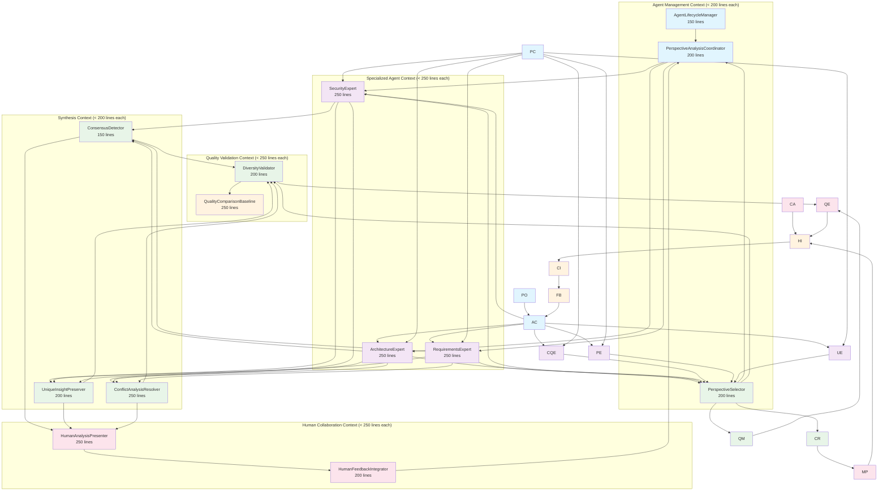

# Multi-Perspective Ghostbusters Design

## Overview

The Multi-Perspective Ghostbusters system implements "Diversity is the only free lunch" through a sophisticated orchestration framework that coordinates multiple specialized LLM agents to analyze content from diverse perspectives. The system synthesizes these viewpoints while preserving unique insights, demonstrating measurable superiority over single-perspective analysis.

**Design Principles:**
- **Diversity as Intelligence Amplifier**: Multiple perspectives provide exponentially richer analysis than single perspectives
- **Preserve Unique Insights**: Synthesis maintains the distinctive contributions from each perspective
- **Disagreement as Intelligence**: Conflicts between perspectives are valuable data, not problems to eliminate
- **Human-AI Symbiosis**: AI agents amplify human creativity rather than replace human judgment
- **Measurable Superiority**: Quantifiable evidence that diverse perspectives provide superior analysis

## Architecture

### High-Level RM-DDD Architecture



### RM-DDD Component Architecture

Each component inherits from ReflectiveModule and automatically generates CLI interfaces through introspection. The base class discovers method signatures, parameters, and return types to create comprehensive CLI commands without manual coding.

**Dynamic CLI Generation Features:**
- **Automatic Command Discovery**: Each public method becomes a CLI command
- **Parameter Introspection**: Method signatures generate argument parsers
- **Type Safety**: Parameter types are preserved in CLI validation
- **Help Generation**: Docstrings become command help text
- **Health Monitoring**: Built-in health check and status commands
- **Lazy Instantiation**: CLIs are generated on-demand, not pre-built

### Example CLI Generation

For a component like `AgentLifecycleManager` with methods:
```python
def register_agent(self, agent: SpecializedAgent, capabilities: AgentCapabilities) -> AgentRegistration:
    """Register new specialized agent with capability validation"""

def track_agent_health(self, agent_pool: List[SpecializedAgent]) -> AgentHealthStatus:
    """Track agent availability and health status"""
```

The ReflectiveModule automatically generates CLI commands:
```bash
# Generated CLI commands
agent-lifecycle-manager register-agent --agent <agent> --capabilities <capabilities>
agent-lifecycle-manager track-agent-health --agent-pool <pool>
agent-lifecycle-manager --health-check
agent-lifecycle-manager --module-info
agent-lifecycle-manager --list-capabilities
```

**CLI Generation Process:**
1. **Method Discovery**: `_discover_capabilities()` uses introspection to find public methods
2. **Signature Analysis**: `inspect.signature()` extracts parameters, types, defaults
3. **Command Generation**: `generate_cli_interface()` creates argparse-based CLI
4. **Dynamic Execution**: CLI routes commands to actual method calls with type validation

## Components and Interfaces

### 1. Perspective Orchestration Components

#### PerspectiveOrchestrator

```python
class PerspectiveOrchestrator(ReflectiveModule):
    """Orchestrates multi-perspective analysis with diversity optimization"""
    
    def orchestrate_analysis(
        self,
        content: AnalysisContent,
        perspective_config: PerspectiveConfig,
        diversity_requirements: DiversityRequirements
    ) -> MultiPerspectiveAnalysis:
        """
        Orchestrate diverse perspective analysis with optimal agent selection.
        
        Args:
            content: Content to analyze from multiple perspectives
            perspective_config: Configuration for which perspectives to engage
            diversity_requirements: Requirements for diversity optimization
            
        Returns:
            MultiPerspectiveAnalysis with synthesized insights and conflict analysis
            
        Raises:
            OrchestrationError: When agent coordination fails
            DiversityError: When insufficient diversity is achieved
        """
        
    def optimize_perspective_mix(
        self,
        content_type: ContentType,
        historical_performance: Dict[str, float]
    ) -> OptimalPerspectiveMix:
        """Optimize agent selection for maximum diversity and quality"""
        
    def measure_diversity_value(
        self,
        multi_perspective_result: MultiPerspectiveAnalysis,
        single_perspective_baseline: SinglePerspectiveAnalysis
    ) -> DiversityValueMetrics:
        """Measure the actual value provided by diverse perspectives"""
```

#### AgentCoordinator

```python
class AgentCoordinator(ReflectiveModule):
    """Coordinates specialized agent lifecycle and analysis execution"""
    
    def coordinate_parallel_analysis(
        self,
        agents: List[SpecializedAgent],
        content: AnalysisContent,
        isolation_config: IsolationConfig
    ) -> List[PerspectiveResult]:
        """
        Coordinate parallel analysis ensuring agent isolation.
        
        Each agent analyzes independently without knowledge of other analyses
        to preserve the authenticity of their unique perspectives.
        """
        
    def register_specialized_agent(
        self,
        agent: SpecializedAgent,
        capabilities: AgentCapabilities,
        perspective_profile: PerspectiveProfile
    ) -> AgentRegistration:
        """Register new specialized agent with capability validation"""
        
    def validate_agent_diversity(
        self,
        agent_pool: List[SpecializedAgent]
    ) -> DiversityValidation:
        """Validate that agent pool provides sufficient diversity"""
```

### 2. Specialized Agent Pool

#### Base SpecializedAgent Interface

```python
class SpecializedAgent(ABC, ReflectiveModule):
    """Base interface for all specialized perspective agents"""
    
    @abstractmethod
    def analyze_from_perspective(
        self,
        content: AnalysisContent,
        analysis_context: AnalysisContext
    ) -> PerspectiveResult:
        """
        Analyze content from this agent's specialized perspective.
        
        Must provide:
        - Unique insights from this perspective
        - Confidence scores with reasoning
        - Areas of uncertainty or concern
        - Recommendations specific to this domain
        """
        
    @abstractmethod
    def get_perspective_profile(self) -> PerspectiveProfile:
        """Get profile describing this agent's unique perspective"""
        
    @abstractmethod
    def validate_perspective_authenticity(
        self,
        result: PerspectiveResult
    ) -> AuthenticityValidation:
        """Validate that analysis reflects authentic perspective"""
```

#### SecurityExpert

```python
class SecurityExpert(SpecializedAgent):
    """Security-focused perspective agent"""
    
    def analyze_from_perspective(
        self,
        content: AnalysisContent,
        analysis_context: AnalysisContext
    ) -> PerspectiveResult:
        """
        Analyze from security perspective focusing on:
        - Vulnerability identification and risk assessment
        - Security architecture and design patterns
        - Compliance and regulatory considerations
        - Threat modeling and attack surface analysis
        """
        
    def identify_security_concerns(
        self,
        content: AnalysisContent
    ) -> List[SecurityConcern]:
        """Identify security-specific concerns and vulnerabilities"""
        
    def assess_security_risk(
        self,
        concerns: List[SecurityConcern]
    ) -> SecurityRiskAssessment:
        """Assess overall security risk with mitigation recommendations"""
```

#### ArchitectureExpert

```python
class ArchitectureExpert(SpecializedAgent):
    """Architecture-focused perspective agent"""
    
    def analyze_from_perspective(
        self,
        content: AnalysisContent,
        analysis_context: AnalysisContext
    ) -> PerspectiveResult:
        """
        Analyze from architecture perspective focusing on:
        - System design patterns and architectural quality
        - Scalability and maintainability considerations
        - Component relationships and dependencies
        - Design principle adherence and technical debt
        """
        
    def evaluate_architectural_quality(
        self,
        content: AnalysisContent
    ) -> ArchitecturalQualityAssessment:
        """Evaluate architectural quality and design patterns"""
        
    def identify_design_issues(
        self,
        content: AnalysisContent
    ) -> List[DesignIssue]:
        """Identify architectural issues and improvement opportunities"""
```

#### RequirementsExpert

```python
class RequirementsExpert(SpecializedAgent):
    """Requirements-focused perspective agent"""
    
    def analyze_from_perspective(
        self,
        content: AnalysisContent,
        analysis_context: AnalysisContext
    ) -> PerspectiveResult:
        """
        Analyze from requirements perspective focusing on:
        - Requirements completeness and clarity
        - Traceability and validation criteria
        - Stakeholder needs and acceptance criteria
        - Requirements conflicts and gaps
        """
        
    def validate_requirements_coverage(
        self,
        content: AnalysisContent
    ) -> RequirementsCoverage:
        """Validate requirements coverage and completeness"""
        
    def identify_requirements_gaps(
        self,
        content: AnalysisContent
    ) -> List[RequirementsGap]:
        """Identify gaps and conflicts in requirements"""
```

### 3. Synthesis and Analysis Components

#### PerspectiveSynthesizer

```python
class PerspectiveSynthesizer(ReflectiveModule):
    """Synthesizes diverse perspectives while preserving unique insights"""
    
    def synthesize_perspectives(
        self,
        perspective_results: List[PerspectiveResult],
        synthesis_strategy: SynthesisStrategy
    ) -> SynthesizedIntelligence:
        """
        Synthesize diverse perspectives preserving unique insights.
        
        Strategy:
        1. Identify areas of consensus with high confidence
        2. Preserve unique insights that only one perspective provides
        3. Highlight valuable disagreements as intelligence
        4. Quantify the diversity benefit over single perspectives
        """
        
    def identify_consensus_areas(
        self,
        perspectives: List[PerspectiveResult]
    ) -> List[ConsensusArea]:
        """Identify areas where multiple perspectives agree"""
        
    def preserve_unique_insights(
        self,
        perspectives: List[PerspectiveResult]
    ) -> List[UniqueInsight]:
        """Identify and preserve insights unique to specific perspectives"""
        
    def quantify_synthesis_quality(
        self,
        synthesized: SynthesizedIntelligence,
        original_perspectives: List[PerspectiveResult]
    ) -> SynthesisQualityMetrics:
        """Measure quality of synthesis vs original perspectives"""
```

#### ConflictResolver

```python
class ConflictResolver(ReflectiveModule):
    """Handles disagreements between perspectives as valuable intelligence"""
    
    def analyze_perspective_conflicts(
        self,
        conflicting_perspectives: List[PerspectiveResult]
    ) -> ConflictAnalysis:
        """
        Analyze conflicts between perspectives as valuable intelligence.
        
        Approach:
        - Identify root causes of disagreement
        - Assess validity of each conflicting perspective
        - Determine if conflicts reveal important insights
        - Provide structured conflict resolution options
        """
        
    def resolve_conflicts_systematically(
        self,
        conflicts: List[PerspectiveConflict],
        resolution_strategy: ConflictResolutionStrategy
    ) -> ConflictResolution:
        """Systematically resolve conflicts with confidence scoring"""
        
    def preserve_valuable_disagreements(
        self,
        conflicts: List[PerspectiveConflict]
    ) -> List[ValuableDisagreement]:
        """Identify disagreements that provide valuable intelligence"""
```

#### DiversityValidator

```python
class DiversityValidator(ReflectiveModule):
    """Validates and measures the value of diverse perspectives"""
    
    def validate_diversity_benefit(
        self,
        multi_perspective_analysis: MultiPerspectiveAnalysis,
        single_perspective_baselines: List[SinglePerspectiveAnalysis]
    ) -> DiversityBenefitValidation:
        """
        Validate that diverse perspectives provide measurable benefits.
        
        Metrics:
        - Coverage: Issues identified by multiple vs single perspectives
        - Accuracy: Validation of insights against ground truth
        - Completeness: Comprehensive analysis vs partial analysis
        - Quality: Overall analysis quality improvement
        """
        
    def measure_perspective_uniqueness(
        self,
        perspectives: List[PerspectiveResult]
    ) -> PerspectiveUniquenessMetrics:
        """Measure how much each perspective contributes unique value"""
        
    def optimize_diversity_configuration(
        self,
        historical_performance: Dict[str, DiversityMetrics],
        content_characteristics: ContentCharacteristics
    ) -> OptimalDiversityConfig:
        """Optimize perspective configuration for maximum diversity benefit"""
```

### 4. Human-AI Collaboration Components

#### HumanInterface

```python
class HumanInterface(ReflectiveModule):
    """Interface for human-AI collaboration and creativity amplification"""
    
    def present_multi_perspective_analysis(
        self,
        analysis: MultiPerspectiveAnalysis,
        presentation_config: PresentationConfig
    ) -> HumanReadableAnalysis:
        """
        Present multi-perspective analysis in human-friendly format.
        
        Features:
        - Clear visualization of different perspectives
        - Highlighted areas of agreement and disagreement
        - Reasoning chains for each perspective
        - Interactive exploration of conflicts and insights
        """
        
    def facilitate_human_input(
        self,
        analysis: MultiPerspectiveAnalysis,
        collaboration_context: CollaborationContext
    ) -> HumanContribution:
        """Facilitate human input to enhance AI analysis"""
        
    def amplify_human_creativity(
        self,
        human_insights: List[HumanInsight],
        ai_perspectives: List[PerspectiveResult]
    ) -> AmplifiedIntelligence:
        """Combine human creativity with AI perspectives for superior results"""
```

#### CollaborationIntelligence

```python
class CollaborationIntelligence(ReflectiveModule):
    """Manages human-AI collaboration to amplify rather than replace human judgment"""
    
    def identify_collaboration_opportunities(
        self,
        analysis: MultiPerspectiveAnalysis,
        human_expertise: HumanExpertiseProfile
    ) -> List[CollaborationOpportunity]:
        """Identify where human input would most enhance AI analysis"""
        
    def integrate_human_feedback(
        self,
        ai_analysis: MultiPerspectiveAnalysis,
        human_feedback: HumanFeedback
    ) -> EnhancedAnalysis:
        """Integrate human feedback to improve analysis quality"""
        
    def measure_collaboration_effectiveness(
        self,
        ai_only_analysis: MultiPerspectiveAnalysis,
        human_enhanced_analysis: EnhancedAnalysis
    ) -> CollaborationEffectivenessMetrics:
        """Measure how human-AI collaboration improves results"""
```

## Data Models

### Core Analysis Models

```python
@dataclass
class PerspectiveResult:
    """Result from a single specialized perspective"""
    perspective_type: PerspectiveType
    agent_id: str
    analysis_timestamp: datetime
    
    # Core analysis content
    insights: List[Insight]
    concerns: List[Concern]
    recommendations: List[Recommendation]
    
    # Confidence and reasoning
    confidence_score: float
    reasoning_chain: List[ReasoningStep]
    uncertainty_areas: List[UncertaintyArea]
    
    # Perspective-specific metadata
    perspective_profile: PerspectiveProfile
    unique_contributions: List[UniqueContribution]
    
@dataclass
class MultiPerspectiveAnalysis:
    """Synthesized analysis from multiple perspectives"""
    analysis_id: str
    content_analyzed: AnalysisContent
    perspectives_engaged: List[PerspectiveType]
    
    # Synthesized intelligence
    consensus_insights: List[ConsensusInsight]
    unique_insights: List[UniqueInsight]
    valuable_disagreements: List[ValuableDisagreement]
    
    # Quality metrics
    diversity_metrics: DiversityMetrics
    synthesis_quality: SynthesisQualityMetrics
    superiority_evidence: SuperiorityEvidence
    
@dataclass
class DiversityMetrics:
    """Metrics measuring the value of diverse perspectives"""
    perspective_uniqueness_scores: Dict[str, float]
    coverage_improvement: float
    accuracy_improvement: float
    completeness_improvement: float
    
    # Evidence of "free lunch"
    single_perspective_baseline: float
    multi_perspective_score: float
    diversity_benefit: float
    
@dataclass
class ConflictAnalysis:
    """Analysis of conflicts between perspectives"""
    conflict_id: str
    conflicting_perspectives: List[PerspectiveType]
    conflict_type: ConflictType
    
    # Conflict details
    disagreement_points: List[DisagreementPoint]
    root_cause_analysis: RootCauseAnalysis
    resolution_options: List[ResolutionOption]
    
    # Intelligence value
    valuable_insights: List[ConflictInsight]
    learning_opportunities: List[LearningOpportunity]
```

### Human-AI Collaboration Models

```python
@dataclass
class HumanContribution:
    """Human input to enhance AI analysis"""
    contributor_id: str
    contribution_timestamp: datetime
    
    # Human insights
    insights: List[HumanInsight]
    corrections: List[AICorrection]
    additional_perspectives: List[AdditionalPerspective]
    
    # Collaboration context
    expertise_areas: List[ExpertiseArea]
    confidence_in_ai: float
    areas_of_disagreement: List[DisagreementArea]
    
@dataclass
class AmplifiedIntelligence:
    """Intelligence amplified through human-AI collaboration"""
    amplification_id: str
    base_ai_analysis: MultiPerspectiveAnalysis
    human_contributions: List[HumanContribution]
    
    # Amplified results
    enhanced_insights: List[EnhancedInsight]
    creative_breakthroughs: List[CreativeBreakthrough]
    validated_ai_insights: List[ValidatedInsight]
    
    # Amplification metrics
    creativity_amplification: float
    accuracy_improvement: float
    completeness_enhancement: float
```

## Error Handling

### Systematic Error Handling for Multi-Perspective Analysis

```python
class MultiPerspectiveError(Exception):
    """Base exception for multi-perspective analysis errors"""
    
    def __init__(self, message: str, perspective_context: Dict[str, Any]):
        super().__init__(message)
        self.perspective_context = perspective_context
        self.timestamp = datetime.now()

class DiversityError(MultiPerspectiveError):
    """Errors related to insufficient diversity or perspective quality"""
    pass

class SynthesisError(MultiPerspectiveError):
    """Errors during perspective synthesis"""
    pass

class CollaborationError(MultiPerspectiveError):
    """Errors in human-AI collaboration"""
    pass

class ErrorRecoveryManager(ReflectiveModule):
    """Manages error recovery for multi-perspective analysis"""
    
    def handle_perspective_failure(
        self,
        failed_perspective: PerspectiveType,
        remaining_perspectives: List[PerspectiveResult]
    ) -> RecoveryStrategy:
        """Handle individual perspective failures gracefully"""
        
    def handle_synthesis_failure(
        self,
        perspectives: List[PerspectiveResult],
        synthesis_error: SynthesisError
    ) -> FallbackSynthesis:
        """Provide fallback synthesis when primary synthesis fails"""
        
    def handle_diversity_insufficiency(
        self,
        current_perspectives: List[PerspectiveResult],
        diversity_requirements: DiversityRequirements
    ) -> DiversityRecovery:
        """Recover when diversity requirements are not met"""
```

## Testing Strategy

### Comprehensive Testing for Multi-Perspective Intelligence

```python
class TestMultiPerspectiveOrchestration:
    """Test multi-perspective orchestration and synthesis"""
    
    def test_perspective_isolation(self):
        """Verify agents analyze independently without cross-contamination"""
        
    def test_diversity_measurement(self):
        """Verify diversity metrics accurately measure perspective uniqueness"""
        
    def test_synthesis_quality(self):
        """Verify synthesis preserves unique insights while finding consensus"""
        
    def test_conflict_resolution(self):
        """Verify conflicts are handled as valuable intelligence"""

class TestDiversityBenefit:
    """Test that diversity actually provides measurable benefits"""
    
    def test_superiority_over_single_perspective(self):
        """Verify multi-perspective analysis outperforms single perspectives"""
        
    def test_free_lunch_validation(self):
        """Verify diversity provides benefits without proportional costs"""
        
    def test_perspective_uniqueness(self):
        """Verify each perspective contributes unique value"""

class TestHumanAICollaboration:
    """Test human-AI collaboration and creativity amplification"""
    
    def test_creativity_amplification(self):
        """Verify human creativity is amplified, not replaced"""
        
    def test_collaboration_effectiveness(self):
        """Verify human-AI collaboration improves results"""
        
    def test_human_agency_preservation(self):
        """Verify humans maintain agency in decision-making"""
```

## Implementation Strategy

### Phase 1: Core Multi-Perspective Framework
1. **Implement Base Infrastructure**: PerspectiveOrchestrator, AgentCoordinator
2. **Create Specialized Agents**: SecurityExpert, ArchitectureExpert, RequirementsExpert
3. **Basic Synthesis**: PerspectiveSynthesizer with simple consensus detection

### Phase 2: Advanced Synthesis and Conflict Resolution
1. **Enhanced Synthesis**: Preserve unique insights, handle valuable disagreements
2. **Conflict Resolution**: ConflictResolver with systematic conflict analysis
3. **Diversity Validation**: DiversityValidator with measurable benefit validation

### Phase 3: Human-AI Collaboration
1. **Human Interface**: HumanInterface for presenting multi-perspective analysis
2. **Collaboration Intelligence**: CollaborationIntelligence for creativity amplification
3. **Feedback Integration**: Learn from human input to improve future analysis

### Phase 4: Optimization and Validation
1. **Performance Optimization**: Optimize perspective selection and synthesis
2. **Quality Validation**: Comprehensive validation of diversity benefits
3. **Production Readiness**: Error handling, monitoring, and scalability

This design implements "Diversity is the only free lunch" by demonstrating that multiple perspectives provide measurably superior analysis compared to any single perspective, while preserving the unique contributions that make diversity valuable.