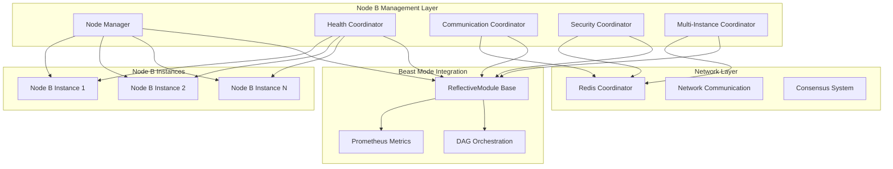

# Node B Management System - Design Document

## Overview

The Node B Management System provides systematic lifecycle management, monitoring, and coordination for Node B instances within the Beast Mode decentralized AI coordination network. This system implements a comprehensive framework for deploying, monitoring, and maintaining autonomous AI coordination nodes that participate in distributed task execution and network consensus through Redis pub/sub channels.

**Design Philosophy**: Build upon existing Beast Mode patterns while providing specialized Node B coordination capabilities. The system follows the ReflectiveModule pattern for observability and integrates seamlessly with the established Redis-based coordination infrastructure.

## Architecture

### High-Level Architecture



### Component Architecture

#### Core Management Components

1. **NodeLifecycleManager** (ReflectiveModule)
   - Handles Node B deployment, startup, shutdown, and restart
   - Validates Redis connectivity before operations
   - Implements exponential backoff for restart attempts
   - Manages graceful shutdown and network notifications

2. **HealthMonitoringCoordinator** (ReflectiveModule)
   - Provides comprehensive health monitoring and diagnostics
   - Exposes standard health endpoints (`/health`, `/ready`, `/metrics`)
   - Tracks performance metrics and resource utilization
   - Generates alerts and diagnostic reports

3. **NetworkCommunicationCoordinator** (ReflectiveModule)
   - Manages Redis pub/sub communication patterns
   - Implements structured message formats and routing
   - Handles network topology changes and adaptation
   - Provides retry logic with backoff strategies

4. **SecurityConfigurationManager** (ReflectiveModule)
   - Manages secure credential handling via environment variables
   - Validates SSL/TLS configurations
   - Implements security policies and audit trails
   - Handles authentication tokens and signatures

5. **MultiInstanceCoordinator** (ReflectiveModule)
   - Coordinates multiple Node B instances
   - Implements load balancing and task distribution
   - Handles instance discovery and failure detection
   - Manages consensus mechanisms for conflict resolution

## Components and Interfaces

### Core Interfaces

#### INodeLifecycle
```python
from abc import ABC, abstractmethod
from typing import Dict, Any, Optional
from enum import Enum

class NodeState(Enum):
    STOPPED = "stopped"
    STARTING = "starting"
    RUNNING = "running"
    STOPPING = "stopping"
    FAILED = "failed"
    RESTARTING = "restarting"

class INodeLifecycle(ABC):
    @abstractmethod
    async def start_node(self, node_id: str, config: Dict[str, Any]) -> bool:
        """Start a Node B instance with given configuration."""
        pass
    
    @abstractmethod
    async def stop_node(self, node_id: str, graceful: bool = True) -> bool:
        """Stop a Node B instance gracefully or forcefully."""
        pass
    
    @abstractmethod
    async def restart_node(self, node_id: str) -> bool:
        """Restart a Node B instance with exponential backoff."""
        pass
    
    @abstractmethod
    async def get_node_state(self, node_id: str) -> NodeState:
        """Get current state of a Node B instance."""
        pass
```

#### IHealthMonitoring
```python
from abc import ABC, abstractmethod
from typing import Dict, Any, List
from dataclasses import dataclass

@dataclass
class HealthMetrics:
    redis_connectivity: bool
    message_processing_rate: float
    response_time_avg: float
    memory_usage_mb: float
    cpu_usage_percent: float
    network_status: str
    last_heartbeat: str

class IHealthMonitoring(ABC):
    @abstractmethod
    async def get_health_status(self, node_id: str) -> HealthMetrics:
        """Get comprehensive health metrics for a node."""
        pass
    
    @abstractmethod
    async def generate_diagnostic_report(self, node_id: str) -> Dict[str, Any]:
        """Generate detailed diagnostic information."""
        pass
    
    @abstractmethod
    async def check_redis_connectivity(self, node_id: str) -> bool:
        """Validate Redis connection health."""
        pass
```

#### INetworkCommunication
```python
from abc import ABC, abstractmethod
from typing import Dict, Any, List, Optional
from dataclasses import dataclass

@dataclass
class NetworkMessage:
    message_id: str
    sender_id: str
    recipient_id: Optional[str]
    message_type: str
    payload: Dict[str, Any]
    timestamp: str
    correlation_id: str

class INetworkCommunication(ABC):
    @abstractmethod
    async def send_message(self, message: NetworkMessage) -> bool:
        """Send a message through the network."""
        pass
    
    @abstractmethod
    async def receive_messages(self, node_id: str) -> List[NetworkMessage]:
        """Receive pending messages for a node."""
        pass
    
    @abstractmethod
    async def participate_in_consensus(self, node_id: str, proposal: Dict[str, Any]) -> bool:
        """Participate in network consensus decision."""
        pass
```

### Integration Interfaces

#### Beast Mode Integration
```python
from src.rm_ddd.core.unified_reflective_module import ReflectiveModule

class NodeBComponent(ReflectiveModule):
    """Base class for all Node B management components."""
    
    def __init__(self, component_name: str):
        super().__init__()
        self.component_name = component_name
        self._setup_prometheus_metrics()
        self._setup_health_endpoints()
    
    def _setup_prometheus_metrics(self):
        """Setup component-specific Prometheus metrics."""
        pass
    
    def _setup_health_endpoints(self):
        """Setup standard health endpoints."""
        pass
```

#### Redis Integration
```python
import redis.asyncio as redis
from typing import Optional

class RedisConnectionManager:
    """Manages Redis connections with proper credential handling."""
    
    def __init__(self):
        self.redis_host = os.getenv('REDIS_HOST', 'localhost')
        self.redis_port = int(os.getenv('REDIS_PORT', '6379'))
        self.redis_password = os.getenv('REDIS_PASSWORD', '')
        
        if not self.redis_password:
            raise ValueError("REDIS_PASSWORD environment variable is required")
    
    async def get_connection(self) -> redis.Redis:
        """Get authenticated Redis connection."""
        return redis.Redis(
            host=self.redis_host,
            port=self.redis_port,
            password=self.redis_password,
            decode_responses=True
        )
```

## Data Models

### Node Configuration Model
```python
from dataclasses import dataclass
from typing import Dict, Any, List, Optional

@dataclass
class NodeBConfiguration:
    """Configuration for a Node B instance."""
    node_id: str
    capabilities: List[str]
    redis_config: Dict[str, Any]
    security_config: Dict[str, Any]
    performance_limits: Dict[str, Any]
    network_settings: Dict[str, Any]
    
    def validate(self) -> bool:
        """Validate configuration completeness and correctness."""
        required_fields = ['node_id', 'capabilities', 'redis_config']
        return all(getattr(self, field) for field in required_fields)
```

### Network State Model
```python
@dataclass
class NetworkTopology:
    """Represents current network topology and node relationships."""
    active_nodes: List[str]
    node_capabilities: Dict[str, List[str]]
    connection_matrix: Dict[str, List[str]]
    consensus_participants: List[str]
    last_updated: str
    
    def get_available_capabilities(self) -> List[str]:
        """Get all capabilities available in the network."""
        all_caps = []
        for caps in self.node_capabilities.values():
            all_caps.extend(caps)
        return list(set(all_caps))
```

### Performance Metrics Model
```python
@dataclass
class NodePerformanceMetrics:
    """Performance and operational metrics for a Node B instance."""
    node_id: str
    uptime_seconds: float
    messages_processed: int
    messages_sent: int
    average_response_time: float
    error_count: int
    memory_usage_mb: float
    cpu_usage_percent: float
    network_latency_ms: float
    last_heartbeat: str
    
    def calculate_health_score(self) -> float:
        """Calculate overall health score (0-100)."""
        # Implementation would consider all metrics
        pass
```

## Error Handling

### Error Classification System

#### Network Errors
```python
class NetworkError(Exception):
    """Base class for network-related errors."""
    pass

class RedisConnectionError(NetworkError):
    """Redis connection failures."""
    pass

class MessageDeliveryError(NetworkError):
    """Message delivery failures."""
    pass

class ConsensusTimeoutError(NetworkError):
    """Consensus participation timeouts."""
    pass
```

#### Node Management Errors
```python
class NodeManagementError(Exception):
    """Base class for node management errors."""
    pass

class NodeStartupError(NodeManagementError):
    """Node startup failures."""
    pass

class NodeShutdownError(NodeManagementError):
    """Node shutdown failures."""
    pass

class ConfigurationError(NodeManagementError):
    """Configuration validation failures."""
    pass
```

### Error Recovery Strategies

#### Exponential Backoff Implementation
```python
import asyncio
import random
from typing import Callable, Any

class ExponentialBackoff:
    """Implements exponential backoff with jitter for retry operations."""
    
    def __init__(self, base_delay: float = 1.0, max_delay: float = 60.0, max_retries: int = 5):
        self.base_delay = base_delay
        self.max_delay = max_delay
        self.max_retries = max_retries
    
    async def retry(self, operation: Callable, *args, **kwargs) -> Any:
        """Retry operation with exponential backoff."""
        for attempt in range(self.max_retries):
            try:
                return await operation(*args, **kwargs)
            except Exception as e:
                if attempt == self.max_retries - 1:
                    raise e
                
                delay = min(self.base_delay * (2 ** attempt), self.max_delay)
                jitter = random.uniform(0, delay * 0.1)
                await asyncio.sleep(delay + jitter)
```

#### Circuit Breaker Pattern
```python
from enum import Enum
import time

class CircuitState(Enum):
    CLOSED = "closed"
    OPEN = "open"
    HALF_OPEN = "half_open"

class CircuitBreaker:
    """Circuit breaker for protecting against cascading failures."""
    
    def __init__(self, failure_threshold: int = 5, timeout: float = 60.0):
        self.failure_threshold = failure_threshold
        self.timeout = timeout
        self.failure_count = 0
        self.last_failure_time = None
        self.state = CircuitState.CLOSED
    
    async def call(self, operation: Callable, *args, **kwargs) -> Any:
        """Execute operation through circuit breaker."""
        if self.state == CircuitState.OPEN:
            if time.time() - self.last_failure_time > self.timeout:
                self.state = CircuitState.HALF_OPEN
            else:
                raise Exception("Circuit breaker is OPEN")
        
        try:
            result = await operation(*args, **kwargs)
            self._on_success()
            return result
        except Exception as e:
            self._on_failure()
            raise e
    
    def _on_success(self):
        self.failure_count = 0
        self.state = CircuitState.CLOSED
    
    def _on_failure(self):
        self.failure_count += 1
        self.last_failure_time = time.time()
        if self.failure_count >= self.failure_threshold:
            self.state = CircuitState.OPEN
```

## Testing Strategy

### Unit Testing Framework
```python
import pytest
import asyncio
from unittest.mock import AsyncMock, MagicMock
from src.node_b_management.core.node_lifecycle_manager import NodeLifecycleManager

class TestNodeLifecycleManager:
    """Unit tests for Node B lifecycle management."""
    
    @pytest.fixture
    async def lifecycle_manager(self):
        """Create lifecycle manager for testing."""
        return NodeLifecycleManager()
    
    @pytest.mark.asyncio
    async def test_start_node_success(self, lifecycle_manager):
        """Test successful node startup."""
        # Mock Redis connection
        lifecycle_manager.redis_manager.get_connection = AsyncMock()
        
        config = {
            'node_id': 'test-node-1',
            'capabilities': ['coordination', 'analysis']
        }
        
        result = await lifecycle_manager.start_node('test-node-1', config)
        assert result is True
    
    @pytest.mark.asyncio
    async def test_start_node_redis_failure(self, lifecycle_manager):
        """Test node startup with Redis connection failure."""
        # Mock Redis connection failure
        lifecycle_manager.redis_manager.get_connection = AsyncMock(
            side_effect=RedisConnectionError("Connection failed")
        )
        
        config = {'node_id': 'test-node-1'}
        
        with pytest.raises(RedisConnectionError):
            await lifecycle_manager.start_node('test-node-1', config)
```

### Integration Testing
```python
import pytest
import docker
from testcontainers.redis import RedisContainer

class TestNodeBIntegration:
    """Integration tests with real Redis instance."""
    
    @pytest.fixture(scope="class")
    def redis_container(self):
        """Start Redis container for integration testing."""
        with RedisContainer() as redis:
            yield redis
    
    @pytest.mark.asyncio
    async def test_full_node_lifecycle(self, redis_container):
        """Test complete node lifecycle with real Redis."""
        # Set environment variables for test
        os.environ['REDIS_HOST'] = redis_container.get_container_host_ip()
        os.environ['REDIS_PORT'] = redis_container.get_exposed_port(6379)
        os.environ['REDIS_PASSWORD'] = 'test-password'
        
        # Test full lifecycle
        manager = NodeLifecycleManager()
        
        # Start node
        config = {'node_id': 'integration-test-node'}
        assert await manager.start_node('integration-test-node', config)
        
        # Check health
        health = await manager.get_health_status('integration-test-node')
        assert health.redis_connectivity is True
        
        # Stop node
        assert await manager.stop_node('integration-test-node')
```

### Performance Testing
```python
import asyncio
import time
from concurrent.futures import ThreadPoolExecutor

class TestNodeBPerformance:
    """Performance tests for Node B management system."""
    
    @pytest.mark.asyncio
    async def test_concurrent_node_management(self):
        """Test managing multiple nodes concurrently."""
        manager = NodeLifecycleManager()
        
        # Start multiple nodes concurrently
        start_time = time.time()
        
        tasks = []
        for i in range(10):
            config = {'node_id': f'perf-test-node-{i}'}
            task = manager.start_node(f'perf-test-node-{i}', config)
            tasks.append(task)
        
        results = await asyncio.gather(*tasks)
        end_time = time.time()
        
        # Verify all nodes started successfully
        assert all(results)
        
        # Verify performance (should complete within reasonable time)
        assert (end_time - start_time) < 30.0  # 30 seconds max
```

## ADR Conformance Review

### Relevant ADRs Reviewed
- **ADR-004: DAG Orchestration with Celery + Redis** - ✅ Compliant
  - Uses established Redis infrastructure for coordination
  - Integrates with existing DAG orchestration patterns
  - Follows Redis pub/sub patterns for network communication

- **ADR-005: ReflectiveModule Pattern for Universal Observability** - ✅ Compliant
  - All major components inherit from ReflectiveModule
  - Implements standard health endpoints (`/health`, `/ready`, `/metrics`)
  - Provides Prometheus metrics integration
  - Includes structured logging with correlation IDs

- **ADR-007: Integration-First Design Strategy** - ✅ Compliant
  - Designed to integrate with existing Beast Mode framework
  - Leverages established Redis coordination infrastructure
  - Builds upon proven patterns rather than creating new ones

- **ADR-008: Failure Isolation Over Cascade Prevention** - ✅ Compliant
  - Implements circuit breaker patterns for failure isolation
  - Uses exponential backoff to prevent cascade failures
  - Provides graceful degradation capabilities
  - Isolates node failures from affecting the management system

- **ADR-010: CMS-Based Configuration Management** - ✅ Compliant
  - Uses environment variables for configuration management
  - Integrates with existing configuration patterns
  - Supports secure credential handling

### Conformance Assessment

**Infrastructure**: Fully aligned with existing Redis infrastructure (ADR-004) and ReflectiveModule patterns (ADR-005). The design leverages established Beast Mode framework components.

**Integration**: Follows integration-first strategy (ADR-007) by building upon existing patterns rather than creating parallel systems. Uses established Redis pub/sub for network coordination.

**Operations**: Implements failure isolation strategies (ADR-008) through circuit breakers and exponential backoff. Provides comprehensive observability through ReflectiveModule pattern.

**Technology**: Consistent with established technology choices, using Redis for coordination and Python async patterns for scalability.

### Architectural Consistency
The design maintains full architectural consistency with existing Beast Mode patterns while providing specialized Node B coordination capabilities. All components follow established patterns for observability, error handling, and integration.

## Design Decisions and Rationales

### 1. ReflectiveModule Inheritance
**Decision**: All major components inherit from ReflectiveModule
**Rationale**: Ensures consistent observability, health monitoring, and integration with existing Beast Mode infrastructure. Provides automatic Prometheus metrics and health endpoints.

### 2. Redis-Based Coordination
**Decision**: Use existing Redis infrastructure for Node B network coordination
**Rationale**: Leverages proven, established infrastructure (ADR-004). Avoids creating parallel coordination systems. Provides reliable pub/sub messaging with persistence.

### 3. Async/Await Architecture
**Decision**: Use Python asyncio for all I/O operations
**Rationale**: Enables high-concurrency node management without thread overhead. Supports efficient handling of multiple Node B instances. Aligns with modern Python best practices.

### 4. Environment Variable Configuration
**Decision**: Use environment variables for all sensitive configuration
**Rationale**: Follows security best practices by avoiding hardcoded credentials. Integrates with existing configuration management patterns. Supports different deployment environments.

### 5. Circuit Breaker Pattern
**Decision**: Implement circuit breakers for external dependencies
**Rationale**: Prevents cascade failures when Redis or network services are unavailable. Provides graceful degradation and automatic recovery. Aligns with failure isolation strategy (ADR-008).

### 6. Exponential Backoff for Retries
**Decision**: Use exponential backoff with jitter for retry operations
**Rationale**: Prevents thundering herd problems during service recovery. Provides efficient retry behavior that doesn't overwhelm failing services. Industry standard approach for distributed systems.

This design provides a comprehensive, systematic approach to Node B management that integrates seamlessly with existing Beast Mode infrastructure while providing specialized coordination capabilities for the decentralized AI network.