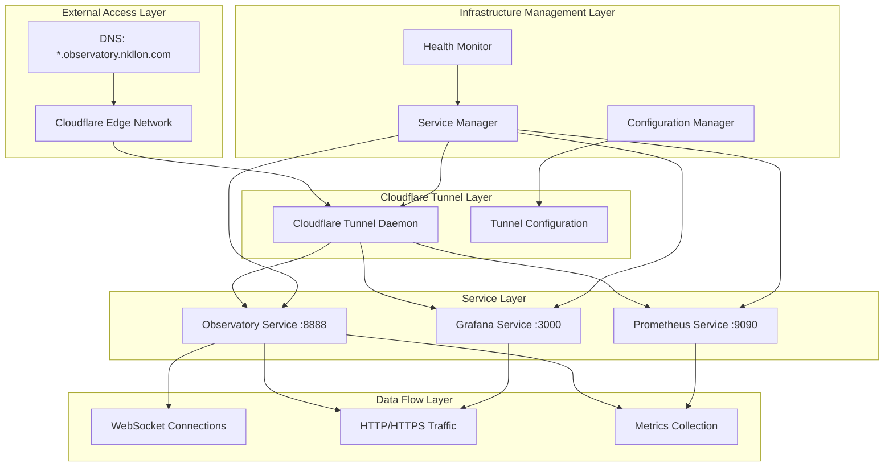
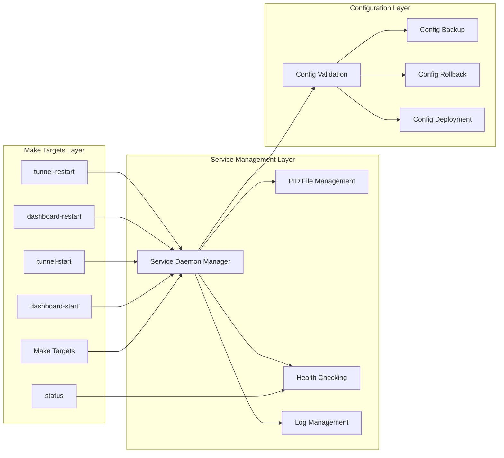

# Observatory Cloudflare Infrastructure Governance - Design Document

## Overview

This design implements a comprehensive infrastructure governance system for the Observatory ecosystem, integrating Cloudflare tunnel management, WebSocket-enabled Observatory services, Grafana visualization, and Prometheus monitoring through a unified, daemon-based architecture. The design addresses the systematic infrastructure requirements reverse-engineered from existing Cloudflare fixes, WebSocket implementations, and monitoring system repairs.

## Architecture

### High-Level Infrastructure Architecture



### Service Orchestration Architecture



## Components and Interfaces

### 1. Unified Service Manager

**Purpose**: Central orchestration of Observatory, Grafana, Prometheus, and Cloudflare tunnel services

**Key Responsibilities**:
- Manage service lifecycle (start, stop, restart, status)
- Handle service dependencies and startup order
- Provide unified interface for Make targets
- Coordinate configuration changes across services

**Interface**:
```python
class UnifiedServiceManager:
    def start_service(self, service_name: str, config: ServiceConfig) -> ServiceResult
    def stop_service(self, service_name: str) -> ServiceResult
    def restart_service(self, service_name: str) -> ServiceResult
    def get_service_status(self, service_name: str) -> ServiceStatus
    def get_all_services_status(self) -> Dict[str, ServiceStatus]
    def validate_service_dependencies(self) -> ValidationResult
    def apply_configuration_changes(self, changes: ConfigChanges) -> ApplyResult
```

**Service Definitions**:
```python
@dataclass
class ServiceConfig:
    name: str
    command: List[str]
    working_directory: str
    environment: Dict[str, str]
    pid_file: str
    log_file: str
    port: int
    dependencies: List[str]
    health_check_url: Optional[str]
    startup_timeout: int = 30
    shutdown_timeout: int = 10

SERVICES = {
    "prometheus": ServiceConfig(
        name="prometheus",
        command=["python", "-m", "src.beast_mode.monitoring.daemon", "--start"],
        working_directory=".",
        environment={},
        pid_file="/tmp/prometheus-monitor.pid",
        log_file="/tmp/prometheus-monitor.log",
        port=9090,
        dependencies=[],
        health_check_url="http://localhost:9090/-/healthy"
    ),
    "observatory": ServiceConfig(
        name="observatory",
        command=["python", "scripts/observatory-daemon.py", "start"],
        working_directory=".",
        environment={},
        pid_file="/tmp/observatory.pid",
        log_file="/tmp/observatory.log",
        port=8888,
        dependencies=["prometheus"],
        health_check_url="http://localhost:8888/health"
    ),
    "grafana": ServiceConfig(
        name="grafana",
        command=["grafana-server", "--config=/usr/local/etc/grafana/grafana.ini"],
        working_directory=".",
        environment={"GF_SERVER_HTTP_PORT": "3000"},
        pid_file="/tmp/grafana.pid",
        log_file="/tmp/grafana.log",
        port=3000,
        dependencies=["prometheus"],
        health_check_url="http://localhost:3000/api/health"
    ),
    "tunnel": ServiceConfig(
        name="tunnel",
        command=["cloudflared", "tunnel", "run", "observatory-tunnel"],
        working_directory=".",
        environment={},
        pid_file="/tmp/cloudflared.pid",
        log_file="/tmp/cloudflared.log",
        port=0,  # No direct port
        dependencies=["observatory", "grafana"],
        health_check_url=None  # Custom health check
    )
}
```

### 2. Cloudflare Tunnel Configuration Manager

**Purpose**: Manage Cloudflare tunnel configuration with WebSocket support and multi-service routing

**Key Responsibilities**:
- Generate and validate tunnel configuration
- Deploy configuration changes safely
- Backup and rollback configuration
- Monitor tunnel health and connectivity

**Configuration Template**:
```yaml
# ~/.cloudflared/config.yml
tunnel: d1e53e43-033f-4994-8f46-c83962ae3785
credentials-file: /Users/lou/.cloudflared/d1e53e43-033f-4994-8f46-c83962ae3785.json

ingress:
  # Observatory with WebSocket support
  - hostname: observatory.nkllon.com
    service: http://localhost:8888
    originRequest:
      httpHostHeader: localhost:8888
      noTLSVerify: false
      connectTimeout: 30s
      tlsTimeout: 10s
      tcpKeepAlive: 30s
      keepAliveConnections: 100
      keepAliveTimeout: 90s
      # WebSocket-specific settings
      disableChunkedEncoding: false
      http2Origin: false
      
  # Grafana dashboard
  - hostname: grafana.observatory.nkllon.com
    service: http://localhost:3000
    originRequest:
      httpHostHeader: localhost:3000
      noTLSVerify: false
      connectTimeout: 30s
      tlsTimeout: 10s
      tcpKeepAlive: 30s
      keepAliveConnections: 100
      keepAliveTimeout: 90s
      
  # Prometheus metrics
  - hostname: prometheus.observatory.nkllon.com
    service: http://localhost:9090
    originRequest:
      httpHostHeader: localhost:9090
      noTLSVerify: false
      connectTimeout: 30s
      tlsTimeout: 10s
      tcpKeepAlive: 30s
      keepAliveConnections: 100
      keepAliveTimeout: 90s
      
  # Catch-all
  - service: http_status:404

# Global settings for WebSocket optimization
retries: 5
gracePeriod: 30s
```

**Interface**:
```python
class TunnelConfigurationManager:
    def generate_config(self, services: Dict[str, ServiceConfig]) -> TunnelConfig
    def validate_config(self, config: TunnelConfig) -> ValidationResult
    def deploy_config(self, config: TunnelConfig) -> DeployResult
    def backup_config(self) -> BackupResult
    def rollback_config(self, backup_id: str) -> RollbackResult
    def test_tunnel_connectivity(self) -> ConnectivityResult
```

### 3. WebSocket Health Monitor

**Purpose**: Monitor WebSocket connectivity and manage intelligent HTTP polling fallback

**Key Responsibilities**:
- Test WebSocket endpoints through tunnel
- Detect WebSocket connection failures
- Activate/deactivate HTTP polling fallback
- Monitor bot protection triggers

**WebSocket Endpoints**:
```python
WEBSOCKET_ENDPOINTS = [
    "/ws/emoji-rain",
    "/ws/observatory", 
    "/ws/anomalies",
    "/ws/doctor-status"
]
```

**Interface**:
```python
class WebSocketHealthMonitor:
    def test_websocket_endpoints(self) -> List[WebSocketTestResult]
    def monitor_websocket_connections(self) -> MonitoringResult
    def activate_http_polling_fallback(self, endpoint: str) -> FallbackResult
    def deactivate_http_polling_fallback(self, endpoint: str) -> FallbackResult
    def check_bot_protection_status(self) -> BotProtectionStatus
    def get_websocket_health_metrics(self) -> WebSocketMetrics
```

### 4. Prometheus Daemon Integration

**Purpose**: Integrate with the singleton Prometheus daemon architecture to prevent monitoring conflicts

**Key Responsibilities**:
- Ensure single Prometheus instance
- Register Observatory metrics with shared registry
- Coordinate with Beast Mode monitoring components
- Prevent recursive monitoring loops

**Interface**:
```python
class PrometheusDaemonIntegration:
    def ensure_daemon_running(self) -> DaemonStatus
    def register_observatory_metrics(self, metrics: List[MetricDefinition]) -> RegistrationResult
    def get_daemon_health(self) -> DaemonHealth
    def collect_infrastructure_metrics(self) -> InfrastructureMetrics
    def prevent_monitoring_recursion(self) -> PreventionResult
```

**Observatory Metrics Registration**:
```python
OBSERVATORY_METRICS = [
    MetricDefinition(
        name="observatory_websocket_connections_active",
        type="gauge",
        description="Number of active WebSocket connections",
        labels=["endpoint"]
    ),
    MetricDefinition(
        name="observatory_http_requests_total",
        type="counter", 
        description="Total HTTP requests to Observatory",
        labels=["method", "endpoint", "status"]
    ),
    MetricDefinition(
        name="observatory_websocket_message_latency_seconds",
        type="histogram",
        description="WebSocket message round-trip latency",
        labels=["endpoint"],
        buckets=[0.001, 0.005, 0.01, 0.05, 0.1, 0.5, 1.0]
    ),
    MetricDefinition(
        name="observatory_tunnel_health_status",
        type="gauge",
        description="Cloudflare tunnel health status (1=healthy, 0=unhealthy)",
        labels=["service"]
    )
]
```

### 5. Grafana Dashboard Configuration

**Purpose**: Configure Grafana with Observatory-specific dashboards and Prometheus data source

**Key Responsibilities**:
- Configure Prometheus data source
- Deploy Observatory performance dashboards
- Set up alerting rules for infrastructure health
- Manage dashboard permissions and access

**Dashboard Configuration**:
```json
{
  "dashboard": {
    "title": "Observatory Infrastructure Health",
    "panels": [
      {
        "title": "WebSocket Connections",
        "type": "stat",
        "targets": [
          {
            "expr": "sum(observatory_websocket_connections_active)",
            "legendFormat": "Active Connections"
          }
        ]
      },
      {
        "title": "Tunnel Health Status",
        "type": "stat",
        "targets": [
          {
            "expr": "observatory_tunnel_health_status",
            "legendFormat": "{{service}}"
          }
        ]
      },
      {
        "title": "WebSocket Message Latency",
        "type": "graph",
        "targets": [
          {
            "expr": "histogram_quantile(0.95, observatory_websocket_message_latency_seconds_bucket)",
            "legendFormat": "95th percentile"
          }
        ]
      }
    ]
  }
}
```

**Interface**:
```python
class GrafanaDashboardManager:
    def configure_prometheus_datasource(self, prometheus_url: str) -> ConfigResult
    def deploy_observatory_dashboards(self) -> DeployResult
    def setup_alerting_rules(self, rules: List[AlertRule]) -> AlertSetupResult
    def manage_dashboard_permissions(self, permissions: DashboardPermissions) -> PermissionResult
    def backup_dashboard_config(self) -> BackupResult
```

### 6. Health Monitoring and Alerting System

**Purpose**: Comprehensive health monitoring of the entire infrastructure stack

**Key Responsibilities**:
- Monitor all service health endpoints
- Check tunnel connectivity and performance
- Alert on service failures or degradation
- Provide unified health dashboard

**Health Checks**:
```python
class InfrastructureHealthMonitor:
    def check_observatory_health(self) -> HealthResult
    def check_grafana_health(self) -> HealthResult
    def check_prometheus_health(self) -> HealthResult
    def check_tunnel_health(self) -> HealthResult
    def check_websocket_connectivity(self) -> ConnectivityResult
    def run_comprehensive_health_check(self) -> ComprehensiveHealthResult
    def generate_health_report(self) -> HealthReport
```

**Health Check Definitions**:
```python
HEALTH_CHECKS = {
    "observatory": {
        "url": "http://localhost:8888/health",
        "timeout": 5,
        "expected_status": 200,
        "critical": True
    },
    "grafana": {
        "url": "http://localhost:3000/api/health", 
        "timeout": 5,
        "expected_status": 200,
        "critical": False
    },
    "prometheus": {
        "url": "http://localhost:9090/-/healthy",
        "timeout": 5,
        "expected_status": 200,
        "critical": True
    },
    "tunnel_observatory": {
        "url": "https://observatory.nkllon.com/health",
        "timeout": 10,
        "expected_status": 200,
        "critical": True
    },
    "tunnel_grafana": {
        "url": "https://grafana.observatory.nkllon.com/api/health",
        "timeout": 10,
        "expected_status": 200,
        "critical": False
    },
    "tunnel_prometheus": {
        "url": "https://prometheus.observatory.nkllon.com/-/healthy",
        "timeout": 10,
        "expected_status": 200,
        "critical": False
    }
}
```

## Data Models

### Service Status Model

```python
@dataclass
class ServiceStatus:
    name: str
    status: ServiceState  # RUNNING, STOPPED, FAILED, STARTING, STOPPING
    pid: Optional[int]
    port: int
    uptime: Optional[timedelta]
    health_status: HealthState  # HEALTHY, UNHEALTHY, UNKNOWN
    last_health_check: datetime
    error_message: Optional[str]
    restart_count: int
    
@dataclass
class ComprehensiveHealthResult:
    timestamp: datetime
    overall_status: OverallHealthState
    service_statuses: Dict[str, ServiceStatus]
    tunnel_connectivity: TunnelConnectivityResult
    websocket_status: WebSocketStatusResult
    performance_metrics: PerformanceMetrics
    alerts: List[HealthAlert]
```

### Configuration Management Model

```python
@dataclass
class ConfigurationState:
    tunnel_config: TunnelConfig
    service_configs: Dict[str, ServiceConfig]
    grafana_config: GrafanaConfig
    prometheus_config: PrometheusConfig
    version: str
    last_modified: datetime
    backup_available: bool
    
@dataclass
class ConfigurationChange:
    change_id: str
    timestamp: datetime
    change_type: ConfigChangeType
    affected_services: List[str]
    changes: Dict[str, Any]
    rollback_data: Dict[str, Any]
    applied: bool
    validated: bool
```

## Error Handling

### Service Management Errors

**Error Categories**:
1. **Service Startup Failures**: Port conflicts, missing dependencies, configuration errors
2. **Service Health Failures**: Service unresponsive, health check failures, resource exhaustion
3. **Configuration Errors**: Invalid configuration, deployment failures, rollback issues
4. **Tunnel Connectivity Errors**: DNS resolution, certificate issues, Cloudflare API errors

**Error Handling Strategy**:
```python
class InfrastructureErrorHandler:
    def handle_service_startup_failure(self, service: str, error: ServiceError) -> RecoveryAction
    def handle_health_check_failure(self, service: str, health_result: HealthResult) -> RecoveryAction
    def handle_configuration_error(self, config_error: ConfigError) -> RecoveryAction
    def handle_tunnel_connectivity_error(self, tunnel_error: TunnelError) -> RecoveryAction
    
    def execute_recovery_action(self, action: RecoveryAction) -> RecoveryResult
    def escalate_to_manual_intervention(self, error: InfrastructureError) -> EscalationResult
```

### Recovery Strategies

```python
class RecoveryStrategies:
    def restart_failed_service(self, service: str) -> RecoveryResult
    def rollback_configuration(self, backup_id: str) -> RecoveryResult
    def restart_tunnel_with_fallback(self) -> RecoveryResult
    def activate_degraded_mode(self, failed_services: List[str]) -> RecoveryResult
    def notify_administrators(self, error: InfrastructureError) -> NotificationResult
```

## Testing Strategy

### Integration Testing

**Test Categories**:
1. **Service Orchestration Tests**: Start/stop/restart sequences, dependency management
2. **Tunnel Connectivity Tests**: WebSocket connections, HTTP routing, SSL/TLS validation
3. **Health Monitoring Tests**: Health check accuracy, alerting functionality, recovery procedures
4. **Configuration Management Tests**: Validation, deployment, rollback procedures

**Test Implementation**:
```python
class InfrastructureIntegrationTests:
    def test_service_startup_sequence(self):
        """Test proper service startup order and dependency handling"""
        
    def test_websocket_connectivity_through_tunnel(self):
        """Test WebSocket connections work through Cloudflare tunnel"""
        
    def test_grafana_prometheus_integration(self):
        """Test Grafana can query Observatory metrics from Prometheus"""
        
    def test_configuration_rollback_procedures(self):
        """Test configuration rollback works correctly"""
        
    def test_health_monitoring_accuracy(self):
        """Test health monitoring detects actual service issues"""
        
    def test_recovery_procedures(self):
        """Test automated recovery from various failure scenarios"""
```

### Performance Testing

**Performance Benchmarks**:
- Observatory response time: <200ms
- WebSocket message latency: <100ms
- Grafana dashboard load time: <3 seconds
- Prometheus query response: <5 seconds
- Tunnel connectivity establishment: <10 seconds

### Load Testing

**Load Test Scenarios**:
- Multiple concurrent WebSocket connections
- High-frequency metrics collection
- Simultaneous Grafana dashboard access
- Tunnel bandwidth utilization under load

## Security Considerations

### Access Control

**Security Layers**:
1. **Cloudflare Security**: Bot protection, DDoS mitigation, WAF rules
2. **Service Authentication**: Grafana login, Prometheus access control
3. **Network Security**: TLS encryption, certificate validation
4. **Infrastructure Security**: Service isolation, resource limits

**Security Configuration**:
```python
class SecurityConfiguration:
    def configure_cloudflare_security(self) -> SecurityResult
    def setup_service_authentication(self) -> AuthResult
    def validate_tls_configuration(self) -> TLSResult
    def implement_service_isolation(self) -> IsolationResult
```

### Bot Protection Integration

**Whitelist Configuration**:
```python
BOT_PROTECTION_WHITELIST = [
    {
        "pattern": "Observatory-Internal/*",
        "description": "Observatory internal polling traffic",
        "action": "allow"
    },
    {
        "pattern": "/ws/*",
        "description": "WebSocket endpoint access",
        "action": "allow"
    },
    {
        "pattern": "/health",
        "description": "Health check endpoints",
        "action": "allow"
    }
]
```

## Deployment Strategy

### Phase 1: Infrastructure Foundation (Week 1)
1. Implement Unified Service Manager
2. Create Cloudflare Tunnel Configuration Manager
3. Set up basic health monitoring
4. Implement Make target integration

### Phase 2: Service Integration (Week 2)
1. Integrate Prometheus daemon architecture
2. Configure Grafana with Observatory dashboards
3. Implement WebSocket health monitoring
4. Add comprehensive error handling

### Phase 3: Advanced Features (Week 3)
1. Implement configuration management and validation
2. Add automated recovery procedures
3. Set up comprehensive health monitoring
4. Implement security and access controls

### Phase 4: Testing and Optimization (Week 4)
1. Complete integration testing suite
2. Perform load and performance testing
3. Optimize configuration and performance
4. Document operational procedures

## Operational Procedures

### Daily Operations

**Service Management Commands**:
```bash
# Start all services
make dashboard-start
make tunnel-start

# Check status
make tunnel-status
make dashboard-status

# Restart services
make dashboard-restart
make tunnel-restart

# Stop services
make dashboard-stop
make tunnel-stop
```

**Health Monitoring**:
```bash
# Check comprehensive health
make infrastructure-health

# Monitor logs
make dashboard-logs-follow
make tunnel-logs

# View metrics
curl http://localhost:9090/metrics
```

### Incident Response

**Common Issues and Resolution**:
1. **WebSocket Connection Failures**: Check tunnel configuration, restart tunnel
2. **Service Startup Failures**: Check port conflicts, validate configuration
3. **Health Check Failures**: Investigate service logs, check resource usage
4. **Tunnel Connectivity Issues**: Validate DNS, check Cloudflare status

**Escalation Procedures**:
1. **Level 1**: Automated recovery attempts
2. **Level 2**: Manual service restart and configuration validation
3. **Level 3**: Configuration rollback and incident escalation
4. **Level 4**: Emergency procedures and external support

This design provides a comprehensive infrastructure governance system that addresses all the requirements reverse-engineered from the existing Cloudflare tunnel fixes, WebSocket implementations, and monitoring system repairs, ensuring reliable operation of the Observatory ecosystem through systematic service orchestration and management.