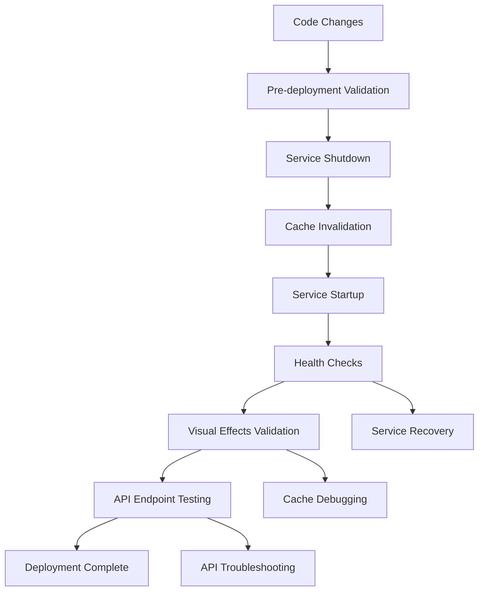
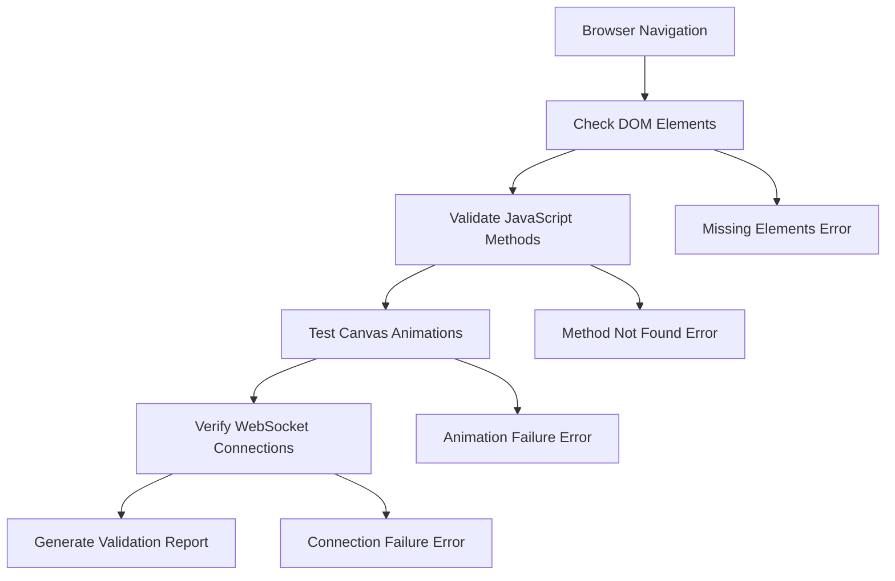

# Observatory Deployment System Design

## Overview

The Observatory Deployment System provides a systematic approach to deploying visual effects, animations, and engagement features. It addresses the current issue where visual enhancements don't appear in production despite successful code deployment.

## Architecture

### Systematic Deployment Process

The deployment system follows a strict systematic approach to ensure reliability and consistency:

1. **Clean State Preparation:** All existing processes are cleanly stopped before deployment
2. **Prerequisite Validation:** System requirements and dependencies are verified
3. **Service Management:** Services are started with verification of successful startup
4. **Visual Effects Validation:** Comprehensive testing of animations and engagement features
5. **Health Monitoring:** All API endpoints and WebSocket connections are tested
6. **Fallback Validation:** Graceful degradation mechanisms are verified
7. **Troubleshooting Generation:** Actionable guidance is provided for any failures

**Design Rationale:** This systematic approach addresses the requirement for reliable deployment processes by ensuring each step is completed successfully before proceeding to the next, with comprehensive validation and fallback mechanisms.

### Deployment Pipeline Components



### Visual Effects Validation System



## Components and Interfaces

### 1. Deployment Orchestrator

**Purpose:** Coordinates the entire systematic deployment process with clean service management

**Interface:**
```python
class DeploymentOrchestrator:
    def deploy(self, target_environment: str) -> DeploymentResult
    def validate_prerequisites(self) -> ValidationResult
    def shutdown_services_cleanly(self) -> ShutdownResult
    def startup_services_with_verification(self) -> StartupResult
    def run_comprehensive_health_checks(self) -> HealthCheckResult
    def validate_visual_effects_post_deployment(self) -> VisualValidationResult
    def generate_troubleshooting_report(self, failures: List[ValidationFailure]) -> TroubleshootingReport
```

**Design Rationale:** The orchestrator ensures systematic deployment by enforcing clean service shutdown, verified startup, and comprehensive post-deployment validation. This addresses requirements for reliable deployment processes and actionable error reporting.

### 2. Visual Effects Validator

**Purpose:** Validates that visual effects are working in the deployed environment with specific testing for Crisis Mode and live metrics

**Interface:**
```python
class VisualEffectsValidator:
    def validate_animations(self, url: str) -> AnimationValidationResult
    def check_canvas_elements(self) -> CanvasCheckResult
    def verify_javascript_methods(self) -> MethodCheckResult
    def test_crisis_mode_particles(self) -> CrisisModeValidationResult
    def validate_live_metrics_animations(self) -> LiveMetricsValidationResult
    def test_shimmer_effects(self) -> ShimmerEffectsResult
    def detect_animation_failures(self) -> AnimationFailureReport
    def generate_debugging_info(self) -> VisualEffectsDebugInfo
```

**Design Rationale:** Specific validation methods for Crisis Mode particles and live metrics animations ensure that the key engagement features work correctly. The debugging information generation provides actionable feedback when animations fail to start.

### 3. Cache Invalidation Manager

**Purpose:** Ensures browsers load updated JavaScript files with comprehensive cache-busting strategies

**Interface:**
```python
class CacheInvalidationManager:
    def invalidate_browser_cache(self) -> CacheResult
    def add_cache_busting_params(self, files: List[str]) -> None
    def clear_cdn_cache(self) -> CDNResult
    def generate_version_hashes(self) -> Dict[str, str]
    def validate_cache_invalidation(self) -> CacheValidationResult
    def provide_manual_cache_instructions(self) -> ManualCacheInstructions
    def detect_cache_issues(self) -> CacheIssueReport
    def force_browser_reload(self) -> ForceReloadResult
```

**Design Rationale:** The cache invalidation system includes validation to ensure cache-busting is working and provides manual instructions when automated methods fail. This ensures that updated JavaScript files are always loaded by browsers.

### 4. API Health Monitor

**Purpose:** Monitors API endpoint health and WebSocket connections with comprehensive fallback testing

**Interface:**
```python
class APIHealthMonitor:
    def test_all_endpoints(self) -> EndpointHealthResult
    def check_websocket_connections(self) -> WebSocketResult
    def validate_engagement_apis(self) -> EngagementAPIResult
    def test_fallback_mechanisms(self) -> FallbackTestResult
    def identify_502_root_cause(self) -> RootCauseAnalysis
    def test_alternative_connections(self) -> AlternativeConnectionResult
    def validate_demo_data_fallback(self) -> FallbackValidationResult
    def generate_restart_instructions(self) -> ServiceRestartGuide
```

### 5. Troubleshooting Guide Generator

**Purpose:** Provides actionable troubleshooting steps for deployment issues

**Interface:**
```python
class TroubleshootingGuideGenerator:
    def generate_error_specific_steps(self, error: DeploymentError) -> TroubleshootingSteps
    def create_service_restart_guide(self, failed_services: List[str]) -> RestartGuide
    def provide_cache_clearing_instructions(self, browser_type: str) -> CacheInstructions
    def generate_debugging_information(self, validation_failures: List[ValidationFailure]) -> DebugInfo
```

## Data Models

### DeploymentResult
```python
@dataclass
class DeploymentResult:
    success: bool
    timestamp: datetime
    services_status: Dict[str, ServiceStatus]
    visual_effects_status: VisualEffectsStatus
    api_health_status: APIHealthStatus
    cache_invalidation_status: CacheStatus
    errors: List[DeploymentError]
    recommendations: List[str]
```

### VisualEffectsStatus
```python
@dataclass
class VisualEffectsStatus:
    animations_working: bool
    canvas_elements_present: bool
    javascript_methods_available: bool
    particle_effects_active: bool
    shimmer_effects_working: bool
    crisis_mode_visual_active: bool
    live_metrics_animated: bool
```

### APIHealthStatus
```python
@dataclass
class APIHealthStatus:
    engagement_api_available: bool
    websocket_connections_working: bool
    prometheus_api_accessible: bool
    all_endpoints_responding: bool
    fallback_mechanisms_functional: bool
    error_502_count: int
    failed_services: List[str]
    alternative_connections_tested: bool
    demo_data_fallback_working: bool
    root_cause_identified: Optional[str]
```

### TroubleshootingSteps
```python
@dataclass
class TroubleshootingSteps:
    error_type: str
    immediate_actions: List[str]
    diagnostic_commands: List[str]
    resolution_steps: List[str]
    fallback_options: List[str]
    prevention_measures: List[str]
```

### ValidationFailure
```python
@dataclass
class ValidationFailure:
    component: str
    failure_type: str
    error_message: str
    debugging_info: Dict[str, Any]
    suggested_actions: List[str]
```

## Error Handling

### Systematic Error Detection and Resolution

The system provides comprehensive error detection with actionable troubleshooting steps for each failure mode.

#### 1. Visual Effects Not Loading
- **Cause:** Browser cache serving old JavaScript files
- **Detection:** JavaScript methods undefined in browser (`typeof method === 'undefined'`)
- **Automated Resolution:** 
  - Force cache invalidation with version parameters
  - Generate new cache-busting hashes
  - Verify file deployment integrity
- **Manual Fallback:** Provide cache clearing instructions for different browsers
- **Requirements Addressed:** 1.1, 1.2, 1.5, 1.6, 3.1, 3.5

#### 2. 502 API Errors with Root Cause Analysis
- **Cause:** Services not fully started or proxy configuration issues
- **Detection:** HTTP 502 responses from API endpoints
- **Root Cause Identification:**
  - Check service process status
  - Validate port availability
  - Test proxy configuration
  - Verify service dependencies
- **Automated Resolution:** Restart services in correct dependency order
- **Requirements Addressed:** 2.4, 2.6, 5.1, 5.2, 5.5

#### 3. WebSocket Connection Failures with Fallback
- **Cause:** Cloudflare tunnel or WebSocket proxy issues
- **Detection:** WebSocket connection errors in browser console
- **Fallback Strategy:**
  - Test direct WebSocket connections
  - Fall back to HTTP polling gracefully
  - Maintain engagement functionality during degraded mode
- **Resolution:** Restart tunnel, verify proxy configuration
- **Requirements Addressed:** 2.5, 5.3

#### 4. Animation Methods Missing
- **Cause:** JavaScript file not properly deployed or syntax errors
- **Detection:** Missing animation methods in browser context
- **Debugging Information:**
  - File deployment verification
  - Syntax error checking
  - Method availability testing
  - Canvas element validation
- **Requirements Addressed:** 1.2, 4.5

#### 5. Crisis Mode and Live Metrics Validation
- **Crisis Mode Particles:** Detect and validate particle animation systems
- **Progress Bar Animations:** Verify shimmer effects and animated progress bars
- **Canvas Element Testing:** Ensure all visual elements are properly rendered
- **Requirements Addressed:** 1.3, 1.4, 4.1, 4.2, 4.3

## Testing Strategy

### Pre-deployment Testing
1. **Syntax Validation:** Check all JavaScript files for syntax errors
2. **Method Availability:** Verify all animation methods are defined
3. **Canvas Compatibility:** Test canvas rendering capabilities
4. **WebSocket Connectivity:** Validate WebSocket endpoint availability
5. **Cache-Busting Verification:** Ensure version parameters are properly generated

### Post-deployment Validation
1. **Visual Effects Comprehensive Testing:**
   - Crisis Mode particle animation detection
   - Live metrics progress bar animations
   - Shimmer effects validation
   - Canvas element presence verification
2. **API Endpoint Health Monitoring:**
   - All endpoints availability testing
   - 502 error detection and root cause analysis
   - WebSocket connection validation
   - Alternative connection method testing
3. **Fallback Mechanism Validation:**
   - HTTP polling fallback when WebSocket fails
   - Demo data fallback when engagement APIs are unavailable
   - Graceful degradation testing
4. **Browser Automation:** Use Playwright to navigate and test visual effects
5. **Performance Monitoring:** Ensure animations don't impact performance

### Troubleshooting and Recovery
1. **Automated Troubleshooting:** Generate specific error resolution steps
2. **Service Restart Instructions:** Provide actionable service recovery guidance
3. **Cache Debugging:** Manual cache clearing instructions for persistent issues
4. **Visual Effects Debugging:** Detailed information when animations fail to start

### Rollback Strategy
1. **Service Rollback:** Ability to quickly revert to previous service version
2. **Asset Rollback:** Restore previous JavaScript files if needed
3. **Cache Clearing:** Force reload of reverted assets
4. **Health Verification:** Confirm rollback restored functionality
5. **Fallback Validation:** Ensure all fallback mechanisms work during rollback

## ADR Conformance Review

### Relevant ADRs Reviewed
- ADR-005: ReflectiveModule Pattern for Universal Observability - ✅ Compliant
- ADR-008: Failure Isolation Over Cascade Prevention - ✅ Compliant
- ADR-007: Integration-First Design Strategy - ✅ Compliant

### Conformance Assessment
- **Infrastructure**: Deployment system integrates with existing Beast Mode framework and ReflectiveModule patterns
- **Integration**: Follows integration-first approach by working with existing deployment scripts and observatory infrastructure
- **Operations**: Implements failure isolation by providing fallback mechanisms and graceful degradation
- **Technology**: Uses established browser automation and health monitoring patterns

### Architectural Consistency
The deployment system maintains consistency with the Beast Mode framework by implementing systematic approaches, comprehensive observability, and integration with existing infrastructure patterns.

## Implementation Phases

### Phase 1: Basic Deployment Validation
- Implement systematic service shutdown/startup orchestration
- Add comprehensive health checks for API endpoints
- Create visual effects validation using browser automation
- Implement troubleshooting guide generation

### Phase 2: Cache Management and Validation
- Implement cache-busting parameter system with validation
- Add CDN cache invalidation if applicable
- Create browser cache clearing mechanisms
- Provide manual cache clearing instructions

### Phase 3: Advanced Monitoring and Fallback
- Add real-time visual effects monitoring
- Implement WebSocket fallback to HTTP polling
- Create engagement API fallback to demo data
- Add automated rollback triggers

### Phase 4: Integration & Automation
- Integrate with existing deployment scripts
- Add automated deployment validation
- Create deployment dashboard with visual status
- Implement comprehensive error reporting and resolution guidance