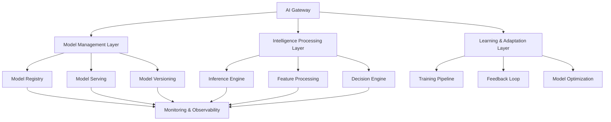

# Observatory Emergency Repair Design

## Overview

This design document outlines the technical architecture and implementation approach for Observatory Emergency Repair, an Intelligence Layer (Layer 2) specification that provides AI-powered capabilities and intelligent automation for the constellation.

## Architecture

### AI System Architecture



### Component Architecture

The system follows an AI-first architecture with clear separation of concerns:

- **AI Gateway**: Entry point for all AI requests with routing and model selection
- **Model Management Layer**: Handles model lifecycle, versioning, and serving
- **Intelligence Processing Layer**: Core AI processing and decision-making
- **Learning & Adaptation Layer**: Continuous learning and model improvement

## Components

### Core Components

#### 1. AI Gateway
**Purpose**: Central entry point for all AI-powered requests
**Responsibilities**:
- Model routing and load balancing
- Request preprocessing and validation
- Response post-processing and formatting
- A/B testing and model comparison

**Interface**:
```python
class AIGateway(ReflectiveModule):
    def route_ai_request(self, request: AIRequest) -> AIResponse
    def select_model(self, request: AIRequest) -> ModelSelection
    def preprocess_input(self, input_data: Any) -> ProcessedInput
    def postprocess_output(self, output_data: Any) -> ProcessedOutput
```

#### 2. Model Manager
**Purpose**: Manages AI model lifecycle and deployment
**Responsibilities**:
- Model registration and discovery
- Model versioning and rollback
- Model health monitoring
- Resource allocation and scaling

**Interface**:
```python
class ModelManager(ReflectiveModule):
    def register_model(self, model: AIModel) -> RegistrationResult
    def deploy_model(self, model_id: str, config: DeploymentConfig) -> DeploymentResult
    def monitor_model_health(self, model_id: str) -> ModelHealth
    def rollback_model(self, model_id: str, version: str) -> RollbackResult
```

#### 3. Inference Engine
**Purpose**: Executes AI model inference and prediction
**Responsibilities**:
- Model inference execution
- Batch and real-time processing
- Performance optimization
- Error handling and fallback

**Interface**:
```python
class InferenceEngine(ReflectiveModule):
    def execute_inference(self, model_id: str, input_data: Any) -> InferenceResult
    def batch_inference(self, model_id: str, batch_data: List[Any]) -> List[InferenceResult]
    def stream_inference(self, model_id: str, stream_data: Iterator[Any]) -> Iterator[InferenceResult]
    def get_inference_metrics(self, model_id: str) -> InferenceMetrics
```

#### 4. Learning Pipeline
**Purpose**: Manages continuous learning and model improvement
**Responsibilities**:
- Training data collection and preparation
- Model training and validation
- Hyperparameter optimization
- Performance evaluation and comparison

**Interface**:
```python
class LearningPipeline(ReflectiveModule):
    def collect_training_data(self, criteria: DataCriteria) -> TrainingDataset
    def train_model(self, config: TrainingConfig) -> TrainingResult
    def validate_model(self, model_id: str, validation_data: Dataset) -> ValidationResult
    def optimize_hyperparameters(self, model_id: str, search_space: SearchSpace) -> OptimizationResult
```

## Data Models

### Core Data Models

#### AIRequest
```python
@dataclass
class AIRequest:
    request_id: str
    model_type: str
    input_data: Any
    parameters: Dict[str, Any]
    context: RequestContext
    timestamp: datetime
    user_id: Optional[str]
```

#### AIResponse
```python
@dataclass
class AIResponse:
    request_id: str
    model_id: str
    output_data: Any
    confidence_score: float
    processing_time_ms: float
    metadata: Dict[str, Any]
    explanation: Optional[str]
```

#### AIModel
```python
@dataclass
class AIModel:
    model_id: str
    name: str
    version: str
    model_type: str
    framework: str
    input_schema: Dict[str, Any]
    output_schema: Dict[str, Any]
    performance_metrics: ModelMetrics
    deployment_config: DeploymentConfig
```

### Training Models

#### TrainingConfig
```python
@dataclass
class TrainingConfig:
    model_type: str
    training_data_path: str
    validation_data_path: str
    hyperparameters: Dict[str, Any]
    training_epochs: int
    batch_size: int
    learning_rate: float
    optimization_algorithm: str
```

#### TrainingResult
```python
@dataclass
class TrainingResult:
    model_id: str
    training_duration: timedelta
    final_metrics: ModelMetrics
    training_history: List[EpochMetrics]
    model_artifacts: List[str]
    validation_results: ValidationResult
```

## API Design

### REST API Endpoints

#### AI Inference
```
POST /api/v1/ai/inference
- Execute AI model inference
- Body: AIRequest
- Response: AIResponse

POST /api/v1/ai/batch-inference
- Execute batch inference
- Body: BatchInferenceRequest
- Response: BatchInferenceResponse

GET /api/v1/ai/models/{model_id}/health
- Check model health status
- Response: ModelHealth
```

#### Model Management
```
POST /api/v1/models
- Register new AI model
- Body: AIModel
- Response: RegistrationResult

PUT /api/v1/models/{model_id}/deploy
- Deploy model to production
- Body: DeploymentConfig
- Response: DeploymentResult

GET /api/v1/models/{model_id}/metrics
- Get model performance metrics
- Response: ModelMetrics
```

### Streaming API

#### Real-time Inference
```python
class StreamingInferenceAPI:
    async def stream_inference(self, model_id: str, input_stream: AsyncIterator[Any]) -> AsyncIterator[AIResponse]:
        async for input_data in input_stream:
            result = await self.inference_engine.execute_inference(model_id, input_data)
            yield result
```

## Implementation Details

### Technology Stack

**AI Framework**: TensorFlow/PyTorch for model development
**Model Serving**: TensorFlow Serving/TorchServe for production inference
**Feature Store**: Feast for feature management
**Experiment Tracking**: MLflow for experiment management
**Model Registry**: MLflow Model Registry for model versioning
**Monitoring**: Prometheus + Grafana for model monitoring

### Key Implementation Patterns

#### 1. Strategy Pattern for Model Selection
```python
class ModelSelectionStrategy(ABC):
    @abstractmethod
    def select_model(self, request: AIRequest, available_models: List[AIModel]) -> AIModel
    
class PerformanceBasedSelection(ModelSelectionStrategy):
    def select_model(self, request: AIRequest, available_models: List[AIModel]) -> AIModel:
        return max(available_models, key=lambda m: m.performance_metrics.accuracy)

class LoadBasedSelection(ModelSelectionStrategy):
    def select_model(self, request: AIRequest, available_models: List[AIModel]) -> AIModel:
        return min(available_models, key=lambda m: m.current_load)
```

#### 2. Observer Pattern for Model Monitoring
```python
class ModelObserver(ABC):
    @abstractmethod
    def on_inference_completed(self, model_id: str, result: InferenceResult) -> None
    
    @abstractmethod
    def on_model_performance_degraded(self, model_id: str, metrics: ModelMetrics) -> None

class PerformanceMonitor(ModelObserver):
    def on_inference_completed(self, model_id: str, result: InferenceResult) -> None:
        self.update_performance_metrics(model_id, result)
        
    def on_model_performance_degraded(self, model_id: str, metrics: ModelMetrics) -> None:
        self.trigger_model_retraining(model_id)
```

#### 3. Pipeline Pattern for Data Processing
```python
class DataProcessingPipeline:
    def __init__(self):
        self.steps = []
    
    def add_step(self, step: ProcessingStep) -> 'DataProcessingPipeline':
        self.steps.append(step)
        return self
    
    def process(self, data: Any) -> Any:
        result = data
        for step in self.steps:
            result = step.process(result)
        return result
```

## Security Considerations

### Model Security
- Model artifact encryption and access control
- Input validation and sanitization
- Output filtering for sensitive information
- Adversarial attack detection and mitigation

### Data Privacy
- Differential privacy for training data
- Data anonymization and pseudonymization
- Secure multi-party computation for collaborative learning
- GDPR compliance for personal data processing

### Access Control
- Role-based access control for model management
- API key authentication for inference requests
- Audit logging for all model operations
- Rate limiting and abuse prevention

## Performance Considerations

### Inference Optimization
- Model quantization and pruning for faster inference
- GPU acceleration for compute-intensive models
- Caching for frequently requested predictions
- Batch processing for improved throughput

### Scalability
- Horizontal scaling with load balancers
- Auto-scaling based on inference demand
- Model sharding for large models
- Edge deployment for low-latency requirements

### Resource Management
- GPU memory management and optimization
- CPU utilization monitoring and optimization
- Storage optimization for model artifacts
- Network bandwidth optimization for data transfer

## Testing Strategy

### Model Testing
- Unit tests for individual model components
- Integration tests for end-to-end inference pipelines
- Performance tests for latency and throughput
- Accuracy tests with validation datasets

### A/B Testing
- Controlled experiments for model comparison
- Statistical significance testing
- Gradual rollout strategies
- Rollback mechanisms for underperforming models

### Adversarial Testing
- Robustness testing against adversarial inputs
- Bias detection and fairness testing
- Edge case testing with unusual inputs
- Security testing for model vulnerabilities

## Deployment Strategy

### Model Deployment
- Blue-green deployment for zero-downtime updates
- Canary releases for gradual model rollout
- Feature flags for model selection
- Automated rollback on performance degradation

### Infrastructure
- Kubernetes deployment with Helm charts
- Docker containers for model serving
- Service mesh for inter-service communication
- Auto-scaling based on inference load

### Monitoring and Observability
- Model performance dashboards
- Real-time alerting for model degradation
- Distributed tracing for inference requests
- Comprehensive logging for debugging

## Continuous Learning

### Feedback Loop
- User feedback collection and integration
- Performance monitoring and analysis
- Automated retraining triggers
- Model improvement recommendations

### Data Management
- Training data versioning and lineage
- Data quality monitoring and validation
- Feature drift detection and alerting
- Automated data pipeline management

---

**Generated:** 2025-10-06T09:46:37.500498
**Phase:** 3 (Design Development)
**Layer:** Intelligence (Layer 2)
**Status:** Complete
