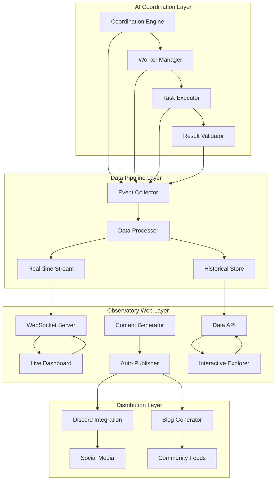
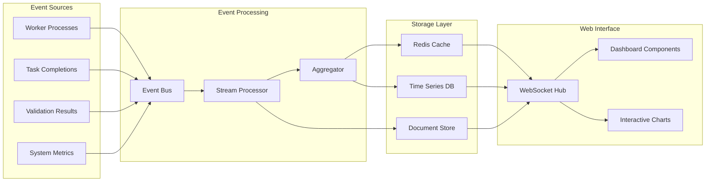

# Observatory Live Coordination Feed - Design Document

## Overview

This design implements a real-time web presence system that transforms the Observatory into a living dashboard showcasing AI coordination experiments, development progress, and meta-programming insights. The system provides transparency into AI-assisted development while creating an engaging, interactive experience for visitors.

## Architecture

### High-Level System Architecture



### Real-Time Data Flow Architecture



## Components and Interfaces

### 1. Real-Time Event Collection System

**Purpose**: Capture all coordination activities and transform them into structured events for real-time processing

**Core Implementation**:
```python
class CoordinationEventCollector:
    def __init__(self):
        self.event_bus = EventBus()
        self.processors = {
            'worker_status': WorkerStatusProcessor(),
            'task_progress': TaskProgressProcessor(),
            'validation_result': ValidationResultProcessor(),
            'experiment_metric': ExperimentMetricProcessor()
        }
        
    async def collect_worker_event(self, worker_id: str, event_data: Dict) -> None
    async def collect_task_event(self, task_id: str, event_data: Dict) -> None
    async def collect_validation_event(self, validation_data: Dict) -> None
    async def collect_system_metric(self, metric_data: Dict) -> None
    
    def process_coordination_log(self, log_entry: str) -> Optional[Event]
    def enrich_event_with_context(self, event: Event) -> EnrichedEvent
```

**Event Types**:
```python
@dataclass
class CoordinationEvent:
    event_id: str
    timestamp: datetime
    event_type: EventType
    source: str
    data: Dict[str, Any]
    context: Optional[Dict[str, Any]] = None

class EventType(Enum):
    WORKER_STARTED = "worker_started"
    WORKER_PROGRESS = "worker_progress"
    WORKER_COMPLETED = "worker_completed"
    WORKER_FAILED = "worker_failed"
    TASK_ASSIGNED = "task_assigned"
    TASK_COMPLETED = "task_completed"
    VALIDATION_PASSED = "validation_passed"
    VALIDATION_FAILED = "validation_failed"
    EXPERIMENT_STARTED = "experiment_started"
    EXPERIMENT_COMPLETED = "experiment_completed"
    INSIGHT_DISCOVERED = "insight_discovered"
```

### 2. Live Dashboard Components

**Purpose**: Real-time web interface showing coordination status, progress, and results

**Dashboard Architecture**:
```python
class LiveCoordinationDashboard:
    def __init__(self):
        self.websocket_manager = WebSocketManager()
        self.component_registry = ComponentRegistry()
        self.data_streams = DataStreamManager()
        
    def register_components(self):
        self.component_registry.register('worker_status', WorkerStatusComponent())
        self.component_registry.register('task_progress', TaskProgressComponent())
        self.component_registry.register('experiment_results', ExperimentResultsComponent())
        self.component_registry.register('performance_metrics', PerformanceMetricsComponent())
        
    async def stream_updates(self, client_id: str) -> None
    async def handle_user_interaction(self, interaction: UserInteraction) -> None
```

**Key Dashboard Components**:

1. **Worker Status Grid**:
```typescript
interface WorkerStatusComponent {
  workers: WorkerStatus[];
  updateWorkerStatus(workerId: string, status: WorkerStatus): void;
  renderWorkerGrid(): JSX.Element;
  handleWorkerClick(workerId: string): void;
}

interface WorkerStatus {
  id: string;
  taskId: string;
  llmProvider: 'claude' | 'cursor';
  status: 'starting' | 'running' | 'completed' | 'failed';
  progress: number;
  startTime: Date;
  estimatedCompletion?: Date;
  resourceUsage: ResourceMetrics;
}
```

2. **Task Progress Visualization**:
```typescript
interface TaskProgressComponent {
  tasks: TaskProgress[];
  completionRate: number;
  velocity: number;
  renderProgressChart(): JSX.Element;
  renderTaskTimeline(): JSX.Element;
}

interface TaskProgress {
  id: string;
  title: string;
  status: TaskStatus;
  progress: number;
  filesCreated: number;
  linesOfCode: number;
  testsWritten: number;
  validationScore: number;
}
```

3. **Experiment Results Stream**:
```typescript
interface ExperimentResultsComponent {
  experiments: ExperimentResult[];
  insights: Insight[];
  comparisons: LLMComparison[];
  renderResultsStream(): JSX.Element;
  renderInsightCards(): JSX.Element;
}

interface ExperimentResult {
  id: string;
  hypothesis: string;
  methodology: string;
  results: Dict<string, any>;
  conclusions: string[];
  confidence: number;
  timestamp: Date;
}
```

### 3. Real-Time Data Streaming System

**Purpose**: Efficient real-time data delivery to web clients with minimal latency

**WebSocket Hub Implementation**:
```python
class WebSocketHub:
    def __init__(self):
        self.connections = {}
        self.subscriptions = {}
        self.data_streams = {}
        
    async def handle_connection(self, websocket: WebSocket, client_id: str):
        self.connections[client_id] = websocket
        await self.send_initial_state(client_id)
        
    async def broadcast_event(self, event: CoordinationEvent):
        message = self.format_event_message(event)
        for client_id, websocket in self.connections.items():
            if self.should_send_to_client(client_id, event):
                await websocket.send_json(message)
                
    async def handle_subscription(self, client_id: str, subscription: Subscription):
        if client_id not in self.subscriptions:
            self.subscriptions[client_id] = []
        self.subscriptions[client_id].append(subscription)
```

**Data Stream Management**:
```python
class DataStreamManager:
    def __init__(self):
        self.streams = {
            'worker_status': WorkerStatusStream(),
            'task_progress': TaskProgressStream(),
            'experiment_results': ExperimentResultsStream(),
            'system_metrics': SystemMetricsStream()
        }
        
    async def process_event(self, event: CoordinationEvent):
        for stream_name, stream in self.streams.items():
            if stream.should_process(event):
                processed_data = await stream.process(event)
                await self.broadcast_to_subscribers(stream_name, processed_data)
```

### 4. Automated Content Generation System

**Purpose**: Generate engaging content automatically from coordination activities and results

**Content Generator Architecture**:
```python
class AutomatedContentGenerator:
    def __init__(self):
        self.generators = {
            'progress_update': ProgressUpdateGenerator(),
            'experiment_summary': ExperimentSummaryGenerator(),
            'insight_article': InsightArticleGenerator(),
            'milestone_announcement': MilestoneAnnouncementGenerator()
        }
        self.content_scheduler = ContentScheduler()
        
    async def generate_content(self, trigger: ContentTrigger) -> GeneratedContent
    async def schedule_publication(self, content: GeneratedContent) -> None
    async def distribute_content(self, content: GeneratedContent) -> None
```

**Content Types and Templates**:

1. **Progress Updates**:
```python
class ProgressUpdateGenerator:
    def generate_update(self, progress_data: ProgressData) -> ProgressUpdate:
        return ProgressUpdate(
            title=f"AI Coordination Progress: {progress_data.completion_rate:.1%} Complete",
            summary=self.generate_summary(progress_data),
            metrics=self.format_metrics(progress_data),
            highlights=self.extract_highlights(progress_data),
            next_steps=self.predict_next_steps(progress_data)
        )
```

2. **Experiment Summaries**:
```python
class ExperimentSummaryGenerator:
    def generate_summary(self, experiment: ExperimentResult) -> ExperimentSummary:
        return ExperimentSummary(
            title=f"Experiment Results: {experiment.hypothesis}",
            methodology=experiment.methodology,
            key_findings=self.extract_key_findings(experiment),
            implications=self.analyze_implications(experiment),
            recommendations=self.generate_recommendations(experiment)
        )
```

3. **Insight Articles**:
```python
class InsightArticleGenerator:
    def generate_article(self, insights: List[Insight]) -> TechnicalArticle:
        return TechnicalArticle(
            title=self.generate_title(insights),
            abstract=self.write_abstract(insights),
            sections=self.structure_content(insights),
            code_examples=self.extract_code_examples(insights),
            conclusions=self.synthesize_conclusions(insights)
        )
```

### 5. Interactive Data Explorer

**Purpose**: Allow users to explore coordination data, drill down into details, and generate custom reports

**Explorer Implementation**:
```python
class InteractiveDataExplorer:
    def __init__(self):
        self.query_engine = QueryEngine()
        self.visualization_engine = VisualizationEngine()
        self.export_engine = ExportEngine()
        
    async def handle_query(self, query: DataQuery) -> QueryResult
    async def generate_visualization(self, data: QueryResult, viz_type: str) -> Visualization
    async def export_data(self, data: QueryResult, format: str) -> ExportResult
```

**Query Interface**:
```typescript
interface DataQuery {
  timeRange: {
    start: Date;
    end: Date;
  };
  filters: {
    llmProvider?: string[];
    taskType?: string[];
    status?: string[];
    experimentId?: string[];
  };
  groupBy?: string[];
  aggregations?: Aggregation[];
  sortBy?: SortCriteria[];
}

interface QueryResult {
  data: any[];
  metadata: {
    totalRecords: number;
    executionTime: number;
    cacheHit: boolean;
  };
  schema: DataSchema;
}
```

### 6. Multi-Channel Distribution System

**Purpose**: Distribute generated content across multiple platforms and channels

**Distribution Hub**:
```python
class ContentDistributionHub:
    def __init__(self):
        self.channels = {
            'discord': DiscordChannel(),
            'twitter': TwitterChannel(),
            'linkedin': LinkedInChannel(),
            'blog': BlogChannel(),
            'rss': RSSChannel()
        }
        self.content_formatter = ContentFormatter()
        
    async def distribute_content(self, content: GeneratedContent) -> DistributionResult
    async def format_for_channel(self, content: GeneratedContent, channel: str) -> FormattedContent
    async def track_engagement(self, distribution_id: str) -> EngagementMetrics
```

**Channel Adapters**:
```python
class DiscordChannel(DistributionChannel):
    async def post_content(self, content: FormattedContent) -> PostResult:
        embed = self.create_embed(content)
        return await self.discord_client.post_embed(embed)
        
class TwitterChannel(DistributionChannel):
    async def post_content(self, content: FormattedContent) -> PostResult:
        thread = self.create_thread(content)
        return await self.twitter_client.post_thread(thread)
```

## Data Models

### Real-Time Event Models

```python
@dataclass
class WorkerStatusEvent:
    worker_id: str
    task_id: str
    llm_provider: str
    status: WorkerStatus
    progress: float
    resource_usage: ResourceMetrics
    timestamp: datetime
    
@dataclass
class TaskProgressEvent:
    task_id: str
    title: str
    progress: float
    files_created: List[str]
    lines_of_code: int
    tests_written: int
    validation_score: float
    timestamp: datetime
    
@dataclass
class ExperimentResultEvent:
    experiment_id: str
    hypothesis: str
    results: Dict[str, Any]
    insights: List[str]
    confidence: float
    timestamp: datetime
```

### Dashboard State Models

```python
@dataclass
class DashboardState:
    active_workers: List[WorkerStatus]
    task_progress: List[TaskProgress]
    experiment_results: List[ExperimentResult]
    system_metrics: SystemMetrics
    recent_insights: List[Insight]
    performance_trends: List[PerformanceTrend]
    
@dataclass
class UserSession:
    session_id: str
    user_id: Optional[str]
    subscriptions: List[Subscription]
    preferences: UserPreferences
    last_activity: datetime
```

### Content Models

```python
@dataclass
class GeneratedContent:
    content_id: str
    content_type: ContentType
    title: str
    body: str
    metadata: Dict[str, Any]
    tags: List[str]
    target_channels: List[str]
    publication_time: datetime
    
@dataclass
class ContentMetrics:
    content_id: str
    views: int
    engagement_rate: float
    shares: int
    comments: int
    channel_performance: Dict[str, ChannelMetrics]
```

## Real-Time Performance Optimization

### WebSocket Connection Management

**Connection Pooling**:
```python
class WebSocketConnectionPool:
    def __init__(self, max_connections: int = 1000):
        self.max_connections = max_connections
        self.active_connections = {}
        self.connection_metrics = ConnectionMetrics()
        
    async def handle_new_connection(self, websocket: WebSocket) -> str:
        if len(self.active_connections) >= self.max_connections:
            await self.cleanup_stale_connections()
            
        connection_id = self.generate_connection_id()
        self.active_connections[connection_id] = WebSocketConnection(websocket)
        return connection_id
```

**Message Batching and Compression**:
```python
class MessageOptimizer:
    def __init__(self):
        self.batch_size = 10
        self.batch_timeout = 100  # milliseconds
        self.compression_threshold = 1024  # bytes
        
    async def optimize_message(self, message: Dict) -> OptimizedMessage:
        # Batch small messages
        if self.should_batch(message):
            return await self.add_to_batch(message)
            
        # Compress large messages
        if self.should_compress(message):
            return await self.compress_message(message)
            
        return OptimizedMessage(message)
```

### Data Caching Strategy

**Multi-Level Caching**:
```python
class CachingStrategy:
    def __init__(self):
        self.l1_cache = MemoryCache(max_size=1000)  # Hot data
        self.l2_cache = RedisCache()  # Warm data
        self.l3_cache = DatabaseCache()  # Cold data
        
    async def get_data(self, key: str) -> Optional[Any]:
        # Try L1 cache first
        data = await self.l1_cache.get(key)
        if data:
            return data
            
        # Try L2 cache
        data = await self.l2_cache.get(key)
        if data:
            await self.l1_cache.set(key, data)
            return data
            
        # Fallback to L3 cache
        data = await self.l3_cache.get(key)
        if data:
            await self.l2_cache.set(key, data)
            await self.l1_cache.set(key, data)
            
        return data
```

## User Interface Design

### Dashboard Layout

**Responsive Grid System**:
```typescript
interface DashboardLayout {
  components: {
    workerStatus: GridPosition;
    taskProgress: GridPosition;
    experimentResults: GridPosition;
    performanceMetrics: GridPosition;
    recentInsights: GridPosition;
    systemHealth: GridPosition;
  };
  breakpoints: {
    mobile: number;
    tablet: number;
    desktop: number;
    ultrawide: number;
  };
}
```

**Component Hierarchy**:
```typescript
const LiveDashboard: React.FC = () => {
  return (
    <DashboardContainer>
      <Header>
        <StatusIndicator />
        <NavigationMenu />
        <UserControls />
      </Header>
      
      <MainContent>
        <WorkerStatusGrid />
        <TaskProgressPanel />
        <ExperimentResultsStream />
        <PerformanceMetricsChart />
      </MainContent>
      
      <Sidebar>
        <RecentInsights />
        <SystemHealth />
        <QuickActions />
      </Sidebar>
    </DashboardContainer>
  );
};
```

### Interactive Features

**Real-Time Filtering and Search**:
```typescript
interface FilterControls {
  timeRange: TimeRangeFilter;
  llmProvider: MultiSelectFilter;
  taskType: MultiSelectFilter;
  status: MultiSelectFilter;
  searchQuery: TextFilter;
}

const useRealTimeFiltering = (filters: FilterControls) => {
  const [filteredData, setFilteredData] = useState([]);
  
  useEffect(() => {
    const subscription = dataStream
      .filter(applyFilters(filters))
      .subscribe(setFilteredData);
      
    return () => subscription.unsubscribe();
  }, [filters]);
  
  return filteredData;
};
```

## Security and Privacy

### Data Access Control

**Role-Based Access**:
```python
class AccessControlManager:
    def __init__(self):
        self.roles = {
            'public': PublicRole(),
            'developer': DeveloperRole(),
            'admin': AdminRole()
        }
        
    def check_access(self, user: User, resource: Resource, action: Action) -> bool:
        user_role = self.get_user_role(user)
        return user_role.can_access(resource, action)
```

**Data Sanitization**:
```python
class DataSanitizer:
    def sanitize_for_public(self, data: Dict) -> Dict:
        # Remove sensitive information
        sanitized = data.copy()
        sensitive_fields = ['api_keys', 'credentials', 'internal_paths']
        
        for field in sensitive_fields:
            if field in sanitized:
                del sanitized[field]
                
        return sanitized
```

## Testing Strategy

### Real-Time System Testing

**WebSocket Testing**:
```python
class TestWebSocketStreaming:
    async def test_connection_handling(self):
        """Test WebSocket connection lifecycle"""
        
    async def test_message_broadcasting(self):
        """Test real-time message distribution"""
        
    async def test_subscription_management(self):
        """Test user subscription handling"""
        
    async def test_connection_recovery(self):
        """Test connection recovery after failures"""
```

**Load Testing**:
```python
class TestSystemLoad:
    async def test_concurrent_connections(self):
        """Test 1000+ concurrent WebSocket connections"""
        
    async def test_high_frequency_updates(self):
        """Test 100+ updates per second"""
        
    async def test_data_volume_handling(self):
        """Test large data volume processing"""
```

### Content Generation Testing

**Automated Content Quality**:
```python
class TestContentGeneration:
    def test_progress_update_generation(self):
        """Test automated progress update creation"""
        
    def test_experiment_summary_accuracy(self):
        """Test experiment summary accuracy"""
        
    def test_insight_extraction(self):
        """Test insight extraction from data"""
```

## Deployment and Operations

### Infrastructure Requirements

**Server Specifications**:
- **CPU**: 8+ cores for real-time processing
- **Memory**: 16GB+ for caching and WebSocket connections
- **Storage**: SSD for fast data access
- **Network**: High bandwidth for real-time streaming

**Technology Stack**:
```yaml
backend:
  framework: FastAPI
  websockets: uvicorn
  database: PostgreSQL + TimescaleDB
  cache: Redis
  message_queue: RabbitMQ
  
frontend:
  framework: React + TypeScript
  real_time: Socket.IO
  charts: D3.js + Chart.js
  state_management: Redux Toolkit
  
infrastructure:
  containerization: Docker
  orchestration: Docker Compose
  monitoring: Prometheus + Grafana
  logging: ELK Stack
```

### Monitoring and Alerting

**System Health Monitoring**:
```python
class SystemHealthMonitor:
    def __init__(self):
        self.metrics = {
            'websocket_connections': ConnectionCountMetric(),
            'message_throughput': ThroughputMetric(),
            'response_time': ResponseTimeMetric(),
            'error_rate': ErrorRateMetric()
        }
        
    async def collect_metrics(self) -> SystemMetrics:
        return SystemMetrics({
            name: metric.collect() 
            for name, metric in self.metrics.items()
        })
```

**Performance Alerting**:
```yaml
alerts:
  high_response_time:
    condition: response_time > 2000ms
    action: scale_up_servers
    
  connection_limit:
    condition: active_connections > 900
    action: enable_connection_throttling
    
  error_rate_spike:
    condition: error_rate > 5%
    action: trigger_investigation
```

## Success Metrics and KPIs

### User Engagement Metrics

1. **Real-Time Engagement**:
   - Active WebSocket connections
   - Average session duration
   - User interaction frequency
   - Dashboard component usage

2. **Content Consumption**:
   - Page views and unique visitors
   - Content sharing and engagement
   - Time spent on different sections
   - Return visitor rate

### System Performance Metrics

1. **Real-Time Performance**:
   - WebSocket message latency (<100ms)
   - Connection establishment time (<1s)
   - Data update frequency (>10 updates/second)
   - System resource utilization (<80%)

2. **Content Generation Metrics**:
   - Automated content creation rate
   - Content quality scores
   - Multi-channel distribution success
   - Community engagement rates

### Business Impact Metrics

1. **Visibility and Reach**:
   - Observatory traffic growth
   - Social media engagement
   - Community participation
   - Industry recognition

2. **Technical Demonstration**:
   - AI coordination showcase effectiveness
   - Developer interest and adoption
   - Technical article citations
   - Conference presentation opportunities

This design creates a comprehensive real-time system that transforms the Observatory into a living demonstration of AI coordination, providing unprecedented visibility into meta-programming experiments while engaging the community with interactive, automatically-generated content.