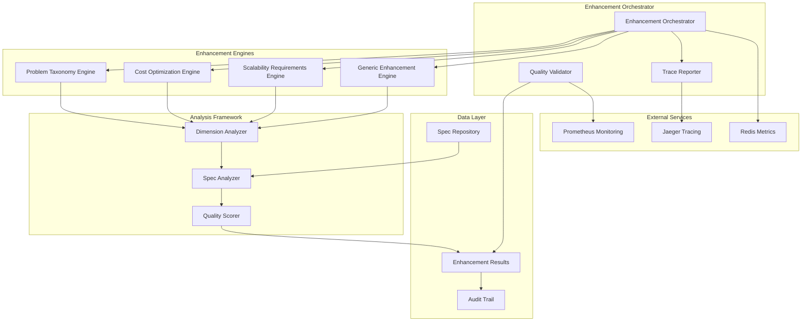

# Phase 5D2 Completion Enhancement - Design Document

## Overview

The Phase 5D2 Completion Enhancement system is designed to systematically address quality gaps identified in the comprehensive DAG execution, targeting specific dimensions that prevent Phase 5D3 readiness. The system builds upon the existing gap mitigation framework while introducing targeted enhancement engines and comprehensive validation capabilities.

## Architecture

### High-Level Architecture



### Component Architecture

The system follows the established Beast Mode ReflectiveModule pattern with comprehensive observability and systematic enhancement capabilities.

## Components and Interfaces

### 1. Enhancement Orchestrator

**Purpose**: Central coordination of all enhancement activities with DAG-based task orchestration.

**Key Responsibilities**:
- Coordinate enhancement tasks following DAG dependency patterns
- Manage parallel execution of enhancement engines
- Integrate results from multiple enhancement cycles
- Provide comprehensive reporting and validation

**Interface**:
```python
class EnhancementOrchestrator(ReflectiveModule):
    def execute_enhancement_cycle(self, target_dimensions: List[str]) -> EnhancementResult
    def validate_phase_5d2_completion(self) -> ValidationResult
    def generate_phase_5d3_readiness_report(self) -> ReadinessReport
    def run_iterative_enhancement(self, max_cycles: int = 3) -> IterativeResult
```

### 2. Dimension-Specific Enhancement Engines

#### Problem Taxonomy Enhancement Engine

**Purpose**: Systematically improve problem classification and taxonomy structures in specifications.

**Enhancement Patterns**:
- Problem domain identification and classification
- Root cause analysis frameworks
- Stakeholder impact assessment
- Problem complexity categorization
- Solution approach mapping

**Interface**:
```python
class ProblemTaxonomyEngine(ReflectiveModule):
    def analyze_problem_structure(self, spec_content: str) -> ProblemAnalysis
    def enhance_problem_taxonomy(self, spec_path: str) -> EnhancementResult
    def validate_taxonomy_completeness(self, enhanced_spec: str) -> ValidationResult
```

#### Cost Optimization Enhancement Engine

**Purpose**: Add comprehensive cost analysis and optimization strategies to specifications.

**Enhancement Patterns**:
- Resource cost analysis and modeling
- Optimization strategy identification
- Cost-benefit analysis frameworks
- Budget planning and allocation
- ROI calculation methodologies

**Interface**:
```python
class CostOptimizationEngine(ReflectiveModule):
    def analyze_cost_structure(self, spec_content: str) -> CostAnalysis
    def enhance_cost_optimization(self, spec_path: str) -> EnhancementResult
    def validate_cost_completeness(self, enhanced_spec: str) -> ValidationResult
```

#### Scalability Requirements Enhancement Engine

**Purpose**: Implement comprehensive scalability planning and performance requirements.

**Enhancement Patterns**:
- Performance target definition
- Capacity planning frameworks
- Growth strategy modeling
- Load testing requirements
- Scalability architecture patterns

**Interface**:
```python
class ScalabilityRequirementsEngine(ReflectiveModule):
    def analyze_scalability_needs(self, spec_content: str) -> ScalabilityAnalysis
    def enhance_scalability_requirements(self, spec_path: str) -> EnhancementResult
    def validate_scalability_completeness(self, enhanced_spec: str) -> ValidationResult
```

### 3. Quality Analysis Framework

#### Dimension Analyzer

**Purpose**: Comprehensive analysis of all 22 dimensions with scoring and gap identification.

**Key Features**:
- Multi-dimensional quality assessment
- Gap identification and prioritization
- Improvement recommendation generation
- Trend analysis and progress tracking

**Interface**:
```python
class DimensionAnalyzer(ReflectiveModule):
    def analyze_all_dimensions(self, spec_path: str) -> DimensionScores
    def identify_critical_gaps(self, scores: DimensionScores) -> List[CriticalGap]
    def generate_improvement_recommendations(self, gaps: List[CriticalGap]) -> List[Recommendation]
    def track_improvement_progress(self, before: DimensionScores, after: DimensionScores) -> ProgressReport
```

#### Quality Validator

**Purpose**: Automated validation of enhancement effectiveness and Phase 5D2 completion criteria.

**Validation Capabilities**:
- Overall quality score validation (70+ target)
- Critical gap percentage validation (<10% target)
- Dimension-specific threshold validation
- Phase 5D3 readiness assessment

**Interface**:
```python
class QualityValidator(ReflectiveModule):
    def validate_quality_targets(self, scores: DimensionScores) -> ValidationResult
    def assess_phase_5d2_completion(self, overall_results: EnhancementResults) -> CompletionStatus
    def validate_phase_5d3_readiness(self, completion_status: CompletionStatus) -> ReadinessStatus
    def generate_validation_report(self, validation_results: List[ValidationResult]) -> ValidationReport
```

### 4. Distributed Tracing Integration

#### Jaeger Trace Manager

**Purpose**: Comprehensive distributed tracing of all enhancement operations using the cluster-shared Jaeger service.

**Tracing Capabilities**:
- End-to-end enhancement workflow tracing
- Individual task and operation spans
- Error tracking and debugging context
- Performance monitoring and bottleneck identification

**Interface**:
```python
class JaegerTraceManager(ReflectiveModule):
    def create_enhancement_trace(self, enhancement_id: str) -> TraceContext
    def create_task_span(self, trace_context: TraceContext, task_name: str) -> SpanContext
    def log_enhancement_metrics(self, span_context: SpanContext, metrics: Dict[str, Any]) -> None
    def handle_enhancement_error(self, span_context: SpanContext, error: Exception) -> None
```

## Data Models

### Enhancement Result Model

```python
@dataclass
class EnhancementResult:
    spec_path: str
    dimension: str
    before_score: float
    after_score: float
    improvements_applied: List[str]
    validation_status: str
    enhancement_timestamp: datetime
    trace_id: str
    
    def improvement_delta(self) -> float:
        return self.after_score - self.before_score
```

### Dimension Scores Model

```python
@dataclass
class DimensionScores:
    spec_path: str
    scores: Dict[str, float]  # dimension_name -> score
    overall_score: float
    critical_gaps: List[str]
    analysis_timestamp: datetime
    
    def get_critical_gap_percentage(self) -> float:
        return len(self.critical_gaps) / len(self.scores) * 100
```

### Phase 5D2 Completion Status Model

```python
@dataclass
class Phase5D2CompletionStatus:
    overall_quality_score: float
    critical_gap_percentage: float
    dimension_scores: Dict[str, float]
    completion_criteria_met: bool
    phase_5d3_ready: bool
    blocking_issues: List[str]
    completion_timestamp: datetime
```

### Jaeger Trace Context Model

```python
@dataclass
class JaegerTraceContext:
    trace_id: str
    span_id: str
    operation_name: str
    start_time: datetime
    tags: Dict[str, Any]
    logs: List[Dict[str, Any]]
    
    def add_tag(self, key: str, value: Any) -> None:
        self.tags[key] = value
    
    def log_event(self, event: str, payload: Dict[str, Any]) -> None:
        self.logs.append({
            "timestamp": datetime.utcnow(),
            "event": event,
            "payload": payload
        })
```

## Error Handling

### Enhancement Error Categories

1. **Spec Processing Errors**: File encoding, parsing, or access issues
2. **Analysis Errors**: Dimension analysis failures or scoring issues
3. **Enhancement Errors**: Failed improvement application or validation
4. **Integration Errors**: DAG orchestration or result combination failures
5. **Tracing Errors**: Jaeger connectivity or span creation issues

### Error Handling Strategy

```python
class EnhancementErrorHandler(ReflectiveModule):
    def handle_spec_processing_error(self, error: Exception, spec_path: str) -> ErrorRecoveryAction
    def handle_analysis_error(self, error: Exception, dimension: str) -> ErrorRecoveryAction
    def handle_enhancement_error(self, error: Exception, enhancement_context: Dict) -> ErrorRecoveryAction
    def handle_tracing_error(self, error: Exception, trace_context: TraceContext) -> ErrorRecoveryAction
```

### Graceful Degradation Patterns

- **Partial Enhancement**: Continue with available dimensions if some fail
- **Fallback Scoring**: Use alternative scoring methods if primary analysis fails
- **Offline Tracing**: Buffer traces locally if Jaeger is unavailable
- **Progressive Enhancement**: Apply improvements incrementally with rollback capability

## Testing Strategy

### Unit Testing

- **Component Testing**: Individual enhancement engines and analyzers
- **Model Testing**: Data model validation and serialization
- **Error Handling Testing**: Exception scenarios and recovery mechanisms
- **Tracing Testing**: Jaeger integration and span creation

### Integration Testing

- **DAG Orchestration Testing**: End-to-end enhancement workflow validation
- **Quality Validation Testing**: Phase 5D2 completion criteria verification
- **Jaeger Integration Testing**: Distributed tracing functionality
- **Multi-Cycle Testing**: Iterative enhancement process validation

### Performance Testing

- **Scalability Testing**: Large spec repository processing
- **Parallel Processing Testing**: Concurrent enhancement engine execution
- **Memory Usage Testing**: Resource consumption monitoring
- **Tracing Overhead Testing**: Jaeger integration performance impact

### Test Data Management

```python
class TestDataManager:
    def create_test_specs(self, count: int, quality_distribution: Dict[str, int]) -> List[str]
    def generate_baseline_scores(self, specs: List[str]) -> Dict[str, DimensionScores]
    def create_enhancement_scenarios(self, target_improvements: Dict[str, float]) -> List[EnhancementScenario]
```

## Deployment and Operations

### Configuration Management

The system uses environment-based configuration with support for different deployment environments:

```python
@dataclass
class EnhancementConfig:
    jaeger_endpoint: str = os.getenv('JAEGER_ENDPOINT', 'http://jaeger:14268/api/traces')
    redis_url: str = os.getenv('REDIS_URL', 'redis://localhost:6379')
    prometheus_gateway: str = os.getenv('PROMETHEUS_GATEWAY', 'http://prometheus:9091')
    enhancement_batch_size: int = int(os.getenv('ENHANCEMENT_BATCH_SIZE', '10'))
    max_enhancement_cycles: int = int(os.getenv('MAX_ENHANCEMENT_CYCLES', '3'))
    quality_target_threshold: float = float(os.getenv('QUALITY_TARGET_THRESHOLD', '70.0'))
    critical_gap_threshold: float = float(os.getenv('CRITICAL_GAP_THRESHOLD', '10.0'))
```

### Health Monitoring

All components implement comprehensive health monitoring following the ReflectiveModule pattern:

```python
class EnhancementHealthMonitor(ReflectiveModule):
    def check_enhancement_engine_health(self) -> HealthStatus
    def check_jaeger_connectivity(self) -> HealthStatus
    def check_spec_repository_access(self) -> HealthStatus
    def check_quality_validation_capability(self) -> HealthStatus
```

### Metrics and Observability

- **Enhancement Metrics**: Success rates, improvement deltas, processing times
- **Quality Metrics**: Dimension scores, completion rates, validation results
- **Performance Metrics**: Processing throughput, resource utilization, error rates
- **Tracing Metrics**: Span creation rates, trace completeness, Jaeger connectivity

## Security Considerations

### Data Protection

- **Spec Content Security**: Secure handling of specification content and metadata
- **Audit Trail Protection**: Tamper-proof logging of all enhancement activities
- **Access Control**: Role-based access to enhancement operations and results

### Tracing Security

- **Trace Data Sanitization**: Remove sensitive information from Jaeger traces
- **Secure Transmission**: Encrypted communication with Jaeger service
- **Retention Policies**: Appropriate trace data retention and cleanup

## Integration Points

### Existing System Integration

- **DAG Framework**: Seamless integration with existing DAG orchestration
- **Beast Mode Patterns**: Full compliance with ReflectiveModule requirements
- **Gap Mitigation Results**: Building upon existing analysis and improvements
- **Spec Repository**: Integration with current specification management

### External Service Integration

- **Jaeger Tracing**: Cluster-shared distributed tracing service
- **Redis Coordination**: Task coordination and result caching
- **Prometheus Monitoring**: Metrics collection and alerting
- **File System**: Secure spec repository access and modification

## Performance Optimization

### Parallel Processing

- **Concurrent Enhancement**: Multiple dimensions processed simultaneously
- **Batch Processing**: Efficient handling of large spec repositories
- **Resource Pooling**: Optimized resource utilization across enhancement engines

### Caching Strategy

- **Analysis Caching**: Cache dimension analysis results for reuse
- **Enhancement Caching**: Store successful enhancement patterns
- **Validation Caching**: Cache validation results for unchanged specs

### Memory Management

- **Streaming Processing**: Process large specs without loading entirely into memory
- **Garbage Collection**: Proactive cleanup of temporary analysis data
- **Resource Monitoring**: Continuous monitoring of memory and CPU usage

This design provides a comprehensive, systematic approach to Phase 5D2 completion enhancement while maintaining full integration with existing systems and establishing the foundation for Phase 5D3 readiness.