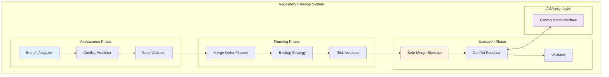
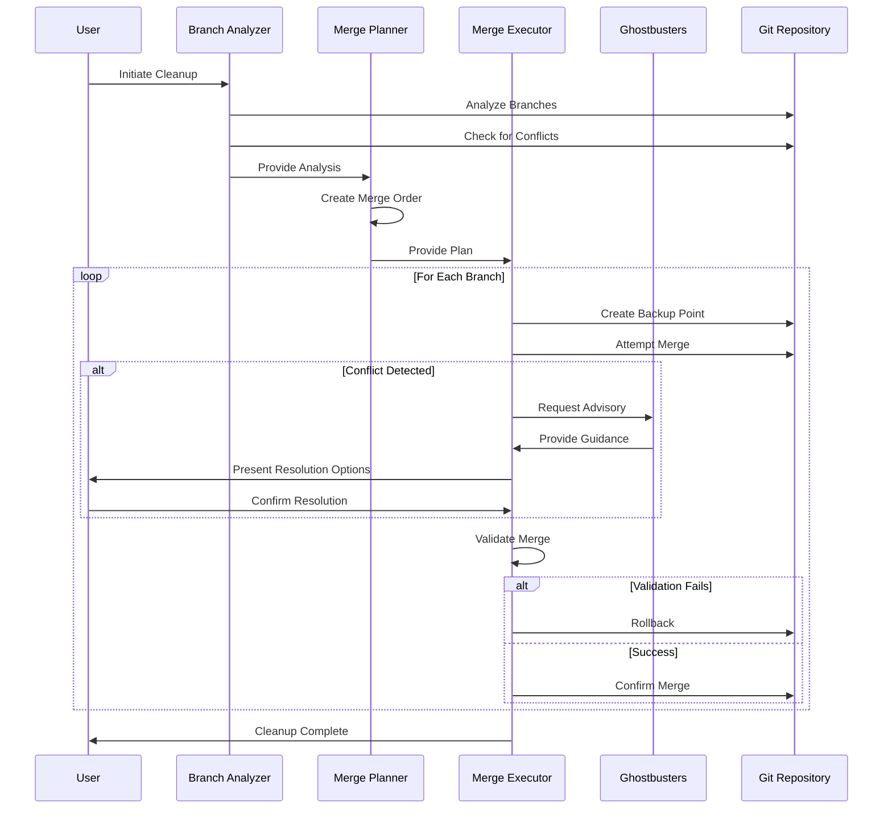

# Practical Repository Cleanup - Design

## Overview

This design document outlines a practical, git-native approach to consolidating multiple release candidate branches back to master. The design prioritizes simplicity, safety, and specification compliance while avoiding over-engineering.

**Design Principles:**
- Use standard git tools and workflows
- Maintain rollback capability at every step
- Prioritize spec-compliant code in conflict resolution
- Leverage Ghostbusters advisory for complex decisions
- Complete cleanup within 2-day time constraint

## Architecture Overview

### High-Level Design



### Data Flow Design



## Component Design

### 1. Branch Analysis Engine

**Purpose**: Analyze current repository state and predict merge complexity

**Key Components**:
- **Commit Analyzer**: Identifies unique vs overlapping commits between branches
- **File Change Detector**: Maps file modifications across branches
- **Conflict Predictor**: Estimates merge conflict likelihood and complexity
- **Spec Compliance Checker**: Validates code against existing specifications

**Implementation**:
```python
class BranchAnalyzer:
    def analyze_branches(self) -> BranchAnalysisReport:
        """Analyze all branches and their relationships"""

    def predict_conflicts(self, source: str, target: str) -> ConflictPrediction:
        """Predict merge conflicts between branches"""

    def validate_spec_compliance(self, branch: str) -> SpecComplianceReport:
        """Check branch against specifications"""

    def recommend_merge_order(self) -> List[MergeStep]:
        """Recommend optimal merge sequence"""
```

### 2. Merge Planning Engine

**Purpose**: Create systematic merge strategy with backup and rollback planning

**Key Components**:
- **Order Optimizer**: Determines safest merge sequence
- **Backup Planner**: Creates rollback strategy for each step
- **Risk Assessor**: Evaluates merge risk and mitigation strategies
- **Resource Estimator**: Estimates time and effort for cleanup

**Merge Order Logic**:
1. **Cleanup branches first**: `rc1-project-cleanup-redo` (45 commits)
2. **Integration branches second**: `rc1-final-integration` (83 commits)
3. **Feature branches last**: Individual feature branches

**Rationale**: Cleanup branches likely contain foundational fixes that integration branches build upon.

**Implementation**:
```python
class MergePlanner:
    def create_merge_plan(self, analysis: BranchAnalysisReport) -> MergePlan:
        """Create comprehensive merge plan"""

    def plan_backup_strategy(self) -> BackupStrategy:
        """Plan backup points and rollback procedures"""

    def assess_risks(self, plan: MergePlan) -> RiskAssessment:
        """Evaluate risks and mitigation strategies"""

    def estimate_effort(self, plan: MergePlan) -> EffortEstimate:
        """Estimate time and complexity"""
```

### 3. Safe Merge Executor

**Purpose**: Execute merges with comprehensive safety nets and validation

**Key Components**:
- **Backup Manager**: Creates and manages restore points
- **Merge Controller**: Executes git operations safely
- **Conflict Handler**: Manages merge conflicts with spec priority
- **Validator**: Confirms merge success and functionality

**Safety Mechanisms**:
- **Pre-merge backup**: Create restore point before each merge
- **Incremental merges**: One branch at a time with validation
- **Automatic rollback**: Restore on validation failure
- **Manual override**: Allow user intervention for complex conflicts

**Implementation**:
```python
class SafeMergeExecutor:
    def execute_merge_plan(self, plan: MergePlan) -> MergeResult:
        """Execute complete merge plan safely"""

    def merge_single_branch(self, step: MergeStep) -> SingleMergeResult:
        """Merge one branch with full safety checks"""

    def handle_conflicts(self, conflicts: List[Conflict]) -> ConflictResolution:
        """Resolve conflicts using spec-driven approach"""

    def validate_merge(self, result: SingleMergeResult) -> ValidationResult:
        """Validate merge success and functionality"""

    def rollback_if_needed(self, validation: ValidationResult) -> RollbackResult:
        """Rollback on validation failure"""
```

### 4. Specification-Driven Conflict Resolver

**Purpose**: Resolve merge conflicts using requirements and design authority

**Conflict Resolution Hierarchy**:
1. **Requirements Documentation**: What the system should do
2. **Design Documentation**: How the system should be built
3. **Ghostbusters Advisory**: Expert guidance for unclear situations
4. **Implementation**: What the system currently does

**Resolution Strategies**:
- **Spec Comparison**: Compare conflicting implementations against specifications
- **Authority Lookup**: Find relevant requirements or design docs
- **Ghostbusters Consultation**: Escalate complex decisions
- **Documentation**: Record resolution rationale

**Implementation**:
```python
class SpecDrivenConflictResolver:
    def resolve_conflict(self, conflict: MergeConflict) -> ConflictResolution:
        """Resolve conflict using spec-driven approach"""

    def find_authoritative_spec(self, file_path: str) -> Optional[Specification]:
        """Locate relevant requirements or design docs"""

    def compare_against_spec(self, implementations: List[str], spec: Specification) -> SpecComparison:
        """Compare implementations against specification"""

    def consult_ghostbusters(self, complex_conflict: ComplexConflict) -> GhostbustersAdvice:
        """Get expert advisory for complex decisions"""
```

### 5. Ghostbusters Advisory Interface

**Purpose**: Provide expert guidance for low-confidence decisions

**Advisory Scenarios**:
- **Complex architectural conflicts**: Multiple valid approaches
- **Specification ambiguity**: Unclear or conflicting requirements
- **High-risk decisions**: Potential for significant impact
- **Novel situations**: Unprecedented conflict types

**Integration Points**:
- **Conflict Resolution**: Called during complex merge conflicts
- **Planning Phase**: Consulted for high-risk merge strategies
- **Validation**: Consulted when validation results are ambiguous

**Implementation**:
```python
class GhostbustersInterface:
    def request_advisory(self, context: AdvisoryContext) -> GhostbustersResponse:
        """Request expert guidance for complex decisions"""

    def escalate_conflict(self, conflict: ComplexConflict) -> ConflictGuidance:
        """Escalate complex conflicts for expert resolution"""

    def validate_decision(self, decision: HighRiskDecision) -> DecisionValidation:
        """Validate high-risk decisions with expert review"""
```

## Merge Strategy Design

### Phase 1: Repository Assessment (2 hours)

**Objectives**:
- Understand current repository state
- Identify unique work in each branch
- Predict merge conflicts and complexity
- Create rollback strategy

**Activities**:
1. **Branch Analysis**: Map commits and file changes across branches
2. **Conflict Prediction**: Identify potential merge conflicts
3. **Spec Validation**: Check branch compliance with specifications
4. **Backup Planning**: Create comprehensive backup strategy

**Outputs**:
- Branch analysis report
- Merge order recommendation
- Conflict prediction report
- Backup and rollback plan

### Phase 2: Merge Execution (1 day)

**Merge Order**:
1. **rc1-project-cleanup-redo** → master
2. **rc1-final-integration** → master
3. **Selected feature branches** → master (if needed)

**Per-Branch Process**:
1. **Pre-merge backup**: Create restore point
2. **Merge attempt**: Execute git merge
3. **Conflict resolution**: Use spec-driven approach + Ghostbusters
4. **Validation**: Check functionality and compliance
5. **Rollback or confirm**: Based on validation results

**Safety Checks**:
- Syntax validation for Python files
- Import error checking
- Basic smoke tests for core functionality
- Specification compliance verification

### Phase 3: Cleanup and Documentation (2 hours)

**Objectives**:
- Clean up obsolete branches
- Document merge decisions
- Establish ongoing workflow
- Provide team handoff

**Activities**:
1. **Branch Cleanup**: Archive or delete obsolete branches
2. **Documentation**: Document merge decisions and rationale
3. **Workflow Setup**: Establish simple ongoing branching strategy
4. **Team Handoff**: Provide guidance for future development

## Error Handling Design

### Error Categories and Responses

**Pre-merge Errors**:
- **Repository state issues**: Clean up uncommitted changes
- **Missing specifications**: Flag for documentation
- **Access issues**: Verify git permissions

**Merge Errors**:
- **Simple conflicts**: Automatic resolution using spec authority
- **Complex conflicts**: Ghostbusters consultation
- **Unresolvable conflicts**: Manual intervention with user guidance

**Post-merge Errors**:
- **Validation failures**: Automatic rollback to backup point
- **Functionality regressions**: Manual investigation and resolution
- **Performance issues**: Document for future optimization

**Rollback Procedures**:
- **Immediate rollback**: On validation failure
- **Selective rollback**: Rollback specific operations
- **Complete rollback**: Return to initial state if needed

## Testing Strategy Design

### Validation Levels

**Level 1: Syntax and Import Validation**
- Python syntax checking
- Import error detection
- Basic file integrity

**Level 2: Smoke Testing**
- Core functionality spot checks
- Key component initialization
- Basic API endpoint validation

**Level 3: Specification Compliance**
- Requirements validation against implementation
- Design pattern compliance checking
- Architecture consistency verification

**Level 4: Integration Testing** (if time permits)
- Cross-component interaction testing
- End-to-end workflow validation
- Performance regression checking

## Security and Risk Management

### Security Considerations
- **Backup Security**: Protect backup files and restore points
- **Access Control**: Verify permissions for git operations
- **Audit Trail**: Log all merge operations and decisions
- **Data Integrity**: Validate repository integrity throughout process

### Risk Mitigation
- **Multiple Backup Points**: Create backups before each major operation
- **Incremental Progress**: Small, reversible steps
- **Expert Consultation**: Ghostbusters advisory for high-risk decisions
- **Manual Override**: Human intervention capability for all automated decisions

This design provides a practical, safety-focused approach to repository cleanup that leverages existing git tools while incorporating the systematic validation and expert advisory capabilities needed for complex merge scenarios.