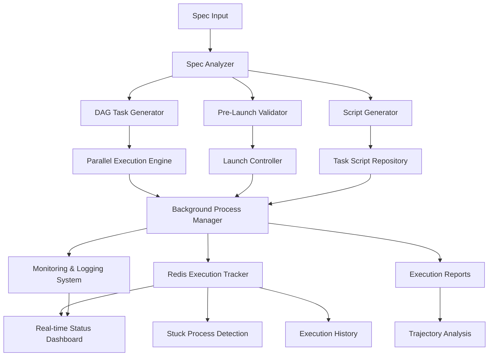

# Design Document - Prepare Spec for Execution

## Overview

The "Prepare Spec for Execution" system is a meta-framework that transforms any completed specification into a fully executable, monitored, and orchestrated implementation pipeline with Redis-based execution tracking. It bridges the gap between specification and execution by automatically generating the necessary infrastructure for parallel DAG orchestration, comprehensive monitoring, automated launch capabilities, and centralized execution tracking.

**Lessons Learned Integration**: Based on successful implementation of V2.0 workflow control across multiple specifications, this system incorporates proven patterns for execution safety, Redis-based tracking, and 70%+ efficiency gains through intelligent parallelization.

## Architecture

### High-Level Architecture



### Component Architecture

#### 1. Spec Analysis Layer
- **SpecAnalyzer**: Parses requirements.md, design.md, and tasks.md
- **TaskExtractor**: Extracts task definitions and dependencies
- **DependencyMapper**: Creates dependency graphs and validates for cycles
- **RequirementTracer**: Maps tasks to requirements for traceability

#### 2. DAG Orchestration Layer
- **DAGTaskGenerator**: Converts tasks to DAG-compatible definitions
- **ParallelGroupCalculator**: Optimizes task grouping for parallel execution
- **ExecutionPlanner**: Calculates execution strategies and time estimates
- **DependencyValidator**: Ensures mathematical correctness of dependency graphs

#### 3. Validation and Safety Layer
- **PreLaunchValidator**: Comprehensive system readiness checks
- **EnvironmentChecker**: Python version, dependencies, permissions
- **InfrastructureDetector**: Available DAG orchestration components
- **HealthMonitor**: System health and resource availability

#### 4. Execution Infrastructure Layer
- **BackgroundProcessManager**: Process lifecycle management
- **ParallelExecutionEngine**: Concurrent task execution with dependency respect
- **TaskScriptGenerator**: Automatic generation of executable task scripts
- **ExecutionController**: Orchestrates the entire execution pipeline

#### 5. Redis-Based Execution Tracking Layer
- **RedisExecutionTracker**: Centralized execution state management in Redis
- **ExecutionRegistry**: Track all active and historical executions
- **StuckProcessDetector**: Identify executions that haven't checked in within timeout
- **ExecutionLockManager**: Prevent concurrent execution conflicts through PID-based locking

#### 6. Monitoring and Reporting Layer
- **ExecutionTracker**: Real-time progress monitoring and logging
- **PerformanceAnalyzer**: Actual vs estimated performance analysis
- **TrajectoryCalculator**: ETA updates and completion forecasting
- **ReportGenerator**: Comprehensive execution reports and metrics

## Components and Interfaces

### Core Components

#### RedisExecutionTracker
```python
class RedisExecutionTracker:
    def create_execution_record(self, spec_name: str, execution_plan: ExecutionPlan) -> str
    def update_execution_progress(self, execution_id: str, phase: str, progress: float) -> None
    def check_in_execution(self, execution_id: str, status_data: Dict[str, Any]) -> None
    def get_execution_status(self, execution_id: str) -> ExecutionStatus
    def list_active_executions(self) -> List[ExecutionRecord]
    def detect_stuck_executions(self, timeout_minutes: int = 30) -> List[str]
    def cleanup_old_executions(self, retention_days: int = 7) -> int
    def acquire_execution_lock(self, spec_name: str, pid: int) -> bool
    def release_execution_lock(self, spec_name: str, pid: int) -> bool
```

#### ExecutionSafetyManager
```python
class ExecutionSafetyManager:
    def check_resource_constraints(self) -> ResourceStatus
    def validate_execution_environment(self) -> ValidationResult
    def implement_timeout_protection(self, execution_id: str, timeout_seconds: int) -> None
    def handle_graceful_shutdown(self, execution_id: str, signal: int) -> None
    def cleanup_execution_artifacts(self, execution_id: str) -> CleanupResult
    def prevent_concurrent_conflicts(self, spec_name: str) -> LockResult
```

#### SpecAnalyzer
```python
class SpecAnalyzer:
    def analyze_spec(self, spec_path: str) -> SpecAnalysis
    def extract_tasks(self, tasks_md: str) -> List[TaskDefinition]
    def map_dependencies(self, tasks: List[TaskDefinition]) -> DependencyGraph
    def validate_requirements_traceability(self) -> TraceabilityReport
```

#### DAGTaskGenerator
```python
class DAGTaskGenerator:
    def convert_to_dag_tasks(self, tasks: List[TaskDefinition]) -> List[DAGTask]
    def calculate_parallel_groups(self, dag_tasks: List[DAGTask]) -> List[List[str]]
    def estimate_execution_times(self, dag_tasks: List[DAGTask]) -> ExecutionEstimate
    def validate_dag_structure(self, dag_tasks: List[DAGTask]) -> ValidationResult
```

#### PreLaunchValidator
```python
class PreLaunchValidator:
    def run_all_checks(self) -> ValidationReport
    def check_python_environment(self) -> CheckResult
    def check_project_structure(self) -> CheckResult
    def check_source_data_quality(self) -> CheckResult
    def check_infrastructure_availability(self) -> CheckResult
    def generate_remediation_guidance(self, failures: List[CheckResult]) -> List[str]
```

#### BackgroundProcessManager
```python
class BackgroundProcessManager:
    def start_background_execution(self, execution_plan: ExecutionPlan) -> ProcessInfo
    def monitor_process_status(self, process_id: str) -> ProcessStatus
    def stop_process_gracefully(self, process_id: str) -> bool
    def get_real_time_logs(self, process_id: str) -> Iterator[LogEntry]
    def cleanup_completed_processes(self) -> None
```

#### ParallelExecutionEngine
```python
class ParallelExecutionEngine:
    def execute_parallel_group(self, task_group: List[DAGTask]) -> List[ExecutionResult]
    def respect_dependencies(self, dag_tasks: List[DAGTask]) -> ExecutionOrder
    def handle_task_failures(self, failed_tasks: List[ExecutionResult]) -> RecoveryPlan
    def calculate_efficiency_gains(self, results: List[ExecutionResult]) -> EfficiencyMetrics
```

### Data Models

#### ExecutionRecord
```python
@dataclass
class ExecutionRecord:
    execution_id: str
    spec_name: str
    start_time: datetime
    status: ExecutionStatus
    current_phase: str
    progress_percentage: float
    pid: int
    last_checkin: datetime
    metadata: Dict[str, Any]
    resource_usage: ResourceMetrics
    efficiency_metrics: EfficiencyMetrics
```

#### ExecutionStatus
```python
class ExecutionStatus(Enum):
    STARTING = "starting"
    RUNNING = "running"
    PAUSED = "paused"
    COMPLETED = "completed"
    FAILED = "failed"
    STUCK = "stuck"
    TERMINATED = "terminated"
```

#### ResourceMetrics
```python
@dataclass
class ResourceMetrics:
    cpu_usage_percent: float
    memory_usage_mb: float
    disk_usage_mb: float
    network_io_mb: float
    execution_time_seconds: float
```

#### TaskDefinition
```python
@dataclass
class TaskDefinition:
    task_id: str
    name: str
    description: str
    dependencies: List[str]
    estimated_duration: float
    requirements: List[str]
    script_path: Optional[str]
    validation_command: Optional[str]
    parallel_safe: bool
```

#### DAGTask
```python
@dataclass
class DAGTask:
    task_id: str
    name: str
    description: str
    dependencies: List[str]
    estimated_duration: float
    requirements: List[str]
    script_path: Optional[str]
    validation_command: Optional[str]
    parallel_safe: bool
    execution_group: int
    priority: int
```

#### ExecutionResult
```python
@dataclass
class ExecutionResult:
    task_id: str
    success: bool
    duration: float
    output: str
    error: str
    start_time: datetime
    end_time: datetime
    validation_passed: bool
```

#### ValidationReport
```python
@dataclass
class ValidationReport:
    ready_for_launch: bool
    checks_passed: int
    total_checks: int
    success_rate: str
    failed_checks: List[CheckResult]
    recommendations: List[str]
    system_health_score: float
```

## Data Models

### Spec Analysis Models

#### SpecAnalysis
```python
@dataclass
class SpecAnalysis:
    spec_name: str
    requirements_count: int
    design_sections: List[str]
    task_count: int
    dependency_graph: DependencyGraph
    traceability_matrix: Dict[str, List[str]]
    complexity_score: float
    estimated_completion_time: float
```

#### DependencyGraph
```python
@dataclass
class DependencyGraph:
    nodes: List[str]
    edges: List[Tuple[str, str]]
    has_cycles: bool
    topological_order: List[str]
    parallel_groups: List[List[str]]
    critical_path: List[str]
    max_parallelism: int
```

### Execution Models

#### ExecutionPlan
```python
@dataclass
class ExecutionPlan:
    execution_id: str
    spec_name: str
    dag_tasks: List[DAGTask]
    parallel_groups: List[List[str]]
    estimated_duration: float
    validation_requirements: List[str]
    script_dependencies: List[str]
    infrastructure_requirements: List[str]
```

#### ProcessInfo
```python
@dataclass
class ProcessInfo:
    process_id: str
    pid: int
    start_time: datetime
    status: ProcessStatus
    log_file: str
    execution_plan: ExecutionPlan
    current_phase: str
    progress_percentage: float
```

#### PerformanceMetrics
```python
@dataclass
class PerformanceMetrics:
    total_tasks: int
    successful_tasks: int
    failed_tasks: int
    total_duration: float
    sequential_estimate: float
    parallel_estimate: float
    actual_duration: float
    efficiency_gain: float
    average_task_duration: float
    parallelization_effectiveness: float
```

## Execution Safety and Reliability

### Safety Architecture

#### PID-Based Execution Locking
- **Conflict Prevention**: Use process IDs to prevent concurrent execution of same spec
- **Lock Validation**: Verify process is actually running before honoring locks
- **Automatic Cleanup**: Remove stale locks from terminated processes
- **Lock Timeout**: Expire locks after configurable timeout period

#### Resource Constraint Management
- **Pre-execution Checks**: Validate CPU, memory, and disk availability
- **Runtime Monitoring**: Track resource usage during execution
- **Threshold Enforcement**: Terminate executions exceeding resource limits
- **Graceful Degradation**: Reduce parallelism when resources are constrained

#### Timeout Protection
- **Execution Timeouts**: Prevent infinite loops and stuck processes
- **Phase Timeouts**: Individual task and phase-level timeout protection
- **Heartbeat Monitoring**: Detect unresponsive executions through Redis check-ins
- **Automatic Termination**: Kill stuck processes after timeout expiration

#### Graceful Error Handling
- **Signal Handling**: Proper SIGINT/SIGTERM handling with cleanup
- **Rollback Mechanisms**: Undo partial changes on execution failure
- **State Recovery**: Resume execution from last successful checkpoint
- **Error Propagation**: Clear error reporting with recovery guidance

### Redis Integration Architecture

#### Centralized State Management
- **Execution Registry**: All executions tracked in Redis with unique IDs
- **Real-time Updates**: Phase-by-phase progress updates with timestamps
- **Status Monitoring**: Live status dashboard from Redis data
- **History Preservation**: Complete execution history with configurable retention

#### Fallback Mechanisms
- **Redis Unavailable**: Graceful degradation to file-based tracking
- **Connection Recovery**: Automatic reconnection with state synchronization
- **Data Consistency**: Ensure execution state consistency across failures
- **Backup Strategies**: Local file backup of critical execution state

## Error Handling

### Error Categories

#### 1. Execution Safety Errors
- **ConcurrentExecutionError**: Multiple executions of same spec attempted
- **ResourceConstraintError**: Insufficient CPU, memory, or disk space
- **TimeoutError**: Execution exceeded configured timeout limits
- **ProcessManagementError**: PID tracking or process control failures

#### 2. Redis Integration Errors
- **RedisConnectionError**: Cannot connect to Redis server
- **ExecutionLockError**: Cannot acquire or release execution locks
- **StateInconsistencyError**: Execution state mismatch between Redis and local
- **TrackingError**: Cannot update or retrieve execution tracking data

#### 3. Specification Errors
- **InvalidSpecStructure**: Missing or malformed spec files
- **CircularDependencyError**: Tasks have circular dependencies
- **RequirementTraceabilityError**: Tasks don't map to requirements
- **TaskDefinitionError**: Invalid task definitions or missing fields

#### 2. Infrastructure Errors
- **EnvironmentCompatibilityError**: Python version or dependency issues
- **InsufficientResourcesError**: Disk space, memory, or permission issues
- **DAGInfrastructureError**: Missing or incompatible orchestration components
- **ProcessManagementError**: Background process creation or management failures

#### 3. Execution Errors
- **TaskExecutionError**: Individual task failures
- **ValidationError**: Pre-launch or post-execution validation failures
- **ParallelExecutionError**: Parallel execution coordination failures
- **MonitoringError**: Logging or monitoring system failures

### Error Handling Strategies

#### Safety-First Error Handling
```python
class ExecutionSafetyHandler:
    def handle_concurrent_execution_attempt(self, spec_name: str, pid: int) -> ConflictResolution
    def handle_resource_constraint_violation(self, resource_type: str, usage: float) -> ResourceAction
    def handle_timeout_expiration(self, execution_id: str, timeout_type: str) -> TimeoutAction
    def handle_redis_connection_failure(self, operation: str) -> FallbackStrategy
    def handle_process_termination_request(self, execution_id: str, signal: int) -> CleanupPlan
```

#### Recovery Mechanisms
- **Execution-level recovery**: Resume from Redis checkpoint data
- **Resource-aware recovery**: Adjust parallelism based on available resources
- **Lock recovery**: Clean up stale locks and retry execution
- **State recovery**: Synchronize local state with Redis on reconnection
- **Graceful shutdown**: Proper cleanup on SIGINT/SIGTERM signals

## Testing Strategy

### Unit Testing
- **Component isolation**: Test each component independently
- **Mock dependencies**: Use mocks for external dependencies
- **Edge case coverage**: Test error conditions and boundary cases
- **Performance testing**: Validate execution time estimates

### Integration Testing
- **End-to-end workflows**: Test complete spec-to-execution pipelines
- **Infrastructure integration**: Test with actual DAG orchestration systems
- **Multi-spec testing**: Validate with different spec types and complexities
- **Failure scenario testing**: Test error handling and recovery mechanisms

### Performance Testing
- **Scalability testing**: Test with large numbers of tasks
- **Parallel efficiency**: Validate parallel execution performance gains
- **Resource utilization**: Monitor CPU, memory, and disk usage
- **Execution time accuracy**: Compare actual vs estimated execution times

### Validation Testing
- **Pre-launch validation**: Test all validation checks with various system states
- **False positive/negative**: Ensure validation accuracy
- **Remediation guidance**: Validate that guidance actually resolves issues
- **System health monitoring**: Test health checks under various conditions

## Implementation Phases

### Phase 1: Core Infrastructure and Safety (Foundation)
- Spec analysis and task extraction
- Basic DAG task generation
- Redis execution tracking infrastructure
- PID-based execution locking system
- Simple pre-launch validation with safety checks

### Phase 2: Execution Engine with Safety (Core Functionality)
- Parallel execution engine with resource monitoring
- Task script generation framework
- Comprehensive monitoring and logging
- Timeout protection and graceful shutdown
- Redis-based progress tracking and check-ins

### Phase 3: Advanced Safety and Monitoring (Enhancement)
- Stuck process detection and automatic cleanup
- Resource-aware dynamic concurrency management
- Performance analysis and trajectory calculation
- Advanced validation and health monitoring
- Extensibility framework for custom patterns

### Phase 4: Production Safety and Optimization (Production Ready)
- Comprehensive error handling and recovery
- Performance optimization and resource management
- Advanced reporting and analytics with Redis history
- Documentation and user experience improvements
- Full integration with existing DAG infrastructure

## ADR Conformance Review

### Relevant ADRs Reviewed
- **ADR-004: DAG Orchestration with Celery + Redis** - ✅ Compliant (Uses Redis for execution tracking)
- **ADR-005: ReflectiveModule Pattern for Universal Observability** - ✅ Compliant (All components inherit from ReflectiveModule)
- **ADR-006: Existing DAG Registry Over External Graph Libraries** - ✅ Compliant (Leverages existing DAG infrastructure)
- **ADR-007: Integration-First Design Strategy** - ✅ Compliant (Integrates with existing infrastructure before creating new)
- **ADR-008: Failure Isolation Over Cascade Prevention** - ✅ Compliant (PID-based locking and resource isolation)
- **ADR-009: Resource-Aware Dynamic Concurrency Over Fixed Thread Pools** - ✅ Compliant (Dynamic parallelism based on resource availability)

### Conformance Assessment
- **Infrastructure**: Aligns with Redis infrastructure decisions and existing DAG orchestration
- **Integration**: Follows integration-first strategy by leveraging existing components
- **Operations**: Implements failure isolation and resource-aware dynamic approaches
- **Technology**: Uses established patterns from Beast Mode framework and ReflectiveModule

### Conflicts and Resolutions
- **No Conflicts**: Design fully conforms to existing ADR decisions
- **Enhancements**: Extends ADR-004 Redis usage to include execution tracking
- **New Patterns**: Introduces execution safety patterns that complement existing ADRs

### Architectural Consistency
The design maintains full architectural consistency by building upon established Redis infrastructure, following ReflectiveModule patterns, and implementing resource-aware dynamic approaches as mandated by existing ADRs.

## Success Metrics

### Functional Metrics
- **Spec conversion accuracy**: 100% of valid specs convert successfully
- **Dependency resolution**: 100% accurate dependency graph generation
- **Parallel efficiency**: Achieve >40% time reduction through parallelization
- **Validation accuracy**: <5% false positive/negative rate in pre-launch checks

### Safety and Reliability Metrics
- **Execution safety**: 0% stuck processes or infinite loops
- **Concurrent conflict prevention**: 100% prevention of conflicting executions
- **Resource constraint compliance**: 100% adherence to CPU/memory limits
- **Graceful shutdown success**: 100% proper cleanup on termination signals
- **Lock management accuracy**: 100% accurate PID-based lock acquisition/release

### Performance Metrics
- **Conversion speed**: Spec analysis and DAG generation in <30 seconds
- **Launch time**: From command to execution start in <60 seconds
- **Redis tracking overhead**: <2% performance impact from tracking
- **Resource efficiency**: Optimal CPU and memory utilization during parallel execution
- **Check-in frequency**: Real-time progress updates every 30 seconds

### Reliability Metrics
- **System uptime**: >99% successful execution completion rate
- **Error recovery**: >90% of recoverable errors handled automatically
- **Process stability**: Background processes run without crashes
- **Data integrity**: 100% accurate execution reporting and logging
- **Redis availability**: >99.9% uptime with graceful fallback to file-based tracking
- **Execution history retention**: Complete audit trail with configurable retention policies