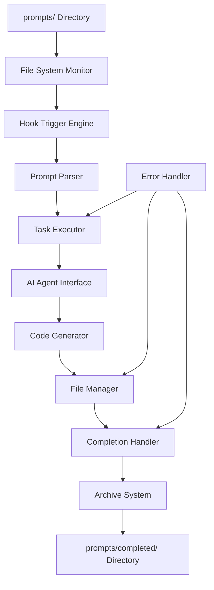

# Design Document

## Overview

The Prompt File Processor Hook is a file system monitoring and automation system that enables developers to submit tasks via simple text files and receive automated implementation through AI assistance. The system provides a seamless workflow from task specification to code generation and file management, with comprehensive security validation, performance monitoring, and integration with existing Kiro systems.

## Architecture

### System Components



### Core Architecture Patterns

#### 1. Event-Driven Processing
- **File System Events**: Monitor `prompts/` directory for new file creation
- **Asynchronous Processing**: Handle multiple prompt files concurrently
- **Event Queue**: Maintain processing queue for reliable execution

#### 2. Pipeline Architecture
```
File Creation → Detection → Parsing → Execution → Completion → Archive
```

#### 3. Error Handling Strategy
- **Graceful Degradation**: Continue processing other files when one fails
- **Retry Logic**: Attempt recovery for transient failures
- **Error Logging**: Comprehensive logging for debugging and monitoring

## Components and Interfaces

### 1. Hook Configuration Interface
```json
{
  "enabled": boolean,
  "name": "prompt-file-processor",
  "description": "Automated prompt file processing and task execution",
  "version": "1.0.0",
  "when": {
    "type": "fileCreated",
    "patterns": ["prompts/*.txt", "prompts/*.md"]
  },
  "then": {
    "type": "askAgent",
    "prompt": "Process this prompt file and execute the requested tasks: {file_content}"
  },
  "config": {
    "max_concurrent_files": 3,
    "max_file_size_mb": 10,
    "processing_timeout_seconds": 300,
    "enable_security_validation": true,
    "archive_completed_files": true,
    "beast_mode_integration": true,
    "spec_structure_compliance": true,
    "performance_monitoring": true
  }
}
```

### 2. Prompt Parser Interface
```python
class PromptParser:
    def parse_prompt(self, file_path: str) -> PromptTask:
        """Parse prompt file and extract task requirements."""
        
    def validate_prompt(self, content: str) -> ValidationResult:
        """Validate prompt format and content."""
```

### 3. Task Executor Interface
```python
class TaskExecutor:
    def execute_task(self, task: PromptTask) -> ExecutionResult:
        """Execute the parsed task through AI assistance."""
        
    def generate_code(self, requirements: List[str]) -> CodeResult:
        """Generate code based on requirements."""
        
    def create_files(self, file_specs: List[FileSpec]) -> FileResult:
        """Create requested files with content."""
```

### 4. File Manager Interface
```python
class FileManager:
    def ensure_directories(self) -> None:
        """Create prompts/ and prompts/completed/ if needed."""
        
    def move_to_completed(self, source_path: str) -> str:
        """Move processed file to completed directory."""
        
    def handle_name_conflicts(self, target_path: str) -> str:
        """Resolve filename conflicts with timestamps."""
        
    def validate_file_safety(self, file_path: str) -> SecurityValidationResult:
        """Validate file path for security (prevent directory traversal)."""
        
    def check_file_size(self, file_path: str) -> bool:
        """Check if file size is within acceptable limits."""
        
    def preserve_failed_files(self, file_path: str) -> None:
        """Keep failed processing files in prompts/ for manual review."""

### 5. Security Validator Interface
```python
class SecurityValidator:
    def validate_file_path(self, path: str) -> ValidationResult:
        """Prevent directory traversal and validate safe paths."""
        
    def sanitize_content(self, content: str) -> str:
        """Sanitize prompt content for safe processing."""
        
    def validate_permissions(self, operation: str, target: str) -> bool:
        """Check if operation is allowed within current permissions."""

### 6. Performance Monitor Interface
```python
class PerformanceMonitor:
    def track_processing_time(self, file_path: str) -> ContextManager:
        """Track processing time for performance metrics."""
        
    def check_resource_usage(self) -> ResourceStatus:
        """Monitor CPU, memory, and disk usage."""
        
    def enforce_concurrency_limits(self) -> bool:
        """Check if new processing can start within limits."""

### 7. Feedback System Interface
```python
class FeedbackSystem:
    def generate_summary(self, result: ExecutionResult) -> ProcessingSummary:
        """Generate user-friendly summary of processing results."""
        
    def log_completion(self, file_path: str, result: ExecutionResult) -> None:
        """Log completion status and details."""
        
    def create_error_report(self, error: Exception, context: Dict) -> ErrorReport:
        """Create detailed error report with remediation suggestions."""
        
    def provide_implementation_feedback(self, created_files: List[str], features: List[str]) -> str:
        """Provide clear feedback about implemented functionality."""

### 8. Integration Manager Interface
```python
class IntegrationManager:
    def apply_beast_mode_patterns(self, code_content: str) -> str:
        """Ensure generated code follows Beast Mode ReflectiveModule pattern."""
        
    def create_spec_structure(self, spec_name: str) -> Dict[str, str]:
        """Create requirements.md, design.md, tasks.md structure."""
        
    def integrate_with_kiro_agent(self, prompt: str) -> str:
        """Interface with Kiro agent system for AI assistance."""
        
    def validate_system_integration(self, changes: List[str]) -> ValidationResult:
        """Ensure changes integrate properly with existing systems."""

### 9. Performance Monitor Interface  
```python
class PerformanceMonitor:
    def track_processing_metrics(self, file_path: str, start_time: float) -> None:
        """Track processing time and resource usage metrics."""
        
    def enforce_resource_limits(self) -> bool:
        """Check and enforce concurrent processing and resource limits."""
        
    def generate_performance_report(self) -> Dict[str, Any]:
        """Generate performance metrics for monitoring and optimization."""
```

## Data Models

### PromptTask
```python
@dataclass
class PromptTask:
    file_path: str
    content: str
    task_type: TaskType
    requirements: List[str]
    target_files: List[str]
    dependencies: List[str]
    metadata: Dict[str, Any]
```

### ExecutionResult
```python
@dataclass
class ExecutionResult:
    success: bool
    created_files: List[str]
    modified_files: List[str]
    summary: str
    errors: List[str]
    execution_time: float
```

### FileSpec
```python
@dataclass
class FileSpec:
    path: str
    content: str
    file_type: str
    permissions: Optional[str]
    overwrite: bool

### ProcessingSummary
```python
@dataclass
class ProcessingSummary:
    file_path: str
    processing_time: float
    created_files: List[str]
    modified_files: List[str]
    implemented_features: List[str]
    success: bool
    error_message: Optional[str]
    remediation_suggestions: List[str]
    beast_mode_compliance: bool
    integration_status: str

### SecurityValidationResult
```python
@dataclass
class SecurityValidationResult:
    is_safe: bool
    violations: List[str]
    sanitized_path: Optional[str]
    
### ResourceStatus
```python
@dataclass
class ResourceStatus:
    cpu_usage_percent: float
    memory_usage_percent: float
    disk_usage_percent: float
    active_processes: int
    can_start_new_process: bool

### ErrorReport
```python
@dataclass
class ErrorReport:
    error_type: str
    error_message: str
    file_path: str
    timestamp: datetime
    context: Dict[str, Any]
    remediation_steps: List[str]
    should_retry: bool
```

## Error Handling

### Error Categories

#### 1. File System Errors
- **Directory Creation Failures**: Permissions, disk space
- **File Access Errors**: Permissions, file locks
- **Move Operation Failures**: Cross-device moves, permissions

#### 2. Parsing Errors
- **Malformed Prompts**: Invalid format, missing requirements
- **Encoding Issues**: Non-UTF-8 files, binary content
- **Size Limitations**: Extremely large prompt files

#### 3. Execution Errors
- **AI Service Failures**: API timeouts, rate limits
- **Code Generation Errors**: Invalid syntax, dependency issues
- **Integration Failures**: Conflicts with existing code

#### 4. System Errors
- **Resource Exhaustion**: Memory, disk space, CPU
- **Network Issues**: External service dependencies
- **Configuration Errors**: Invalid hook configuration

### Error Recovery Strategies

#### 1. Retry Logic
```python
@retry(max_attempts=3, backoff_factor=2)
def execute_with_retry(task: PromptTask) -> ExecutionResult:
    """Execute task with exponential backoff retry."""
```

#### 2. Graceful Degradation
- Continue processing other files when one fails
- Provide partial results when possible
- Maintain system stability during errors

#### 3. Error Reporting
- Detailed error logs with context
- User-friendly error summaries
- Integration with monitoring systems

## Testing Strategy

### Unit Testing
- **Component Isolation**: Test each component independently
- **Mock Dependencies**: Mock file system and AI services
- **Error Simulation**: Test all error conditions

### Integration Testing
- **End-to-End Workflows**: Complete prompt processing cycles
- **File System Integration**: Real file operations
- **Concurrent Processing**: Multiple simultaneous prompts

### Performance Testing
- **Load Testing**: High volume of prompt files
- **Resource Usage**: Memory and CPU consumption
- **Response Time**: Processing latency measurements

### Security Testing
- **Path Traversal**: Malicious file paths
- **Input Validation**: Malformed prompt content
- **Permission Testing**: File system security

## Deployment Considerations

### Configuration Management
- Environment-specific settings
- Feature flags for gradual rollout
- Runtime configuration updates

### Monitoring and Observability
- Processing metrics and success rates
- Error tracking and alerting
- Performance monitoring

### Scalability
- Concurrent processing limits
- Resource usage monitoring
- Queue management for high load

## Integration Points

### Kiro Hook System
- Standard hook configuration format with `fileCreated` trigger type
- Event trigger integration for `.txt` and `.md` files in `prompts/` directory
- Agent execution interface using Kiro's `askAgent` mechanism
- Hook management system registration and monitoring

### Beast Mode Framework
- ReflectiveModule pattern for all major components
- Health monitoring endpoints (`/health`, `/ready`, `/metrics`)
- Systematic error handling with graceful degradation
- PDCA methodology integration for continuous improvement

### Existing System Integration
- Spec structure compliance (requirements.md, design.md, tasks.md)
- Integration with established infrastructure patterns
- Compatibility with current development workflows
- Testing framework integration following project conventions

### File System
- Directory structure conventions (`prompts/` and `prompts/completed/`)
- File permission management and security validation
- Cross-platform compatibility for path handling
- Atomic file operations for reliability

### AI Services
- Kiro agent prompt interface for task execution
- Response parsing and validation with structured output
- Rate limiting and error handling for AI service calls
- Integration with existing AI assistance workflows

## Design Decisions and Rationales

### Decision 1: Hook Trigger Type - `fileCreated` vs `fileDeleted`
**Rationale**: The requirements explicitly specify monitoring for new file creation events, not deletion events. Using `fileCreated` ensures the hook triggers when developers add new prompt files to the directory.

### Decision 2: Beast Mode ReflectiveModule Integration
**Rationale**: Requirements 7.1 and 8.1 mandate integration with Beast Mode framework. All components inherit from ReflectiveModule to provide consistent health monitoring, error handling, and observability across the system.

### Decision 3: Security-First File Processing
**Rationale**: Requirements 6.1-6.5 emphasize security and safety. The design includes comprehensive input validation, path traversal prevention, and safe file operations to prevent security vulnerabilities.

### Decision 4: Failed File Preservation
**Rationale**: Requirement 3.5 specifies that failed processing files should remain in `prompts/` for manual review. This design decision supports debugging and prevents loss of potentially valuable prompt content.

### Decision 5: Performance Monitoring and Resource Management
**Rationale**: Requirements 9.1-9.5 mandate efficient resource usage and performance monitoring. The design includes concurrent processing limits, timeout mechanisms, and comprehensive metrics collection.

### Decision 6: Comprehensive Feedback System
**Rationale**: Requirements 5.1-5.5 require detailed feedback about processing results. The design provides structured summaries, clear error reporting, and implementation details to help users understand what was accomplished.