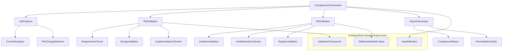

# Design Document

## Overview

The RDI-RM Compliance Check system is designed to systematically validate the 4 commits ahead of main against Beast Mode Framework standards. The system leverages existing Beast Mode infrastructure including the Reflective Module (RM) architecture, health monitoring capabilities, and systematic validation patterns established in Phase 2.

The design follows the Beast Mode principle of "systematic superiority" by providing automated validation that ensures all completed work maintains the framework's high standards before integration.

## Architecture

### Core Components



### Integration Points

The system integrates with existing Beast Mode components:
- **ReflectiveModule Base**: For RM compliance validation
- **Health Monitoring**: For systematic health checks
- **Test Infrastructure**: For validation against the 96.7% baseline
- **Task DAG System**: For task completion reconciliation

## Components and Interfaces

### 1. ComplianceOrchestrator

**Purpose**: Main orchestrator that coordinates all compliance checking activities

```python
class ComplianceOrchestrator(ReflectiveModule):
    """
    Main orchestrator for RDI-RM compliance checking
    Implements systematic validation of commits ahead of main
    """
    
    def analyze_commits_ahead_of_main(self) -> ComplianceAnalysisResult:
        """Analyze the 4 commits ahead of main for compliance"""
        
    def validate_phase2_completion(self) -> Phase2ValidationResult:
        """Validate Phase 2 completion against task list"""
        
    def generate_compliance_report(self) -> ComplianceReport:
        """Generate comprehensive compliance report with remediation steps"""
```

### 2. GitAnalyzer

**Purpose**: Analyzes git commits and file changes

```python
class GitAnalyzer(ReflectiveModule):
    """
    Git analysis component for identifying changes ahead of main
    """
    
    def get_commits_ahead_of_main(self) -> List[CommitInfo]:
        """Get the 4 commits ahead of origin/master"""
        
    def analyze_file_changes(self) -> FileChangeAnalysis:
        """Analyze all modified, added, and deleted files"""
        
    def map_changes_to_tasks(self) -> Dict[str, List[str]]:
        """Map file changes to task completion claims"""
```

### 3. RDIValidator

**Purpose**: Validates Requirements-Design-Implementation methodology compliance

```python
class RDIValidator(ReflectiveModule):
    """
    RDI methodology compliance validator
    Ensures systematic development practices are maintained
    """
    
    def validate_requirement_traceability(self) -> RDITraceabilityResult:
        """Validate that all implementations trace to requirements"""
        
    def check_design_implementation_alignment(self) -> DesignAlignmentResult:
        """Check that implementations match design specifications"""
        
    def validate_test_coverage_against_requirements(self) -> TestCoverageResult:
        """Validate test coverage against the 96.7% baseline and requirements"""
```

### 4. RMValidator

**Purpose**: Validates Reflective Module architectural compliance

```python
class RMValidator(ReflectiveModule):
    """
    RM architectural compliance validator
    Ensures all components follow RM principles
    """
    
    def validate_rm_interface_implementation(self) -> RMInterfaceResult:
        """Validate that new components implement RM interface"""
        
    def check_size_constraints(self) -> SizeConstraintResult:
        """Check that modules are ≤200 lines of code"""
        
    def validate_health_monitoring(self) -> HealthMonitoringResult:
        """Validate health monitoring implementation"""
        
    def check_registry_integration(self) -> RegistryIntegrationResult:
        """Check proper registry integration"""
```

### 5. ReportGenerator

**Purpose**: Generates compliance reports and remediation guidance

```python
class ReportGenerator(ReflectiveModule):
    """
    Compliance report generation with actionable remediation steps
    """
    
    def generate_compliance_summary(self) -> ComplianceSummary:
        """Generate high-level compliance summary"""
        
    def create_remediation_guide(self) -> RemediationGuide:
        """Create specific remediation steps for identified issues"""
        
    def generate_phase3_readiness_report(self) -> Phase3ReadinessReport:
        """Generate readiness assessment for Phase 3 initiation"""
```

## Data Models

### ComplianceAnalysisResult

```python
@dataclass
class ComplianceAnalysisResult:
    """Results of comprehensive compliance analysis"""
    commits_analyzed: List[CommitInfo]
    rdi_compliance: RDIComplianceStatus
    rm_compliance: RMComplianceStatus
    test_coverage_status: TestCoverageStatus
    task_completion_reconciliation: TaskReconciliationStatus
    overall_compliance_score: float
    critical_issues: List[ComplianceIssue]
    recommendations: List[RemediationStep]
```

### ComplianceIssue

```python
@dataclass
class ComplianceIssue:
    """Individual compliance issue with severity and remediation"""
    issue_type: ComplianceIssueType  # RDI_VIOLATION, RM_NON_COMPLIANCE, TEST_FAILURE
    severity: IssueSeverity  # CRITICAL, HIGH, MEDIUM, LOW
    description: str
    affected_files: List[str]
    remediation_steps: List[str]
    estimated_effort: str
    blocking_merge: bool
```

### Phase2ValidationResult

```python
@dataclass
class Phase2ValidationResult:
    """Results of Phase 2 completion validation"""
    claimed_complete_tasks: List[str]
    actually_implemented_tasks: List[str]
    missing_implementations: List[str]
    test_failures_analysis: TestFailureAnalysis
    phase3_readiness_score: float
    blocking_issues: List[ComplianceIssue]
```

## Error Handling

### Systematic Error Recovery

The system implements Beast Mode's systematic error handling approach:

1. **Graceful Degradation**: Continue analysis even if some checks fail
2. **Detailed Error Reporting**: Provide specific error context and remediation steps
3. **Rollback Capability**: Support for reverting problematic commits if needed
4. **Health Monitoring Integration**: Leverage existing health monitoring for error detection

### Error Categories

- **Git Analysis Errors**: Repository access, commit parsing failures
- **RDI Validation Errors**: Missing traceability, design misalignment
- **RM Compliance Errors**: Interface violations, size constraint breaches
- **Test Infrastructure Errors**: Test execution failures, coverage calculation issues

## Testing Strategy

### Test Coverage Requirements

- **Unit Tests**: 95%+ coverage for all compliance checking components
- **Integration Tests**: End-to-end validation of compliance checking workflow
- **Regression Tests**: Validate against known good and bad compliance scenarios
- **Performance Tests**: Ensure compliance checking completes within reasonable time

### Test Data Strategy

- **Mock Git Repository**: Simulated commits with known compliance issues
- **Reference Implementations**: Known good and bad RM implementations
- **Test Scenarios**: Cover all identified compliance issue types
- **Edge Cases**: Handle malformed commits, missing files, corrupted data

### Validation Against Real Data

- **Phase 2 Validation**: Test against actual Phase 2 completion commits
- **Historical Analysis**: Validate against previous known compliance states
- **Cross-Validation**: Compare results with manual compliance reviews

## Implementation Approach

### Phase 1: Core Infrastructure
1. Implement ComplianceOrchestrator with basic workflow
2. Create GitAnalyzer for commit and file change analysis
3. Establish data models and interfaces
4. Implement basic error handling and logging

### Phase 2: RDI Validation
1. Implement RequirementTracer for traceability analysis
2. Create DesignValidator for design-implementation alignment
3. Implement test coverage validation against 96.7% baseline
4. Add specific validation for the 7 failing tests

### Phase 3: RM Validation
1. Implement RMValidator with interface checking
2. Add size constraint validation (≤200 lines)
3. Implement health monitoring validation
4. Add registry integration checking

### Phase 4: Reporting and Integration
1. Implement ReportGenerator with comprehensive reporting
2. Create remediation guidance system
3. Integrate with existing Beast Mode infrastructure
4. Add Phase 3 readiness assessment

### Phase 5: Validation and Optimization
1. Test against actual Phase 2 commits
2. Validate remediation guidance effectiveness
3. Optimize performance for large-scale analysis
4. Create deployment and operational procedures