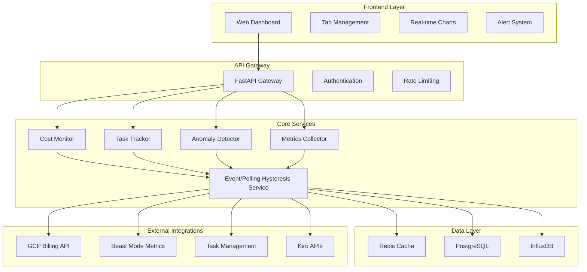

# Design Document

## Overview

The Real-Time Monitoring Dashboard is a comprehensive web-based application that provides systematic visibility into hackathon project health, cost management, and resource utilization. The system integrates with existing GCP billing APIs, Beast Mode metrics, and task management systems to deliver real-time insights with sub-2-second response times and event-based anomaly detection.

## Dependencies

### Required Services
- **Event/Polling Hysteresis Service** (`.kiro/specs/event-polling-hysteresis-service/`) - MUST be implemented first
  - Provides event-driven architecture with polling fallback
  - Handles reconciliation loops and self-healing RCA
  - Manages multi-tenant isolation for hackathon data streams
  - **Blocking Dependency**: Dashboard cannot function without this service

### Integration Dependencies
- **GCP Billing Integration** (`.kiro/specs/gcp-billing-integration/`) - Cost monitoring data source
- **Beast Mode Metrics** - System health and performance data
- **Task Management APIs** - Project completion tracking data

## Architecture

### Core Architectural Principles

#### Event/Polling Hysteresis Pattern
**"Event-first with systematic fallback"** - The system uses the Event/Polling Hysteresis Service (see `.kiro/specs/event-polling-hysteresis-service/`) to provide event-driven updates with automatic polling fallback, reconciliation loops, and self-healing RCA.

#### Systematic Reliability
**"Trust but Verify with Auto-Healing"** - The dashboard leverages the hysteresis service's built-in monitoring, RCA, and self-healing capabilities rather than implementing these patterns directly.

### High-Level Architecture



### Technology Stack

- **Frontend**: React with TypeScript, Chart.js for visualizations, WebSocket for real-time updates
- **Backend**: FastAPI with Python 3.9+, Pydantic for data validation
- **Real-time**: WebSocket connections, Server-Sent Events for alerts
- **Data Storage**: PostgreSQL for structured data, InfluxDB for time-series, Redis for caching
- **Message Queue**: Redis Pub/Sub for event-driven architecture
- **Monitoring**: Prometheus metrics, structured logging with correlation IDs

## Components and Interfaces

### 1. Dashboard Frontend Component

```python
# Frontend Interface (TypeScript)
interface HackathonDashboard {
    hackathonId: string;
    name: string;
    status: ProjectStatus;
    costMetrics: CostMetrics;
    taskMetrics: TaskMetrics;
    tokenMetrics: TokenMetrics;
    alerts: Alert[];
    lastUpdated: timestamp;
}

interface CostMetrics {
    currentSpend: number;
    budgetRemaining: number;
    burnRate: number;
    projectedCost: number;
    anomalyScore: number;
}

interface TaskMetrics {
    completedTasks: number;
    totalTasks: number;
    blockedTasks: number;
    percentComplete: number;
    estimatedCompletion: timestamp;
}
```

### 2. Cost Monitoring Service

```python
from beast_mode.core import ReflectiveModule
from beast_mode.billing.interfaces import BillingProvider
from beast_mode.hysteresis import HysteresisService, DataSourceConfig
from typing import Dict, List, Optional
import asyncio
from datetime import datetime, timedelta

class CostMonitoringService(ReflectiveModule):
    """Cost monitoring using Event/Polling Hysteresis Service"""
    
    def __init__(self, billing_provider: BillingProvider, hysteresis_service: HysteresisService):
        super().__init__()
        self.billing_provider = billing_provider
        self.hysteresis = hysteresis_service
        self.anomaly_detector = CostAnomalyDetector()
        
        # Configure hysteresis for cost data
        self.cost_config = DataSourceConfig(
            name="cost_monitoring",
            event_source=self.billing_provider.get_cost_events,
            polling_source=self.billing_provider.get_current_costs,
            reconciliation_interval=timedelta(minutes=5),
            event_timeout=timedelta(seconds=30)
        )
        
    async def start_monitoring(self, hackathon_id: str):
        """Start cost monitoring with hysteresis pattern"""
        await self.hysteresis.register_data_source(
            hackathon_id, 
            self.cost_config,
            callback=self.process_cost_update
        )
        
    async def process_cost_update(self, hackathon_id: str, cost_data: Dict) -> CostMetrics:
        """Process cost updates from hysteresis service"""
        # Detect anomalies
        anomaly_score = self.anomaly_detector.analyze(cost_data)
        
        # Calculate metrics
        metrics = CostMetrics(
            current_spend=cost_data['total'],
            budget_remaining=cost_data['budget'] - cost_data['total'],
            burn_rate=cost_data.get('burn_rate', 0),
            projected_cost=cost_data.get('projected_cost', 0),
            anomaly_score=anomaly_score
        )
        
        # Check thresholds (hysteresis service handles alerting)
        await self.check_cost_thresholds(hackathon_id, metrics)
        
        return metrics
        
    async def check_cost_thresholds(self, hackathon_id: str, metrics: CostMetrics):
        """Check cost thresholds and emit events"""
        budget_usage = metrics.current_spend / (metrics.current_spend + metrics.budget_remaining)
        
        if budget_usage >= 0.95:
            await self.hysteresis.emit_alert(hackathon_id, AlertLevel.CRITICAL, 
                                           "Budget 95% exhausted", metrics)
        elif budget_usage >= 0.80:
            await self.hysteresis.emit_alert(hackathon_id, AlertLevel.WARNING, 
                                           "Budget 80% exhausted", metrics)
                                           
        if metrics.anomaly_score > 0.8:
            await self.hysteresis.emit_alert(hackathon_id, AlertLevel.WARNING, 
                                           "Cost anomaly detected", metrics)
```

### 3. Task Completion Tracker

```python
class TaskCompletionTracker(ReflectiveModule):
    """Track task completion with weighted progress calculation"""
    
    def __init__(self, task_provider: TaskProvider):
        super().__init__()
        self.task_provider = task_provider
        
    async def calculate_completion(self, hackathon_id: str) -> TaskMetrics:
        """Calculate weighted completion percentage"""
        tasks = await self.task_provider.get_tasks(hackathon_id)
        
        total_weight = sum(task.weight for task in tasks)
        completed_weight = sum(task.weight for task in tasks if task.completed)
        blocked_tasks = [task for task in tasks if task.blocked]
        
        percent_complete = (completed_weight / total_weight) * 100 if total_weight > 0 else 0
        
        # Estimate completion based on velocity
        velocity = await self.calculate_velocity(hackathon_id)
        remaining_work = total_weight - completed_weight
        estimated_completion = datetime.now() + timedelta(
            hours=remaining_work / velocity if velocity > 0 else float('inf')
        )
        
        return TaskMetrics(
            completed_tasks=len([t for t in tasks if t.completed]),
            total_tasks=len(tasks),
            blocked_tasks=len(blocked_tasks),
            percent_complete=percent_complete,
            estimated_completion=estimated_completion
        )
        
    async def identify_completion_gaps(self, hackathon_id: str) -> List[CompletionGap]:
        """Identify gaps preventing completion"""
        tasks = await self.task_provider.get_tasks(hackathon_id)
        gaps = []
        
        # Find critical path blockers
        critical_path = self.calculate_critical_path(tasks)
        for task in critical_path:
            if task.blocked:
                gaps.append(CompletionGap(
                    type="critical_blocker",
                    task_id=task.id,
                    impact_hours=task.estimated_hours,
                    recommended_action=f"Unblock {task.title}"
                ))
                
        return gaps
```

### 4. Anomaly Detection Engine

```python
class AnomalyDetectionEngine(ReflectiveModule):
    """Event-based anomaly detection with statistical analysis"""
    
    def __init__(self):
        super().__init__()
        self.models = {
            'cost': CostAnomalyModel(),
            'token': TokenAnomalyModel(),
            'performance': PerformanceAnomalyModel()
        }
        
    async def detect_anomalies(self, event: MetricEvent) -> List[Anomaly]:
        """Detect anomalies in real-time events"""
        anomalies = []
        
        for model_name, model in self.models.items():
            if model.applies_to(event):
                score = await model.calculate_anomaly_score(event)
                
                if score > model.threshold:
                    anomaly = Anomaly(
                        type=model_name,
                        severity=self.classify_severity(score),
                        event=event,
                        score=score,
                        timestamp=datetime.now(),
                        recommended_actions=model.get_recommendations(event, score)
                    )
                    anomalies.append(anomaly)
                    
        return anomalies
        
    def classify_severity(self, score: float) -> AlertLevel:
        """Classify anomaly severity based on score"""
        if score > 0.9:
            return AlertLevel.CRITICAL
        elif score > 0.7:
            return AlertLevel.WARNING
        else:
            return AlertLevel.INFO
            
    async def correlate_anomalies(self, anomalies: List[Anomaly]) -> List[CorrelatedEvent]:
        """Correlate multiple anomalies to identify root causes"""
        correlations = []
        
        # Group anomalies by time window
        time_groups = self.group_by_time_window(anomalies, window_minutes=5)
        
        for group in time_groups:
            if len(group) > 1:
                correlation = CorrelatedEvent(
                    anomalies=group,
                    root_cause=self.identify_root_cause(group),
                    confidence=self.calculate_correlation_confidence(group)
                )
                correlations.append(correlation)
                
        return correlations
```

### 5. Dashboard WebSocket Service

```python
class DashboardWebSocketService(ReflectiveModule):
    """WebSocket service for real-time dashboard updates"""
    
    def __init__(self, hysteresis_service: HysteresisService):
        super().__init__()
        self.hysteresis = hysteresis_service
        self.connections: Dict[str, List[WebSocket]] = {}
        
    async def subscribe_to_hackathon(self, hackathon_id: str, websocket: WebSocket):
        """Subscribe client to hackathon events via hysteresis service"""
        if hackathon_id not in self.connections:
            self.connections[hackathon_id] = []
        self.connections[hackathon_id].append(websocket)
        
        # Register with hysteresis service for events
        await self.hysteresis.subscribe_to_events(
            hackathon_id, 
            callback=lambda event: self.broadcast_to_clients(hackathon_id, event)
        )
        
    async def broadcast_to_clients(self, hackathon_id: str, event: DashboardEvent):
        """Broadcast event to connected clients"""
        if hackathon_id in self.connections:
            disconnected = []
            
            for websocket in self.connections[hackathon_id]:
                try:
                    await websocket.send_json(event.dict())
                except ConnectionClosed:
                    disconnected.append(websocket)
                    
            # Clean up disconnected clients
            for ws in disconnected:
                self.connections[hackathon_id].remove(ws)
                
    async def get_current_dashboard_state(self, hackathon_id: str) -> DashboardState:
        """Get current dashboard state from hysteresis service"""
        return await self.hysteresis.get_current_state(hackathon_id)
```

## Data Models

### Core Data Structures

```python
from pydantic import BaseModel
from datetime import datetime
from enum import Enum
from typing import List, Optional, Dict, Any

class AlertLevel(str, Enum):
    INFO = "info"
    WARNING = "warning"
    CRITICAL = "critical"

class ProjectStatus(str, Enum):
    ACTIVE = "active"
    PAUSED = "paused"
    COMPLETED = "completed"
    ARCHIVED = "archived"

class CostMetrics(BaseModel):
    current_spend: float
    budget_remaining: float
    burn_rate: float  # dollars per hour
    projected_cost: float
    anomaly_score: float
    last_updated: datetime

class TokenMetrics(BaseModel):
    current_rate: int  # tokens per minute
    total_consumed: int
    cost_per_token: float
    efficiency_score: float
    flood_detected: bool
    last_updated: datetime

class TaskMetrics(BaseModel):
    completed_tasks: int
    total_tasks: int
    blocked_tasks: int
    percent_complete: float
    estimated_completion: Optional[datetime]
    velocity: float  # tasks per day
    last_updated: datetime

class Anomaly(BaseModel):
    id: str
    type: str
    severity: AlertLevel
    hackathon_id: str
    description: str
    score: float
    timestamp: datetime
    recommended_actions: List[str]
    resolved: bool = False
    resolution_time: Optional[datetime] = None

class DashboardEvent(BaseModel):
    """Dashboard-specific events from hysteresis service"""
    hackathon_id: str
    event_type: str
    data: Dict[str, Any]
    timestamp: datetime

class DashboardState(BaseModel):
    """Complete dashboard state for a hackathon"""
    hackathon_id: str
    name: str
    status: ProjectStatus
    cost_metrics: CostMetrics
    task_metrics: TaskMetrics
    token_metrics: TokenMetrics
    alerts: List[Anomaly]
    last_updated: datetime
    hysteresis_health: Dict[str, str]  # Health status from hysteresis service
```

## Error Handling

### Graceful Degradation Strategy

1. **API Failures**: Cache last known good data, display with staleness indicator
2. **Real-time Connection Loss**: Automatic reconnection with exponential backoff
3. **Data Source Unavailable**: Fallback to alternative data sources or cached data
4. **High Load**: Implement circuit breakers and request queuing
5. **Anomaly Detection Failures**: Continue monitoring with reduced sensitivity

### Error Recovery Patterns

```python
class ErrorRecoveryManager:
    """Manage error recovery and fallback strategies"""
    
    async def with_fallback(self, primary_func, fallback_func, cache_key: str):
        """Execute function with fallback and caching"""
        try:
            result = await primary_func()
            await self.cache.set(cache_key, result, ttl=300)
            return result
        except Exception as e:
            self.logger.warning(f"Primary function failed: {e}")
            
            # Try fallback
            try:
                return await fallback_func()
            except Exception as fallback_error:
                self.logger.error(f"Fallback failed: {fallback_error}")
                
                # Return cached data if available
                cached = await self.cache.get(cache_key)
                if cached:
                    return cached
                    
                # Last resort: return safe defaults
                return self.get_safe_defaults()
```

## Testing Strategy

### Test Categories

1. **Unit Tests**: Individual component functionality, anomaly detection algorithms
2. **Integration Tests**: API endpoints, database operations, external service integration
3. **Performance Tests**: Load testing with 1000+ concurrent connections, response time validation
4. **Real-time Tests**: WebSocket connection handling, event broadcasting, anomaly detection timing
5. **Chaos Tests**: Service failure scenarios, network partitions, data corruption recovery

### Test Implementation

```python
# Example performance test
@pytest.mark.asyncio
async def test_dashboard_performance_under_load():
    """Test dashboard performance with high concurrent load"""
    async with AsyncClient(app=app, base_url="http://test") as client:
        # Simulate 100 concurrent dashboard requests
        tasks = []
        for i in range(100):
            task = client.get(f"/api/hackathons/{i}/dashboard")
            tasks.append(task)
            
        start_time = time.time()
        responses = await asyncio.gather(*tasks)
        end_time = time.time()
        
        # Verify all responses successful
        assert all(r.status_code == 200 for r in responses)
        
        # Verify response time under 5 seconds for high load
        assert (end_time - start_time) < 5.0
        
        # Verify individual response times under 2 seconds
        for response in responses:
            assert response.elapsed.total_seconds() < 2.0

# Example anomaly detection test
@pytest.mark.asyncio
async def test_cost_anomaly_detection():
    """Test cost anomaly detection with various patterns"""
    detector = CostAnomalyDetector()
    
    # Normal cost pattern
    normal_costs = [10, 12, 11, 13, 10, 12]
    assert detector.detect_anomaly(normal_costs, 11) < 0.3
    
    # Spike anomaly
    spike_costs = [10, 12, 11, 50, 10, 12]  # 400% spike
    assert detector.detect_anomaly(spike_costs, 50) > 0.8
    
    # Gradual increase (not anomalous)
    gradual_costs = [10, 12, 14, 16, 18, 20]
    assert detector.detect_anomaly(gradual_costs, 20) < 0.5
```

This design provides a comprehensive architecture for your real-time monitoring dashboard with systematic integration of cost tracking, task completion monitoring, and anomaly detection across multiple hackathons.