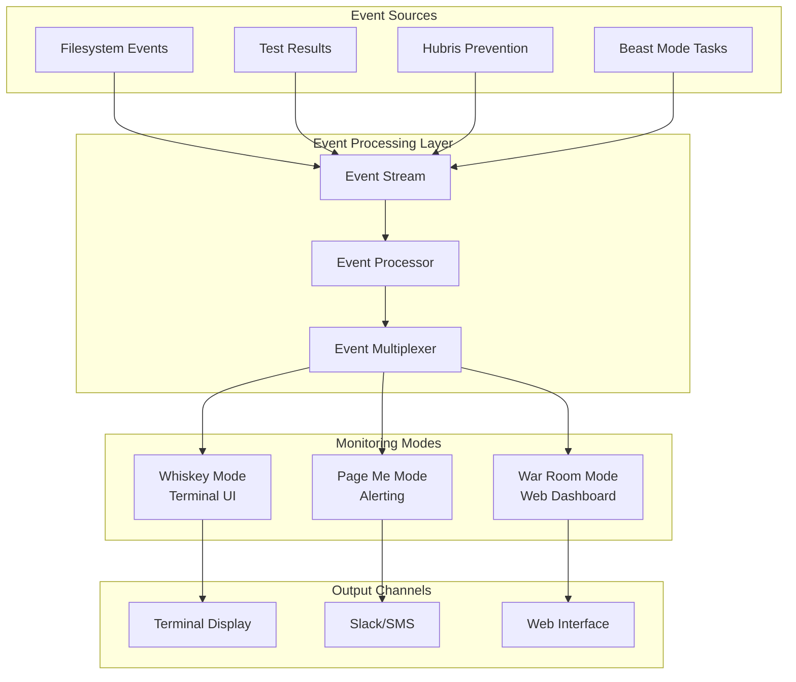

# Design Document

## Overview

The Real-time Monitoring Dashboard implements a scenario-aware monitoring system that adapts its interface and alerting behavior based on user context. The system consumes events from the Beast Mode pipeline and presents them through three distinct modes optimized for different use cases.

## Architecture

### System Architecture



## Components and Interfaces

### Event Stream Manager

**EventStreamManager Interface:**
```python
class EventStreamManager:
    def subscribe(self, event_type: str, callback: Callable) -> str
    def publish(self, event: Event) -> None
    def unsubscribe(self, subscription_id: str) -> None
    def get_event_history(self, event_type: str, duration: timedelta) -> List[Event]
```

### Whiskey Mode - Terminal Dashboard

**WhiskeyModeDisplay Interface:**
```python
class WhiskeyModeDisplay:
    def start_display(self) -> None
    def update_test_results(self, results: TestResults) -> None
    def show_hubris_alert(self, alert: HubrisAlert) -> None
    def animate_success(self, metrics: SuccessMetrics) -> None
    def display_mama_discovery(self, discovery: MamaDiscovery) -> None
```

**Terminal UI Components:**
- **Live Test Matrix**: Real-time grid showing test status with color coding
- **Hubris Prevention Panel**: "Mama Discovery Protocol" status with accountability chains
- **System Health Sparklines**: CPU, memory, test velocity over time
- **Ambient Animations**: Satisfying visual feedback for successful operations
- **Alert Ticker**: Non-intrusive scrolling alerts for attention items

### Implementation Details

**Terminal UI Framework:**
- **Rich/Textual**: Python-based terminal UI with animations
- **60fps Updates**: Smooth animations for satisfying visual feedback
- **Adaptive Layout**: Responsive to terminal size changes
- **Color Coding**: Intuitive status indication (green=good, red=attention)

**Display Features:**
- **Matrix Rain Effect**: Cascading green characters for successful test runs
- **Pulse Animations**: Gentle breathing effects for system health indicators
- **Sparkline Charts**: Mini-charts showing trends over time
- **Status Badges**: Clean, modern status indicators with icons