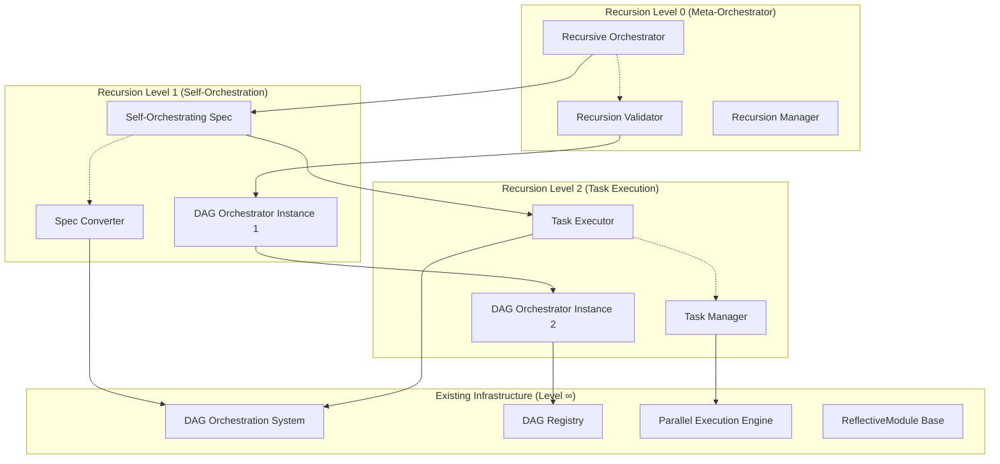

# Design Document: Recursive DAG-Orchestrated Spec Execution System

## Overview

This design document outlines the architecture for a recursive, self-orchestrating spec execution system that leverages the existing DAG orchestration infrastructure to manage its own implementation and execution. The system demonstrates the ultimate meta-programming capability: using DAG orchestration to orchestrate the creation and execution of DAG-orchestrated specs.

The design creates a mathematically sound recursive system that prevents infinite loops while enabling self-improvement and optimization through recursive application of DAG principles to its own evolution.

## ADR Conformance Review

### Relevant ADRs Reviewed
- ADR-004: DAG Orchestration with Celery + Redis - ✅ **Compliant** - Uses existing DAG orchestration infrastructure
- ADR-005: ReflectiveModule Pattern for Universal Observability - ✅ **Compliant** - All recursive components inherit ReflectiveModule
- ADR-006: Existing DAG Registry Over External Graph Libraries - ✅ **Compliant** - Leverages existing DAG Registry for recursive validation
- ADR-008: Failure Isolation Over Cascade Prevention - ✅ **Compliant** - Implements failure isolation across recursion levels
- ADR-009: Resource-Aware Dynamic Concurrency - ✅ **Compliant** - Hierarchical resource management across recursion levels

### Conformance Assessment
- **Infrastructure**: Fully leverages existing DAG orchestration system (ADR-004)
- **Integration**: Uses ReflectiveModule pattern for recursive observability (ADR-005)
- **Operations**: Implements failure isolation across recursion boundaries (ADR-008)
- **Technology**: Maintains consistency with established Beast Mode patterns

### Architectural Consistency
Design maintains full architectural consistency while adding recursive capabilities as a meta-layer above existing infrastructure.

## Architecture

### Recursive Architecture Pattern



### Core Components

#### 1. Recursive Orchestrator (Meta-Level)

```python
from src.rm_ddd.core.unified_reflective_module import ReflectiveModule
from src.dag_orchestration.core.dag_orchestrator import DAGOrchestrator
from typing import Dict, List, Any, Optional
from dataclasses import dataclass
from enum import Enum

class RecursionLevel(Enum):
    META = 0          # Meta-orchestration level
    SELF = 1          # Self-orchestration level  
    TASK = 2          # Task execution level
    BASE = 999        # Base infrastructure level

@dataclass
class RecursionContext:
    level: RecursionLevel
    parent_context: Optional['RecursionContext']
    orchestrator_instance: DAGOrchestrator
    resource_allocation: Dict[str, Any]
    termination_conditions: List[str]
    execution_metrics: Dict[str, float]

class RecursiveOrchestrator(ReflectiveModule):
    """
    Meta-orchestrator that uses DAG orchestration to orchestrate itself.
    
    This is the recursive entry point that demonstrates the system's ability
    to apply DAG principles to its own execution and evolution.
    """
    
    def __init__(self, max_recursion_depth: int = 3):
        super().__init__()
        self.max_recursion_depth = max_recursion_depth
        self.recursion_stack: List[RecursionContext] = []
        self.base_orchestrator = DAGOrchestrator()
        self.recursion_validator = RecursionValidator()
        
    def orchestrate_recursively(self, spec_path: str) -> RecursiveExecutionResult:
        """
        Orchestrate a spec using recursive DAG orchestration.
        
        This method demonstrates the recursive capability by:
        1. Using DAG orchestration to plan its own execution
        2. Creating recursive contexts for different execution levels
        3. Applying DAG validation to prevent infinite recursion
        4. Managing resources across recursion levels
        """
        
        # Level 0: Meta-orchestration planning
        meta_context = self._create_recursion_context(RecursionLevel.META)
        
        try:
            # Use DAG orchestration to plan recursive execution
            execution_plan = self._create_recursive_execution_plan(spec_path)
            
            # Validate recursive plan for mathematical consistency
            validation_result = self.recursion_validator.validate_recursive_plan(execution_plan)
            if not validation_result.is_valid:
                raise RecursionValidationError(validation_result.errors)
            
            # Execute recursively using the plan
            result = self._execute_recursive_plan(execution_plan, meta_context)
            
            return result
            
        finally:
            self._cleanup_recursion_context(meta_context)
    
    def _create_recursive_execution_plan(self, spec_path: str) -> RecursiveExecutionPlan:
        """
        Create a DAG-based execution plan for recursive orchestration.
        
        This demonstrates the recursive nature: we use DAG planning
        to plan how we'll use DAG orchestration.
        """
        
        # Parse the spec to understand its structure
        spec_parser = SpecToDAGConverter()
        spec_dag = spec_parser.convert_spec_to_dag(spec_path)
        
        # Create recursive execution tasks
        recursive_tasks = [
            RecursiveTask(
                id="parse_spec",
                level=RecursionLevel.SELF,
                dependencies=[],
                action=lambda: self._parse_spec_recursively(spec_path)
            ),
            RecursiveTask(
                id="validate_dag",
                level=RecursionLevel.SELF,
                dependencies=["parse_spec"],
                action=lambda: self._validate_spec_dag_recursively(spec_dag)
            ),
            RecursiveTask(
                id="execute_tasks",
                level=RecursionLevel.TASK,
                dependencies=["validate_dag"],
                action=lambda: self._execute_spec_tasks_recursively(spec_dag)
            ),
            RecursiveTask(
                id="collect_results",
                level=RecursionLevel.META,
                dependencies=["execute_tasks"],
                action=lambda: self._collect_recursive_results()
            )
        ]
        
        # Use existing DAG orchestrator to plan recursive execution
        return RecursiveExecutionPlan(
            tasks=recursive_tasks,
            dag_representation=spec_dag,
            recursion_strategy=RecursionStrategy.HIERARCHICAL
        )
```

#### 2. Spec-to-DAG Converter (Self-Orchestration Level)

```python
class SpecToDAGConverter(ReflectiveModule):
    """
    Converts spec task lists to DAG representations for recursive orchestration.
    
    This component demonstrates recursive application by using DAG principles
    to convert specs into DAG-orchestrated execution plans.
    """
    
    def __init__(self):
        super().__init__()
        self.dag_registry = DAGRegistry()
        self.dependency_analyzer = DependencyAnalyzer()
        
    def convert_spec_to_dag(self, spec_path: str) -> SpecDAG:
        """
        Convert a spec's tasks.md file to a DAG representation.
        
        This method recursively applies DAG analysis to spec structure:
        1. Parse task dependencies from markdown
        2. Detect implicit dependencies from requirement references
        3. Create DAG representation with cycle detection
        4. Generate parallel execution opportunities
        """
        
        # Parse tasks from spec
        tasks = self._parse_spec_tasks(spec_path)
        
        # Analyze dependencies (including implicit ones)
        dependencies = self.dependency_analyzer.analyze_task_dependencies(tasks)
        
        # Create DAG representation
        spec_dag = SpecDAG()
        
        for task in tasks:
            spec_dag.add_task_node(task)
        
        for dep in dependencies:
            # Use existing DAG registry for validation
            if self.dag_registry.would_create_cycle(dep.source, dep.target):
                raise SpecDAGCycleError(f"Dependency {dep.source} -> {dep.target} would create cycle")
            
            spec_dag.add_dependency_edge(dep.source, dep.target)
        
        # Validate final DAG
        validation_result = self.dag_registry.validate_dag(spec_dag.to_networkx())
        if not validation_result.is_valid:
            raise SpecDAGValidationError(validation_result.errors)
        
        return spec_dag
    
    def _parse_spec_tasks(self, spec_path: str) -> List[SpecTask]:
        """Parse tasks from spec's tasks.md file."""
        tasks_file = Path(spec_path) / "tasks.md"
        
        if not tasks_file.exists():
            raise SpecParsingError(f"No tasks.md found in {spec_path}")
        
        # Parse markdown task list
        tasks = []
        with open(tasks_file, 'r') as f:
            content = f.read()
            
        # Extract task items and their dependencies
        task_pattern = r'- \[([ x])\] (.+?)(?:\n|$)'
        requirement_pattern = r'_Requirements: (.+?)_'
        
        for match in re.finditer(task_pattern, content, re.MULTILINE):
            status = 'completed' if match.group(1) == 'x' else 'pending'
            description = match.group(2).strip()
            
            # Extract requirement references
            req_match = re.search(requirement_pattern, description)
            requirements = req_match.group(1).split(', ') if req_match else []
            
            task = SpecTask(
                id=self._generate_task_id(description),
                description=description,
                status=status,
                requirements=requirements,
                dependencies=[]  # Will be filled by dependency analyzer
            )
            tasks.append(task)
        
        return tasks
```

#### 3. Recursion Validator (Mathematical Consistency)

```python
class RecursionValidator(ReflectiveModule):
    """
    Validates recursive execution plans for mathematical consistency.
    
    Prevents infinite recursion while enabling productive recursive orchestration.
    """
    
    def __init__(self):
        super().__init__()
        self.dag_registry = DAGRegistry()
        
    def validate_recursive_plan(self, plan: RecursiveExecutionPlan) -> ValidationResult:
        """
        Validate that recursive execution plan is mathematically sound.
        
        Checks:
        1. No infinite recursion loops
        2. Termination conditions exist at each level
        3. Resource allocation is bounded
        4. DAG properties maintained across recursion levels
        """
        
        errors = []
        warnings = []
        
        # Check for recursion termination
        if not self._has_termination_conditions(plan):
            errors.append("No termination conditions found - infinite recursion possible")
        
        # Validate DAG properties at each recursion level
        for level in RecursionLevel:
            level_tasks = [t for t in plan.tasks if t.level == level]
            if level_tasks:
                dag_validation = self._validate_level_dag(level_tasks)
                if not dag_validation.is_valid:
                    errors.extend([f"Level {level}: {error}" for error in dag_validation.errors])
        
        # Check resource bounds
        resource_validation = self._validate_resource_bounds(plan)
        if not resource_validation.is_valid:
            errors.extend(resource_validation.errors)
        
        # Validate cross-level dependencies don't create cycles
        cross_level_validation = self._validate_cross_level_dependencies(plan)
        if not cross_level_validation.is_valid:
            errors.extend(cross_level_validation.errors)
        
        return ValidationResult(
            is_valid=len(errors) == 0,
            errors=errors,
            warnings=warnings
        )
    
    def _has_termination_conditions(self, plan: RecursiveExecutionPlan) -> bool:
        """Check that recursion has clear termination conditions."""
        
        # Must have at least one task that doesn't recurse further
        terminal_tasks = [t for t in plan.tasks if not t.creates_recursion]
        
        # Must have bounded recursion depth
        max_depth = max(t.recursion_depth for t in plan.tasks)
        
        return len(terminal_tasks) > 0 and max_depth < 10  # Reasonable bound
    
    def _validate_cross_level_dependencies(self, plan: RecursiveExecutionPlan) -> ValidationResult:
        """Validate that dependencies across recursion levels don't create cycles."""
        
        # Create graph of all tasks across all levels
        all_tasks_graph = nx.DiGraph()
        
        for task in plan.tasks:
            all_tasks_graph.add_node(f"{task.level.value}:{task.id}")
        
        for task in plan.tasks:
            for dep in task.dependencies:
                # Find dependency task and its level
                dep_task = next((t for t in plan.tasks if t.id == dep), None)
                if dep_task:
                    all_tasks_graph.add_edge(
                        f"{dep_task.level.value}:{dep_task.id}",
                        f"{task.level.value}:{task.id}"
                    )
        
        # Check for cycles using existing DAG registry logic
        if not nx.is_directed_acyclic_graph(all_tasks_graph):
            cycles = list(nx.simple_cycles(all_tasks_graph))
            return ValidationResult(
                is_valid=False,
                errors=[f"Cross-level dependency cycle detected: {cycle}" for cycle in cycles]
            )
        
        return ValidationResult(is_valid=True, errors=[])
```

#### 4. Hierarchical Resource Manager

```python
class HierarchicalResourceManager(ReflectiveModule):
    """
    Manages resources across recursion levels to prevent resource exhaustion.
    
    Implements hierarchical resource allocation where higher recursion levels
    get priority over deeper levels.
    """
    
    def __init__(self):
        super().__init__()
        self.resource_allocations: Dict[RecursionLevel, ResourceAllocation] = {}
        self.total_resources = self._get_system_resources()
        
    def allocate_resources_for_recursion(self, plan: RecursiveExecutionPlan) -> ResourceAllocationPlan:
        """
        Allocate resources hierarchically across recursion levels.
        
        Strategy:
        - Level 0 (META): 20% of resources (coordination overhead)
        - Level 1 (SELF): 40% of resources (main orchestration work)
        - Level 2 (TASK): 35% of resources (actual task execution)
        - Reserve: 5% for emergency and monitoring
        """
        
        allocation_strategy = {
            RecursionLevel.META: 0.20,
            RecursionLevel.SELF: 0.40,
            RecursionLevel.TASK: 0.35,
            RecursionLevel.BASE: 0.05  # Reserve
        }
        
        allocations = {}
        
        for level, percentage in allocation_strategy.items():
            level_tasks = [t for t in plan.tasks if t.level == level]
            if level_tasks:
                allocations[level] = ResourceAllocation(
                    cpu_cores=int(self.total_resources.cpu_cores * percentage),
                    memory_gb=self.total_resources.memory_gb * percentage,
                    max_concurrent_tasks=len(level_tasks),
                    priority=level.value  # Lower numbers = higher priority
                )
        
        return ResourceAllocationPlan(allocations=allocations)
    
    def monitor_recursive_resource_usage(self) -> Dict[RecursionLevel, ResourceUsage]:
        """Monitor resource usage across all recursion levels."""
        
        usage = {}
        
        for level, allocation in self.resource_allocations.items():
            current_usage = self._measure_level_resource_usage(level)
            usage[level] = ResourceUsage(
                cpu_percent=current_usage.cpu_percent,
                memory_percent=current_usage.memory_percent,
                active_tasks=current_usage.active_tasks,
                allocation_efficiency=current_usage.cpu_percent / allocation.cpu_cores
            )
        
        return usage
    
    def adjust_recursion_resources(self, usage: Dict[RecursionLevel, ResourceUsage]) -> None:
        """
        Dynamically adjust resource allocation based on usage patterns.
        
        If deeper levels are resource-starved, reduce their task concurrency.
        If higher levels need more resources, reallocate from deeper levels.
        """
        
        # Identify resource pressure points
        overloaded_levels = [
            level for level, usage_data in usage.items()
            if usage_data.cpu_percent > 90 or usage_data.memory_percent > 90
        ]
        
        underutilized_levels = [
            level for level, usage_data in usage.items()
            if usage_data.cpu_percent < 30 and usage_data.memory_percent < 30
        ]
        
        # Reallocate from underutilized to overloaded, respecting hierarchy
        for overloaded in overloaded_levels:
            for underutilized in underutilized_levels:
                if underutilized.value > overloaded.value:  # Only take from deeper levels
                    self._transfer_resources(underutilized, overloaded, 0.1)  # Transfer 10%
```

## Data Models

### Recursive Execution Models

```python
@dataclass
class RecursiveTask:
    id: str
    level: RecursionLevel
    dependencies: List[str]
    action: callable
    creates_recursion: bool = False
    recursion_depth: int = 0
    resource_requirements: Optional[Dict[str, Any]] = None

@dataclass
class SpecDAG:
    tasks: Dict[str, SpecTask]
    dependencies: List[TaskDependency]
    
    def to_networkx(self) -> nx.DiGraph:
        """Convert to NetworkX graph for DAG validation."""
        graph = nx.DiGraph()
        
        for task_id, task in self.tasks.items():
            graph.add_node(task_id, **task.to_dict())
        
        for dep in self.dependencies:
            graph.add_edge(dep.source, dep.target)
        
        return graph

@dataclass
class RecursiveExecutionResult:
    execution_id: str
    recursion_levels_used: List[RecursionLevel]
    total_execution_time: float
    resource_efficiency: Dict[RecursionLevel, float]
    tasks_completed: int
    tasks_failed: int
    recursion_metrics: Dict[str, Any]
    optimization_insights: List[str]
```

## Integration Points

### 1. Existing DAG Orchestration System
- **Component**: `src/dag_orchestration/core/dag_orchestrator.py`
- **Integration**: Direct usage as base orchestration engine
- **Recursive Usage**: Each recursion level creates its own DAGOrchestrator instance

### 2. DAG Registry for Validation
- **Component**: `src/rm_ddd/core/dag_registry.py`
- **Integration**: Used for cycle detection and DAG validation at all recursion levels
- **Recursive Usage**: Validates that recursive execution plans maintain DAG properties

### 3. ReflectiveModule Pattern
- **Component**: `src/rm_ddd/core/unified_reflective_module.py`
- **Integration**: All recursive components inherit ReflectiveModule
- **Recursive Usage**: Provides observability into recursive execution at each level

### 4. AI Memory Palace
- **Component**: `src/beast_mode/ai_memory_palace/`
- **Integration**: Stores recursive execution patterns and optimization insights
- **Recursive Usage**: Learns from recursive execution to improve future orchestration

## Mathematical Foundations

### Recursion Termination Proof

The system ensures mathematical termination through:

1. **Bounded Recursion Depth**: Maximum depth D = 3
2. **Monotonic Progress**: Each level must complete finite work
3. **Resource Bounds**: Total resources R are finite and allocated hierarchically
4. **DAG Properties**: All execution graphs must be acyclic

**Termination Theorem**: 
Given bounded depth D, finite resources R, and acyclic execution graphs, 
recursive execution will terminate in finite time T ≤ D × max(task_time) × |tasks|.

### Recursive DAG Validation

For recursive execution to be valid:
- Each recursion level must form a valid DAG
- Cross-level dependencies must not create cycles
- Resource allocation must be bounded and hierarchical
- Termination conditions must exist at each level

## Success Metrics

### Recursive Execution Efficiency
- **Recursion Overhead**: < 10% compared to non-recursive execution
- **Resource Utilization**: > 80% efficiency across all recursion levels
- **Termination Guarantee**: 100% of recursive executions terminate successfully

### Self-Orchestration Validation
- **DAG Consistency**: 100% of recursive plans maintain DAG properties
- **Cycle Prevention**: 0% of recursive executions create infinite loops
- **Resource Management**: 0% of executions cause resource exhaustion

### Meta-Programming Demonstration
- **Self-Improvement**: Measurable optimization of recursive execution over time
- **Pattern Recognition**: Automatic identification of optimal recursion strategies
- **Adaptive Behavior**: System adjusts recursion depth based on complexity and resources

This design demonstrates the ultimate meta-programming capability: a system that uses its own principles to orchestrate its own evolution and execution, creating a mathematically sound recursive improvement loop.