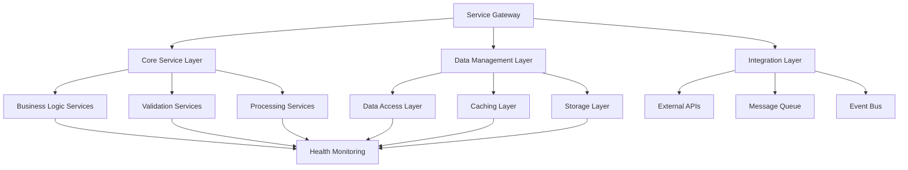

# Reflective Coordinator System Design

## Overview

This design document outlines the technical architecture and implementation approach for Reflective Coordinator System, a Foundation Layer (Layer 1) specification that provides core infrastructure and foundational services for the constellation.

## Architecture

### System Architecture



### Component Architecture

The system follows a layered architecture with clear separation of concerns:

- **Service Gateway**: Entry point for all requests with routing and authentication
- **Core Service Layer**: Business logic and processing services
- **Data Management Layer**: Data access, caching, and storage management
- **Integration Layer**: External system integration and event handling

## Components

### Core Components

#### 1. Service Gateway
**Purpose**: Central entry point for all service requests
**Responsibilities**:
- Request routing and load balancing
- Authentication and authorization
- Rate limiting and throttling
- Request/response logging and monitoring

**Interface**:
```python
class ServiceGateway(ReflectiveModule):
    def route_request(self, request: ServiceRequest) -> ServiceResponse
    def authenticate_request(self, request: ServiceRequest) -> AuthResult
    def apply_rate_limiting(self, request: ServiceRequest) -> RateLimitResult
    def log_request_response(self, request: ServiceRequest, response: ServiceResponse) -> None
```

#### 2. Core Service Manager
**Purpose**: Manages core business logic and processing services
**Responsibilities**:
- Service lifecycle management
- Inter-service communication
- Service health monitoring
- Configuration management

**Interface**:
```python
class CoreServiceManager(ReflectiveModule):
    def register_service(self, service: Service) -> RegistrationResult
    def discover_services(self, criteria: ServiceCriteria) -> List[Service]
    def monitor_service_health(self, service_name: str) -> HealthStatus
    def update_service_config(self, service_name: str, config: ServiceConfig) -> UpdateResult
```

#### 3. Data Access Layer
**Purpose**: Provides unified data access across different storage systems
**Responsibilities**:
- Database connection management
- Query optimization and caching
- Transaction management
- Data consistency and integrity

**Interface**:
```python
class DataAccessLayer(ReflectiveModule):
    def execute_query(self, query: Query) -> QueryResult
    def begin_transaction(self) -> Transaction
    def commit_transaction(self, transaction: Transaction) -> CommitResult
    def rollback_transaction(self, transaction: Transaction) -> RollbackResult
```

#### 4. Integration Manager
**Purpose**: Manages integration with external systems and services
**Responsibilities**:
- External API communication
- Message queue management
- Event publishing and subscription
- Integration monitoring and error handling

**Interface**:
```python
class IntegrationManager(ReflectiveModule):
    def call_external_api(self, api_call: APICall) -> APIResponse
    def publish_event(self, event: Event) -> PublishResult
    def subscribe_to_events(self, subscription: EventSubscription) -> SubscriptionResult
    def monitor_integrations(self) -> IntegrationStatus
```

## Data Models

### Core Data Models

#### ServiceRequest
```python
@dataclass
class ServiceRequest:
    request_id: str
    service_name: str
    operation: str
    parameters: Dict[str, Any]
    headers: Dict[str, str]
    timestamp: datetime
    user_context: UserContext
```

#### ServiceResponse
```python
@dataclass
class ServiceResponse:
    request_id: str
    status_code: int
    data: Any
    headers: Dict[str, str]
    execution_time_ms: float
    error_message: Optional[str]
```

#### Service
```python
@dataclass
class Service:
    service_name: str
    name: str
    version: str
    endpoint: str
    health_check_url: str
    configuration: ServiceConfig
    dependencies: List[str]
    capabilities: List[str]
```

### Configuration Models

#### ServiceConfig
```python
@dataclass
class ServiceConfig:
    max_connections: int
    timeout_seconds: int
    retry_attempts: int
    circuit_breaker_threshold: int
    cache_ttl_seconds: int
    logging_level: str
    monitoring_enabled: bool
```

#### DatabaseConfig
```python
@dataclass
class DatabaseConfig:
    connection_string: str
    pool_size: int
    connection_timeout: int
    query_timeout: int
    retry_policy: RetryPolicy
    encryption_enabled: bool
```

## API Design

### REST API Endpoints

#### Service Management
```
GET /api/v1/services
- List all registered services
- Response: List[Service]

POST /api/v1/services/{service_name}/health
- Check service health
- Response: HealthStatus

PUT /api/v1/services/{service_name}/config
- Update service configuration
- Body: ServiceConfig
- Response: UpdateResult
```

#### Data Operations
```
POST /api/v1/data/query
- Execute data query
- Body: Query
- Response: QueryResult

POST /api/v1/data/transaction
- Begin new transaction
- Response: Transaction

PUT /api/v1/data/transaction/{transaction_id}/commit
- Commit transaction
- Response: CommitResult
```

### Event-Driven Architecture

#### Event Types
```python
class ServiceEvent(BaseEvent):
    service_name: str
    event_type: str
    timestamp: datetime
    data: Dict[str, Any]

class DataEvent(BaseEvent):
    entity_type: str
    entity_id: str
    operation: str
    changes: Dict[str, Any]

class IntegrationEvent(BaseEvent):
    integration_name: str
    status: str
    error_details: Optional[str]
```

## Implementation Details

### Technology Stack

**Core Framework**: Python 3.9+ with Beast Mode ReflectiveModule pattern
**Web Framework**: FastAPI for REST APIs
**Database**: PostgreSQL with SQLAlchemy ORM
**Caching**: Redis for distributed caching
**Message Queue**: RabbitMQ for async messaging
**Monitoring**: Prometheus metrics with Grafana dashboards

### Key Implementation Patterns

#### 1. Repository Pattern for Data Access
```python
class Repository(ABC):
    @abstractmethod
    def find_by_id(self, entity_id: str) -> Optional[Entity]
    
    @abstractmethod
    def find_by_criteria(self, criteria: SearchCriteria) -> List[Entity]
    
    @abstractmethod
    def save(self, entity: Entity) -> SaveResult
    
    @abstractmethod
    def delete(self, entity_id: str) -> DeleteResult
```

#### 2. Circuit Breaker Pattern for External Calls
```python
class CircuitBreaker:
    def __init__(self, failure_threshold: int, recovery_timeout: int):
        self.failure_threshold = failure_threshold
        self.recovery_timeout = recovery_timeout
        self.failure_count = 0
        self.last_failure_time = None
        self.state = CircuitState.CLOSED
    
    def call(self, func: Callable) -> Any:
        if self.state == CircuitState.OPEN:
            if self._should_attempt_reset():
                self.state = CircuitState.HALF_OPEN
            else:
                raise CircuitBreakerOpenException()
        
        try:
            result = func()
            self._on_success()
            return result
        except Exception as e:
            self._on_failure()
            raise e
```

#### 3. Event Sourcing for Audit Trail
```python
class EventStore:
    def append_event(self, stream_id: str, event: Event) -> None
    def get_events(self, stream_id: str, from_version: int = 0) -> List[Event]
    def get_snapshot(self, stream_id: str) -> Optional[Snapshot]
    def save_snapshot(self, stream_id: str, snapshot: Snapshot) -> None
```

## Security Considerations

### Authentication and Authorization
- JWT-based authentication with refresh tokens
- Role-based access control (RBAC) for service operations
- API key management for service-to-service communication
- OAuth 2.0 integration for external authentication providers

### Data Security
- Encryption at rest for sensitive data
- TLS 1.3 for all network communications
- Database connection encryption
- Audit logging for all data access operations

### Network Security
- API gateway with rate limiting and DDoS protection
- Network segmentation between service layers
- Firewall rules for service-to-service communication
- VPN or private network for sensitive operations

## Performance Considerations

### Scalability
- Horizontal scaling with load balancers
- Database read replicas for query optimization
- Distributed caching with Redis cluster
- Async processing for non-critical operations

### Optimization
- Connection pooling for database and external services
- Query optimization with proper indexing
- Caching strategies for frequently accessed data
- Batch processing for bulk operations

## Testing Strategy

### Unit Testing
- Component isolation with dependency injection
- Mock external dependencies
- Test coverage >90% for all core components
- Property-based testing for complex business logic

### Integration Testing
- Database integration testing with test containers
- External API integration testing with mock servers
- Message queue integration testing
- End-to-end workflow testing

### Performance Testing
- Load testing with realistic traffic patterns
- Stress testing to identify breaking points
- Endurance testing for long-running operations
- Scalability testing with increasing load

## Deployment Strategy

### Containerization
- Docker containers for all services
- Multi-stage builds for optimized images
- Health checks and readiness probes
- Resource limits and requests

### Orchestration
- Kubernetes deployment with Helm charts
- Service mesh (Istio) for service communication
- Auto-scaling based on metrics
- Rolling updates with zero downtime

### Monitoring and Observability
- Distributed tracing with Jaeger
- Centralized logging with ELK stack
- Prometheus metrics collection
- Grafana dashboards for visualization

---

**Generated:** 2025-10-06T09:44:58.848769
**Phase:** 3 (Design Development)
**Layer:** Foundation (Layer 1)
**Status:** Complete
