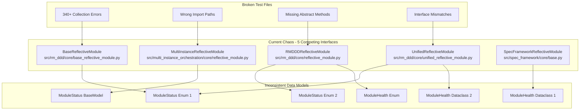
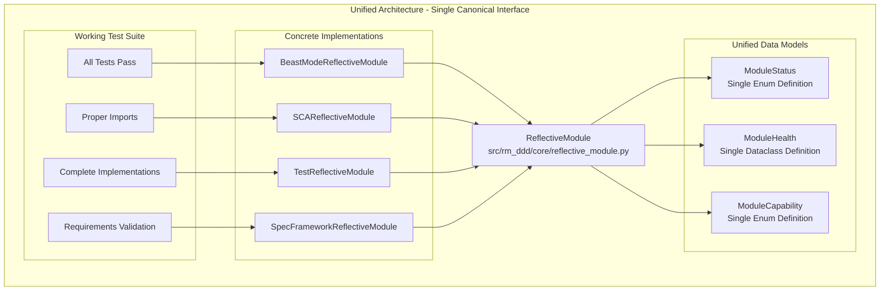

# ReflectiveModule Architecture Consolidation Design

## Overview

This design provides a systematic approach to consolidate 5 competing ReflectiveModule interfaces into a single, canonical architecture that complies with RM-DDD principles. The design emphasizes incremental migration, backward compatibility, and comprehensive validation.

## Current State Analysis

### Problem Architecture (Before)



### Target Architecture (After)



## Design Decisions

### ADR-001: Canonical Interface Selection

**Decision:** Use UnifiedReflectiveModule as the canonical interface
**Rationale:** 
- Most comprehensive feature set (tracing, metrics, CLI integration)
- Already has RDI compliance markers
- Best foundation for future extensions
- Most complete implementation of health monitoring

**Consequences:**
- Other interfaces must be migrated to this signature
- Some features may need to be added to maintain compatibility
- Migration effort is higher but results in better architecture

### ADR-002: Data Model Unification Strategy

**Decision:** Create new unified data models rather than choosing existing ones
**Rationale:**
- Existing models have conflicting definitions
- New models can incorporate best features from all
- Clean slate approach prevents legacy baggage
- Easier to maintain consistency going forward

**Consequences:**
- All existing code must be updated to use new models
- Migration effort is significant but results in clean architecture
- Future maintenance is much easier

### ADR-003: Concrete Implementation Pattern

**Decision:** Create domain-specific concrete classes that inherit from canonical interface
**Rationale:**
- Allows domain-specific customization while maintaining interface consistency
- Enables independent development and testing
- Provides clear boundaries between domains
- Supports RM-DDD principles

**Consequences:**
- More classes to maintain but better separation of concerns
- Each domain can evolve independently
- Clear ownership and responsibility boundaries

### ADR-004: Migration Strategy

**Decision:** Incremental migration with backward compatibility layers
**Rationale:**
- Minimizes risk of breaking existing functionality
- Allows validation at each step
- Enables rollback if issues arise
- Maintains development velocity

**Consequences:**
- Longer migration timeline but safer process
- Temporary complexity during transition
- Need for comprehensive testing at each step

## Implementation Architecture

### Core Components

#### 1. Canonical ReflectiveModule Interface

```python
# src/rm_ddd/core/reflective_module.py
from abc import ABC, abstractmethod
from dataclasses import dataclass
from datetime import datetime
from enum import Enum
from typing import Dict, List, Any, Optional
import uuid

class ModuleStatus(Enum):
    """Unified module status enumeration."""
    HEALTHY = "healthy"
    WARNING = "warning"
    ERROR = "error"
    UNKNOWN = "unknown"
    DEGRADED = "degraded"
    MAINTENANCE = "maintenance"
    INITIALIZING = "initializing"
    ACTIVE = "active"
    INACTIVE = "inactive"

class ModuleCapability(Enum):
    """Unified module capability enumeration."""
    CORE_FUNCTIONALITY = "core_functionality"
    DATA_PROCESSING = "data_processing"
    API_INTEGRATION = "api_integration"
    VALIDATION = "validation"
    MONITORING = "monitoring"
    SCA_ANALYSIS = "sca_analysis"
    COMPLIANCE_CHECKING = "compliance_checking"
    RANDOM_ATTACK = "random_attack"

@dataclass
class ModuleHealth:
    """Unified module health data model."""
    module_id: str
    status: ModuleStatus
    health_score: float
    issues: List[str]
    last_check: datetime
    uptime_seconds: float = 0.0
    error_count: int = 0
    warning_count: int = 0
    performance_metrics: Dict[str, Any] = None

class ReflectiveModule(ABC):
    """Canonical ReflectiveModule interface - RDI Compliant"""
    
    def __init__(self, module_id: Optional[str] = None):
        self.module_id = module_id or f"{self.__class__.__name__}_{uuid.uuid4().hex[:8]}"
        self._start_time = datetime.now()
        self._last_activity = datetime.now()
        self._error_count = 0
        self._warning_count = 0
    
    @abstractmethod
    def get_module_info(self) -> Dict[str, Any]:
        """Get module information - RDI Compliant"""
        pass
    
    @abstractmethod
    def get_capabilities(self) -> List[ModuleCapability]:
        """Get module capabilities - RDI Compliant"""
        pass
    
    @abstractmethod
    def get_health_status(self) -> ModuleHealth:
        """Get module health status - RDI Compliant"""
        pass
    
    @abstractmethod
    def graceful_degradation(self) -> Dict[str, Any]:
        """Perform graceful degradation - RDI Compliant"""
        pass
    
    # Concrete methods for common functionality
    def register_module(self, registry):
        """Register module with registry."""
        metadata = self.get_interface_metadata()
        if hasattr(registry, "register"):
            registry.register(metadata)
    
    def get_interface_metadata(self) -> Dict[str, Any]:
        """Get interface metadata for registry."""
        return {
            "module_id": self.module_id,
            "interface_type": self.__class__.__name__,
            "version": "2.0.0",
            "capabilities": [cap.value for cap in self.get_capabilities()],
            "health_status": self.get_health_status().status.value,
            "created_at": self._start_time.isoformat(),
            "last_updated": datetime.now().isoformat()
        }
```

#### 2. Domain-Specific Concrete Implementations

```python
# src/beast_mode/core/reflective_module.py
from src.rm_ddd.core.reflective_module import ReflectiveModule, ModuleStatus, ModuleHealth, ModuleCapability

class BeastModeReflectiveModule(ReflectiveModule):
    """Beast Mode specific ReflectiveModule implementation."""
    
    def __init__(self, module_id: Optional[str] = None):
        super().__init__(module_id)
        self._beast_mode_capabilities = [
            ModuleCapability.CORE_FUNCTIONALITY,
            ModuleCapability.VALIDATION,
            ModuleCapability.MONITORING
        ]
    
    def get_module_info(self) -> Dict[str, Any]:
        return {
            "module_id": self.module_id,
            "domain": "beast_mode",
            "version": "2.0.0",
            "capabilities": [cap.value for cap in self._beast_mode_capabilities]
        }
    
    def get_capabilities(self) -> List[ModuleCapability]:
        return self._beast_mode_capabilities
    
    def get_health_status(self) -> ModuleHealth:
        return ModuleHealth(
            module_id=self.module_id,
            status=ModuleStatus.HEALTHY,
            health_score=1.0,
            issues=[],
            last_check=datetime.now(),
            uptime_seconds=(datetime.now() - self._start_time).total_seconds(),
            error_count=self._error_count,
            warning_count=self._warning_count
        )
    
    def graceful_degradation(self) -> Dict[str, Any]:
        return {
            "success": True,
            "degraded_capabilities": [],
            "remaining_capabilities": [cap.value for cap in self._beast_mode_capabilities],
            "error_message": None
        }
```

#### 3. Test Migration Strategy

```python
# tests/beast_mode/test_unit.py
from src.beast_mode.core.reflective_module import BeastModeReflectiveModule

class TestBeastMode(unittest.TestCase, BeastModeReflectiveModule):
    """Beast Mode tests using unified ReflectiveModule interface."""
    
    def setUp(self):
        """Set up test fixtures."""
        self.module_id = "test_beast_mode"
        BeastModeReflectiveModule.__init__(self, module_id=self.module_id)
    
    def test_reflective_module_interface_compliance(self):
        """Test ReflectiveModule interface compliance - Requirement 1 from RMI-RM-DDD."""
        # Test get_module_info method
        info = self.get_module_info()
        self.assertIsInstance(info, dict)
        self.assertIn('module_id', info)
        self.assertEqual(info['module_id'], self.module_id)
        
        # Test get_capabilities method
        capabilities = self.get_capabilities()
        self.assertIsInstance(capabilities, list)
        self.assertGreater(len(capabilities), 0)
        
        # Test get_health_status method
        health = self.get_health_status()
        self.assertIsInstance(health, ModuleHealth)
        self.assertEqual(health.module_id, self.module_id)
        
        # Test graceful_degradation method
        degradation = self.graceful_degradation()
        self.assertIsInstance(degradation, dict)
        self.assertIn('success', degradation)
```

## Migration Plan

### Phase 1: Foundation (Week 1)

#### 1.1 Create Unified Data Models
- [ ] Create unified ModuleStatus enum
- [ ] Create unified ModuleHealth dataclass
- [ ] Create unified ModuleCapability enum
- [ ] Add comprehensive type hints and validation

#### 1.2 Define Canonical Interface
- [ ] Create canonical ReflectiveModule abstract base class
- [ ] Implement common concrete methods
- [ ] Add comprehensive documentation
- [ ] Create interface compliance validation

#### 1.3 Implement Base Concrete Classes
- [ ] Create BeastModeReflectiveModule
- [ ] Create SCAReflectiveModule
- [ ] Create TestReflectiveModule
- [ ] Create SpecFrameworkReflectiveModule

### Phase 2: Migration (Week 2)

#### 2.1 Test File Migration
- [ ] Update all test imports to use canonical interface
- [ ] Migrate test classes to use appropriate concrete classes
- [ ] Implement missing abstract methods in test classes
- [ ] Validate test functionality

#### 2.2 Component Migration
- [ ] Update existing components to use canonical interface
- [ ] Migrate data model usage to unified models
- [ ] Update registry and metadata handling
- [ ] Validate component functionality

#### 2.3 Integration Testing
- [ ] Run comprehensive test suite
- [ ] Validate all 340+ errors are resolved
- [ ] Test cross-component interactions
- [ ] Performance validation

### Phase 3: Cleanup (Week 3)

#### 3.1 Deprecation Management
- [ ] Add deprecation warnings to old interfaces
- [ ] Create migration guides for each old interface
- [ ] Update documentation to reference canonical interface
- [ ] Create automated migration tools

#### 3.2 Code Cleanup
- [ ] Remove deprecated ReflectiveModule implementations
- [ ] Clean up backup files and migration artifacts
- [ ] Update all references to use canonical interface
- [ ] Validate no broken references remain

#### 3.3 Documentation Update
- [ ] Update architecture documentation
- [ ] Create developer migration guide
- [ ] Update API documentation
- [ ] Create troubleshooting guide

### Phase 4: Optimization (Week 4)

#### 4.1 Performance Optimization
- [ ] Profile performance of unified interface
- [ ] Optimize common operations
- [ ] Add caching where appropriate
- [ ] Validate performance targets

#### 4.2 Advanced Features
- [ ] Add advanced health monitoring capabilities
- [ ] Implement comprehensive metrics collection
- [ ] Add debugging and diagnostic tools
- [ ] Create monitoring dashboards

#### 4.3 Future-Proofing
- [ ] Add extension points for future capabilities
- [ ] Create plugin architecture for domain-specific features
- [ ] Add versioning support for interface evolution
- [ ] Create migration tools for future changes

## Validation Strategy

### Automated Validation
- **Unit Tests**: Comprehensive test coverage for all interfaces
- **Integration Tests**: Cross-component interaction validation
- **Performance Tests**: Performance regression detection
- **Compliance Tests**: RM-DDD compliance validation

### Manual Validation
- **Code Review**: Peer review of all interface changes
- **Architecture Review**: Validation against architectural principles
- **User Testing**: Developer experience validation
- **Documentation Review**: Completeness and accuracy validation

### Success Metrics
- **Test Suite Health**: 0 collection errors
- **Interface Consistency**: 1 canonical interface
- **Data Model Unity**: 3 unified data models
- **Concrete Implementations**: 4 domain-specific classes
- **Requirements Compliance**: 100% RM-DDD compliance

## Risk Mitigation

### Technical Risks
- **Breaking Changes**: Mitigated by incremental migration and comprehensive testing
- **Performance Issues**: Mitigated by performance benchmarking and optimization
- **Integration Problems**: Mitigated by thorough integration testing

### Process Risks
- **Timeline Delays**: Mitigated by parallel development and early validation
- **Resource Constraints**: Mitigated by clear prioritization and scope management
- **Communication Issues**: Mitigated by comprehensive documentation and regular reviews

## Conclusion

This design provides a systematic approach to consolidating the ReflectiveModule architecture while maintaining backward compatibility and ensuring comprehensive validation. The incremental migration strategy minimizes risk while the unified interface provides a solid foundation for future development.

The key success factors are:
1. **Incremental Migration**: Safe, validated changes
2. **Comprehensive Testing**: Thorough validation at each step
3. **Clear Documentation**: Easy migration and maintenance
4. **Performance Focus**: No degradation in system performance
5. **Future-Proofing**: Extensible architecture for growth
