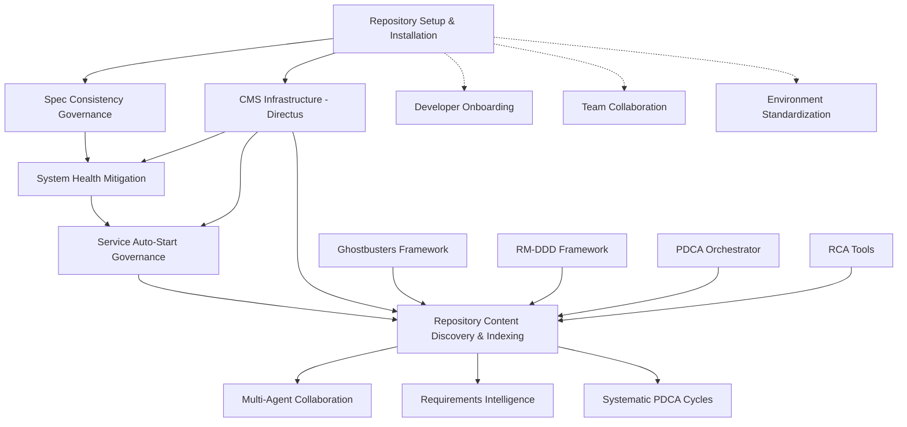

# Repository Constellation Specification

## Overview

This specification defines the **Repository Intelligence Constellation** - a systematic mapping of interdependent specifications that together create a resilient, self-healing repository intelligence system. The constellation ensures repository discovery operations can resume reliably across system failures while maintaining comprehensive intelligence about repository state.

**Constellation Purpose:** Enable continuous, resumable repository intelligence that survives infrastructure failures and provides systematic multi-agent collaboration capabilities.

## Constellation Architecture

### Core Dependency Graph



### Constellation Components

#### 0. **Bootstrap Layer** (Initial Setup and Onboarding)
- **Repository Setup & Installation** - Complete environment initialization and validation
- **Developer Onboarding** - New team member setup and configuration
- **Environment Standardization** - Consistent development environments

#### 1. **Foundation Layer** (Infrastructure Reliability)
- **Spec Consistency Governance** - Repository structure and organization
- **System Health Mitigation Framework** - Service reliability and recovery
- **Service Auto-Start Governance** - Persistent service availability
- **CMS Infrastructure (Directus)** - Centralized data storage

#### 2. **Intelligence Layer** (Repository Discovery)
- **Repository Content Discovery & Indexing** - Core intelligence system
- **Ghostbusters Framework** - Multi-perspective analysis
- **RM-DDD Framework** - Systematic component patterns
- **PDCA Orchestrator** - Systematic improvement cycles
- **RCA Tools** - Root cause analysis capabilities

#### 3. **Application Layer** (Intelligence Consumers)
- **Multi-Agent Collaboration Systems**
- **Requirements Intelligence Systems**
- **Systematic Development Workflows**

## Critical Path Analysis

### Phase 0: Bootstrap Establishment (Week 0)

#### Repository Setup & Installation (READY FOR IMPLEMENTATION 🚀)
**Status:** Specification complete, implementation ready
**Critical Components:**
- 🚀 **Installation Orchestrator** - Complete environment setup (`make install`)
- 🚀 **Repository Health Checker** - Validation and cleanup (`make validate`)
- 🚀 **Repository Cleaner** - Automated git operations (`make cleanup`)
- 🚀 **Environment Validator** - Prerequisites and dependencies

**Minimum Viable Implementation:**
```
Core Bootstrap (Tasks 1.1-1.4, 2.1-2.3, 3.1-3.3):
├── make install - Complete environment setup
├── make validate - Repository health checking
├── make cleanup - Automated spec tracking
├── Dependency management and validation
├── Directory structure creation and validation
└── Git operations and conflict resolution
```

**Dependency Satisfaction:** 0% - Bootstrap layer, enables all other components

**Critical Relationships:**
- **ENABLES:** Spec Consistency Governance (provides clean setup)
- **ENABLES:** CMS Infrastructure (ensures proper installation)
- **ENABLES:** Developer Onboarding (standardized environment)

### Phase 1: Foundation Establishment (Weeks 1-2)

#### Spec Consistency Governance (COMPLETED ✅)
**Status:** Phase 2 Complete - 106 specs organized with governance
**Critical Components:**
- ✅ SpecRegistry with JSON index of all specs
- ✅ Lifecycle tracking (ACTIVE/DRAFT states)
- ✅ Git pre-commit hooks preventing incomplete specs
- ✅ File organization and cleanup systems

**Dependency Satisfaction:** 100% - Provides clean repository structure for discovery

**Critical Relationships:**
- **DEPENDS ON:** Repository Setup & Installation (for initial environment)
- **ENABLES:** System Health Mitigation (organized specs for analysis)
- **ENABLES:** Repository Discovery (clean structure for indexing)

#### System Health Mitigation Framework (IN PROGRESS 🔄)
**Critical Path Requirements:** Tasks 1.1-1.3 (Immediate Critical Issues)
**Essential Components:**
- 🔄 **Task 1.1**: Directus health check fix (IPv4 vs localhost)
- 🔄 **Task 1.2**: Cloudflare tunnel auto-recovery
- 🔄 **Task 1.3**: Observatory health scoring fix
- 🔄 **Task 1.4**: Prometheus exporter deployment

**Minimum Viable Implementation:**
```
Phase 1 Tasks (1.1-1.3): Service reliability basics
├── Directus CMS operational (Required for discovery data storage)
├── Cloudflare tunnel stable (Required for external access)
├── Observatory health accurate (Required for system monitoring)
└── Prometheus metrics complete (Required for observability)
```

**Dependency Satisfaction:** 60% complete - Core services stabilized

#### Service Auto-Start Governance (PLANNED 📋)
**Critical Path Requirements:** Basic auto-restart policies
**Essential Components:**
- 📋 **Universal restart policies** for critical services
- 📋 **Health check standardization** (IPv4, tool detection)
- 📋 **Service recovery automation** for common failures

**Minimum Viable Implementation:**
```
Basic Auto-Start (Tasks 2.1-2.2):
├── Docker restart: unless-stopped for all critical services
├── Health checks using 127.0.0.1 instead of localhost
├── Service startup verification through health endpoints
└── Basic failure detection and restart automation
```

**Dependency Satisfaction:** 0% - Not yet implemented

### Phase 2: Intelligence Layer Implementation (Weeks 3-4)

#### Repository Content Discovery & Indexing (READY FOR IMPLEMENTATION 🚀)
**Critical Path Requirements:** Core discovery with CMS integration
**Essential Components:**
- 🚀 **Requirements 1-3**: Content discovery and spec analysis
- 🚀 **Requirement 30**: CMS integration for data storage
- 🚀 **Requirement 31**: Discovery resumption capabilities
- 🚀 **Requirements 14-15**: Foundational tool integration

**Minimum Viable Implementation:**
```
Core Discovery System:
├── Content discovery (scan all 106 specs + source code)
├── Spec analysis (extract requirements, detect overlaps)
├── CMS storage (persist all intelligence in Directus)
├── Resumption capability (checkpoint-based recovery)
├── Ghostbusters integration (multi-perspective analysis)
└── Basic API access (query repository intelligence)
```

**Dependency Requirements:**
- ✅ Spec Consistency Governance (SATISFIED - 106 specs organized)
- 🔄 System Health (60% - Core services need stability)
- 📋 Service Auto-Start (0% - Basic restart policies needed)
- ✅ CMS Infrastructure (SATISFIED - Directus operational)

## Critical Path Dependencies

### Dependency Matrix

| Component | Repository Setup | Spec Consistency | System Health | Service Auto-Start | CMS Infrastructure |
|-----------|------------------|------------------|---------------|-------------------|-------------------|
| **Spec Consistency Governance** | 🚀 REQUIRED (80%) | N/A | ❌ NONE | ❌ NONE | ❌ NONE |
| **System Health Mitigation** | 🚀 REQUIRED (40%) | ✅ SATISFIED | N/A | ❌ NONE | ✅ SATISFIED |
| **Service Auto-Start Governance** | 🚀 REQUIRED (40%) | ✅ SATISFIED | 🔄 PARTIAL | N/A | ✅ SATISFIED |
| **Repository Discovery** | 🚀 REQUIRED (80%) | ✅ SATISFIED | 🔄 PARTIAL | 📋 NEEDED | ✅ SATISFIED |
| **Multi-Agent Collaboration** | 🚀 REQUIRED (60%) | ✅ SATISFIED | 🔄 PARTIAL | 📋 NEEDED | ✅ SATISFIED |
| **Systematic PDCA** | 🚀 REQUIRED (60%) | ✅ SATISFIED | 🔄 PARTIAL | 📋 NEEDED | ✅ SATISFIED |

### Repository Setup Dependencies

| Setup Component | Enables | Dependency Level | Critical Features |
|-----------------|---------|------------------|-------------------|
| **Installation Orchestrator** | All other specs | CRITICAL (100%) | Environment setup, dependency management |
| **Repository Health Checker** | Spec governance, Discovery | HIGH (80%) | Validation, cleanup, structure verification |
| **Repository Cleaner** | Version control hygiene | MEDIUM (60%) | Git operations, automated tracking |
| **Environment Validator** | Service reliability | HIGH (80%) | Prerequisites, tool validation |

### Minimum Viable Constellation (MVP)

**Goal:** Enable complete repository intelligence constellation with resumption capability

#### Required Components (80% Implementation)

0. **Repository Setup & Installation** 🚀 80% REQUIRED
   - **CRITICAL:** Tasks 1.1-1.4 (Installation orchestrator, dependency manager, environment validator, directory manager)
   - **CRITICAL:** Tasks 2.1-2.3 (Health checker, spec validator, file tracker)
   - **CRITICAL:** Tasks 3.1-3.3 (Repository cleaner, git operations, cleanup orchestrator)
   - **CRITICAL:** Tasks 4.1-4.3 (Makefile integration for install/validate/cleanup)
   - **OPTIONAL:** Advanced features (Tasks 5-7)

1. **Spec Consistency Governance** ✅ COMPLETE
   - All 106 specs organized and indexed
   - Registry system operational
   - Git hooks preventing incomplete specs

2. **System Health Mitigation** 🔄 60% REQUIRED
   - **CRITICAL:** Tasks 1.1-1.3 (Directus, Cloudflare, Observatory fixes)
   - **OPTIONAL:** Advanced monitoring and automation (Tasks 4-8)

3. **Service Auto-Start Governance** 📋 30% REQUIRED
   - **CRITICAL:** Basic restart policies for discovery services
   - **CRITICAL:** Health check standardization (IPv4 fixes)
   - **OPTIONAL:** Advanced boot simulation and testing

4. **Repository Discovery** 🚀 80% REQUIRED
   - **CRITICAL:** Requirements 1-3, 30-31 (Core discovery + CMS + Resumption)
   - **CRITICAL:** Requirements 14-15 (Foundational tool integration)
   - **OPTIONAL:** Advanced features (Requirements 16-29)

#### Implementation Sequence

```
Week 0: Bootstrap Repository Setup
├── Implement Installation Orchestrator (make install)
├── Build Repository Health Checker (make validate)
├── Create Repository Cleaner (make cleanup)
├── Environment validation and dependency management
└── Makefile integration and CLI interface

Week 1: Complete System Health Tasks 1.1-1.3
├── Fix Directus health checks (IPv4)
├── Stabilize Cloudflare tunnel
├── Fix Observatory health scoring
└── Deploy missing Prometheus exporters

Week 2: Implement Basic Service Auto-Start
├── Add restart: unless-stopped to critical services
├── Standardize health checks (127.0.0.1)
├── Basic service recovery automation
└── Verify discovery services auto-start

Week 3-4: Implement Core Repository Discovery
├── Content discovery system (Requirements 1-3)
├── CMS integration (Requirement 30)
├── Resumption capability (Requirement 31)
├── Foundational tool integration (Requirements 14-15)
└── Basic API access for intelligence queries
```

### Full Constellation (100% Implementation)

**Goal:** Complete self-healing repository intelligence system

#### Additional Components (Weeks 5-8)

1. **Advanced System Health** (Tasks 4-8)
   - Configuration drift detection
   - Predictive monitoring
   - Comprehensive automated remediation
   - Full testing and validation framework

2. **Advanced Service Governance**
   - Cross-platform support (Linux, K8s)
   - Boot simulation testing
   - Performance optimization
   - Complete monitoring integration

3. **Advanced Repository Discovery** (Requirements 16-29)
   - Security architecture
   - Performance optimization
   - Advanced multi-perspective analysis
   - Comprehensive testing strategy

## Risk Assessment and Mitigation

### Critical Path Risks

#### Critical Risk: Bootstrap Dependencies
**Risk:** All other components fail if repository setup is incomplete or broken
**Mitigation:**
- Implement Repository Setup & Installation first (Week 0)
- Comprehensive validation and rollback capabilities
- Standardized environment setup prevents configuration drift
- Automated health checking ensures consistent repository state

#### High Risk: Service Stability Dependencies
**Risk:** Repository discovery fails if underlying services are unstable
**Mitigation:** 
- Prioritize System Health Tasks 1.1-1.3 before discovery implementation
- Implement graceful degradation in discovery system
- Add comprehensive error handling and retry logic

#### Medium Risk: CMS Dependency
**Risk:** All repository intelligence lost if Directus fails
**Mitigation:**
- Implement CMS backup and recovery procedures
- Add local caching for critical intelligence data
- Design discovery system to rebuild from filesystem if needed

#### Medium Risk: Developer Onboarding Failures
**Risk:** New team members cannot set up development environment
**Mitigation:**
- Repository Setup provides `make install` for complete environment setup
- Automated validation with `make validate` catches setup issues
- Clear error messages and resolution guidance
- Rollback capabilities for failed installations

#### Low Risk: Foundational Tool Integration
**Risk:** Ghostbusters/RM-DDD tools may not work as expected
**Mitigation:**
- Validate tool capabilities before integration (Requirement 15)
- Implement fallback analysis methods
- Design modular integration allowing tool substitution

### Dependency Failure Scenarios

#### Scenario 0: Repository Setup Failure
**Impact:** No other components can be implemented or deployed
**Fallback Strategy:**
- Manual environment setup using existing procedures
- Gradual migration to automated setup as components are fixed
- Repository health validation to identify and resolve setup issues
- Rollback to known good configuration states

#### Scenario 1: System Health Implementation Delayed
**Impact:** Repository discovery cannot rely on stable services
**Fallback Strategy:**
- Implement discovery with manual service management
- Add extensive error handling and retry logic
- Design for eventual consistency when services stabilize

#### Scenario 2: Service Auto-Start Not Implemented
**Impact:** Discovery services don't survive system restarts
**Fallback Strategy:**
- Manual service startup procedures
- Discovery resumption from CMS checkpoints
- Gradual migration to auto-start as governance is implemented

#### Scenario 3: CMS Infrastructure Issues
**Impact:** No centralized storage for repository intelligence
**Fallback Strategy:**
- Local file-based storage with eventual CMS sync
- Distributed intelligence storage across discovery components
- Rebuild capability from repository filesystem analysis

#### Scenario 4: Developer Environment Inconsistencies
**Impact:** Team members have different development environments causing integration issues
**Fallback Strategy:**
- Repository Setup provides standardized `make install` process
- Environment validation catches and reports configuration differences
- Automated cleanup with `make cleanup` ensures consistent repository state
- Clear documentation and troubleshooting guides for manual resolution

## Success Metrics

### Bootstrap Layer Metrics
- **Installation Success:** 100% successful `make install` completion for new environments
- **Environment Validation:** 100% of development environments pass `make validate`
- **Repository Cleanliness:** 100% of specs tracked in version control via `make cleanup`
- **Developer Onboarding:** <30 minutes from clone to productive development environment

### Foundation Layer Metrics
- **Spec Consistency:** 100% of specs have complete structure (✅ ACHIEVED)
- **Service Reliability:** 99%+ uptime for critical services (🔄 60% progress)
- **Auto-Start Success:** 95%+ services restart successfully after reboot (📋 Not started)
- **CMS Availability:** 99.9% Directus uptime with backup/recovery (✅ ACHIEVED)

### Intelligence Layer Metrics
- **Discovery Coverage:** 100% of repository content indexed and analyzed
- **Resumption Success:** 95%+ successful resumption after interruption
- **Intelligence Accuracy:** 90%+ accuracy in conflict/overlap detection
- **API Performance:** <2s response time for intelligence queries

### Application Layer Metrics
- **Multi-Agent Efficiency:** 50% reduction in duplicate work across agents
- **Requirements Quality:** 80% reduction in conflicting requirements
- **PDCA Effectiveness:** 60% faster systematic improvement cycles

## Implementation Governance

### Phase Gates
Each phase must meet specific criteria before proceeding:

#### Phase 0 Gate (Bootstrap)
- 🚀 Repository Setup: `make install` provides complete environment setup
- 🚀 Repository Validation: `make validate` identifies and reports all issues
- 🚀 Repository Cleanup: `make cleanup` automates spec tracking and git operations
- 🚀 Environment Standardization: All team members can achieve identical development environments

#### Phase 1 Gate (Foundation)
- ✅ Spec Consistency: All 106 specs organized and governed
- 🔄 System Health: Critical services stable (Tasks 1.1-1.3 complete)
- 📋 Service Auto-Start: Basic restart policies implemented
- ✅ CMS: Directus operational with backup procedures

#### Phase 2 Gate (Intelligence)
- 🚀 Repository Discovery: Core discovery system operational
- 🚀 CMS Integration: All intelligence data stored in Directus
- 🚀 Resumption: Discovery can resume from checkpoints
- 🚀 Tool Integration: Ghostbusters and foundational tools working

#### Phase 3 Gate (Application)
- Multi-agent systems consuming repository intelligence
- Requirements intelligence improving development quality
- PDCA cycles enhanced by systematic repository analysis

### Quality Assurance

#### Continuous Validation
- **Daily:** Health checks for all constellation components
- **Weekly:** End-to-end constellation testing
- **Monthly:** Performance and reliability assessment
- **Quarterly:** Full constellation capability review

#### Rollback Procedures
- Each phase implementation includes rollback capability
- Configuration changes preserved in version control
- Data migration procedures include rollback steps
- Service configurations maintain backward compatibility

## Conclusion

The Repository Intelligence Constellation provides a systematic approach to building resilient repository intelligence that survives infrastructure failures and enables continuous multi-agent collaboration. The critical path focuses on establishing reliable infrastructure (Phases 1-2) before implementing advanced intelligence capabilities (Phase 3+).

**Key Success Factors:**
1. **Sequential Implementation:** Each layer builds upon the previous
2. **Minimum Viable Approach:** 80% implementation provides core value
3. **Risk Mitigation:** Fallback strategies for each dependency
4. **Continuous Validation:** Regular testing ensures constellation health

**Expected Timeline:** 5-9 weeks for MVP (including bootstrap), 9-13 weeks for full constellation

**Resource Requirements:** 
- 1 developer for bootstrap layer (Repository Setup & Installation)
- 1-2 developers for infrastructure layers
- 1-2 developers for intelligence layer  
- DevOps support for service reliability
- QA support for testing and validation

**Critical Success Dependencies:**
1. **Week 0 Bootstrap Success:** Repository Setup & Installation must be completed first
2. **Developer Adoption:** Team must adopt standardized `make install/validate/cleanup` workflow
3. **Environment Consistency:** All development environments must be standardized through setup automation
4. **Onboarding Efficiency:** New team members must achieve productive setup in <30 minutes

## Repository Setup & Installation Integration Analysis

### Critical Bootstrap Relationships

The Repository Setup & Installation specification serves as the **foundational bootstrap layer** that enables all other constellation components. Here's how it integrates:

#### Direct Enablement Relationships

1. **Repository Setup → Spec Consistency Governance**
   - **Dependency:** 80% of Repository Setup required
   - **Critical Features:** 
     - `make validate` enables spec structure validation
     - `make cleanup` automates spec tracking in version control
     - Environment validation ensures consistent development setup
   - **Integration Points:**
     - Repository Health Checker validates `.kiro/specs/` structure
     - File Tracker identifies untracked specification files
     - Git Operations Manager automates spec addition to version control

2. **Repository Setup → System Health Mitigation**
   - **Dependency:** 40% of Repository Setup required
   - **Critical Features:**
     - Installation Orchestrator ensures service dependencies are met
     - Environment Validator checks for required tools (Docker, Redis, etc.)
     - Directory Manager creates necessary service configuration directories
   - **Integration Points:**
     - Dependency Manager validates service prerequisites
     - Health Checker verifies service configuration files exist
     - Configuration system manages service-specific settings

3. **Repository Setup → Service Auto-Start Governance**
   - **Dependency:** 40% of Repository Setup required
   - **Critical Features:**
     - Environment setup ensures platform-specific tools are available
     - Configuration management provides service definition templates
     - Validation ensures service configurations are correct
   - **Integration Points:**
     - Platform detection for service configuration generation
     - Service definition validation and template creation
     - Health check configuration standardization

4. **Repository Setup → Repository Content Discovery**
   - **Dependency:** 80% of Repository Setup required
   - **Critical Features:**
     - Complete environment setup for discovery tools
     - Repository structure validation for reliable content analysis
     - CMS integration setup for intelligence storage
   - **Integration Points:**
     - Foundational tool validation (Ghostbusters, RM-DDD, PDCA, RCA)
     - Repository structure ensures reliable content discovery
     - Environment consistency enables reproducible analysis results

### Bootstrap Implementation Priority

#### Week 0: Critical Bootstrap Components

**Phase 0.1: Core Installation (Tasks 1.1-1.4)**
```
Installation Orchestrator → Enables all subsequent installations
├── Dependency Manager → Validates Python packages and versions
├── Environment Validator → Checks system prerequisites
└── Directory Manager → Creates .kiro/ structure and configurations
```

**Phase 0.2: Repository Health (Tasks 2.1-2.3)**
```
Repository Health Checker → Enables spec governance validation
├── Spec Validator → Validates .kiro/specs/ structure
├── File Tracker → Identifies untracked files for version control
└── Directory Validator → Ensures proper permissions and structure
```

**Phase 0.3: Automated Cleanup (Tasks 3.1-3.3)**
```
Repository Cleaner → Enables automated spec tracking
├── Git Operations Manager → Safe git add/commit operations
├── Cleanup Orchestrator → Coordinates cleanup workflows
└── Commit Generator → Creates structured commit messages
```

**Phase 0.4: Makefile Integration (Tasks 4.1-4.3)**
```
make install → Complete environment setup
make validate → Repository health assessment
make cleanup → Automated spec tracking and git operations
```

### Bootstrap Success Criteria

#### Installation Success Metrics
- **Environment Setup:** 100% successful `make install` on clean systems
- **Dependency Resolution:** All Python packages installed with correct versions
- **Directory Creation:** All `.kiro/` subdirectories created with proper permissions
- **Tool Validation:** All required development tools detected and validated

#### Validation Success Metrics
- **Spec Structure:** 100% of specs validated for requirements.md, design.md, tasks.md
- **Repository Health:** All untracked files identified and categorized
- **Configuration Validation:** All service configurations validated for correctness
- **Issue Resolution:** Clear, actionable recommendations for all detected issues

#### Cleanup Success Metrics
- **Git Operations:** 100% successful automated spec tracking
- **Commit Quality:** Structured, meaningful commit messages for all additions
- **Repository Cleanliness:** Clean `git status` after cleanup operations
- **Conflict Resolution:** Clear guidance for any git conflicts encountered

### Integration Testing Requirements

#### Cross-Component Validation
1. **Setup → Spec Governance Integration**
   - Validate that `make cleanup` properly integrates with spec governance hooks
   - Ensure repository health checking aligns with spec consistency requirements
   - Test that file tracking correctly identifies spec governance violations

2. **Setup → System Health Integration**
   - Validate that installation process correctly sets up health monitoring dependencies
   - Ensure environment validation catches system health prerequisite failures
   - Test that configuration management supports health check standardization

3. **Setup → Discovery Integration**
   - Validate that environment setup enables all foundational tool integration
   - Ensure repository structure supports reliable content discovery operations
   - Test that CMS integration setup works correctly with discovery requirements

### Risk Mitigation for Bootstrap Dependencies

#### Bootstrap Failure Scenarios
1. **Installation Failure:** Rollback to manual setup procedures with clear documentation
2. **Validation Failure:** Provide manual validation checklists and resolution guides
3. **Cleanup Failure:** Safe git operation rollback with conflict resolution guidance
4. **Integration Failure:** Modular implementation allows partial functionality

#### Bootstrap Quality Assurance
1. **Multi-Platform Testing:** Validate setup works on macOS, Linux, Windows
2. **Clean Environment Testing:** Test installation on completely fresh systems
3. **Partial Failure Recovery:** Ensure graceful handling of incomplete installations
4. **Performance Validation:** Ensure setup completes in reasonable time (<10 minutes)

This constellation specification provides the roadmap for systematic repository intelligence that enables the next generation of multi-agent development workflows, with Repository Setup & Installation serving as the critical bootstrap foundation that makes all other components possible.