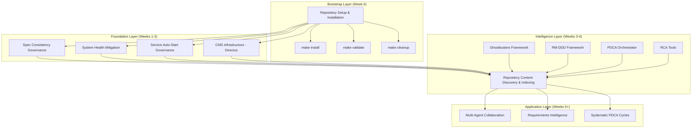

# Repository Constellation Design

## Overview

This design implements a systematic orchestration framework for the Repository Intelligence Constellation - a coordinated set of interdependent specifications that create a resilient, self-healing repository intelligence system. The design addresses the complex dependency relationships between specifications and provides a clear implementation path that ensures each component builds upon a solid foundation.

## Architecture

### Constellation Layers



### Core Components

#### 1. Constellation Orchestrator
```python
class ConstellationOrchestrator(ReflectiveModule):
    """Manages the overall constellation implementation and health."""
    
    def __init__(self):
        super().__init__()
        self.dependency_graph = ConstellationDependencyGraph()
        self.phase_manager = PhaseManager()
        self.health_monitor = ConstellationHealthMonitor()
        self.risk_assessor = RiskAssessmentEngine()
    
    def validate_constellation_readiness(self) -> ConstellationReadiness:
        """Validate that constellation is ready for implementation."""
        
    def execute_phase(self, phase: ConstellationPhase) -> PhaseResult:
        """Execute a specific constellation phase with validation."""
        
    def monitor_constellation_health(self) -> ConstellationHealth:
        """Monitor health across all constellation components."""
        
    def assess_implementation_risks(self) -> RiskAssessment:
        """Assess risks and provide mitigation strategies."""
```

#### 2. Dependency Graph Manager
```python
class ConstellationDependencyGraph(ReflectiveModule):
    """Manages specification dependencies and implementation ordering."""
    
    def __init__(self):
        super().__init__()
        self.specifications = self._load_specifications()
        self.dependency_matrix = self._build_dependency_matrix()
        self.critical_path = self._calculate_critical_path()
    
    def validate_dag_compliance(self) -> DAGValidationResult:
        """Ensure dependency graph is acyclic and mathematically valid."""
        
    def calculate_implementation_order(self) -> List[ImplementationPhase]:
        """Calculate optimal implementation order based on dependencies."""
        
    def assess_dependency_impact(self, spec_name: str) -> DependencyImpact:
        """Assess impact of specification failure on dependent components."""
        
    def optimize_parallel_execution(self) -> ParallelExecutionPlan:
        """Identify specifications that can be implemented in parallel."""
```

#### 3. Phase Manager
```python
class PhaseManager(ReflectiveModule):
    """Manages constellation implementation phases and gate criteria."""
    
    def __init__(self):
        super().__init__()
        self.phases = self._define_constellation_phases()
        self.gate_criteria = self._load_gate_criteria()
        self.success_metrics = self._define_success_metrics()
    
    def validate_phase_readiness(self, phase: ConstellationPhase) -> PhaseReadiness:
        """Validate that phase prerequisites are met."""
        
    def execute_phase_gate(self, phase: ConstellationPhase) -> GateResult:
        """Execute phase gate validation and approval."""
        
    def track_phase_progress(self, phase: ConstellationPhase) -> PhaseProgress:
        """Track progress within a constellation phase."""
        
    def generate_phase_report(self, phase: ConstellationPhase) -> PhaseReport:
        """Generate comprehensive phase completion report."""
```

#### 4. Integration Testing Framework
```python
class ConstellationIntegrationTester(ReflectiveModule):
    """Manages integration testing across constellation components."""
    
    def __init__(self):
        super().__init__()
        self.test_scenarios = self._load_integration_scenarios()
        self.component_interfaces = self._discover_component_interfaces()
        self.test_data_manager = TestDataManager()
    
    def execute_integration_tests(self, components: List[str]) -> IntegrationTestResult:
        """Execute integration tests between specified components."""
        
    def validate_cross_component_data_flow(self) -> DataFlowValidation:
        """Validate data flows correctly between constellation components."""
        
    def test_failure_scenarios(self) -> FailureScenarioResults:
        """Test constellation behavior under component failure conditions."""
        
    def generate_integration_report(self) -> IntegrationReport:
        """Generate comprehensive integration testing report."""
```

### Specification Integration Patterns

#### Bootstrap Integration Pattern
```python
class BootstrapIntegrationPattern:
    """Pattern for integrating Repository Setup & Installation with other specs."""
    
    INTEGRATION_POINTS = {
        'spec_consistency_governance': {
            'dependency_level': 0.8,
            'critical_features': [
                'make_validate_spec_structure',
                'make_cleanup_spec_tracking',
                'repository_health_checking'
            ],
            'integration_validation': 'validate_spec_governance_integration'
        },
        'system_health_mitigation': {
            'dependency_level': 0.4,
            'critical_features': [
                'installation_orchestrator_service_deps',
                'environment_validator_tool_checking',
                'directory_manager_service_configs'
            ],
            'integration_validation': 'validate_health_integration'
        },
        'repository_discovery': {
            'dependency_level': 0.8,
            'critical_features': [
                'environment_setup_discovery_tools',
                'repository_structure_validation',
                'foundational_tool_integration'
            ],
            'integration_validation': 'validate_discovery_integration'
        }
    }
```

#### Foundation Integration Pattern
```python
class FoundationIntegrationPattern:
    """Pattern for integrating foundation layer specifications."""
    
    CROSS_DEPENDENCIES = {
        'spec_consistency_to_health': {
            'provides': ['organized_specs', 'registry_system'],
            'requires': ['service_stability', 'monitoring_infrastructure']
        },
        'health_to_autostart': {
            'provides': ['service_recovery', 'health_monitoring'],
            'requires': ['restart_policies', 'service_definitions']
        },
        'autostart_to_discovery': {
            'provides': ['service_reliability', 'persistent_availability'],
            'requires': ['discovery_services', 'intelligence_storage']
        }
    }
```

### Data Models

#### Constellation State Model
```python
@dataclass
class ConstellationState:
    """Current state of the constellation implementation."""
    
    current_phase: ConstellationPhase
    completed_phases: List[ConstellationPhase]
    active_specifications: List[SpecificationStatus]
    dependency_satisfaction: Dict[str, float]  # spec_name -> completion percentage
    health_status: ConstellationHealth
    risk_level: RiskLevel
    next_actions: List[str]
    estimated_completion: datetime
```

#### Dependency Matrix Model
```python
@dataclass
class DependencyMatrix:
    """Matrix showing specification dependencies and completion requirements."""
    
    specifications: List[str]
    dependencies: Dict[str, Dict[str, float]]  # spec -> {dependency -> percentage_required}
    critical_path: List[str]
    parallel_groups: List[List[str]]
    minimum_viable_requirements: Dict[str, float]
    full_implementation_requirements: Dict[str, float]
```

#### Phase Gate Model
```python
@dataclass
class PhaseGate:
    """Criteria that must be met before proceeding to next phase."""
    
    phase_name: str
    prerequisites: List[str]
    success_criteria: List[SuccessCriterion]
    validation_tests: List[str]
    rollback_procedures: List[str]
    estimated_duration: timedelta
    resource_requirements: ResourceRequirements
```

## Components and Interfaces

### Constellation Management Interface
```python
class ConstellationManager(ReflectiveModule):
    """High-level interface for constellation management operations."""
    
    def initialize_constellation(self) -> ConstellationInitResult:
        """Initialize constellation for implementation."""
    
    def get_constellation_status(self) -> ConstellationStatus:
        """Get current constellation implementation status."""
    
    def execute_next_phase(self) -> PhaseExecutionResult:
        """Execute the next phase in constellation implementation."""
    
    def validate_constellation_health(self) -> HealthValidationResult:
        """Validate health across all constellation components."""
    
    def generate_constellation_report(self) -> ConstellationReport:
        """Generate comprehensive constellation status report."""
```

### Risk Assessment Interface
```python
class RiskAssessmentEngine(ReflectiveModule):
    """Assesses and manages risks across constellation implementation."""
    
    def assess_implementation_risks(self) -> RiskAssessment:
        """Assess risks for current constellation state."""
    
    def evaluate_failure_scenarios(self) -> FailureScenarioAnalysis:
        """Evaluate potential failure scenarios and impacts."""
    
    def generate_mitigation_strategies(self, risks: List[Risk]) -> MitigationPlan:
        """Generate mitigation strategies for identified risks."""
    
    def monitor_risk_indicators(self) -> RiskIndicatorStatus:
        """Monitor early warning indicators for constellation risks."""
```

### Integration Validation Interface
```python
class IntegrationValidator(ReflectiveModule):
    """Validates integration between constellation components."""
    
    def validate_component_integration(self, component_a: str, component_b: str) -> IntegrationResult:
        """Validate integration between two constellation components."""
    
    def test_data_flow_integrity(self, flow_path: List[str]) -> DataFlowResult:
        """Test data flow integrity across component chain."""
    
    def validate_api_compatibility(self, components: List[str]) -> APICompatibilityResult:
        """Validate API compatibility between components."""
    
    def test_failure_isolation(self, failing_component: str) -> FailureIsolationResult:
        """Test that component failures are properly isolated."""
```

## Error Handling

### Constellation Failure Classification
```python
class ConstellationFailureClassifier:
    """Classifies constellation failures for appropriate response."""
    
    FAILURE_TYPES = {
        'bootstrap_failure': {
            'severity': 'critical',
            'impact': 'blocks_all_implementation',
            'mitigation': 'manual_setup_fallback'
        },
        'dependency_violation': {
            'severity': 'high',
            'impact': 'cascade_failure_risk',
            'mitigation': 'dependency_resolution_workflow'
        },
        'integration_failure': {
            'severity': 'medium',
            'impact': 'component_isolation',
            'mitigation': 'component_specific_fallback'
        },
        'performance_degradation': {
            'severity': 'low',
            'impact': 'reduced_efficiency',
            'mitigation': 'optimization_recommendations'
        }
    }
```

### Recovery Strategies
```python
class ConstellationRecoveryManager:
    """Manages recovery strategies for constellation failures."""
    
    def execute_bootstrap_recovery(self) -> RecoveryResult:
        """Execute recovery for bootstrap layer failures."""
        
    def resolve_dependency_conflicts(self, conflicts: List[DependencyConflict]) -> ResolutionResult:
        """Resolve dependency conflicts between specifications."""
        
    def isolate_failing_component(self, component: str) -> IsolationResult:
        """Isolate failing component to prevent cascade failures."""
        
    def restore_from_checkpoint(self, checkpoint: ConstellationCheckpoint) -> RestoreResult:
        """Restore constellation state from previous checkpoint."""
```

## Testing Strategy

### Unit Testing
- **Component Isolation**: Each constellation component tested independently
- **Dependency Mocking**: Mock specification dependencies for isolated testing
- **Error Condition Coverage**: All failure scenarios tested systematically
- **Performance Validation**: Component performance under load tested

### Integration Testing
- **Cross-Component Workflows**: End-to-end constellation workflows tested
- **Dependency Chain Validation**: Complete dependency chains tested
- **Failure Propagation Testing**: Component failure impact tested
- **Data Flow Validation**: Data flows between components validated

### System Testing
- **Complete Constellation Testing**: Full constellation implementation tested
- **Multi-Environment Validation**: Testing across different deployment environments
- **Performance Under Load**: Constellation performance with realistic workloads
- **Disaster Recovery Testing**: Complete failure and recovery scenarios

### Acceptance Testing
- **User Story Validation**: Each requirement acceptance criteria tested
- **Real-World Scenarios**: Actual multi-agent collaboration workflows tested
- **Stakeholder Validation**: Key stakeholders validate constellation capabilities
- **Production Readiness**: Full production deployment scenarios tested

## Security Considerations

### Constellation Security
- **Component Authentication**: Secure authentication between constellation components
- **Data Encryption**: Sensitive constellation data encrypted in transit and at rest
- **Access Control**: Role-based access control for constellation management operations
- **Audit Logging**: Complete audit trails for all constellation operations

### Integration Security
- **API Security**: Secure APIs between constellation components
- **Credential Management**: Secure handling of component credentials and secrets
- **Network Security**: Secure network communication between distributed components
- **Vulnerability Management**: Regular security scanning and vulnerability remediation

## Performance Considerations

### Constellation Performance
- **Parallel Execution**: Maximize parallel implementation where dependencies allow
- **Resource Optimization**: Efficient resource utilization across constellation components
- **Caching Strategy**: Intelligent caching of constellation state and validation results
- **Load Balancing**: Distribute constellation workload across available resources

### Scalability Design
- **Horizontal Scaling**: Support for scaling constellation across multiple systems
- **Component Isolation**: Independent scaling of constellation components
- **Performance Monitoring**: Continuous monitoring of constellation performance metrics
- **Capacity Planning**: Predictive capacity planning for constellation growth

## Deployment Considerations

### Rollout Strategy
1. **Phase 0**: Bootstrap layer implementation and validation
2. **Phase 1**: Foundation layer sequential implementation
3. **Phase 2**: Intelligence layer parallel implementation where possible
4. **Phase 3**: Application layer integration and optimization

### Environment Management
- **Development Environment**: Complete constellation for development and testing
- **Staging Environment**: Production-like constellation for final validation
- **Production Environment**: Optimized constellation for operational workloads
- **Disaster Recovery**: Backup constellation for business continuity

### Monitoring and Observability
- **Health Monitoring**: Continuous health monitoring across all constellation components
- **Performance Metrics**: Comprehensive performance metrics collection and analysis
- **Alerting**: Intelligent alerting for constellation issues and anomalies
- **Dashboards**: Real-time dashboards for constellation status and performance

This design provides a comprehensive framework for implementing and managing the Repository Intelligence Constellation, ensuring systematic coordination of all specifications while maintaining flexibility for evolution and optimization.