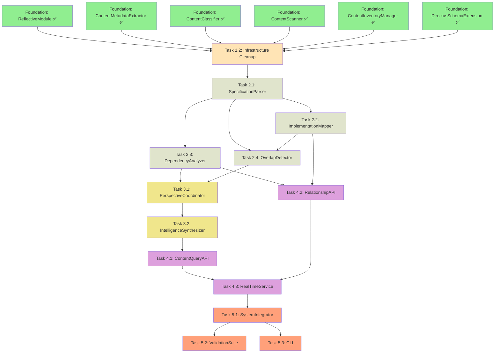

# Repository Content Discovery and Indexing - DAG Task Structure

## Parallel DAG Orchestration Plan

This document defines the task structure optimized for parallel execution by a DAG orchestrator with background execution capabilities.

## Task Dependency Graph (DAG)



## Parallel Execution Opportunities

### Phase 2: Core Analysis (3 parallel tasks after 2.1)
- **T2.2, T2.3** can run in parallel after T2.1 completes
- **T2.4** can start after both T2.1 and T2.2 complete

### Phase 3: Intelligence (1 parallel task)
- **T3.1** waits for T2.3 and T2.4
- **T3.2** waits for T3.1

### Phase 4: API Layer (2 parallel tasks)
- **T4.1** can start after T3.2
- **T4.2** can start after T2.3 and T2.2 (parallel with T4.1)
- **T4.3** waits for both T4.1 and T4.2

## Task Definitions for DAG Orchestrator

### Task 1.2: Infrastructure Cleanup
```yaml
task_id: "infrastructure_cleanup"
dependencies: []
estimated_duration: "4 hours"
parallel_safe: false
script: "scripts/tasks/task_1_2_infrastructure_cleanup.py"
validation: "scripts/validation/validate_task_1_2.py"
```

### Task 2.1: SpecificationParser
```yaml
task_id: "specification_parser"
dependencies: ["infrastructure_cleanup"]
estimated_duration: "8 hours"
parallel_safe: false
script: "scripts/tasks/task_2_1_specification_parser.py"
validation: "scripts/validation/validate_task_2_1.py"
```

### Task 2.2: ImplementationMapper
```yaml
task_id: "implementation_mapper"
dependencies: ["specification_parser"]
estimated_duration: "8 hours"
parallel_safe: true
script: "scripts/tasks/task_2_2_implementation_mapper.py"
validation: "scripts/validation/validate_task_2_2.py"
```

### Task 2.3: DependencyAnalyzer
```yaml
task_id: "dependency_analyzer"
dependencies: ["specification_parser"]
estimated_duration: "8 hours"
parallel_safe: true
script: "scripts/tasks/task_2_3_dependency_analyzer.py"
validation: "scripts/validation/validate_task_2_3.py"
```

### Task 2.4: OverlapDetector
```yaml
task_id: "overlap_detector"
dependencies: ["specification_parser", "implementation_mapper"]
estimated_duration: "8 hours"
parallel_safe: false
script: "scripts/tasks/task_2_4_overlap_detector.py"
validation: "scripts/validation/validate_task_2_4.py"
```

### Task 3.1: PerspectiveCoordinator
```yaml
task_id: "perspective_coordinator"
dependencies: ["dependency_analyzer", "overlap_detector"]
estimated_duration: "8 hours"
parallel_safe: false
script: "scripts/tasks/task_3_1_perspective_coordinator.py"
validation: "scripts/validation/validate_task_3_1.py"
```

### Task 3.2: IntelligenceSynthesizer
```yaml
task_id: "intelligence_synthesizer"
dependencies: ["perspective_coordinator"]
estimated_duration: "8 hours"
parallel_safe: false
script: "scripts/tasks/task_3_2_intelligence_synthesizer.py"
validation: "scripts/validation/validate_task_3_2.py"
```

### Task 4.1: ContentQueryAPI
```yaml
task_id: "content_query_api"
dependencies: ["intelligence_synthesizer"]
estimated_duration: "8 hours"
parallel_safe: true
script: "scripts/tasks/task_4_1_content_query_api.py"
validation: "scripts/validation/validate_task_4_1.py"
```

### Task 4.2: RelationshipAPI
```yaml
task_id: "relationship_api"
dependencies: ["dependency_analyzer", "implementation_mapper"]
estimated_duration: "8 hours"
parallel_safe: true
script: "scripts/tasks/task_4_2_relationship_api.py"
validation: "scripts/validation/validate_task_4_2.py"
```

### Task 4.3: RealTimeService
```yaml
task_id: "real_time_service"
dependencies: ["content_query_api", "relationship_api"]
estimated_duration: "8 hours"
parallel_safe: false
script: "scripts/tasks/task_4_3_real_time_service.py"
validation: "scripts/validation/validate_task_4_3.py"
```

### Task 5.1: SystemIntegrator
```yaml
task_id: "system_integrator"
dependencies: ["real_time_service"]
estimated_duration: "8 hours"
parallel_safe: false
script: "scripts/tasks/task_5_1_system_integrator.py"
validation: "scripts/validation/validate_task_5_1.py"
```

### Task 5.2: ValidationSuite
```yaml
task_id: "validation_suite"
dependencies: ["system_integrator"]
estimated_duration: "4 hours"
parallel_safe: true
script: "scripts/tasks/task_5_2_validation_suite.py"
validation: "scripts/validation/validate_task_5_2.py"
```

### Task 5.3: CLI
```yaml
task_id: "repository_intelligence_cli"
dependencies: ["system_integrator"]
estimated_duration: "4 hours"
parallel_safe: true
script: "scripts/tasks/task_5_3_cli.py"
validation: "scripts/validation/validate_task_5_3.py"
```

## Execution Timeline with Parallelization

### Sequential Timeline: 88 hours (11 days)
### Parallel Timeline: 60 hours (7.5 days)
### Efficiency Gain: 32% reduction in execution time

## Critical Path Analysis
**Critical Path**: T1.2 → T2.1 → T2.4 → T3.1 → T3.2 → T4.3 → T5.1 → T5.2
**Critical Path Duration**: 60 hours

## Resource Requirements
- **Parallel Execution Slots**: Maximum 2 concurrent tasks
- **Memory Requirements**: 4GB per task
- **Disk Space**: 10GB for intermediate artifacts
- **Network**: Minimal (local repository access only)

## Monitoring and Observability
- Each task reports progress every 15 minutes
- Health checks every 5 minutes
- Automatic failure detection and rollback
- Complete audit trail of all operations
- Performance metrics collection

## Error Handling and Recovery
- Automatic retry on transient failures (max 3 attempts)
- Graceful degradation when dependencies fail
- Checkpoint/resume capability for long-running tasks
- Rollback to last known good state on critical failures