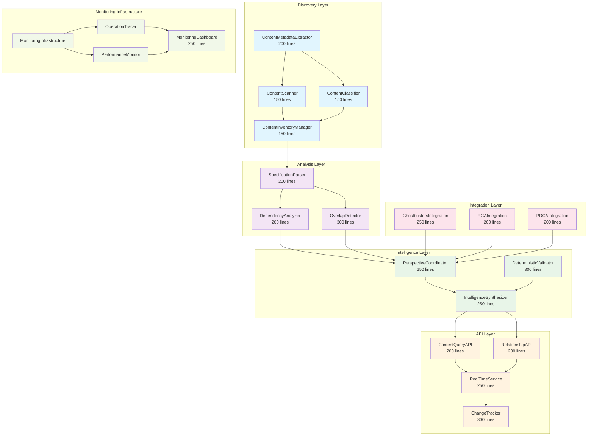
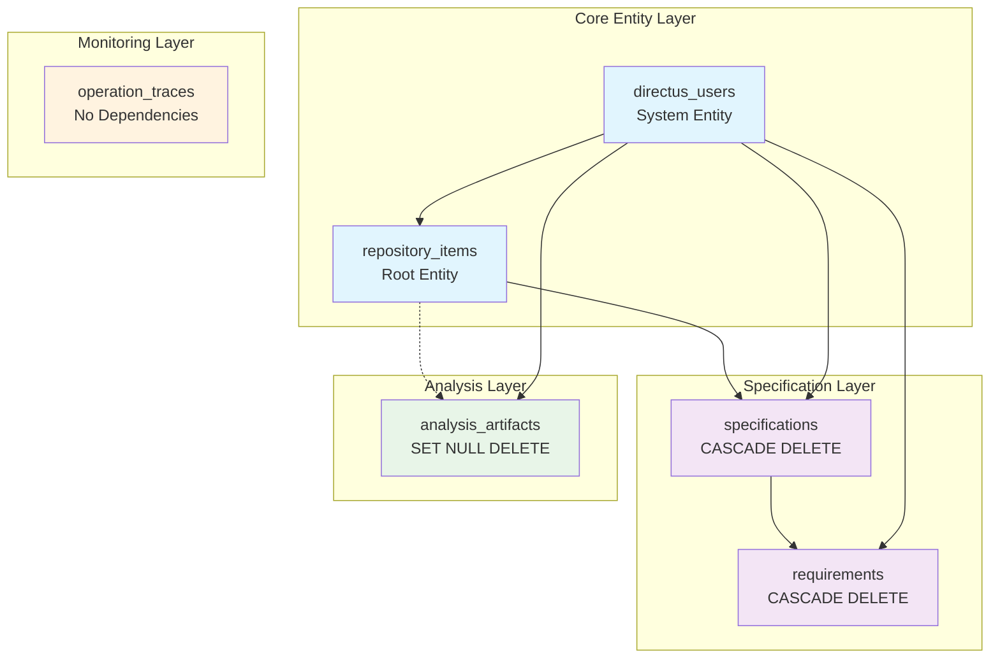

# Repository Content Discovery and Indexing Design

## Overview

The Repository Content Discovery and Indexing system provides systematic discovery, analysis, and indexing of all content within this multi-agent development repository. The design leverages existing foundational tools (Ghostbusters, RM-DDD, RCA, PDCA) and builds upon discovered prior work (Directus implementation from commit 4d2a4e62) to provide comprehensive repository intelligence for multi-agent collaboration.

**Design Principles:**
- **Leverage Existing Work**: Build upon discovered implementations rather than rebuilding from scratch
- **Systematic Discovery**: Use proven foundational tools for analysis and validation
- **Multi-Perspective Intelligence**: Synthesize diverse viewpoints for richer repository understanding
- **Real-Time Awareness**: Provide immediate intelligence for operational decision-making
- **Complete Observability**: "If you can't monitor it, you can't debug it either"
- **No Big Problems, Only Small Ones**: "There are no big problems, only a crap ton of little ones" - Break everything into manageable RM-DDD components under 300 lines

## Architecture

### High-Level Architecture



### Component Architecture

The system follows RM-DDD patterns with clear bounded contexts and complete monitoring integration:

1. **Content Discovery Context**: Systematic discovery of repository content
2. **Intelligence Analysis Context**: Multi-perspective analysis and synthesis  
3. **Repository Intelligence Context**: Structured access and real-time updates
4. **Monitoring Context**: Complete observability and debugging support

## Unified Monitoring-Debugging Architecture

### Core Principle: "If you can't monitor it, you can't debug it either"

Every component must implement the `MonitorableComponent` protocol:

```python
class MonitorableComponent(Protocol):
    def get_monitoring_endpoints(self) -> List[str]
    def get_current_state(self) -> Dict[str, Any]
    def get_health_metrics(self) -> Dict[str, float]
    def get_performance_metrics(self) -> Dict[str, float]
    def get_debug_context(self) -> Dict[str, Any]
    def validate_internal_consistency(self) -> List[str]
    def get_operation_history(self) -> List[Dict[str, Any]]
    def get_decision_log(self) -> List[Dict[str, Any]]
```

## Components and Interfaces

### 1. Content Discovery Components

#### ContentScanner (150 lines)

```python
class ContentScanner(ReflectiveModule, MonitorableComponent):
    """Discovers repository content with complete monitoring integration"""
    
    @monitored_operation
    def discover_all_content(
        self,
        root_path: Path,
        exclusion_patterns: Optional[List[str]] = None,
        max_depth: Optional[int] = None,
        follow_symlinks: bool = False,
        progress_callback: Optional[Callable[[ScanProgress], None]] = None
    ) -> ContentScanResult:
        """
        Systematically scan repository filesystem with comprehensive monitoring.
        
        Performance Requirements:
        - Scan 10,000 files within 30 seconds
        - Memory usage < 500MB for repositories up to 1GB
        - Progress reporting every 1000 files
        
        Raises:
            ContentDiscoveryError: When filesystem access fails
            ValidationError: When exclusion patterns are invalid
            PermissionError: When access is denied
        """
        
    @monitored_operation
    def get_scan_progress(self, scan_id: str) -> ScanProgress:
        """Get real-time progress of ongoing scan operation"""
        
    @monitored_operation
    def cancel_scan(self, scan_id: str) -> bool:
        """Cancel ongoing scan operation gracefully"""
```

#### ContentClassifier (150 lines)

```python
class ContentClassifier(ReflectiveModule, MonitorableComponent):
    """Classifies content types with confidence scoring"""
    
    @monitored_operation
    def classify_content_types(
        self,
        file_paths: List[Path],
        batch_size: int = 100,
        confidence_threshold: float = 0.7,
        include_alternatives: bool = True
    ) -> ClassificationBatch:
        """
        Classify content types with confidence scoring and batch processing.
        
        Performance Requirements:
        - Classify 1000 files within 10 seconds
        - Accuracy > 95% for known file types
        - Confidence calibration within 5% of actual accuracy
        """
        
    @monitored_operation
    def get_classification_confidence(self, file_path: Path) -> float:
        """Get confidence score for single file classification"""
```

#### ContentInventoryManager (150 lines)

```python
class ContentInventoryManager(ReflectiveModule, MonitorableComponent):
    """Manages comprehensive content inventory with change tracking"""
    
    @monitored_operation
    def build_inventory(
        self,
        scan_results: List[ContentScanResult],
        classification_results: List[ClassificationBatch]
    ) -> ContentInventory:
        """
        Build comprehensive inventory from scan and classification results.
        
        Performance Requirements:
        - Process 10,000 items within 60 seconds
        - Memory usage < 1GB for inventories up to 100,000 items
        - Change detection latency < 5 seconds
        """
        
    @monitored_operation
    def detect_changes(self, previous_inventory: ContentInventory) -> List[ContentChange]:
        """Detect changes between inventory versions with git integration"""
```

### 2. Analysis Components

#### SpecificationParser (200 lines)

```python
class SpecificationParser(ReflectiveModule, MonitorableComponent):
    """Analyzes specifications for requirements, dependencies, overlaps"""
    
    @monitored_operation
    def analyze_specification(self, spec_path: Path) -> SpecificationAnalysis:
        """Extract requirements, user stories, acceptance criteria"""
        
    @monitored_operation
    def extract_requirements(self, spec_content: str) -> List[Requirement]:
        """Extract structured requirements from specification content"""
```

#### DependencyAnalyzer (200 lines)

```python
class DependencyAnalyzer(ReflectiveModule, MonitorableComponent):
    """Analyzes dependencies and relationships between specifications"""
    
    @monitored_operation
    def identify_dependencies(self, specs: List[SpecificationAnalysis]) -> DependencyGraph:
        """Identify dependencies, relationships, circular references"""
        
    @monitored_operation
    def detect_circular_dependencies(self, dependency_graph: DependencyGraph) -> List[CircularDependency]:
        """Detect circular dependency chains"""
```

#### OverlapDetector (300 lines)

```python
class OverlapDetector(ReflectiveModule, MonitorableComponent):
    """Detects overlapping functionality and conflicting objectives"""
    
    @monitored_operation
    def detect_overlaps(self, specs: List[SpecificationAnalysis]) -> OverlapMatrix:
        """Detect overlapping functionality and conflicting objectives"""
        
    @monitored_operation
    def create_searchable_index(self, analyses: List[SpecificationAnalysis]) -> SearchIndex:
        """Create searchable knowledge base of requirements"""
```

### 3. Intelligence Components

#### PerspectiveCoordinator (250 lines)

```python
class PerspectiveCoordinator(ReflectiveModule, MonitorableComponent):
    """Coordinates diverse perspectives for richer repository intelligence"""
    
    @monitored_operation
    def engage_diverse_perspectives(self, content: RepositoryContent) -> List[PerspectiveAnalysis]:
        """Engage multiple LLM perspectives (security, architecture, requirements experts)"""
        
    @monitored_operation
    def validate_with_ghostbusters(self, analysis: PerspectiveAnalysis) -> ValidationResult:
        """Use Ghostbusters multi-perspective validation"""
```

#### IntelligenceSynthesizer (250 lines)

```python
class IntelligenceSynthesizer(ReflectiveModule, MonitorableComponent):
    """Synthesizes diverse viewpoints while preserving unique insights"""
    
    @monitored_operation
    def synthesize_perspectives(self, perspectives: List[PerspectiveAnalysis]) -> SynthesizedIntelligence:
        """Synthesize diverse viewpoints while preserving unique insights"""
        
    @monitored_operation
    def resolve_conflicts(self, conflicting_perspectives: List[PerspectiveAnalysis]) -> ConflictResolution:
        """Systematic conflict resolution with confidence scoring"""
```

#### DeterministicValidator (300 lines)

```python
class DeterministicValidator(ReflectiveModule, MonitorableComponent):
    """Validates heuristic insights with deterministic methods"""
    
    @monitored_operation
    def validate_heuristic_insights(self, insights: List[HeuristicInsight]) -> ValidationResults:
        """Validate findings using deterministic methods where possible"""
        
    @monitored_operation
    def calibrate_confidence_scores(self) -> Dict[str, float]:
        """Calibrate confidence scores based on historical accuracy"""
```

### 4. API Components

#### ContentQueryAPI (200 lines)

```python
class ContentQueryAPI(ReflectiveModule, MonitorableComponent):
    """Provides structured API access to repository content"""
    
    @monitored_operation
    def get_content_by_type(self, content_type: ContentType, filters: Dict) -> List[ContentItem]:
        """Get repository content with filtering and sorting"""
        
    @monitored_operation
    def search_content(self, query: str, content_types: List[ContentType]) -> SearchResults:
        """Full-text search across repository content"""
```

#### RelationshipAPI (200 lines)

```python
class RelationshipAPI(ReflectiveModule, MonitorableComponent):
    """Handles relationship traversal and queries"""
    
    @monitored_operation
    def query_relationships(self, item_id: str, relationship_type: RelationshipType) -> List[RelatedItem]:
        """Query relationships between repository items"""
        
    @monitored_operation
    def traverse_dependency_chain(self, start_item: str, max_depth: int) -> DependencyChain:
        """Traverse dependency relationships to specified depth"""
```

#### RealTimeService (250 lines)

```python
class RealTimeService(ReflectiveModule, MonitorableComponent):
    """Provides real-time notifications and updates"""
    
    @monitored_operation
    def get_real_time_updates(self) -> AsyncIterator[ContentUpdate]:
        """Real-time notifications of repository changes"""
        
    @monitored_operation
    def subscribe_to_changes(self, filters: Dict[str, Any]) -> SubscriptionId:
        """Subscribe to filtered change notifications"""
```

#### ChangeTracker (300 lines)

```python
class ChangeTracker(ReflectiveModule, MonitorableComponent):
    """Tracks changes and maintains version history"""
    
    @monitored_operation
    def track_content_changes(self, content_updates: List[ContentUpdate]) -> TrackingResult:
        """Track content changes with versioning"""
        
    @monitored_operation
    def get_change_history(self, item_id: str, time_range: timedelta) -> List[ContentChange]:
        """Get change history for specific item"""
```

## Data Models

### Core Domain Models

Following RM-DDD patterns with proper entities, value objects, and aggregates:

```python
# Entities (have identity)
@dataclass
class RepositoryItem:
    """Entity representing any item in the repository"""
    item_id: str  # Identity
    item_type: ContentType
    path: Path
    metadata: ItemMetadata
    relationships: List[Relationship]

@dataclass  
class SpecificationEntity:
    """Entity representing a specification"""
    spec_id: str  # Identity
    name: str
    requirements: List[Requirement]
    dependencies: List[Dependency]
    status: SpecStatus

# Value Objects (immutable)
@dataclass(frozen=True)
class ContentMetadata:
    """Immutable metadata about repository content"""
    size: int
    created_at: datetime
    modified_at: datetime
    file_type: str
    encoding: str
    content_hash: str

@dataclass(frozen=True)
class Requirement:
    """Immutable requirement from specification"""
    requirement_id: str
    user_story: str
    acceptance_criteria: List[str]
    priority: Priority

# Aggregates (consistency boundaries)
class RepositoryIntelligence:
    """Aggregate root for repository intelligence"""
    
    def __init__(self, repository_id: str):
        self.repository_id = repository_id
        self._items: Dict[str, RepositoryItem] = {}
        self._specifications: Dict[str, SpecificationEntity] = {}
        self._analysis_results: List[AnalysisResult] = []
    
    def add_discovered_content(self, items: List[RepositoryItem]) -> None:
        """Add discovered content maintaining consistency"""
        
    def analyze_specifications(self) -> AnalysisResult:
        """Analyze specifications maintaining consistency boundaries"""
```

### Monitoring Data Models

```python
@dataclass
class OperationTrace:
    """Complete operation trace with performance metrics"""
    trace_id: str
    operation_name: str
    component_name: str
    start_time: datetime
    end_time: Optional[datetime]
    duration: Optional[timedelta]
    input_parameters: Dict[str, Any]
    output_result: Optional[Any]
    error_info: Optional[Dict[str, Any]]
    performance_metrics: Dict[str, float]
    memory_usage: Dict[str, int]
    nested_traces: List['OperationTrace']
    correlation_id: str

@dataclass
class ActivityStep:
    """Individual step in component activity with complete observability"""
    step_id: str
    step_name: str
    component_name: str
    start_state: ActivityState
    end_state: ActivityState
    transition_reason: ActivityTransition
    start_time: datetime
    end_time: Optional[datetime]
    input_data: Dict[str, Any]
    output_data: Optional[Dict[str, Any]]
    decision_points: List[DecisionPoint]
    performance_metrics: Dict[str, float]
    error_info: Optional[Dict[str, Any]]
    trace_id: str

@dataclass
class DecisionPoint:
    """Critical decision point with complete context for debugging"""
    decision_id: str
    decision_name: str
    timestamp: datetime
    input_conditions: Dict[str, Any]
    decision_logic: str
    decision_result: Any
    alternative_outcomes: List[Any]
    confidence_score: float
    reasoning: List[str]
    trace_context: Dict[str, Any]
```

## Referential Integrity Architecture

### Core Principle: Physics-Informed Data Consistency

The referential integrity architecture follows physics-informed principles where data relationships mirror real-world constraints. Every relationship has explicit cascade behaviors that prevent orphaned data and maintain system consistency under all failure conditions.

### Referential Integrity Hierarchy



### Referential Integrity Rules

#### 1. Cascade Deletion Rules

**Strong Consistency (CASCADE DELETE):**
- `specifications` → `repository_items`: When a repository item is deleted, all associated specifications are automatically deleted
- `requirements` → `specifications`: When a specification is deleted, all associated requirements are automatically deleted

**Weak Consistency (SET NULL DELETE):**
- `analysis_artifacts` → `repository_items`: When a repository item is deleted, analysis artifacts remain but lose their association (repository_item_id becomes NULL)

**No Dependencies:**
- `operation_traces`: Monitoring data is preserved independently for audit purposes

#### 2. Update Cascade Rules

**All foreign key relationships use CASCADE UPDATE:**
- Primary key changes propagate automatically through the entire hierarchy
- Maintains referential integrity during data migrations and UUID regeneration

#### 3. Constraint Validation

**NOT NULL Constraints:**
- All primary keys and critical foreign keys are NOT NULL
- Optional relationships (like analysis_artifacts.repository_item_id) allow NULL for flexibility

**Data Type Constraints:**
- UUIDs for all primary and foreign keys ensure global uniqueness
- JSONB for structured data with validation at application layer
- VARCHAR with explicit length limits prevent unbounded growth

### Extended Directus Schema

Building upon the existing 5-collection Directus schema from commit 4d2a4e62:

```sql
-- Repository Discovery Directus Schema Extension
-- Generated with explicit referential integrity constraints
-- Extends existing 5-collection pattern with repository content

-- Create repository_items table (Root Entity)
CREATE TABLE repository_items (
    id UUID PRIMARY KEY DEFAULT gen_random_uuid(),
    item_type VARCHAR(50) NOT NULL,
    path VARCHAR(1000) NOT NULL,
    name VARCHAR(255) NOT NULL,
    content_hash VARCHAR(64),
    file_size INTEGER,
    mime_type VARCHAR(100),
    encoding VARCHAR(50),
    is_binary BOOLEAN NOT NULL DEFAULT FALSE,
    line_count INTEGER,
    date_created TIMESTAMP DEFAULT CURRENT_TIMESTAMP,
    date_updated TIMESTAMP DEFAULT CURRENT_TIMESTAMP,
    user_created UUID REFERENCES directus_users(id),
    user_updated UUID REFERENCES directus_users(id)
);

-- Indexes for repository_items
CREATE INDEX idx_repository_items_item_type ON repository_items(item_type);
CREATE INDEX idx_repository_items_path ON repository_items(path);
CREATE INDEX idx_repository_items_content_hash ON repository_items(content_hash);

-- Create specifications table (Strong Dependency)
CREATE TABLE specifications (
    id UUID PRIMARY KEY DEFAULT gen_random_uuid(),
    repository_item_id UUID NOT NULL,
    spec_name VARCHAR(255) NOT NULL,
    status VARCHAR(20) NOT NULL DEFAULT 'draft',
    priority INTEGER NOT NULL DEFAULT 3,
    date_created TIMESTAMP DEFAULT CURRENT_TIMESTAMP,
    date_updated TIMESTAMP DEFAULT CURRENT_TIMESTAMP,
    user_created UUID REFERENCES directus_users(id),
    user_updated UUID REFERENCES directus_users(id)
);

-- Indexes for specifications
CREATE INDEX idx_specifications_status ON specifications(status);
CREATE INDEX idx_specifications_priority ON specifications(priority);

-- Foreign key constraints for specifications (CASCADE DELETE)
ALTER TABLE specifications ADD CONSTRAINT fk_specifications_repository_item_id 
    FOREIGN KEY (repository_item_id) REFERENCES repository_items(id) 
    ON UPDATE CASCADE ON DELETE CASCADE;

-- Create requirements table (Strong Dependency Chain)
CREATE TABLE requirements (
    id UUID PRIMARY KEY DEFAULT gen_random_uuid(),
    specification_id UUID NOT NULL,
    requirement_number VARCHAR(50) NOT NULL,
    user_story TEXT NOT NULL,
    acceptance_criteria JSONB NOT NULL,
    priority INTEGER NOT NULL DEFAULT 3,
    status VARCHAR(20) NOT NULL DEFAULT 'draft',
    date_created TIMESTAMP DEFAULT CURRENT_TIMESTAMP,
    date_updated TIMESTAMP DEFAULT CURRENT_TIMESTAMP,
    user_created UUID REFERENCES directus_users(id),
    user_updated UUID REFERENCES directus_users(id)
);

-- Indexes for requirements
CREATE INDEX idx_requirements_spec_id ON requirements(specification_id);
CREATE INDEX idx_requirements_status ON requirements(status);

-- Foreign key constraints for requirements (CASCADE DELETE)
ALTER TABLE requirements ADD CONSTRAINT fk_requirements_specification_id 
    FOREIGN KEY (specification_id) REFERENCES specifications(id) 
    ON UPDATE CASCADE ON DELETE CASCADE;

-- Create analysis_artifacts table (Weak Dependency)
CREATE TABLE analysis_artifacts (
    id UUID PRIMARY KEY DEFAULT gen_random_uuid(),
    repository_item_id UUID,  -- Nullable for weak dependency
    analysis_type VARCHAR(50) NOT NULL,
    analysis_data JSONB NOT NULL,
    confidence_score DECIMAL(3,2) NOT NULL DEFAULT 1.0,
    generated_by VARCHAR(100),
    correlation_id VARCHAR(100),
    date_created TIMESTAMP DEFAULT CURRENT_TIMESTAMP,
    date_updated TIMESTAMP DEFAULT CURRENT_TIMESTAMP,
    user_created UUID REFERENCES directus_users(id),
    user_updated UUID REFERENCES directus_users(id)
);

-- Indexes for analysis_artifacts
CREATE INDEX idx_analysis_artifacts_type ON analysis_artifacts(analysis_type);
CREATE INDEX idx_analysis_artifacts_correlation ON analysis_artifacts(correlation_id);

-- Foreign key constraints for analysis_artifacts (SET NULL DELETE)
ALTER TABLE analysis_artifacts ADD CONSTRAINT fk_analysis_artifacts_repository_item_id 
    FOREIGN KEY (repository_item_id) REFERENCES repository_items(id) 
    ON UPDATE CASCADE ON DELETE SET NULL;

-- Create operation_traces table (Independent Monitoring)
CREATE TABLE operation_traces (
    id UUID PRIMARY KEY DEFAULT gen_random_uuid(),
    trace_id VARCHAR(255) NOT NULL,
    operation_name VARCHAR(255) NOT NULL,
    component_name VARCHAR(255) NOT NULL,
    duration_ms DECIMAL(10,3),
    input_parameters JSONB,
    output_result JSONB,
    error_info JSONB,
    correlation_id VARCHAR(255) NOT NULL,
    date_created TIMESTAMP DEFAULT CURRENT_TIMESTAMP,
    date_updated TIMESTAMP DEFAULT CURRENT_TIMESTAMP,
    user_created UUID REFERENCES directus_users(id),
    user_updated UUID REFERENCES directus_users(id)
);

-- Indexes for operation_traces
CREATE INDEX idx_operation_traces_trace_id ON operation_traces(trace_id);
CREATE INDEX idx_operation_traces_operation ON operation_traces(operation_name);
CREATE INDEX idx_operation_traces_correlation ON operation_traces(correlation_id);

-- No foreign key constraints for operation_traces (independent monitoring data)
```

### Referential Integrity Validation

#### Constraint Validation Functions

```sql
-- Function to validate referential integrity across the entire schema
CREATE OR REPLACE FUNCTION validate_repository_integrity() 
RETURNS TABLE(table_name TEXT, constraint_name TEXT, violation_count INTEGER) AS $$
BEGIN
    -- Check for orphaned specifications
    RETURN QUERY
    SELECT 'specifications'::TEXT, 'fk_specifications_repository_item_id'::TEXT, 
           COUNT(*)::INTEGER
    FROM specifications s
    LEFT JOIN repository_items ri ON s.repository_item_id = ri.id
    WHERE ri.id IS NULL;
    
    -- Check for orphaned requirements
    RETURN QUERY
    SELECT 'requirements'::TEXT, 'fk_requirements_specification_id'::TEXT,
           COUNT(*)::INTEGER
    FROM requirements r
    LEFT JOIN specifications s ON r.specification_id = s.id
    WHERE s.id IS NULL;
    
    -- Check for invalid analysis artifact references (should be NULL, not invalid UUIDs)
    RETURN QUERY
    SELECT 'analysis_artifacts'::TEXT, 'fk_analysis_artifacts_repository_item_id'::TEXT,
           COUNT(*)::INTEGER
    FROM analysis_artifacts aa
    LEFT JOIN repository_items ri ON aa.repository_item_id = ri.id
    WHERE aa.repository_item_id IS NOT NULL AND ri.id IS NULL;
END;
$$ LANGUAGE plpgsql;
```

#### Data Consistency Triggers

```sql
-- Trigger to maintain data consistency on repository_items deletion
CREATE OR REPLACE FUNCTION cleanup_repository_item_deletion()
RETURNS TRIGGER AS $$
BEGIN
    -- Log the deletion for audit purposes
    INSERT INTO operation_traces (
        trace_id, operation_name, component_name, 
        input_parameters, correlation_id
    ) VALUES (
        gen_random_uuid()::TEXT,
        'repository_item_deletion',
        'referential_integrity_trigger',
        jsonb_build_object('deleted_item_id', OLD.id, 'item_path', OLD.path),
        gen_random_uuid()::TEXT
    );
    
    RETURN OLD;
END;
$$ LANGUAGE plpgsql;

CREATE TRIGGER trigger_cleanup_repository_item_deletion
    BEFORE DELETE ON repository_items
    FOR EACH ROW EXECUTE FUNCTION cleanup_repository_item_deletion();
```

### Physics-Informed Consistency Rules

#### 1. Conservation of Information
- **Principle**: Information cannot be destroyed without explicit intent
- **Implementation**: Analysis artifacts survive repository item deletion (SET NULL) to preserve analytical insights
- **Validation**: Orphaned analysis artifacts maintain their analytical value independently

#### 2. Cascade Propagation Laws
- **Principle**: Changes propagate through dependency hierarchies following physical laws
- **Implementation**: CASCADE DELETE follows the natural hierarchy (repository_items → specifications → requirements)
- **Validation**: No orphaned records exist in strong dependency chains

#### 3. Temporal Consistency
- **Principle**: All changes are timestamped and traceable
- **Implementation**: Every table includes date_created, date_updated, and user tracking
- **Validation**: Complete audit trail for all data modifications

#### 4. Referential Stability
- **Principle**: References remain stable under normal operations
- **Implementation**: UUID primary keys prevent reference instability
- **Validation**: Foreign key constraints prevent invalid references

This referential integrity architecture ensures data consistency while providing flexibility for analytical workloads and complete auditability for debugging and compliance purposes.

## Error Handling

### Systematic Error Handling Strategy

Following RM-DDD and RCA principles with complete monitoring integration:

```python
class RepositoryDiscoveryError(Exception):
    """Base exception for repository discovery errors"""
    
    def __init__(self, message: str, error_context: Dict[str, Any], trace_id: str):
        super().__init__(message)
        self.error_context = error_context
        self.trace_id = trace_id
        self.timestamp = datetime.now()

class ContentDiscoveryError(RepositoryDiscoveryError):
    """Errors during content discovery"""
    pass

class AnalysisError(RepositoryDiscoveryError):
    """Errors during multi-perspective analysis"""
    pass

class IntegrationError(RepositoryDiscoveryError):
    """Errors integrating with foundational tools"""
    pass

class ErrorRecoveryManager(ReflectiveModule, MonitorableComponent):
    """Manages error recovery using RCA principles with complete monitoring"""
    
    @monitored_operation
    def handle_discovery_error(self, error: ContentDiscoveryError) -> RecoveryAction:
        """Apply RCA to identify root cause and recovery strategy"""
        
    @monitored_operation
    def handle_analysis_error(self, error: AnalysisError) -> RecoveryAction:
        """Use Ghostbusters for alternative analysis approaches"""
        
    @monitored_operation
    def handle_integration_error(self, error: IntegrationError) -> RecoveryAction:
        """Graceful degradation when foundational tools fail"""
```

## Testing Strategy

### Comprehensive Testing Approach

Following >90% coverage requirements with complete monitoring integration:

```python
class TestContentDiscoverySystem:
    """Comprehensive tests for content discovery with monitoring validation"""
    
    def test_discover_all_content_with_monitoring(self):
        """Test content discovery with complete monitoring validation"""
        
    def test_classification_accuracy_with_confidence_tracking(self):
        """Test classification accuracy with confidence score validation"""
        
    def test_inventory_management_with_change_detection(self):
        """Test inventory management with real-time change detection"""

class TestMonitoringIntegration:
    """Tests for monitoring and debugging capabilities"""
    
    def test_operation_tracing_completeness(self):
        """Verify all operations are completely traceable"""
        
    def test_decision_point_logging(self):
        """Verify all decision points are logged with reasoning"""
        
    def test_debugging_without_code_inspection(self):
        """Verify debugging is possible using only monitoring data"""

class TestSystemResilience:
    """Chaos engineering tests for system resilience"""
    
    def test_foundational_tool_failures(self):
        """Test graceful degradation when foundational tools fail"""
        
    def test_concurrent_access_stress(self):
        """Test system under concurrent multi-agent load"""
        
    def test_large_repository_performance(self):
        """Test performance with 69+ specs and large codebase"""
```

## Implementation Phases

### Phase 1: Foundation Recovery and Extension
1. **Recover Directus Implementation**: Restore files from commit 4d2a4e62
2. **Implement RM-DDD Base Classes**: Create ReflectiveModule infrastructure
3. **Extend Directus Schema**: Add repository-wide collections

### Phase 2: Core Discovery Implementation  
1. **Content Discovery Components**: Implement ContentScanner, ContentClassifier, ContentInventoryManager
2. **Monitoring Integration**: Complete monitoring infrastructure
3. **Basic Testing**: Unit and integration tests

### Phase 3: Analysis and Intelligence
1. **Specification Analysis**: Implement SpecificationParser, DependencyAnalyzer, OverlapDetector
2. **Multi-Perspective Intelligence**: Implement PerspectiveCoordinator, IntelligenceSynthesizer
3. **Foundational Tool Integration**: Connect with Ghostbusters, RCA, PDCA

### Phase 4: API and Real-Time Services
1. **Repository Intelligence API**: Implement ContentQueryAPI, RelationshipAPI
2. **Real-Time Services**: Implement RealTimeService, ChangeTracker
3. **Performance Optimization**: Optimize for large repositories and concurrent access

### Phase 5: Production Readiness
1. **Security Implementation**: Comprehensive security architecture
2. **Operational Resilience**: Disaster recovery and monitoring
3. **Comprehensive Testing**: >90% coverage with chaos engineering

This design leverages existing work while providing comprehensive repository intelligence for multi-agent collaboration, following systematic principles and RM-DDD patterns with complete monitoring integration throughout.