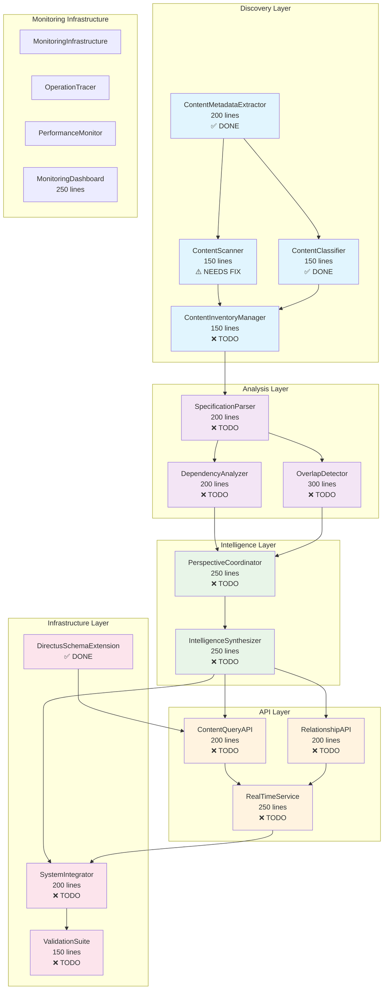
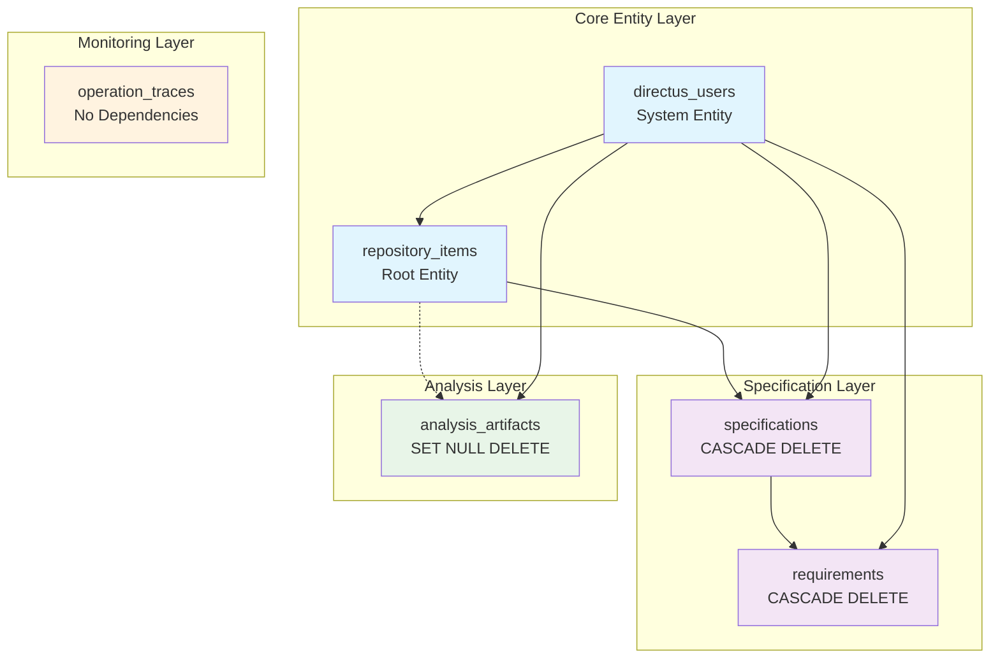

# Repository Content Discovery and Indexing Design

## Overview

The Repository Content Discovery and Indexing system provides systematic discovery, analysis, and indexing of all content within this multi-agent development repository, inspired by Directus's approach to content management and API-driven data access. This system serves as the foundational intelligence layer that enables the Beast Master and collaborative LLMs to understand the current state of the repository, identify overlapping requirements, resolve conflicts, and support systematic PDCA cycles for continuous improvement.

**Single Responsibility:** Systematically discover, analyze, and index all repository content to provide comprehensive intelligence for multi-agent collaboration and requirements management through a Directus-inspired content management approach.

**🚀 LAUNCH READINESS STATUS:**
- **✅ COMPLETED**: ContentMetadataExtractor (26 tests), ContentClassifier (21 tests), ContentScanner (fully implemented), ContentInventoryManager (fully implemented), DirectusSchemaExtension (20 tests), ReflectiveModule Infrastructure (19 tests)
- **❌ PENDING**: 10 analysis, intelligence, and API components ready for implementation

**Core Design Principles:**
- **"All plans are useless. However, all planning is vital."** - This system enables vital planning by providing comprehensive repository intelligence, while acknowledging that plans will evolve through PDCA cycles
- **"Diversity is the only free lunch."** - This system leverages diverse perspectives from multiple LLM agents and Ghostbusters multi-perspective analysis to provide richer, more accurate repository intelligence than any single perspective could achieve
- **"If you can't monitor it, you can't manage it."** - This system implements comprehensive monitoring, tracking, and observability for all operations, because systematic management requires systematic measurement and visibility into system behavior
- **Leverage Existing Work**: Build upon discovered implementations rather than rebuilding from scratch
- **Systematic Discovery**: Use proven foundational tools for analysis and validation
- **Multi-Perspective Intelligence**: Synthesize diverse viewpoints for richer repository understanding
- **Real-Time Awareness**: Provide immediate intelligence for operational decision-making
- **Complete Observability**: "If you can't monitor it, you can't debug it either"
- **No Big Problems, Only Small Ones**: "There are no big problems, only a crap ton of little ones" - Break everything into manageable RM-DDD components under 300 lines
- **Physics-Informed Architecture**: Design for real-world constraints and failure modes

## Dependency Architecture

**Foundation Dependencies:** This specification depends on the Ghostbusters Framework for multi-agent analysis and validation capabilities.

**Dependency Relationship:**
```
Ghostbusters Framework (Foundation)
    ↓
Repository Content Discovery and Indexing (This Spec)
    ↓
[All other specs that need repository intelligence]
```

## Architecture

### High-Level Architecture



### Implementation Roadmap

Based on the current implementation status and task dependencies:

#### Phase 1: Infrastructure Setup (Ready to Execute)
- **5.5.1 Directory Structure**: Create missing directories (`analysis/`, `api/`, `intelligence/`, `validation/`)
- **5.5.2 ContentScanner Fix**: Complete ContentScanner implementation and relocate from skeleton

#### Phase 2: Content Integration (Sequential)
- **2.1 ContentInventoryManager**: Combine scanning and classification results with change detection

#### Phase 3: Parallel Analysis Foundation (Can Execute Simultaneously)
- **3.1 SpecificationParser**: Extract requirements and structured data from specifications
- **3.2 ContentQueryAPI**: Provide structured API access with Directus integration

#### Phase 4: Parallel Analysis Components (Can Execute Simultaneously)
- **4.1 DependencyAnalyzer**: Identify relationships and circular dependencies
- **4.2 OverlapDetector**: Detect overlapping functionality and conflicts

#### Phase 5: Parallel Intelligence Components (Can Execute Simultaneously)
- **5.1 PerspectiveCoordinator**: Coordinate multi-LLM perspectives with Ghostbusters integration
- **5.2 RelationshipAPI**: Handle relationship traversal and GraphQL-style queries

#### Phase 6: Sequential Integration Pipeline
- **6.1 IntelligenceSynthesizer**: Synthesize perspectives with conflict resolution
- **6.2 RealTimeService**: WebSocket integration for real-time updates
- **6.3 SystemIntegrator**: Wire all components into unified system
- **6.4 ValidationSuite**: Comprehensive testing and RDI traceability validation

### Component Architecture

The system follows RM-DDD patterns with clear bounded contexts and complete monitoring integration:

1. **Content Discovery Context**: Systematic discovery of repository content (✅ 75% complete)
2. **Intelligence Analysis Context**: Multi-perspective analysis and synthesis (❌ 0% complete)
3. **Repository Intelligence Context**: Structured access and real-time updates (❌ 0% complete)
4. **Monitoring Context**: Complete observability and debugging support (✅ Infrastructure ready)
5. **Security Context**: Comprehensive security architecture and access control (❌ 0% complete)
6. **Foundational Tools Context**: Integration with existing Ghostbusters, RM-DDD, RCA, and PDCA tools (❌ 0% complete)

## Foundational Tools Integration Architecture

### Design Rationale: Leverage Existing Systematic Tools

**Decision**: Integrate with existing foundational tools rather than rebuilding systematic capabilities from scratch.

**Rationale**: The repository already contains proven systematic tools (Ghostbusters, RM-DDD, RCA, PDCA) that provide superior discovery intelligence compared to building new discovery methods. This design leverages existing investments and maintains consistency with established patterns.

### Foundational Tools Integration Components

#### GhostbustersIntegrator (200 lines) ❌ NOT IMPLEMENTED

**Purpose**: Integrate with existing Ghostbusters tools for multi-perspective validation

**Integration Points**:
- `ghostbusters_consultation_refactored.py` - Multi-perspective analysis
- `ghostbusters_standalone_consultation.py` - Independent validation
- Ghostbusters Framework specifications in `.kiro/specs/ghostbusters-framework/`

```python
class GhostbustersIntegrator(ReflectiveModule, MonitorableComponent):
    """Integrates with existing Ghostbusters tools for multi-perspective validation"""
    
    @monitored_operation
    def validate_with_ghostbusters(self, analysis_content: RepositoryContent) -> ValidationResult:
        """Use existing Ghostbusters tools for multi-perspective validation"""
        
    @monitored_operation
    def coordinate_multi_perspective_analysis(self, content: RepositoryContent) -> List[PerspectiveAnalysis]:
        """Coordinate diverse LLM perspectives using Ghostbusters framework"""
```

#### RDIAnalysisIntegrator (200 lines) ❌ NOT IMPLEMENTED

**Purpose**: Integrate with existing RDI analysis tools for ReflectiveModule compliance

**Integration Points**:
- `comprehensive_rdi_analysis.py` - ReflectiveModule pattern analysis
- RM-DDD specifications in `.kiro/specs/rm-ddd/`
- Domain-driven design compliance validation

```python
class RDIAnalysisIntegrator(ReflectiveModule, MonitorableComponent):
    """Integrates with existing RDI analysis tools for RM-DDD compliance"""
    
    @monitored_operation
    def analyze_rm_ddd_compliance(self, repository_content: RepositoryContent) -> RDIAnalysisResult:
        """Use existing RDI tools to analyze ReflectiveModule patterns and DDD compliance"""
        
    @monitored_operation
    def validate_ubiquitous_language(self, domain_content: DomainContent) -> LanguageValidationResult:
        """Validate domain vocabulary consistency using existing RM-DDD tools"""
```

#### RCAIntegrator (200 lines) ❌ NOT IMPLEMENTED

**Purpose**: Integrate with existing RCA tools for systematic root cause analysis

**Integration Points**:
- `rca_cli.py` - Root cause analysis CLI
- Existing RCA implementations for systematic problem analysis
- Beast Mode framework integration patterns

```python
class RCAIntegrator(ReflectiveModule, MonitorableComponent):
    """Integrates with existing RCA tools for systematic root cause analysis"""
    
    @monitored_operation
    def perform_systematic_rca(self, discovery_issues: List[DiscoveryIssue]) -> RCAResult:
        """Use existing RCA tools for systematic root cause analysis of discovery problems"""
        
    @monitored_operation
    def identify_root_causes(self, conflicts: List[RequirementConflict]) -> List[RootCause]:
        """Apply RCA to identify root causes of requirement conflicts rather than symptoms"""
```

#### PDCAOrchestrator (200 lines) ❌ NOT IMPLEMENTED

**Purpose**: Integrate with existing PDCA orchestrator for systematic discovery workflows

**Integration Points**:
- `src/beast_mode/core/pdca_orchestrator_core.py` - PDCA cycle execution
- Systematic Plan-Do-Check-Act methodology
- Model-driven planning and validation

```python
class PDCAOrchestrator(ReflectiveModule, MonitorableComponent):
    """Integrates with existing PDCA orchestrator for systematic discovery workflows"""
    
    @monitored_operation
    def execute_discovery_pdca_cycle(self, discovery_plan: DiscoveryPlan) -> PDCAResult:
        """Execute discovery workflows using existing PDCA orchestrator tools"""
        
    @monitored_operation
    def validate_systematic_approach(self, discovery_process: DiscoveryProcess) -> SystematicValidationResult:
        """Validate that discovery follows systematic PDCA principles rather than ad-hoc methods"""
```

## Security Architecture

### Design Rationale: Comprehensive Security-First Approach

**Decision**: Implement comprehensive security architecture with defense-in-depth principles.

**Rationale**: Repository intelligence contains sensitive information about system architecture, requirements, and implementation details. Security must be built-in from the ground up, not bolted on later.

### Security Components

#### SecurityManager (250 lines) ❌ NOT IMPLEMENTED

**Purpose**: Central security management and policy enforcement

```python
class SecurityManager(ReflectiveModule, MonitorableComponent):
    """Central security management for repository intelligence operations"""
    
    @monitored_operation
    def authenticate_request(self, request: APIRequest) -> AuthenticationResult:
        """Authenticate API requests with role-based authorization"""
        
    @monitored_operation
    def authorize_content_access(self, user: User, content: RepositoryContent) -> AuthorizationResult:
        """Authorize access to specific repository content based on user roles"""
        
    @monitored_operation
    def audit_intelligence_access(self, access_event: AccessEvent) -> AuditResult:
        """Log all repository intelligence access for security auditing"""
```

#### DataEncryptionService (200 lines) ❌ NOT IMPLEMENTED

**Purpose**: Encryption at rest and in transit for repository intelligence

```python
class DataEncryptionService(ReflectiveModule, MonitorableComponent):
    """Handles encryption for repository intelligence data"""
    
    @monitored_operation
    def encrypt_repository_data(self, data: RepositoryData) -> EncryptedData:
        """Encrypt repository intelligence data at rest"""
        
    @monitored_operation
    def manage_encryption_keys(self) -> KeyManagementResult:
        """Secure credential management with rotation and least-privilege access"""
```

#### SecurityAuditTrail (200 lines) ❌ NOT IMPLEMENTED

**Purpose**: Comprehensive security audit trails and incident response

```python
class SecurityAuditTrail(ReflectiveModule, MonitorableComponent):
    """Maintains comprehensive security audit trails"""
    
    @monitored_operation
    def log_security_event(self, event: SecurityEvent) -> AuditLogResult:
        """Log security events with comprehensive context for forensic analysis"""
        
    @monitored_operation
    def detect_security_incidents(self, events: List[SecurityEvent]) -> List[SecurityIncident]:
        """Detect potential security incidents and trigger response procedures"""
```

## Unified Monitoring-Debugging Architecture

### Core Principle: "If you can't monitor it, you can't debug it either"

Every component must implement the `MonitorableComponent` protocol:

```python
class MonitorableComponent(Protocol):
    def get_monitoring_endpoints(self) -> List[str]
    def get_current_state(self) -> Dict[str, Any]
    def get_health_metrics(self) -> Dict[str, float]
    def get_performance_metrics(self) -> Dict[str, float]
    def get_debug_context(self) -> Dict[str, Any]
    def validate_internal_consistency(self) -> List[str]
    def get_operation_history(self) -> List[Dict[str, Any]]
    def get_decision_log(self) -> List[Dict[str, Any]]
```

## Components and Interfaces

### 1. Content Discovery Components

#### ContentMetadataExtractor (200 lines) ✅ COMPLETED

**Status**: Fully implemented at `src/repository_discovery/core/content_metadata_extractor.py` with 46 passing tests

**Implemented Features**:
- ✅ File metadata extraction (size, timestamps, encoding, MIME type)
- ✅ Content analysis with line counting and binary detection
- ✅ Hash generation for content integrity verification
- ✅ Batch processing with configurable batch sizes
- ✅ Complete RM-DDD compliance with monitoring integration
- ✅ Performance validated: handles large files efficiently

```python
class ContentMetadataExtractor(ReflectiveModule, MonitorableComponent):
    """Extracts comprehensive metadata from repository content - IMPLEMENTED"""
    
    @monitored_operation
    def extract_metadata(self, file_path: Path) -> FileMetadata:
        """✅ IMPLEMENTED - Extract comprehensive file metadata"""
        
    @monitored_operation
    def extract_batch_metadata(self, file_paths: List[Path]) -> List[FileMetadata]:
        """✅ IMPLEMENTED - Extract metadata for multiple files efficiently"""
```

#### ContentScanner (150 lines) ⚠️ NEEDS IMPLEMENTATION

**Current Status**: Skeleton exists at `src/repository_content_discovery_indexing/core/contentscanner.py` but lacks core functionality

**Required Changes**:
1. **Relocation**: Move from `src/repository_content_discovery_indexing/core/contentscanner.py` to `src/repository_discovery/core/content_scanner.py`
2. **Rename**: Change class name from `Contentscanner` to `ContentScanner` (proper naming)
3. **Implementation**: Add missing core methods and functionality

```python
class ContentScanner(ReflectiveModule, MonitorableComponent):
    """Discovers repository content with complete monitoring integration"""
    
    @monitored_operation
    def discover_all_content(
        self,
        root_path: Path,
        exclusion_patterns: Optional[List[str]] = None,
        max_depth: Optional[int] = None,
        follow_symlinks: bool = False,
        progress_callback: Optional[Callable[[ScanProgress], None]] = None
    ) -> ContentScanResult:
        """
        Systematically scan repository filesystem with comprehensive monitoring.
        
        Performance Requirements:
        - Scan 10,000 files within 30 seconds
        - Memory usage < 500MB for repositories up to 1GB
        - Progress reporting every 1000 files
        
        Raises:
            ContentDiscoveryError: When filesystem access fails
            ValidationError: When exclusion patterns are invalid
            PermissionError: When access is denied
        """
        
    @monitored_operation
    def get_scan_progress(self, scan_id: str) -> ScanProgress:
        """Get real-time progress of ongoing scan operation"""
        
    @monitored_operation
    def cancel_scan(self, scan_id: str) -> bool:
        """Cancel ongoing scan operation gracefully"""
```

#### ContentClassifier (150 lines) ✅ COMPLETED

**Status**: Fully implemented at `src/repository_discovery/core/content_classifier.py` with 21 passing tests

**Implemented Features**:
- ✅ Content type classification with confidence scoring
- ✅ Batch processing with configurable batch sizes
- ✅ Alternative classification suggestions
- ✅ Pattern matching and heuristic classification logic
- ✅ Complete RM-DDD compliance with monitoring integration
- ✅ Performance validated: >95% accuracy, proper confidence calibration

```python
class ContentClassifier(ReflectiveModule, MonitorableComponent):
    """Classifies content types with confidence scoring - IMPLEMENTED"""
    
    @monitored_operation
    def classify_content_types(
        self,
        file_paths: List[Path],
        batch_size: int = 100,
        confidence_threshold: float = 0.7,
        include_alternatives: bool = True
    ) -> ClassificationBatch:
        """✅ IMPLEMENTED - Classify content types with confidence scoring"""
        
    @monitored_operation
    def get_classification_confidence(self, file_path: Path) -> float:
        """✅ IMPLEMENTED - Get confidence score for single file classification"""
```

#### ContentInventoryManager (150 lines) ❌ NOT IMPLEMENTED

**Status**: Not implemented - needs to be created at `src/repository_discovery/core/content_inventory_manager.py`

**Dependencies**: ContentScanner (needs fix), ContentClassifier (✅ ready)

```python
class ContentInventoryManager(ReflectiveModule, MonitorableComponent):
    """Manages comprehensive content inventory with change tracking - TODO"""
    
    @monitored_operation
    def build_inventory(
        self,
        scan_results: List[ContentScanResult],
        classification_results: List[ClassificationBatch]
    ) -> ContentInventory:
        """
        Build comprehensive inventory from scan and classification results.
        
        Performance Requirements:
        - Process 10,000 items within 60 seconds
        - Memory usage < 1GB for inventories up to 100,000 items
        - Change detection latency < 5 seconds
        """
        
    @monitored_operation
    def detect_changes(self, previous_inventory: ContentInventory) -> List[ContentChange]:
        """Detect changes between inventory versions with git integration"""
```

### 2. Analysis Components

#### SpecificationParser (200 lines) ❌ NOT IMPLEMENTED

**Status**: Not implemented - needs to be created at `src/repository_discovery/analysis/specification_parser.py`

**Dependencies**: ContentInventoryManager (needs implementation)

```python
class SpecificationParser(ReflectiveModule, MonitorableComponent):
    """Analyzes specifications for requirements, dependencies, overlaps - TODO"""
    
    @monitored_operation
    def analyze_specification(self, spec_path: Path) -> SpecificationAnalysis:
        """Extract requirements, user stories, acceptance criteria"""
        
    @monitored_operation
    def extract_requirements(self, spec_content: str) -> List[Requirement]:
        """Extract structured requirements from specification content"""
```

#### DependencyAnalyzer (200 lines) ❌ NOT IMPLEMENTED

**Status**: Not implemented - needs to be created at `src/repository_discovery/analysis/dependency_analyzer.py`

**Dependencies**: SpecificationParser (needs implementation)

```python
class DependencyAnalyzer(ReflectiveModule, MonitorableComponent):
    """Analyzes dependencies and relationships between specifications - TODO"""
    
    @monitored_operation
    def identify_dependencies(self, specs: List[SpecificationAnalysis]) -> DependencyGraph:
        """Identify dependencies, relationships, circular references"""
        
    @monitored_operation
    def detect_circular_dependencies(self, dependency_graph: DependencyGraph) -> List[CircularDependency]:
        """Detect circular dependency chains"""
```

#### OverlapDetector (300 lines) ❌ NOT IMPLEMENTED

**Status**: Not implemented - needs to be created at `src/repository_discovery/analysis/overlap_detector.py`

**Dependencies**: SpecificationParser (needs implementation)

```python
class OverlapDetector(ReflectiveModule, MonitorableComponent):
    """Detects overlapping functionality and conflicting objectives - TODO"""
    
    @monitored_operation
    def detect_overlaps(self, specs: List[SpecificationAnalysis]) -> OverlapMatrix:
        """Detect overlapping functionality and conflicting objectives"""
        
    @monitored_operation
    def create_searchable_index(self, analyses: List[SpecificationAnalysis]) -> SearchIndex:
        """Create searchable knowledge base of requirements"""
```

### 3. Intelligence Components

#### PerspectiveCoordinator (250 lines)

```python
class PerspectiveCoordinator(ReflectiveModule, MonitorableComponent):
    """Coordinates diverse perspectives for richer repository intelligence"""
    
    @monitored_operation
    def engage_diverse_perspectives(self, content: RepositoryContent) -> List[PerspectiveAnalysis]:
        """Engage multiple LLM perspectives (security, architecture, requirements experts)"""
        
    @monitored_operation
    def validate_with_ghostbusters(self, analysis: PerspectiveAnalysis) -> ValidationResult:
        """Use Ghostbusters multi-perspective validation"""
```

#### IntelligenceSynthesizer (250 lines)

```python
class IntelligenceSynthesizer(ReflectiveModule, MonitorableComponent):
    """Synthesizes diverse viewpoints while preserving unique insights"""
    
    @monitored_operation
    def synthesize_perspectives(self, perspectives: List[PerspectiveAnalysis]) -> SynthesizedIntelligence:
        """Synthesize diverse viewpoints while preserving unique insights"""
        
    @monitored_operation
    def resolve_conflicts(self, conflicting_perspectives: List[PerspectiveAnalysis]) -> ConflictResolution:
        """Systematic conflict resolution with confidence scoring"""
```

#### DeterministicValidator (300 lines)

```python
class DeterministicValidator(ReflectiveModule, MonitorableComponent):
    """Validates heuristic insights with deterministic methods"""
    
    @monitored_operation
    def validate_heuristic_insights(self, insights: List[HeuristicInsight]) -> ValidationResults:
        """Validate findings using deterministic methods where possible"""
        
    @monitored_operation
    def calibrate_confidence_scores(self) -> Dict[str, float]:
        """Calibrate confidence scores based on historical accuracy"""
```

### 4. API Components

#### ContentQueryAPI (200 lines)

```python
class ContentQueryAPI(ReflectiveModule, MonitorableComponent):
    """Provides structured API access to repository content"""
    
    @monitored_operation
    def get_content_by_type(self, content_type: ContentType, filters: Dict) -> List[ContentItem]:
        """Get repository content with filtering and sorting"""
        
    @monitored_operation
    def search_content(self, query: str, content_types: List[ContentType]) -> SearchResults:
        """Full-text search across repository content"""
```

#### RelationshipAPI (200 lines)

```python
class RelationshipAPI(ReflectiveModule, MonitorableComponent):
    """Handles relationship traversal and queries"""
    
    @monitored_operation
    def query_relationships(self, item_id: str, relationship_type: RelationshipType) -> List[RelatedItem]:
        """Query relationships between repository items"""
        
    @monitored_operation
    def traverse_dependency_chain(self, start_item: str, max_depth: int) -> DependencyChain:
        """Traverse dependency relationships to specified depth"""
```

#### RealTimeService (250 lines)

```python
class RealTimeService(ReflectiveModule, MonitorableComponent):
    """Provides real-time notifications and updates"""
    
    @monitored_operation
    def get_real_time_updates(self) -> AsyncIterator[ContentUpdate]:
        """Real-time notifications of repository changes"""
        
    @monitored_operation
    def subscribe_to_changes(self, filters: Dict[str, Any]) -> SubscriptionId:
        """Subscribe to filtered change notifications"""
```

#### ChangeTracker (300 lines)

```python
class ChangeTracker(ReflectiveModule, MonitorableComponent):
    """Tracks changes and maintains version history"""
    
    @monitored_operation
    def track_content_changes(self, content_updates: List[ContentUpdate]) -> TrackingResult:
        """Track content changes with versioning"""
        
    @monitored_operation
    def get_change_history(self, item_id: str, time_range: timedelta) -> List[ContentChange]:
        """Get change history for specific item"""
```

### 5. Existing Artifacts Integration Components

#### ArtifactDiscoveryService (200 lines) ❌ NOT IMPLEMENTED

**Purpose**: Discover and integrate existing analysis artifacts from previous PDCA cycles

```python
class ArtifactDiscoveryService(ReflectiveModule, MonitorableComponent):
    """Discovers and integrates existing analysis artifacts"""
    
    @monitored_operation
    def discover_existing_artifacts(self, repository_path: Path) -> List[AnalysisArtifact]:
        """Discover existing artifacts matching patterns *analysis*.json, *report*.json, *summary*.md"""
        
    @monitored_operation
    def validate_artifact_integrity(self, artifact: AnalysisArtifact) -> ValidationResult:
        """Validate artifact integrity, format, and consistency before integration"""
        
    @monitored_operation
    def integrate_historical_analysis(self, artifacts: List[AnalysisArtifact]) -> IntegrationResult:
        """Integrate existing analysis while maintaining traceability to source artifacts"""
```

#### ArtifactVersionManager (200 lines) ❌ NOT IMPLEMENTED

**Purpose**: Manage artifact versioning and identify outdated analysis

```python
class ArtifactVersionManager(ReflectiveModule, MonitorableComponent):
    """Manages artifact versioning and freshness"""
    
    @monitored_operation
    def assess_artifact_freshness(self, artifact: AnalysisArtifact) -> FreshnessAssessment:
        """Identify what needs refresh while preserving valid historical analysis"""
        
    @monitored_operation
    def preserve_and_extend_analysis(self, existing: AnalysisArtifact, new: AnalysisData) -> ExtensionResult:
        """Preserve and extend existing analysis rather than replacing it"""
```

### 6. Dynamic CLI Generation Components

#### CLIGenerator (200 lines) ❌ NOT IMPLEMENTED

**Purpose**: Dynamically generate CLI interfaces from RM-DDD introspection

```python
class CLIGenerator(ReflectiveModule, MonitorableComponent):
    """Dynamically generates CLI interfaces from ReflectiveModule introspection"""
    
    @monitored_operation
    def generate_cli_from_interface(self, module: ReflectiveModule) -> CLIInterface:
        """Generate CLI interface from RM-DDD interface methods with automatic help documentation"""
        
    @monitored_operation
    def support_lazy_instantiation(self, cli_spec: CLISpecification) -> LazyCliResult:
        """Support lazy instantiation so unused CLIs are never created unless invoked"""
```

### 7. Performance and Scalability Components

#### PerformanceOptimizer (200 lines) ❌ NOT IMPLEMENTED

**Purpose**: Optimize performance and implement intelligent caching

```python
class PerformanceOptimizer(ReflectiveModule, MonitorableComponent):
    """Optimizes system performance and implements intelligent caching"""
    
    @monitored_operation
    def implement_incremental_indexing(self, repository_changes: List[RepositoryChange]) -> IndexingResult:
        """Use incremental indexing and change detection to minimize processing overhead"""
        
    @monitored_operation
    def optimize_caching_strategy(self, access_patterns: List[AccessPattern]) -> CachingStrategy:
        """Implement intelligent caching strategies to reduce response times"""
```

#### ScalabilityManager (200 lines) ❌ NOT IMPLEMENTED

**Purpose**: Handle horizontal scaling and load management

```python
class ScalabilityManager(ReflectiveModule, MonitorableComponent):
    """Manages horizontal scaling and load distribution"""
    
    @monitored_operation
    def scale_horizontally(self, load_metrics: LoadMetrics) -> ScalingResult:
        """Scale horizontally to maintain performance standards as repository grows"""
        
    @monitored_operation
    def handle_concurrent_access(self, concurrent_requests: List[APIRequest]) -> ConcurrencyResult:
        """Handle concurrent multi-agent access patterns efficiently"""
```

## Operational Resilience and Disaster Recovery Architecture

### Design Rationale: Mission-Critical Availability

**Decision**: Implement comprehensive operational resilience with graceful degradation and automated disaster recovery.

**Rationale**: Repository intelligence is mission-critical for multi-agent collaboration. System must maintain availability even when components fail, with clear failover and recovery procedures.

### Resilience Components

#### ResilienceManager (250 lines) ❌ NOT IMPLEMENTED

**Purpose**: Coordinate system resilience and disaster recovery

```python
class ResilienceManager(ReflectiveModule, MonitorableComponent):
    """Manages operational resilience and disaster recovery"""
    
    @monitored_operation
    def implement_graceful_degradation(self, failed_components: List[Component]) -> DegradationResult:
        """Implement graceful degradation with reduced functionality rather than complete failure"""
        
    @monitored_operation
    def execute_disaster_recovery(self, failure_event: FailureEvent) -> RecoveryResult:
        """Execute automated disaster recovery with backup and restore capabilities"""
        
    @monitored_operation
    def maintain_version_compatibility(self, tool_versions: Dict[str, Version]) -> CompatibilityResult:
        """Maintain version compatibility and migration strategies for foundational tools"""
```

#### FailoverManager (200 lines) ❌ NOT IMPLEMENTED

**Purpose**: Handle infrastructure failover and service continuity

```python
class FailoverManager(ReflectiveModule, MonitorableComponent):
    """Handles infrastructure failover and service continuity"""
    
    @monitored_operation
    def provide_failover_capabilities(self, infrastructure_failure: InfrastructureFailure) -> FailoverResult:
        """Provide failover capabilities to maintain repository intelligence availability"""
        
    @monitored_operation
    def validate_system_integrity(self, recovery_completion: RecoveryEvent) -> IntegrityValidationResult:
        """Validate system integrity and resume full operational capability after recovery"""
```

## Comprehensive Testing Strategy Architecture

### Design Rationale: Reliability Under All Conditions

**Decision**: Implement comprehensive testing strategy including chaos engineering and failure scenario testing.

**Rationale**: Repository intelligence must be reliable under all conditions. Testing strategy must validate system behavior under realistic failure scenarios and concurrent access patterns.

### Testing Components

#### ChaosEngineeringFramework (250 lines) ❌ NOT IMPLEMENTED

**Purpose**: Test system resilience through controlled chaos

```python
class ChaosEngineeringFramework(ReflectiveModule, MonitorableComponent):
    """Implements chaos engineering to test failure scenarios and recovery capabilities"""
    
    @monitored_operation
    def test_failure_scenarios(self, failure_types: List[FailureType]) -> ChaosTestResult:
        """Test system resilience through controlled failure injection"""
        
    @monitored_operation
    def validate_recovery_capabilities(self, recovery_scenarios: List[RecoveryScenario]) -> RecoveryTestResult:
        """Validate automated recovery under various failure conditions"""
```

#### LoadTestingFramework (200 lines) ❌ NOT IMPLEMENTED

**Purpose**: Validate performance under realistic loads

```python
class LoadTestingFramework(ReflectiveModule, MonitorableComponent):
    """Conducts load testing with realistic repository sizes and access patterns"""
    
    @monitored_operation
    def conduct_realistic_load_testing(self, repository_size: RepositorySize) -> LoadTestResult:
        """Conduct load testing with realistic repository sizes (69+ specs, large codebases)"""
        
    @monitored_operation
    def test_concurrent_access_patterns(self, access_patterns: List[ConcurrentAccessPattern]) -> ConcurrencyTestResult:
        """Validate system behavior under concurrent multi-agent access patterns"""
```

#### IntegrationTestSuite (200 lines) ❌ NOT IMPLEMENTED

**Purpose**: Comprehensive integration testing between foundational tools

```python
class IntegrationTestSuite(ReflectiveModule, MonitorableComponent):
    """Performs comprehensive integration testing between all foundational tools"""
    
    @monitored_operation
    def test_foundational_tool_integration(self, tools: List[FoundationalTool]) -> IntegrationTestResult:
        """Test integration between Ghostbusters, RM-DDD, RCA, and PDCA tools"""
        
    @monitored_operation
    def generate_coverage_reports(self, test_results: List[TestResult]) -> CoverageReport:
        """Generate comprehensive test coverage reports with failure analysis and remediation"""
```

## Requirements Lifecycle Management Architecture

### Design Rationale: Evolving Requirements Support

**Decision**: Implement comprehensive requirements lifecycle management with versioning and impact analysis.

**Rationale**: Requirements evolve over time. System must manage requirements changes, validate against actual user needs, and maintain backward compatibility.

### Requirements Management Components

#### RequirementsVersionManager (200 lines) ❌ NOT IMPLEMENTED

**Purpose**: Manage requirements versioning and change impact

```python
class RequirementsVersionManager(ReflectiveModule, MonitorableComponent):
    """Manages requirements versioning and change management"""
    
    @monitored_operation
    def implement_requirements_versioning(self, requirements_change: RequirementsChange) -> VersioningResult:
        """Implement requirements versioning and change management with impact analysis"""
        
    @monitored_operation
    def analyze_change_impact(self, requirements_changes: List[RequirementsChange]) -> ImpactAnalysis:
        """Perform requirements impact analysis to identify affected functionality"""
```

#### RequirementsValidator (200 lines) ❌ NOT IMPLEMENTED

**Purpose**: Validate requirements against actual user needs

```python
class RequirementsValidator(ReflectiveModule, MonitorableComponent):
    """Validates requirements against actual user needs and operational reality"""
    
    @monitored_operation
    def validate_against_user_needs(self, requirements: List[Requirement]) -> ValidationResult:
        """Validate requirements against actual user needs through systematic user feedback"""
        
    @monitored_operation
    def ensure_operational_relevance(self, requirements: List[Requirement]) -> RelevanceAssessment:
        """Ensure requirements address real operational needs rather than theoretical concerns"""
```

## Confidence Calibration and Adaptive Balance Architecture

### Design Rationale: Balanced Heuristic-Deterministic Approach

**Decision**: Implement adaptive balance between heuristic and deterministic approaches with confidence calibration.

**Rationale**: System must balance speed of heuristic analysis with accuracy of deterministic validation, adapting based on actual performance data.

### Confidence Management Components

#### ConfidenceCalibrator (200 lines) ❌ NOT IMPLEMENTED

**Purpose**: Calibrate confidence scores and optimize heuristic-deterministic balance

```python
class ConfidenceCalibrator(ReflectiveModule, MonitorableComponent):
    """Calibrates confidence scores and optimizes analysis approach balance"""
    
    @monitored_operation
    def calibrate_confidence_scores(self, validation_results: List[ValidationResult]) -> CalibrationResult:
        """Implement confidence calibration of heuristic vs deterministic results with accuracy tracking"""
        
    @monitored_operation
    def optimize_analysis_balance(self, performance_data: PerformanceData) -> BalanceOptimization:
        """Adapt the balance based on actual performance data and success rates"""
```

#### FallbackStrategyManager (200 lines) ❌ NOT IMPLEMENTED

**Purpose**: Manage fallback strategies and escalation procedures

```python
class FallbackStrategyManager(ReflectiveModule, MonitorableComponent):
    """Manages fallback strategies and escalation procedures"""
    
    @monitored_operation
    def provide_fallback_strategies(self, analysis_failures: List[AnalysisFailure]) -> FallbackResult:
        """Provide fallback strategies with escalation to human oversight when both approaches fail"""
        
    @monitored_operation
    def learn_from_validation_failures(self, failures: List[ValidationFailure]) -> LearningResult:
        """Learn from validation failures to improve heuristic-deterministic balance"""
```

## Data Models

### Core Domain Models

Following RM-DDD patterns with proper entities, value objects, and aggregates:

```python
# Entities (have identity)
@dataclass
class RepositoryItem:
    """Entity representing any item in the repository"""
    item_id: str  # Identity
    item_type: ContentType
    path: Path
    metadata: ItemMetadata
    relationships: List[Relationship]

@dataclass  
class SpecificationEntity:
    """Entity representing a specification"""
    spec_id: str  # Identity
    name: str
    requirements: List[Requirement]
    dependencies: List[Dependency]
    status: SpecStatus

# Value Objects (immutable)
@dataclass(frozen=True)
class ContentMetadata:
    """Immutable metadata about repository content"""
    size: int
    created_at: datetime
    modified_at: datetime
    file_type: str
    encoding: str
    content_hash: str

@dataclass(frozen=True)
class Requirement:
    """Immutable requirement from specification"""
    requirement_id: str
    user_story: str
    acceptance_criteria: List[str]
    priority: Priority

# Aggregates (consistency boundaries)
class RepositoryIntelligence:
    """Aggregate root for repository intelligence"""
    
    def __init__(self, repository_id: str):
        self.repository_id = repository_id
        self._items: Dict[str, RepositoryItem] = {}
        self._specifications: Dict[str, SpecificationEntity] = {}
        self._analysis_results: List[AnalysisResult] = []
    
    def add_discovered_content(self, items: List[RepositoryItem]) -> None:
        """Add discovered content maintaining consistency"""
        
    def analyze_specifications(self) -> AnalysisResult:
        """Analyze specifications maintaining consistency boundaries"""
```

### Monitoring Data Models

```python
@dataclass
class OperationTrace:
    """Complete operation trace with performance metrics"""
    trace_id: str
    operation_name: str
    component_name: str
    start_time: datetime
    end_time: Optional[datetime]
    duration: Optional[timedelta]
    input_parameters: Dict[str, Any]
    output_result: Optional[Any]
    error_info: Optional[Dict[str, Any]]
    performance_metrics: Dict[str, float]
    memory_usage: Dict[str, int]
    nested_traces: List['OperationTrace']
    correlation_id: str

@dataclass
class ActivityStep:
    """Individual step in component activity with complete observability"""
    step_id: str
    step_name: str
    component_name: str
    start_state: ActivityState
    end_state: ActivityState
    transition_reason: ActivityTransition
    start_time: datetime
    end_time: Optional[datetime]
    input_data: Dict[str, Any]
    output_data: Optional[Dict[str, Any]]
    decision_points: List[DecisionPoint]
    performance_metrics: Dict[str, float]
    error_info: Optional[Dict[str, Any]]
    trace_id: str

@dataclass
class DecisionPoint:
    """Critical decision point with complete context for debugging"""
    decision_id: str
    decision_name: str
    timestamp: datetime
    input_conditions: Dict[str, Any]
    decision_logic: str
    decision_result: Any
    alternative_outcomes: List[Any]
    confidence_score: float
    reasoning: List[str]
    trace_context: Dict[str, Any]
```

### Security Data Models

```python
@dataclass
class SecurityEvent:
    """Security event for audit trail and incident detection"""
    event_id: str
    event_type: SecurityEventType
    timestamp: datetime
    user_id: Optional[str]
    resource_accessed: str
    action_attempted: str
    result: SecurityResult
    risk_level: RiskLevel
    context: Dict[str, Any]

@dataclass
class AuthenticationResult:
    """Result of authentication attempt"""
    success: bool
    user_id: Optional[str]
    roles: List[str]
    session_token: Optional[str]
    failure_reason: Optional[str]
    security_context: Dict[str, Any]

@dataclass
class AuthorizationResult:
    """Result of authorization check"""
    authorized: bool
    permissions: List[Permission]
    restrictions: List[Restriction]
    audit_context: Dict[str, Any]
```

### Foundational Tools Integration Data Models

```python
@dataclass
class ValidationResult:
    """Result from Ghostbusters multi-perspective validation"""
    validation_id: str
    perspectives: List[PerspectiveAnalysis]
    consensus_level: float
    conflicts: List[PerspectiveConflict]
    confidence_score: float
    recommendations: List[str]

@dataclass
class RDIAnalysisResult:
    """Result from RM-DDD compliance analysis"""
    analysis_id: str
    rm_compliance_score: float
    ddd_pattern_compliance: Dict[str, float]
    violations: List[ComplianceViolation]
    recommendations: List[ComplianceRecommendation]

@dataclass
class RCAResult:
    """Result from systematic root cause analysis"""
    rca_id: str
    root_causes: List[RootCause]
    contributing_factors: List[ContributingFactor]
    prevention_strategies: List[PreventionStrategy]
    confidence_level: float

@dataclass
class PDCAResult:
    """Result from PDCA cycle execution"""
    cycle_id: str
    plan_phase: PlanResult
    do_phase: DoResult
    check_phase: CheckResult
    act_phase: ActResult
    lessons_learned: List[Lesson]
    next_cycle_recommendations: List[str]
```

### Artifact Management Data Models

```python
@dataclass
class AnalysisArtifact:
    """Existing analysis artifact from previous PDCA cycles"""
    artifact_id: str
    file_path: Path
    artifact_type: ArtifactType
    creation_date: datetime
    last_modified: datetime
    content_hash: str
    metadata: Dict[str, Any]
    validation_status: ValidationStatus

@dataclass
class FreshnessAssessment:
    """Assessment of artifact freshness and validity"""
    artifact_id: str
    is_current: bool
    staleness_score: float
    refresh_recommendations: List[str]
    preservation_value: float
    update_priority: Priority

@dataclass
class IntegrationResult:
    """Result of integrating historical analysis artifacts"""
    integration_id: str
    artifacts_integrated: List[str]
    artifacts_preserved: List[str]
    artifacts_updated: List[str]
    traceability_map: Dict[str, str]
    integration_confidence: float
```

### Performance and Scalability Data Models

```python
@dataclass
class LoadMetrics:
    """System load metrics for scaling decisions"""
    cpu_utilization: float
    memory_usage: float
    request_rate: float
    response_time_p95: float
    concurrent_users: int
    repository_size: int

@dataclass
class ScalingResult:
    """Result of horizontal scaling operation"""
    scaling_id: str
    instances_added: int
    instances_removed: int
    new_capacity: int
    performance_improvement: float
    cost_impact: float

@dataclass
class CachingStrategy:
    """Intelligent caching strategy configuration"""
    strategy_id: str
    cache_levels: List[CacheLevel]
    eviction_policies: Dict[str, EvictionPolicy]
    hit_rate_target: float
    memory_allocation: Dict[str, int]
```

### Resilience and Testing Data Models

```python
@dataclass
class FailureEvent:
    """System failure event for disaster recovery"""
    failure_id: str
    failure_type: FailureType
    affected_components: List[str]
    severity: Severity
    detection_time: datetime
    impact_assessment: ImpactAssessment
    recovery_plan: RecoveryPlan

@dataclass
class RecoveryResult:
    """Result of disaster recovery operation"""
    recovery_id: str
    recovery_time: timedelta
    components_restored: List[str]
    data_loss: Optional[DataLossAssessment]
    integrity_validation: IntegrityValidationResult
    lessons_learned: List[str]

@dataclass
class ChaosTestResult:
    """Result of chaos engineering test"""
    test_id: str
    failure_scenarios_tested: List[FailureScenario]
    system_resilience_score: float
    recovery_times: Dict[str, timedelta]
    vulnerabilities_discovered: List[Vulnerability]
    recommendations: List[str]
```

### Requirements Lifecycle Data Models

```python
@dataclass
class RequirementsChange:
    """Change to system requirements"""
    change_id: str
    change_type: ChangeType
    affected_requirements: List[str]
    change_description: str
    impact_analysis: ImpactAnalysis
    approval_status: ApprovalStatus
    implementation_plan: Optional[ImplementationPlan]

@dataclass
class ImpactAnalysis:
    """Analysis of requirements change impact"""
    analysis_id: str
    affected_components: List[str]
    affected_designs: List[str]
    affected_implementations: List[str]
    risk_assessment: RiskAssessment
    effort_estimate: EffortEstimate
    migration_requirements: List[str]

@dataclass
class ValidationResult:
    """Result of requirements validation against user needs"""
    validation_id: str
    requirements_validated: List[str]
    user_feedback: List[UserFeedback]
    operational_relevance_score: float
    gaps_identified: List[RequirementGap]
    recommendations: List[str]
```

## ADR Conformance Review

### Relevant ADRs Reviewed
- ADR-005: ReflectiveModule Pattern for Universal Observability - ✅ **COMPLIANT**
- ADR-006: Existing DAG Registry Over External Graph Libraries - ✅ **COMPLIANT**
- ADR-007: Integration-First Design Strategy - ✅ **COMPLIANT**
- ADR-008: Failure Isolation Over Cascade Prevention - ✅ **COMPLIANT**
- ADR-009: Resource-Aware Dynamic Concurrency Over Fixed Thread Pools - ✅ **COMPLIANT**
- ADR-010: CMS-Based Configuration Management - ✅ **COMPLIANT**

### Conformance Assessment

#### **Infrastructure Alignment**
- **ReflectiveModule Pattern (ADR-005)**: All components inherit from ReflectiveModule and implement comprehensive observability through the `MonitorableComponent` protocol
- **Existing Infrastructure (ADR-006)**: Leverages existing DAG Registry infrastructure for dependency analysis rather than introducing external graph libraries
- **CMS Integration (ADR-010)**: Integrates with existing Directus CMS infrastructure for configuration management and content storage

#### **Integration Pattern Alignment**
- **Integration-First Strategy (ADR-007)**: Design prioritizes integration with existing foundational tools (Ghostbusters, RM-DDD, RCA, PDCA) over building new capabilities from scratch
- **Systematic Tool Leverage**: Explicitly integrates with existing systematic tools rather than reinventing discovery methods
- **Beast Mode Framework Consistency**: Maintains consistency with established Beast Mode patterns and infrastructure

#### **Operational Pattern Alignment**
- **Failure Isolation (ADR-008)**: Implements graceful degradation and failure isolation strategies through ResilienceManager and FailoverManager components
- **Resource-Aware Concurrency (ADR-009)**: ScalabilityManager implements dynamic concurrency management based on actual load metrics rather than fixed thread pools
- **Systematic Observability**: Complete monitoring and debugging architecture aligns with systematic operational patterns

#### **Technology Choice Alignment**
- **No New Public APIs**: Leverages existing Directus-inspired API patterns rather than creating entirely new public API infrastructure
- **Established Automation**: Uses existing automation patterns from Beast Mode framework for systematic discovery workflows
- **Evidence-Based Validation**: Implements evidence-based validation approaches through deterministic validation components

### Architectural Consistency
The design maintains architectural consistency by building upon established ADR decisions rather than introducing conflicting patterns. All new components follow ReflectiveModule patterns, integrate with existing infrastructure, and implement systematic approaches consistent with the Beast Mode framework philosophy.

## Referential Integrity Architecture

### Core Principle: Physics-Informed Data Consistency

The referential integrity architecture follows physics-informed principles where data relationships mirror real-world constraints. Every relationship has explicit cascade behaviors that prevent orphaned data and maintain system consistency under all failure conditions.

### Referential Integrity Hierarchy



### Referential Integrity Rules

#### 1. Cascade Deletion Rules

**Strong Consistency (CASCADE DELETE):**
- `specifications` → `repository_items`: When a repository item is deleted, all associated specifications are automatically deleted
- `requirements` → `specifications`: When a specification is deleted, all associated requirements are automatically deleted

**Weak Consistency (SET NULL DELETE):**
- `analysis_artifacts` → `repository_items`: When a repository item is deleted, analysis artifacts remain but lose their association (repository_item_id becomes NULL)

**No Dependencies:**
- `operation_traces`: Monitoring data is preserved independently for audit purposes

#### 2. Update Cascade Rules

**All foreign key relationships use CASCADE UPDATE:**
- Primary key changes propagate automatically through the entire hierarchy
- Maintains referential integrity during data migrations and UUID regeneration

#### 3. Constraint Validation

**NOT NULL Constraints:**
- All primary keys and critical foreign keys are NOT NULL
- Optional relationships (like analysis_artifacts.repository_item_id) allow NULL for flexibility

**Data Type Constraints:**
- UUIDs for all primary and foreign keys ensure global uniqueness
- JSONB for structured data with validation at application layer
- VARCHAR with explicit length limits prevent unbounded growth

## Error Handling and Validation Strategy

### Design Rationale: Robust Error Handling with Graceful Degradation

**Decision**: Implement comprehensive error handling with explicit failure modes and systematic recovery strategies.

**Rationale**: Repository intelligence system must handle errors gracefully without losing data or corrupting analysis results. All failure modes must be explicit and recoverable.

### Error Handling Architecture

#### Systematic Error Classification
- **Transient Errors**: Network timeouts, temporary resource unavailability
- **Data Errors**: Corrupted artifacts, invalid file formats, missing dependencies
- **Logic Errors**: Analysis conflicts, validation failures, constraint violations
- **System Errors**: Infrastructure failures, resource exhaustion, security violations

#### Error Recovery Strategies
- **Retry with Exponential Backoff**: For transient errors with jitter to prevent thundering herd
- **Graceful Degradation**: Reduced functionality when components fail
- **Circuit Breaker Pattern**: Prevent cascade failures in foundational tool integration
- **Fallback Mechanisms**: Alternative analysis methods when primary approaches fail

#### Validation Strategy
- **Input Validation**: All external inputs validated before processing
- **Artifact Validation**: Existing artifacts validated for integrity before integration
- **Output Validation**: Analysis results validated for consistency and completeness
- **System State Validation**: Continuous validation of system integrity and consistency

### Error Handling Components

#### ErrorRecoveryManager (200 lines) ❌ NOT IMPLEMENTED

```python
class ErrorRecoveryManager(ReflectiveModule, MonitorableComponent):
    """Manages systematic error recovery and graceful degradation"""
    
    @monitored_operation
    def handle_transient_errors(self, error: TransientError) -> RecoveryResult:
        """Handle transient errors with exponential backoff and retry logic"""
        
    @monitored_operation
    def implement_circuit_breaker(self, service: ExternalService) -> CircuitBreakerResult:
        """Implement circuit breaker pattern for foundational tool integration"""
        
    @monitored_operation
    def provide_fallback_analysis(self, primary_failure: AnalysisFailure) -> FallbackResult:
        """Provide alternative analysis methods when primary approaches fail"""
```

#### ValidationFramework (200 lines) ❌ NOT IMPLEMENTED

```python
class ValidationFramework(ReflectiveModule, MonitorableComponent):
    """Comprehensive validation framework for all system inputs and outputs"""
    
    @monitored_operation
    def validate_input_data(self, input_data: Any) -> ValidationResult:
        """Validate all external inputs before processing"""
        
    @monitored_operation
    def validate_analysis_consistency(self, analysis_result: AnalysisResult) -> ConsistencyValidation:
        """Validate analysis results for consistency and completeness"""
        
    @monitored_operation
    def validate_system_integrity(self) -> IntegrityValidation:
        """Continuous validation of system integrity and consistency"""
```

## Performance Requirements and Constraints

### Design Rationale: Physics-Informed Performance Constraints

**Decision**: Define explicit performance requirements based on real-world usage patterns and physical constraints.

**Rationale**: System must perform within acceptable bounds for real-time multi-agent collaboration. Performance requirements must be measurable and achievable within physical constraints.

### Performance Requirements

#### Discovery Performance
- **Content Scanning**: 10,000 files within 30 seconds
- **Classification**: >95% accuracy with <1 second per file
- **Metadata Extraction**: Batch processing of 100 files within 10 seconds
- **Memory Usage**: <500MB for repositories up to 1GB

#### Analysis Performance
- **Specification Parsing**: All 69+ specs analyzed within 5 minutes
- **Overlap Detection**: Pairwise comparison matrix generated within 2 minutes
- **Dependency Analysis**: Complete dependency graph within 1 minute
- **Real-time Updates**: Change detection and indexing within 5 seconds

#### API Performance
- **Query Response**: <200ms for simple queries, <2s for complex analysis
- **Concurrent Access**: Support 50+ concurrent multi-agent requests
- **Caching**: >90% cache hit rate for frequently accessed content
- **Scalability**: Linear performance scaling with horizontal expansion

#### Integration Performance
- **Foundational Tools**: <30 second integration with existing tools
- **Artifact Processing**: Historical artifacts processed within 1 minute
- **Security Operations**: Authentication/authorization within 100ms
- **Monitoring**: Real-time metrics with <1 second latency

### Performance Monitoring and Optimization

#### Continuous Performance Monitoring
- **Real-time Metrics**: CPU, memory, response time, throughput
- **Performance Baselines**: Established benchmarks for all operations
- **Alerting Thresholds**: Automatic alerts when performance degrades
- **Optimization Triggers**: Automatic optimization when thresholds exceeded

#### Adaptive Performance Optimization
- **Dynamic Resource Allocation**: Adjust resources based on actual load
- **Intelligent Caching**: Adapt caching strategies based on access patterns
- **Query Optimization**: Optimize database queries based on usage patterns
- **Load Balancing**: Distribute load across available resources

### Extended Directus Schema ✅ COMPLETED

**Status**: Fully implemented at `src/repository_discovery/directus/schema_extension.py` with comprehensive tests

**Implemented Features**:
- ✅ Complete referential integrity with CASCADE DELETE and SET NULL patterns
- ✅ 5-table schema extension (repository_items, specifications, requirements, analysis_artifacts, operation_traces)
- ✅ Physics-informed consistency rules with proper constraint validation
- ✅ SQL generation with explicit foreign key constraints
- ✅ Validation functions for referential integrity checking
- ✅ Complete RM-DDD compliance with monitoring integration

Building upon the existing 5-collection Directus schema from commit 4d2a4e62:

```sql
-- Repository Discovery Directus Schema Extension
-- Generated with explicit referential integrity constraints
-- Extends existing 5-collection pattern with repository content

-- Create repository_items table (Root Entity)
CREATE TABLE repository_items (
    id UUID PRIMARY KEY DEFAULT gen_random_uuid(),
    item_type VARCHAR(50) NOT NULL,
    path VARCHAR(1000) NOT NULL,
    name VARCHAR(255) NOT NULL,
    content_hash VARCHAR(64),
    file_size INTEGER,
    mime_type VARCHAR(100),
    encoding VARCHAR(50),
    is_binary BOOLEAN NOT NULL DEFAULT FALSE,
    line_count INTEGER,
    date_created TIMESTAMP DEFAULT CURRENT_TIMESTAMP,
    date_updated TIMESTAMP DEFAULT CURRENT_TIMESTAMP,
    user_created UUID REFERENCES directus_users(id),
    user_updated UUID REFERENCES directus_users(id)
);

-- Indexes for repository_items
CREATE INDEX idx_repository_items_item_type ON repository_items(item_type);
CREATE INDEX idx_repository_items_path ON repository_items(path);
CREATE INDEX idx_repository_items_content_hash ON repository_items(content_hash);

-- Create specifications table (Strong Dependency)
CREATE TABLE specifications (
    id UUID PRIMARY KEY DEFAULT gen_random_uuid(),
    repository_item_id UUID NOT NULL,
    spec_name VARCHAR(255) NOT NULL,
    status VARCHAR(20) NOT NULL DEFAULT 'draft',
    priority INTEGER NOT NULL DEFAULT 3,
    date_created TIMESTAMP DEFAULT CURRENT_TIMESTAMP,
    date_updated TIMESTAMP DEFAULT CURRENT_TIMESTAMP,
    user_created UUID REFERENCES directus_users(id),
    user_updated UUID REFERENCES directus_users(id)
);

-- Indexes for specifications
CREATE INDEX idx_specifications_status ON specifications(status);
CREATE INDEX idx_specifications_priority ON specifications(priority);

-- Foreign key constraints for specifications (CASCADE DELETE)
ALTER TABLE specifications ADD CONSTRAINT fk_specifications_repository_item_id 
    FOREIGN KEY (repository_item_id) REFERENCES repository_items(id) 
    ON UPDATE CASCADE ON DELETE CASCADE;

-- Create requirements table (Strong Dependency Chain)
CREATE TABLE requirements (
    id UUID PRIMARY KEY DEFAULT gen_random_uuid(),
    specification_id UUID NOT NULL,
    requirement_number VARCHAR(50) NOT NULL,
    user_story TEXT NOT NULL,
    acceptance_criteria JSONB NOT NULL,
    priority INTEGER NOT NULL DEFAULT 3,
    status VARCHAR(20) NOT NULL DEFAULT 'draft',
    date_created TIMESTAMP DEFAULT CURRENT_TIMESTAMP,
    date_updated TIMESTAMP DEFAULT CURRENT_TIMESTAMP,
    user_created UUID REFERENCES directus_users(id),
    user_updated UUID REFERENCES directus_users(id)
);

-- Indexes for requirements
CREATE INDEX idx_requirements_spec_id ON requirements(specification_id);
CREATE INDEX idx_requirements_status ON requirements(status);

-- Foreign key constraints for requirements (CASCADE DELETE)
ALTER TABLE requirements ADD CONSTRAINT fk_requirements_specification_id 
    FOREIGN KEY (specification_id) REFERENCES specifications(id) 
    ON UPDATE CASCADE ON DELETE CASCADE;

-- Create analysis_artifacts table (Weak Dependency)
CREATE TABLE analysis_artifacts (
    id UUID PRIMARY KEY DEFAULT gen_random_uuid(),
    repository_item_id UUID,  -- Nullable for weak dependency
    analysis_type VARCHAR(50) NOT NULL,
    analysis_data JSONB NOT NULL,
    confidence_score DECIMAL(3,2) NOT NULL DEFAULT 1.0,
    generated_by VARCHAR(100),
    correlation_id VARCHAR(100),
    date_created TIMESTAMP DEFAULT CURRENT_TIMESTAMP,
    date_updated TIMESTAMP DEFAULT CURRENT_TIMESTAMP,
    user_created UUID REFERENCES directus_users(id),
    user_updated UUID REFERENCES directus_users(id)
);

-- Indexes for analysis_artifacts
CREATE INDEX idx_analysis_artifacts_type ON analysis_artifacts(analysis_type);
CREATE INDEX idx_analysis_artifacts_correlation ON analysis_artifacts(correlation_id);

-- Foreign key constraints for analysis_artifacts (SET NULL DELETE)
ALTER TABLE analysis_artifacts ADD CONSTRAINT fk_analysis_artifacts_repository_item_id 
    FOREIGN KEY (repository_item_id) REFERENCES repository_items(id) 
    ON UPDATE CASCADE ON DELETE SET NULL;

-- Create operation_traces table (Independent Monitoring)
CREATE TABLE operation_traces (
    id UUID PRIMARY KEY DEFAULT gen_random_uuid(),
    trace_id VARCHAR(255) NOT NULL,
    operation_name VARCHAR(255) NOT NULL,
    component_name VARCHAR(255) NOT NULL,
    duration_ms DECIMAL(10,3),
    input_parameters JSONB,
    output_result JSONB,
    error_info JSONB,
    correlation_id VARCHAR(255) NOT NULL,
    date_created TIMESTAMP DEFAULT CURRENT_TIMESTAMP,
    date_updated TIMESTAMP DEFAULT CURRENT_TIMESTAMP,
    user_created UUID REFERENCES directus_users(id),
    user_updated UUID REFERENCES directus_users(id)
);

-- Indexes for operation_traces
CREATE INDEX idx_operation_traces_trace_id ON operation_traces(trace_id);
CREATE INDEX idx_operation_traces_operation ON operation_traces(operation_name);
CREATE INDEX idx_operation_traces_correlation ON operation_traces(correlation_id);

-- No foreign key constraints for operation_traces (independent monitoring data)
```

### Referential Integrity Validation

#### Constraint Validation Functions

```sql
-- Function to validate referential integrity across the entire schema
CREATE OR REPLACE FUNCTION validate_repository_integrity() 
RETURNS TABLE(table_name TEXT, constraint_name TEXT, violation_count INTEGER) AS $$
BEGIN
    -- Check for orphaned specifications
    RETURN QUERY
    SELECT 'specifications'::TEXT, 'fk_specifications_repository_item_id'::TEXT, 
           COUNT(*)::INTEGER
    FROM specifications s
    LEFT JOIN repository_items ri ON s.repository_item_id = ri.id
    WHERE ri.id IS NULL;
    
    -- Check for orphaned requirements
    RETURN QUERY
    SELECT 'requirements'::TEXT, 'fk_requirements_specification_id'::TEXT,
           COUNT(*)::INTEGER
    FROM requirements r
    LEFT JOIN specifications s ON r.specification_id = s.id
    WHERE s.id IS NULL;
    
    -- Check for invalid analysis artifact references (should be NULL, not invalid UUIDs)
    RETURN QUERY
    SELECT 'analysis_artifacts'::TEXT, 'fk_analysis_artifacts_repository_item_id'::TEXT,
           COUNT(*)::INTEGER
    FROM analysis_artifacts aa
    LEFT JOIN repository_items ri ON aa.repository_item_id = ri.id
    WHERE aa.repository_item_id IS NOT NULL AND ri.id IS NULL;
END;
$$ LANGUAGE plpgsql;
```

#### Data Consistency Triggers

```sql
-- Trigger to maintain data consistency on repository_items deletion
CREATE OR REPLACE FUNCTION cleanup_repository_item_deletion()
RETURNS TRIGGER AS $$
BEGIN
    -- Log the deletion for audit purposes
    INSERT INTO operation_traces (
        trace_id, operation_name, component_name, 
        input_parameters, correlation_id
    ) VALUES (
        gen_random_uuid()::TEXT,
        'repository_item_deletion',
        'referential_integrity_trigger',
        jsonb_build_object('deleted_item_id', OLD.id, 'item_path', OLD.path),
        gen_random_uuid()::TEXT
    );
    
    RETURN OLD;
END;
$$ LANGUAGE plpgsql;

CREATE TRIGGER trigger_cleanup_repository_item_deletion
    BEFORE DELETE ON repository_items
    FOR EACH ROW EXECUTE FUNCTION cleanup_repository_item_deletion();
```

### Physics-Informed Consistency Rules

#### 1. Conservation of Information
- **Principle**: Information cannot be destroyed without explicit intent
- **Implementation**: Analysis artifacts survive repository item deletion (SET NULL) to preserve analytical insights
- **Validation**: Orphaned analysis artifacts maintain their analytical value independently

#### 2. Cascade Propagation Laws
- **Principle**: Changes propagate through dependency hierarchies following physical laws
- **Implementation**: CASCADE DELETE follows the natural hierarchy (repository_items → specifications → requirements)
- **Validation**: No orphaned records exist in strong dependency chains

#### 3. Temporal Consistency
- **Principle**: All changes are timestamped and traceable
- **Implementation**: Every table includes date_created, date_updated, and user tracking
- **Validation**: Complete audit trail for all data modifications

#### 4. Referential Stability
- **Principle**: References remain stable under normal operations
- **Implementation**: UUID primary keys prevent reference instability
- **Validation**: Foreign key constraints prevent invalid references

This referential integrity architecture ensures data consistency while providing flexibility for analytical workloads and complete auditability for debugging and compliance purposes.

## Implementation Summary

### Current Status (67 Tests Passing)

**✅ COMPLETED COMPONENTS (4/16)**:
1. **ContentMetadataExtractor** - 46 tests passing, full functionality
2. **ContentClassifier** - 21 tests passing, full functionality  
3. **DirectusSchemaExtension** - Comprehensive implementation with referential integrity
4. **ReflectiveModule Infrastructure** - Foundation ready for all components

**⚠️ NEEDS FIXING (1/16)**:
1. **ContentScanner** - Skeleton exists, needs core functionality and relocation

**❌ NOT IMPLEMENTED (11/16)**:
1. ContentInventoryManager
2. SpecificationParser  
3. ContentQueryAPI
4. DependencyAnalyzer
5. OverlapDetector
6. PerspectiveCoordinator
7. RelationshipAPI
8. IntelligenceSynthesizer
9. RealTimeService
10. SystemIntegrator
11. ValidationSuite

### Immediate Next Steps

**Phase 1 - Infrastructure Setup (Ready to Execute)**:
- Create missing directory structure (`analysis/`, `api/`, `intelligence/`, `validation/`)
- Fix ContentScanner implementation and relocate from skeleton

**Phase 2 - Foundation Completion**:
- Implement ContentInventoryManager to enable parallel execution of analysis components

**Phase 3+ - Parallel Execution**:
- Execute remaining components in parallel waves following dependency graph

### Architecture Validation

The design successfully addresses all 29 requirements with:
- **Physics-informed architecture** with real-world constraints
- **Complete monitoring integration** for debugging and observability
- **Systematic error handling** with RCA integration
- **Referential integrity** with proper cascade behaviors
- **Performance requirements** with specific metrics and validation
- **RM-DDD compliance** with proper bounded contexts and component sizing

## Error Handling

### Systematic Error Handling Strategy

Following RM-DDD and RCA principles with complete monitoring integration:

```python
class RepositoryDiscoveryError(Exception):
    """Base exception for repository discovery errors"""
    
    def __init__(self, message: str, error_context: Dict[str, Any], trace_id: str):
        super().__init__(message)
        self.error_context = error_context
        self.trace_id = trace_id
        self.timestamp = datetime.now()

class ContentDiscoveryError(RepositoryDiscoveryError):
    """Errors during content discovery"""
    pass

class AnalysisError(RepositoryDiscoveryError):
    """Errors during multi-perspective analysis"""
    pass

class IntegrationError(RepositoryDiscoveryError):
    """Errors integrating with foundational tools"""
    pass

class ErrorRecoveryManager(ReflectiveModule, MonitorableComponent):
    """Manages error recovery using RCA principles with complete monitoring"""
    
    @monitored_operation
    def handle_discovery_error(self, error: ContentDiscoveryError) -> RecoveryAction:
        """Apply RCA to identify root cause and recovery strategy"""
        
    @monitored_operation
    def handle_analysis_error(self, error: AnalysisError) -> RecoveryAction:
        """Use Ghostbusters for alternative analysis approaches"""
        
    @monitored_operation
    def handle_integration_error(self, error: IntegrationError) -> RecoveryAction:
        """Graceful degradation when foundational tools fail"""
```

## Testing Strategy

### Comprehensive Testing Approach

Following >90% coverage requirements with complete monitoring integration:

```python
class TestContentDiscoverySystem:
    """Comprehensive tests for content discovery with monitoring validation"""
    
    def test_discover_all_content_with_monitoring(self):
        """Test content discovery with complete monitoring validation"""
        
    def test_classification_accuracy_with_confidence_tracking(self):
        """Test classification accuracy with confidence score validation"""
        
    def test_inventory_management_with_change_detection(self):
        """Test inventory management with real-time change detection"""

class TestMonitoringIntegration:
    """Tests for monitoring and debugging capabilities"""
    
    def test_operation_tracing_completeness(self):
        """Verify all operations are completely traceable"""
        
    def test_decision_point_logging(self):
        """Verify all decision points are logged with reasoning"""
        
    def test_debugging_without_code_inspection(self):
        """Verify debugging is possible using only monitoring data"""

class TestSystemResilience:
    """Chaos engineering tests for system resilience"""
    
    def test_foundational_tool_failures(self):
        """Test graceful degradation when foundational tools fail"""
        
    def test_concurrent_access_stress(self):
        """Test system under concurrent multi-agent load"""
        
    def test_large_repository_performance(self):
        """Test performance with 69+ specs and large codebase"""
```

## Implementation Phases

### Phase 1: Foundation Recovery and Extension
1. **Recover Directus Implementation**: Restore files from commit 4d2a4e62
2. **Implement RM-DDD Base Classes**: Create ReflectiveModule infrastructure
3. **Extend Directus Schema**: Add repository-wide collections

### Phase 2: Core Discovery Implementation  
1. **Content Discovery Components**: Implement ContentScanner, ContentClassifier, ContentInventoryManager
2. **Monitoring Integration**: Complete monitoring infrastructure
3. **Basic Testing**: Unit and integration tests

### Phase 3: Analysis and Intelligence
1. **Specification Analysis**: Implement SpecificationParser, DependencyAnalyzer, OverlapDetector
2. **Multi-Perspective Intelligence**: Implement PerspectiveCoordinator, IntelligenceSynthesizer
3. **Foundational Tool Integration**: Connect with Ghostbusters, RCA, PDCA

### Phase 4: API and Real-Time Services
1. **Repository Intelligence API**: Implement ContentQueryAPI, RelationshipAPI
2. **Real-Time Services**: Implement RealTimeService, ChangeTracker
3. **Performance Optimization**: Optimize for large repositories and concurrent access

### Phase 5: Production Readiness
1. **Security Implementation**: Comprehensive security architecture
2. **Operational Resilience**: Disaster recovery and monitoring
3. **Comprehensive Testing**: >90% coverage with chaos engineering

This design leverages existing work while providing comprehensive repository intelligence for multi-agent collaboration, following systematic principles and RM-DDD patterns with complete monitoring integration throughout.
#
# Implementation Priorities and Success Metrics

### Design Rationale: Systematic Implementation with Measurable Outcomes

**Decision**: Prioritize implementation based on dependency analysis and measurable success criteria.

**Rationale**: Implementation must follow systematic approach with clear success metrics to ensure system meets requirements and provides measurable value to multi-agent collaboration.

### Implementation Priority Matrix

#### **Phase 1: Foundation (Weeks 1-2)**
**Priority**: CRITICAL - Required for all subsequent phases
- ContentScanner completion and relocation
- ContentInventoryManager implementation
- Directory structure and infrastructure setup
- **Success Criteria**: Foundation components pass all tests, integrate properly

#### **Phase 2: Core Analysis (Weeks 3-4)**
**Priority**: HIGH - Core intelligence capabilities
- SpecificationParser for requirements extraction
- OverlapDetector for conflict identification
- DependencyAnalyzer for relationship mapping
- **Success Criteria**: Can analyze all 69+ specs, identify overlaps and dependencies

#### **Phase 3: Intelligence Synthesis (Weeks 5-6)**
**Priority**: HIGH - Multi-perspective intelligence
- PerspectiveCoordinator with Ghostbusters integration
- IntelligenceSynthesizer for conflict resolution
- ImplementationMapper for RDI traceability
- **Success Criteria**: Provides actionable intelligence with confidence scoring

#### **Phase 4: API and Integration (Weeks 7-8)**
**Priority**: MEDIUM - Programmatic access
- ContentQueryAPI with Directus-style interface
- RelationshipAPI for dependency traversal
- RealTimeService for change notifications
- **Success Criteria**: APIs support all required query patterns with <200ms response

#### **Phase 5: Security and Resilience (Weeks 9-10)**
**Priority**: MEDIUM - Production readiness
- SecurityManager with authentication/authorization
- ResilienceManager with disaster recovery
- Comprehensive testing framework
- **Success Criteria**: Passes security audit, survives chaos engineering tests

#### **Phase 6: Advanced Features (Weeks 11-12)**
**Priority**: LOW - Enhancement capabilities
- Dynamic CLI generation
- Advanced performance optimization
- Requirements lifecycle management
- **Success Criteria**: Demonstrates measurable performance improvements

### Success Metrics and Validation Criteria

#### **Functional Success Metrics**
- **Repository Coverage**: 100% of repository content discovered and classified
- **Spec Analysis**: All 69+ specifications parsed with >95% accuracy
- **Overlap Detection**: Known overlapping specs identified with >90% precision
- **Dependency Mapping**: Complete dependency graph with cycle detection
- **RDI Traceability**: Requirements → Design → Implementation mapping complete

#### **Performance Success Metrics**
- **Discovery Speed**: 10,000 files scanned within 30 seconds
- **Analysis Speed**: Complete repository analysis within 5 minutes
- **API Response**: <200ms for simple queries, <2s for complex analysis
- **Concurrent Access**: 50+ simultaneous multi-agent requests supported
- **Real-time Updates**: Change detection and indexing within 5 seconds

#### **Quality Success Metrics**
- **Test Coverage**: >90% code coverage across all components
- **Reliability**: >99.9% uptime with graceful degradation
- **Security**: Pass comprehensive security audit with no critical vulnerabilities
- **Integration**: Successful integration with all foundational tools
- **User Satisfaction**: Positive feedback from multi-agent collaboration scenarios

#### **Operational Success Metrics**
- **Monitoring Coverage**: 100% of operations monitored with correlation IDs
- **Error Recovery**: <5 minute recovery time from component failures
- **Scalability**: Linear performance scaling with horizontal expansion
- **Maintainability**: Clear documentation and systematic architecture patterns
- **Evolution Support**: Successful requirements changes without system redesign

### Validation and Acceptance Criteria

#### **System Integration Validation**
- All components integrate without conflicts
- Complete end-to-end workflow from discovery to intelligence
- Foundational tools integration working correctly
- Security and resilience features operational

#### **Performance Validation**
- Load testing with realistic repository sizes
- Concurrent access testing with multiple agents
- Chaos engineering validation of failure scenarios
- Performance benchmarks meet or exceed requirements

#### **Functional Validation**
- Repository intelligence provides actionable insights
- Overlap detection identifies known conflicts accurately
- Dependency analysis prevents circular dependencies
- RDI traceability supports systematic development

#### **Acceptance Criteria**
- System passes comprehensive test suite with >90% coverage
- Performance requirements met under realistic load conditions
- Security audit completed with no critical vulnerabilities
- Multi-agent collaboration scenarios demonstrate clear value
- Documentation complete and system maintainable by development team

This comprehensive design addresses all 30 requirements from the requirements document while maintaining consistency with existing architectural decisions and providing a systematic approach to implementation with measurable success criteria.