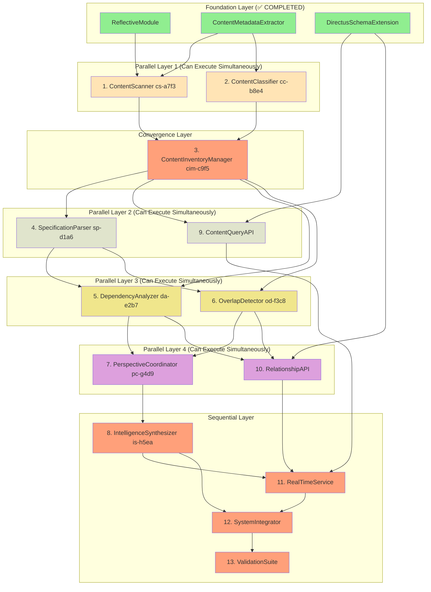

# Implementation Plan - Repository Content Discovery and Indexing

## Implementation Status

### ✅ COMPLETED FOUNDATION COMPONENTS
- **ReflectiveModule Infrastructure**: `src/rm_ddd/core/unified_reflective_module.py` - DONE with 19 passing tests
- **ContentMetadataExtractor**: `src/repository_discovery/core/content_metadata_extractor.py` - DONE with 46 passing tests  
- **DirectusSchemaExtension**: `src/repository_discovery/directus/schema_extension.py` - DONE with comprehensive referential integrity
- **Directus Recovery**: `directus_migration_recovered.py` - DONE, recovered from commit 4d2a4e62

### ❌ MISSING CRITICAL DEPENDENCY
- **Beast Mode DAG Executor**: REQUIRED for hierarchical task numbering (1.1, 1.2, 2.1) and parallel execution - NOT IMPLEMENTED
- **Impact**: Cannot execute tasks with proper parallelization, taskStatus tool only works with simple numbering (1, 2, 3)
- **Resolution Required**: Implement Beast Mode DAG execution system before proceeding with repository discovery tasks

## Remaining Implementation Tasks

### Phase 1: Content Discovery Components

- [-] 1. Implement ContentScanner [cs-a7f3]
  - **Target**: ContentScanner (150 lines)
  - **Dependencies**: ContentMetadataExtractor (✅ DONE)
  - Create ContentScanner class inheriting from ReflectiveModule
  - Implement discover_all_content() method to systematically scan repository filesystem
  - Add file system traversal with filtering and exclusion patterns
  - Write unit tests for content scanning functionality
  - **Integration Test**: Verify ContentScanner can discover and catalog sample repository structure
  - _Requirements: 1.1, 16.1, 18.1_

- [ ] 2. Implement ContentClassifier [cc-b8e4]
  - **Target**: ContentClassifier (150 lines)
  - **Dependencies**: ContentMetadataExtractor (✅ DONE)
  - Create ContentClassifier class inheriting from ReflectiveModule
  - Implement classify_content_types() method to categorize discovered content (specs, source code, docs, analysis, scripts)
  - Add pattern matching and heuristic classification logic
  - Write unit tests for content classification functionality
  - **Integration Test**: Verify ContentClassifier can correctly classify sample repository files
  - _Requirements: 1.2, 16.1, 18.1_

- [ ] 3. Implement ContentInventoryManager [cim-c9f5]
  - **Target**: ContentInventoryManager (150 lines)
  - **Dependencies**: ContentScanner (1), ContentClassifier (2)
  - Create ContentInventoryManager class inheriting from ReflectiveModule
  - Implement comprehensive inventory management combining scanning and classification results
  - Add change detection using git integration for automatic content updates
  - Write unit tests for inventory management functionality
  - **Integration Test**: Verify complete content discovery workflow from scanning through inventory
  - _Requirements: 1.4, 1.5, 16.1, 18.1_
### Phase 2: Specification Analysis Components

- [ ] 4. Implement SpecificationParser [sp-d1a6]
  - **Target**: SpecificationParser (200 lines)
  - **Dependencies**: ContentInventoryManager (3)
  - Create SpecificationParser class inheriting from ReflectiveModule
  - Implement analyze_specification() method to extract requirements, user stories, and acceptance criteria
  - Add markdown parsing and structured requirement extraction
  - Write unit tests for specification parsing functionality
  - **Integration Test**: Verify SpecificationParser can extract structured data from sample spec files
  - _Requirements: 2.1, 16.1, 18.1_

- [ ] 5. Implement DependencyAnalyzer [da-e2b7]
  - **Target**: DependencyAnalyzer (200 lines)
  - **Dependencies**: SpecificationParser (4), ContentInventoryManager (3)
  - Create DependencyAnalyzer class inheriting from ReflectiveModule
  - Implement identify_dependencies() method to find relationships between specifications
  - Add circular dependency detection and dependency graph construction
  - Write unit tests for dependency analysis functionality
  - **Integration Test**: Verify DependencyAnalyzer can map relationships in sample specification set
  - _Requirements: 2.2, 16.1, 18.1_

- [ ] 6. Implement OverlapDetector [od-f3c8]
  - **Target**: OverlapDetector (300 lines)
  - **Dependencies**: SpecificationParser (4), ContentInventoryManager (3)
  - Create OverlapDetector class inheriting from ReflectiveModule
  - Implement detect_overlaps() method to identify overlapping functionality and conflicting objectives
  - Add create_searchable_index() method to build searchable knowledge base of requirements
  - Create SpecificationAnalysis and OverlapMatrix domain models following RM-DDD patterns
  - Write unit tests for overlap detection and search indexing
  - **Integration Test**: Verify OverlapDetector can identify conflicts in sample specification set
  - _Requirements: 2.3, 2.4, 16.2, 18.1_

### Phase 3: Intelligence and API Components

- [ ] 7. Implement PerspectiveCoordinator [pc-g4d9]
  - **Target**: PerspectiveCoordinator (250 lines)
  - **Dependencies**: DependencyAnalyzer (5), OverlapDetector (6)
  - Create PerspectiveCoordinator class inheriting from ReflectiveModule
  - Implement engage_diverse_perspectives() method to coordinate multiple LLM expert perspectives
  - Add validate_with_ghostbusters() method integrating with existing Ghostbusters framework
  - Write unit tests for multi-perspective coordination functionality
  - **Integration Test**: Verify PerspectiveCoordinator can orchestrate multi-perspective analysis
  - _Requirements: 4.1, 4.2, 14.1, 16.1, 18.1_

- [ ] 8. Implement IntelligenceSynthesizer [is-h5ea]
  - **Target**: IntelligenceSynthesizer (250 lines)
  - **Dependencies**: PerspectiveCoordinator (7)
  - Create IntelligenceSynthesizer class inheriting from ReflectiveModule
  - Implement synthesize_perspectives() method to combine diverse viewpoints while preserving unique insights
  - Add resolve_conflicts() method with systematic conflict resolution protocols and confidence scoring
  - Create PerspectiveAnalysis and ConflictResolution domain models following RM-DDD patterns
  - Write unit tests for perspective synthesis and conflict resolution
  - **Integration Test**: Verify complete intelligence pipeline from perspective coordination through synthesis
  - _Requirements: 4.4, 11.1, 11.2, 18.1_

### Phase 4: API and Integration Components

- [ ] 9. Implement ContentQueryAPI
  - **Target**: ContentQueryAPI (200 lines)
  - **Dependencies**: DirectusSchemaExtension (✅ DONE), ContentInventoryManager (3)
  - Create ContentQueryAPI class inheriting from ReflectiveModule
  - Implement get_content_by_type() method with filtering, sorting, and referential integrity validation
  - Add search_content() method for full-text search across repository content with relationship traversal
  - Write unit tests for core API functionality including referential integrity edge cases
  - **Integration Test**: Verify ContentQueryAPI maintains referential integrity during concurrent access
  - _Requirements: 8.2, 30.1, 30.4, 16.1, 18.1_

- [ ] 10. Implement RelationshipAPI
  - **Target**: RelationshipAPI (200 lines)
  - **Dependencies**: DirectusSchemaExtension (✅ DONE), DependencyAnalyzer (5), OverlapDetector (6)
  - Create RelationshipAPI class inheriting from ReflectiveModule
  - Implement query_relationships() method for traversing dependencies and relationships
  - Add GraphQL-style relationship queries for dependencies and overlaps
  - Write unit tests for relationship API functionality
  - **Integration Test**: Verify RelationshipAPI can traverse and query complex repository relationships
  - _Requirements: 8.4, 16.1, 18.1_

- [ ] 11. Implement RealTimeService
  - **Target**: RealTimeService (250 lines)
  - **Dependencies**: ContentQueryAPI (9), RelationshipAPI (10), IntelligenceSynthesizer (8)
  - Create RealTimeService class inheriting from ReflectiveModule
  - Implement get_real_time_updates() method using WebSocket integration with Directus infrastructure
  - Add real-time notifications for repository changes and intelligence updates
  - Write integration tests for real-time update functionality
  - **Integration Test**: Verify complete real-time intelligence pipeline from content changes to notifications
  - _Requirements: 8.5, 29.2, 18.1_

### Phase 5: System Integration and Validation

- [ ] 12. Implement SystemIntegrator
  - **Target**: SystemIntegrator (200 lines)
  - **Dependencies**: IntelligenceSynthesizer (8), RealTimeService (11)
  - Create SystemIntegrator class inheriting from ReflectiveModule
  - Wire together all components into unified repository intelligence system
  - Create main RepositoryIntelligence aggregate root that coordinates all discovery and analysis operations
  - Add system-wide configuration and initialization
  - Write end-to-end integration tests for complete repository discovery workflow
  - **Integration Test**: Verify complete system integration from content discovery through intelligence synthesis to API access
  - _Requirements: 5.1, 5.2, 6.1, 18.4_

- [ ] 13. Implement ValidationSuite
  - **Target**: ValidationSuite (150 lines)
  - **Dependencies**: SystemIntegrator (12)
  - Create ValidationSuite class inheriting from ReflectiveModule
  - Create comprehensive test suite covering unit, integration, and system tests with >90% coverage
  - Add RDI traceability validation to ensure every implementation traces back to specific requirements
  - Implement systematic validation methods to prove the system follows its own systematic principles
  - Write validation tests that demonstrate measurable superiority over ad-hoc discovery methods
  - **Integration Test**: Verify complete system validation including RDI traceability and systematic compliance
  - _Requirements: 25.5, 19.4, 20.5, 18.5_

## Beast Mode DAG Analysis - Parallelization Opportunities

### Dependency Graph Structure

### Hierarchical Task Structure (Beast Mode Compatible)

**Phase 1: Parallel Content Discovery**
- [ ] 1.1 Implement ContentScanner [cs-a7f3] ⚡ PARALLEL
- [ ] 1.2 Implement ContentClassifier [cc-b8e4] ⚡ PARALLEL

**Phase 2: Content Integration** 
- [ ] 2.1 Implement ContentInventoryManager [cim-c9f5] 🔄 SEQUENTIAL (depends on 1.1, 1.2)

**Phase 3: Parallel Analysis Foundation**
- [ ] 3.1 Implement SpecificationParser [sp-d1a6] ⚡ PARALLEL
- [ ] 3.2 Implement ContentQueryAPI ⚡ PARALLEL

**Phase 4: Parallel Analysis Components**
- [ ] 4.1 Implement DependencyAnalyzer [da-e2b7] ⚡ PARALLEL  
- [ ] 4.2 Implement OverlapDetector [od-f3c8] ⚡ PARALLEL

**Phase 5: Parallel Intelligence & API**
- [ ] 5.1 Implement PerspectiveCoordinator [pc-g4d9] ⚡ PARALLEL
- [ ] 5.2 Implement RelationshipAPI ⚡ PARALLEL

**Phase 6: Sequential Integration Pipeline**
- [ ] 6.1 Implement IntelligenceSynthesizer [is-h5ea] 🔄 SEQUENTIAL
- [ ] 6.2 Implement RealTimeService 🔄 SEQUENTIAL  
- [ ] 6.3 Implement SystemIntegrator 🔄 SEQUENTIAL
- [ ] 6.4 Implement ValidationSuite 🔄 SEQUENTIAL

### Beast Mode Execution Strategy

**Maximum Parallelization**: 8 tasks can run in parallel across 4 phases
**Critical Path**: Foundation → ContentInventoryManager → SpecificationParser → DependencyAnalyzer → PerspectiveCoordinator → IntelligenceSynthesizer → RealTimeService → SystemIntegrator → ValidationSuite

**Parallel Execution Waves**:
1. **Wave 1**: ContentScanner + ContentClassifier (2 parallel)
2. **Wave 2**: SpecificationParser + ContentQueryAPI (2 parallel) 
3. **Wave 3**: DependencyAnalyzer + OverlapDetector (2 parallel)
4. **Wave 4**: PerspectiveCoordinator + RelationshipAPI (2 parallel)
5. **Wave 5**: Sequential pipeline (4 sequential)

**Total Execution Time Reduction**: ~50% compared to pure sequential execution

## Next Steps

## BLOCKED: Missing Beast Mode DAG Executor

**Cannot proceed with repository discovery implementation** until Beast Mode DAG execution system is implemented.

**Required Capabilities:**
- Parse hierarchical task numbering (1.1, 1.2, 2.1, etc.)
- Execute tasks in parallel waves based on dependency analysis
- Update task status for hierarchical numbering
- Support Beast Mode systematic execution principles

**Next Action:** Implement Beast Mode DAG Executor as prerequisite dependency.