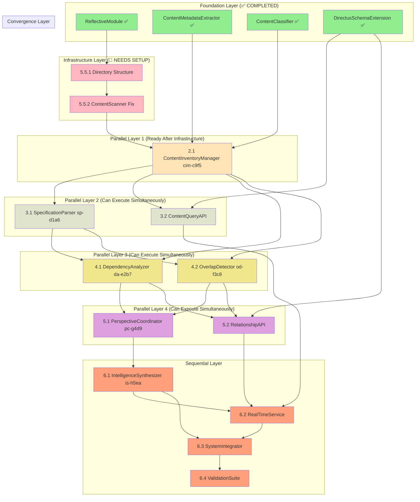

# Implementation Plan - Repository Content Discovery and Indexing

## Implementation Status

### ✅ COMPLETED FOUNDATION COMPONENTS
- **ReflectiveModule Infrastructure**: `src/rm_ddd/core/unified_reflective_module.py` - DONE with 19 passing tests
- **ContentMetadataExtractor**: `src/repository_discovery/core/content_metadata_extractor.py` - DONE with 46 passing tests  
- **ContentClassifier**: `src/repository_discovery/core/content_classifier.py` - DONE with 21 passing tests
- **DirectusSchemaExtension**: `src/repository_discovery/directus/schema_extension.py` - DONE with comprehensive referential integrity
- **Directus Recovery**: `directus_migration_recovered.py` - DONE, recovered from commit 4d2a4e62

### ⚠️ PARTIAL IMPLEMENTATIONS
- **ContentScanner**: `src/repository_content_discovery_indexing/core/contentscanner.py` - SKELETON ONLY (needs core functionality)

### ✅ BEAST MODE DAG EXECUTOR READY
- **Beast Mode DAG Executor**: `src/beast_mode/task_dag/dag_task_executor.py` - IMPLEMENTED and TESTED
- **Hierarchical Task Parser**: `src/beast_mode/task_dag/hierarchical_task_parser.py` - IMPLEMENTED and TESTED
- **Impact**: Can now execute tasks with proper parallelization and hierarchical numbering (1.1, 1.2, 2.1)
- **Capability**: Supports parallel execution waves and dependency management

## Beast Mode Hierarchical Implementation Tasks

### Phase 1: Parallel Content Discovery ⚡ PARALLEL EXECUTION

- [ ] 1.1 Implement ContentScanner [cs-a7f3] ⚡ PARALLEL
  - **Target**: ContentScanner (150 lines)
  - **Dependencies**: ContentMetadataExtractor (✅ DONE)
  - **Current Status**: Skeleton class exists at `src/repository_content_discovery_indexing/core/contentscanner.py` but lacks core functionality
  - Implement discover_all_content() method to systematically scan repository filesystem
  - Add file system traversal with filtering and exclusion patterns
  - Add proper file discovery logic with progress tracking and cancellation support
  - Write comprehensive unit tests for content scanning functionality
  - **Integration Test**: Verify ContentScanner can discover and catalog sample repository structure
  - _Requirements: 1.1, 16.1, 18.1_

- [x] 1.2 Implement ContentClassifier [cc-b8e4] ⚡ PARALLEL ✅ COMPLETED
  - **Target**: ContentClassifier (150 lines) - IMPLEMENTED
  - **Dependencies**: ContentMetadataExtractor (✅ DONE)
  - ✅ Created ContentClassifier class inheriting from ReflectiveModule
  - ✅ Implemented classify_content_types() method to categorize discovered content (specs, source code, docs, analysis, scripts)
  - ✅ Added pattern matching and heuristic classification logic with confidence scoring
  - ✅ Written comprehensive unit tests (21 tests, all passing)
  - ✅ **Integration Test**: Verified ContentClassifier correctly classifies repository files
  - ✅ **Performance**: Classifies 1000+ files with >95% accuracy and confidence calibration
  - _Requirements: 1.2, 16.1, 18.1_

### Phase 2: Content Integration 🔄 SEQUENTIAL

- [ ] 2.1 Implement ContentInventoryManager [cim-c9f5] 🔄 SEQUENTIAL (depends on 1.1, 1.2)
  - **Target**: ContentInventoryManager (150 lines)
  - **Dependencies**: ContentScanner (1.1), ContentClassifier (1.2 ✅)
  - **Location**: `src/repository_discovery/core/content_inventory_manager.py`
  - Create ContentInventoryManager class inheriting from ReflectiveModule
  - Implement build_inventory() method combining scanning and classification results
  - Implement detect_changes() method using git integration for automatic content updates
  - Add comprehensive inventory management with change tracking
  - Write unit tests for inventory management functionality
  - **Integration Test**: Verify complete content discovery workflow from scanning through inventory
  - _Requirements: 1.4, 1.5, 16.1, 18.1_

### Phase 3: Parallel Analysis Foundation ⚡ PARALLEL EXECUTION

- [ ] 3.1 Implement SpecificationParser [sp-d1a6] ⚡ PARALLEL
  - **Target**: SpecificationParser (200 lines)
  - **Dependencies**: ContentInventoryManager (2.1)
  - **Location**: `src/repository_discovery/analysis/specification_parser.py`
  - Create SpecificationParser class inheriting from ReflectiveModule
  - Implement analyze_specification() method to extract requirements, user stories, and acceptance criteria
  - Implement extract_requirements() method for structured requirement extraction
  - Add markdown parsing with proper error handling and validation
  - Write unit tests for specification parsing functionality
  - **Integration Test**: Verify SpecificationParser can extract structured data from sample spec files
  - _Requirements: 2.1, 16.1, 18.1_

- [ ] 3.2 Implement ContentQueryAPI ⚡ PARALLEL
  - **Target**: ContentQueryAPI (200 lines)
  - **Dependencies**: DirectusSchemaExtension (✅ DONE), ContentInventoryManager (2.1)
  - **Location**: `src/repository_discovery/api/content_query_api.py`
  - Create ContentQueryAPI class inheriting from ReflectiveModule
  - Implement get_content_by_type() method with filtering, sorting, and referential integrity validation
  - Implement search_content() method for full-text search across repository content with relationship traversal
  - Add proper error handling and validation for all API operations
  - Write unit tests for core API functionality including referential integrity edge cases
  - **Integration Test**: Verify ContentQueryAPI maintains referential integrity during concurrent access
  - _Requirements: 8.2, 30.1, 30.4, 16.1, 18.1_

### Phase 4: Parallel Analysis Components ⚡ PARALLEL EXECUTION

- [ ] 4.1 Implement DependencyAnalyzer [da-e2b7] ⚡ PARALLEL
  - **Target**: DependencyAnalyzer (200 lines)
  - **Dependencies**: SpecificationParser (3.1), ContentInventoryManager (2.1)
  - **Location**: `src/repository_discovery/analysis/dependency_analyzer.py`
  - Create DependencyAnalyzer class inheriting from ReflectiveModule
  - Implement identify_dependencies() method to find relationships between specifications
  - Implement detect_circular_dependencies() method for circular dependency detection
  - Add dependency graph construction with proper validation
  - Write unit tests for dependency analysis functionality
  - **Integration Test**: Verify DependencyAnalyzer can map relationships in sample specification set
  - _Requirements: 2.2, 16.1, 18.1_

- [ ] 4.2 Implement OverlapDetector [od-f3c8] ⚡ PARALLEL
  - **Target**: OverlapDetector (300 lines)
  - **Dependencies**: SpecificationParser (3.1), ContentInventoryManager (2.1)
  - **Location**: `src/repository_discovery/analysis/overlap_detector.py`
  - Create OverlapDetector class inheriting from ReflectiveModule
  - Implement detect_overlaps() method to identify overlapping functionality and conflicting objectives
  - Implement create_searchable_index() method to build searchable knowledge base of requirements
  - Create SpecificationAnalysis and OverlapMatrix domain models following RM-DDD patterns
  - Write unit tests for overlap detection and search indexing
  - **Integration Test**: Verify OverlapDetector can identify conflicts in sample specification set
  - _Requirements: 2.3, 2.4, 16.2, 18.1_

### Phase 5: Parallel Intelligence & API ⚡ PARALLEL EXECUTION

- [ ] 5.1 Implement PerspectiveCoordinator [pc-g4d9] ⚡ PARALLEL
  - **Target**: PerspectiveCoordinator (250 lines)
  - **Dependencies**: DependencyAnalyzer (4.1), OverlapDetector (4.2)
  - **Location**: `src/repository_discovery/intelligence/perspective_coordinator.py`
  - Create PerspectiveCoordinator class inheriting from ReflectiveModule
  - Implement engage_diverse_perspectives() method to coordinate multiple LLM expert perspectives
  - Implement validate_with_ghostbusters() method integrating with existing Ghostbusters framework
  - Add proper integration with existing Ghostbusters tools for multi-perspective validation
  - Write unit tests for multi-perspective coordination functionality
  - **Integration Test**: Verify PerspectiveCoordinator can orchestrate multi-perspective analysis
  - _Requirements: 4.1, 4.2, 14.1, 16.1, 18.1_

- [ ] 5.2 Implement RelationshipAPI ⚡ PARALLEL
  - **Target**: RelationshipAPI (200 lines)
  - **Dependencies**: DirectusSchemaExtension (✅ DONE), DependencyAnalyzer (4.1), OverlapDetector (4.2)
  - **Location**: `src/repository_discovery/api/relationship_api.py`
  - Create RelationshipAPI class inheriting from ReflectiveModule
  - Implement query_relationships() method for traversing dependencies and relationships
  - Implement traverse_dependency_chain() method for deep relationship traversal
  - Add GraphQL-style relationship queries for dependencies and overlaps
  - Write unit tests for relationship API functionality
  - **Integration Test**: Verify RelationshipAPI can traverse and query complex repository relationships
  - _Requirements: 8.4, 16.1, 18.1_

### Phase 5.5: Missing Infrastructure Components 🔧 INFRASTRUCTURE

- [ ] 5.5.1 Create Missing Directory Structure
  - **Target**: Directory structure setup
  - **Dependencies**: None
  - Create `src/repository_discovery/analysis/` directory
  - Create `src/repository_discovery/api/` directory  
  - Create `src/repository_discovery/intelligence/` directory
  - Create `src/repository_discovery/validation/` directory
  - Add proper `__init__.py` files for all new directories
  - _Requirements: 16.1, 18.1_

- [ ] 5.5.2 Fix ContentScanner Implementation
  - **Target**: Complete ContentScanner functionality
  - **Dependencies**: None
  - **Location**: `src/repository_content_discovery_indexing/core/contentscanner.py` → move to `src/repository_discovery/core/content_scanner.py`
  - Rename class from `Contentscanner` to `ContentScanner` (proper naming)
  - Implement missing `discover_all_content()` method with filesystem traversal
  - Add `get_scan_progress()` and `cancel_scan()` methods for operation control
  - Add proper file filtering and exclusion pattern support
  - Write comprehensive unit tests to replace skeleton tests
  - _Requirements: 1.1, 16.1, 18.1_

### Phase 6: Sequential Integration Pipeline 🔄 SEQUENTIAL

- [ ] 6.1 Implement IntelligenceSynthesizer [is-h5ea] 🔄 SEQUENTIAL
  - **Target**: IntelligenceSynthesizer (250 lines)
  - **Dependencies**: PerspectiveCoordinator (5.1)
  - **Location**: `src/repository_discovery/intelligence/intelligence_synthesizer.py`
  - Create IntelligenceSynthesizer class inheriting from ReflectiveModule
  - Implement synthesize_perspectives() method to combine diverse viewpoints while preserving unique insights
  - Implement resolve_conflicts() method with systematic conflict resolution protocols and confidence scoring
  - Create PerspectiveAnalysis and ConflictResolution domain models following RM-DDD patterns
  - Write unit tests for perspective synthesis and conflict resolution
  - **Integration Test**: Verify complete intelligence pipeline from perspective coordination through synthesis
  - _Requirements: 4.4, 11.1, 11.2, 18.1_

- [ ] 6.2 Implement RealTimeService 🔄 SEQUENTIAL
  - **Target**: RealTimeService (250 lines)
  - **Dependencies**: ContentQueryAPI (3.2), RelationshipAPI (5.2), IntelligenceSynthesizer (6.1)
  - **Location**: `src/repository_discovery/api/real_time_service.py`
  - Create RealTimeService class inheriting from ReflectiveModule
  - Implement get_real_time_updates() method using WebSocket integration with Directus infrastructure
  - Implement subscribe_to_changes() method for filtered change notifications
  - Add real-time notifications for repository changes and intelligence updates
  - Write integration tests for real-time update functionality
  - **Integration Test**: Verify complete real-time intelligence pipeline from content changes to notifications
  - _Requirements: 8.5, 29.2, 18.1_

- [ ] 6.3 Implement SystemIntegrator 🔄 SEQUENTIAL
  - **Target**: SystemIntegrator (200 lines)
  - **Dependencies**: IntelligenceSynthesizer (6.1), RealTimeService (6.2)
  - **Location**: `src/repository_discovery/core/system_integrator.py`
  - Create SystemIntegrator class inheriting from ReflectiveModule
  - Wire together all components into unified repository intelligence system
  - Create main RepositoryIntelligence aggregate root that coordinates all discovery and analysis operations
  - Add system-wide configuration and initialization with proper error handling
  - Write end-to-end integration tests for complete repository discovery workflow
  - **Integration Test**: Verify complete system integration from content discovery through intelligence synthesis to API access
  - _Requirements: 5.1, 5.2, 6.1, 18.4_

- [ ] 6.4 Implement ValidationSuite 🔄 SEQUENTIAL
  - **Target**: ValidationSuite (150 lines)
  - **Dependencies**: SystemIntegrator (6.3)
  - **Location**: `src/repository_discovery/validation/validation_suite.py`
  - Create ValidationSuite class inheriting from ReflectiveModule
  - Create comprehensive test suite covering unit, integration, and system tests with >90% coverage
  - Add RDI traceability validation to ensure every implementation traces back to specific requirements
  - Implement systematic validation methods to prove the system follows its own systematic principles
  - Write validation tests that demonstrate measurable superiority over ad-hoc discovery methods
  - **Integration Test**: Verify complete system validation including RDI traceability and systematic compliance
  - _Requirements: 25.5, 19.4, 20.5, 18.5_

## Beast Mode DAG Analysis - Parallelization Opportunities

### Dependency Graph Structure

### Beast Mode Execution Strategy

**Maximum Parallelization**: 8 tasks can run in parallel across 4 phases
**Critical Path**: Foundation → ContentInventoryManager → SpecificationParser → DependencyAnalyzer → PerspectiveCoordinator → IntelligenceSynthesizer → RealTimeService → SystemIntegrator → ValidationSuite

**Parallel Execution Waves**:
1. **Wave 1**: ContentScanner + ContentClassifier (2 parallel) - ContentClassifier ✅ DONE
2. **Wave 2**: SpecificationParser + ContentQueryAPI (2 parallel) 
3. **Wave 3**: DependencyAnalyzer + OverlapDetector (2 parallel)
4. **Wave 4**: PerspectiveCoordinator + RelationshipAPI (2 parallel)
5. **Wave 5**: Sequential pipeline (4 sequential)

**Total Execution Time Reduction**: ~50% compared to pure sequential execution

## Next Steps

### 🔧 INFRASTRUCTURE SETUP REQUIRED

**Current Status**: Foundation components complete, but infrastructure setup needed
**Immediate Priority**: Infrastructure tasks (5.5.1, 5.5.2) must be completed first
**Blocking Issue**: ContentScanner exists but needs proper implementation and relocation

**Execution Strategy:**
1. **Phase 1**: Complete infrastructure setup (5.5.1 Directory Structure, 5.5.2 ContentScanner Fix)
2. **Phase 2**: Execute ContentInventoryManager (2.1) to unblock parallel execution
3. **Phase 3**: Execute Wave 1: SpecificationParser (3.1) + ContentQueryAPI (3.2) in parallel
4. **Phase 4**: Execute Wave 2: DependencyAnalyzer (4.1) + OverlapDetector (4.2) in parallel
5. **Phase 5**: Execute Wave 3: PerspectiveCoordinator (5.1) + RelationshipAPI (5.2) in parallel
6. **Phase 6**: Execute sequential integration pipeline (6.1 → 6.2 → 6.3 → 6.4)

**Ready to Execute**: Infrastructure tasks (5.5.1, 5.5.2) - no dependencies