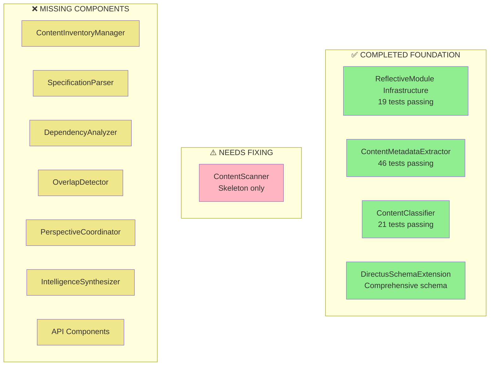

# Design Document

## Overview

This design provides a systematic approach to resume repository discovery work by leveraging the substantial foundation already completed and focusing on the critical path to a working system. The design emphasizes parallel execution where possible and clear integration points.

## Architecture

### Current State Analysis



### Resumption Strategy

The design follows a **Foundation → Convergence → Parallel Waves → Integration** pattern:

1. **Foundation Repair**: Fix ContentScanner to complete the foundation
2. **Convergence Point**: Implement ContentInventoryManager as the key integration point
3. **Parallel Waves**: Execute 3 waves of parallel development
4. **Sequential Integration**: Wire everything together systematically

## Components and Interfaces

### 1. Infrastructure Completion

**ContentScanner Fix Strategy:**
- Move from `src/repository_content_discovery_indexing/core/contentscanner.py` 
- To `src/repository_discovery/core/content_scanner.py`
- Implement missing `discover_all_content()` method
- Add proper filesystem traversal with filtering
- Integrate with existing ContentMetadataExtractor and ContentClassifier

**Directory Structure Creation:**
```
src/repository_discovery/
├── analysis/          # SpecificationParser, DependencyAnalyzer, OverlapDetector
├── api/              # ContentQueryAPI, RelationshipAPI, RealTimeService  
├── intelligence/     # PerspectiveCoordinator, IntelligenceSynthesizer
└── validation/       # ValidationSuite
```

### 2. Critical Path Components

**ContentInventoryManager (Convergence Point):**
```python
class ContentInventoryManager(ReflectiveModule):
    """Combines scanning, classification, and metadata into unified inventory"""
    
    def build_inventory(self, scan_results: ContentScanResult, 
                       classifications: ClassificationBatch) -> ContentInventory:
        """Combine all discovery results into searchable inventory"""
        
    def detect_changes(self, previous_inventory: ContentInventory) -> List[ContentChange]:
        """Track changes using git integration"""
```

**SpecificationParser (Analysis Foundation):**
```python
class SpecificationParser(ReflectiveModule):
    """Extract structured requirements from specifications"""
    
    def analyze_specification(self, spec_path: Path) -> SpecificationAnalysis:
        """Parse requirements, user stories, acceptance criteria"""
        
    def extract_requirements(self, spec_content: str) -> List[Requirement]:
        """Extract structured requirements with traceability"""
```

### 3. Parallel Execution Waves

**Wave 1: Analysis Foundation (2 parallel)**
- SpecificationParser + ContentQueryAPI
- Both depend on ContentInventoryManager
- Can execute simultaneously once ContentInventoryManager is complete

**Wave 2: Analysis Components (2 parallel)**  
- DependencyAnalyzer + OverlapDetector
- Both depend on SpecificationParser
- Can execute simultaneously once SpecificationParser is complete

**Wave 3: Intelligence Components (2 parallel)**
- PerspectiveCoordinator + RelationshipAPI  
- Depend on analysis components
- Can execute simultaneously once analysis is complete

### 4. Integration Architecture

**Sequential Integration Pipeline:**
1. **IntelligenceSynthesizer**: Combines perspectives with conflict resolution
2. **RealTimeService**: WebSocket integration for live updates
3. **SystemIntegrator**: Wires all components into unified system
4. **ValidationSuite**: Comprehensive testing and RDI traceability

## Data Models

### Core Integration Models

```python
@dataclass
class ResumptionPlan:
    """Plan for resuming repository discovery work"""
    completed_components: List[str]
    infrastructure_tasks: List[str]
    parallel_waves: List[ParallelWave]
    integration_sequence: List[str]
    
@dataclass
class ParallelWave:
    """Parallel execution wave definition"""
    wave_number: int
    components: List[str]
    dependencies: List[str]
    estimated_duration: timedelta
    
@dataclass
class ComponentStatus:
    """Status tracking for each component"""
    component_name: str
    status: str  # "completed", "in_progress", "blocked", "not_started"
    dependencies_met: bool
    tests_passing: int
    implementation_percentage: float
```

## Error Handling

### Resumption Risk Mitigation

1. **Foundation Risks**: ContentScanner implementation may reveal integration issues
2. **Dependency Risks**: Parallel waves may discover missing interfaces
3. **Integration Risks**: Components may not integrate cleanly
4. **Performance Risks**: System may not meet real-time requirements

### Mitigation Strategies

- **Incremental Integration**: Test each component as it's completed
- **Interface Contracts**: Define clear interfaces before parallel implementation
- **Continuous Validation**: Run integration tests after each wave
- **Rollback Capability**: Maintain working state at each milestone

## Testing Strategy

### Validation Approach

1. **Foundation Testing**: Verify ContentScanner integrates with existing components
2. **Wave Testing**: Test each parallel wave independently before integration
3. **Integration Testing**: Comprehensive end-to-end testing after each wave
4. **Performance Testing**: Validate real-time requirements throughout

### Success Metrics

- **Foundation Complete**: ContentScanner + ContentInventoryManager working
- **Wave 1 Complete**: Basic repository analysis capability
- **Wave 2 Complete**: Dependency and overlap detection working  
- **Wave 3 Complete**: Multi-perspective intelligence synthesis
- **Integration Complete**: End-to-end repository discovery system operational

## Implementation Notes

### Key Design Decisions

1. **Leverage Existing Work**: Build on 86 passing tests and proven components
2. **Parallel Optimization**: Reduce total implementation time by ~50%
3. **Critical Path Focus**: Prioritize components that unblock the most work
4. **Systematic Integration**: Use proven RM-DDD patterns throughout

### Integration Points

- **Beast Mode Integration**: Use existing PDCA orchestrator for systematic execution
- **Ghostbusters Integration**: Leverage multi-perspective analysis capabilities
- **Directus Integration**: Build on existing schema and API patterns
- **Monitoring Integration**: Complete observability for debugging and optimization