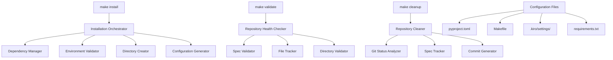

# Repository Setup and Installation Design

## Overview

This design addresses the critical repository setup and installation issues that prevent effective team collaboration and system deployment. The solution provides a comprehensive, automated approach to repository initialization, dependency management, and ongoing maintenance through a systematic installation and validation framework.

The design implements a multi-layered approach:
1. **Installation Layer**: Automated dependency and environment setup
2. **Validation Layer**: Repository health checking and compliance verification
3. **Cleanup Layer**: Automated version control management
4. **Configuration Layer**: Development environment standardization

## Architecture

### System Components



### Design Decisions

#### Decision 1: Makefile-Based Interface
**Rationale**: Provides familiar, standardized entry points (`make install`, `make validate`, `make cleanup`) that work across different environments and are easily discoverable.

#### Decision 2: Python-Based Implementation
**Rationale**: Leverages existing Python ecosystem for dependency management, file operations, and git integration. Ensures consistency with the rest of the codebase.

#### Decision 3: Incremental Validation
**Rationale**: Allows developers to run validation checks independently of installation, enabling continuous repository health monitoring.

#### Decision 4: Automated Spec Discovery
**Rationale**: Eliminates manual tracking of specification files by automatically discovering and managing .kiro/specs structure.

## Components and Interfaces

### Installation Orchestrator
**Purpose**: Coordinates the complete installation process
**Interface**:
```python
class InstallationOrchestrator:
    def install(self) -> InstallationResult:
        """Execute complete installation process"""
        
    def validate_prerequisites(self) -> ValidationResult:
        """Check system prerequisites"""
        
    def report_status(self) -> StatusReport:
        """Provide installation status and recommendations"""
```

### Dependency Manager
**Purpose**: Handles Python package installation and version management
**Interface**:
```python
class DependencyManager:
    def install_python_dependencies(self) -> DependencyResult:
        """Install all Python packages from requirements files"""
        
    def validate_versions(self) -> VersionResult:
        """Verify installed package versions match requirements"""
        
    def update_lockfile(self) -> LockfileResult:
        """Update dependency lockfile if needed"""
```

### Repository Health Checker
**Purpose**: Validates repository state and identifies issues
**Interface**:
```python
class RepositoryHealthChecker:
    def check_specs(self) -> SpecValidationResult:
        """Validate .kiro/specs structure and content"""
        
    def check_untracked_files(self) -> UntrackedFilesResult:
        """Identify files that should be version controlled"""
        
    def check_directories(self) -> DirectoryValidationResult:
        """Verify required directories exist with proper permissions"""
        
    def generate_recommendations(self) -> List[Recommendation]:
        """Provide actionable fix recommendations"""
```

### Repository Cleaner
**Purpose**: Automates git operations for repository maintenance
**Interface**:
```python
class RepositoryCleaner:
    def analyze_git_status(self) -> GitStatusAnalysis:
        """Analyze current git status for cleanup opportunities"""
        
    def add_spec_files(self) -> GitOperationResult:
        """Add untracked specification files to git"""
        
    def generate_commit_messages(self) -> List[CommitMessage]:
        """Generate appropriate commit messages for changes"""
        
    def execute_cleanup(self) -> CleanupResult:
        """Execute the complete cleanup process"""
```

## Data Models

### Installation Result
```python
@dataclass
class InstallationResult:
    success: bool
    dependencies_installed: List[str]
    directories_created: List[str]
    configurations_generated: List[str]
    errors: List[str]
    warnings: List[str]
    next_steps: List[str]
```

### Validation Result
```python
@dataclass
class ValidationResult:
    is_healthy: bool
    missing_specs: List[str]
    untracked_files: List[str]
    directory_issues: List[str]
    recommendations: List[Recommendation]
    severity_level: str  # 'info', 'warning', 'error', 'critical'
```

### Cleanup Result
```python
@dataclass
class CleanupResult:
    files_added: List[str]
    commits_created: List[str]
    conflicts_resolved: List[str]
    remaining_issues: List[str]
    final_git_status: str
```

## Error Handling

### Installation Errors
- **Missing Prerequisites**: Clear error messages with installation instructions
- **Permission Issues**: Guidance on fixing directory permissions
- **Network Failures**: Retry mechanisms with fallback options
- **Version Conflicts**: Detailed conflict resolution steps

### Validation Errors
- **Missing Specifications**: Automatic creation templates or manual guidance
- **Corrupted Files**: Recovery procedures and backup restoration
- **Permission Problems**: Automated permission fixing where safe
- **Git Issues**: Step-by-step git repair instructions

### Cleanup Errors
- **Merge Conflicts**: Interactive resolution guidance
- **Large File Issues**: Automatic .gitignore suggestions
- **Branch State Problems**: Safe branch cleanup procedures
- **Remote Sync Issues**: Push/pull conflict resolution

## Testing Strategy

### Unit Tests
- **Component Isolation**: Each component tested independently
- **Mock External Dependencies**: Git, filesystem, network operations
- **Error Condition Coverage**: All error paths tested
- **Configuration Variations**: Different environment setups

### Integration Tests
- **End-to-End Workflows**: Complete install → validate → cleanup cycles
- **Real Repository States**: Tests with actual .kiro/specs structures
- **Cross-Platform Compatibility**: Linux, macOS, Windows testing
- **Performance Benchmarks**: Installation time and resource usage

### Acceptance Tests
- **User Story Validation**: Each requirement acceptance criteria tested
- **Real Developer Workflows**: Actual team member onboarding scenarios
- **Edge Case Handling**: Corrupted repositories, partial installations
- **Rollback Scenarios**: Recovery from failed installations

## Implementation Phases

### Phase 1: Core Installation (Requirements 1 & 4)
- Implement basic `make install` functionality
- Python dependency management
- Directory creation and validation
- Basic error reporting

### Phase 2: Repository Validation (Requirement 3)
- Implement `make validate` command
- Specification structure checking
- Untracked file detection
- Health reporting system

### Phase 3: Specification Management (Requirement 2)
- Automatic spec discovery and tracking
- Version control integration
- Spec structure validation
- Template generation

### Phase 4: Automated Cleanup (Requirement 5)
- Implement `make cleanup` command
- Intelligent git operations
- Commit message generation
- Conflict resolution guidance

### Phase 5: Advanced Features
- Interactive installation modes
- Custom configuration profiles
- Advanced validation rules
- Automated maintenance scheduling

## Configuration Management

### Installation Configuration
```yaml
# .kiro/settings/installation.yml
installation:
  python_version: ">=3.9"
  required_tools:
    - git
    - make
    - python3
    - pip
  optional_tools:
    - docker
    - redis-cli
  directories:
    - .kiro/specs
    - .kiro/hooks
    - .kiro/steering
    - logs
    - scripts
```

### Validation Rules
```yaml
# .kiro/settings/validation.yml
validation:
  spec_structure:
    required_files: [requirements.md, design.md, tasks.md]
    optional_files: [notes.md, research.md]
  git_tracking:
    always_track: [".kiro/specs/**/*.md"]
    never_track: ["*.log", "*.tmp", "__pycache__"]
  health_checks:
    - missing_dependencies
    - untracked_specs
    - directory_permissions
```

## Security Considerations

### File System Security
- **Permission Validation**: Ensure proper directory permissions
- **Path Traversal Prevention**: Validate all file paths
- **Temporary File Cleanup**: Secure handling of temporary files
- **Configuration File Protection**: Secure storage of sensitive settings

### Git Security
- **Credential Handling**: Never store credentials in repository
- **Branch Protection**: Validate branch state before operations
- **Remote Validation**: Verify remote repository authenticity
- **Commit Signing**: Support for signed commits where configured

### Dependency Security
- **Package Verification**: Validate package integrity
- **Version Pinning**: Use specific versions for security
- **Vulnerability Scanning**: Check for known vulnerabilities
- **Source Validation**: Verify package sources

## Performance Considerations

### Installation Performance
- **Parallel Operations**: Install dependencies concurrently where safe
- **Caching Strategy**: Cache downloaded packages and validation results
- **Incremental Updates**: Only update changed components
- **Progress Reporting**: Real-time feedback on long operations

### Validation Performance
- **Lazy Loading**: Only validate when necessary
- **Incremental Checks**: Skip unchanged files
- **Parallel Validation**: Run independent checks concurrently
- **Result Caching**: Cache validation results with invalidation

### Cleanup Performance
- **Batch Operations**: Group git operations efficiently
- **Smart Filtering**: Avoid processing obviously excluded files
- **Progress Tracking**: Show progress for large cleanup operations
- **Rollback Optimization**: Fast rollback for failed operations

## Monitoring and Observability

### Installation Metrics
- Installation success/failure rates
- Installation duration by component
- Error frequency and types
- Resource usage during installation

### Validation Metrics
- Repository health scores over time
- Common validation failures
- Resolution success rates
- Validation performance metrics

### Cleanup Metrics
- Files processed per cleanup
- Commit generation success rates
- Conflict resolution effectiveness
- Repository cleanliness trends

This design provides a comprehensive, systematic approach to repository setup and installation that addresses all requirements while maintaining flexibility for future enhancements and different development environments.