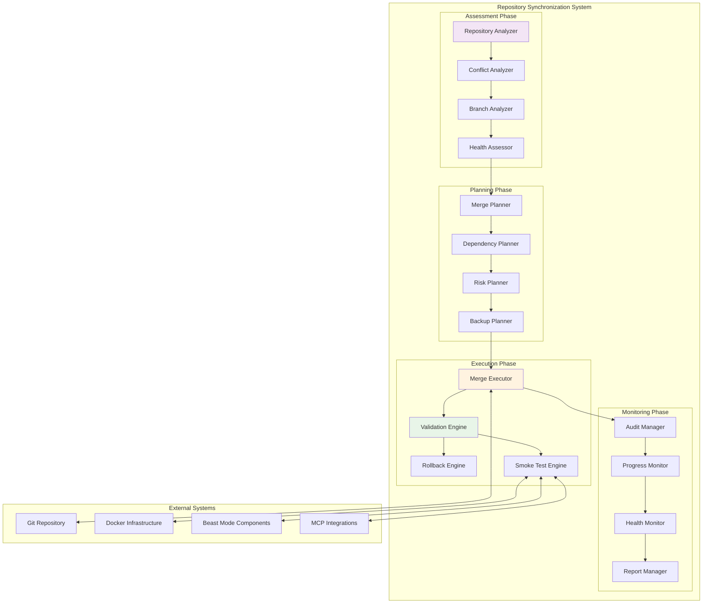
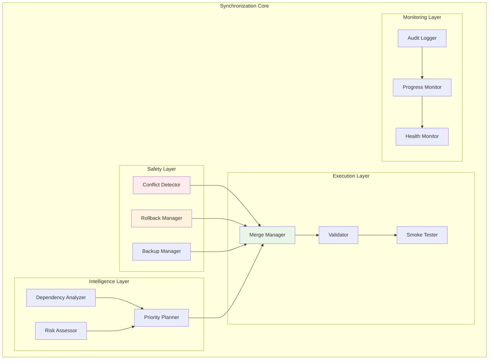
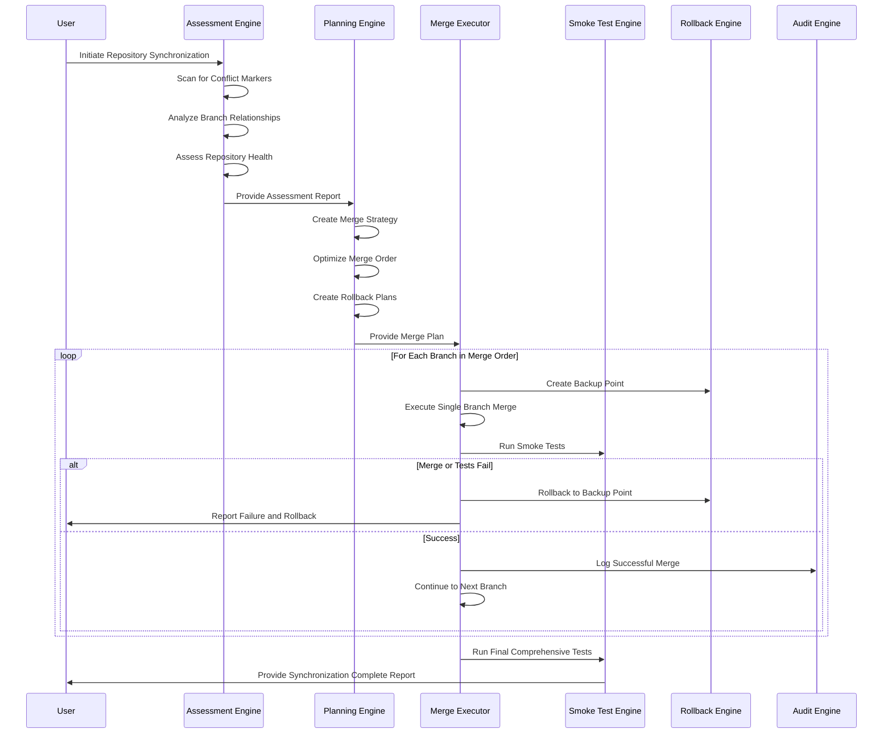
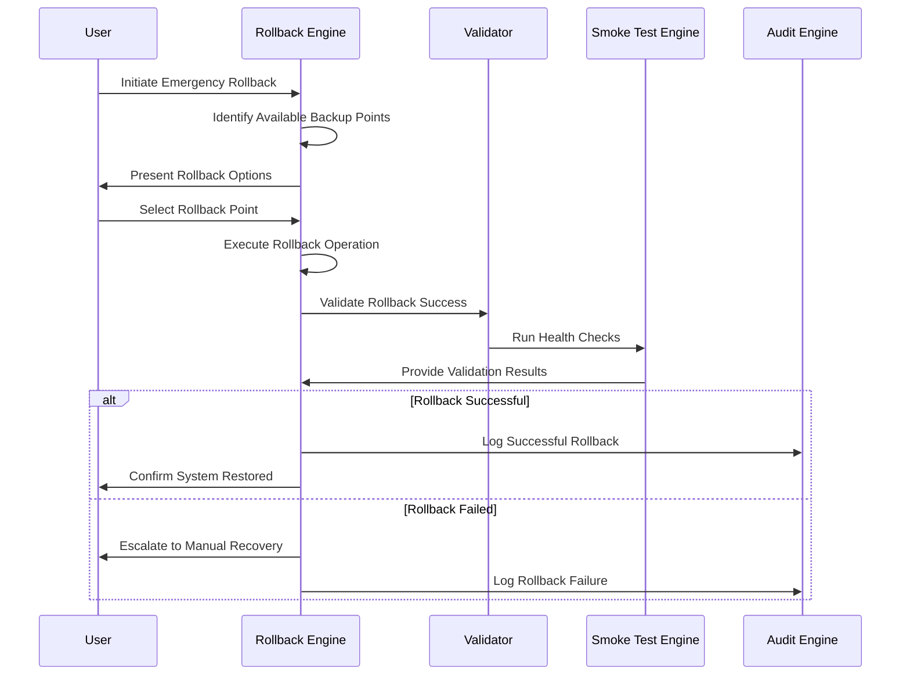

# Design Document

## Overview

The Repository Synchronization and Cleanup system provides a systematic, Beast Mode compliant approach to safely merging multiple feature branches back to master while preventing conflict markers, maintaining code quality, and ensuring comprehensive validation at every step. This design addresses the complex git state where multiple branches have diverged from master and need careful integration with automated rollback capabilities.

**ARCHITECTURAL CONSTRAINT**: This system enforces **systematic safety patterns** throughout the synchronization process:

- **Conflict Prevention**: Automated detection and prevention of git conflict markers
- **Rollback Capabilities**: Every operation has automatic rollback to known-good states
- **Comprehensive Testing**: Smoke tests and validation at every checkpoint
- **Audit Trails**: Complete documentation of all operations and decisions
- **Beast Mode Compliance**: All components follow ReflectiveModule patterns

The system transforms a potentially dangerous multi-branch merge scenario into a systematic, validated process with multiple safety nets and recovery mechanisms.

## Architecture

### High-Level Synchronization Architecture



### Component Architecture



## Components and Interfaces

### 1. Repository Assessment Engine

**Purpose**: Comprehensive analysis of current repository state and merge readiness

**Key Responsibilities**:
- Scan for conflict markers and repository health issues
- Analyze branch relationships and dependencies
- Assess merge complexity and risk factors
- Generate comprehensive repository health reports

**Interface**:
```python
class RepositoryAssessmentEngine(ReflectiveModule):
    def __init__(self, config: Dict[str, Any])
    def assess_repository_health(self) -> RepositoryHealthReport
    def analyze_branch_relationships(self) -> BranchDependencyGraph
    def detect_conflict_markers(self) -> ConflictMarkerReport
    def assess_merge_readiness(self) -> MergeReadinessReport
    def generate_assessment_report(self) -> ComprehensiveAssessmentReport
```

**Assessment Capabilities**:
- **Conflict Marker Detection**: Scan all files for <<<<<<, >>>>>>, ====== markers
- **Branch Analysis**: Identify commits ahead of master, file changes, potential conflicts
- **Dependency Mapping**: Understand which branches depend on others
- **Risk Assessment**: Evaluate merge complexity and failure probability

### 2. Merge Planning Engine

**Purpose**: Create systematic merge strategies with dependency ordering and risk mitigation

**Key Responsibilities**:
- Generate optimal merge order based on dependencies
- Create rollback plans for each merge operation
- Establish validation checkpoints and success criteria
- Plan resource allocation and timing

**Interface**:
```python
class MergePlanningEngine(ReflectiveModule):
    def __init__(self, config: Dict[str, Any])
    def create_merge_plan(self, assessment: RepositoryAssessmentReport) -> MergePlan
    def optimize_merge_order(self, dependencies: BranchDependencyGraph) -> MergeOrder
    def create_rollback_plan(self, merge_plan: MergePlan) -> RollbackPlan
    def establish_checkpoints(self, merge_plan: MergePlan) -> ValidationCheckpoints
    def estimate_resources(self, merge_plan: MergePlan) -> ResourceEstimate
```

**Planning Strategies**:
- **Dependency-First Ordering**: Merge foundational branches before dependent ones
- **Risk-Based Prioritization**: Handle high-risk merges with extra validation
- **Checkpoint Planning**: Establish validation points throughout the process
- **Rollback Strategy**: Plan recovery procedures for each merge step

### 3. Safe Merge Executor

**Purpose**: Execute merge operations with comprehensive safety nets and validation

**Key Responsibilities**:
- Perform git merge operations with conflict detection
- Execute validation checkpoints after each merge
- Trigger automatic rollback on validation failures
- Maintain audit trails of all operations

**Interface**:
```python
class SafeMergeExecutor(ReflectiveModule):
    def __init__(self, config: Dict[str, Any])
    def execute_merge_plan(self, plan: MergePlan) -> MergeExecutionResult
    def merge_single_branch(self, branch: BranchInfo) -> SingleMergeResult
    def validate_merge_result(self, result: SingleMergeResult) -> ValidationResult
    def rollback_merge(self, merge_info: MergeInfo) -> RollbackResult
    def create_backup_point(self, description: str) -> BackupPoint
```

**Safety Mechanisms**:
- **Pre-Merge Validation**: Verify repository state before each merge
- **Conflict Detection**: Immediate halt on any merge conflicts
- **Post-Merge Validation**: Comprehensive testing after each merge
- **Automatic Rollback**: Restore to known-good state on failures

### 4. Comprehensive Smoke Test Engine

**Purpose**: Validate all major system functionality before and after merge operations

**Key Responsibilities**:
- Test Beast Mode component functionality
- Validate MCP integration operations
- Verify Docker infrastructure health
- Confirm monitoring system operations

**Interface**:
```python
class SmokeTestEngine(ReflectiveModule):
    def __init__(self, config: Dict[str, Any])
    def run_comprehensive_smoke_tests(self) -> SmokeTestResults
    def test_beast_mode_components(self) -> BeastModeTestResults
    def test_mcp_integrations(self) -> MCPTestResults
    def test_docker_infrastructure(self) -> DockerTestResults
    def test_monitoring_systems(self) -> MonitoringTestResults
    def generate_test_report(self, results: SmokeTestResults) -> TestReport
```

**Test Categories**:
- **Beast Mode Tests**: ReflectiveModule health, Directus connectivity, systematic patterns
- **MCP Integration Tests**: Google Calendar MCP server startup, authentication, operations
- **Docker Infrastructure Tests**: Container startup, networking, health checks
- **Monitoring Tests**: Prometheus metrics, Grafana dashboards, alerting

### 5. Rollback and Recovery Engine

**Purpose**: Provide comprehensive rollback capabilities and disaster recovery

**Key Responsibilities**:
- Create and manage backup points throughout the process
- Execute rollback operations to restore previous states
- Validate rollback success and system integrity
- Provide disaster recovery procedures

**Interface**:
```python
class RollbackRecoveryEngine(ReflectiveModule):
    def __init__(self, config: Dict[str, Any])
    def create_backup_point(self, description: str) -> BackupPoint
    def rollback_to_point(self, backup_point: BackupPoint) -> RollbackResult
    def validate_rollback(self, rollback_result: RollbackResult) -> ValidationResult
    def list_available_backups(self) -> List[BackupPoint]
    def cleanup_old_backups(self, retention_policy: RetentionPolicy) -> CleanupResult
```

**Recovery Capabilities**:
- **Incremental Backups**: Create backup points before each major operation
- **Full Repository Backup**: Complete repository state preservation
- **Selective Rollback**: Rollback specific branches or operations
- **Disaster Recovery**: Complete system restoration procedures

### 6. Audit and Monitoring Engine

**Purpose**: Provide comprehensive audit trails and real-time monitoring of synchronization operations

**Key Responsibilities**:
- Log all git operations and their outcomes
- Monitor system resources during operations
- Generate comprehensive audit reports
- Provide real-time progress tracking

**Interface**:
```python
class AuditMonitoringEngine(ReflectiveModule):
    def __init__(self, config: Dict[str, Any])
    def log_operation(self, operation: Operation, result: OperationResult) -> None
    def monitor_system_resources(self) -> ResourceUsage
    def track_progress(self, operation: Operation, progress: float) -> None
    def generate_audit_report(self) -> AuditReport
    def get_operation_history(self) -> List[OperationRecord]
```

**Monitoring Features**:
- **Operation Logging**: Detailed logs of all git and validation operations
- **Resource Monitoring**: CPU, memory, disk usage during operations
- **Progress Tracking**: Real-time progress for long-running operations
- **Audit Trails**: Complete traceability of all synchronization activities

## Data Models

### Repository Assessment Models

```python
@dataclass
class RepositoryHealthReport:
    conflict_markers_found: List[ConflictMarker]
    branch_status: Dict[str, BranchStatus]
    uncommitted_changes: List[UncommittedChange]
    repository_integrity: RepositoryIntegrityStatus
    merge_readiness: MergeReadinessLevel

@dataclass
class BranchDependencyGraph:
    branches: List[BranchInfo]
    dependencies: List[BranchDependency]
    merge_order: List[str]
    conflict_predictions: List[ConflictPrediction]

@dataclass
class ConflictMarker:
    file_path: str
    line_number: int
    marker_type: ConflictMarkerType
    context: str
```

### Merge Planning Models

```python
@dataclass
class MergePlan:
    merge_order: List[BranchMergeStep]
    validation_checkpoints: List[ValidationCheckpoint]
    rollback_plan: RollbackPlan
    resource_requirements: ResourceRequirements
    estimated_duration: timedelta

@dataclass
class BranchMergeStep:
    branch_name: str
    merge_strategy: MergeStrategy
    pre_merge_validations: List[ValidationStep]
    post_merge_validations: List[ValidationStep]
    rollback_point: BackupPoint
```

### Execution Models

```python
@dataclass
class MergeExecutionResult:
    overall_success: bool
    completed_merges: List[SingleMergeResult]
    failed_merges: List[MergeFailure]
    rollback_operations: List[RollbackResult]
    final_repository_state: RepositoryState

@dataclass
class SingleMergeResult:
    branch_name: str
    merge_success: bool
    conflicts_detected: List[MergeConflict]
    validation_results: ValidationResult
    rollback_point: BackupPoint
```

## Synchronization Workflows

### Complete Synchronization Workflow



### Emergency Rollback Workflow



## Error Handling Strategy

### Synchronization Error Categories

1. **Pre-Merge Errors**
   - Conflict markers detected in repository
   - Repository health check failures
   - Dependency analysis failures
   - Backup creation failures

2. **Merge Execution Errors**
   - Git merge conflicts
   - Validation checkpoint failures
   - Smoke test failures
   - Resource exhaustion

3. **Post-Merge Errors**
   - System functionality degradation
   - Performance regression
   - Integration test failures
   - Monitoring system failures

4. **Rollback Errors**
   - Backup point corruption
   - Rollback operation failures
   - Post-rollback validation failures
   - Disaster recovery scenarios

### Error Recovery Mechanisms

```python
class SynchronizationErrorHandler(ReflectiveModule):
    def handle_pre_merge_error(self, error: PreMergeError) -> RecoveryPlan:
        """Handle errors detected before merge operations begin"""
        
    def handle_merge_conflict(self, conflict: MergeConflict) -> ConflictResolution:
        """Handle git merge conflicts with systematic resolution"""
        
    def handle_validation_failure(self, failure: ValidationFailure) -> ValidationRecovery:
        """Handle validation checkpoint failures with rollback"""
        
    def handle_rollback_failure(self, failure: RollbackFailure) -> DisasterRecovery:
        """Handle rollback failures with manual recovery procedures"""
```

## Testing Strategy

### Synchronization System Testing

**Unit Testing**:
- Repository assessment component validation
- Merge planning algorithm testing
- Rollback mechanism verification
- Audit trail accuracy testing

**Integration Testing**:
- End-to-end synchronization workflow testing
- Multi-branch merge scenario validation
- Rollback and recovery procedure testing
- System resource management testing

**Stress Testing**:
- Large repository synchronization testing
- Multiple concurrent operation handling
- Resource exhaustion scenario testing
- Long-running operation stability testing

### Post-Synchronization Validation

**Comprehensive System Testing**:
- All Beast Mode component functionality
- Complete MCP integration validation
- Docker infrastructure health verification
- Monitoring system operational confirmation

**Performance Testing**:
- System performance regression testing
- Resource utilization validation
- Response time verification
- Scalability confirmation

## Deployment Architecture

### Synchronization Infrastructure

```yaml
# Synchronization system deployment
version: '3.8'

services:
  repo-sync-engine:
    build:
      context: ./src/beast_mode/repository_sync
      dockerfile: Dockerfile
    container_name: repository_synchronization_engine
    ports:
      - "8080:8080"  # Prometheus metrics
      - "3000:3000"  # Sync API
    environment:
      - BEAST_MODE_COMPLIANCE=true
      - BACKUP_RETENTION_DAYS=30
      - MAX_ROLLBACK_POINTS=10
    volumes:
      - ./repository_backups:/app/backups
      - ./sync_logs:/app/logs
      - /var/run/docker.sock:/var/run/docker.sock:ro
    networks:
      - beast_mode_network

  # Monitoring for synchronization operations
  sync-prometheus:
    image: prom/prometheus:latest
    ports:
      - "9092:9090"
    volumes:
      - ./monitoring/sync-prometheus:/etc/prometheus:ro
      - sync_prometheus_data:/prometheus
    networks:
      - beast_mode_network

volumes:
  sync_prometheus_data:

networks:
  beast_mode_network:
    driver: bridge
```

## Security Considerations

### Synchronization Security

1. **Repository Security**
   - Secure git operations with proper authentication
   - Protected backup storage with encryption
   - Access control for synchronization operations
   - Audit trail security and integrity

2. **Operational Security**
   - Secure rollback procedures
   - Protected configuration management
   - Secure communication for remote operations
   - Incident response procedures

### Risk Mitigation

1. **Data Protection**
   - Multiple backup strategies
   - Encrypted backup storage
   - Backup integrity validation
   - Disaster recovery procedures

2. **Operation Safety**
   - Comprehensive validation at every step
   - Automatic rollback on failures
   - Manual override capabilities
   - Emergency stop procedures

This design provides a comprehensive, systematic approach to repository synchronization that transforms a high-risk multi-branch merge scenario into a safe, validated process with multiple safety nets and recovery mechanisms.