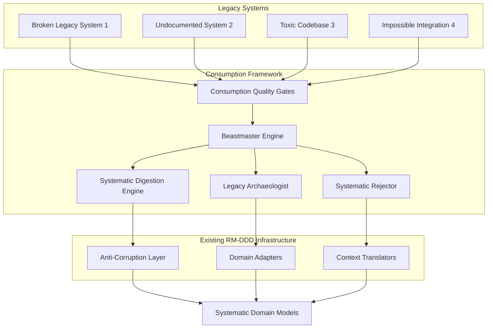
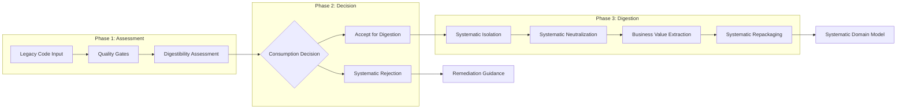

# Design Document

## Overview

The **RM-DDD Consumption Framework** implements systematic consumption patterns that can handle ANY legacy code through the "Beastmaster Bobby" approach. This framework extends the existing RM-DDD anti-corruption layer patterns to create a systematic consumption engine that can digest, isolate, and systematically integrate even the most problematic legacy systems.

### Core Design Philosophy

**"Bobby Eats Anything - Systematically"** - The framework provides systematic consumption tolerance boundaries that define what can be consumed, how it gets digested, and what makes the system "spit it out." Unlike other frameworks that avoid problematic code, Bobby systematically embraces the chaos and makes it useful.

### Key Design Principles

1. **Systematic Consumption Tolerance** - Clear boundaries for what Bobby will and won't consume
2. **Systematic Digestion Process** - Multi-phase approach to consuming toxic legacy code
3. **Systematic Rejection Criteria** - Well-defined conditions that trigger systematic rejection
4. **Systematic Quality Gates** - Consistent decision-making for consumption vs. rejection
5. **Systematic Isolation** - Prevent contamination while extracting business value

## Architecture

### High-Level Architecture



### Consumption Pipeline Architecture



## Components and Interfaces

### 1. Consumption Quality Gates

The entry point that systematically assesses whether legacy code can be consumed.

```python
class ConsumptionQualityGates(DomainReflectiveModule):
    """
    Systematic quality gates for consumption decisions.
    
    Provides consistent, repeatable assessment of legacy code
    digestibility and consumption feasibility.
    """
    
    def __init__(self, domain_context: str):
        super().__init__(domain_context)
        self.assessment_criteria = self._initialize_assessment_criteria()
        self.consumption_thresholds = self._initialize_thresholds()
    
    async def assess_digestibility(self, legacy_code: Any) -> DigestibilityAssessment:
        """
        Systematically assess if legacy code can be consumed.
        
        Returns:
            DigestibilityAssessment: Systematic assessment with recommendation
        """
        pass
    
    async def make_consumption_decision(self, assessment: DigestibilityAssessment) -> ConsumptionDecision:
        """
        Make systematic consumption vs. rejection decision.
        
        Returns:
            ConsumptionDecision: Accept, reject, or escalate decision
        """
        pass
```

### 2. Beastmaster Engine

The core orchestrator that coordinates Bobby's systematic consumption process.

```python
class BeastmasterEngine(DomainReflectiveModule):
    """
    Core Beastmaster Bobby consumption engine.
    
    Orchestrates systematic consumption of ANY legacy code through
    coordinated digestion, archaeology, and rejection processes.
    """
    
    def __init__(self, domain_context: str):
        super().__init__(domain_context)
        self.digestion_engine = SystematicDigestionEngine(domain_context)
        self.archaeologist = LegacyArchaeologist(domain_context)
        self.rejector = SystematicRejector(domain_context)
        self.consumption_metrics = ConsumptionMetrics()
    
    async def consume_legacy_chaos(self, legacy_code: Any, consumption_strategy: str = "auto") -> ConsumptionResult:
        """
        Bobby's main consumption method - eats anything systematically.
        
        Args:
            legacy_code: ANY legacy code, no matter how broken
            consumption_strategy: "digest", "archaeology", "reject", or "auto"
            
        Returns:
            ConsumptionResult: Systematic consumption outcome
        """
        pass
    
    async def systematic_wrapper_consumption(self, legacy_nightmare: Any) -> SystematicWrapper:
        """
        Systematically wrap ANY legacy code and make it RM-compliant.
        
        This is Bobby's signature move - no code is too broken.
        """
        pass
```

### 3. Systematic Digestion Engine

Multi-phase systematic approach to consuming indigestible code.

```python
class SystematicDigestionEngine(DomainReflectiveModule):
    """
    Bobby's systematic approach to consuming indigestible code.
    
    Implements the four-phase digestion process:
    1. Systematic Isolation
    2. Systematic Neutralization  
    3. Systematic Value Extraction
    4. Systematic Repackaging
    """
    
    async def digest_code_nightmare(self, toxic_legacy_code: Any) -> DigestedCode:
        """
        Systematic digestion process for toxic legacy code.
        
        Args:
            toxic_legacy_code: The worst legacy code imaginable
            
        Returns:
            DigestedCode: Systematically processed and safe code
        """
        # Phase 1: Systematic isolation
        isolated_code = await self._quarantine_toxic_code(toxic_legacy_code)
        
        # Phase 2: Systematic neutralization  
        neutralized_code = await self._neutralize_side_effects(isolated_code)
        
        # Phase 3: Systematic extraction of value
        useful_behavior = await self._extract_business_logic(neutralized_code)
        
        # Phase 4: Systematic repackaging
        return await self._repackage_as_systematic_component(useful_behavior)
    
    async def _quarantine_toxic_code(self, toxic_code: Any) -> QuarantinedCode:
        """Systematically isolate toxic code to prevent contamination."""
        pass
    
    async def _neutralize_side_effects(self, isolated_code: QuarantinedCode) -> NeutralizedCode:
        """Systematically neutralize harmful side effects."""
        pass
    
    async def _extract_business_logic(self, neutralized_code: NeutralizedCode) -> BusinessLogic:
        """Systematically extract useful business behavior."""
        pass
    
    async def _repackage_as_systematic_component(self, business_logic: BusinessLogic) -> SystematicComponent:
        """Systematically repackage as clean systematic component."""
        pass
```

### 4. Legacy Archaeologist

Systematically excavates meaning from archaeological code.

```python
class LegacyArchaeologist(DomainReflectiveModule):
    """
    Systematically excavates meaning from archaeological code.
    
    Bobby's detective work - figures out what mystery code actually does
    through systematic analysis and reverse engineering.
    """
    
    async def reverse_engineer_systematic_interface(self, mystery_code: Any) -> SystematicInterface:
        """
        Bobby figures out what this thing actually does.
        
        Args:
            mystery_code: Completely undocumented legacy code
            
        Returns:
            SystematicInterface: Reverse-engineered systematic interface
        """
        # Systematic analysis of the unknown
        behavior_patterns = await self._analyze_behavior_patterns(mystery_code)
        data_flows = await self._trace_data_flows(mystery_code)
        side_effects = await self._catalog_side_effects(mystery_code)
        
        # Generate systematic interface
        return SystematicInterface.from_archaeological_evidence(
            behavior_patterns, data_flows, side_effects
        )
    
    async def _analyze_behavior_patterns(self, code: Any) -> BehaviorPatterns:
        """Systematically analyze code behavior patterns."""
        pass
    
    async def _trace_data_flows(self, code: Any) -> DataFlows:
        """Systematically trace data flows through code."""
        pass
    
    async def _catalog_side_effects(self, code: Any) -> SideEffects:
        """Systematically catalog all side effects."""
        pass
```

### 5. Systematic Rejector

Handles systematic rejection with clear remediation guidance.

```python
class SystematicRejector(DomainReflectiveModule):
    """
    Handles systematic rejection of indigestible code.
    
    When even Bobby can't consume it, provides systematic rejection
    with clear reasoning and remediation guidance.
    """
    
    async def systematic_rejection(self, problematic_code: Any, rejection_reason: RejectionReason) -> RejectionResult:
        """
        Systematically reject code with clear reasoning and guidance.
        
        Args:
            problematic_code: Code that violates consumption boundaries
            rejection_reason: Systematic reason for rejection
            
        Returns:
            RejectionResult: Rejection with remediation guidance
        """
        pass
    
    def evaluate_rejection_criteria(self, code: Any) -> List[RejectionReason]:
        """
        Evaluate systematic rejection criteria.
        
        Returns:
            List[RejectionReason]: All applicable rejection reasons
        """
        rejection_reasons = []
        
        if self._violates_systematic_principles(code):
            rejection_reasons.append(RejectionReason.SYSTEMATIC_PRINCIPLE_VIOLATION)
        
        if self._creates_contamination_risk(code):
            rejection_reasons.append(RejectionReason.CONTAMINATION_RISK)
        
        if self._cannot_be_validated(code):
            rejection_reasons.append(RejectionReason.VALIDATION_IMPOSSIBLE)
        
        if self._has_uncontrollable_side_effects(code):
            rejection_reasons.append(RejectionReason.UNCONTROLLABLE_SIDE_EFFECTS)
        
        if self._compromises_systematic_integrity(code):
            rejection_reasons.append(RejectionReason.INTEGRITY_COMPROMISE)
        
        return rejection_reasons
```

## Data Models

### Core Consumption Models

```python
@dataclass
class DigestibilityAssessment:
    """Assessment of legacy code digestibility."""
    code_quality_score: float  # 0.0 to 1.0
    contamination_risk: ContaminationRisk
    business_value_potential: float  # 0.0 to 1.0
    systematic_compatibility: float  # 0.0 to 1.0
    digestion_complexity: DigestionComplexity
    recommended_strategy: ConsumptionStrategy
    assessment_confidence: float  # 0.0 to 1.0

@dataclass
class ConsumptionDecision:
    """Systematic consumption decision."""
    decision: ConsumptionAction  # ACCEPT, REJECT, ESCALATE
    confidence: float
    reasoning: List[str]
    recommended_approach: Optional[str]
    estimated_effort: Optional[int]  # hours
    risk_factors: List[RiskFactor]

@dataclass
class ConsumptionResult:
    """Result of systematic consumption process."""
    success: bool
    consumed_component: Optional[SystematicComponent]
    rejection_result: Optional[RejectionResult]
    consumption_metrics: ConsumptionMetrics
    lessons_learned: List[str]
    systematic_improvements: List[str]

@dataclass
class SystematicWrapper:
    """Systematic wrapper for legacy code."""
    wrapped_legacy_code: Any
    systematic_interface: SystematicInterface
    error_isolation: ErrorBoundaries
    contamination_prevention: ContaminationBarriers
    systematic_validation: ValidationFramework
```

### Consumption Enums

```python
class ConsumptionStrategy(Enum):
    """Systematic consumption strategies."""
    DIRECT_DIGESTION = "direct_digestion"
    ARCHAEOLOGICAL_ANALYSIS = "archaeological_analysis"
    SYSTEMATIC_WRAPPING = "systematic_wrapping"
    ISOLATION_AND_EXTRACTION = "isolation_and_extraction"
    SYSTEMATIC_REJECTION = "systematic_rejection"

class ContaminationRisk(Enum):
    """Contamination risk levels."""
    MINIMAL = "minimal"
    LOW = "low"
    MODERATE = "moderate"
    HIGH = "high"
    EXTREME = "extreme"
    TOXIC = "toxic"

class RejectionReason(Enum):
    """Systematic rejection reasons."""
    SYSTEMATIC_PRINCIPLE_VIOLATION = "systematic_principle_violation"
    CONTAMINATION_RISK = "contamination_risk"
    VALIDATION_IMPOSSIBLE = "validation_impossible"
    UNCONTROLLABLE_SIDE_EFFECTS = "uncontrollable_side_effects"
    INTEGRITY_COMPROMISE = "integrity_compromise"
    BEYOND_SYSTEMATIC_SALVATION = "beyond_systematic_salvation"
```

## Error Handling

### Consumption Error Hierarchy

```python
class ConsumptionException(DomainException):
    """Base exception for consumption framework."""
    pass

class DigestionFailedException(ConsumptionException):
    """Raised when systematic digestion fails."""
    pass

class ArchaeologyFailedException(ConsumptionException):
    """Raised when reverse engineering fails."""
    pass

class ContaminationDetectedException(ConsumptionException):
    """Raised when contamination is detected."""
    pass

class SystematicRejectionException(ConsumptionException):
    """Raised when code must be systematically rejected."""
    pass
```

### Error Recovery Strategies

1. **Digestion Failure Recovery**
   - Fallback to archaeological analysis
   - Attempt systematic wrapping
   - Escalate to human decision support

2. **Contamination Prevention**
   - Immediate isolation of contaminated components
   - Systematic rollback to clean state
   - RCA analysis of contamination source

3. **Rejection Handling**
   - Clear remediation guidance
   - Alternative approach recommendations
   - Systematic learning integration

## Testing Strategy

### Consumption Testing Framework

```python
class ConsumptionTestFramework:
    """
    Testing framework for consumption scenarios.
    
    Tests Bobby's ability to handle increasingly problematic legacy code.
    """
    
    def test_beastmaster_tolerance_levels(self):
        """Test consumption tolerance across different code quality levels."""
        pass
    
    def test_systematic_digestion_process(self):
        """Test four-phase digestion process."""
        pass
    
    def test_archaeological_reverse_engineering(self):
        """Test reverse engineering of undocumented code."""
        pass
    
    def test_systematic_rejection_criteria(self):
        """Test systematic rejection boundaries."""
        pass
    
    def test_contamination_prevention(self):
        """Test contamination isolation and prevention."""
        pass
```

### Test Scenarios

1. **The Bobby Test Suite**
   - Completely broken legacy code
   - Undocumented mystery systems
   - Toxic codebases with side effects
   - Impossible integration scenarios
   - Code that should be rejected

2. **Contamination Prevention Tests**
   - Systematic boundary validation
   - Isolation effectiveness
   - Rollback and recovery

3. **Quality Gate Tests**
   - Consistent decision making
   - Threshold validation
   - Escalation scenarios

## Integration with Existing RM-DDD

### Extending Anti-Corruption Layers

The consumption framework extends the existing `AntiCorruptionLayer` class:

```python
class BeastmasterAntiCorruptionLayer(AntiCorruptionLayer):
    """
    Enhanced anti-corruption layer with Beastmaster consumption capabilities.
    
    Extends the standard ACL to handle Bobby-level consumption scenarios.
    """
    
    def __init__(self, domain_context: str, protected_contexts: List[str]):
        super().__init__(domain_context, protected_contexts)
        self.beastmaster_engine = BeastmasterEngine(domain_context)
        self.consumption_quality_gates = ConsumptionQualityGates(domain_context)
    
    async def consume_legacy_system(self, system_name: str, legacy_code: Any) -> ConsumptionResult:
        """
        Consume legacy system through Beastmaster process.
        
        This is the main entry point for Bobby-level consumption.
        """
        # Assess digestibility
        assessment = await self.consumption_quality_gates.assess_digestibility(legacy_code)
        
        # Make consumption decision
        decision = await self.consumption_quality_gates.make_consumption_decision(assessment)
        
        # Execute consumption strategy
        if decision.decision == ConsumptionAction.ACCEPT:
            return await self.beastmaster_engine.consume_legacy_chaos(legacy_code)
        else:
            return ConsumptionResult(
                success=False,
                rejection_result=decision.rejection_result,
                consumption_metrics=self.beastmaster_engine.consumption_metrics
            )
```

### Systematic Consumption Adapters

New adapter types that extend the existing `DomainAdapter` pattern:

```python
class BeastmasterAdapter(DomainAdapter):
    """
    Beastmaster-level domain adapter for impossible integration scenarios.
    
    Handles legacy systems that normal adapters can't touch.
    """
    
    async def adapt_from_external(self, external_data: Any) -> Any:
        """
        Adapt external data using Beastmaster consumption strategies.
        
        Falls back through increasingly aggressive consumption approaches.
        """
        try:
            # Try standard adaptation first
            return await super().adapt_from_external(external_data)
        except Exception:
            # Fall back to Beastmaster consumption
            consumption_result = await self.beastmaster_engine.consume_legacy_chaos(external_data)
            if consumption_result.success:
                return consumption_result.consumed_component
            else:
                raise SystematicRejectionException(
                    "Even Beastmaster Bobby couldn't consume this code",
                    rejection_result=consumption_result.rejection_result
                )
```

## Performance Considerations

### Consumption Performance Metrics

1. **Digestion Throughput** - Legacy systems consumed per hour
2. **Success Rate** - Percentage of successful consumptions
3. **Contamination Prevention** - Zero contamination incidents
4. **Rejection Accuracy** - Correct rejection decisions
5. **Archaeological Speed** - Time to reverse engineer interfaces

### Optimization Strategies

1. **Parallel Digestion** - Process multiple legacy systems simultaneously
2. **Caching Archaeological Results** - Reuse reverse engineering work
3. **Progressive Consumption** - Start with least toxic components
4. **Systematic Learning** - Improve consumption strategies over time

## Security Considerations

### Contamination Prevention

1. **Systematic Isolation** - All legacy code runs in isolated environments
2. **Boundary Validation** - Strict validation at all consumption boundaries
3. **Rollback Capabilities** - Immediate rollback on contamination detection
4. **Audit Trails** - Complete traceability of all consumption decisions

### Security Validation

1. **Pre-Consumption Security Scan** - Identify security vulnerabilities
2. **Systematic Security Wrapping** - Add security controls during consumption
3. **Post-Consumption Validation** - Verify security posture maintained
4. **Continuous Security Monitoring** - Ongoing security validation

## Deployment Strategy

### Consumption Framework Deployment

1. **Gradual Rollout** - Start with least risky legacy systems
2. **Systematic Validation** - Validate each consumption thoroughly
3. **Rollback Readiness** - Always ready to rollback to previous state
4. **Learning Integration** - Continuously improve consumption strategies

### Integration Points

1. **CI/CD Integration** - Automated consumption validation
2. **Monitoring Integration** - Real-time consumption health monitoring
3. **Alerting Integration** - Immediate alerts on consumption failures
4. **Documentation Integration** - Automatic documentation of consumed systems

## Monitoring and Observability

### Consumption Metrics Dashboard

1. **Bobby's Appetite Gauge** - Current consumption capacity
2. **Digestion Success Rate** - Percentage of successful digestions
3. **Contamination Alerts** - Real-time contamination monitoring
4. **Archaeological Progress** - Reverse engineering status
5. **Rejection Rate** - Systematic rejection statistics

### Health Indicators

1. **Consumption Engine Health** - Overall framework health
2. **Quality Gate Performance** - Decision accuracy metrics
3. **Isolation Effectiveness** - Contamination prevention success
4. **Learning Progress** - Systematic improvement trends

This design provides the systematic foundation for Bobby's consumption framework - a system that can systematically consume ANY legacy code while maintaining systematic integrity and providing clear boundaries for what even Bobby won't put in his mouth.