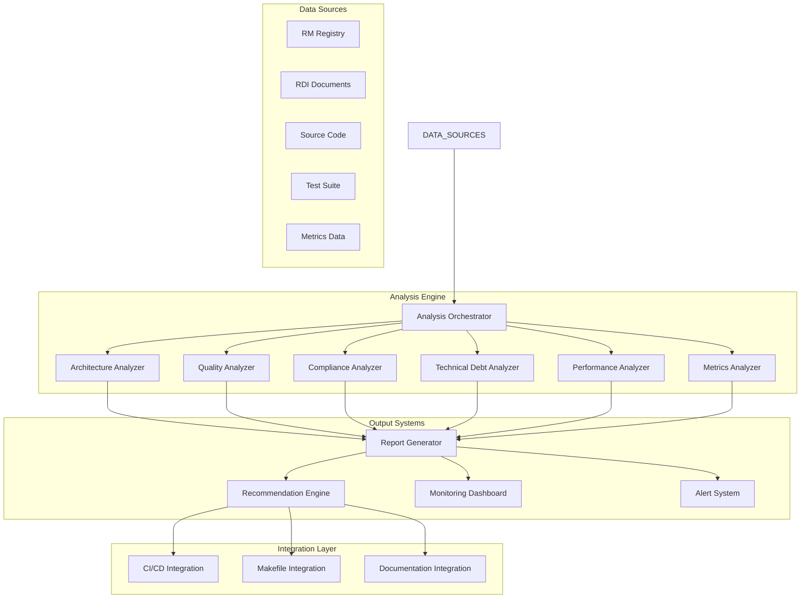

# Design Document

## Overview

The RM-RDI Analysis and Optimization System is designed as a comprehensive analysis framework that evaluates, monitors, and optimizes the existing RM (Reflective Module) and RDI (Requirements→Design→Implementation→Documentation) systems. The system follows a modular architecture with specialized analyzers, a central orchestration engine, and multiple output formats for different stakeholders.

The system integrates seamlessly with the existing Beast Mode Framework, leveraging the current RM infrastructure and DocumentManagementRM for comprehensive analysis and reporting.

## Architecture

### High-Level Architecture



### Component Architecture

**OPERATOR-FIRST DESIGN PRINCIPLE**: "If it works, don't break it."

The analysis system is designed as a completely separate, optional service that:
- **NEVER modifies existing code** - Read-only access to all systems
- **CANNOT cause outages** - Runs in isolated process space with resource limits
- **EASILY REMOVABLE** - Single command uninstall with zero impact
- **SELF-MONITORING** - Monitors its own health and auto-disables on issues

The system follows existing RM patterns for consistency but operates independently.

## Components and Interfaces

### 1. Analysis Orchestrator (AnalysisOrchestratorRM)

**Primary Responsibility:** Coordinate analysis activities with ZERO risk to existing systems.

```python
class AnalysisOrchestratorRM(ReflectiveModule):
    """OPERATOR-SAFE: Read-only analysis orchestrator with kill switch"""
    
    def execute_analysis_readonly(self) -> AnalysisResult  # READ-ONLY
    def check_system_safety(self) -> bool  # Validates no impact
    def emergency_shutdown(self) -> None  # KILL SWITCH
    def get_resource_usage(self) -> ResourceMetrics  # Monitor impact
```

**OPERATOR SAFETY FEATURES:**
- **Read-Only Operations**: Cannot modify any existing files or data
- **Resource Monitoring**: Tracks CPU/memory usage, auto-throttles
- **Kill Switch**: Immediate shutdown on operator command
- **Health Checks**: Continuously validates system safety
- **Isolation**: Runs in separate process, cannot crash main systems

### 2. Architecture Analyzer (ArchitectureAnalyzerRM)

**Primary Responsibility:** Analyze RM and RDI system architecture for strengths, weaknesses, and integration quality.

```python
class ArchitectureAnalyzerRM(ReflectiveModule):
    """Analyzes architectural patterns and integration quality"""
    
    def analyze_rm_architecture(self) -> ArchitectureAnalysis
    def analyze_rdi_architecture(self) -> ArchitectureAnalysis
    def analyze_integration_quality(self) -> IntegrationAnalysis
    def assess_scalability(self) -> ScalabilityAssessment
```

**Analysis Areas:**
- RM interface compliance and consistency
- RDI workflow completeness and traceability
- Component coupling and cohesion
- Scalability bottlenecks and limitations
- Integration patterns and anti-patterns

### 3. Quality Analyzer (QualityAnalyzerRM)

**Primary Responsibility:** Assess code quality, maintainability, testability, and security aspects.

```python
class QualityAnalyzerRM(ReflectiveModule):
    """Analyzes code quality and maintainability metrics"""
    
    def analyze_maintainability(self) -> MaintainabilityReport
    def analyze_testability(self) -> TestabilityReport
    def analyze_performance_characteristics(self) -> PerformanceReport
    def analyze_security_aspects(self) -> SecurityReport
```

**Quality Metrics:**
- Cyclomatic complexity and code metrics
- Test coverage and test quality
- Performance bottlenecks and resource usage
- Security vulnerabilities and best practices
- Documentation quality and completeness

### 4. Compliance Analyzer (ComplianceAnalyzerRM)

**Primary Responsibility:** Validate adherence to RM principles, RDI methodology, and project standards.

```python
class ComplianceAnalyzerRM(ReflectiveModule):
    """Validates compliance with RM and RDI standards"""
    
    def validate_rm_compliance(self) -> ComplianceReport
    def validate_rdi_methodology(self) -> ComplianceReport
    def validate_project_standards(self) -> ComplianceReport
    def validate_industry_practices(self) -> ComplianceReport
```

**Compliance Checks:**
- RM interface implementation completeness
- RDI traceability chain validation
- Coding standards adherence
- Industry best practices alignment
- Documentation standards compliance

### 5. Technical Debt Analyzer (TechnicalDebtAnalyzerRM)

**Primary Responsibility:** Identify, categorize, and prioritize technical debt across RM and RDI systems.

```python
class TechnicalDebtAnalyzerRM(ReflectiveModule):
    """Identifies and prioritizes technical debt"""
    
    def analyze_size_violations(self) -> SizeViolationReport
    def identify_refactoring_opportunities(self) -> RefactoringReport
    def assess_performance_debt(self) -> PerformanceDebtReport
    def identify_documentation_gaps(self) -> DocumentationDebtReport
```

**Debt Categories:**
- File size violations (>200 lines)
- Code duplication and redundancy
- Performance optimization opportunities
- Documentation gaps and inconsistencies
- Architectural debt and design issues

### 6. Performance Analyzer (PerformanceAnalyzerRM)

**Primary Responsibility:** Monitor and analyze performance characteristics of RM and RDI systems.

```python
class PerformanceAnalyzerRM(ReflectiveModule):
    """Analyzes system performance and bottlenecks"""
    
    def analyze_rm_performance(self) -> PerformanceReport
    def analyze_rdi_performance(self) -> PerformanceReport
    def identify_bottlenecks(self) -> BottleneckReport
    def benchmark_operations(self) -> BenchmarkReport
```

**Performance Areas:**
- RM health check performance
- RDI validation speed and efficiency
- Memory usage and resource consumption
- I/O operations and file system access
- Network operations and external dependencies

### 7. Metrics Analyzer (MetricsAnalyzerRM)

**Primary Responsibility:** Collect, analyze, and track metrics for continuous improvement.

```python
class MetricsAnalyzerRM(ReflectiveModule):
    """Collects and analyzes system metrics"""
    
    def collect_performance_metrics(self) -> MetricsCollection
    def collect_quality_metrics(self) -> MetricsCollection
    def collect_compliance_metrics(self) -> MetricsCollection
    def generate_trend_analysis(self) -> TrendReport
```

**Metrics Categories:**
- Performance metrics (response times, throughput)
- Quality metrics (complexity, coverage, defects)
- Compliance metrics (adherence rates, violations)
- Business value metrics (productivity, efficiency)

### 8. Recommendation Engine (RecommendationEngineRM)

**Primary Responsibility:** Generate actionable recommendations based on analysis results.

```python
class RecommendationEngineRM(ReflectiveModule):
    """Generates prioritized improvement recommendations"""
    
    def generate_immediate_recommendations(self) -> RecommendationSet
    def generate_short_term_roadmap(self) -> RoadmapPlan
    def generate_long_term_strategy(self) -> StrategyPlan
    def assess_implementation_effort(self) -> EffortAssessment
```

**Recommendation Types:**
- Immediate fixes (critical issues)
- Short-term improvements (1-3 months)
- Long-term strategic enhancements (3-12 months)
- Risk mitigation strategies
- Resource allocation guidance

## Data Models

### Core Analysis Models

```python
@dataclass
class AnalysisResult:
    """Comprehensive analysis result"""
    analysis_id: str
    timestamp: datetime
    analysis_types: List[str]
    architecture_analysis: Optional[ArchitectureAnalysis]
    quality_analysis: Optional[QualityReport]
    compliance_analysis: Optional[ComplianceReport]
    technical_debt_analysis: Optional[TechnicalDebtReport]
    performance_analysis: Optional[PerformanceReport]
    metrics_analysis: Optional[MetricsReport]
    recommendations: List[Recommendation]
    overall_health_score: float
    
@dataclass
class ArchitectureAnalysis:
    """Architecture analysis results"""
    rm_architecture_score: float
    rdi_architecture_score: float
    integration_quality_score: float
    scalability_score: float
    strengths: List[str]
    weaknesses: List[str]
    improvement_areas: List[str]
    
@dataclass
class QualityReport:
    """Code quality analysis results"""
    maintainability_score: float
    testability_score: float
    performance_score: float
    security_score: float
    quality_metrics: Dict[str, Any]
    quality_issues: List[QualityIssue]
    
@dataclass
class ComplianceReport:
    """Compliance analysis results"""
    rm_compliance_score: float
    rdi_compliance_score: float
    standards_compliance_score: float
    compliance_violations: List[ComplianceViolation]
    compliance_gaps: List[str]
    
@dataclass
class TechnicalDebtReport:
    """Technical debt analysis results"""
    total_debt_score: float
    size_violations: List[SizeViolation]
    refactoring_opportunities: List[RefactoringOpportunity]
    performance_debt: List[PerformanceDebt]
    documentation_debt: List[DocumentationDebt]
    
@dataclass
class Recommendation:
    """Individual recommendation"""
    recommendation_id: str
    title: str
    description: str
    priority: Priority
    category: RecommendationCategory
    effort_estimate: EffortEstimate
    impact_assessment: ImpactAssessment
    implementation_guidance: str
    success_criteria: List[str]
```

### Supporting Models

```python
class Priority(Enum):
    CRITICAL = "critical"
    HIGH = "high"
    MEDIUM = "medium"
    LOW = "low"
    
class RecommendationCategory(Enum):
    IMMEDIATE_FIX = "immediate_fix"
    SHORT_TERM_IMPROVEMENT = "short_term_improvement"
    LONG_TERM_STRATEGY = "long_term_strategy"
    RISK_MITIGATION = "risk_mitigation"
    
@dataclass
class EffortEstimate:
    """Effort estimation for recommendations"""
    development_hours: int
    testing_hours: int
    documentation_hours: int
    total_hours: int
    complexity: str
    
@dataclass
class ImpactAssessment:
    """Impact assessment for recommendations"""
    performance_impact: float
    maintainability_impact: float
    security_impact: float
    business_value_impact: float
    risk_reduction: float
```

## Error Handling

### Error Categories

1. **Analysis Errors**
   - Source code parsing failures
   - Missing dependencies or files
   - Invalid configuration parameters
   - Resource access limitations

2. **Data Validation Errors**
   - Malformed input data
   - Missing required information
   - Inconsistent data states
   - Version compatibility issues

3. **Integration Errors**
   - RM registry access failures
   - DocumentManagementRM communication issues
   - External tool integration failures
   - File system access problems

### Error Handling Strategy

```python
class AnalysisError(Exception):
    """Base exception for analysis errors"""
    def __init__(self, message: str, error_code: str, context: Dict[str, Any]):
        self.message = message
        self.error_code = error_code
        self.context = context
        super().__init__(message)

class ErrorHandler:
    """Centralized error handling for analysis system"""
    
    def handle_analysis_error(self, error: AnalysisError) -> ErrorResponse
    def handle_validation_error(self, error: ValidationError) -> ErrorResponse
    def handle_integration_error(self, error: IntegrationError) -> ErrorResponse
    def generate_error_report(self, errors: List[Exception]) -> ErrorReport
```

### Graceful Degradation

- **Partial Analysis**: Continue analysis even if some components fail
- **Fallback Mechanisms**: Use alternative data sources when primary sources fail
- **Progressive Enhancement**: Provide basic analysis when advanced features fail
- **Error Recovery**: Automatic retry with exponential backoff for transient failures

## Testing Strategy

### Unit Testing

- **Component Testing**: Each analyzer component tested in isolation
- **Mock Dependencies**: Mock external dependencies (file system, RM registry)
- **Edge Case Coverage**: Test boundary conditions and error scenarios
- **Performance Testing**: Validate performance characteristics under load

### Integration Testing

- **End-to-End Workflows**: Test complete analysis workflows
- **RM Integration**: Test integration with existing RM components
- **DocumentManagementRM Integration**: Test RDI document analysis
- **Output Format Validation**: Test all report formats and outputs

### Test Data Management

```python
class TestDataManager:
    """Manages test data for analysis system"""
    
    def create_mock_rm_registry(self) -> MockRMRegistry
    def create_sample_codebase(self) -> SampleCodebase
    def create_test_documents(self) -> TestDocuments
    def create_performance_baseline(self) -> PerformanceBaseline
```

### Continuous Testing

- **Automated Test Execution**: Run tests on every code change
- **Performance Regression Testing**: Monitor performance degradation
- **Compliance Validation**: Ensure analysis system follows RM/RDI principles
- **Integration Smoke Tests**: Validate integration points regularly

## Implementation Phases

### Phase 1: Core Analysis Engine (Weeks 1-2)
- Implement AnalysisOrchestratorRM
- Create basic data models and interfaces
- Implement ArchitectureAnalyzerRM
- Basic report generation

### Phase 2: Quality and Compliance Analysis (Weeks 3-4)
- Implement QualityAnalyzerRM
- Implement ComplianceAnalyzerRM
- Add comprehensive error handling
- Integration with existing RM registry

### Phase 3: Technical Debt and Performance Analysis (Weeks 5-6)
- Implement TechnicalDebtAnalyzerRM
- Implement PerformanceAnalyzerRM
- Add metrics collection and analysis
- Performance optimization

### Phase 4: Recommendations and Integration (Weeks 7-8)
- Implement RecommendationEngineRM
- Add CI/CD integration
- Implement monitoring dashboard
- Documentation and user guides

### Phase 5: Advanced Features and Optimization (Weeks 9-10)
- Advanced analytics and trend analysis
- Machine learning-based recommendations
- Performance optimization
- Comprehensive testing and validation

## Security Considerations

### Data Protection
- **Sensitive Information**: Protect sensitive code and configuration data
- **Access Control**: Implement role-based access to analysis results
- **Data Encryption**: Encrypt sensitive analysis data at rest and in transit
- **Audit Logging**: Log all analysis activities for security auditing

### Code Analysis Security
- **Safe Code Parsing**: Prevent code injection during analysis
- **Sandboxed Execution**: Run analysis in isolated environments
- **Resource Limits**: Prevent resource exhaustion attacks
- **Input Validation**: Validate all input data and parameters

### Integration Security
- **Secure Communication**: Use secure protocols for external integrations
- **Authentication**: Implement proper authentication for API access
- **Authorization**: Enforce proper authorization for analysis operations
- **Dependency Security**: Regularly update and scan dependencies

## Performance Optimization

### Analysis Performance
- **Parallel Processing**: Analyze multiple components concurrently
- **Incremental Analysis**: Only analyze changed components
- **Caching Strategy**: Cache analysis results for unchanged components
- **Resource Management**: Optimize memory and CPU usage

### Scalability Design
- **Horizontal Scaling**: Support distributed analysis across multiple nodes
- **Load Balancing**: Distribute analysis workload efficiently
- **Database Optimization**: Optimize data storage and retrieval
- **Monitoring Integration**: Real-time performance monitoring

### Resource Efficiency
- **Memory Management**: Efficient memory usage for large codebases
- **I/O Optimization**: Minimize file system operations
- **Network Efficiency**: Optimize network communications
- **CPU Utilization**: Efficient algorithm implementation