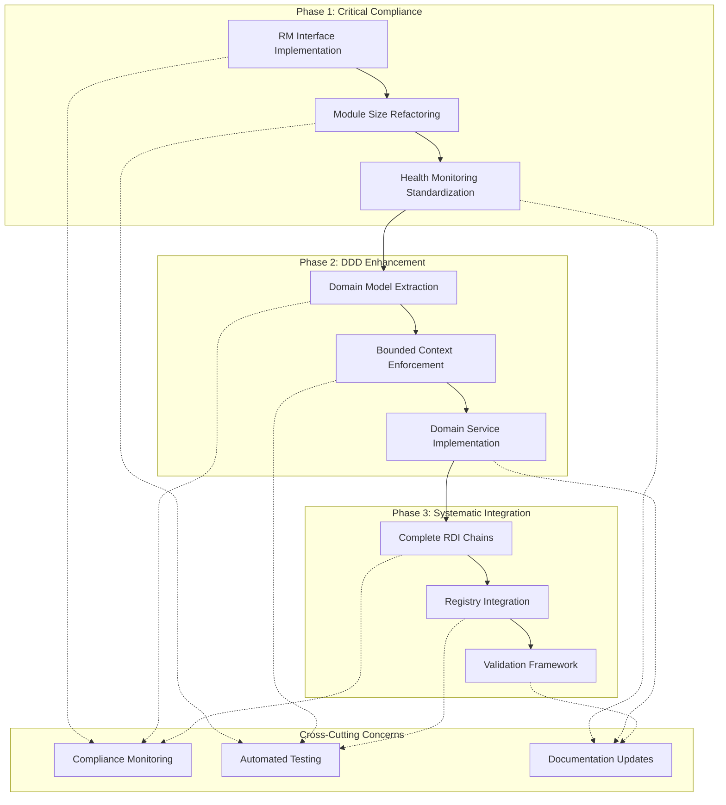

# Design Document

## Overview

This design document outlines the systematic approach to remediate RMI and RM-DDD conformance gaps in the Beast Mode framework. The remediation follows a three-phase approach: Critical Interface Compliance, Domain-Driven Design Enhancement, and Systematic Integration Completion. The design emphasizes minimal disruption to existing functionality while achieving systematic excellence in requirements management and domain modeling.

## Architecture

### Remediation Architecture Overview



### Component Interaction Model

```mermaid
classDiagram
    class RemediationOrchestrator {
        +executePhase(phase: Phase): PhaseResult
        +validateCompliance(): ComplianceReport
        +rollbackChanges(phase: Phase): RollbackResult
    }
    
    class RMInterfaceRemediator {
        +identifyNonCompliantModules(): List[Module]
        +implementRMInterface(module: Module): ImplementationResult
        +validateInterfaceCompliance(module: Module): ValidationResult
    }
    
    class ModuleSizeRefactor {
        +analyzeModuleSize(module: Module): SizeAnalysis
        +refactorOversizedModule(module: Module): RefactorResult
        +validateSingleResponsibility(module: Module): ResponsibilityScore
    }
    
    class DomainModelExtractor {
        +identifyDomainConcepts(context: BoundedContext): List[DomainConcept]
        +extractDomainEntities(concepts: List[DomainConcept]): List[Entity]
        +createValueObjects(concepts: List[DomainConcept]): List[ValueObject]
        +defineAggregates(entities: List[Entity]): List[Aggregate]
    }
    
    class BoundedContextEnforcer {
        +defineBoundaries(contexts: List[BoundedContext]): BoundaryDefinition
        +createInterfaceContracts(boundaries: BoundaryDefinition): List[Contract]
        +validateBoundaryViolations(): List[Violation]
    }
    
    class ComplianceValidator {
        +validateRMCompliance(module: Module): ComplianceScore
        +validateDDDCompliance(context: BoundedContext): ComplianceScore
        +generateComplianceReport(): ComplianceReport
    }
    
    RemediationOrchestrator --> RMInterfaceRemediator
    RemediationOrchestrator --> ModuleSizeRefactor
    RemediationOrchestrator --> DomainModelExtractor
    RemediationOrchestrator --> BoundedContextEnforcer
    RemediationOrchestrator --> ComplianceValidator
```



## Components and Interfaces

### 1. Remediation Orchestrator

**Purpose:** Coordinates the entire remediation process across all three phases.

**Key Responsibilities:**
- Phase execution management and coordination
- Risk mitigation and rollback procedures
- Progress tracking and reporting
- Cross-phase dependency management

**Interface:**
```python
class RemediationOrchestrator(ReflectiveModule):
    def execute_phase(self, phase: RemediationPhase) -> PhaseExecutionResult
    def validate_phase_completion(self, phase: RemediationPhase) -> ValidationResult
    def rollback_phase(self, phase: RemediationPhase) -> RollbackResult
    def get_remediation_status(self) -> RemediationStatus
```

### 2. RM Interface Remediator

**Purpose:** Systematically implements ReflectiveModule interface across all modules.

**Key Responsibilities:**
- Module compliance analysis and identification
- RM interface implementation generation
- Health monitoring standardization
- Interface validation and testing

**Interface:**
```python
class RMInterfaceRemediator(ReflectiveModule):
    def analyze_module_compliance(self, module_path: str) -> ComplianceAnalysis
    def generate_rm_interface(self, module_path: str) -> InterfaceImplementation
    def implement_health_monitoring(self, module_path: str) -> HealthImplementation
    def validate_interface_compliance(self, module_path: str) -> ValidationResult
```

### 3. Module Size Refactor Engine

**Purpose:** Refactors oversized modules to meet single responsibility principle.

**Key Responsibilities:**
- Module size analysis and complexity measurement
- Automated refactoring suggestions and implementation
- Dependency analysis and preservation
- Single responsibility validation

**Interface:**
```python
class ModuleSizeRefactor(ReflectiveModule):
    def analyze_module_complexity(self, module_path: str) -> ComplexityAnalysis
    def generate_refactor_plan(self, module_path: str) -> RefactorPlan
    def execute_refactoring(self, plan: RefactorPlan) -> RefactorResult
    def validate_refactor_integrity(self, original: str, refactored: List[str]) -> ValidationResult
```

### 4. Domain Model Extractor

**Purpose:** Extracts implicit domain concepts into explicit DDD patterns.

**Key Responsibilities:**
- Domain concept identification and analysis
- Entity, Value Object, and Aggregate extraction
- Domain service pattern implementation
- Domain model validation and testing

**Interface:**
```python
class DomainModelExtractor(ReflectiveModule):
    def identify_domain_concepts(self, bounded_context: str) -> List[DomainConcept]
    def extract_entities(self, concepts: List[DomainConcept]) -> List[EntityModel]
    def create_value_objects(self, concepts: List[DomainConcept]) -> List[ValueObjectModel]
    def define_aggregates(self, entities: List[EntityModel]) -> List[AggregateModel]
```

### 5. Bounded Context Enforcer

**Purpose:** Implements systematic enforcement of domain boundaries.

**Key Responsibilities:**
- Bounded context boundary definition
- Interface contract creation and validation
- Boundary violation detection and reporting
- Cross-context communication management

**Interface:**
```python
class BoundedContextEnforcer(ReflectiveModule):
    def define_context_boundaries(self, contexts: List[str]) -> BoundaryDefinition
    def create_interface_contracts(self, boundaries: BoundaryDefinition) -> List[InterfaceContract]
    def detect_boundary_violations(self) -> List[BoundaryViolation]
    def enforce_context_isolation(self, context: str) -> EnforcementResult
```

## Data Models

### Core Remediation Models

```python
@dataclass
class RemediationPhase:
    phase_id: str
    name: str
    description: str
    prerequisites: List[str]
    deliverables: List[str]
    success_criteria: List[str]
    estimated_effort_hours: int
    risk_level: str
    rollback_procedures: List[str]

@dataclass
class ComplianceAnalysis:
    module_path: str
    current_compliance_score: float
    missing_interfaces: List[str]
    size_violations: List[str]
    domain_model_gaps: List[str]
    recommendations: List[str]

@dataclass
class RefactorPlan:
    original_module: str
    target_modules: List[str]
    extraction_strategy: str
    dependency_mapping: Dict[str, List[str]]
    test_migration_plan: List[str]
    rollback_strategy: str

@dataclass
class DomainConcept:
    concept_name: str
    concept_type: str  # "entity", "value_object", "aggregate", "service"
    current_location: str
    proposed_location: str
    dependencies: List[str]
    business_rules: List[str]

@dataclass
class BoundaryDefinition:
    context_name: str
    responsibilities: List[str]
    interface_contracts: List[str]
    forbidden_dependencies: List[str]
    allowed_dependencies: List[str]
    enforcement_rules: List[str]
```

### Compliance Tracking Models

```python
@dataclass
class ComplianceScore:
    module_path: str
    rm_interface_score: float
    size_compliance_score: float
    domain_model_score: float
    boundary_compliance_score: float
    overall_score: float
    improvement_areas: List[str]

@dataclass
class PhaseExecutionResult:
    phase_id: str
    execution_status: str
    start_time: datetime
    end_time: Optional[datetime]
    modules_processed: List[str]
    compliance_improvements: Dict[str, float]
    issues_encountered: List[str]
    rollback_required: bool
```

## Error Handling

### Remediation Error Categories

1. **Module Analysis Errors**
   - Syntax errors preventing AST parsing
   - Missing dependencies or imports
   - Circular dependency detection failures

2. **Refactoring Errors**
   - Test failures after module splitting
   - Dependency resolution failures
   - Interface contract violations

3. **Domain Modeling Errors**
   - Conflicting domain concept definitions
   - Aggregate boundary violations
   - Business rule inconsistencies

4. **Compliance Validation Errors**
   - Interface implementation failures
   - Health monitoring integration issues
   - Registry registration failures

### Error Recovery Strategies

```python
class RemediationErrorHandler:
    def handle_analysis_error(self, error: AnalysisError) -> RecoveryAction
    def handle_refactoring_error(self, error: RefactoringError) -> RecoveryAction
    def handle_domain_modeling_error(self, error: DomainModelingError) -> RecoveryAction
    def handle_validation_error(self, error: ValidationError) -> RecoveryAction
    
    def execute_rollback(self, phase: RemediationPhase) -> RollbackResult
    def create_error_report(self, errors: List[RemediationError]) -> ErrorReport
```

## Testing Strategy

### Multi-Level Testing Approach

1. **Unit Testing**
   - Test each remediation component in isolation
   - Validate compliance checking algorithms
   - Test refactoring logic and domain extraction

2. **Integration Testing**
   - Test phase transitions and dependencies
   - Validate cross-module compatibility after refactoring
   - Test bounded context enforcement mechanisms

3. **Compliance Testing**
   - Automated compliance score validation
   - Interface implementation verification
   - Domain model integrity checking

4. **Regression Testing**
   - Ensure existing functionality remains intact
   - Validate performance characteristics
   - Test error handling and recovery procedures

### Test Implementation Strategy

```python
class RemediationTestSuite:
    def test_rm_interface_implementation(self) -> TestResult
    def test_module_refactoring_integrity(self) -> TestResult
    def test_domain_model_extraction(self) -> TestResult
    def test_boundary_enforcement(self) -> TestResult
    def test_compliance_score_calculation(self) -> TestResult
    def test_rollback_procedures(self) -> TestResult
```

## Implementation Phases

### Phase 1: Critical Interface Compliance (2-3 weeks)

**Objectives:**
- Implement RM interfaces across all core modules
- Refactor oversized modules for single responsibility
- Standardize health monitoring implementation

**Key Deliverables:**
- RM interface implementation for 100% of core modules
- Module size compliance >85%
- Standardized health monitoring patterns

**Success Criteria:**
- RM interface compliance score >90%
- All critical modules meet size constraints
- Health monitoring integration complete

### Phase 2: Domain-Driven Design Enhancement (1-2 months)

**Objectives:**
- Extract implicit domain concepts into explicit DDD patterns
- Implement bounded context enforcement
- Create domain service patterns for complex business logic

**Key Deliverables:**
- Explicit domain entity models
- Bounded context enforcement mechanisms
- Domain service implementations

**Success Criteria:**
- Domain model explicitness score >80%
- Bounded context violations <5%
- Domain service coverage for complex business logic

### Phase 3: Systematic Integration Completion (2-3 months)

**Objectives:**
- Complete all RDI chains with full traceability
- Implement systematic registry integration
- Establish comprehensive validation framework

**Key Deliverables:**
- Complete RDI chains for >95% of specifications
- Systematic registry integration
- Automated compliance validation framework

**Success Criteria:**
- RDI chain completeness >95%
- Registry integration score >90%
- Automated compliance monitoring operational

## Risk Mitigation

### Identified Risks and Mitigation Strategies

1. **System Stability Risk**
   - **Risk:** Refactoring may introduce bugs or break existing functionality
   - **Mitigation:** Comprehensive testing, gradual rollout, rollback procedures

2. **Performance Impact Risk**
   - **Risk:** Additional interfaces and monitoring may impact performance
   - **Mitigation:** Performance benchmarking, optimization, lazy loading patterns

3. **Team Productivity Risk**
   - **Risk:** Learning curve for new patterns may temporarily reduce productivity
   - **Mitigation:** Training sessions, documentation, gradual adoption

4. **Integration Complexity Risk**
   - **Risk:** Cross-module dependencies may complicate refactoring
   - **Mitigation:** Dependency analysis, interface contracts, staged implementation

### Rollback Procedures

Each phase includes comprehensive rollback procedures:
- Automated backup of original code
- Dependency restoration mechanisms
- Test validation before rollback completion
- Documentation of rollback reasons and lessons learned

## Success Metrics

### Target Compliance Scores

```
Phase 1 Targets:
- RM Interface Compliance: 25% → 90%
- Module Size Compliance: 25% → 85%
- Health Monitoring Coverage: 50% → 95%

Phase 2 Targets:
- Domain Model Explicitness: 40% → 80%
- Bounded Context Enforcement: 60% → 90%
- Domain Service Coverage: 30% → 75%

Phase 3 Targets:
- RDI Chain Completeness: 70.9% → 95%
- Registry Integration: 20% → 90%
- Automated Validation Coverage: 60% → 95%
```

### Monitoring and Reporting

- Daily compliance score tracking
- Weekly phase progress reports
- Monthly stakeholder updates
- Continuous integration compliance gates
- Automated alerting for compliance regressions