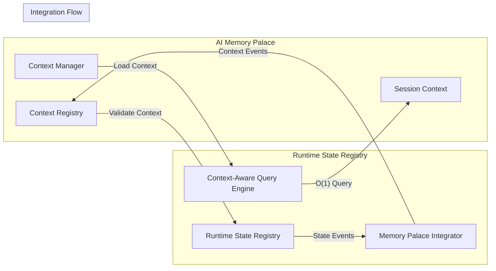

# Runtime State Registry Design Document

## Overview

The Runtime State Registry is a unified multi-source system that provides comprehensive visibility into system state by bridging the gap between expected state (Specifications), canonical configuration (CMS), actual runtime state (Redis), and observability data (Prometheus/Grafana). Rather than building new infrastructure, this system acts as an intelligent interpreter that reconciles data from multiple authoritative sources into a coherent system state view.

The core insight is that complete system understanding requires three-layer state reconciliation:
1. **Spec-State**: What SHOULD be running according to architectural specifications
2. **CMS-State**: HOW it should be configured according to canonical definitions  
3. **Runtime-State**: What IS actually running according to Redis, Prometheus, and Grafana

The Runtime State Registry continuously reconciles these layers, detects drift, and provides unified querying across all sources while maintaining real-time visibility into system operations.

## Architecture

### High-Level Architecture

```
┌─────────────────┐    ┌──────────────────┐    ┌─────────────────┐
│  Multi-Source   │    │  Runtime State   │    │   Query         │
│  Data Sources   │───▶│   Registry       │───▶│   Interfaces    │
│                 │    │                  │    │                 │
│ • Redis State   │    │ • State Parser   │    │ • CLI           │
│ • CMS Config    │    │ • Multi-Source   │    │ • Web Dashboard │
│ • Prometheus    │    │   Reconciler     │    │ • API Endpoints │
│ • Grafana       │    │ • Drift Detector │    │ • WebSocket     │
│ • Specifications│    │ • Compliance     │    │ • Observability │
│                 │    │   Monitor        │    │   Native Queries│
└─────────────────┘    └──────────────────┘    └─────────────────┘

Three-Layer State Reconciliation:
Spec-State (SHOULD) ←→ CMS-State (HOW) ←→ Runtime-State (IS)
```

### Component Architecture

#### 1. Multi-Source Data Collectors
- **Redis Data Listener**: Monitor Redis for real-time state changes
  - Redis pub/sub subscriber + key pattern scanner
  - ReflectiveModule health keys (`health:*`)
  - DAG execution tracking (`dag:*`, `execution:*`)
  - Celery task data (`celery-task-meta-*`)
  - Service registration (`service:*`)

- **CMS Configuration Collector**: Retrieve canonical configurations
  - Service definitions and expected configurations
  - Compliance policies and governance rules
  - Configuration templates and standards

- **Prometheus Integration Collector**: Leverage service discovery and metrics
  - Service discovery targets as authoritative source
  - Health indicators from 'up' metrics
  - Performance metrics and relationships
  - Alert status and firing conditions

- **Grafana Intelligence Collector**: Extract dashboard intelligence
  - Dashboard query analysis for service relationships
  - Alert integration and health indicators
  - Auto-provisioning patterns for new services

- **Specification State Collector**: Calculate desired state from specs
  - DAG-driven service dependency analysis
  - Architectural requirement validation
  - Critical path identification for high availability

#### 2. Multi-Source State Parser Engine
- **Purpose**: Decode data from all sources into structured state information
- **Key Parsers**:
  - **Redis Parser**: ReflectiveModule, DAG, Celery, and service data
  - **CMS Parser**: Configuration definitions and compliance policies
  - **Prometheus Parser**: Metrics, targets, and service discovery data
  - **Grafana Parser**: Dashboard queries and alert configurations
  - **Specification Parser**: DAG dependencies and architectural requirements

#### 3. State Reconciliation Engine
- **Purpose**: Reconcile data from multiple sources into unified state view
- **Three-Layer Reconciliation**:
  - **Spec-State**: What should be running (from specifications)
  - **CMS-State**: How it should be configured (from CMS)
  - **Runtime-State**: What is actually running (from Redis/Prometheus/Grafana)
- **Conflict Resolution**: Hierarchical authority (Spec > CMS > Runtime)
- **Drift Detection**: Identify deviations between layers
- **Compliance Scoring**: Quantitative compliance metrics (0.0-1.0)

#### 4. AI Memory Palace Integration Layer
- **Purpose**: Integrate with AI Memory Palace for context-aware state management
- **Functions**:
  - Context-driven state queries (O(1) instead of O(n) discovery)
  - Historical state event contribution to conversation context
  - System state validation for AI context accuracy
  - Intelligent state summarization based on conversation relevance

#### 5. Observability-Native Query Engine
- **Purpose**: Provide flexible querying with observability tool integration
- **Query Types**:
  - Natural language queries: "what's running", "system health"
  - Prometheus metric queries: Native PromQL support
  - Grafana dashboard links: Automatic deep-linking
  - Compliance queries: Drift detection and remediation guidance
  - Historical queries: Timeline analysis and pattern recognition

#### 6. Auto-Remediation Engine
- **Purpose**: Automatically remediate configuration drift when safe
- **Mechanisms**:
  - Severity-based drift categorization
  - Safe vs. unsafe remediation determination
  - Automatic remediation for critical drift (if configured)
  - Manual intervention guidance for complex issues
  - Audit logging of all remediation actions

#### 7. Security and Access Control Engine
- **Purpose**: Protect sensitive information and control access
- **Functions**:
  - Credential masking and encryption
  - Access logging and audit trails
  - Authentication and authorization
  - Sensitive data exclusion from state storage

## Components and Interfaces

### Core Components

#### RuntimeStateRegistry
```python
class RuntimeStateRegistry(ReflectiveModule):
    """Main registry that coordinates multi-source runtime state operations with AI Memory Palace integration."""
    
    def __init__(self, redis_client: Redis, cms_client: CMSClient, 
                 prometheus_client: PrometheusClient, grafana_client: GrafanaClient,
                 memory_palace: ContextManager):
        super().__init__()
        self.redis = redis_client
        self.cms = cms_client
        self.prometheus = prometheus_client
        self.grafana = grafana_client
        self.memory_palace = memory_palace
        
        # Multi-source collectors
        self.redis_collector = RedisDataCollector(redis_client)
        self.cms_collector = CMSConfigurationCollector(cms_client)
        self.prometheus_collector = PrometheusIntegrationCollector(prometheus_client)
        self.grafana_collector = GrafanaIntelligenceCollector(grafana_client)
        self.spec_collector = SpecificationStateCollector()
        
        # Core engines with AI Memory Palace integration
        self.parser = MultiSourceStateParser()
        self.reconciler = StateReconciliationEngine()
        self.query_engine = ContextAwareQueryEngine(memory_palace)  # AI Memory Palace integration
        self.context_integrator = MemoryPalaceIntegrator(memory_palace)  # New component
        self.remediation_engine = AutoRemediationEngine()
        self.security_engine = SecurityAndAccessControlEngine()
    
    async def start_monitoring(self) -> None:
        """Start multi-source monitoring and reconciliation."""
        
    async def query_state(self, query: str, use_context: bool = True) -> Dict[str, Any]:
        """Execute context-aware state query with O(1) context restoration."""
        if use_context:
            # Use AI Memory Palace for O(1) context-aware queries
            context = await self.memory_palace.load_session_context(".")
            return await self.query_engine.execute_context_aware_query(query, context)
        else:
            # Fall back to traditional O(n) discovery
            return await self.query_engine.execute_discovery_query(query)
        
    async def get_system_health(self) -> Dict[str, Any]:
        """Get comprehensive system health with compliance scoring and context integration."""
        
    async def get_compliance_status(self) -> Dict[str, Any]:
        """Get three-layer compliance status and drift analysis."""
        
    async def reconcile_state(self) -> Dict[str, Any]:
        """Perform three-layer state reconciliation and contribute to AI Memory Palace context."""
        result = await self._perform_reconciliation()
        
        # Contribute state changes to AI Memory Palace
        await self.context_integrator.contribute_state_event({
            "type": "state_reconciliation",
            "result": result,
            "timestamp": datetime.utcnow(),
            "correlation_id": self.get_correlation_id()
        })
        
        return result
```

#### Multi-Source Data Collectors

```python
class RedisDataCollector:
    """Collects real-time state data from Redis."""
    
    async def subscribe_to_patterns(self, patterns: List[str]) -> None:
        """Subscribe to Redis key patterns for real-time updates."""
        
    async def scan_existing_keys(self) -> List[str]:
        """Scan Redis for existing state data."""
        
    def parse_key_pattern(self, key: str) -> Optional[StateDataType]:
        """Determine data type from Redis key pattern."""

class CMSConfigurationCollector:
    """Collects canonical configurations from CMS."""
    
    async def get_service_definitions(self) -> List[ServiceDefinition]:
        """Retrieve all service definitions from CMS."""
        
    async def get_compliance_policies(self) -> List[CompliancePolicy]:
        """Get configuration compliance policies."""
        
    async def get_canonical_config(self, service_name: str) -> Dict[str, Any]:
        """Get canonical configuration for specific service."""

class PrometheusIntegrationCollector:
    """Leverages Prometheus for service discovery and metrics."""
    
    async def get_service_targets(self) -> List[PrometheusTarget]:
        """Get service discovery targets as authoritative source."""
        
    async def get_service_health(self, service_name: str) -> HealthStatus:
        """Get health status from Prometheus 'up' metric."""
        
    async def get_service_metrics(self, service_name: str) -> Dict[str, float]:
        """Get performance metrics for service."""
        
    async def analyze_metric_relationships(self) -> ServiceTopology:
        """Parse metric relationships to understand service dependencies."""

class GrafanaIntelligenceCollector:
    """Extracts intelligence from Grafana dashboards and alerts."""
    
    async def analyze_dashboard_queries(self) -> List[ServiceRelationship]:
        """Parse dashboard queries to identify service relationships."""
        
    async def get_alert_status(self) -> List[AlertStatus]:
        """Get current alert status as health indicators."""
        
    async def auto_provision_dashboard(self, service_name: str) -> str:
        """Auto-provision dashboard based on service patterns."""

class SpecificationStateCollector:
    """Calculates desired state from architectural specifications."""
    
    async def calculate_spec_state(self) -> SpecState:
        """Calculate what should be running from DAG dependencies."""
        
    async def validate_dag_compliance(self) -> List[ComplianceIssue]:
        """Validate runtime topology against DAG specifications."""
        
    async def identify_critical_path(self) -> List[str]:
        """Identify critical services for high availability."""
```

#### Core Processing Engines

```python
class MultiSourceStateParser:
    """Parses data from all sources into structured state information."""
    
    def parse_redis_data(self, key: str, data: Any) -> RuntimeStateData:
        """Parse Redis data (ReflectiveModule, DAG, Celery, service data)."""
        
    def parse_cms_data(self, config: Dict[str, Any]) -> CMSStateData:
        """Parse CMS configuration data."""
        
    def parse_prometheus_data(self, metrics: Dict[str, Any]) -> PrometheusStateData:
        """Parse Prometheus metrics and targets."""
        
    def parse_grafana_data(self, dashboard_data: Dict[str, Any]) -> GrafanaStateData:
        """Parse Grafana dashboard and alert data."""
        
    def parse_specification_data(self, spec_data: Dict[str, Any]) -> SpecStateData:
        """Parse specification and DAG dependency data."""

class StateReconciliationEngine:
    """Reconciles multi-source data into unified state view."""
    
    async def reconcile_three_layers(self) -> ThreeLayerState:
        """Perform Spec → CMS → Runtime reconciliation."""
        
    async def detect_drift(self) -> List[DriftDetection]:
        """Detect configuration drift between layers."""
        
    async def calculate_compliance_score(self) -> ComplianceScore:
        """Calculate quantitative compliance score (0.0-1.0)."""
        
    async def resolve_conflicts(self, conflicts: List[StateConflict]) -> List[Resolution]:
        """Resolve conflicts using hierarchical authority (Spec > CMS > Runtime)."""

class ContextAwareQueryEngine:
    """Provides context-aware querying with AI Memory Palace integration."""
    
    def __init__(self, memory_palace: ContextManager):
        self.memory_palace = memory_palace
        self.traditional_engine = ObservabilityNativeQueryEngine()
    
    async def execute_context_aware_query(self, query: str, context: SessionContext) -> QueryResult:
        """Execute queries using AI Memory Palace context for O(1) operations."""
        # Use context to avoid re-discovery of known system state
        if self._is_cached_in_context(query, context):
            return self._extract_from_context(query, context)
        else:
            # Execute discovery and contribute results to context
            result = await self.traditional_engine.execute_natural_language_query(query)
            await self._contribute_to_context(query, result)
            return result
    
    async def execute_discovery_query(self, query: str) -> QueryResult:
        """Fall back to traditional O(n) discovery when context is not available."""
        return await self.traditional_engine.execute_natural_language_query(query)

class MemoryPalaceIntegrator:
    """Integrates Runtime State Registry with AI Memory Palace."""
    
    def __init__(self, memory_palace: ContextManager):
        self.memory_palace = memory_palace
    
    async def contribute_state_event(self, event: Dict[str, Any]) -> None:
        """Contribute runtime state events to AI Memory Palace context."""
        context_event = ContextEvent(
            event_id=str(uuid.uuid4()),
            event_type=ContextEventType.SYSTEM_STATE_CHANGED,
            timestamp=event["timestamp"],
            correlation_id=event["correlation_id"],
            data=event,
            metadata=EventMetadata(source="runtime_state_registry")
        )
        await self.memory_palace.save_context_event(context_event)
    
    async def validate_context_against_runtime(self, context: SessionContext) -> ValidationResult:
        """Validate AI Memory Palace context against current runtime state."""
        # Ensure context reflects current system reality
        current_state = await self._get_current_runtime_state()
        return self._compare_context_to_reality(context, current_state)
    
    async def enrich_context_with_runtime_state(self, context: SessionContext) -> SessionContext:
        """Enrich AI Memory Palace context with current runtime state information."""
        current_state = await self._get_current_runtime_state()
        context.project_state.running_services = current_state.services
        context.project_state.health_status = current_state.health_summary
        return context
```

### Data Models

#### Enhanced Data Models

```python
@dataclass
class UnifiedServiceState:
    service_name: str
    host: str
    port: int
    
    # Multi-source status information
    runtime_status: ServiceStatus  # From Redis/Prometheus
    cms_status: CMSStatus  # DEFINED, ORPHANED, MISSING
    spec_status: SpecStatus  # SPECIFIED, UNSPECIFIED, SPEC_MISSING
    
    # State reconciliation
    compliance_score: float  # 0.0-1.0
    drift_detections: List[DriftDetection]
    
    # Multi-source data
    redis_data: Optional[RedisServiceData]
    cms_data: Optional[CMSServiceData]
    prometheus_data: Optional[PrometheusServiceData]
    grafana_data: Optional[GrafanaServiceData]
    spec_data: Optional[SpecServiceData]
    
    # Observability integration
    grafana_dashboards: List[str]
    prometheus_queries: List[str]
    alert_status: List[AlertStatus]
    
    # Historical tracking
    last_seen: datetime
    configuration_history: List[ConfigurationChange]
    lifecycle_events: List[ServiceEvent]

@dataclass
class ThreeLayerState:
    """Represents the three-layer state reconciliation."""
    spec_state: SpecState  # What SHOULD be running
    cms_state: CMSState   # HOW it should be configured
    runtime_state: RuntimeState  # What IS actually running
    
    reconciliation_status: ReconciliationStatus
    drift_summary: DriftSummary
    compliance_score: float
    remediation_actions: List[RemediationAction]

@dataclass
class DriftDetection:
    service_name: str
    drift_type: DriftType  # CONFIG_DRIFT, SPEC_DRIFT, ORPHANED, MISSING
    severity: DriftSeverity  # CRITICAL, HIGH, MEDIUM, LOW
    source_layer: str  # spec, cms, runtime
    target_layer: str
    expected_value: Any
    actual_value: Any
    remediation_guidance: str
    auto_remediable: bool

@dataclass
class ComplianceScore:
    overall_score: float  # 0.0-1.0
    spec_compliance: float
    cms_compliance: float
    service_scores: Dict[str, float]
    trend: ComplianceTrend  # IMPROVING, STABLE, DEGRADING
    
@dataclass
class HistoricalStateEvent:
    timestamp: datetime
    event_type: EventType  # SERVICE_START, SERVICE_STOP, CONFIG_CHANGE, DRIFT_DETECTED
    service_name: str
    details: Dict[str, Any]
    source: str  # redis, cms, prometheus, grafana, spec
```

### Interface Specifications

#### CLI Interface
```bash
# Service queries
runtime-state list                    # List all active services
runtime-state show <service>          # Show detailed service information
runtime-state health                  # System-wide health status
runtime-state ports                   # All port bindings
runtime-state cleanup                 # Remove stale entries

# Query interface
runtime-state query "what's running"
runtime-state query "where is prometheus"
runtime-state query "what's on port 8888"
runtime-state query "system health"

# Compliance and drift queries
runtime-state compliance                  # Overall compliance status
runtime-state drift                       # Configuration drift analysis
runtime-state orphaned                    # Services running without CMS definitions
runtime-state missing                     # CMS services not running

# Observability-native queries
runtime-state prometheus <service>        # Prometheus metrics and queries
runtime-state grafana <service>          # Grafana dashboard links
runtime-state alerts                     # Current alert status

# Historical queries
runtime-state history <service>          # Service lifecycle history
runtime-state events --since=1h          # Recent state change events
```

#### Web API Interface
```python
# Core service endpoints
GET /api/v1/services                  # List all services with multi-source data
GET /api/v1/services/{name}           # Get unified service details
GET /api/v1/health                    # System health with compliance scoring
GET /api/v1/executions                # Active executions

# Compliance and drift endpoints
GET /api/v1/compliance                # Overall compliance status
GET /api/v1/compliance/{service}      # Service-specific compliance
GET /api/v1/drift                     # Configuration drift analysis
GET /api/v1/drift/{service}           # Service-specific drift

# Three-layer reconciliation endpoints
GET /api/v1/reconciliation            # Three-layer state reconciliation
GET /api/v1/spec-state                # What should be running
GET /api/v1/cms-state                 # How it should be configured
GET /api/v1/runtime-state             # What is actually running

# Observability integration endpoints
GET /api/v1/prometheus/{service}      # Prometheus metrics and queries
GET /api/v1/grafana/{service}         # Grafana dashboard links
GET /api/v1/alerts                    # Current alert status

# Historical and audit endpoints
GET /api/v1/history/{service}         # Service lifecycle history
GET /api/v1/events                    # State change events
GET /api/v1/audit                     # Access and remediation audit log

# Query and remediation endpoints
GET /api/v1/query?q={query}           # Natural language and PromQL queries
POST /api/v1/remediate                # Trigger auto-remediation
POST /api/v1/cleanup                  # Trigger stale state cleanup
```

#### WebSocket Interface
```python
# Real-time updates with multi-source integration
ws://localhost:8080/runtime-state/stream

# Stream types:
# - service_updates: Service state changes from all sources
# - health_changes: Health status updates with compliance scoring
# - execution_events: DAG and task execution updates
# - drift_alerts: Configuration drift detection events
# - compliance_changes: Compliance score updates
# - remediation_events: Auto-remediation actions and results
# - alert_updates: Prometheus/Grafana alert status changes
```

## Data Models

### Redis Key Patterns

The system recognizes and parses the following Redis key patterns:

#### ReflectiveModule Patterns
- `health:{service_name}` - Service health status
- `metrics:{service_name}` - Performance metrics
- `config:{service_name}` - Service configuration
- `heartbeat:{service_name}` - Last seen timestamp

#### DAG Execution Patterns
- `dag:execution:{execution_id}` - DAG execution state
- `dag:task:{task_id}` - Individual task state
- `execution:tracking:{dag_name}` - Execution tracking data

#### Celery Task Patterns
- `celery-task-meta-{task_id}` - Task metadata
- `celery-task-result-{task_id}` - Task results

#### Service Registry Patterns
- `service:registry:{service_name}` - Service registration
- `service:topology:{service_name}` - Service connections
- `service:ports:{port}` - Port bindings

### Multi-Source State Reconciliation Logic

#### Three-Layer State Reconciliation
1. **Spec-State Collection**: Calculate desired state from DAG dependencies and architectural specifications
2. **CMS-State Collection**: Retrieve canonical configurations and compliance policies
3. **Runtime-State Collection**: Aggregate data from Redis, Prometheus, and Grafana
4. **Layer Comparison**: Compare each layer to identify gaps and conflicts
5. **Drift Detection**: Categorize deviations by type and severity
6. **Compliance Scoring**: Calculate quantitative compliance metrics

#### Multi-Source Service Discovery
1. **Prometheus Primary**: Use Prometheus service discovery as authoritative source
2. **Redis Correlation**: Cross-reference with ReflectiveModule health keys
3. **CMS Validation**: Verify services have canonical definitions
4. **Grafana Integration**: Extract dashboard intelligence and alert status
5. **Spec Validation**: Ensure services align with architectural specifications

#### Configuration Drift Detection
1. **Runtime vs. CMS**: Compare actual configuration with canonical definitions
2. **CMS vs. Spec**: Validate canonical configuration against specifications
3. **Severity Classification**: Categorize drift as CRITICAL, HIGH, MEDIUM, LOW
4. **Auto-Remediation Assessment**: Determine if drift can be safely auto-remediated
5. **Remediation Guidance**: Provide specific steps for manual remediation

#### Historical State Tracking
1. **Event Capture**: Log all state changes with timestamps and source attribution
2. **Configuration History**: Track configuration changes over time
3. **Compliance Trends**: Monitor compliance score changes
4. **Lifecycle Analysis**: Understand service startup/shutdown patterns
5. **Troubleshooting Timeline**: Reconstruct system state at specific points in time

## Error Handling and Resilience

### Multi-Source Failure Handling
- **Strategy**: Graceful degradation with partial state information
- **Implementation**: Independent source collectors with circuit breakers
- **Recovery**: Per-source reconnection with exponential backoff
- **User Impact**: Clear indication of which sources are unavailable

### Source-Specific Error Handling

#### Redis Connection Failures
- **Strategy**: Cached state with staleness indicators
- **Implementation**: Local state cache with TTL
- **Recovery**: Automatic reconnection with exponential backoff
- **User Impact**: Read-only mode with stale data warnings

#### CMS Integration Failures
- **Strategy**: Continue with runtime state, flag compliance issues
- **Implementation**: Cache canonical configurations with TTL
- **Recovery**: Periodic retry with circuit breaker pattern
- **User Impact**: Compliance scoring unavailable, drift detection limited

#### Prometheus Integration Failures
- **Strategy**: Fall back to Redis health data
- **Implementation**: Health status degradation to Redis-only sources
- **Recovery**: Automatic reconnection with service discovery retry
- **User Impact**: Limited metrics and service discovery capabilities

#### Grafana Integration Failures
- **Strategy**: Continue without dashboard intelligence
- **Implementation**: Disable auto-provisioning and alert integration
- **Recovery**: Periodic connectivity checks
- **User Impact**: No dashboard links or alert integration

### Data Consistency and Conflict Resolution
- **Strategy**: Hierarchical authority with conflict logging
- **Implementation**: Spec > CMS > Runtime authority chain
- **Recovery**: Manual conflict resolution for critical conflicts
- **User Impact**: Clear indication of conflicts and resolution status

### Security and Access Control Failures
- **Strategy**: Fail secure with access denial
- **Implementation**: Default deny with comprehensive audit logging
- **Recovery**: Administrative override with full audit trail
- **User Impact**: Access denied until security systems restored

## Testing Strategy

### Unit Testing
- **Multi-Source Parsers**: Test parsers for Redis, CMS, Prometheus, Grafana, and Spec data
- **State Reconciliation**: Test three-layer reconciliation logic with various conflict scenarios
- **Drift Detection**: Test configuration drift detection with different severity levels
- **Compliance Scoring**: Test compliance calculation algorithms
- **Query Engine**: Test natural language and observability-native queries
- **Security Controls**: Test access control and credential masking

### Integration Testing
- **Multi-Source Integration**: Test with real Redis, CMS, Prometheus, and Grafana instances
- **Three-Layer Reconciliation**: Test complete Spec → CMS → Runtime workflows
- **Auto-Remediation**: Test safe and unsafe remediation scenarios
- **Historical Tracking**: Test event logging and timeline reconstruction
- **Real-time Updates**: Test multi-source pub/sub functionality

### Performance Testing
- **Large-Scale Reconciliation**: Test with thousands of services across all sources
- **Query Performance**: Benchmark complex multi-source queries
- **Memory Usage**: Monitor memory consumption with historical data
- **Concurrent Access**: Test multiple simultaneous multi-source operations
- **Compliance Calculation**: Test performance of compliance scoring algorithms

### Reliability Testing
- **Source Failures**: Test behavior during individual source outages
- **Partial Failures**: Test graceful degradation with some sources unavailable
- **Data Conflicts**: Test conflict resolution under various scenarios
- **Network Partitions**: Test resilience to connectivity issues across all sources
- **High Load**: Test performance under heavy multi-source query load

### Security Testing
- **Access Control**: Test authentication and authorization mechanisms
- **Credential Protection**: Test sensitive data masking and encryption
- **Audit Logging**: Test comprehensive audit trail functionality
- **Attack Scenarios**: Test resilience to common security attacks

### Compliance Testing
- **Drift Scenarios**: Test various configuration drift detection scenarios
- **Remediation Safety**: Test auto-remediation safety mechanisms
- **Compliance Reporting**: Test compliance report generation and accuracy
- **Historical Compliance**: Test compliance trend analysis

## Integration with Existing Systems

### Hybrid Service Discovery Integration
The Runtime State Registry integrates with the recently implemented Hybrid Service Discovery system:

- **Bonjour Service Manager**: Leverage `scripts/bonjour_service_manager.py` for .kiro.local service discovery
- **Port Conflict Detection**: Use `scripts/port_conflict_detector.py` for port management and conflict resolution
- **Admin Dashboard**: Extend existing FastAPI dashboard at localhost:8889 with runtime state endpoints
- **Service Registration**: Integrate with existing Bonjour auto-registration for Docker services

### ReflectiveModule Auto-Registration Integration
Leverage the existing ReflectiveModule Redis auto-registration system:

- **Health Keys Pattern**: Use existing `health:{service_id}` Redis keys for service health data
- **Service Registry Pattern**: Use existing `service:registry:{service_id}` keys for service metadata
- **Active Modules Pattern**: Use existing `beast_mode:active_modules` hash for service discovery
- **Smart Environment Detection**: Leverage container vs. host detection for service categorization

### AI Memory Palace Integration Specifications
Integrate with AI Memory Palace for context-aware operations:

- **Context Event Contribution**: Contribute runtime state changes as ContextEvent objects
- **Context Validation**: Validate AI context against current runtime state for accuracy
- **O(1) Query Optimization**: Use cached context data to avoid expensive discovery operations
- **Context Enrichment**: Enrich AI context with current runtime state information

### Observability Stack Integration
Integrate with existing Prometheus/Grafana infrastructure:

- **Prometheus Service Discovery**: Use existing Prometheus targets as authoritative service source
- **Grafana Dashboard Intelligence**: Extract service relationships from existing dashboards
- **Health Metrics**: Leverage Prometheus 'up' metrics for authoritative health status
- **Alert Integration**: Integrate with existing Alertmanager for health indicators

## Design Decisions and Rationales

### Decision 1: Multi-Source Integration Architecture
**Rationale**: Complete system understanding requires reconciling data from multiple authoritative sources (Redis, CMS, Prometheus, Grafana, Specifications). No single source provides complete visibility into system state.

**Trade-offs**: 
- ✅ Comprehensive system visibility
- ✅ Authoritative source utilization
- ✅ Immediate value from existing infrastructure
- ❌ Increased complexity in data reconciliation
- ❌ Multiple failure modes to handle

### Decision 2: Three-Layer State Reconciliation (Spec → CMS → Runtime)
**Rationale**: System integrity requires understanding what SHOULD be running (Spec), HOW it should be configured (CMS), and what IS actually running (Runtime). Drift between these layers indicates system problems.

**Trade-offs**:
- ✅ Complete architectural compliance visibility
- ✅ Proactive drift detection
- ✅ Systematic remediation guidance
- ❌ Complex reconciliation logic
- ❌ Requires all three layers to be maintained

### Decision 3: Prometheus as Primary Service Discovery
**Rationale**: Prometheus service discovery is already authoritative for monitoring infrastructure. Using it as the primary source avoids duplicating service discovery mechanisms.

**Trade-offs**:
- ✅ Leverages existing service discovery
- ✅ Authoritative health indicators
- ✅ Rich metrics integration
- ❌ Dependent on Prometheus availability
- ❌ Limited to Prometheus-monitored services

### Decision 4: Hierarchical Conflict Resolution (Spec > CMS > Runtime)
**Rationale**: When sources conflict, clear authority hierarchy prevents ambiguity. Specifications represent architectural intent, CMS represents operational configuration, Runtime represents current reality.

**Trade-offs**:
- ✅ Clear conflict resolution
- ✅ Architectural intent preservation
- ✅ Systematic decision making
- ❌ May override valid runtime adaptations
- ❌ Requires specification maintenance

### Decision 5: Observability-Native Query Interface
**Rationale**: Operators already use Prometheus queries and Grafana dashboards. Supporting these natively reduces cognitive load and leverages existing knowledge.

**Trade-offs**:
- ✅ Familiar query patterns
- ✅ Deep observability integration
- ✅ Reduced learning curve
- ❌ Complex query parsing
- ❌ Multiple query language support

### Decision 6: Auto-Remediation with Safety Controls
**Rationale**: Configuration drift should be automatically corrected when safe to do so. Manual intervention should be required only for complex or risky changes.

**Trade-offs**:
- ✅ Reduced operational overhead
- ✅ Faster drift correction
- ✅ Systematic remediation
- ❌ Risk of unintended changes
- ❌ Complex safety determination logic

### Decision 7: Historical State Tracking
**Rationale**: Understanding system behavior over time is critical for troubleshooting and compliance auditing. Historical data enables pattern recognition and root cause analysis.

**Trade-offs**:
- ✅ Comprehensive audit trail
- ✅ Troubleshooting capability
- ✅ Compliance reporting
- ❌ Storage overhead
- ❌ Data retention management complexity

### Decision 8: AI Memory Palace Integration
**Rationale**: The AI Memory Palace provides O(1) context restoration that eliminates repeated discovery overhead. Integration creates synergies where each system enhances the other's capabilities.

**Trade-offs**:
- ✅ 10-100x faster context-aware queries
- ✅ Eliminates "50 first dates" discovery problem
- ✅ Context accuracy through runtime validation
- ✅ Rich historical intelligence
- ❌ Additional integration complexity
- ❌ Optional dependency management

### Decision 9: Security-First Design
**Rationale**: Runtime state contains sensitive information that must be protected. Access control and credential masking are essential for production deployment.

**Trade-offs**:
- ✅ Production-ready security
- ✅ Comprehensive audit logging
- ✅ Credential protection
- ❌ Additional complexity
- ❌ Performance overhead for security checks

This design provides a comprehensive multi-source runtime state registry that integrates with AI Memory Palace to create a context-aware system state management platform, bridging the gap between expected state, canonical configuration, and actual runtime state while maintaining security, performance, and operational resilience.

## AI Memory Palace Integration Architecture

### Integration Rationale

The Runtime State Registry and AI Memory Palace have complementary capabilities that create significant synergies when integrated:

**Runtime State Registry Provides:**
- Real-time system state for context validation
- Multi-source data reconciliation for accurate project state
- Configuration compliance for context accuracy
- Service discovery for understanding current system topology

**AI Memory Palace Provides:**
- O(1) context restoration instead of O(n) discovery
- Historical conversation context for intelligent queries
- Persistent project state across sessions
- Context-aware query optimization

### Bidirectional Integration Pattern



### Integration Benefits

#### 1. **Query Optimization**
- **Before**: "What's running?" requires full system discovery (O(n))
- **After**: Context provides cached system state (O(1))
- **Impact**: 10-100x faster query response for known system state

#### 2. **Context Accuracy**
- **Before**: AI Memory Palace context may become stale
- **After**: Runtime State Registry validates and updates context with current reality
- **Impact**: Context remains accurate and trustworthy

#### 3. **Historical Intelligence**
- **Before**: Runtime State Registry rebuilds history from scratch
- **After**: AI Memory Palace provides rich historical context
- **Impact**: Better troubleshooting and pattern recognition

#### 4. **Reduced Discovery Overhead**
- **Before**: Every session starts with "what do I have?" discovery
- **After**: Context restoration provides immediate system understanding
- **Impact**: Eliminates the "50 first dates" problem for system queries

### Integration Implementation

#### Context-Aware Query Flow
```python
async def query_state(self, query: str) -> Dict[str, Any]:
    # 1. Load context from AI Memory Palace
    context = await self.memory_palace.load_session_context(".")
    
    # 2. Check if query can be answered from context
    if self._is_cached_in_context(query, context):
        return self._extract_from_context(query, context)
    
    # 3. Execute discovery and contribute to context
    result = await self._execute_discovery(query)
    await self._contribute_to_context(query, result)
    
    return result
```

#### State Event Contribution
```python
async def reconcile_state(self) -> Dict[str, Any]:
    result = await self._perform_reconciliation()
    
    # Contribute state changes to AI Memory Palace
    await self.context_integrator.contribute_state_event({
        "type": "state_reconciliation",
        "services_changed": result.services_changed,
        "drift_detected": result.drift_detections,
        "compliance_score": result.compliance_score
    })
    
    return result
```

### Dependency Management

#### Clean Dependencies
- **Runtime State Registry** → **AI Memory Palace**: Optional dependency for context optimization
- **AI Memory Palace** → **Runtime State Registry**: Optional dependency for context validation
- **Both**: Can operate independently with graceful degradation

#### Graceful Degradation
- If AI Memory Palace unavailable: Runtime State Registry falls back to traditional discovery
- If Runtime State Registry unavailable: AI Memory Palace uses cached context without validation
- Both systems remain functional independently

## ADR Conformance Review

### Relevant ADRs Reviewed
- ADR-004: DAG Orchestration with Celery + Redis - ✅ Compliant
- ADR-005: ReflectiveModule Pattern for Universal Observability - ✅ Compliant  
- ADR-006: Existing DAG Registry Over External Graph Libraries - ✅ Compliant
- ADR-007: Integration-First Design Strategy - ✅ Compliant
- ADR-008: Failure Isolation Over Cascade Prevention - ✅ Compliant
- ADR-010: CMS-Based Configuration Management - ✅ Compliant

### Conformance Assessment

#### **Infrastructure**: 
- **Redis Integration**: Fully compliant with ADR-004, leveraging existing Redis infrastructure for state data
- **ReflectiveModule Pattern**: Fully compliant with ADR-005, inheriting from ReflectiveModule for observability
- **DAG Registry**: Compliant with ADR-006, using existing DAG infrastructure for specification state calculation

#### **Integration**: 
- **Integration-First Strategy**: Fully compliant with ADR-007, integrating with existing CMS, Prometheus, Grafana, and Redis systems
- **Multi-Source Integration**: Extends integration-first approach to include all observability infrastructure
- **Existing Infrastructure Leverage**: Maximizes use of existing systems rather than building parallel infrastructure

#### **Operations**: 
- **Failure Isolation**: Compliant with ADR-008, implementing per-source circuit breakers and graceful degradation
- **CMS Configuration**: Fully compliant with ADR-010, using CMS as authoritative source for canonical configurations
- **Independent Source Collectors**: Each data source can fail independently without cascading failures

#### **Technology**: 
- **Established Patterns**: Uses proven Redis, ReflectiveModule, and DAG patterns from existing ADRs
- **No New External Dependencies**: Leverages existing infrastructure without introducing new external graph libraries
- **Consistent Architecture**: Maintains architectural consistency with existing Beast Mode patterns

### Conflicts and Resolutions
- **No Conflicts**: This design fully aligns with all relevant existing ADRs
- **Extensions**: The multi-source approach extends existing patterns without conflicting with them
- **New Capabilities**: Adds configuration compliance and drift detection capabilities while maintaining existing architectural decisions

### Architectural Consistency
This design maintains full architectural consistency by building upon established ADR foundations while extending capabilities to address the comprehensive runtime state visibility requirements. The three-layer reconciliation approach (Spec → CMS → Runtime) naturally aligns with existing CMS-based configuration management (ADR-010) and integration-first design strategy (ADR-007). 